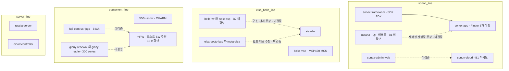

## 응답 언어

> **IMPORTANT**: 사용자에게 응답할 때는 반드시 **존댓말(경어)**을 사용한다. 반말 금지.
> **IMPORTANT**: 응답/설명/코멘트에 **일본어 사용 금지**. 한국어 또는 영어만 사용한다.

## 소스 코드 언어

> **IMPORTANT**: 우리가 작성하는 코드(스크립트 등) 안(로그 메시지, 문자열 리터럴, 식별자, UI 텍스트)에는 **한글 사용 금지** — 영어만 사용한다. **코멘트는 예외**(한국어 허용).

## 이 워크스페이스의 성격

> **IMPORTANT**: `mobile/`·`desktop/`·`web/`·`server/`·`device/`·`fpga/` 아래는 전부 **힐세리온(외부사) 소유 소스의 read-only 미러**다.
>
> - **편집·커밋·push 절대 금지.** 검토(read) 목적으로만 클론했다.
> - 상태 확인: `make git-status` — 하단 `Mirrors:` 줄에 편집된 미러가 뜨면 `make git-sync-legacy ARGS=--clean` 으로 되돌린다.
> - 각 미러 안의 `CLAUDE.md`·`docs/` 는 **힐세리온이 작성한 파일**이다. 그들의 개발 관행을 읽는 자료이지 우리가 고칠 대상이 아니다.
> - **우리 산출물은 루트 git(`healcerion-platform`)의 `docs/`·`scripts/` 에만 쓴다.**

목적: **HLAB-2487 — 힐세리온 전체 SW 리팩토링 검토**. 기존 SW(FW·앱 등)를 cctv-platform 과 유사한 형태로 리팩토링하는 안의 타당성과 기존 대비 장단점을 검토한다. 현 단계는 **인벤토리·갭 분석**이며 구현 단계가 아니다.

## 폴더 구조

루트(`healcerion-platform`)는 우리 검토 문서·스크립트만 관리하고, 하위 컨테이너 폴더는 Phabricator 미러를 담는다(루트 git 비추적).

> **IMPORTANT**: git 명령(status, diff, log 등)은 반드시 `git -C <path>` 로 해당 저장소에서 실행한다. 루트에서 실행하면 엉뚱한 저장소를 건드린다.

컨테이너 이름은 **cctv-platform 의 어휘를 그대로 쓴다**(`mobile`·`desktop`·`web`·`server`·`device`·`device/bsp`). 본 검토의 논제가 "cctv-platform 과 유사한 형태" 이므로, 힐세리온 저장소를 같은 어휘에 얹어 **어디가 맞고 어디가 안 맞는지를 구조 자체로 드러내기** 위함이다. cctv 에 대응 축이 없는 `fpga/` 는 healcerion 고유 축으로 남긴다.

| 폴더 | 설명 | cctv 대응 |
|------|------|-----------|
| `docs/` | **우리 검토 산출물** — 루트 git 관리 | `docs/` |
| `docs/review/` | **기존 코드 분석 정리** — 미러를 읽고 현행 구조를 정리하는 곳. 개발 환경 현황 = `dev-environment.md` | `docs/development/` |
| `Makefile` | cross-repo 오케스트레이션 (아래 §표준 CLI) | `Makefile` |
| `scripts/` | `clone-repos.sh` · `git-status.sh` · `pull-mirrors.sh` | `scripts/` |
| `tmp/` | 임시·핸드오프 (루트 git 비추적, 정식 문서 아님) | `tmp/` |
| `mobile/` | Flutter 클라이언트 앱 + 그 앱 전용 SDK/ADK | `mobile/mobile-app` |
| `desktop/` | 데스크톱·콘솔형 장비 호스트 SW | `desktop/cms-app` 외 |
| `web/` | 웹 UI | `web/` |
| `server/` | 서버·클라우드 | `server/` |
| `device/` | 장비 펌웨어·MCU·yocto | `device/ipc-app`·`xvr-app` |
| `fpga/` | FPGA (**cctv 대응 없음**) | — |

각 컨테이너의 실제 코드는 전부 그 아래 `legacy/` 에 있다 — 아래 절 참조.

`sonex-framework` 는 저장소 설명이 "sonex **앱의** SDK, ADK" 로 앱 전용이라 `mobile/` 안에 둔다. cctv 의 `shared/flutter/aivue_client`(web-app·mobile-app **양쪽**이 공유)와 달리 소비처가 하나뿐이므로 `shared/` 축을 만들지 않는다.

### 원본 소스 배치 — `<컨테이너>/legacy/`

> **IMPORTANT**: **현재 미러 전부가 `legacy/` 아래 있다.** 리팩토링을 아직 하나도 하지 않았으므로 지금 있는 모든 코드는 리팩토링의 **입력물(원본)** 이다. 컨테이너 최상위는 **우리 산출물이 생길 때까지 비워 둔다.**

`legacy/` 는 컨테이너 6개 전부에 동일하게 둔다. 이 계층이 표시하는 것은 구/신 관계가 아니라 **소유권**이다 — `legacy/` 아래는 전부 힐세리온 소유의 read-only 입력물이고, 우리가 만든 것은 하나도 없다. 그래서 경로를 찍거나 grep 하거나 문서에 인용할 때마다 그 사실이 함께 따라온다.

**컨테이너 최상위가 비어 있는 것이 현재의 정상 상태다.** 리팩토링 착수 전이므로 우리 산출물이 아직 없다.

| 컨테이너 | `legacy/` 내용 (33건) |
|---|---|
| `mobile/legacy/` | `sonex-app` · `sonex-framework` · `moana` · `ginny-string-table-converter` |
| `web/legacy/` | `sonex-admin-web` |
| `server/legacy/` | `sonex-cloud-backend` · `sonon-cloud` · `russia-server` · `dicomcontroller` |
| `desktop/legacy/` | `cuattro-sdk` |
| `device/legacy/` | `ginny-fw`(300계) · `elsa-fw` · `belle-fw`·`belle-bsp`·`belle-kernel`·`belle-u-boot`·`belle-fsbl`·`belle-pmu`(500계 = belle) · `500c-sn-fw` · `belle-msp` · `elsa-yocto-bsp` · `meta-elsa` |
| `fpga/legacy/` | `ginny-fpga` · `ginny-renewal` · `ginny-table` · `elsa-dump-fpga` · `elsa-fpga` · `charm-fpga` · `fuji-oem-us-fpga` · `ash-fpga` · `bf-delay-calculation` |

> **`desktop/` 의 근거는 `cuattro-sdk` 하나다** — "Cuattro 용 window SDK C# 포팅"(네이티브 DLL + WinForms 앱). cctv 는 `desktop/cms-app`(앱)인데 여기는 SDK 뿐이라는 **비대칭 자체가 검토 결과물**이라 축을 유지한다. `cuattro-sdk` 는 `moana/framework/SononClient` 의 포크다(파일 17개 중 15개 동명).

> **하지 말 것**: 구/신 관계(예: `belle-fw` → `elsa-fw`, `Moana` → `sonex`)를 **폴더 구조로 표현하지 않는다.** 그것은 분석의 *결론*이지 전제가 아니며, 현재 전부 미검증 주장이다. 관계는 `docs/review/` 문서에 근거와 함께 기록한다.

> **IMPORTANT (이름 확정 — 재논의 금지)**: 폴더명은 **`legacy`** 다. 여기서 legacy 는 최신/구식이 아니라 **우리가 만들지 않은, 리팩토링의 입력물**이라는 뜻이다.
>
> **이 항목을 세션 판단으로 다시 바꾸지 않는다. 디스크와 이 문서가 어긋나면 이 문서가 맞다 — 고치지 말고 멈춰서 물어본다.**

## 표준 CLI

`make help` 가 진입점이다. **현 단계에서는 git 계열만 제공한다** — 이 워크스페이스는 검토용이라 빌드·배포 타겟이 없다.

> **IMPORTANT**: 루트와 미러는 **pull/push 의 의미가 정반대**라 타겟을 반드시 분리한다. 루트는 우리 작업물이라 절대 잃으면 안 되고(ff-only), 미러는 로컬 상태를 언제나 버린다(`reset --hard`). 한 타겟에 섞으면 루트 작업물이 날아간다.

| 대상 | 타겟 | 동작 |
|---|---|---|
| **루트** | `make git-status` | **working 저장소만** 표로 표시. 미러는 요약 한 줄이고 편집된 것만 이름이 뜬다 |
| **루트** | `make git-pull` | origin 에서 **ff-only** pull. 미커밋 변경이 있으면 **거부** |
| **루트** | `make git-push` | origin 으로 push (원격 = `beomsikpark/healcerion-platform`) |
| **미러** | `make git-clone` | 누락분 클론 (재실행 안전, 기존은 SKIP) |
| **미러** | `make git-sync-legacy` | origin 으로 **강제 동기화**(`reset --hard`). `ARGS=--dry-run` · `--clean` · 경로 부분문자열 |

`git-status` 는 미러를 행으로 나열하지 않는다. read-only 미러는 어차피 강제 동기화로 버려지므로 "상태"가 의미를 갖지 않기 때문이다. 다만 오편집 감지는 남길 가치가 있어 요약 한 줄로 접었고, **편집된 미러가 있을 때만** 이름을 드러낸다.

> 미러 복구는 반드시 **`ARGS=--clean`** 을 붙인다. `--clean` 없는 동기화는 추적 파일만 되돌리므로 실수로 만든 untracked 파일이 살아남아 계속 EDITED 로 잡힌다(실측 확인).

> `make git-push-all`·`git-commit` 은 존재하되 **거부**한다 — cctv 에서 손에 익은 명령이 미러까지 밀어버리는 것을 막는다. `make build`·`test`·`clean` 도 거부한다(우리는 빌드하지 않는다).

`pull-mirrors.sh` 는 저장소 목록을 **디스크에서 탐색**한다(하드코딩 배열 아님) — 경로 매핑의 SOT 는 `clone-repos.sh` 하나이고, 사본을 두면 어긋나기 때문이다. cctv 의 `pull-all.sh` 가 배열을 갖는 것과 다른 선택이다.

> **알려진 제약**: `.claude/settings.json` 의 `deny` 에 `Bash(git push*)` 가 있어 **에이전트는 `make git-push` 를 실행할 수 없다.** 미러 보호용 규칙이 루트 push 까지 함께 막는다. `Bash(git -C * push*)` 만 남기면 해소된다. 같은 파일의 `git -C * reset*`·`rebase*` 도 복구 경로를 막는 오류이나 classifier 로 수정이 차단돼 있다.

### 저장소 목록

> **IMPORTANT (측정 규칙)**: **활동성은 반드시 `--all`(전 브랜치) 기준으로 측정한다.** 이 조직은 **master 에서 작업하지 않는다.** master 만 보면 9개 저장소가 멈춘 것으로 보인다 — 예: `belle-fw` master 4커밋/2021-09 vs 전체 66커밋/**2026-07-01**, `moana` master 4,433/2022-02 vs 전체 **5,705**/**2026-07-27**. 실제 작업 브랜치는 `production-fw-ver2.0`·`service_QT693`·`FW_1_1_8_0`·`feature-apply_*` 같은 이름을 갖는다.
> ```bash
> git -C <repo> rev-list --count --all
> git -C <repo> for-each-ref --sort=-committerdate --format='%(committerdate:short) %(refname:short)' refs/remotes | head -1
> ```

Phabricator 저장소 **56개** = **클론 대상 33** + 범위 제외(신호처리·시뮬레이터 R&D · 사내 인프라 3 · upstream 포크 2) + 중복·연습·inactive. `id` = Phabricator repo id (클론 URI에 사용). 아래 **commits 는 `--all` 기준**, **최종은 전 브랜치 최신 커밋일**이다(2026-07-27 실측).

| id | callsign | 로컬 경로 | commits | 크기 | 최초~최종 | 내용 |
|----|---|-----------|--------:|------|---|------|
| 76 |`SAPP` | `mobile/legacy/sonex-app` | 249 |510M | 2024-04 ~ 2026-07 | **Flutter sonex 앱**. 실제 타깃은 4개(linux·web 은 stub) |
| 74 |`SFW` | `mobile/legacy/sonex-framework` | 524 |2.0G | 2023-05 ~ 2026-07 | **sonex 앱의 SDK·ADK**. 미러 중 최신 |
| 47 |`M` | `mobile/legacy/moana` | 5705 |9.4G | 2018-06 ~ 2026-07 | **Moana (Qt). 저자 17명, 9.4G 로 미러 중 최대. `service_QT693` 브랜치에서 현재도 개발 중** |
| 42 |`GST` | `mobile/legacy/ginny-string-table-converter` | 10 |208K | 2017-04 ~ 2017-07 | XLSX → 앱 문자열 변환 도구 |
| 73 |`SAW` | `web/legacy/sonex-admin-web` | 1 |57M | 2023-01 ~ 2023-01 | SoNex cloud admin web site |
| 71 |`SCBE` | `server/legacy/sonex-cloud-backend` | 16 |3.1M | 2022-09 ~ 2025-05 | **SoNex cloud web application server + DB server** |
| 62 |`CL` | `server/legacy/sonon-cloud` | 394 |169M | 2019-03 ~ 2026-06 | **sonon web admin site. 저자 9명, 현재 운영 중** |
| 65 |`RUS` | `server/legacy/russia-server` | 3 |204K | 2021-01 ~ 2023-03 | REST API test server (Russia ambulance) |
| 26 |`HDC` | `server/legacy/dicomcontroller` | 14 |17M | 2015-09 ~ 2017-12 | DICOM SCU 라이브러리 + iOS 샘플 |
| 45 |`CS` | `desktop/legacy/cuattro-sdk` | 58 |1.6M | 2017-10 ~ 2018-12 | Cuattro 용 Windows SDK (C# 포팅) |
| 17 |`HFW` | `device/legacy/ginny-fw` | 1661 |216M | 2013-01 ~ 2021-07 | **300 시리즈 펌웨어. 저자 6명 — 펌웨어 개발 이력의 본체** |
| 60 |`FW` | `device/legacy/elsa-fw` | 74 |70M | 2020-09 ~ 2021-08 | ginny·belle 2세대 혼재 |
| 50 |`BF` | `device/legacy/belle-fw` | 66 |87M | 2021-08 ~ 2026-07 | **Belle Firmware** |
| 53 |`BB` | `device/legacy/belle-bsp` | 18 |9.7M | 2021-08 ~ 2022-05 | **Belle BSP** |
| 51 |`BK` | `device/legacy/belle-kernel` | 5 |1.2G | 2021-08 ~ 2021-10 | **Belle Kernel** (현행 빌드 계통) |
| 52 |`BU` | `device/legacy/belle-u-boot` | 9 |158M | 2021-08 ~ 2022-04 | **Belle U-Boot** |
| 54 | `BFS` | `device/legacy/belle-fsbl` | — | 124K | — | **Belle FSBL** (ZynqMP BOOT.BIN 구성) |
| 55 | `BP` | `device/legacy/belle-pmu` | — | 124K | — | **Belle PMU** (ZynqMP PMU 펌웨어) |
| 75 |— | `device/legacy/500c-sn-fw` | 71 |74M | 2023-06 ~ 2026-04 | 500C Firmware (`[LAB] CHARM`), Socionext 베어메탈 |
| 70 |— | `device/legacy/belle-msp` | 6 |12M | 2022-04 ~ 2022-05 | MSP430 MCU 전원·감시 펌웨어 |
| 34 |`EY` | `device/legacy/elsa-yocto-bsp` | 60 |236K | 2013-03 ~ 2016-08 | **BSP 아님** — `repo` 매니페스트 |
| 36 |`ME` | `device/legacy/meta-elsa` | 7 |268K | 2016-06 ~ 2016-07 | bbappend 3개 오버레이 |
| 68 |`FF` | `fpga/legacy/fuji-oem-us-fpga` | 20 |5.6M | 2021-09 ~ 2022-01 | FUJI OEM 64Ch. ginny 계보의 포크 |
| 58 |`FGR` | `fpga/legacy/ginny-renewal` | 87 |119M | 2020-03 ~ 2021-01 | 300 series ginny FPGA renewal |
| 40 |`GT` | `fpga/legacy/ginny-table` | 96 |122M | 2016-08 ~ 2017-04 | **HDL 없음** — 배포 아티팩트 저장소 |
| 56 |`EF` | `fpga/legacy/elsa-fpga` | 107 |9.8M | 2018-12 ~ 2022-02 | ginny → fuji 계보의 중간 |
| 72 |`CF` | `fpga/legacy/charm-fpga` | 12 |45M | 2022-09 ~ 2022-12 | 500C 용 FPGA |
| 18 |`GF` | `fpga/legacy/ginny-fpga` | 194 |386M | 2015-08 ~ 2019-07 | (설명 없음) |
| 48 |`EDF` | `fpga/legacy/elsa-dump-fpga` | 41 |3.0M | 2018-07 ~ 2019-02 | `elsa-fpga` 의 출발점 |
| 41 |`AF` | `fpga/legacy/ash-fpga` | 61 |17M | 2017-02 ~ 2017-08 | Ash FPGA |
| 43 |`BDC` | `fpga/legacy/bf-delay-calculation` | 2 |896K | 2017-04 ~ 2018-03 | **Beamforming Delay Calculation** (테이블 생성기) |

**inactive 6건은 클론 불가**(SSH 비활성) — 32 phabricator-to-slack · 38 test · 44 cuattro-SDK · 59 esla-fw · 61 elsa-fw · 66 belle-fw · 67 belle-bsp · 69 belle-msp. **66·67 은 실물 `rBF`(50)·`rBB`(53) 와 다른 죽은 사본**이다. 이전 클론 스크립트가 66·67 을 겨냥한 것은 과녁이 틀린 것이었다.

**범위 보류 — 시뮬레이터·도플러 R&D(5)**: 23 doppler-simul · 29 DopplerAndroidTest · 30 Doppler_Simulator_Code · 31 doppler_simul_win · 33 sonon-simul. **접근은 가능하다.** 기존 컨테이너 6개 어디에도 맞지 않아 새 축이 필요해 보류했다 — 축 신설은 사용자 판단 사항.

**범위 보류 — 연습용**: 46 Moana Practice("Qt 환경 파악을 위한 practice용").

**범위 제외 — upstream 포크(2)**: 37 elsa-linux(`git.freescale.com/imx/linux-2.6-imx`) · 35 elsa-u-boot(`github.com/Freescale/u-boot-fslc`). **힐세리온이 쓴 코드가 아니고 우리는 빌드하지 않는다.** 커널·부트로더 버전은 저장소 설명만으로 확정되므로 수 GB 클론의 이득이 없다. (cctv 는 이것들을 클론하지만 cctv 는 *빌드하는* 환경이라 위상이 다르다.)

**범위 제외 — 신호처리 R&D(5)**: 77 NextSRI · 78 NextDoppler · 39 cf-doppler-neon · 49 US_Matlab_Simulator · 57 Frances-GUI-Simulator.

> **⚠ 이 제외 판단은 재검토가 필요하다.** "알고리즘 트랙이라 앱/FW 와 성격이 다르다"는 이유로 뺐으나, `sonex-framework/sdk/ai_models/speckle_noise_reduction/` 에 **HNS AI 필터가 학습 모델(.pth)부터 배포 아티팩트(ONNX·CoreML)까지 통째로 들어가 있다.** `NextSRI` 설명("NLM 필터 대체 / AI 적용 HNS")과 정확히 대응하며, 목적은 상용 라이브러리 **CVIE(Context Vision) 대체**다(`cvie_replacement_plan.md`). 즉 **신호처리 R&D 는 제품 SDK 의 일부**다 — 상세 = [docs/review/sonex-architecture.md](docs/review/sonex-architecture.md) §7.

**범위 제외 — 사내 개발 인프라(3)**: 63 DevOps · 64 phabricator · 32 phabricator-to-slack. 제품 SW 가 아니다 — 상세 = [docs/review/dev-environment.md](docs/review/dev-environment.md) §4.

**제외(6)**: 69 belle-msp·61 elsa-fw·59 esla-fw(중복/오타 사본, inactive) · 38 test · 27 Sanbox · 11 Sandbox Test

### 제품 라인 (저장소 설명 기준)

제품 라인 관계도. **점선 = 미확보(블로커) 또는 미검증 주장**이며, 실선만 코드로 확인한 것이다. 전부 `legacy/` 아래 있으므로 경로는 생략했다.



- **SONON / sonex** — 휴대형 초음파 앱 라인. `Moana`(Qt, 배포중) → `sonex`(Flutter, 개발중) 전환이 이미 진행 중인 구도
- **elsa / belle** — 동일 프로젝트의 두 이름(`belle-fw` 설명이 "elsa project firmware repo"). i.MX6 + Yocto 기반 장비 펌웨어 스택
- **CHARM(500C) · ginny(300 series) · FUJI OEM** — 별도 장비 라인. 콘솔형이라 호스트 SW(`rHFW` 추정)가 `desktop/` 에 온다
- **신호처리 R&D** — 알고리즘 트랙이라 **범위 제외**. `cf-doppler-neon` 만 rHFW 통합 예정이라 `desktop/` 축과 물려 있다

## Phabricator 접근

```bash
# 클론 (SSH user=git, port=2222 — vcs/22 아님. /diffusion/<id>/ 형태가 callsign 없는 repo 에도 동작)
git clone ssh://git@phab.healcerion.com:2222/diffusion/<repo-id>/

# Conduit API (SSH 경유 — 웹 토큰 불필요)
echo '{"queryKey":"all","limit":100}' | ssh -p 2222 git@phab.healcerion.com conduit diffusion.repository.search

# 전체 미러 갱신
./scripts/clone-repos.sh
```

- 웹 UI(`https://phab.healcerion.com/`)는 **로그인 필수**. 익명 접근 차단
- **inactive 저장소는 SSH 클론이 거부된다** (`This repository is not available over SSH`)

> 개발 환경 현황(저장소 메타 전수·권한 정책·우리 Linear/GitHub 기준 대비·미확인 항목)은 **[docs/review/dev-environment.md](docs/review/dev-environment.md) 가 SOT**. 여기서 중복 설명하지 않는다.

## 미해결 블로커

> 아래는 **우리 쪽에서 할 수 있는 확인을 모두 끝낸 뒤 남은 것**이다. 직접 시험 결과 = [docs/review/dev-environment.md](docs/review/dev-environment.md) §2.3~2.6

1. **~~저장소 5건 권한 차단~~ → 2026-07-27 해소.** 힐세리온이 권한을 열어 `Moana`·`sonon-cloud`·`belle-fw`·`belle-bsp`·`rHFW` 전부 클론했다. 가시 저장소 33 → 56건. **부수 효과가 더 컸다** — 존재조차 몰랐던 belle 빌드 계통(`belle-kernel`·`belle-u-boot`·`belle-fsbl`·`belle-pmu`)과 FPGA 4건(`ginny-fpga`·`elsa-dump-fpga`·`ash-fpga`·`bf-delay-calculation`), 서버 2건이 드러났다
2. **~~`belle-fw`·`belle-bsp` inactive~~ → 해소.** `R66`·`R67`(inactive)은 실물 `rBF`(50)·`rBB`(53)와 다른 죽은 사본이었다. 실물은 클론 완료
3. **~~`rHFW` 정체 불명~~ → 확정. 그러나 추정이 틀렸다** — `rHFW` = **`ginny-fw`, 300 시리즈 장비 펌웨어**(커밋 1,109개)이고 데스크톱 호스트 SW 가 아니다. `desktop/` 축의 근거가 바뀌었다(§폴더 구조)
4. **conduit 이 파라미터를 무시한다** — 어떤 조회든 첫 100건만 얻는다(§2.6). Maniphest(8777)·Phriction(1284) 전수 조사는 **웹 UI 로그인 또는 API 토큰**이 필요하다. `diffusion.repository.search` 는 56건 < 100 이라 완전하다
5. **Differential(코드리뷰) 앱 접근 차단** — `differential.revision.search` 가 "You do not have access to the application which provides this API method" 를 반환한다. 사용 여부 자체를 확인할 수 없다
6. **판단 대기 항목** — sonex 전환과의 중복 관계, "cctv-platform 유사 형태"의 정의 범위, 의료기기 규제(IEC 62304 / ISO 14971) 제약, 반입 승인. 상세 = `tmp/handoff-hlab-2487.md`
7. **범위 판단 재개 필요** — 접근이 열리면서 보류 항목이 늘었다: 시뮬레이터·도플러 R&D 5건(새 컨테이너 축이 필요), 신호처리 R&D 5건(제외 판단이 이미 재검토 대상), `Moana Practice`

## 확인된 검토 사실

코드로 확인한 것만 적는다. 저장소 설명·PPT 는 주장이며 여기 넣지 않는다. 상세는 [docs/review/](docs/review/) 참조.

- **호스트 앱이 2계열 병행이다** — `moana`(Qt/QML, 타깃 6개, 모델 10종, 최종 2026-07-27)와 `sonex`(Flutter, 타깃 **4개** — `linux`·`web` 은 `flutter create` 스텁, 모델 5종). **Moana 쪽이 더 넓고 더 성숙하다.** "Moana → sonex 전환" 이 아니라 병행 유지로 보는 것이 코드에 부합하며, 판단 대기 1번이 여기서 갈린다
- **장비 펌웨어 세대는 `ginny-fw`(1,661커밋) → `elsa-fw`(74) → `belle-fw`(66, 현행 생산)** 이고, 세대 전환마다 새 저장소로 임포트돼 **git 이력이 두 번 끊겼다**
- **변종 선택이 퇴화했다** — `ginny-fw` 는 u-boot 환경변수로 런타임에 5개 모델을 고르는 **단일 유니버설 이미지**였는데, `belle-fw` 는 `-D_USING_500L_DEV_` 등 **컴파일 타임 분기**로 되돌아갔다
- **인증·국가·고객사·하드웨어 리비전을 브랜치로 영구 분기한다** — 앱·펌웨어 공통. `ginny-fw` 는 브랜치 29개 중 6개만 병합됐다. 이 방식의 비용이 실제로 발생했다(`moana` 의 CE/US 빌드 뒤바뀜 출하 사고)
- **HC 프로토콜(TCP 1234/1235, 14바이트 `'H','C'` 헤더)이 7개 코드베이스에 복제돼 있고 정본 선언이 둘로 갈렸다** — `PACKET_HEADER_S`(`500c-sn-fw`)와 `COMMON_PACKET_HEADER`(`moana`)가 `recv_id` 타입부터 다르다. **통합 효과가 가장 큰 표면**
- **`belle-fw` 의 메인 바이너리 `sonon` 은 PetaLinux rootfs 에 없다** — 부팅 시 UBI 오버레이(mtd4/5)를 live rootfs 위로 복사한다. 빌드가 PetaLinux · ad-hoc 셸 · 저장소 밖 Vivado/커널모듈 **3개로 갈라져 절대경로로 이어져 있다**
- **`fpga/` 는 독립 축이 아니다** — `elsa-fw/configs/300l` 이 `ginny-table` 과 31파일 MD5 동일이고, 비트스트림 IDCODE 가 전부 `0x03631093`(Artix-7 XC7A100T)이다. FPGA 계보는 MD5 동일 파일 수로 확정했다(`elsa-fpga`→`fuji` 48건 등)
- **CI 가 31건 전부 0건이고, 실제 자동 테스트는 3건뿐**이다(`sonon-cloud`·`sonex-app`·FPGA 골든 모델). 의료기기 규제 검토(판단 대기 5번)의 핵심 공백

## 파일 탐색 범위

> **IMPORTANT**: 파일 탐색/검색은 이 워크스페이스 아래에서만 수행한다. cctv 등 다른 워크스페이스는 명시적 요청 시에만 참조한다.

C++ 코드 탐색은 **LSP(clangd) 우선**(Grep 은 동명 함수·주석 오탐). 단 미러에는 `compile_commands.json` 이 없을 수 있어 LSP 가 안 뜨면 Grep 으로 내려온다 — 이때 "환경 부재" 로 단정하지 않는다.

> **IMPORTANT (도구 함정)**: 이 환경의 `grep` 은 **ugrep** 이고 **`.gitignore` 를 존중한다.** 루트 `.gitignore` 에 컨테이너 6개(`/mobile/`·`/desktop/`·`/web/`·`/server/`·`/device/`·`/fpga/`)가 들어 있으므로 **워크스페이스 루트에서 재귀 grep 하면 미러가 한 건도 검색되지 않는다.** 결과가 `0건` 으로 나와도 그것은 "없다" 가 아니라 **"아무것도 안 봤다"** 이다.
>
> **미러를 검색할 때는 반드시 저장소 경로를 명시한다.**
> ```bash
> grep -rn '<패턴>' device/legacy/500c-sn-fw          # 좋음
> grep -rn '<패턴>' .                                  # 미러가 전부 빠진다
> git -C <repo> grep -n '<패턴>' <ref>                 # 브랜치 지정 시 이쪽
> ```
> 인코딩도 주의한다 — ISO-8859 파일은 `grep -a` 없이는 매칭되지 않는다.

## 작업 방식

### 에이전트

- **직접이 기본.** 위임은 작업 *크기*가 아니라 *형태*로 가른다
- 광범위 탐색(수십 저장소 훑어 결론만) → `Explore` · 설계 → `Plan` · 독립 병렬 다건 → `general-purpose`
- `Workflow`(다중 에이전트 오케스트레이션)는 **사용자 명시 요청 시에만**
- 위임 완료는 하니스가 자동 통지한다 — 폴링 금지

### 검증은 adversarial(refute)로

- 검증자는 **결론을 반증하려는 관점**으로 코드를 직접 읽는다. 승인 모드·표면 검토는 검증이 아니다
- **증거 차원 혼동 금지**: 존재("X가 있다")·순서·동일성·인과는 서로 다른 차원이며, 각 결론은 같은 차원의 증거로만 도출한다. 특히 동일성은 식별자 매칭(commit SHA, hash)으로만 확정
- 대리증거("클론 성공했으니 코드가 온전하다")로 "검증됨" 선언 금지

### 검토 문서의 사실성

- 저장소 설명·PPT·이메일은 **주장**이지 사실이 아니다. 코드로 확인한 것과 전해 들은 것을 문서에서 구분해 표기한다
- 미확인 항목은 "미확인"으로 남긴다. 서사로 메꾸지 않는다

## 문서 작성 규칙

- **장황 금지**(표현만 간결히 — 필요 정보 제거 아님): 같은 내용 반복, 옵션 A/B/C 비교 사고 과정, 자명한 서두/마무리, cross-ref 가능한 내용 본문 복사 회피
- 다이어그램은 반드시 **Mermaid**(```` ```mermaid ````). ASCII art·텍스트 도식 금지. UI 와이어프레임은 HTML
- 시간(주·일·시간) 추정 금지 — Phase/순서만 표기

> **IMPORTANT (Mermaid 검증 의무)**: 문서 작성/수정 후 아래로 검증하고 통과한 뒤에만 완료 보고한다.

```bash
PUPPETEER_EXECUTABLE_PATH=/usr/bin/google-chrome-stable python3 -c "
import re, sys, subprocess, tempfile, os
content = open(sys.argv[1]).read()
blocks = re.findall(r'\`\`\`mermaid\n(.*?)\`\`\`', content, re.DOTALL)
if not blocks: print('No mermaid blocks found'); sys.exit(0)
env = os.environ.copy()
for i, b in enumerate(blocks):
    f = tempfile.NamedTemporaryFile(suffix='.mmd', mode='w', delete=False)
    f.write(b); f.close()
    out = tempfile.NamedTemporaryFile(suffix='.svg', delete=False); out.close()
    r = subprocess.run(['mmdc','-i',f.name,'-o',out.name], capture_output=True, text=True, env=env)
    os.unlink(f.name)
    try: os.unlink(out.name)
    except: pass
    print(f'Block {i+1}: {\"OK\" if r.returncode==0 else \"ERROR\"}')
    if r.returncode != 0: print(r.stderr); sys.exit(1)
" <파일경로>
```

**VSCode 렌더러 호환 금지 패턴**: participant/node label 안 `<br/>` · 메시지 레이블의 `{}`·`→` · alias 의 `/` · `subgraph id["label"]` 분리 syntax · subgraph/node id 의 하이픈(underscore 만) · multi-source 화살표(`A & B --> C`)

## 커밋 규칙

- **커밋은 사용자가 명시적으로 요청할 때만.**
- **커밋 대상은 루트 `healcerion-platform` 뿐이다.** 미러 저장소에는 절대 커밋·push 하지 않는다
- 커밋 메시지는 한국어 또는 영어(conventional commit type 사용)
