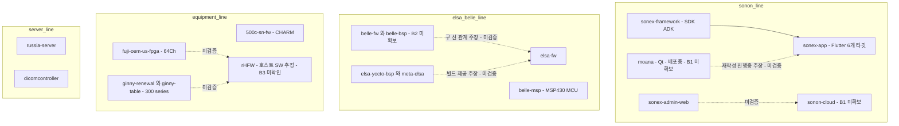

## 응답 언어

> **IMPORTANT**: 사용자에게 응답할 때는 반드시 **존댓말(경어)**을 사용한다. 반말 금지.
> **IMPORTANT**: 응답/설명/코멘트에 **일본어 사용 금지**. 한국어 또는 영어만 사용한다.

## 소스 코드 언어

> **IMPORTANT**: 우리가 작성하는 코드(스크립트 등) 안(로그 메시지, 문자열 리터럴, 식별자, UI 텍스트)에는 **한글 사용 금지** — 영어만 사용한다. **코멘트는 예외**(한국어 허용).

## 이 워크스페이스의 성격

> **IMPORTANT**: `mobile/`·`desktop/`·`web/`·`server/`·`device/`·`fpga/` 아래는 전부 **힐세리온(외부사) 소유 소스의 read-only 미러**다.
>
> - **편집·커밋·push 절대 금지.** 검토(read) 목적으로만 클론했다. cctv 의 `device/fw-orig` 와 동일한 위상.
> - 상태 확인: `./scripts/git-status.sh` — 미러에 DIRTY 가 뜨면 실수로 편집한 것이므로 되돌린다.
> - 각 미러 안의 `CLAUDE.md`·`docs/` 는 **힐세리온이 작성한 파일**이다. 그들의 개발 관행을 읽는 자료이지 우리가 고칠 대상이 아니다.
> - **우리 산출물은 루트 git(`healcerion-platform`)의 `docs/`·`scripts/` 에만 쓴다.**

목적: **HLAB-2487 — 힐세리온 전체 SW 리팩토링 검토**. 기존 SW(FW·앱 등)를 cctv-platform 과 유사한 형태로 리팩토링하는 안의 타당성과 기존 대비 장단점을 검토한다. 현 단계는 **인벤토리·갭 분석**이며 구현 단계가 아니다.

## 폴더 구조

루트(`healcerion-platform`)는 우리 검토 문서·스크립트만 관리하고, 하위 컨테이너 폴더는 Phabricator 미러를 담는다(루트 git 비추적).

> **IMPORTANT**: git 명령(status, diff, log 등)은 반드시 `git -C <path>` 로 해당 저장소에서 실행한다. 루트에서 실행하면 엉뚱한 저장소를 건드린다.

컨테이너 이름은 **cctv-platform 의 어휘를 그대로 쓴다**(`mobile`·`desktop`·`web`·`server`·`device`·`device/bsp`). 본 검토의 논제가 "cctv-platform 과 유사한 형태" 이므로, 힐세리온 저장소를 같은 어휘에 얹어 **어디가 맞고 어디가 안 맞는지를 구조 자체로 드러내기** 위함이다. cctv 에 대응 축이 없는 `fpga/` 는 healcerion 고유 축으로 남긴다.

| 폴더 | 설명 | cctv 대응 |
|------|------|-----------|
| `docs/` | **우리 검토 산출물** — 루트 git 관리 | `docs/` |
| `docs/review/` | **기존 코드 분석 정리** — 미러를 읽고 현행 구조를 정리하는 곳. 개발 환경 현황 = `dev-environment.md` | `docs/development/` |
| `Makefile` | cross-repo 오케스트레이션 (아래 §표준 CLI) | `Makefile` |
| `scripts/` | `clone-repos.sh` · `git-status.sh` · `pull-mirrors.sh` | `scripts/` |
| `tmp/` | 임시·핸드오프 (루트 git 비추적, 정식 문서 아님) | `tmp/` |
| `mobile/` | Flutter 클라이언트 앱 + 그 앱 전용 SDK/ADK | `mobile/mobile-app` |
| `desktop/` | 데스크톱·콘솔형 장비 호스트 SW | `desktop/cms-app` 외 |
| `web/` | 웹 UI | `web/` |
| `server/` | 서버·클라우드 | `server/` |
| `device/` | 장비 펌웨어·MCU·yocto | `device/ipc-app`·`xvr-app` |
| `fpga/` | FPGA (**cctv 대응 없음**) | — |

각 컨테이너의 실제 코드는 전부 그 아래 `orig/` 에 있다 — 아래 절 참조.

`sonex-framework` 는 저장소 설명이 "sonex **앱의** SDK, ADK" 로 앱 전용이라 `mobile/` 안에 둔다. cctv 의 `shared/flutter/aivue_client`(web-app·mobile-app **양쪽**이 공유)와 달리 소비처가 하나뿐이므로 `shared/` 축을 만들지 않는다.

### 원본 소스 배치 — `<컨테이너>/orig/`

> **IMPORTANT**: **현재 미러 전부가 `orig/` 아래 있다.** 리팩토링을 아직 하나도 하지 않았으므로 지금 있는 모든 코드는 리팩토링의 **입력물(원본)** 이다. 컨테이너 최상위는 **우리 산출물이 생길 때까지 비워 둔다.**

cctv 의 `device/fw-orig` 와 같은 위상이되 펌웨어에 한정되지 않으므로 `orig/` 로 통일한다. 다만 **cctv 는 리팩토링이 끝난 상태**라 `fw-orig` 옆에 산출물(`ipc-app`·`xvr-app`)이 있고, healcerion 은 **착수 전**이라 산출물 쪽이 비어 있다. 이 비대칭이 정상이다.

| 컨테이너 | `orig/` 내용 |
|---|---|
| `mobile/orig/` | `sonex-app` · `sonex-framework` · `moana`(**미확보** — B1) |
| `web/orig/` | `sonex-admin-web` |
| `server/orig/` | `russia-server` · `dicomcontroller` · `sonon-cloud`(**미확보** — B1) |
| `device/orig/` | `belle-msp` · `elsa-fw` · `500c-sn-fw` · `elsa-yocto-bsp` · `meta-elsa` · `belle-fw`·`belle-bsp`(**미확보** — B2) |
| `fpga/orig/` | `fuji-oem-us-fpga` · `ginny-renewal` · `ginny-table` |
| `desktop/orig/` | `rHFW`(**미확인** — B3) |

> **하지 말 것**: 구/신 관계(예: `belle-fw` → `elsa-fw`, `Moana` → `sonex`)를 **폴더 구조로 표현하지 않는다.** 그것은 분석의 *결론*이지 전제가 아니며, 현재 전부 미검증 주장이다. 관계는 `docs/review/` 문서에 근거와 함께 기록한다.

**이름이 `orig` 인 이유(확정)**: cctv 의 `fw-orig` 는 firmware 전용이라 앱·FPGA·서버가 섞인 여기엔 안 맞는다. `legacy` 는 사실과 다르다 — `sonex-framework` 는 최종 커밋 2026-07-23 으로 미러 중 가장 최신이다. `orig` = 리팩토링 **입력물**.

## 표준 CLI

`make help` 가 진입점이다. **현 단계에서는 git 계열만 제공한다** — 이 워크스페이스는 검토용이라 빌드·배포 타겟이 없다.

| 타겟 | 동작 |
|---|---|
| `make git-status` | 루트 + 미러 13건 상태. **DIRTY = 실수로 편집한 것** |
| `make git-clone` | 누락 미러 클론 (재실행 안전, 기존은 SKIP) |
| `make git-pull` | 미러를 origin 으로 **강제 동기화**(`reset --hard`). `ARGS=--dry-run` · `--clean` · 경로 부분문자열 |

> **`make git-push`·`git-push-all`·`git-commit` 는 존재하되 거부한다.** cctv 에서 손에 익은 명령을 무심코 쳤을 때 조용히 성공하지 않고 여기서 멈추게 하기 위함이다. `make build`·`test`·`clean` 도 같은 이유로 거부한다.

`pull-mirrors.sh` 는 저장소 목록을 **디스크에서 탐색**한다(하드코딩 배열 아님) — 경로 매핑의 SOT 는 `clone-repos.sh` 하나이고, 사본을 두면 어긋나기 때문이다. cctv 의 `pull-all.sh` 가 배열을 갖는 것과 다른 선택이다.

### 저장소 목록

Phabricator 저장소 31개 = **클론 대상 15** + 범위 제외 10(R&D 5 · 사내 인프라 3 · upstream 포크 2) + 중복·연습 6. `id` = Phabricator repo id (클론 URI에 사용). commits·크기는 2026-07-27 클론 실측.

| id | 로컬 경로 | commits | 크기 | 내용 |
|----|-----------|---------|------|------|
| 76 | `mobile/orig/sonex-app` | 249 | 510M | **Flutter sonex 앱** — android·ios·linux·macos·web·windows 6개 타깃 |
| 74 | `mobile/orig/sonex-framework` | 524 | 2.0G | **sonex 앱의 SDK·ADK** (미러 중 최신 커밋 2026-07-23) |
| 73 | `web/orig/sonex-admin-web` | 1 | 57M | SoNex cloud admin web site |
| 65 | `server/orig/russia-server` | 3 | 200K | REST API test server (Russia ambulance) |
| 26 | `server/orig/dicomcontroller` | 14 | 17M | (설명 없음) |
| 70 | `device/orig/belle-msp` | 6 | 12M | MSP430 MCU 펌웨어 |
| 60 | `device/orig/elsa-fw` | 74 | 70M | (설명 없음) |
| 75 | `device/orig/500c-sn-fw` | 71 | 74M | 500C Firmware (`[LAB] CHARM`) |
| 34 | `device/orig/elsa-yocto-bsp` | 60 | 232K | Elsa Project BSP |
| 36 | `device/orig/meta-elsa` | 7 | 264K | meta-elsa yocto recipes |
| 66 | `device/orig/belle-fw` | — | — | **inactive — 클론 실패(B2)**. elsa project firmware repo |
| 67 | `device/orig/belle-bsp` | — | — | **inactive — 클론 실패(B2)**. elsa project firmware BSP |
| 68 | `fpga/orig/fuji-oem-us-fpga` | 20 | 4.9M | FUJI OEM 64Ch ultrasound equipment |
| 58 | `fpga/orig/ginny-renewal` | 87 | 119M | 300 series ginny FPGA renewal |
| 40 | `fpga/orig/ginny-table` | 96 | 121M | Ginny FPGA Table |

**범위 제외 — upstream 포크(2)**: 37 elsa-linux(`git.freescale.com/imx/linux-2.6-imx`) · 35 elsa-u-boot(`github.com/Freescale/u-boot-fslc`). **힐세리온이 쓴 코드가 아니고 우리는 빌드하지 않는다.** 커널·부트로더 버전은 저장소 설명만으로 확정되므로 수 GB 클론의 이득이 없다. (cctv 는 이것들을 클론하지만 cctv 는 *빌드하는* 환경이라 위상이 다르다.)

**범위 제외 — 신호처리 R&D(5)**: 77 NextSRI · 78 NextDoppler · 39 cf-doppler-neon · 49 US_Matlab_Simulator · 57 Frances-GUI-Simulator.

> **⚠ 이 제외 판단은 재검토가 필요하다.** "알고리즘 트랙이라 앱/FW 와 성격이 다르다"는 이유로 뺐으나, `sonex-framework/sdk/ai_models/speckle_noise_reduction/` 에 **HNS AI 필터가 학습 모델(.pth)부터 배포 아티팩트(ONNX·CoreML)까지 통째로 들어가 있다.** `NextSRI` 설명("NLM 필터 대체 / AI 적용 HNS")과 정확히 대응하며, 목적은 상용 라이브러리 **CVIE(Context Vision) 대체**다(`cvie_replacement_plan.md`). 즉 **신호처리 R&D 는 제품 SDK 의 일부**다 — 상세 = [docs/review/sonex-architecture.md](docs/review/sonex-architecture.md) §7.

**범위 제외 — 사내 개발 인프라(3)**: 63 DevOps · 64 phabricator · 32 phabricator-to-slack. 제품 SW 가 아니다 — 상세 = [docs/review/dev-environment.md](docs/review/dev-environment.md) §4.

**제외(6)**: 69 belle-msp·61 elsa-fw·59 esla-fw(중복/오타 사본, inactive) · 38 test · 27 Sanbox · 11 Sandbox Test

### 제품 라인 (저장소 설명 기준)

제품 라인 관계도. **점선 = 미확보(블로커) 또는 미검증 주장**이며, 실선만 코드로 확인한 것이다. 전부 `orig/` 아래 있으므로 경로는 생략했다.



- **SONON / sonex** — 휴대형 초음파 앱 라인. `Moana`(Qt, 배포중) → `sonex`(Flutter, 개발중) 전환이 이미 진행 중인 구도
- **elsa / belle** — 동일 프로젝트의 두 이름(`belle-fw` 설명이 "elsa project firmware repo"). i.MX6 + Yocto 기반 장비 펌웨어 스택
- **CHARM(500C) · ginny(300 series) · FUJI OEM** — 별도 장비 라인. 콘솔형이라 호스트 SW(`rHFW` 추정)가 `desktop/` 에 온다
- **신호처리 R&D** — 알고리즘 트랙이라 **범위 제외**. `cf-doppler-neon` 만 rHFW 통합 예정이라 `desktop/` 축과 물려 있다

## Phabricator 접근

```bash
# 클론 (SSH user=git, port=2222 — vcs/22 아님. /diffusion/<id>/ 형태가 callsign 없는 repo 에도 동작)
git clone ssh://git@phab.healcerion.com:2222/diffusion/<repo-id>/

# Conduit API (SSH 경유 — 웹 토큰 불필요)
echo '{"queryKey":"all","limit":100}' | ssh -p 2222 git@phab.healcerion.com conduit diffusion.repository.search

# 전체 미러 갱신
./scripts/clone-repos.sh
```

- 웹 UI(`https://phab.healcerion.com/`)는 **로그인 필수**. 익명 접근 차단
- **inactive 저장소는 SSH 클론이 거부된다** (`This repository is not available over SSH`)

> 개발 환경 현황(저장소 메타 전수·권한 정책·우리 Linear/GitHub 기준 대비·미확인 항목)은 **[docs/review/dev-environment.md](docs/review/dev-environment.md) 가 SOT**. 여기서 중복 설명하지 않는다.

## 미해결 블로커

> 아래는 **우리 쪽에서 할 수 있는 확인을 모두 끝낸 뒤 남은 것**이다. 직접 시험 결과 = [docs/review/dev-environment.md](docs/review/dev-environment.md) §2.3~2.6

1. **`Moana`·`sonon-cloud`·`belle-fw`·`rHFW` 4건이 프로젝트 멤버십으로 잠겨 있다** — callsign 직접 클론으로 **존재는 확정**했고(대조군과 응답이 다름), 차단 원인이 **프로젝트 멤버십 기반 view 정책**임도 확정했다. 우리 계정은 공용 임시 계정 `develop`(dev@healcerion.com) 이다.
   **남은 것은 하나뿐** — 어느 프로젝트의 멤버가 되어야 하는지. Phabricator 가 그 프로젝트 이름을 의도적으로 숨긴다. 후보: `[LAB] Moana`·`[LAB] SONON Cloud`·`[LAB] belle`·`[LAB] members`
2. **~~`belle-fw`·`belle-bsp` inactive → 활성화 요청~~ — 과녁이 틀렸다.** 우리에게 보이는 `R66`(callsign 없음, inactive)과 실물 `rBF`(active, 66 commits)는 **다른 저장소**다. 1번으로 흡수된다. `belle-bsp` 는 실물 callsign 미확인
3. **~~`rHFW` 존재 추정~~ → 존재 확정.** 1번으로 흡수
4. **conduit 이 파라미터를 무시한다** — 어떤 조회든 첫 100건만 얻는다(§2.6). Maniphest(8777)·Phriction(1284) 전수 조사는 **웹 UI 로그인 또는 API 토큰**이 필요하다
5. **Differential(코드리뷰) 앱 접근 차단** — 사용 여부 자체를 확인할 수 없다
5. **판단 대기 항목** — sonex 전환과의 중복 관계, "cctv-platform 유사 형태"의 정의 범위, 의료기기 규제(IEC 62304 / ISO 14971) 제약, 반입 승인. 상세 = `tmp/handoff-hlab-2487.md`
   (범위 경계 중 **신호처리 R&D 제외는 결정됨**, `fpga/` 는 유지)

## 확인된 검토 사실

코드로 확인한 것만 적는다. 저장소 설명·PPT 는 주장이며 여기 넣지 않는다.

- **`sonex-app` 은 단일 Flutter 코드베이스로 6개 플랫폼을 타깃한다** — `android`·`ios`·`linux`·`macos`·`web`·`windows` 디렉토리가 모두 존재하고, `installer/`·`webview2/`·`webview2_sdk/`·`run_macos_release.sh`·`run_release_with_logs.bat`·`setup_xcode_project.rb` 등 데스크톱 배포 자산을 갖는다.
  → cctv 는 `mobile/mobile-app`(Flutter)·`desktop/cms-app`(C++/Qt6)·`web/web-app`(Flutter)가 **별개 저장소**다. 즉 **컨테이너 축이 1:1로 안 맞는 첫 실증 사례**이며, cctv 형태로 가려면 이 단일 코드베이스를 쪼개거나 cctv 에 없는 축을 인정해야 한다. "cctv-platform 유사 형태"의 정의 범위(판단 대기 2번)가 여기서 실제로 갈린다.

## 파일 탐색 범위

> **IMPORTANT**: 파일 탐색/검색은 이 워크스페이스 아래에서만 수행한다. cctv 등 다른 워크스페이스는 명시적 요청 시에만 참조한다.

C++ 코드 탐색은 **LSP(clangd) 우선**(Grep 은 동명 함수·주석 오탐). 단 미러에는 `compile_commands.json` 이 없을 수 있어 LSP 가 안 뜨면 Grep 으로 내려온다 — 이때 "환경 부재" 로 단정하지 않는다.

## 작업 방식

### 에이전트

- **직접이 기본.** 위임은 작업 *크기*가 아니라 *형태*로 가른다
- 광범위 탐색(수십 저장소 훑어 결론만) → `Explore` · 설계 → `Plan` · 독립 병렬 다건 → `general-purpose`
- `Workflow`(다중 에이전트 오케스트레이션)는 **사용자 명시 요청 시에만**
- 위임 완료는 하니스가 자동 통지한다 — 폴링 금지

### 검증은 adversarial(refute)로

- 검증자는 **결론을 반증하려는 관점**으로 코드를 직접 읽는다. 승인 모드·표면 검토는 검증이 아니다
- **증거 차원 혼동 금지**: 존재("X가 있다")·순서·동일성·인과는 서로 다른 차원이며, 각 결론은 같은 차원의 증거로만 도출한다. 특히 동일성은 식별자 매칭(commit SHA, hash)으로만 확정
- 대리증거("클론 성공했으니 코드가 온전하다")로 "검증됨" 선언 금지

### 검토 문서의 사실성

- 저장소 설명·PPT·이메일은 **주장**이지 사실이 아니다. 코드로 확인한 것과 전해 들은 것을 문서에서 구분해 표기한다
- 미확인 항목은 "미확인"으로 남긴다. 서사로 메꾸지 않는다

## 문서 작성 규칙

- **장황 금지**(표현만 간결히 — 필요 정보 제거 아님): 같은 내용 반복, 옵션 A/B/C 비교 사고 과정, 자명한 서두/마무리, cross-ref 가능한 내용 본문 복사 회피
- 다이어그램은 반드시 **Mermaid**(```` ```mermaid ````). ASCII art·텍스트 도식 금지. UI 와이어프레임은 HTML
- 시간(주·일·시간) 추정 금지 — Phase/순서만 표기

> **IMPORTANT (Mermaid 검증 의무)**: 문서 작성/수정 후 아래로 검증하고 통과한 뒤에만 완료 보고한다.

```bash
PUPPETEER_EXECUTABLE_PATH=/usr/bin/google-chrome-stable python3 -c "
import re, sys, subprocess, tempfile, os
content = open(sys.argv[1]).read()
blocks = re.findall(r'\`\`\`mermaid\n(.*?)\`\`\`', content, re.DOTALL)
if not blocks: print('No mermaid blocks found'); sys.exit(0)
env = os.environ.copy()
for i, b in enumerate(blocks):
    f = tempfile.NamedTemporaryFile(suffix='.mmd', mode='w', delete=False)
    f.write(b); f.close()
    out = tempfile.NamedTemporaryFile(suffix='.svg', delete=False); out.close()
    r = subprocess.run(['mmdc','-i',f.name,'-o',out.name], capture_output=True, text=True, env=env)
    os.unlink(f.name)
    try: os.unlink(out.name)
    except: pass
    print(f'Block {i+1}: {\"OK\" if r.returncode==0 else \"ERROR\"}')
    if r.returncode != 0: print(r.stderr); sys.exit(1)
" <파일경로>
```

**VSCode 렌더러 호환 금지 패턴**: participant/node label 안 `<br/>` · 메시지 레이블의 `{}`·`→` · alias 의 `/` · `subgraph id["label"]` 분리 syntax · subgraph/node id 의 하이픈(underscore 만) · multi-source 화살표(`A & B --> C`)

## 커밋 규칙

- **커밋은 사용자가 명시적으로 요청할 때만.**
- **커밋 대상은 루트 `healcerion-platform` 뿐이다.** 미러 저장소에는 절대 커밋·push 하지 않는다
- 커밋 메시지는 한국어 또는 영어(conventional commit type 사용)
