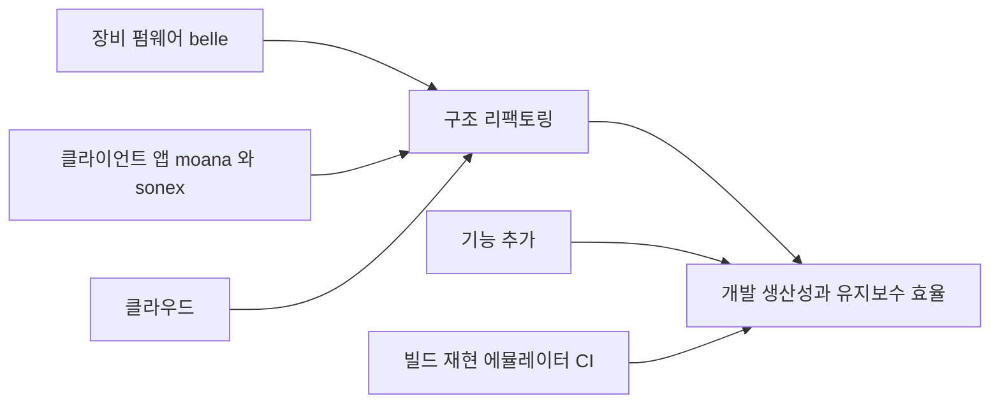

# healcerion-platform — 목적

**힐세리온 모바일 초음파 장치의 SW 를 인수해, 리팩토링과 기능 추가로 개발 생산성·유지보수 효율을 올린다.** (HLAB-2487)

새로 만드는 제품이 아니다. **이미 출하 중인 시스템이 입력물**이고 — 장비 펌웨어(belle, ZynqMP)와 클라이언트 앱(`moana` Qt · `sonex` Flutter), 그리고 이들이 붙는 클라우드 — 그 구조를 바꾸고 기능을 얹는 것이 일이다.

## 왜 필요한가

**기능 하나를 바꾸려면 3개 저장소·10개 이상 파일을 건드려야 하고, 고쳤는지 확인할 방법이 없다.** CI 는 검토한 31개 저장소 전부 0건이고, 회귀는 고객이 발견한다. 근거는 전부 코드 실측이며 상세는 [refactoring/why.md](refactoring/why.md).

## 무엇을 하는가

| 축 | 내용 | 상태 |
|---|---|---|
| **구조 리팩토링** | device·client 양쪽에 feature-first clean architecture. 프로토콜 정본 단일화 | 안 수립 — [refactoring/architecture.md](refactoring/architecture.md) |
| **기반 정비** | 빌드 재현(1커맨드) · 로컬 에뮬레이터 · E2E · CI | 안 수립 — [refactoring/emulator-e2e.md](refactoring/emulator-e2e.md) |
| **기능 추가** | 제품 기능 확장 | **대상 미정.** 힐세리온과 범위 합의 필요 |

구조와 기반이 기능 추가의 전제다 — 지금은 기능을 얹어도 검증할 수단이 없다. 반대로 리팩토링만으로는 힐세리온이 체감하는 산출물이 없으므로 셋을 함께 본다.

## 이 저장소가 담는 것

| 경로 | 소유 | 내용 |
|---|---|---|
| `docs/` · `scripts/` · `Makefile` | **우리** | 검토 산출물과 미러 오케스트레이션. 루트 git 관리 |
| `client/` `web/` `server/` `device/` `fpga/` 아래 `legacy/` | **힐세리온** | Phabricator 미러 33건. **read-only** — 편집·커밋 금지, 루트 git 비추적 |

컨테이너 최상위가 비어 있는 것이 현재의 정상 상태다. 리팩토링 착수 전이라 우리 산출물이 아직 없다. 배치 규칙의 SOT 는 루트 [CLAUDE.md](../CLAUDE.md).

## 현 단계

**인벤토리·갭 분석이다. 구현 단계가 아니다.** [refactoring/](refactoring/) 의 내용은 승인 전 제안이며, 결정된 실행 계획이 아니다.

## 문서

| 갈래 | 답하는 질문 |
|---|---|
| **[review/](review/)** | **지금 무엇이 있는가** — 기존 코드 실측. 다른 문서의 근거는 전부 여기로 수렴한다 |
| **[refactoring/](refactoring/)** | **무엇을 만들 것인가 · 왜 · 어떤 순서로** |

두 갈래 모두 **주장과 사실을 구분해 적는다** — 저장소 설명·PPT·힐세리온 자체 문서는 주장이고, 코드·해시·식별자로 확인한 것만 검증됨으로 표기한다. 미확인은 미확인으로 남긴다.
