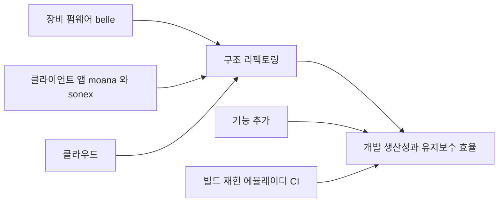

# healcerion-platform — 목적

**힐세리온 모바일 초음파 장치의 SW 리팩토링을 위탁 수행해, 개발 생산성·유지보수 효율을 올린다.** (HLAB-2487)

> **제안 형태 — 위탁이다.** 소유권·인증·제품 판단은 힐세리온에 남고, 우리는 구조 작업을 수행해 결과를 그들 저장소로 돌려준다. 문서 전체에서 이 전제를 유지한다.

새로 만드는 제품이 아니다. **이미 출하 중인 시스템이 입력물**이고 — 장비 펌웨어(belle, ZynqMP)와 클라이언트 앱(`moana` Qt · `sonex` Flutter), 그리고 이들이 붙는 클라우드 — 그 구조를 바꾸고 기능을 얹는 것이 일이다.

## 왜 필요한가

**힐세리온의 자체 리팩토링이 3년째 끝나지 않아 외부 검토가 요청됐다.** 그래서 첫 질문은 "무엇을 고칠까" 가 아니라 **"왜 안 끝났나"** 다.

측정한 답은 인력이 아니라 방식이다 — 같은 사람들이 **출하 계통 위에서** 한 Qt5→Qt6 이행은 **2개월 17일**에 출하됐고, **별도 계통**에서 한 3건(`qt6_upgrade`·`QT6_WORK`·sonex)은 전부 도달하지 못했다. sonex 는 3년 2개월째 도메인 이식 0건이다.

같은 원인이 일상 변경에도 나타난다 — Power Doppler 기능 1건이 `moana` 출하 계통 **3곳에 각각 재적용**됐고 patch-id 가 전부 다르며, 장비 완료에서 앱 출하 도달까지 **5.5개월**, `moana` 커밋의 **12%(712건)** 가 출하본에 없다. 상세·재현 = [review/change-cost.md](review/change-cost.md).

> **다만 전부가 문제는 아니다.** 인증 브랜치·단종 라인은 구조로 풀리지 않고, `belle-fw` 의 미도달 33%는 별도 제품라인과 진행 중 R&D 라 구조 문제가 아니며, 릴리스 재출시 문제는 그들이 2022년에 이미 고쳤다. **효과를 주장하는 구간을 좁혀서 적는다.**

## 무엇을 하는가

| 축 | 내용 | 상태 |
|---|---|---|
| **구조 리팩토링** | device·client 양쪽에 feature-first clean architecture. 프로토콜 정본 단일화 | 안 수립 — [refactoring/architecture.md](refactoring/architecture.md) |
| **기반 정비** | 빌드 재현(1커맨드) · 로컬 에뮬레이터 · E2E · CI | 안 수립 — [refactoring/emulator-e2e.md](refactoring/emulator-e2e.md) |
| **기능 추가** | 제품 기능 확장 | **대상 미정.** 힐세리온과 범위 합의 필요 |

구조와 기반이 기능 추가의 전제다 — 지금은 기능을 얹어도 검증할 수단이 없다. 반대로 리팩토링만으로는 힐세리온이 체감하는 산출물이 없으므로 셋을 함께 본다.

## 이 저장소가 담는 것

| 경로 | 소유 | 내용 |
|---|---|---|
| `docs/` · `scripts/` · `Makefile` | **우리** | 검토 산출물과 미러 오케스트레이션. 루트 git 관리 |
| `client/` `web/` `server/` `device/` `fpga/` 아래 `legacy/` | **힐세리온** | Phabricator 미러 33건. **read-only** — 편집·커밋 금지, 루트 git 비추적 |

컨테이너 최상위가 비어 있는 것이 현재의 정상 상태다. 리팩토링 착수 전이라 우리 산출물이 아직 없다. 배치 규칙의 SOT 는 루트 [CLAUDE.md](../CLAUDE.md).

## 현 단계

**인벤토리·갭 분석이다. 구현 단계가 아니다.** [refactoring/](refactoring/) 의 내용은 승인 전 제안이며, 결정된 실행 계획이 아니다.

## 문서

| 갈래 | 답하는 질문 |
|---|---|
| **[review/](review/)** | **지금 무엇이 있는가** — 기존 코드 실측. 다른 문서의 근거는 전부 여기로 수렴한다 |
| **[refactoring/](refactoring/)** | **무엇을 만들 것인가 · 왜 · 어떤 순서로** — 판단 기록. 뒤집힌 판단과 그 이유를 그대로 남긴다 |
| **[reference/](reference/)** | **외부에서는 무엇을 요구하는가** — 힐세리온이 아닌 우리가 작성한 것이 없는 갈래. 의료기기 규제·사이버보안 가이드라인 원문·발췌 보관 |

> **셋 다 우리 내부 문서다.** 대외 제출용 갈래는 두지 않는다. `review`·`refactoring` 은 우리가 작성하고, `reference` 는 우리가 작성하지 않은 외부 문서를 그대로 담는다는 점이 다르다.

두 갈래 모두 **주장과 사실을 구분해 적는다** — 저장소 설명·PPT·힐세리온 자체 문서는 주장이고, 코드·해시·식별자로 확인한 것만 검증됨으로 표기한다. 미확인은 미확인으로 남긴다.
