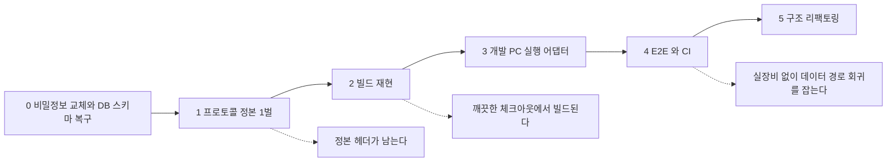

# 제안 — 힐세리온 SW 리팩토링 위탁

> 수신: 힐세리온 Advanced Medical R&D Center · 발신: 허밍랩 (HLAB-2487)
> 이 문서는 **제안**이다. 결정된 계획이 아니며, 승인 전에는 어떤 변경도 하지 않는다.

**소유권은 힐세리온에 남는다.** 저장소·인증·제품 판단은 전부 귀사 것이고, 우리는 구조 작업을 수행해 그 결과를 귀사 저장소로 돌려드린다. 우리가 지금 갖고 있는 것은 검토를 위한 read-only 미러뿐이다.

---

## 1. 먼저 — 귀사가 이미 옳게 한 것

이 제안은 "코드를 다시 짜자"가 아니다. **귀사 코드 안에 이미 있는 방법을 나머지 축으로 넓히자**는 것이다. 근거가 넷이고, 전부 귀사 저장소에서 확인했다.

| 이미 하고 있는 것 | 어디에 |
|---|---|
| **비트정확 골든 모델로 회귀를 잡는다** | `ginny-renewal/model/src/` — `rx_bf.c` `rx_dcr.c` `rx_dr.c` 등 7개. FPGA 팀은 기대 벡터로 회귀를 잡고 있다 |
| **클린 아키텍처를 이미 쓴다** | `sonex-app/packages/dr_sono/lib/` 이 `domain` `data` `infrastructure` `presentation` `host` `config` 로 나뉜다 |
| **런타임 변종 선택을 이미 했다** | `ginny-fw` 는 u-boot 환경변수로 5개 모델을 골랐다. 단일 유니버설 이미지였다 |
| **앱은 이미 feature 로 나뉘어 있다** | `moana` 의 `Scan` `Measure` `PatientList` `WorkList` `Cloud` `Ambulance` `BLE` `Setting` |
| **릴리스 규율을 스스로 세웠다** | `M2.00.00` 은 2019~2020년에 `a`~`u` 로 **21번 재출시**됐으나, `M2.00.18b`(2022-05) 이후 재출시 태그가 **하나도 없다** |
| **QA 가 회귀를 잡고 있다** | 출하 브랜치에 `[SQA]` 표기 **150건**. 안전망이 없는 것이 아니라 **자동 판정이 없는 것**이다 |

그리고 `sonex-app`·`sonex-framework` 에 귀사가 작성한 `CLAUDE.md` 가 있다 — AI 에이전트를 이미 개발에 쓰고 계신다.

**아래 두 줄이 이 제안의 성격을 정한다.** 릴리스 재출시 문제를 스스로 해결한 조직이고, QA 도 돌고 있다. **문제는 규율의 부재가 아니라 그 규율이 닿지 않은 축이 있다는 것**이다(§2).

**우리가 제안하는 것은 새로운 방법론이 아니라 위 네 가지의 확장이다.** FPGA 팀의 골든 모델을 장비·앱으로, `dr_sono` 의 계층을 나머지 모듈로, `ginny-fw` 의 런타임 변종을 belle 로.

---

## 2. 비어 있는 축

문제는 역량이 아니라 **배치**다. 한 팀이 두 개의 큰 작업을 동시에 돌릴 수 없다.

| 축 | 현재 담당 |
|---|---|
| 클라이언트 (Qt → Flutter) | **힐세리온이 진행 중** |
| 신호처리·임상 기능 | **힐세리온** (`belle-fw` 최근 커밋이 T1968 컬러 도플러) |
| 장비 구조·빌드 재현 | **비어 있음** — 커널 2021-10 · BSP 2022-05 이후 정지 |
| 빌드·테스트 기반 | **비어 있음** — 검토한 31개 저장소 CI 0건 |
| 축 사이 이음매 | **비어 있음** — 프로토콜 선언이 3벌 |

**우리는 비어 있는 세 축만 맡는다.** 신호처리와 임상 기능, 제품·규제 판단은 건드리지 않는다. 그리고 아래 §3 에서 보듯 우리 작업은 귀사의 Flutter 전환을 **더 싸게 만드는 선행 공정**이지 경쟁 작업이 아니다.

---

## 3. 첫 걸음은 이미 만들어 두었다

말로 하는 대신 **가장 위험이 낮은 항목 하나를 실제로 해서 가져왔다.**

`belle-fw` · `moana` · `500c-sn-fw` 가 각각 자기 헤더에 같은 14바이트 패킷 헤더를 선언하고 있다. 이 셋을 정본 1벌로 합쳤다. **산출물과 검증기가 [../refactoring/proof/protocol-sot/](../refactoring/proof/protocol-sot/) 에 있고, `make` 한 줄로 재현된다.**

| 증명한 것 | 방법 | 결과 |
|---|---|---|
| 14바이트 배치가 원본 3벌과 동일하다 | 필드 6개의 offset·width·크기를 `_Static_assert` 로 대조 | 통과 |
| **호출부를 한 줄도 바꾸지 않는다** | 원본 철자 **198개**가 정본 헤더만으로 **원래 값**으로 해석됨을 정적 단언 | 통과 |
| 동작이 보존된다 | 장비가 만든 실제 응답 바이트를 앱 검증 로직에 통과시킨다 | 통과 |

두 번째가 핵심이다. **의료기기 코드에 넣는 첫 변경이 "값도 이름도 동작도 그대로"** 이고, 그 사실을 사람이 아니라 컴파일러가 판정한다.

### 대조 과정에서 나온 것

전수 대조 결과 **같은 명령을 장비와 앱이 다른 이름으로 부르는 것이 41건**이다 — `0x0101` 이 장비에선 `FPGA_WRITE_DEPTH`, 앱에선 `FPGA_DEPTH` 인 식이다. 반대로 **같은 이름이 다른 값을 가리키는 경우는 0건**이었고, 그래서 통합이 무손실로 성립한다.

그리고 **선언이 갈려서 이미 생긴 결함**을 하나 찾았다.

| | 모델 | 코드 |
|---|---|---|
| 장비 | `U16` | `sonon_receive.cpp:79` — `header->recv_id = HER_TARGET_ID_CLIENT;` |
| 앱 | `char[2]` | `BasePacket.cpp:731` — `if (m_pkt_head->recv_id[1] == target_id)` |

리틀엔디언에서 장비는 target 을 바이트 0 에, 앱은 바이트 1 을 본다. `target_id` 가 1 또는 2 이므로 **이 검사는 성립할 수 없다.** 지금 동작이 맞는 이유는 위쪽 `memcmp(head, context, 6)` 이 우연히 `recv_id[0]` 을 덮고 있기 때문이다.

**활성 버그는 아니다 — 잠복 결함이다.** memcmp 길이를 손대거나 필드를 옮기는 순간 target 검증이 조용히 사라진다. 정본이 하나였으면 생기지 않았을 종류의 문제이고, 이런 것을 찾는 것이 이 작업의 목적이다.

---

## 4. 제안하는 순서 — 단계마다 멈출 수 있다

**한 번에 다 하자는 제안이 아니다.** 각 단계가 독립적으로 남는 자산을 만들고, 어디서 멈춰도 그때까지의 결과는 귀사에 남는다.

| 단계 | 내용 | 제품 동작 변경 | 멈춰도 남는 것 |
|---|---|---|---|
| **0** | 비밀정보 교체 · `.mwb` 에서 DDL 복구 | 없음 | 사업 연속성 |
| **1** | **프로토콜 정본 1벌** — §3, 이미 완료 | **없음(증명됨)** | 정본 헤더 |
| **2** | 빌드 재현 — 절대경로·누락 Makefile 제거 | 없음 | 새 머신에서 이미지가 나온다 |
| **3** | 개발 PC 어댑터 — 장비 코드를 PC 에서 실행 | 없음 | 하드웨어 없이 개발 가능 |
| **4** | E2E · CI | 없음 | **데이터 경로** 회귀를 출하 전에 잡는 체계 |
| **5** | feature 단위 구조 변경 | **있음** | — |

**0~4 단계는 제품 코드의 동작을 바꾸지 않는다.** 동작을 바꾸는 작업(5단계)은 회귀를 판정할 수단이 생긴 뒤에 온다. 순서를 뒤집지 않는 것이 이 제안의 핵심이다.

상세 근거는 [../refactoring/assessment.md](../refactoring/assessment.md) 에 있다.

---

## 5. 규제 — 우리 입장

**규제 판단의 주체는 귀사다.** 우리는 산출물을 만들고, 그것이 어느 요구에 대응하는지 정리해 드린다. IEC 62304 안전등급 판정, 재검증 범위 결정, 인증 유지 책임은 귀사 RA 의 몫이며 우리가 대신할 수 없다.

그 전제에서 두 가지를 말씀드린다.

**하나 — 우리가 만드는 것이 62304 가 요구하는 것과 겹친다.**

| 62304 가 요구하는 것 | 이 작업에서 나오는 산출물 |
|---|---|
| 소프트웨어 구성 항목 식별·구성관리 | 재현 가능한 빌드 정의 (2단계) |
| SOUP 목록·버전·출처 | 의존성 매니페스트 — 현재는 7.2GB 프리빌트 바이너리로만 존재 |
| 검증 기록 | CI 실행 이력 (4단계) |
| 변경 영향분석 | 축을 하나씩 움직이는 순서 (§4) |
| 문제 해결 프로세스 | 데이터 경로 회귀가 커밋 시점에 잡히면 기록이 남는다 |

**둘 — 순서가 곧 규제 답변이다.** 0~4단계는 동작을 바꾸지 않으므로 재검증 트리거가 최소이고, 동작을 바꾸는 5단계는 검증 수단이 선 뒤에 온다. 지금은 변경이 없는 것이 아니라 — `belle-fw` 는 2026-07 까지 커밋되고 `moana` 는 회귀를 수정 중이다 — **검증 기록 없는 변경**이 일어나고 있다.

상세 대응표 = [regulatory.md](regulatory.md).

---

## 6. 효과 — 실측한 것과 실측하지 못한 것

### 6.1 지금 비용 (실측 · SOT = [../review/change-cost.md](../review/change-cost.md))

기능 하나를 티켓 번호로 끝까지 추적했다.

**Power Doppler** — 장비(`belle-fw` T7741) 2023-03-29~04-24, 3커밋 18파일. 앱(`moana` `PowerDoppler` 브랜치) 2023-03-29~09-20, 7커밋. 그리고 **2023-10-06 에 출하 계통 세 곳에 각각 따로 안착**했다.

| 안착 | 도달 브랜치 | 파일 | patch-id |
|---|---|---:|---|
| `796f2e121` | `BloodVolumeFlow` `QT6_WORK` `main` | 36 | `293a8e5b…` |
| `60dcee977` | `service` 계열 6개 (현 출하본) | 37 | `f1b8f373…` |
| `837fcd9b9` | `oem_sphera` | 100 | `9b5e3ef6…` |

**patch-id 가 셋 다 다르다** — 체리픽이 아니라 내용이 갈린 재적용이다. 같은 `ImageProc.cpp` 조차 `+57 −18` / `+57 −13` / `+57 −13` 이다. 원 개발 브랜치는 **어디에도 병합되지 않았고 15커밋이 남아 있다.** 장비 완료에서 앱 출하 도달까지 **5개월 12일**이다.

| 저장소 전체 | 실측 |
|---|---|
| `moana` 출하본 미도달 커밋 | **712 / 5,705 (12%)** — 국가·고객사·인증 **329** · 기술·기능 **207** · 단종라인 **142** |
| 아직 살아있는 분기 | `oem_sphera` 2025-05-28 · `QT6_WORK` 2025-07-29 |
| 장비·앱 명명 불일치 | **41건** (같은 이름·다른 값은 **0건**) |
| 그 불일치가 만든 결함 | `recv_id` target 검사가 **도달 불가 코드** (§3) |

### 6.2 이 중 구조로 풀리지 않는 것 — **먼저 뺍니다**

| | 판정 | 이유 |
|---|---|---|
| **인증 브랜치** `500L_Cetification` 68 · `310C_China_Certification` 22 | **안 풀림** | 인증본 동결이 규제 요구일 수 있다. **귀사 판단 사항이고 우리가 정하지 않는다** |
| **단종 라인** `sonon_500c` 71 · `300_Series_Renewal` 71 | **대상 아님** | 손대면 회귀 위험만 는다 |
| **Qt6 이행** `QT6_WORK` 112 · `qt6_upgrade` 6 | **거의 안 풀림** | 대규모 이행은 구조와 무관하게 브랜치가 길다 |
| **`belle-fw` 미도달 22건(33%)** | **구조 문제 아님** | 별도 제품라인(`500_integrated` `fuji`)과 **진행 중 R&D**(`T1968`, 롤백으로 종료)다. 정상적인 연구 활동이다 |
| **펌웨어 중복 패치** | **없음** | `belle-fw`·`500c-sn-fw` 중복 patch-id 각 1건뿐. **펌웨어는 깨끗하다** |
| **릴리스 규율** | **이미 개선됨** | 재출시 태그가 `M2.00.18b`(2022-05) 이후 **소멸**했다. 귀사가 스스로 고쳤다 |
| **QA 부재** | **사실 아님** | 출하 브랜치에 `[SQA]` 표기 **150건**. 없는 것은 QA 가 아니라 **자동 회귀 판정**이다 |
| **E2E 가 회귀를 다 잡는다** | **사실 아님 — 우리 주장의 상한을 쟀다** | 2026-06-24~07-27 결함 수정 **16건 전량**을 변경 계층으로 분류했다. 제안한 데이터 경로 E2E 가 닿는 `framework/` 변경은 **4건(25%)**, `.qml` 만 바뀐 표시 계층 회귀가 **7건(44%)** 이다. **과반은 이 제안으로 잡히지 않는다** |

**그래서 우리가 효과를 약속하는 구간은 좁습니다** — `moana` 의 국가·고객사 OEM 분기, 장수 기능 브랜치, 장비↔앱 이음매, 빌드 재현, 그리고 **데이터 경로 회귀**입니다. 그 밖은 손대지 않거나 효과를 주장하지 않습니다.

> **UI 회귀는 별도 문제입니다.** 최근 회귀의 과반이 Qt/QML 상태 문제인데, 이 제안에는 그것을 잡는 수단이 없습니다. `moana` 가 이미 Windows·macOS 로 빌드되므로 개발 PC 에서 UI 테스트를 붙이는 경로는 존재하지만, **장비 에뮬레이터와 별개 투자이고 현 제안 범위 밖입니다.** 필요하시면 별도로 산정하겠습니다.

### 6.3 얻는 것

| | 근거 |
|---|---|
| 같은 기능을 여러 번 적용하지 않는다 | §6.1 Power Doppler 3회 |
| 프로토콜 변경 1회 작업량이 3벌 → 1벌 | §3, 증명 완료 |
| 깨끗한 체크아웃에서 이미지가 나온다 | 현재는 `/home/jacob/...` 배치 의존 |
| **데이터 경로** 회귀 판정이 자동화된다 | 현재는 사내 QA·실장비 수동. **효과 범위는 §6.2 에 상한을 재어 두었다 — 전부가 아니다** |
| 모델 추가가 별도 빌드 → 단일 이미지 | `ginny-fw` 가 이미 그랬다 |
| 규제 산출물이 개발 산출물로 충당된다 | §5 |
| Flutter 전환이 싸진다 | 정리된 feature 를 이식하면 `Scan/` 83k LOC 을 뒤져 사양을 복원하지 않아도 된다 |

### 6.4 아직 재지 못한 것

- **CS 티켓 ↔ 수정 커밋 비율** — Maniphest 전수 조회가 막혀 있어 고객 신고 비중을 재지 못했다
- **`sonex` 가 물려받아야 할 작업량** — 미대조
- **미도달 커밋의 낭비 금액 환산** — 성격별 분해까지가 확정이고, 금액으로 바꾸지 않는다

### 비용과 한계 — 숨기지 않는다

| | |
|---|---|
| **우리는 초음파 도메인을 모른다** | 빔포밍·도플러·영상 필터는 **건드리지 않는다.** 위치만 옮기고 알고리즘은 손대지 않는 것이 원칙이다 |
| **우리는 귀사의 규제 이력을 모른다** | DHF·변경관리 절차에 어떻게 붙일지는 귀사가 정해야 한다 |
| **초기 구간에 눈에 보이는 기능이 없다** | 0~4단계는 기반 작업이라 사용자가 체감하는 산출물이 없다. 이것을 기능 개발로 포장하지 않는다 |
| **귀사 엔지니어의 시간이 든다** | 최소한 리뷰어 1명이 필요하다. 도메인 판단은 우리가 못 한다 |
| **전환기 이중 비용은 사라지지 않는다** | `moana`·`sonex` 병존 비용은 전환 완료 조건이 정해져야 끝난다 — 이것은 귀사 결정 사항이다 |
| **리팩토링이 회귀 위험을 0으로 만들지 않는다** | 그래서 기준선(2~4단계)이 구조 변경보다 먼저다 |
| **하드웨어 설계는 범위 밖이다** | `.xsa` 원본 Vivado 프로젝트가 없어 PL 변경이 불가하다. 다만 **빌드 재현의 전제는 아니다** |

### 하지 않을 것

- 신호처리 알고리즘 재작성
- 단종 라인(300 시리즈·500C) 정리
- Qt → Flutter 전환 여부에 대한 재검토 — **이미 정해진 귀사 결정으로 다룬다**
- 승인 없는 어떤 저장소 변경도

---

## 7. 어떻게 함께 일하는가

| 항목 | 제안 |
|---|---|
| **소유권** | 힐세리온. 우리는 수행자다 |
| **작업 형태** | 우리가 브랜치 또는 patch 로 제출 → 귀사 리뷰 → 귀사가 병합 |
| **분담** | 귀사 = 신호처리·임상 기능·Flutter 기능·제품/규제 판단. 우리 = 장비 구조·빌드·에뮬레이터·E2E·CI·프로토콜 |
| **인터페이스 규칙** | 한 축을 바꾸는 동안 나머지 축의 인터페이스는 고정한다 |
| **반입 범위** | 현재는 검토용 read-only 미러. 정식 착수 시 NDA·반입 범위를 문서로 확정 |
| **수행 방식** | AI 에이전트를 주 작업 수단으로 쓴다 — 상세와 안전성 근거는 [method.md](method.md) |

마지막 줄에 대해: 우리는 동종 시스템(CCTV 플랫폼) 리팩토링을 같은 방식으로 이미 끝냈고, 그 저장소에서 **2026년 커밋의 91%** 가 AI 에이전트 작업이다. 다만 **그것을 안전하게 만드는 것은 AI 가 아니라 검증 게이트**이고, 그래서 이 제안의 0~4단계가 게이트를 먼저 세운다. 게이트 없이 AI 를 넣는 것은 우리도 하지 않는다.

---

## 8. 지금 요청드리는 것

**전체 프로그램 승인을 요청드리는 것이 아니다.** 1단계만 판단해 주시면 된다.

| # | 요청 | 왜 지금 |
|---|---|---|
| 1 | **프로토콜 정본 헤더를 `belle-fw`·`moana` 에 도입하는 것 검토·승인** | 이미 만들어져 있고, 동작 불변이 컴파일러로 증명된다. 리뷰어 1명이면 판정 가능 |
| 2 | **비밀정보 교체** — GCP 서비스 계정 개인키와 MariaDB root 비밀번호가 git 에 평문으로 있다 | 승인 사항이 아니라 **지금 조치가 필요한 항목**이다. 운영 중인 시스템의 키다 |
| 3 | 반입 범위·IP 경계 문서 확정 | 정식 착수의 전제 |
| 4 | sonex 전환 **완료 조건** 확정 | 귀사만 정할 수 있고, 정해지지 않으면 앱 2벌 비용이 계속된다 |
| 5 | Vivado 프로젝트 존재 여부 확인 | 하드웨어 변경 시 필요. 빌드 재현의 전제는 **아니다** |

1번의 결과를 보시고 2단계 이후를 판단하시면 된다. **1단계에서 끝내셔도 정본 헤더는 귀사에 남는다.**

---

## 9. 예상 질문

| 질문 | 답 |
|---|---|
| **동작하는 걸 왜 건드리나** | 동작 여부가 아니라 변경 비용이 문제다. PW 파라미터 1건 추가에 3개 저장소·10개 이상 파일이 걸린다 |
| **의료기기인데 재검증 비용은** | 0~4단계는 동작을 바꾸지 않는다(§4·§5). 동작 변경은 검증 수단이 선 뒤다 |
| **우리가 하면 되지 않나** | 역량이 아니라 동시성 문제다(§2). 클라이언트 전환이 팀을 쓰는 동안 장비·기반·이음매가 비어 있다 |
| **AI 가 의료기기 코드를 고쳐도 되나** | 안전성을 가르는 것은 작업 주체가 아니라 검증 게이트다. 지금은 사람이 고쳐도 회귀 판정이 사람 손에 있다. 병합 승인은 항상 귀사가 한다. 상세 = [method.md](method.md) |
| **실패하면** | 단계마다 멈출 수 있고 그때까지의 산출물이 남는다(§4) |
| **기간과 비용은** | 1단계 범위를 확정한 뒤 그 실적으로 산정하는 것이 정확하다. 지금 전체 기간을 제시하는 것은 근거 없는 숫자가 된다 |

---

## 붙임

| | |
|---|---|
| [../refactoring/proof/protocol-sot/](../refactoring/proof/protocol-sot/) | **1단계 실물** — 정본 헤더·검증기·재현 절차 |
| [regulatory.md](regulatory.md) | 62304 요구항목과 산출물 대응 |
| [method.md](method.md) | 수행 방식과 검증 게이트 |
| [../review/](../review/) | 현행 구조 분석 — 이 제안의 모든 수치가 여기서 나온다 |

> 이 문서의 수치는 전부 귀사 저장소 코드에서 직접 확인한 것이다. 저장소 설명이나 전해 들은 내용은 사실로 쓰지 않았고, 확인하지 못한 것은 확인하지 못했다고 적었다.
