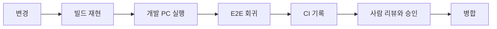

# 수행 방식과 검증 게이트

> [README.md](README.md) §7 의 상세. **어떻게 작업하는가**와 **왜 그것이 안전한가**를 적는다.

## 1. 무엇을 쓰는가

AI 에이전트를 주 작업 수단으로 쓴다. 귀사도 `sonex-app`·`sonex-framework` 에 자체 `CLAUDE.md` 를 두고 이미 같은 도구를 쓰고 계시므로, 새로운 방식을 제안드리는 것은 아니다.

동종 시스템(CCTV 플랫폼 — 임베디드 장비 펌웨어 + 멀티플랫폼 클라이언트 + 클라우드)을 같은 방식으로 리팩토링했고, 그 저장소의 2026년 커밋 **3,341건 중 3,063건(91%)** 이 AI 에이전트 작업이다. 장비 펌웨어 94% · Qt 데스크톱 앱 85% · 서버 95%로 특정 계층에 몰려 있지 않다.

> **측정의 한계**: 커밋 메시지의 공동저자 트레일러를 센 것이다. 커밋을 **만든 주체**를 뜻하며 라인 단위 저작 비율이 아니다. 사람의 지시·리뷰·수정이 그 안에 섞여 있다.

## 2. 안전성을 가르는 것은 작업 주체가 아니라 게이트다

**이것이 이 문서의 핵심 주장이다.**

지금 귀사에서 회귀가 발견되는 시점은 출하 후다 — `moana` 커밋에 CS 티켓 번호가 직접 박혀 있다(`T8807 fix BVF when screenshot and PACS`, `T8850 fix PW invert`). **사람이 고쳐도 그렇다.** 작업 주체가 사람이라는 사실이 회귀를 막아주지 않는다.

막는 것은 검증 게이트다. 게이트가 서면 누가 고치든 같은 관문을 통과해야 하고, 통과 기록이 남는다.

**그래서 이 제안의 순서가 게이트를 먼저 세운다**([README.md](README.md) §4의 2·3·4단계). 게이트 없이 AI 를 넣는 것은 우리도 하지 않는다 — 그것은 지금 상태에 자동화를 얹는 것이고, 회귀 발견 시점을 앞당기지 못한 채 변경 속도만 올린다.

**병합 승인은 항상 사람이 한다.** 우리 제안에서 AI 가 자동으로 귀사 저장소에 반영되는 경로는 없다.

## 3. 우리가 지키는 검증 규칙

| 규칙 | 내용 |
|---|---|
| **반증으로 검증한다** | 검증자는 결론을 승인하는 것이 아니라 **무너뜨리려는 관점**으로 코드를 직접 읽는다 |
| **증거 차원을 섞지 않는다** | 존재("X가 있다")·순서·동일성·인과는 서로 다른 차원이다. 동일성 주장은 식별자 매칭(커밋 SHA, 해시)으로만 확정한다 |
| **대리증거로 판정하지 않는다** | "클론이 됐으니 코드가 온전하다" 류의 추론을 검증으로 쓰지 않는다 |
| **주장과 사실을 구분해 표기한다** | 저장소 설명·문서·전언은 주장이다. 코드로 확인한 것만 사실로 적는다 |
| **미확인은 미확인으로 남긴다** | 서사로 메꾸지 않는다 |

[README.md](README.md) §3 의 프로토콜 정본이 이 규칙의 적용 예다. "바이트 배치가 같다"를 문장으로 쓰지 않고 **컴파일러가 판정하게** 했고, 원본은 옮겨 적지 않고 커밋 SHA 로 고정한 미러에서 스크립트가 직접 읽는다.

## 4. 한계 — 이 검토 중에 실제로 겪은 것

**AI 는 틀린다.** 이번 검토에서도 두 번 겪었다.

| 무슨 일이 있었나 | 원인 | 무엇을 바꿨나 |
|---|---|---|
| 서브에이전트가 **존재하지 않는 구조체를 인용**했다 | 프로토콜 선언이 저장소 9곳에 흩어져 있어 어느 정의가 맞는지 코드로 판정되지 않았다 | 이후 모든 구조체 인용을 파일·행 번호로 고정 |
| "프로토콜 정본이 없다"는 **틀린 결론**을 냈다 | 미러가 `.gitignore` 에 있어 재귀 검색이 0건을 반환했다. 0건이 "없다"가 아니라 "안 봤다"였다 | 검색 시 저장소 경로 명시를 규칙으로 고정 |

**이것을 숨기지 않는 이유는, 이것이 제안의 근거이기 때문이다.** 구조가 나쁘면 AI 의 판단이 틀린다. 그리고 사람이 검토했어도 같은 함정에 걸렸을 것이다 — 흩어진 정의와 보이지 않는 검색 결과는 사람에게도 똑같이 작동한다.

그래서 우리가 제안하는 순서는 **AI 를 더 쓰는 것이 아니라 판정 가능한 상태를 먼저 만드는 것**이다. 1단계가 프로토콜 정본인 이유가 여기 있다 — 첫 번째 사고가 났던 바로 그 지점이다.

## 5. 이 방식에서 사람이 하는 일

| | |
|---|---|
| **도메인 판단** | 초음파·임상·규제. 우리 AI 도, 우리 엔지니어도 대신할 수 없다 — 귀사 몫이다 |
| **승인** | 모든 병합. 우리 쪽 제출은 항상 리뷰 대상이다 |
| **게이트 설계** | 무엇을 통과 조건으로 삼을지는 사람이 정한다 |
| **반증 검증** | 결론을 무너뜨리는 시도는 사람이 지시하고 사람이 판정한다 |

## 6. 요약

- AI 는 **작업량의 상한을 인원에서 떼어내는 수단**이지, 검증을 대신하는 수단이 아니다
- 안전성은 **게이트**에서 나온다. 그래서 게이트가 순서의 앞에 있다
- 게이트가 서기 전 단계(0~1)는 **동작을 바꾸지 않는 것**만 다룬다
- 병합 승인은 항상 사람이 한다
