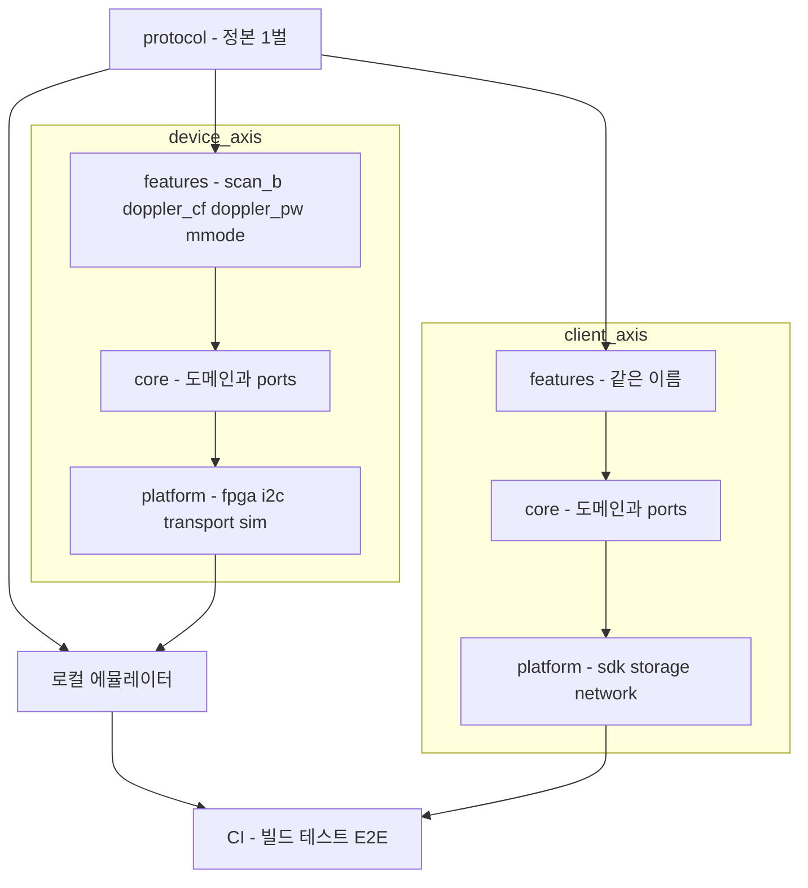

# 목표 구조 — device·client feature-first clean architecture

> 왜 하는지는 [why.md](why.md), 에뮬레이터·E2E 는 [emulator-e2e.md](emulator-e2e.md), 착수 순서는 [assessment.md](assessment.md).
> 현행 구조 실측은 [../review/device-firmware.md](../review/device-firmware.md) · [../review/moana-app.md](../review/moana-app.md) · [../review/sonex-app.md](../review/sonex-app.md).

## 0. 한 문장

**기능(feature)이 디렉토리 하나에 모이고, 도메인이 하드웨어·전송·UI 를 모르게 한다.** device 와 client 에 같은 원리를 적용하고 **feature 이름을 양쪽에서 맞춘다.**

## 1. 플랫폼 배치 — 축과 축 사이

feature-first 는 **각 축 안**의 구조다. 그 위에 축을 잇는 계층이 하나 더 있다.



| 계층 | 내용 | 현재 |
|---|---|---|
| `protocol/` | **정본 1벌.** 장비·앱·에뮬레이터가 같은 정의를 include | **7 코드베이스 복제, 선언 3벌** |
| 축 내부 | `core` · `features` · `platform` (§3·§4) | 장비는 기술 역할 분할, sonex 는 이식 0건 |
| 에뮬레이터 | **`platforms/pc` 어댑터 — 장치 리팩토링의 산물** | 더미 골격만([emulator-e2e.md §3](emulator-e2e.md)) |
| CI | 축마다 빌드·테스트 | **31건 전부 0** |

**산출물이 갈 자리는 이미 비워져 있다.** 컨테이너 최상위(`device/`·`client/`·…)가 비어 있고 현재 코드는 전부 `legacy/` 아래다 — 리팩토링 결과가 최상위로 올라온다.

## 2. 지금 무엇이 문제인가

### 2.1 장비 — 기술 역할로 잘려 있어 기능이 흩어진다

```
belle-fw/
  sonon/
    sonon.cpp                 3,522   main + 스레드 5 + 소켓 + 상태
    sonon_receive_fpga.cpp    4,048   ← 모든 모드의 FPGA 명령이 여기
    sonon_receive_device.cpp  1,711   ← 모든 모드의 장치 명령이 여기
    sonon_transmit.cpp        1,104   ← 모든 모드의 송신
    sonon_pw_filter.cpp       1,605
    sonon_scanconversion.cpp  1,278
  lib/                                FPGA/AFE 레지스터 (libfpga)
  bcd/                                설정 브로커
```

**PW 모드를 바꾸려면 6개 파일을 연다.** 반대로 `sonon_receive_fpga.cpp` 하나를 열면 B·CF·PW·M 이 다 들어 있다.

그리고 **도메인이 하드웨어를 직접 안다** — 스캔 시퀀싱 코드가 EBI 레지스터·소켓을 직접 만진다. 그래서 **하드웨어 없이는 아무것도 실행할 수 없다.**

### 2.2 클라이언트 — 이식이 시작되지 않았다

| | 상태 |
|---|---|
| `moana/app/Sources/` | `Scan`·`Measure`·`PatientList`·`WorkList`·`Cloud`·`Ambulance`·`BLE`·`Setting` — **feature 로 나뉘어 있다. 참고 기준** |
| `moana/framework/` | `SononClient`·`ImageProc`·`Dicom`·`Database`·`Network`·`Platform` — 인프라 계층. **app → framework 단방향** |
| `sonex-app/lib/modules/` | `scan`(23,087)·`patient_list`(10,705)·`setting`(7,105)… — **GetX 화면 우선(구)**. `scan_controller.dart` **8,354 LOC** |
| `sonex-app/lib/features/` | `command_window`·`report_window`·`split_window` — **3개뿐, 전부 창 관리이지 도메인이 아니다** |
| `sonex-app/packages/dr_sono` | domain/data/infrastructure/presentation — **목표 구조이나 음성제어 신규 기능**이지 이식물이 아니다 |

**sonex 는 방향이 맞는데 이식이 시작되지 않았고, 옮길 양이 늘고 있다** — 구 계층이 1년에 4.6배(10,536 → 48,206 LOC), 신 계층은 최근 분기 +59 LOC([../review/sonex-app.md §10](../review/sonex-app.md)).

이것이 §4.4 의 feature 파이프라인이 필요한 이유다. **지금 방식으로는 완료되지 않는다.**

## 3. 목표 구조 — 장비

```
belle-fw/
  core/                        ← 도메인. 하드웨어·전송·OS 를 모른다
    scan/                        스캔 세션 상태머신, 모드 전환 규칙
    probe/                       프로브 모델·스펙·제약(depth/focal/PRF 범위)
    params/                      파라미터 검증·기본값·의존관계
    ports/                       인터페이스만 — FpgaPort, ConfigPort, PowerPort, ClockPort

  features/                    ← 기능 단위. core + ports 만 의존
    scan_b/                      B모드: 파라미터·시퀀싱·프레임 조립·프로토콜 핸들러
    doppler_cf/                  컬러 도플러
    doppler_pw/                  PW 도플러 (필터·오디오 포함)
    mmode/
    firmware_update/
    power_battery/               MSP430 연동, 퓨얼게이지
    diagnostics/                 진단·공장시험·덤프

  platform/                    ← 어댑터. ports 를 구현한다
    transport/                   HC 프로토콜 서버 (TCP 1234/1235)
    fpga/                        EBI/PL 레지스터 접근 (현 lib/)
    i2c/  gpio/  msp430/
    config/                      설정 저장 (현 bcd)
    sim/                         ★ FpgaPort 의 시뮬 구현 — 개발 PC 실행용

  protocol/                    ← 정본 프로토콜 정의 (client 와 공유)
```

### 의존 규칙

```
features ──→ core ──→ (없음)
    │
    └──→ core/ports (인터페이스) ←── platform (구현)
```

**`core/` 와 `features/` 는 `<sys/socket.h>`·EBI 레지스터 헤더를 include 하지 않는다.** 이 한 줄이 §6.1(개발 PC 실행)을 가능하게 한다.

### 무엇이 어디로 가는가

| 현행 | 목표 |
|---|---|
| `sonon/sonon_receive_fpga.cpp` 의 B 모드 부분 | `features/scan_b/` |
| 〃 CF 부분 | `features/doppler_cf/` |
| 〃 PW 부분 + `sonon_pw_filter.cpp` + `sonon_pw_m_proc.cpp` | `features/doppler_pw/` |
| `sonon_transmit.cpp` | 각 feature 의 송신부로 분배 |
| `sonon.cpp` 의 스레드·소켓 | `platform/transport/` |
| `sonon.cpp` 의 스캔 상태 | `core/scan/` |
| `lib/` (libfpga) | `platform/fpga/` — **인터페이스를 `core/ports/FpgaPort` 로 뽑는다** |
| `bcd/` | `platform/config/` |
| `configs/*.dat` | 데이터로 유지. **모델별 런타임 로드**(§6.2) |

> **신호처리 알고리즘은 옮기되 다시 쓰지 않는다.** `cf-doppler.c` 의 NEON 코드, 빔포밍 시퀀싱은 제품 가치 그 자체다. 위치만 바꾸고 내용은 건드리지 않는다.

## 4. 목표 구조 — 클라이언트

**Qt(`moana`) 를 먼저 정리하고, 그 다음 Flutter(`sonex`) 를 정리한다.** 순서에 이유가 있다(§4.3).

### 4.1 `moana` (Qt) — 사양 원본을 먼저 정리한다

`app/Sources/` 는 이미 feature 로 나뉘어 있다 — `Scan`·`Measure`·`PatientList`·`WorkList`·`Cloud`·`Ambulance`·`BLE`·`Setting`. **골격은 맞다.** 남은 일은 두 가지다.

| 문제 | 목표 |
|---|---|
| `Scan/` 이 **78파일 83k LOC** — 모드·렌더링·측정연동·qcustomplot 이 한 덩어리 | `features/scan_b`·`doppler_cf`·`doppler_pw`·`mmode` 로 분리 |
| feature 내부에 계층이 없다 — 뷰컨트롤러가 `framework` 를 직접 호출 | 각 feature 안에 `domain/`·`data/`·`presentation/` |
| `framework/` 가 단일 인프라 덩어리 | `platform/` 으로 재배치, feature 는 **port 인터페이스**로만 접근 |

```
moana/
  core/            도메인 공통 — 프로브 스펙, 파라미터 규칙, ports
  features/
    scan_b/  doppler_cf/  doppler_pw/  mmode/
    measure/  patient/  worklist/  dicom/  cloud/  ambulance/  ble/  settings/
  platform/        SononClient(전송) · ImageProc · Database · Network · Record
  protocol/        ← 장비와 공유하는 정본
```

**신호처리·렌더링 코드는 옮기되 다시 쓰지 않는다.**

### 4.2 `sonex` (Flutter) — 같은 구조로 맞춘다

```
sonex-app/lib/
  core/                        DI, 에러, 설정, 공통 타입
  features/
    scan_b/ doppler_cf/ doppler_pw/ mmode/     ← moana 와 같은 이름
    measure/ patient/ worklist/ dicom/ cloud/ device_connection/ settings/
  platform/
    sdk/  storage/  network/  ble/
  protocol/                    ← 정본에서 생성
```

각 feature 안은 세 층이다.

| 층 | 내용 | 의존 |
|---|---|---|
| `domain/` | 엔티티·유스케이스·리포지토리 **인터페이스** | 없음 |
| `data/` | 리포지토리 구현, DTO, 매핑 | domain |
| `presentation/` | 화면·컨트롤러·위젯 | domain |

`packages/dr_sono` 가 이미 이 형태다 — **새 패턴 도입이 아니라 있는 패턴의 확장이다.**

### 4.3 왜 Qt 가 먼저인가

`sonex` 는 `moana` 를 **읽으면서** 만들어진다. 그들 자체 문서(`sonex-framework/CLAUDE.md`)에도 Moana 시나리오 분석 → 문서화 → 구현 → 검증의 작업 사이클이 적혀 있다.

| Qt 를 먼저 정리하면 | Flutter 를 먼저 하면 |
|---|---|
| 이식 단위가 **feature 하나**로 명확해진다 | 83k LOC `Scan/` 을 뒤지며 사양을 복원해야 한다 |
| 정리 결과를 **돌아가는 제품**과 비교해 검증할 수 있다 | 아직 미완성인 것을 바꾸므로 기준이 없다 |
| 추출한 테스트가 **이식 검증에 그대로 쓰인다** | 이식 후 따로 만들어야 한다 |
| moana 는 앞으로도 수년간 출하된다 — 투자가 낭비가 아니다 | — |

그리고 이것이 **전환을 끝내는 방법**이 된다.

```
moana feature X 정리
  → X 의 사양·테스트 추출
    → sonex 로 X 이식
      → 같은 테스트로 동등성 확인
        → 다음 feature
```

feature 단위 파이프라인이라 **진척을 셀 수 있고 중간에 멈춰도 양쪽 다 정상 상태**다. 지금처럼 "언젠가 완성" 이 아니다.

### 4.4 feature 별 진행 순서

양쪽에서 **같은 feature 를 연이어** 처리한다. 의존이 얕은 것부터, `scan` 계열은 마지막.

| 순서 | feature | moana | sonex |
|---|---|---|---|
| 1 | `worklist` · `settings` | 작고 의존 얕음. 패턴 확립 | `modules/work_list`(955) · `setting`(7,105, 최대 `setting_widget.dart` 4,242) |
| 2 | `patient` | `PatientList/` 40파일 | `modules/patient_list`(10,705, 최대 `review_page.dart` 4,005) |
| 3 | `dicom` · `cloud` | `framework/Dicom`·`Network` | — |
| 4 | `measure` | `Measure/` 50파일 12.7k | `scan_controller.dart` 에서 분리 |
| 5 | **`scan_b`·`doppler_cf`·`doppler_pw`·`mmode`** | **`Scan/` 78파일 83k 분해** | **`modules/scan`(23,087) 분해 — `scan_controller.dart` 8,354** |

5번이 가장 크고 가장 이득이 크다. 앞 네 단계에서 패턴과 E2E 가 자리잡은 뒤에 한다.

> **이 표의 sonex 쪽 수치는 늘어나는 중이다** — 구 계층이 분기당 +76% 다([../review/sonex-app.md §10](../review/sonex-app.md)). 순서를 늦출수록 각 칸의 숫자가 커진다.

## 5. 양쪽이 같은 feature 이름을 쓴다

이것이 device·client 를 동시에 정리하는 이유다.

| feature | 장비 | 클라이언트 |
|---|---|---|
| `scan_b` | 시퀀싱·프레임 생성 | 렌더링·프리셋 |
| `doppler_cf` | CF 파라미터·필터 | ROI·컬러맵 |
| `doppler_pw` | PW 필터·오디오 | 스펙트럼·측정 |
| `mmode` | M 프레임 | M 렌더링 |
| `firmware_update` | 수신·플래시 | 전송·진행률 |

**"PW 도플러를 바꾼다" 가 양쪽에서 같은 디렉토리 이름을 가리킨다.** 변경 추적이 저장소를 넘어 이어진다.

그 사이에 **프로토콜 정본 1벌**이 계약으로 선다.

```
protocol/  (정본 1벌)
   ├─ 장비: features/*/ 가 핸들러 등록
   └─ 앱  : features/*/ 가 커맨드 발행
```

현재는 HC 프로토콜 식별자가 **저장소 9곳**에 흩어져 있고 구조체 선언이 3벌이다.

## 6. 이 구조가 열어주는 것

### 6.1 개발 PC 에서 장비를 돌릴 수 있다

`core/`·`features/` 가 하드웨어를 모르므로 `platforms/pc/` 를 끼우면 **같은 펌웨어 소스가 PC 에서 그대로 실행된다.** 앱이 `127.0.0.1:1234` 로 붙어 **스캔·측정·DICOM 전 경로가 실장비 없이 검증된다.** 별도 시뮬레이터를 만들지 않는 이유 = [emulator-e2e.md §1](emulator-e2e.md).

**`FpgaPort` 의 골격은 이미 있다** — `lib/fpga.cpp` 가 함수 포인터 vtable 로 `DEVICE_EBI`(13개 함수)/`DEVICE_DUMMY`(10개) 를 분기한다. 다만 `sonon.cpp:3428` 이 `DEVICE_EBI` 를 상수로 넘겨 **고를 수 없고**, 더미가 램프 패턴만 낸다. 이 절의 작업은 새 인터페이스 설계가 아니라 **있는 vtable 의 승격 + 녹화 재생**이다.

상세와 이미 있는 자산의 한계 = [emulator-e2e.md](emulator-e2e.md).

### 6.2 변종이 런타임 설정이 된다

`core/probe/` 가 모델 스펙을 데이터로 들고 있으면 `-D_USING_500L_DEV_` 가 필요 없다.

**이전 세대가 이미 그렇게 했다** — `ginny-fw` 는 u-boot 환경변수 `device` 를 읽어 5개 모델 중 고르고, 시리얼 번호로 보드 리비전까지 판별했다. 되살리는 것이다.

### 6.3 하드웨어 교체 영향이 갇힌다

FPGA·AFE 가 바뀌면 `platform/fpga/` 만 바뀐다. `features/` 는 그대로다. 지금은 `lib/` 변경이 `sonon/` 전체로 번진다.

## 7. 하지 않을 것

| 항목 | 이유 |
|---|---|
| 신호처리·렌더링 알고리즘 재작성 | 제품 가치 그 자체다. **옮기되 내용은 건드리지 않는다** — device·moana·sonex 공통 |
| 프로세스 구조 변경(`sonon`/`bcd`/`deviced`/`watchdogd`) | 지금 동작한다. 파일 배치만 바꾸고 프로세스 경계는 유지 |
| 한 번에 전부 옮기기 | E2E 가 서기 전에는 회귀를 판정할 수 없다 |
| 새 프레임워크 도입 | CMake·Flutter 그대로. **배치만 바꾼다** |

## 8. 순서

| # | 단계 | 산출 |
|---|---|---|
| 1 | **프로토콜 정본 1벌** 추출 — 양쪽이 공유 | 변경 1건이 7곳 → 1곳 |
| 2 | 장비에 **`core/ports` 도입** — `FpgaPort` 로 `lib/` 의 vtable 을 승격 | 도메인이 하드웨어에서 분리 |
| 3 | **`platforms/pc` + 녹화 재생** | **펌웨어가 개발 PC 에서 실행 = 에뮬레이터** |
| 4 | **앱 E2E** — 에뮬레이터 위에서 정본을 첫 소비 | **앱 회귀가 실장비 없이 잡힌다** |
| 5 | 장비 **feature 분리** — `doppler_pw` 부터(가장 흩어져 있다) | 모드 변경이 1개 디렉토리 |
| 6 | **`moana` feature 정리** — 사양 원본을 먼저 | 이식 단위가 명확해진다 |
| 7 | **`sonex` 이식** — 정리된 feature 를 하나씩(§4.4 순서) | 전환 진척을 셀 수 있다 |
| 8 | **런타임 변종 선택** 복원 | 단일 이미지 |

1 은 빌드 재현을 기다리지 않는다(§1 의 정본 계층만 있으면 된다). **2·3 은 [assessment.md §3](assessment.md) 의 Buildroot 도입 뒤에 온다** — 진짜 펌웨어를 PC 에서 돌리는 것이므로 빌드 재현이 전제다. 그 구간의 검증은 **현행 출하본을 oracle 로 하는 패리티 대조**로 하고, 위험이 큰 5번(feature 분리)은 4번이 선 뒤에 온다. CI 는 4번부터 계속 따라붙는다 — [emulator-e2e.md §8](emulator-e2e.md).

## 9. 성공 판정

| 항목 | 기준 |
|---|---|
| feature 응집 | PW 파라미터 추가가 **`features/doppler_pw/` 안에서 끝난다** |
| 도메인 분리 | `core/`·`features/` 에 소켓·레지스터 헤더 include **0건** |
| 개발 PC 실행 | 실장비 0대로 스캔·측정·DICOM E2E 통과 |
| 정본 단일화 | 프로토콜 선언 **1벌** |
| 파일 크기 | 단일 파일 **1,000 LOC 초과 없음** |
| 변종 | 모델 추가가 **데이터 1건**, 릴리스 아티팩트 1개 |
| **feature 이름 정합** | 같은 기능이 device·client 에서 **같은 디렉토리 이름** |
| **AI 접근성** | "PW 도플러 고쳐줘" 에 **한 디렉토리만** 읽으면 되고, 고침→빌드→E2E→판정이 사람 개입 없이 닫힌다 |
