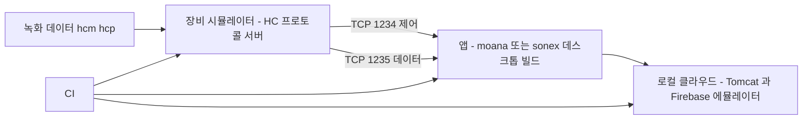

# 로컬 에뮬레이터와 E2E

> 왜 필요한지는 [why.md](why.md), 목표 구조는 [architecture.md](architecture.md), 원칙은 [principles.md §3](principles.md).
> 프로토콜 실측은 [../review/protocol-device.md](../review/protocol-device.md) 가 SOT 다.

## 0. 한 줄

**실장비 0대로 장비↔앱↔클라우드 전 경로가 개발 PC 에서 돌아야 한다.**

이것이 없으면 나머지가 전부 반쪽이다 — 리팩토링은 회귀를 판정할 수 없고, CI 는 빌드까지만 하고, AI 는 고친 결과를 확인할 수 없다.

**만들 것은 장비 시뮬레이터 하나뿐이다.** 클라우드는 두 서버 모두 로컬 실행 경로가 이미 있어 **실물을 띄운다**(§4).

## 1. 목표 형태

## 2. 만들 것 — HC 프로토콜을 말하는 장비 시뮬레이터 하나

### 2.1 두 갈래가 있고 둘 다 필요하다

| | **경로 A** — 독립 시뮬레이터 | **경로 B** — 펌웨어를 PC 에서 |
|---|---|---|
| 방식 | HC 프로토콜만 구현한 별도 프로그램 | `belle-fw` 를 x86 으로 빌드하고 `platform/sim` 을 끼운다 |
| 검증 범위 | **앱** — 스캔·측정·DICOM·클라우드 | **펌웨어 로직 + 앱** |
| 선행 조건 | **없음.** 프로토콜 정의만 있으면 된다 | `core/ports` 도입 · 빌드 재현([architecture.md §8](architecture.md)) |
| 착수 | 지금 | 2·3단계 이후 |

**A 를 먼저 만든다.** 회귀가 지금 앱에서 나고 있고([../review/moana-app.md §9](../review/moana-app.md)), A 는 선행 조건이 없다. B 는 A 의 프로토콜 구현을 그대로 재사용한다.

### 2.2 시뮬레이터가 구현할 계약

| 항목 | 값 |
|---|---|
| 역할 | **장비가 서버** — listen/accept. 앱이 클라이언트로 붙는다 |
| 포트 | 제어 **1234** · 데이터 **1235** |
| 헤더 | 14바이트 고정, 16비트 opcode |
| 주소 | 실장비는 자체 AP 고정 IP `192.168.10.1`. 시뮬은 `127.0.0.1` |
| 버전 필드 | **모델 선택자다** — 시뮬이 모델을 흉내내는 손잡이가 여기다 |
| CRC | **없다.** 만들면서 넣지 않는다 — 동작 보존이 우선([principles.md §2](principles.md)) |

opcode·필드 전수는 [../review/protocol-device.md](../review/protocol-device.md) 에 있다.

**정본 단일화의 첫 소비자가 이 시뮬레이터다**([assessment.md §2.1](assessment.md)). 정본 헤더를 include 해서 만들면, 정본이 실제로 쓰인다는 것이 코드로 증명된다.

## 3. 이미 있는 자산 — 그리고 그 한계

**"아무것도 없다" 가 아니다.** 다만 기존 문서가 자산을 과대평가한 지점이 둘 있어 아래에 한계를 함께 적는다.

### 3.1 장비 — 포트 추상화가 이미 있다. 다만 쓸 수 없다

`lib/fpga.cpp` 의 `fpga_init()` 이 **함수 포인터 vtable 로 디바이스 종류를 분기**한다 — `DEVICE_EBI`(1) / `DEVICE_DUMMY`(2), `lib/fpga_define.h:24-25`.

| | 실측 |
|---|---|
| 있는 것 | `init`·`open`·`close`·`read_config`·`write_config`·`prepare_scan`·`read_frame`·`read_reg`·`write_reg` 를 더미 구현이 전부 채운다(`lib/fpga_dummy.cpp`) |
| **막힌 것 1 — 선택이 하드코딩** | `sonon/sonon.cpp:3189` 이 `fpga_init(g_handle, DEVICE_EBI, ...)` 로 상수를 넘긴다. **DUMMY 를 고를 경로가 없다** |
| **막힌 것 2 — 더미가 불완전** | DUMMY 분기가 `read_reg_32`·`write_reg_32`·`mmap` 을 세우지 않는다. EBI 경로가 쓰는 것을 다 갖추지 못했다 |
| **막힌 것 3 — 합성 데이터** | `dummy_read_frame` 이 `i & 0xff` 램프 패턴을 채운다. 녹화 재생이 아니다 |

따라서 **`FpgaPort` 의 골격은 이미 있다.** 만들 것은 (1) 런타임 선택 경로 (2) 램프 패턴 대신 녹화 재생 (3) 빠진 3개 함수다.

이것이 [architecture.md §8](architecture.md) 2단계(`core/ports` 도입)의 비용을 낮춘다 — 인터페이스를 새로 설계하는 게 아니라 **있는 vtable 을 C++ 인터페이스로 승격**하는 일이다.

### 3.2 녹화 데이터 — 입력이 이미 있다

| 자산 | 위치 |
|---|---|
| 포맷·리더 | `moana/framework/Record/`(`RecordFileHeaderV6`·`BackupFileReader`) · `sonex-app/lib/services/sdk/record_reader_ffi.dart`·`record_writer_ffi.dart` |
| 실측 샘플 | `moana/test/FrameworkWrapperTest/SnapshotFiles/*.hcm`·`*.hcp` · `moana/test/ScanView/ux_layer/record/` |

**한계 — 샘플이 2018년 데이터다.** belle(500L) 이전 세대일 가능성이 있고, 프레임 포맷 호환 여부는 미확인이다(§7).

### 3.3 앱 — 시나리오 러너가 양쪽에 이미 있다

| 자산 | 위치 | 한계 |
|---|---|---|
| moana 스캔 자동시험 | `app/Sources/Scan/ScanAutoTestController.cpp` + `app/Resources/QML/ScanAutoTestView.qml` | 사람이 UI 로 띄우는 수동 실행 |
| moana 내구시험 | `app/Sources/Test/AgingTestController.cpp` | 장시간 aging 용. 회귀 검증용이 아니다 |
| sonex 테스트 모드 | `lib/services/test_mode_service.dart`(3,017 LOC) | — |
| **sonex 선언적 시나리오** | `test/fixtures/app_scan_spec.yaml` + `test/support/app_scan_spec_loader.dart` + `test/spec/app_scan_spec_test.dart` | **시뮬레이터가 붙으면 그대로 E2E 가 된다** |
| sonex E2E 스켈레톤 | `integration_test/app_scan_e2e_test.dart`·`dicom_integration_test.dart`·`dicom_ping_ui_test.dart` | 실장비·실 PACS 전제 |

> **"테스트가 0건" 이 아니다.** `sonex-app` 은 `test/` 9파일 + `integration_test/` 3파일 = **2,518 LOC** 를 갖고 있고, `sonon-cloud/functions/test/` 에도 단위 테스트가 있다. **0건인 것은 belle 계열과 `moana` 이고, 전 저장소에서 0건인 것은 CI 다.**
>
> 즉 없는 것은 테스트가 아니라 **실행 환경(시뮬레이터)과 실행 장치(CI)** 다. 착수 비용이 그만큼 낮다.

### 3.4 선례 — 골든 모델 방식이 사내에 있다

FPGA 팀은 비트정확 C 골든 모델 + 기대 벡터로 회귀를 잡는다(`ginny-renewal/model/src/*.c`). §4 의 영상 레벨 검증이 이 방식의 확장이다. **외부 관행을 근거로 들 필요가 없다**([principles.md §7](principles.md)).

## 4. 클라우드는 스텁이 아니라 실물을 띄운다

**둘 다 로컬에서 돌아간다.** 구조적으로 막는 것이 없어서, 계약을 사람이 다시 적는 스텁보다 실물이 낫다 — 스텁은 실제와 조용히 갈라진다.

### 4.1 `sonex-cloud-backend`(Java) — sonex 앱이 붙는 서버

| 항목 | 실측 |
|---|---|
| 스택 | Spring WebMVC **5.2.22** + MyBatis + MariaDB. **Spring Boot 아님** — `war` 이므로 Tomcat 이 따로 필요하다 |
| 모듈 | `Core`(war) ← `ELA`·`SDI`·`SSO`(jar, Core 의존) |
| 접속 설정 | `Core/ServerResources/Properties/DatabaseConfig.xml` **한 파일**. 주석에 사내 LAN IP 가 남아 있다 |
| 컨테이너 정의 | **없음** — Dockerfile·docker-compose 0건. 만들 대상 |
| **스키마** | **`.mwb` 에 전부 있다.** 테이블 65 + 프로시저 116(본문 포함). 매퍼 호출 대조 시 **96/98** — 상세와 남은 2건은 [assessment.md §1.2](assessment.md) |

### 4.2 `sonon-cloud`(Firebase) — moana 가 붙는 서버

쓰는 서비스가 `admin.auth()`·`admin.firestore()`·`admin.storage()` **3종이고 전부 에뮬레이터 지원 대상**이다. HTTP 엔드포인트 18개.

**과거에 로컬로 돌린 흔적이 있다** — `functions/constants.js` 에 `http://localhost:5000/...`·`:5001/...` 이 주석으로 남아 있다.

| 손볼 것 | 내용 |
|---|---|
| `emulators` 블록 | `firebase.json` 에 없다. `firebase init emulators` |
| `engines.node` | **10**(EOL 2021-04). 런타임 상향 |
| 기존 mocha 테스트 | **운영을 때린다** — `FUNCTION_HOST` 가 실제 cloudfunctions.net 이고 `test/test-config.js` 에 실계정 UID·이메일·기기ID·서명된 JWT 가 박혀 있다. 에뮬레이터로 돌리고 픽스처로 바꾼다 |
| 시드 데이터 | Firestore 에뮬레이터는 빈 상태로 뜬다 |
| SMTP | `nodemailer` — 로컬 메일 캐처로 받는다 |

**부수 이익** — 에뮬레이터로 가면 커밋된 GCP 서비스 계정 개인키가 **로컬 실행에 불필요해진다**.

### 4.3 앱이 로컬 서버를 보게 한다

`sonex-app/lib/services/http_manager.dart` 등에 base URL 이 하드코딩돼 있다(sonex 7건 · moana 5건). **설정 외부화는 어차피 우리 작업 항목**이므로 여기서 함께 처리한다 — 환경(로컬·개발·운영) 선택이 빌드 설정 1건이 된다.

## 5. 검증 3계층

| # | 계층 | 무엇을 잡는가 | 선행 |
|---|---|---|---|
| 1 | **프로토콜** | 시뮬레이터 + 앱. 스캔·측정·환자기록·DICOM 흐름 | 프로토콜 정본 |
| 2 | **영상** | 같은 녹화 입력 → 출력 해시·지표 비교. 필터·스캔변환 회귀 | 1 |
| 3 | **전 경로** | 로컬 클라우드까지. 디바이스 등록·로그 업로드·계정 | 1 + §4 |

2계층이 **`moana`↔`sonex` 동등성 검증에 그대로 쓰인다.** 같은 녹화를 두 앱에 넣고 출력을 비교하면, 그들 문서가 적은 "NextSRI 1:1 포팅, 바이트 동일" 주장이 실제로 검증된다([../review/moana-app.md §5](../review/moana-app.md)). 지금은 **주장일 뿐 확인 수단이 없다.**

## 6. CI 배치

CI 는 **31개 저장소 전부 0건**이다. 그래서 순서가 있다.

| 단계 | 내용 |
|---|---|
| 1 | **빌드가 도는 것** — 그 자체가 1단계다 |
| 2 | 이미 있는 테스트를 돌린다 — `sonex-app` 2,518 LOC · `sonon-cloud/functions/test` |
| 3 | 시뮬레이터 + E2E(§5-1) |
| 4 | 로컬 클라우드까지 붙인 전 경로(§5-3) · 영상 해시 회귀(§5-2) |

**규제 산출물이 여기서 나온다** — IEC 62304 의 검증 기록이 곧 CI 이력이다([principles.md §9](principles.md)).

## 7. 판정 기준

| 통과 | 실패 |
|---|---|
| 실장비 0대로 스캔·측정·DICOM·클라우드 등록 회귀 테스트가 CI 에서 돈다 | "이건 장비 연결해서 봐야 안다" |
| 신규 인력이 장비 없이 첫날 앱을 띄운다 | 개발 PC 에 장비 AP 를 붙여야 한다 |
| **AI 가 고침→빌드→실행→판정 루프를 사람 개입 없이 돈다** | 사람이 매번 장비를 물려 확인한다 |

세 번째가 [why.md §2](why.md) 의 목적이다. 앞의 둘이 서면 세 번째는 따라온다.

## 8. 미확인

- **2018년 녹화 샘플이 belle(500L) 프레임 포맷과 호환인지** — 세대 차이 미확인. 비호환이면 실장비로 샘플 재수집이 선행된다
- **`sonon-simul`**(id 33, "Sonon Graymap Simulator") — **미클론.** 범위 제외 판단의 재검토 대상이며, 이미 만들어진 시뮬레이터일 수 있다. 착수 전에 확인해야 할 1순위
- **운영 시드 데이터** — 스키마는 복구되지만 계정·기기·이벤트 표본은 저장소에 없다. 합성으로 충분한지, 운영 덤프가 필요한지 미확인
- `moana` 를 UWP 외 데스크톱 타깃으로 빌드 가능한지 — 가능하면 Qt 쪽도 같은 E2E 에 들어온다
