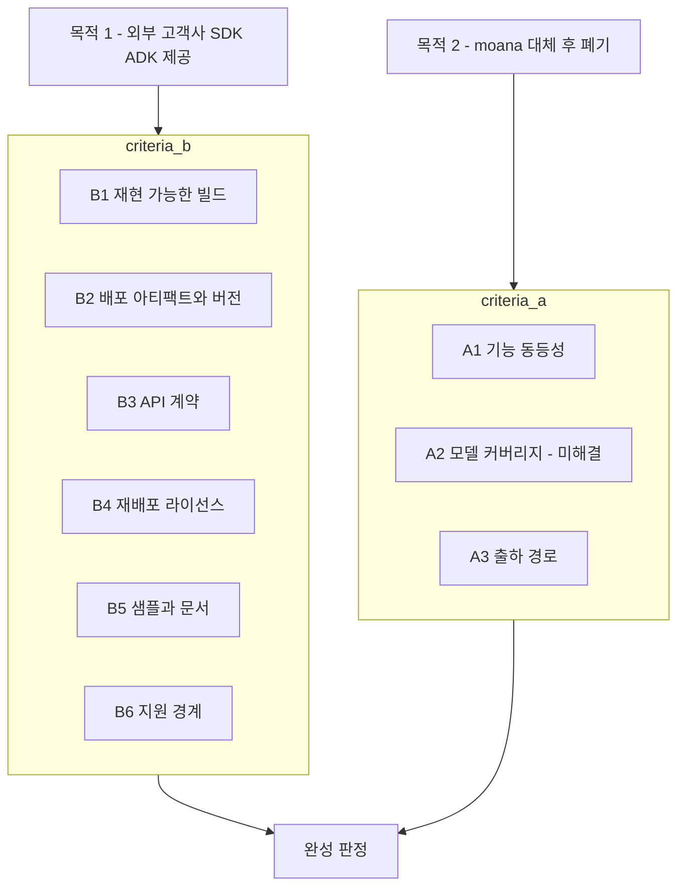

# SoNex 개발 목적과 완성 판정 기준

> **이 문서가 정의하는 것**: SoNex 가 **무엇을 위해 만들어졌고, 무엇이 되면 끝인가.**
> **표기**: `[계획서]` = 2023년 힐세리온 공식 문서 기재 · `[CTO]` = 2026-07-29 통화 확인(의도에 대한 주장) · `[실측]` = 코드 확인 · `[제안]` = 우리가 세우는 기준(합의 필요)

## 1. 목적은 둘이고, 순위가 있다

| # | 목적 | 출처 |
|---|---|---|
| **1** | **외부 고객사에 SDK·ADK 를 제공할 수 있을 것** | `[CTO]` 최우선 목적으로 명시 · `[계획서]` 신규 개발 사유 |
| **2** | `moana` 를 대체하고 **출시와 동시에 `moana` 를 폐기** | `[CTO]` |

**순위가 뒤바뀐 적이 없다.** 2023년 개발계획서가 신규 개발 사유 3개를 적었는데, 그중 하나가 정확히 목적 1이다.

> **코드 구조 상 외부 업체의 SDK / ADK 제공 요청 대응 불가**
> - Framework와 App으로 분리되어 있으나, 실제 동작에서는 경계가 모호함
> - Framework 또한 QtQML로 개발되어 있어, 외부 제공 시 사용이 어려움

나머지 둘(Qt5 지원 종료 · Qt 라이선스 비용)은 **`moana` 를 못 쓰게 된 이유**이고, 목적 1만이 **새로 무엇을 만들 것인가**를 규정한다. 즉 SoNex 는 처음부터 **제품 앱이 아니라 제품 앱을 낳는 SDK** 를 만드는 프로젝트였다. 상세 = [../review/SoNex-Requirement/summary.md](../review/SoNex-Requirement/summary.md).

## 2. 완성 기준이 존재한 적이 없다 — 그래서 안 끝난다

`[실측]` 3년 2개월간 "끝났는지" 판정할 방법이 코드·저장소 문서 어디에도 없었다([../review/sonex-app.md §10.6](../review/sonex-app.md)).

계획서에 있던 것은 **날짜뿐**이다.

| 계층 | 계획 완료일 `[계획서]` | 실제 |
|---|---|---|
| SDK | 2023-11-30 | `[실측]` 2026-07-23 까지 활발 (계획의 **약 8배** 경과, 미완) |
| ADK | 2024-02-28 | 〃 (동일 저장소) |
| APP | 미정 | `[실측]` 2026-07-15 까지 249커밋 |

**날짜는 판정 기준이 아니다.** "무엇이 되면 끝인가"가 없으면 일정은 미끄러지기만 하고 완료 선언이 불가능하다. 아래 §3·§4 가 그 기준을 세운다 — **이 문서의 산출물은 계획이 아니라 판정 가능한 조건 목록이다.**

## 3. 기준 A — `moana` 대체

> **폐기 시점은 정해져 있지 않다** `[CTO]`. 날짜가 없는 것이 문제가 아니라 **무엇이 되면 폐기할 수 있는지가 정의돼 있지 않아서** 날짜를 정할 수 없는 상태다. **이 절의 A1·A3 가 그 답을 만든다** — 판정이 서는 시점이 곧 폐기 가능 시점이고, 날짜는 그 뒤에 따라온다. 시점을 먼저 정하고 거기 맞추는 순서가 아니다.

### A1. 기능 동등성

`[계획서]` **"앱의 기본 기능은 기존 버전(project name: moana)과 동일 수준 유지"** 라고 명시돼 있다.

**판정 방법** `[제안]`: `moana` 의 도메인 기능 목록을 정본으로 삼고 sonex 대응 여부를 항목별로 판정한다. **현재 그 목록 자체가 없다** — [../review/moana-app.md](../review/moana-app.md) 가 구조는 정리했으나 "동등성 체크리스트" 형태는 아니다. 목록 작성이 선행 작업이다.

### A2. 모델 커버리지

`[실측]` 두 앱의 지원 모델은 부분집합이 아니라 **교집합**이다.

| 구분 | 모델 | 상태 |
|---|---|---|
| 공통 3종 | 300C · 300L · 500L | 계속 지원 |
| **`moana` 전용 5종** | 310C · 300MC · 300VC · 300PA · FUJI L43K | **단종** |
| `sonex` 전용 2종 | 500C · 500P | 신규 지원 |

`[CTO]` **`sonex` 코드에 없는 모델은 단종이다.** 포팅 범위가 곧 존속 제품 라인이다.

→ **`sonex` 의 현재 5종(300C·300L·500C·500L·500P)이 완성 범위이고, 여기서 늘어나지 않는다.**

**연동 항목** — `moana` 폐기 시점(§3 머리말, 미정)이 곧 **단종 5종의 지원 종료 시점**이 된다. 이미 출하된 5종 장비는 `moana` 가 살아 있는 동안만 동작하므로, 폐기 시점 결정에 이 고객군 대응이 포함되어야 한다. `FUJI L43K` 는 OEM 이라 계약 조건이 별도로 걸릴 수 있다.

### A3. 출하 경로

`[실측]` `moana` 는 인증·국가·고객사·하드웨어 리비전을 **브랜치로 영구 분기**했고, 그 비용이 실제로 발생했다(CE/US 빌드 뒤바뀜 출하 사고, 커밋 5,705건 중 **712건(12%)** 출하 브랜치 미도달). 상세 = [../review/change-cost.md](../review/change-cost.md).

**판정 방법** `[제안]`: sonex 가 같은 방식을 물려받으면 `moana` 의 문제를 그대로 재생산한다. 인증·국가 변종이 **런타임 설정 또는 빌드 구성으로 처리되고 브랜치로 갈라지지 않을 것**을 기준으로 삼는다.

## 4. 기준 B — 외부 고객사 SDK·ADK 제공

**이 축은 이전 검토 문서에 전혀 없었다.** 목적 1위임에도 저울에 오른 적이 없다.

기준은 "외부 개발자가 이 SDK 로 제품을 만들어 출하할 수 있는가"이며, 아래 6개로 나눈다. 각 항목의 현재 상태는 [gap.md](gap.md) 가 실측한다.

### B1. 재현 가능한 빌드

깨끗한 체크아웃에서 문서화된 절차만으로 SDK·ADK 바이너리가 나와야 한다.

**판정 방법** `[제안]`: 힐세리온 개발자 머신이 아닌 환경에서 clone → 문서 절차 → 빌드 성공. **고객사는 힐세리온의 로컬 디렉토리 배치를 모른다**는 것이 이 기준의 전부다.

### B2. 배포 아티팩트와 버전 계약

고객사가 받는 것은 소스가 아니라 **패키지**이며, 구성은 여덟이다.

| # | 구성 | 역할 |
|---|---|---|
| 1 | 네이티브 바이너리 (SDK·ADK, 플랫폼별) | 실행체 |
| 2 | **공개 헤더** | **계약의 본체** |
| 3 | 의존 서드파티 (ANGLE·OpenCV·freetype·DCMTK·OpenSSL·CVIE) | 링크·재배포 대상 |
| 4 | **언어별 wrapper** | **계약의 언어별 표현** |
| 5 | **샘플** | **계약의 사용례이자 검증 장치** |
| 6 | 문서 (시작하기·API 레퍼런스·지원 매트릭스) | 사용 조건 선언 |
| 7 | 라이선스 고지 | 재배포 의무 이행 |
| 8 | 버전 메타 (버전↔커밋 역추적) | 지원·재현의 근거 |

**wrapper 와 샘플만으로는 배포물이 아니다.** 나머지 여섯이 없으면 고객사는 빌드조차 하지 못한다. 현재 달성도 = [gap.md](gap.md).

**판정 방법** `[제안]`: ① 산출물 하나에 버전이 박혀 있고 ② 그 버전으로 어느 소스 커밋인지 역추적되며 ③ 앱↔SDK 조합 호환성이 선언돼 있을 것.

### B3. API 계약

외부 개발자에게는 **내부 맥락이 없다.** 헤더만 보고 쓸 수 있어야 하고, 잘못 쓰면 컴파일 단계에서 막혀야 한다.

**판정 방법** `[제안]`: ① 공개 헤더가 타입으로 계약을 표현할 것 ② 요청 코드·파라미터 스키마가 헤더에 있을 것 ③ 버전 간 호환 정책(무엇이 깨질 수 있는가)이 선언될 것.

> `[실측]` 2023년 인터페이스 명세는 `connectDevice(ip, controlPort, dataPort, retryCount, retryInterval)` 처럼 **타입 있는 개별 함수**로 설계돼 있었고, 그 형태가 외부 SDK 에 적합하다. 실제 구현은 앱 대면 파사드를 `hc_SendRequest(int requestCode, const wchar_t* jsonParam)` 제네릭 디스패처로 수렴시켰다 — **FFI 경계를 줄이는 데는 유리하나 목적 1에서는 멀어지는 방향이다**([gap.md §2](gap.md)).

### B4. 재배포 라이선스

SDK 바이너리에 서드파티가 포함돼 **고객사를 거쳐 최종 사용자에게 재배포**된다. 각 구성요소에 그 권한이 있어야 하고 고지 의무를 이행해야 한다.

**판정 방법** `[제안]`: ① 서드파티 인벤토리(구성요소·버전·라이선스·재배포 조건) 작성 후, 재배포 불가 항목 0건 + 고지 문서 동봉 ② **의료기기 SW 이므로 일반 OSS 준수보다 기준이 높다** — 각 구성요소를 IEC 62304 §8.1.2 **SOUP**(Software Of Unknown Provenance) 항목으로 다루어 버전·알려진 결함(CVE)·EOL/지원 상태·안전 분류 영향을 함께 기록한다. **EOL·CVE 미상 컴포넌트는 라이선스 적법 여부와 무관하게 그 자체로 미달**([gap.md §8](gap.md)).

> **상용 계약 확인이 필요한 항목** `[실측]`: **CVIE**(ContextVision, 라이선스 매니저 기반 상용) — 힐세리온 제품에 쓰는 것과 **고객사 제품에 재배포하는 것은 계약 조건이 다를 수 있다.** **의료기기 재배포이므로 이 확인은 선택이 아니라 B4 종료의 필요조건이다** — 미확인 상태로는 CVIE 포함 패키지를 출하할 수 없다.

### B5. 샘플과 문서

**배포가 한 패키지이므로 샘플도 언어당 1벌이다.** ADK 는 SDK 위에 얹히므로 **ADK 샘플에서 SDK 를 뺄 수 없고**, 실제로 빼지 않았다.

`[실측]` iOS ADK 샘플이 탭으로 계층을 나눈다 — `Backup`·`Database`·`Dicom`·`Network`·`BusinessLogic`·`MoanaDb`(ADK) + **`SdkIntegration`(SDK)**. Android 도 `TabPagerAdapter` + Fragment 들에 `AngleSurfaceView`·`RenderActivity`(SDK 렌더링)가 함께 있다. **한 앱 안에 SDK 섹션과 ADK 섹션이 공존하는 형태다.**

| 단위 | 수 |
|---|---|
| 샘플 | **언어당 1벌 = 6벌** (SDK 섹션 + ADK 섹션) |
| 빌드 구성 | **2개** — `SDK-only` / `SDK+ADK` |

**`SDK-only` 구성의 값은 사용법 문서가 아니라 계약 분리의 회귀 방지다.** ADK 라이브러리를 링크하지 않고 빌드가 통과하면 SDK 단독 사용이 성립한다는 증명이며, **CI 가 판정한다.** 현재는 iOS 빌드 역방향 때문에 통과하지 못한다([gap.md §4.1](gap.md)).

`[실측]` **현재 언어 커버리지 — 참조 구현의 유무로 작업 성격이 갈린다**

| 언어 | 참조 구현 | 작업 성격 |
|---|---|---|
| C# | `SDK_Sample_Windows` 외 2 · `Framework_Sample_Windows` · `ADK_Sample_Test` | **정본화** |
| JNI/Java | `SDK_Sample_Android` · `Android_SampleApp` | **정본화** |
| ObjC++/Swift | `SDK_Sample_iOS` · `iOS_SampleApp` | **정본화** |
| **Flutter** | **제품 `sonex-app` 전체** — SDK·ADK 를 모두 쓰는 유일한 실제 제품, 바인딩 7,281 LOC | **추출·분리** (샘플이 없는 것이 아니라 **샘플과 제품이 분리돼 있지 않다**) |
| **C++** | **없음** — SDK 내부 코드와 iOS 브리지 조각뿐, 외부 소비자 관점의 샘플은 부재 | 헤더 정비 + 샘플 신규 |
| **Python** | **없음** | **전부 신규** — 유일한 백지 |

`SDK_Sample_iOS` 안의 `.cpp`·`.py` 는 iOS 브리지 조각과 Xcode 프로젝트 조작 스크립트이지 C++·Python 샘플이 아니다.

**1차 공개 4종(C++·C#·Python·Flutter) 중 정본화만 하면 되는 것은 C# 하나**이고, 2차로 미룬 JNI·ObjC++ 가 오히려 갖춰져 있다. **바인딩 공백과 샘플 공백이 같은 언어에 겹친다** — Python 은 둘 다 0, Flutter 는 둘 다 앱 안에 갇혀 있고, C++ 은 공개 헤더가 27/54 심볼뿐이다([gap.md §7.2](gap.md)).

**판정 방법** `[제안]`: 샘플이 ① **배포 패키지만으로** 빌드되고 ② 대표 시나리오를 덮을 것(SDK 섹션: 연결→스캔→렌더→저장 / ADK 섹션: 로그인→환자관리→DICOM→백업) ③ **`SDK-only` 구성이 CI 에서 빌드될 것**.

> **SDK 단독 샘플은 문서가 아니라 시험 장치다.** 그것이 ADK 없이 빌드·동작해야 §5.1 의 계약 분리가 실제로 성립한다. **현재는 성립하지 않는다** — iOS SDK 빌드가 `adk/library/` 를 참조하므로 SDK 샘플도 ADK 디렉토리 없이는 빌드되지 않는다([gap.md §4.1](gap.md)).

### B6. 지원 경계

무엇을 지원하고 무엇을 지원하지 않는지가 선언돼야 한다 — 플랫폼·OS 버전·**장비 모델·펌웨어 버전 범위**.

> `[계획서]` **2023년 설계 문서가 이미 이 항목을 인지하고 있었다.** 블록 다이어그램 Command Set 절에 *"앱에서 지원하는 펌웨어 버전에 대한 범위가 결정됨(상위 버전도 지원 가능)"* · *"타사 장비에 대한 처리 가능 여부는 검토 필요"* 라고 적혀 있다. 3년째 미결이다.

**판정 방법** `[제안]`: 지원 매트릭스(모델 × 펌웨어 × 플랫폼) 문서화 + 미지원 조합에서의 동작 정의(명확한 오류 반환).

**명시해야 할 항목 둘** `[제안]`

| 항목 | 내용 |
|---|---|
| **음향출력 표시 책임** | SDK 는 `acusticOutputMi`·`acusticOutputTib` 를 **데이터로 제공**하고, **표시는 통합자 책임**이다([rendering-boundary.md §3.2](rendering-boundary.md)) |
| **펌웨어 업그레이드 범위** | **전 계열이 ADK 를 필요로 한다** — 500C/500P 는 순서 상태머신이 ADK 에 있고, **500L 도 SDK 진입점 `startFirmwareUpdate` 가 `return SUCCESS; // TODO` 껍데기**다(2026-07-30 실측, [../review/sonex-framework.md §6.3](../review/sonex-framework.md)). **공개 헤더에 성공 반환 API 로 노출돼 있어 고객사가 조용히 실패한다** — 지원 경계 문서화만으로 부족하고 최소한 `NOT_SUPPORTED` 반환으로 바꿔야 한다 |

## 5. 제공 형태

### 5.1 배포는 하나, 선택은 고객이 한다

**SDK 와 ADK 는 한 패키지로 함께 배포한다.** 고객사가 필요에 따라 **SDK 만 쓸지, ADK 까지 쓸지 사용 시점에 결정**한다. 백엔드는 그 선택을 따라간다.

| 고객 선택 | 쓰는 것 | 백엔드 |
|---|---|---|
| SDK 만 | 초음파 기능 | **고객사 자체 클라우드** |
| SDK + ADK | 초음파 + 계정·DICOM·백업·클라우드 | **힐세리온 클라우드** |

**ADK 의 서버 결합은 추상화 대상이 아니다** — ADK 를 쓰는 고객은 힐세리온 클라우드를 함께 쓰므로, 계정·로그·클라우드 API 가 힐세리온 백엔드를 전제하는 현재 구조가 설계대로다.

**따라서 요구되는 것은 "패키지 분리"가 아니라 "계약 분리"다.** 고객이 헤더와 라이브러리만 보고 **어디까지가 SDK 이고 어디부터가 ADK 인지 구분할 수 있어야** 하고, SDK 만 쓰기로 한 고객이 ADK 를 **모르고 끌어쓰는 일이 없어야** 한다. 현재 이를 흐리는 항목이 셋이다.

| 항목 | 함께 배포될 때의 영향 | 근거 |
|---|---|---|
| **`HC::DeviceManager` 동명 클래스 2개** — SDK 는 물리 스캐너, ADK 는 클라우드 등록 자산 | **양쪽 헤더가 함께 전달되므로 실제 충돌 위험** | [gap.md §4.2](gap.md) |
| **`HC::ResultCode` 재정의** — `adk/Main/ios/HCSonexSDK_iOS.h` 가 같은 이름에 다른 값(값 1 = `PROGRESSING` vs `NOT_CONNECTED`) | 어느 헤더를 먼저 포함하느냐로 **오류 코드 해석이 달라진다** | [gap.md §4.4](gap.md) |
| iOS SDK 빌드가 `adk/library/` 참조 | 배포 문제는 아니나 **SDK 를 단독으로 빌드·검증할 수 없다** | [gap.md §4.1](gap.md) |

**부수 함의**: SDK 만 쓰는 고객도 ADK 의 서드파티(DCMTK·sqlite3·curl·FFmpeg 등)를 함께 받는다. 따라서 **B4(재배포 라이선스) 검토 범위는 언제나 SDK+ADK 전체**다.

### 5.2 지원 언어 — C++ · C# · Python · Flutter · JNI · ObjC++

| 언어 | 현재 바인딩 | 작업 성격 | 공개 시점 |
|---|---|---|---|
| **C++** | 공개 헤더 자체가 계약 | **헤더 정비** — 공개 27 심볼 vs 구현 54, `HC::StreamData*` 등 C++ 타입이 C ABI 로 새어 나온다([gap.md §7.2](gap.md)). 표시 컴포넌트는 **Qt6 우선**([rendering-boundary.md §7.2](rendering-boundary.md)) | 1차 |
| **C#** | P/Invoke **4벌 1,801 LOC**(샘플·ADK 테스트) | **정본화** — 흩어진 것을 배포 패키지로 | 1차 |
| **Python** | **0건** | **신규** — 유일하게 처음부터 만든다 | 1차 |
| **Flutter** | Dart 1,869 LOC(앱 내부) + ObjC++·JNI 경유 | **정본화 + 복원** — 폐기된 `flutter_sonex_sdk` 가 그 자리다 | 1차 |
| **JNI**(Android 네이티브) | C++ 3벌 1,670 LOC + Java 3벌 465 LOC | **정본화** | **2차**(아래) |
| **ObjC++**(iOS·macOS 네이티브) | 3벌 3,146 LOC | **표류 해소 후 정본화** | **2차**(아래) |

**JNI·ObjC++ 는 신규 개발이 아니다.** Flutter 가 그 위에 서 있으므로 **어차피 유지되는 코드**이며, 공개는 코드를 만드는 일이 아니라 **계약으로 고정하는 일**이다. 이 둘이 채우는 자리는 다른 넷이 덮지 못하는 **네이티브 Android/iOS 앱 고객**이다.

**다만 공개 시점을 2차로 둔다.** 지금 이 둘이 **가장 심하게 표류한 바인딩**이기 때문이다.

| | 실측 |
|---|---|
| `SonexSDKBridge.mm` 3벌 | **MD5 전부 상이**, `hc_*` 심볼 **20 / 22 / 23** — 복제 표류 |
| JNI 3벌 | 328 / 1,154 / 188 LOC — 복제라기보다 **범위가 제각각**(SDK 샘플·ADK 샘플·앱) |

**지금 상태로 공개하면 표류한 3벌을 그대로 계약으로 굳힌다.** 순서는 ① 렌더 출력 계층화 → ② 정본화 → ③ 공개다. 앞의 둘은 Flutter 때문에 어차피 해야 하는 작업이므로, **그 뒤에는 JNI·ObjC++ 공개의 추가 비용이 거의 없다.**

### 5.3 렌더 출력 계층이 언어별로 갈린다

**Python 확정이 렌더 경계 요구를 결정짓는다.** Python 에는 넘겨줄 네이티브 윈도우가 없다 — 검증·자동화·연구가 주된 쓰임이므로 `hc_PrepareRenderer(void* nativeWindow)` 계약이 **성립하지 않는다.** Python 을 지원 언어로 정한 순간 **"윈도우 없이 프레임을 받는 경로"가 필수**가 된다 → [rendering-boundary.md](rendering-boundary.md).

| 언어 | 필요한 출력 계층 |
|---|---|
| C++ | ①·②·③ 전부 가능 |
| C# | **②** (WPF·WinForms·MAUI 로 갈리므로 ③은 수렴 안 함) |
| **Python** | **①·② 만.** ③은 무의미 |
| Flutter | **②** (현재 ③ 때문에 Windows 901줄) |
| JNI · ObjC++ | ②·③ 둘 다. **②가 서면 현재 코드의 서피스 배관이 크게 줄어든다** |

## 6. 남은 질의

| # | 항목 | 왜 필요한가 |
|---|---|---|
| 1 | **고객사 단위 격리(멀티테넌시)가 있는가** | 여러 고객사가 힐세리온 클라우드를 공유한다. SDI 모듈에 "소유관계" 개념은 있으나 **조직 단위 격리인지 미확인**이고 **`sdi` 스키마 DDL 이 저장소에 없다.** 의료 데이터라 관할·격리가 사업 리스크로 직결된다 |
| 2 | **평문 HTTP 를 언제 해소하는가** | ADK·앱이 `http://sonex.healcerion.com:8080/API/` 로 **로그인·비밀번호찾기·프로필을 평문 전송**한다([../review/protocol-cloud.md](../review/protocol-cloud.md)). ADK 를 외부에 제공하면 **고객사 제품도 평문 인증을 하게 된다** |

## 7. 미확인

- `moana` 도메인 기능의 전체 목록 — §A1 판정의 전제인데 아직 없다
- 외부 고객사가 실재하는지, 요구사항이 문서로 있는지 — `[계획서]` 는 "외부 업체의 SDK/ADK 제공 **요청**"이라 적어 실재를 시사하나 확인하지 않았다
- 목적 1의 사업 형태(SDK 라이선스 판매 · OEM 공급 · 공동개발) — 형태에 따라 B2·B4·B6 의 수준이 달라진다
