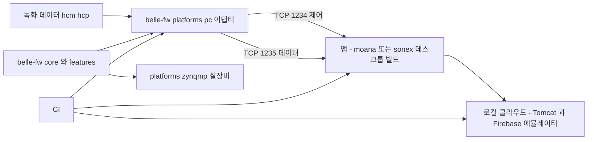
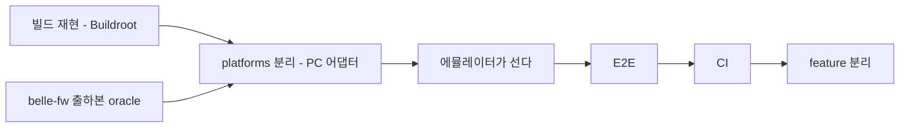

# 로컬 에뮬레이터와 E2E

> 현행 구조 실측은 [why.md](why.md), 목표 구조는 [architecture.md](architecture.md), 원칙은 [principles.md §4](principles.md).
> 프로토콜 실측은 [../review/protocol-device.md](../review/protocol-device.md) 가 SOT 다.
> cctv 에서 이것이 어떤 형태로 서 있는지는 [precedent-cctv.md §3](precedent-cctv.md).

## 0. 한 줄

**실장비 0대로 장비↔앱↔클라우드 전 경로가 개발 PC 에서 돌아야 한다.**

이것이 없으면 나머지가 전부 반쪽이다 — 리팩토링은 회귀를 판정할 수 없고, CI 는 빌드까지만 하고, AI 는 고친 결과를 확인할 수 없다.

> **에뮬레이터는 별도로 만드는 물건이 아니라 장치 리팩토링의 산물이다.** `belle-fw` 를 `core`/`features`/`platforms` 로 가르는 과정에서 **`platforms/pc` 어댑터**로 나온다. 별도 프로그램을 짓지 않는다.

클라우드는 두 서버 모두 로컬 실행 경로가 이미 있어 **실물을 띄운다**(§6).

## 1. 왜 별도 시뮬레이터가 아닌가

**이전 판(경로 A — 독립 시뮬레이터 우선)은 폐기한다.** 착수를 빠르게 하려고 고른 방식이었으나 대가가 크다.

### 1.1 이유 ① — 시뮬레이터가 맞다는 것을 아무도 보장하지 못한다

독립 시뮬레이터는 **우리가 프로토콜 문서를 읽고 다시 구현한 것**이다. 그것이 실제 장비와 같다는 근거가 없고, 갈라져도 알 방법이 없다. 그 위에서 통과한 E2E 는 **"우리 구현끼리 일치한다"** 만 증명한다.

**cctv 에서 정확히 이 사고가 났다.**

> **계기: ndvr 채널당 단일 profile(메인만) 누락이 수많은 테스트를 통과한 사건 — 테스트 oracle 이 fw-orig 아닌 자기구현이었기 때문**
> — cctv `docs/development/fw-orig-parity-audit.md`

그래서 cctv 는 **출하 펌웨어(`fw-orig`)를 oracle 로 삼는 패리티 감사**를 따로 만들어야 했다. 그 비용을 처음부터 피하는 방법이 **진짜 펌웨어를 PC 에서 돌리는 것**이다.

그리고 **같은 사고가 healcerion 에서 지금 진행 중이다** — `sonex-framework` 가 `moana` 대신 자기 구현을 기준으로 삼아 FIXME 228건이 쌓였다([../review/sonex-app.md](../review/sonex-app.md)).

### 1.2 이유 ② — 에뮬레이터가 곧 아키텍처 검증기다

펌웨어가 PC 에서 떴다는 사실 자체가 **도메인이 하드웨어를 모른다는 증거**다. clean architecture 는 보통 "지켜지는지 확인할 방법이 없어서" 무너지는데, PC 타깃이 그 판정기 역할을 한다. 구조가 무너지면 즉시 안 돌아간다.

독립 시뮬레이터는 이 효과가 **0**이다. 펌웨어 구조를 전혀 검증하지 못한다.

### 1.3 이유 ③ — 이중 유지보수가 생긴다

프로토콜이 바뀌면 펌웨어와 시뮬레이터를 둘 다 고쳐야 한다. 지금 HC 프로토콜은 이미 **저장소 9곳에 흩어져** 있고([why.md §2](why.md)), 거기에 한 벌을 더 얹는 셈이다.

## 2. 목표 형태



**같은 펌웨어 소스가 두 플랫폼으로 나간다.** cctv 의 `platforms/{nt98566, ssc30kq, ubuntu24}` 와 같은 형태다.

## 3. 발판 — 포트가 이미 있다

**`belle-fw` 에 플랫폼 축이 이미 그어져 있다.** 새로 설계하는 것이 아니라 **있는 vtable 을 승격**하는 일이다.

```c
// lib/fpga_define.h:24-25
#define DEVICE_EBI      (1)    // 실장비 (FPGA / EBI 버스)
#define DEVICE_DUMMY    (2)    // PC 경로

// lib/fpga.cpp — 함수 포인터 vtable 로 분기
RET fpga_init(Handle *handle, int device_type, int subtype)
```

| 분기 | 세우는 함수 |
|---|---|
| `DEVICE_EBI` (13개) | `init` `open` `close` `prepare_scan` `read_frame` `read_reg` `write_reg` **`read_reg_32`** **`write_reg_32`** **`mmap`** `read_config` `write_config` `control` |
| `DEVICE_DUMMY` (10개) | 위에서 **굵은 3개가 빠진다** |

cctv 의 `IPlatformAdapter`(`Id`·`IsHardwareBacked`·`ApplyRuntimeProfile`·`StartCapture`)와 같은 역할을 이 vtable 이 하고 있다.

## 4. 만들 것 — 셋뿐이다

| # | 항목 | 현재 |
|---|---|---|
| **1** | **런타임 선택 경로** | `sonon/sonon.cpp:3428` 이 `fpga_init(g_handle, DEVICE_EBI, DEVICE_SUB_PRESET1)` 로 **상수를 넘긴다.** DUMMY 를 고를 방법이 없다 |
| **2** | **빠진 3개 함수** | `read_reg_32`·`write_reg_32`·`mmap` 을 DUMMY 가 세우지 않는다 |
| **3** | **녹화 재생** | `dummy_read_frame` 이 `*(buf+i) = i & 0xff` 램프 패턴을 채운다(`fpga_dummy.cpp`). 녹화 재생이 아니다 |

### 4.1 비용은 작지 않다

| | cctv | belle |
|---|---:|---:|
| PC 어댑터 | `platforms/ubuntu24` **84 파일** | `fpga_dummy.{cpp,h}` + `_ext.h` **3 파일 146 LOC** |
| 실장비 어댑터 | `platforms/nt98566` 32 파일 | `fpga_ebi` 계열 |

**cctv 에서도 PC 어댑터가 실장비 어댑터보다 크다** — 하드웨어가 하던 일을 소프트웨어로 대신해야 하기 때문이다. belle 은 여기에 **FPGA 레지스터 · 프로브 · 빔포밍**이 얹히므로 더 무겁다. 지금 146 LOC 는 골격일 뿐이다.

`dummy_read_frame` 이 무엇을 흘릴지가 핵심이고, 녹화 파일(§5.2)이 그 입력이다.

## 5. 이미 있는 자산 — 그리고 그 한계

**"아무것도 없다" 가 아니다.** 다만 자산을 과대평가한 지점이 있어 한계를 함께 적는다.

### 5.1 그 구간의 검증은 원본을 oracle 로 한다

에뮬레이터가 리팩토링의 산물이면 **그 리팩토링 자체는 무엇으로 검증하나** 가 남는다. 답은 **현행 출하 펌웨어**다.

| | |
|---|---|
| **oracle** | `belle-fw` 현행 출하본(`production-fw-ver2.0`). 우리 구현이 아니다 |
| **대조 방법** | 원본 코드 경로:라인 ↔ 신 구조 경로:라인. cctv 의 `fw-orig-parity-audit.md` 형식 |
| **적용 구간** | 빌드 재현 → `platforms` 분리까지. 에뮬레이터가 서면 그 뒤는 E2E 가 맡는다 |

**이 구간은 구조 변경이 작다** — 포트가 이미 있으므로(§3) `platforms` 분리는 vtable 승격과 선택 경로 추가가 대부분이다. 위험한 작업(feature 분리)은 에뮬레이터·E2E 가 선 뒤에 온다.

### 5.2 녹화 데이터 — 입력이 이미 있다

| 자산 | 위치 |
|---|---|
| 포맷·리더 | `moana/framework/Record/`(`RecordFileHeaderV6`·`BackupFileReader`) · `sonex-app/lib/services/sdk/record_reader_ffi.dart` |
| 실측 샘플 | `moana/test/FrameworkWrapperTest/SnapshotFiles/*.hcm`·`*.hcp` · `moana/test/ScanView/ux_layer/record/` |

**한계 — 샘플이 2018년 데이터다.** belle(500L) 이전 세대일 가능성이 있고, 프레임 포맷 호환 여부는 미확인이다(§10).

### 5.3 앱 — 시나리오 러너가 양쪽에 이미 있다

| 자산 | 위치 | 한계 |
|---|---|---|
| moana 스캔 자동시험 | `app/Sources/Scan/ScanAutoTestController.cpp` + `ScanAutoTestView.qml` | 사람이 UI 로 띄우는 수동 실행 |
| moana 내구시험 | `app/Sources/Test/AgingTestController.cpp` | aging 용. 회귀 검증용이 아니다 |
| sonex 테스트 모드 | `lib/services/test_mode_service.dart`(3,017 LOC) | — |
| **sonex 선언적 시나리오** | `test/fixtures/app_scan_spec.yaml` + `app_scan_spec_loader.dart` + `app_scan_spec_test.dart` | **에뮬레이터가 붙으면 그대로 E2E 가 된다** |
| sonex E2E 스켈레톤 | `integration_test/app_scan_e2e_test.dart`·`dicom_integration_test.dart` | 실장비·실 PACS 전제 |

> **"테스트가 0건" 이 아니다.** `sonex-app` 은 `test/` 9파일 + `integration_test/` 3파일 = **2,518 LOC** 를 갖고 있고, `sonon-cloud/functions/test/` 에도 단위 테스트가 있다. **0건인 것은 belle 계열과 `moana` 이고, 전 저장소에서 0건인 것은 CI 다.**
>
> 즉 없는 것은 테스트가 아니라 **실행 환경과 실행 장치(CI)** 다.

### 5.4 선례 — 골든 모델 방식이 사내에 있다

FPGA 팀은 비트정확 C 골든 모델 + 기대 벡터로 회귀를 잡는다(`ginny-renewal/model/src/*.c`). §7 의 영상 레벨 검증이 이 방식의 확장이다. **외부 관행을 근거로 들 필요가 없다**([principles.md §8](principles.md)).

## 6. 클라우드는 스텁이 아니라 실물을 띄운다

**둘 다 로컬에서 돌아간다.** 구조적으로 막는 것이 없어서, 계약을 사람이 다시 적는 스텁보다 실물이 낫다 — 스텁은 실제와 조용히 갈라진다. **§1.1 과 같은 이유다.**

### 6.1 `sonex-cloud-backend`(Java) — sonex 앱이 붙는 서버

| 항목 | 실측 |
|---|---|
| 스택 | Spring WebMVC **5.2.22** + MyBatis + MariaDB. **Spring Boot 아님** — `war` 이므로 Tomcat 이 따로 필요하다 |
| 모듈 | `Core`(war) ← `ELA`·`SDI`·`SSO`(jar, Core 의존) |
| 접속 설정 | `Core/ServerResources/Properties/DatabaseConfig.xml` **한 파일** |
| 컨테이너 정의 | **없음** — Dockerfile·docker-compose 0건. 만들 대상 |
| **스키마** | **`.mwb` 에 전부 있다.** 테이블 65 + 프로시저 116. 매퍼 대조 **96/98** — [assessment.md §1.2](assessment.md) |

### 6.2 `sonon-cloud`(Firebase) — moana 가 붙는 서버

쓰는 서비스가 `admin.auth()`·`admin.firestore()`·`admin.storage()` **3종이고 전부 에뮬레이터 지원 대상**이다. HTTP 엔드포인트 18개.

**과거에 로컬로 돌린 흔적이 있다** — `functions/constants.js` 에 `http://localhost:5000/...` 이 주석으로 남아 있다.

| 손볼 것 | 내용 |
|---|---|
| `emulators` 블록 | `firebase.json` 에 없다. `firebase init emulators` |
| `engines.node` | **10**(EOL 2021-04). 런타임 상향 |
| 기존 mocha 테스트 | **운영을 때린다** — `FUNCTION_HOST` 가 실제 cloudfunctions.net 이고 `test-config.js` 에 실계정 UID·서명된 JWT 가 박혀 있다 |
| 시드 데이터 | Firestore 에뮬레이터는 빈 상태로 뜬다 |

**부수 이익** — 에뮬레이터로 가면 커밋된 GCP 서비스 계정 개인키가 **로컬 실행에 불필요해진다**.

### 6.3 앱이 로컬 서버를 보게 한다

base URL 이 하드코딩돼 있다(sonex 7건 · moana 5건). **설정 외부화는 어차피 우리 작업 항목**이므로 여기서 함께 처리한다.

## 7. 검증 3계층

| # | 계층 | 무엇을 잡는가 | 선행 |
|---|---|---|---|
| 1 | **프로토콜** | PC 어댑터로 뜬 펌웨어 + 앱. 스캔·측정·환자기록·DICOM 흐름 | §4 |
| 2 | **영상** | 같은 녹화 입력 → 출력 해시·지표 비교. 필터·스캔변환 회귀 | 1 |
| 3 | **전 경로** | 로컬 클라우드까지. 디바이스 등록·로그 업로드·계정 | 1 + §6 |

2계층이 **`moana`↔`sonex` 동등성 검증에 그대로 쓰인다.** 같은 녹화를 두 앱에 넣고 출력을 비교하면, 그들 문서가 적은 "NextSRI 1:1 포팅, 바이트 동일" 주장이 실제로 검증된다. 지금은 **주장일 뿐 확인 수단이 없다.**

## 8. 순서와 CI 배치

**에뮬레이터가 feature 분리보다 먼저다.** 포트가 이미 있어(§3) `platforms` 분리는 가볍고, 위험한 작업은 그 뒤에 온다.



CI 는 **31개 저장소 전부 0건**이므로 단계가 있다.

| 단계 | 내용 |
|---|---|
| 1 | **빌드가 도는 것** — 그 자체가 1단계다 |
| 2 | 이미 있는 테스트를 돌린다 — `sonex-app` 2,518 LOC · `sonon-cloud/functions/test` |
| 3 | PC 어댑터 + E2E(§7-1) |
| 4 | 로컬 클라우드까지 붙인 전 경로(§7-3) · 영상 해시 회귀(§7-2) |

**규제 산출물이 여기서 나온다** — IEC 62304 의 검증 기록이 곧 CI 이력이다([principles.md §10](principles.md)).

## 9. 판정 기준

| 통과 | 실패 |
|---|---|
| **같은 펌웨어 소스가 실장비와 PC 양쪽에서 뜬다** | PC 용 대체 구현이 따로 있다 |
| 실장비 0대로 스캔·측정·DICOM·클라우드 등록 회귀 테스트가 CI 에서 돈다 | "이건 장비 연결해서 봐야 안다" |
| 신규 인력이 장비 없이 첫날 앱을 띄운다 | 개발 PC 에 장비 AP 를 붙여야 한다 |
| **AI 가 고침→빌드→실행→판정 루프를 사람 개입 없이 돈다** | 사람이 매번 장비를 물려 확인한다 |

첫 줄이 이번 판에서 추가됐다 — **별도 시뮬레이터를 만들면 이 항목에서 실패한다.**

## 10. 미확인

- **2018년 녹화 샘플이 belle(500L) 프레임 포맷과 호환인지** — 세대 차이 미확인. 비호환이면 실장비로 샘플 재수집이 선행된다
- **`dummy_read_frame` 이 흘려야 할 데이터 층위** — RF 라인인지 스캔변환 후 영상인지에 따라 PC 어댑터가 대신해야 할 범위가 달라진다
- **`sonon-simul`**(id 33, "Sonon Graymap Simulator") — **미클론.** 이미 만들어진 자산이라면 §4-3(녹화 재생)의 착수 범위가 달라진다
- **운영 시드 데이터** — 스키마는 복구되지만 계정·기기·이벤트 표본은 저장소에 없다
- **`moana` 데스크톱 빌드** — `app/app.pro:1269` 에 `linux:!android` 분기가 있고 `lib/` 에 `linux`·`linux_arm64`·`macos`·`windows` 프리빌트가 있다. 다만 릴리스 스크립트(`build.py`)의 `VALID_PLATFORMS` 는 `ANDROID`·`IOS`·`UWP` 뿐이라 **데스크톱 경로가 실제로 서는지는 미확인**. E2E 를 개발 PC 에서 돌리려면 이것이 1순위 확인 항목이다
