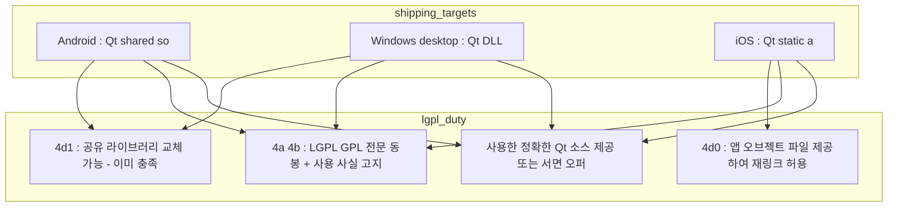

# Qt6 라이선스 검토 — LGPLv3 전환

**리팩토링 후 `moana` 가 Qt6 단일 계통으로 서는 것을 전제로, 오픈소스 Qt6(LGPLv3)로 갈 때 무엇이 걸리는지 실측한 기록이다.**

> **결론**: **Qt 자체는 막는 것이 없다.** 사용 모듈 전부가 LGPLv3 로 커버되고, 출하 3타깃 모두 Qt6 경로가 이미 서 있다. 남는 것은 릴리스 파이프라인에 이행물을 붙이는 기계적 작업뿐이다.
>
> **QCustomPlot(GPLv3) 판정은 2026-07-28 에 하향 정정했다** — 데스크톱 빌드에 컴파일되는 것은 사실이나 **출하 제품 기능이 아니고 제거 스위치가 이미 소스에 있다**(§5.1). 초판이 "가장 심각한 건" 으로 표시한 것은 과장이었다.

측정 기준은 `client/legacy/moana` 의 `origin/service_QT693`(최신 작업 브랜치, 2026-07-27)이다. 인용한 파일·행은 전부 이 ref 기준이며, 워킹트리(`master`)와 다르다.

---

## 1. 전제 — 무엇을 가정하고 읽는가

이 문서는 **리팩토링 완료 상태**를 전제한다.

| | 전제 |
|---|---|
| Qt 버전 | 3타깃 모두 Qt6 단일 (현재는 iOS 6.6.3 / Android 6.9.3 목표 / Windows 6.6.3 로 스큐) |
| Qt 라이선스 | 오픈소스 LGPLv3 단일. **상용 계약 폐기** |
| 출하 타깃 | Android · iOS · Windows 데스크톱 |

**이 전제에서 Qt LA §3.4(ix)(상용·오픈소스 혼용 금지)는 논점이 아니다.** 지킬 상대가 없어진다. 전환 *과정*에서 두 계통이 겹치는 구간을 만들지 않으면 되고, 그것은 일정 관리이지 전환 가능성의 문제가 아니다.

> **현재 상태에 대한 판단은 §7 에 따로 둔다.** 지금은 Android 만 상용 Qt5 에 남아 있어 혼용 여부가 실제 쟁점이지만, 그것은 리팩토링 전 스냅샷이지 목표 상태가 아니다.

---

## 2. 실측 현황

| 항목 | 실측값 | 근거 |
|---|---|---|
| 사용 Qt 모듈 | `quick qml sql network multimedia concurrent positioning quickcontrols2` + `widgets printsupport`(데스크톱) | `app/app.pro:1`, `:496` · `framework/framework.pro:1` |
| GPLv3 전용 Qt 모듈 사용 | **0건** — Graphs·Virtual Keyboard·Quick 3D·MQTT·HTTP Server·Lottie·Wayland 등 미사용 | 전 `.pro` 전수 |
| Android 링크 | Qt **공유 `.so`** (동적) | `androiddeployqt` 경로 · 플러그인 `.so` |
| iOS 링크 | Qt **정적** | `app/main.cpp:26` `Q_IMPORT_PLUGIN(QWxSQLite3DriverPlugin)` · iOS 플러그인 산출물 전부 `.a` |
| Windows 링크 | Qt **DLL** (동적) | `msvc { !winrt { ... } }` 데스크톱 분기 |
| Android 프로덕션 Qt | `~/QtCommercial/5.15.2/android` (**상용**) | `build.py:16` |
| iOS 프로덕션 Qt | `~/Qt6/6.6.3/ios` — 상용 설치 트리(`QtCommercial/`)와 **다른 경로** | `build.py:17` |
| Windows 프로덕션 Qt | **데스크톱 Qt 6.6.3** | 커밋 `73ef8ee3d`(2026-06-28) "Qt6 데스크톱 빌드 수정 (Windows / Qt 6.6.3)" |
| Qt6 iOS 출하 여부 | **출하됨** — Build 140(v2.03.21) 고객 iPad 크래시 분석 존재, 현재 v2.03.26(127) | `docs/crash_analysis_qt5_qt6_comparison.md` |
| 앱 내 라이선스 고지 | **`Copyright © 2013-2026 HEALCERION. All rights Reserved.` 한 줄이 전부** | `app/Resources/QML/CopyrightView.qml` |
| 저장소 내 LICENSE·NOTICE | **0건** | 전수 검색 |

### UWP 는 죽은 경로다

`build.py:33` 이 `C:\QtCommercial\5.15.2\winrt_x64_msvc2019` 를 가리키고 `VALID_PLATFORMS` 에 `UWP` 가 남아 있으나, **실제 Windows 출하는 일반 데스크톱(Win32)이다.**

- 현재 올라가는 Windows 버전 `VERSION = 2.3.25.121`(커밋 `9982f61d6`, 2026-07-06)은 `app.pro` 의 **`!winrt` 블록(485–518행) 안**이다. `winrt` 블록에는 버전 정보 자체가 없다
- 그 블록 내용이 전부 Win32 전용이다 — `-lopengl32` · `RC_ICONS` · `WindowsBLE`(UWP 쪽은 별도 `WinrtBLE`) · qcustomplot 기반 데스크톱 Image Analyzer
- UWP 전용 파일(`app/UWP/`, `lib/windows/uwpdll_winrt64`, `WINRT_MANIFEST`)의 마지막 변경은 **2021-05-26**(커밋 `4f4219716`)

**따라서 "Qt6 가 UWP 를 지원하지 않아 전환이 막힌다"는 성립하지 않는다.** 지원이 필요한 UWP 제품이 없다.

> **미확인**: 데스크톱 릴리스의 전달 채널. 저장소에 `windeployqt`·인스톨러 스크립트가 없어 `build.py` 밖에서 수동 배포되는 것으로 보인다. UWP 스토어 서명키(`app/UWP/SONON_X_StoreKey.pfx`)가 남아 있는 것은 과거 흔적이다.

---

## 3. Qt6 LGPLv3 — 타깃별 판정

**기술적 차단은 없다.** 오픈소스 Qt 와 상용 Qt 는 같은 소스에서 나온 같은 바이너리이고, 기능·API 차이가 없다.

| 타깃 | LGPL 가능 | 실제 작업 |
|---|---|---|
| **Android** | ✅ | 동적 링크라 §4(d)(1) 경로가 그대로 적용. 사이드로딩이 가능해 재링크·설치 요건도 충족 가능. **6.9.3 으로 빌드~실기기 구동 실증 완료**(그들 자체 기록) |
| **Windows 데스크톱** | ✅ **가장 쉬움** | DLL 동적 링크. 사용자가 Qt DLL 을 교체할 수 있으므로 오브젝트 파일 배포 불필요 |
| **iOS** | ✅ | 정적 링크이므로 §4(d)(0) — **앱 오브젝트 파일 아카이브를 산출해 제공**하는 릴리스 단계 추가. **정적 링크는 상용 라이선스라도 동일하다**(Qt for iOS 는 정적 빌드) |

### 상용에서 오픈소스로 갈 때 실제로 달라지는 것

프레임워크가 동일하므로 바뀌는 것은 **버전 수급과 빌드 환경**뿐이다.

1. **LTS 패치 접근 상실** — 그들이 16KB 대응 해법으로 지목한 **Qt 6.8.5 LTS 는 상용 전용**이다(6.5.11 도 동일). 오픈소스는 feature release(6.9.x·6.10)만 받는다.
   → **다만 그들 자체 실측에서 6.9.3 오픈소스 Android 바이너리가 이미 16KB 정렬(0x4000)이다.** 기술 경로는 살아 있다.
2. **오프라인 인스톨러 상실** — 상용은 오프라인 인스톨러, 오픈소스는 온라인 인스톨러 또는 소스 빌드. **빌드 환경 재현성 관점의 부담**이며, 이미 빌드머신 Qt 설치본을 손으로 9건 개조(ffmpeg 플러그인·libav\* `.bak` 처리, dependencies XML 편집)하고 있어 그 재현성이 더 나빠진다. → [r1/phase0-build-reproducibility.md](r1/phase0-build-reproducibility.md) 와 같은 문제다.

---

## 4. LGPLv3 이행 의무 — 현재 0/4

| LGPLv3 요구 | 근거 | 현재 |
|---|---|---|
| LGPLv3 + GPLv3 전문 동봉 | §4(a) | ❌ 저장소·앱 어디에도 없음 |
| Qt(LGPL) 사용 사실의 눈에 띄는 고지 | §4(b) | ❌ 저작권 한 줄뿐 |
| 사용한 **정확한 Qt 소스**(수정분 포함) 제공 또는 서면 오퍼 | — | ❌ 없음 |
| 재링크 수단 — iOS 오브젝트 파일 / 그 외 공유 라이브러리 | §4(d)(0)·(d)(1) | ❌ iOS 미제공 (Android·Windows 는 구조상 이미 충족) |

부수 작업 2건:

- **App Store 커스텀 EULA** — Apple 표준 EULA 는 *"nontransferable license … on any Apple-branded products that you own or control"* 이고 리버스 엔지니어링을 제한한다(최신판은 오픈소스 구성요소 예외 문구를 둔다). App Store Connect 에서 자체 EULA 를 지정하는 편이 안전하다.
- **자사 EULA 범위 명시** — `UsageAgreement_ENG.txt` 에 **리버스 엔지니어링 금지 조항이 없어** LGPLv3 §4 와의 전형적 충돌은 비껴갔다. Article 12(저작권)에 "LGPL 구성요소 제외" 문구만 추가하면 된다.

> **iOS anti-tivoization 은 논점이 아니다.** LGPLv3 §4(e)의 설치 정보 의무는 *"GPLv3 §6 에 따라 제공할 의무가 있는 경우에만"* 발동하고, GPLv3 §6 은 **User Product 의 소유권이 이전되는 거래**에 object code 를 함께 전달할 때 걸린다. 앱스토어 다운로드는 아이폰을 파는 거래가 아니다. 이 조항은 하드웨어 제조사를 겨냥한 것이다. → §6 에 정정 기록.

---

## 5. Qt 밖에서 드러난 것

### 5.1 QCustomPlot — GPLv3 이나 출하 제품 기능이 아니다

> **판단 정정 (2026-07-28)**: 초판은 이것을 *"이 문서에서 가장 심각한 건"* 으로 두고 착수 순서 1번에 올렸다. **철회한다.** 컴파일된다는 사실만 확인하고 **결합 표면과 제거 경로를 확인하지 않은 것**이 오류였다.

`app/Sources/Scan/ImageAnalyzer/qcustomplot.h` 헤더 원문:

> **QCustomPlot** … Copyright (C) 2011-2022 Emanuel Eichhammer
> *This program is free software: you can redistribute it and/or modify it under the terms of the **GNU General Public License** … either **version 3** of the License, or (at your option) any later version.*
> Version: **2.1.1**

이 소스가 `app.pro` 의 `msvc { !winrt { ... } }` 데스크톱 블록에 컴파일되고 macOS 분기도 동일하다. **여기까지는 초판이 맞다.** 그러나 그 다음이 다르다.

| 실측 | 위치 |
|---|---|
| **정비 메뉴 토글이고 기본값 `false`** — `isDebugModeEnable`·`isAutoTestModeEnable`·`isFilterOptimizeModeEnable` 과 같은 묶음 | `Setting/MaintenanceSetting.h:26,41` · `Setting/SettingMaintenanceView.qml:374` |
| **제거용 매크로가 이미 존재하고 주석 처리돼 있다** | **`app/app.pro:74` `#DEFINES += ENABLE_IMAGE_ANALYZER`** — 이 매크로가 `Common/AppSetting.cpp:71` 에서 토글을 강제 활성화한다 |
| 데스크톱 전용으로 이미 격리 | `Main/MainViewController.cpp:19` `#if defined(Q_OS_MACOS) \|\| (defined(Q_OS_WIN) && !defined(Q_OS_WINRT))` |
| 모바일 대응물은 **27줄 빈 `Item` 스텁** | `Resources/QML/Mobile/ImageAnalyzerView.qml` (데스크톱판은 710줄) |
| 결합 표면 | 래퍼 `CCustomPlotItem` 1개 + QML 인스턴스 **2곳**(`Desktop/ImageAnalyzerView.qml:70,394`) |

**LGPL 과 GPL 의 차이는 그대로 유효하다** — GPLv3 는 결합저작물 전체를 GPLv3 로 배포하도록 요구한다. 다만 **의무는 배포에 걸린다.** 사내 정비 빌드는 사외 배포가 아니므로 발동하지 않는다.

**따라서 해소 경로가 "대체재 탐색 또는 상용 라이선스 구매" 가 아니라 "릴리스 빌드에서 제외" 다.** `.pro` 의 조건부 블록 몇 줄이고, **그 스위치를 그들이 이미 만들어 뒀다.**

> **미확인**: `ENABLE_IMAGE_ANALYZER` 를 켜서 사외로 나간 빌드가 있는가. 있으면 그 배포분에 한해 별건 컴플라이언스가 남는다.

### 5.2 나머지 서드파티

| 라이브러리 | 라이선스 | 판정 |
|---|---|---|
| **x264** (GPLv2+) | 앱 전체 오염 | `lib/linux/x264/lib/libx264.a`·`lib/linux_arm64/` **에만** 존재. Linux 는 출하 타깃이 아니므로 **현재는 안전**. 출하하면 즉시 문제 |
| FFmpeg 4.0.2 / 4.1 / 4.1.4 | LGPL **또는** GPL — 빌드 구성에 좌우 | **미확인.** 동봉 헤더로는 `--enable-gpl`·`--enable-libx264` 여부를 판정할 수 없다. **configure 옵션 확인 필요** |
| ContextVision CVIE | 상용 클로즈드 | LGPL 결합 자체는 무방(LGPL 은 독점 결합 허용). **그리고 오픈소스 대체가 이미 출하 코드에 있다** — `framework/ImageProc/HCNextSRIFilter`(OpenCV `fastNlMeansDenoising`+`edgePreservingFilter` 기반)가 **CVIE 라이선스 부재 시 런타임 자동 폴백**으로 배선돼 있다(`ImageProc.cpp:1229-1235`, 커밋 `cdafdc970` 2026-06-24). 화질 등가성은 미검증 → [moana-vs-sonex.md §1.2](moana-vs-sonex.md) |
| OpenCV 3.4.x · DCMTK · TensorFlow Lite(Apache-2.0) · minizip · wxSQLite3 | 허용적 | **고지 의무**. 현재 0건 |
| OpenSSL 1.1.1d | 고지 의무 | 추가로 **2023-09 EOL** — 의료기기 사이버보안 관점 별건 |

**이 표의 고지 의무는 Qt 를 상용으로 유지해도 그대로 남는다.** LGPL 전환 여부와 무관하게 어차피 해야 하는 작업이다.

### 5.3 확인 필요 — Qt 파생물

`libqsqlwxsqlite3`(iOS `.a`, Android `.so`)는 Qt 의 `sqldrivers` 플러그인이다. **Qt 의 `qsql_sqlite` 드라이버에서 파생됐다면 그 플러그인 자체가 LGPLv3 파생저작물**이라 소스 공개 의무가 붙는다. 저장소에는 바이너리와 wxSQLite3 헤더만 있고 **플러그인 소스가 없다.**

---

## 6. 뒤집힌 판단 — 검토 중 정정한 것 3건

> 이 갈래의 관행대로 틀린 판단과 그 이유를 남긴다.

| 처음 판단 | 정정 | 이유 |
|---|---|---|
| **"iOS 는 Apple 서명 체계상 설치 정보 제공이 불가능해 LGPL 이 막힌다"** | **막히지 않는다.** 확실히 걸리는 의무는 §4(d)(0) 오브젝트 파일 제공 하나이고, 이는 릴리스 단계 추가로 해결된다 | LGPLv3 §4(e)는 GPLv3 §6 이 발동할 때만 걸리고, §6 은 **User Product 소유권 이전 거래**를 요건으로 한다. 앱 단독 배포는 해당하지 않는다 |
| **"UWP 는 Qt6 가 지원하지 않아 상용 Qt5 를 끊을 수 없다"** | **UWP 는 출하 경로가 아니다.** Windows 는 이미 데스크톱 Qt 6.6.3 으로 빌드 중 | `build.py` 의 UWP 경로만 보고 현행으로 읽었다. 실제로 버전이 올라가는 곳은 `!winrt` 데스크톱 분기이고 UWP 파일은 2021년 이후 정지 |
| **"상용 Qt 계약에는 IP 침해 면책이 있어 LGPL 로 가면 잃는다"** | **Qt LA 4.4.1 에 면책 조항이 없다.** 라이선스 선택으로 달라지지 않으므로 저울에서 뺀다 | 상용 SW 계약의 일반 관행을 Qt 에 대입했다. 원문 확인 결과 §2.1 은 IP 권리 불허여를 명시하고, 면책 조항은 존재하지 않는다 |

### 상용 vs LGPL — 실제 차이 (원문 확인)

| | 상용 LA 4.4.1 | LGPLv3 |
|---|---|---|
| 제3자 특허 주장 방어 | **없음** | **없음** |
| 기여자의 명시적 특허 허여 | 없음 (§2.1 IP 권리 불허여) | **있음** — LGPLv3 §0 이 GPLv3 를 포섭하므로 **GPLv3 §11** 적용 |
| 기능 보증 | §6 *"operate materially in accordance with its specifications"* | 없음 (AS IS) |
| 책임 한도 | §7 — **지불한 라이선스료 이내** | 없음 |
| LTS 패치 접근 | 있음 (6.8.5·6.5.11 등) | 없음 — feature release 만 |

**특허만 놓고 보면 오히려 LGPL 쪽이 더 준다.** 상용이 실제로 주는 것은 §6 의 제한적 기능 보증과 LTS 접근 둘뿐이며, §6 은 "사양대로 동작한다" 수준이라 의료기기 검증 부담을 덜지 않는다.

> **단서**: 귀사가 실제 서명한 계약이 표준 LA 4.4.1 인지, 협상된 부속 조항(Addendum)에 면책이 붙어 있는지는 **계약서 실물로 확인해야 한다.** 엔터프라이즈 계약에서 면책을 따로 붙이는 경우가 있다.

---

## 7. 미확인 항목

우리 쪽에서 코드로 확인할 수 없는 것들이다. 전부 **저장소 밖 사실**이라 힐세리온에 물어야 한다.

| # | 항목 | 왜 필요한가 |
|---|---|---|
| 1 | **`ENABLE_IMAGE_ANALYZER` 를 켜서 사외로 나간 빌드가 있는가** | 있으면 그 배포분에 한해 GPLv3 의무가 남는다. 없으면 릴리스 제외로 끝난다 (§5.1) |
| 2 | **번들 FFmpeg 의 configure 옵션** | `--enable-gpl`/`libx264` 면 1번과 동급 (§5.2) |
| 3 | `~/Qt6/6.6.3`·`C:\Qt2\6.9.3` 설치본이 상용인지 오픈소스인지 | **현재 상태**가 Qt LA §3.4(ix) Prohibited Combination 에 저촉되는지 판정 (목표 상태와는 무관) |
| 4 | 실제 서명한 Qt 계약서 원문·부속 조항 | §6 표의 단서 |
| 5 | `libqsqlwxsqlite3` 의 출처 | Qt 드라이버 파생이면 소스 공개 의무 (§5.3) |
| 6 | Windows 데스크톱의 배포 채널 | 배포 형태에 따라 고지 전달 방식이 달라진다 |

> **참고 — 그들도 인식하고 있다.** `docs/qt693_migration_estimate.remarkup` §5-2 가 *"라이선스: 상용 의료기기를 LGPL/GPL로 배포하는 컴플라이언스 리스크. 법무 검토 없이 진행 비권장"* 이라고 적었다. 다만 그 문서는 **Qt 만** 보고 있고, GPLv3 라이브러리가 이미 출하 빌드에 들어가 있다는 사실(§5.1)에는 닿지 않았다.

---

## 8. 착수 순서

**Qt 라이선스 결정보다 앞서는 것이 있다.**

| 순서 | 항목 | 이유 |
|---|---|---|
| 1 | **FFmpeg 빌드 구성 확인** (§5.2) | GPL 빌드면 앱 전체가 오염된다. **여기는 제외 스위치가 없다** — 실제로 심각한 것은 이쪽이다 |
| 2 | **서드파티 고지 체계 수립** (§4·§5.2) | Qt 결정과 무관하게 필수. `CopyrightView.qml` 확장 + 라이선스 전문 리소스 |
| 3 | **Qt LGPL 이행물 4종** (§4) | 위 2가 서면 Qt 는 같은 체계에 얹힌다 |
| — | QCustomPlot 릴리스 제외 (§5.1) | **위생 항목으로 강등.** `.pro` 조건부 블록 몇 줄이라 순서를 다툴 무게가 아니다 |

1·2 는 **Qt 를 상용으로 유지하더라도 해야 한다.** 즉 LGPL 전환 여부를 결정하기 전에 착수할 수 있고, 결정이 어느 쪽으로 나든 버려지지 않는다.

---

## 출처

**코드 실측** — `client/legacy/moana` `origin/service_QT693` (문서 본문에 파일·행 표기)

**힐세리온 작성 문서**(주장, 미검증) — `docs/16KB_page_size_release_block_report.md` · `docs/qt693_migration_estimate.remarkup` · `docs/crash_analysis_qt5_qt6_comparison.md`

**1차 출처**
- [Qt License Agreement 4.4.1](https://www.qt.io/terms-conditions/qt-la-4.4.1) — §1 Prohibited Combination 정의 · §2.1 · §3.4(ix) · §6 · §7
- [Qt — Obligations of the GPL and LGPL](https://www.qt.io/licensing/open-source-lgpl-obligations)
- [Qt 6 Licensing](https://doc.qt.io/qt-6/licensing.html) — 모듈별 라이선스, GPLv3 전용 목록
- [Qt FAQ — Open Source Licensing](https://www.qt.io/faq/qt-open-source-licensing)
- [Commercial LTS Qt 6.8.5](https://www.qt.io/blog/commercial-lts-qt-6.8.5-released) · [Qt 6.5.11](https://www.qt.io/blog/commercial-lts-qt-6.5.11-released)
- [Qt 6 development hosts and targets](https://www.qt.io/blog/qt6-development-hosts-and-targets) — UWP 제거
- [Apple Licensed Application End User License Agreement](https://www.apple.com/legal/internet-services/itunes/dev/stdeula/)
