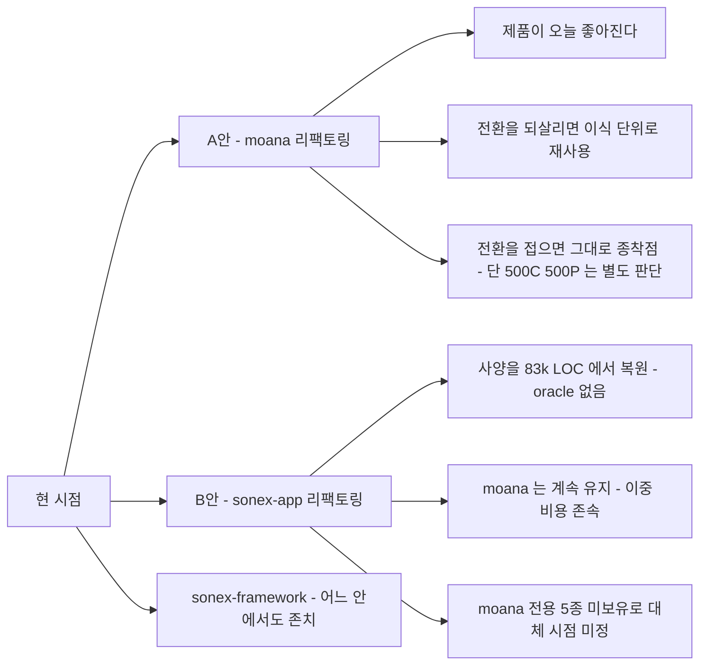

# `moana` vs `sonex-app` — 리팩토링 대상 선택

> **질문**: Qt6 LGPLv3 로 가면 Qt 라이선스 비용이 0 이다([licensing.md](licensing.md)). **둘 다 리팩토링하지는 않는다** — 하나만 고른다면 무엇인가.
>
> **결론**: **`moana` 다.** 결정 인자는 라이선스가 아니라 **회귀 판정 oracle 의 유무**이고, 여기에 비대칭이 하나 더 있다 — **moana 를 고치면 `sonex-app` 이 불필요해질 수 있지만 그 역은 성립하지 않는다**(§2.3).
>
> **그리고 `vs` 의 상대는 `sonex` 전체가 아니라 `sonex-app` 이다.** `sonex-framework` 는 재작성이 아니라 장비·영상 R&D 트랙이고 **그 산출물이 moana 로 흘러간다** — 어느 안에서도 리팩토링 대상이 아니다(§2.1).
>
> **라이선스 축은 통째로 비었다.** Qt · QCustomPlot · CVIE 셋 다 대상 선택의 결정 인자가 아니다(§1).

**실측 기준**: `moana` `origin/service_QT693` @ `7b26a9b27`(2026-07-27) · `sonex-app` `origin/feature-apply_v1.23.4`(2026-07-15) · `sonex-framework` `origin/master`(2026-07-23).
**현행 구조 SOT**: [../review/moana-app.md](../review/moana-app.md) · [../review/sonex-app.md](../review/sonex-app.md) · [../review/change-cost.md](../review/change-cost.md).
**이 문서에서 뒤집은 판단 5건은 [§8](#8-뒤집힌-판단)에 모아 뒀다.**

---

## 1. 라이선스 — 저울이 통째로 빈다

**Qt 항목은 실제로 소멸한다.** 사용 모듈 전부가 LGPLv3 로 커버되고 GPL 전용 모듈이 0건이며, 출하 3타깃(Android·iOS·Windows 데스크톱) 전부 Qt6 경로가 이미 서 있다 — Android Qt5→Qt6 최초 구동 2025-08-07, iOS Qt6 출하 완료, Windows 데스크톱 Qt 6.6.3 빌드 수정 2026-06-28(`73ef8ee3d`), Windows 버전 bump 2026-07-06(`9982f61d6`). **가정이 아니라 진행 중인 사실이다.**

| 항목 | `moana` | `sonex` (app·framework 공통) | 저울 |
|---|---|---|---|
| **Qt 상용 계약** | LGPLv3 로 **비용 0** | 해당 없음(Flutter=BSD) | **동점** |
| **QCustomPlot GPLv3** | 데스크톱 블록에 컴파일되나 **출하 제품 기능이 아니다** — 정비용 도구이고 **제거 스위치가 이미 소스에 있다**(§1.1) | 0건(전 브랜치 검색) | **빠짐** — 양쪽 동일 + 부채로서도 작다 |
| **CVIE**(ContextVision, 상용) | `framework/ContextVision` + `HC_CVIE_SUPPORT`(12파일 79곳). **OpenCV 기반 대체가 출하 코드에 있고 런타임 자동 폴백까지 배선**(§1.2) | `third_party/context_vision` 82MB + `HCNLMFilter`·`HCSRIv20_5`·`HCSRIv22*` **8종** | **빠짐** — 양쪽 다 대체 보유. moana 가 오히려 앞선다 |
| 기타 서드파티 고지(OpenCV·DCMTK·FFmpeg·TFLite·OpenSSL) | 고지 0건 | 고지 0건 | **동점** — 어차피 해야 함 |

### 1.1 QCustomPlot — 근거가 두 겹으로 무너진다

**① 비교 저울에서 상쇄된다.** moana 는 어느 안을 택하든 `sonex-app` 완성까지 수년간 출하된다. 두 선택지에서 동일하게 발생하는 항목은 비교에 무게가 없다.

**② 부채로서도 작다 — 제거 스위치가 이미 있고 꺼져 있다.**

| 실측 | 위치 |
|---|---|
| **출하 제품 기능이 아니다** — 정비 메뉴 토글, 기본값 `false`. `isDebugModeEnable`·`isAutoTestModeEnable`·`isFilterOptimizeModeEnable` 과 같은 묶음 | `Setting/MaintenanceSetting.h:26,41` · `Setting/SettingMaintenanceView.qml:374` |
| **제거용 매크로가 이미 존재하고 주석 처리돼 있다** | **`app/app.pro:74` `#DEFINES += ENABLE_IMAGE_ANALYZER`** — 이 매크로가 `Common/AppSetting.cpp:71` 에서 토글을 강제 활성화한다 |
| 데스크톱 전용으로 이미 격리 | `Main/MainViewController.cpp:19` `#if defined(Q_OS_MACOS) \|\| (defined(Q_OS_WIN) && !defined(Q_OS_WINRT))` |
| 모바일 대응물은 **27줄 빈 `Item` 스텁** | `Resources/QML/Mobile/ImageAnalyzerView.qml` (데스크톱판 710줄) |
| 결합 표면 | 래퍼 `CCustomPlotItem` 1개 + QML 인스턴스 **2곳**(`Desktop/ImageAnalyzerView.qml:70,394`) |

**해소 경로가 "대체재 탐색 또는 상용 라이선스 구매" 가 아니라 "릴리스 빌드에서 제외" 다.** `.pro` 조건부 블록 몇 줄이고, 그 스위치를 그들이 이미 만들어 뒀다. 사내 정비 빌드는 사외 배포가 아니므로 GPL 의무가 발동하지 않는다.

### 1.2 CVIE — 오픈소스 대체가 이미 출하 코드에 있다

> **CVIE = ContextVision Image Enhancement.** 스웨덴 **ContextVision AB** 의 상용 초음파 영상개선(노이즈 억제·에지 강조) 라이브러리.
>
> | 항목 | 실측 |
> |---|---|
> | 정체 | `READMESDK.txt` 첫 줄 *"CONTEXTVISION COMPANY CONFIDENTIAL — ContextVision CVIE SDK for Image Enhancement"*, SDK **6.0.0.8** |
> | moana 결합 | `framework/ContextVision/` 래퍼. 바이너리 `lib/android/contextvision/CVIESDK/bin/arm64-v8a/libcvie64.so` |
> | **라이선스 매니저 기반 상용 계약** | `.cov` 라이선스 파일 2개(`ID-0001137-001_Beta.cov`·`ID-0001200-001.cov`)가 저장소에 있고, 코드가 `Cvie::Instance()` 생성 **전에 CVLM(ContextVision License Manager) 초기화**를 먼저 한다(`ContextVision.cpp:30`) |
> | 조직 부위별 파라미터 | `.us2d6` 3종 — Carotid · MSK · Thyroid(2022-01-27) |
> | sonex 결합 | `sdk/third_party/context_vision` **82MB** — android `.so` · iOS `.framework` · windows `.dll` |

**moana 출하 코드가 CVIE 라이선스 유무로 런타임 배타 분기한다.**

```cpp
// framework/ImageProc/ImageProc.cpp:1229-1235 (원문)
// 영상향상 엔진 분기: CVIE 라이선스(설정 cvieSetting>=0) 가 있으면 CVIE(SRI-E) 가 처리하고,
// 없으면 NextSRI(HNS V1.20.5) 를 적용한다.
// 라이선스 有 -> CVIE 만, 無 -> NextSRI(HNS) 만 돌도록 두 분기 모두 이 조건으로 배타 처리한다.
const bool cvieActive = (getCvieSetting() >= 0);
const bool useNextSRI = (isNLM && filterMode != 0 && !cvieActive);
```

| 항목 | 실측 |
|---|---|
| **대체 구현** | `framework/ImageProc/HCNextSRIFilter.{cpp,h}` — 커밋 **`cdafdc970`(2026-06-24) "NextSRI(V1.20.5) SRI 필터 포팅 + byte-identical 검증"** |
| **기반 라이브러리** | **OpenCV 단독** — `cv::fastNlMeansDenoising`(NLM base) · `cv::edgePreservingFilter`(thyroid/msk EPF) · `cv::UMat`(OpenCL 가속). OpenCV 3.4.x = **BSD-3-Clause** |
| **알고리즘** | NLM base 위의 자체 후처리 체인 — `base_mix → contrast → raw_hf inject → unsharp → clip → line_boost → final EPF → force_darken`. anatomy preset 별 파라미터 |
| **헤더가 목적을 명시** | *"CV(ContextVision) 라이선스가 없을 때 사용되는 SRI 경로를 대체한다"* |

**즉 CVIE 는 "빼면 화질이 바뀐다" 가 아니라 "이미 뺄 수 있게 만들어 뒀다" 다.** 그리고 대체가 AI 모델이 아니라 **고전 신호처리 + OpenCV** 라 이식성이 좋다.

**그래도 남는 것 — 등가성은 미검증이다.** 증거 차원을 섞지 않는다. 커밋 메시지의 *"byte-identical 검증"* 은 **Python 레퍼런스(`pipeline_v1_20_5.py`)와의 일치**이지 **CVIE 와의 화질 등가가 아니다.**

| | |
|---|---|
| **CVIE 가 여전히 기본값이다** | 라이선스가 있으면 CVIE 가 돈다 — 그들이 더 낫다고 판단하고 있다는 뜻 |
| 임상 화질 비교 기록 없음 | 저장소에서 CVIE vs NextSRI 대조 자료를 찾지 못했다 |
| 의료기기 재검증 부담 | 영상 처리 경로 변경은 규제 관점에서 별건 |
| `.us2d6` 부위별 튜닝 | NextSRI 도 anatomy preset 을 갖지만 1:1 대조되지 않았다 |

> **부수 확인 — 범위 판단에 영향**: NextSRI 의 레퍼런스 경로가 `.../moana/NextSRI/nextsri/pipeline_v1_20_5.py` 다. **[CLAUDE.md](../../CLAUDE.md) 가 "신호처리 R&D(범위 제외)" 로 둔 `NextSRI`(id 77)가 출하 코드의 알고리즘 정본이다.** 제외 판단 재검토 항목이 한 번 더 강화된다.

---

## 2. 대상 정의 — `vs` 의 두 항이 무엇인가

### 2.1 `sonex` 는 한 덩어리가 아니다

| | `sonex-app` (Flutter 앱) | `sonex-framework` (SDK·ADK) |
|---|---|---|
| 성격 | **moana 를 대체하려는 재작성** | **장비·영상 R&D 및 SDK 트랙** |
| 도메인 이식 | **0건** | 해당 없음 |
| 활동(2026) | 05 17 → 06 9 → **07 2커밋** | 05 **97** → 06 24 → 07 4 |
| 최근 작업 주제 | — | **500C/P WiFi(RS9116) 펌웨어 굽기 실장비 검증** · 300C/L·500L 펌웨어 굽기 · SRI 필터 canonical · 500C convex FOV 교정 · 실시간 스캔 latency |

**결정적 실측 — `sonex-framework` 의 산출물이 moana 로 흘러간다.**

| 방향 | 증거 |
|---|---|
| framework → moana | moana `HCNextSRIFilter.h` 주석: *"sonex-framework 의 `HCSRIv20_5Filter.cpp` 는 대조 참고용"*. **SRI V1.20.5 알고리즘이 moana 로 포팅됐다**(`cdafdc970`) |
| moana → framework | 커밋 제목이 직접 말한다 — *"사이드 룰러 0cm 정합(**Moana**)"* · *"ADK Windows 데이터 경로를 **Moana** 와 정합"* · *"Windows SDK … SONON X 폴더명 **Moana** 호환"* |

**`sonex-framework` 는 moana 를 밀어내는 것이 아니라 moana 와 상호 정합 중인 기능 트랙이다.** 리팩토링 대상으로 놓을 물건이 아니라 **계속 돌아야 하는 축**이다.

### 2.2 그래서 선택지는 둘이다

| 안 | 리팩토링 대상 | `sonex-app` | `sonex-framework` |
|---|---|---|---|
| **A** | **`moana`** | 동결 — 존폐는 별도 결정 | **존치**(대상 아님) |
| **B** | **`sonex-app`** | 재작성 계속 + 구조 정리 | **존치**(동일) |

**`sonex-framework` 가 어느 안에서도 상수이므로, `vs` 의 실제 두 항은 `moana` 와 `sonex-app` 이다.**

### 2.3 결정적 비대칭

> **moana 를 리팩토링하면 `sonex-app` 이 불필요해질 수 있지만, `sonex-app` 을 리팩토링해도 moana 는 불필요해지지 않는다.**

`sonex-app` 이 moana 를 밀어내려면 **moana 전용 5종 + 도메인 전량**이 있어야 하고 도메인 이식은 현재 **0%** 다. 반면 정리된 moana 는 **오늘 이미 제품**이다. 그리고 라이선스 축이 비면서(§1) Qt 를 떠나야 할 이유도 사라졌다.

> **다만 비대칭이 완전하지 않다** — moana 는 **`500C`·`500P` 를 구동하지 못한다**(§3.1). 이 두 모델에 한해서는 `sonex-app` 이 대체 불가이고, **"moana 를 고치면 sonex-app 이 불필요해진다" 가 자동으로 성립하지 않는다.** 성립시키려면 500C·500P 를 moana 에 얹어야 하고, 그 비용을 낮추는 것이 [r1 Phase 10](r1/phase10-runtime-variant.md) 이다.

**비대칭이 하나 더 있다 — 투자 회수.** moana 리팩토링은 나중에 Flutter 전환을 되살리더라도 버려지지 않는다(`domain`+`data` 가 그대로 이식 단위가 된다). 반대는 성립하지 않는다.



---

## 3. 실측 대조 — 세 저장소를 분리해서 본다

**앞 두 열이 선택지이고, 세 번째 열은 대상이 아니라 참고다**(§2.2).

| 축 | `moana` (**후보 A**) | `sonex-app` (**후보 B**) | `sonex-framework` (대상 아님) |
|---|---|---|---|
| 자체 소스 | **204,206 LOC / 475파일** (qcustomplot 43,303 제외 시 **160,903**) + QML 147 | `lib/` **69,016 / 131파일** | **~240,900** (SDK 86,853 · ADK 32,192 · 공유 22,834 · 샘플 등) |
| 저장소 크기 | 9.4G (벤더 `lib/` 6.1G) | 510M (`.so` 39개 103MB 커밋) | 2.0G (**자체 소스 0.3%**) |
| 커밋 · 저자 | **5,705 · 17명** (2018-06 ~ 2026-07-27) | 249 · 2명 (2024-04 ~ 2026-07-15) | 524 · 4명 (2023-05 ~ 2026-07-23) |
| 최근 활동 | `service_QT693` 현재 진행 | **꺾임** 05 17 → 07 2 | **꺾임** 05 97 → 07 4 |
| 출하 타깃 | Android · iOS · **Windows 데스크톱** | windows · android · ios · macos (`linux`·`web` 은 스텁) | (앱을 따른다) |
| 지원 모델 | **8종** — `Model.cpp` capability table 분기: 300C·310C·300L·300MC·300PA·300VC·500L·L43K(FUJI) | — | **5종** — `HCInstructionSet{300C,300L,**500C**,500L,**500P**}` |
| **모델 집합 관계** | **부분집합이 아니라 교집합이다**(§3.1) — 공통 3종(300C·300L·500L) · moana 전용 5종(300 계 파생·FUJI OEM) · **sonex 전용 2종(500C·500P = 최신 하드웨어 라인)** | | |
| 초음파 도메인 | **전부 있다** — 측정 12.7k · 환자기록 20.1k · DICOM/PACS/MWL 3.0k · Ambulance 14.9k · BLE | **이식 0건.** 계층을 가진 유일한 부분은 음성제어 신규 기능(`packages/dr_sono` `domain/` **251 LOC**) | 해당 없음 |
| 계층 구조 | 2계층(app/framework) 규율 유지 — 역의존 **6건**/475파일 | **혼재** — `lib/modules/*`(구 GetX) vs `lib/features/*`(신) | ADK→SDK 단방향, 역방향 0건 |
| 최대 파일 | `ScanPlayer.cpp` **7,526** / 메서드 255 / 멤버 415 | `scan_controller.dart` **8,354** | `HCImageRenderCore.cpp` **7,679** (6주 반 **+68%**) |
| 구조 부채 | `Common` 허브 유입 **248건(64%)** · 순환 **12쌍** · `INCLUDEPATH` 평탄화 27줄 · `HC_SONON_500L` **81파일 556곳** | 구 계층 **48,206** vs 신 **8,440** · i18n 키 1개 · codegen 산출물 0 | 정본 부재(렌더러 헤더 **4벌, `sizeof`·vtable 불일치** · 셰이더 사본 2벌) · 결합 4벌 · Win32 **901줄** · 듀얼 **2중 구현** |
| 부채 추세 | 안정 — 구조가 8년째 같다 | **악화** — 구 계층 분기당 **+76%**(1년 4.6배), 신 계층 최근 분기 **+59 LOC** | 빌드 계통 2026-01 이후 정지 |
| 빌드 재현 | 절대경로(`/Users/rio/`·`~/QtCommercial/`), 버전 정본 **3곳**·릴리스 타깃 **2곳 불일치** | **SDK 바이너리를 개발자 머신 경로로 받는다.** 앱↔SDK 버전 고정 장치 **0** | 플랫폼별 3분기(MSBuild·ndk-build·CMake), macOS 는 Homebrew 절대경로 |
| 자동 판정 | 테스트 0 · CI 0. **단 자동화 훅 4종 존재** — `ScanAutoTestController`·`AgingTestController`·`DummyPlayer`·`Record` 6,571 | 테스트 **2,518 LOC** · CI 0(**실행되지 않는다**) | 테스트 실질 1파일 · CI 0 |
| 사람 안전망 | **사내 QA 실동** — 출하 브랜치 `[SQA]` 150건 | — | — |

### 3.1 모델 커버리지 — moana 가 500C·500P 를 구동하지 못한다

> **초판의 "moana 10종 / sonex 5종" 표기가 오해를 낳았다.** 부분집합처럼 읽히지만 **교집합**이고, **sonex 쪽 차집합이 최신 라인**이다(§8-5).

| 실측 | 근거 |
|---|---|
| **moana 의 실구동 모델은 8종** | `app/Sources/Common/Model.cpp` 의 `modelName ==` 분기 + `InitCapabilityTable_*` — 300C·310C·300L·300MC·300PA·300VC·500L·FUJI L43K |
| **출하 계통에는 500C·500P 가 없다** | `framework/Common/CommonData.cpp:71,73` 의 `deviceModelList` 문자열 목록에만 있다(700C·700L 도 함께). `Model.cpp` 에 capability table 분기 없음 |
| **그러나 미병합 브랜치에는 있다 — `origin/sonon_500c`** | **71커밋 / 113파일 / +14,946줄**, 최종 **2023-09-19**. **500C·500P 둘 다 있다** — `Model.cpp` 에 `MODEL_500C` 18곳·`MODEL_500P` 18곳, `InitCapabilityTable_500C`·`InitCapabilityTable_500P` 각각 선언·정의(`Model.h` 각 1). 커밋 내용도 실기능이다 — *"500C audio sync with PRF"* · *"PW spectrum pre image processing"* · *"M mode crash fix"* · *"fix sweep speed"* |
| **sonex 는 500C·500P 명령셋을 갖는다** | `sdk/include/HCInstructionSet{500C,500P}.h` + `DeviceManager/shared/` 구현 |
| **500C 는 활발한 신규 라인이다** | `device/legacy/500c-sn-fw` 71커밋(2023-06 ~ 2026-04, Socionext 베어메탈) · `fpga/legacy/charm-fpga`(500C 용) · sonex-framework **2026-07-23** *"500C/P WiFi(RS9116) 펌웨어 통합 굽기 — 5계층 구현 + 실장비 검증"* |
| **moana 가 sonex 의 500C 튜닝을 참조한다** | `HCNextSRIFilter.cpp:17` 주석 *"EPF 생략 … sonex 500C 와 동일"*, `:457` *"500C = idx 1"* — **영상 파라미터는 이미 넘어왔는데 장비 구동은 못 한다** |

**따라서 `sonex-app` 은 "moana 를 따라가는 것" 만 하는 게 아니다 — `500C`·`500P` 의 **현재** 유일한 호스트 앱이다.** 이것이 라이선스·CVIE 가 전부 빠진 뒤에도 남는 **유일한 실질 존재 이유**다.

> **다만 "moana 가 못 한다" 가 아니라 "moana 출하 계통에 도달하지 못했다" 가 정확하다.** `sonon_500c` 브랜치가 2023-09 까지 실기능을 쌓고 멈췄고, 그 사이 `sonex` 가 500C 호스트가 됐다.
>
> **이것은 이 검토의 논지를 가장 잘 보여주는 표본이다** — [../review/change-cost.md](../review/change-cost.md) 가 잰 **출하 미도달 712커밋(12%)** 중 71건이 이것이고, 결과가 *"제품 하나를 다른 앱으로 넘긴 것"* 이다. 브랜치로 변종을 영구 분기하는 방식의 비용이 **제품 라인 단위로** 나타난 사례다.

**다만 격차가 프로토콜은 아니다.** `500c-sn-fw` 도 **같은 HC 프로토콜**을 쓴다(`src/App/Communication/USSCustomCommand.c`, [proof/protocol-sot/](proof/protocol-sot/) 전수 대조 대상). moana 에 없는 것은 전송 계층이 아니라 **모델 파라미터·명령셋 등록**이고, 그것을 싸게 만드는 것이 정확히 [r1 Phase 10](r1/phase10-runtime-variant.md)(컴파일 타임 변종 → 런타임 설정)이다. **지금은 `HC_SONON_500L` 이 81파일 556곳이라 모델 추가가 비싸다.**

> **미검증**: 500C·500P 의 명령셋 차이가 데이터로 흡수되는지. Socionext 베어메탈이라 `500L`(ZynqMP/Linux)과 장비 아키텍처가 다르다 — §7-2.

### 3.2 `sonex` 가 moana 보다 많은 것 — 전수 대조

**기능 방향이 한쪽이 아니다.** moana 가 상위 호환이라는 인상은 틀렸다.

| # | sonex 고유 | 규모 | moana 대응 | 성격 |
|---|---|---|---|---|
| 1 | **`500C` · `500P` 구동** | `HCInstructionSet{500C,500P}` + DeviceManager 구현 | **0** — `Model.cpp` 에 분기 없음(§3.1) | **하드웨어 제품 라인.** 접으면 못 판다 |
| 2 | **Dr.Sono — 음성 제어 + Gemini LLM** | `packages/dr_sono` **33파일 6,138 LOC** — STT · Google Cloud TTS · `gemini_service`·`gemini_prompts` · `local_server` | **0건** — `gemini`·`voice_command`·`speech` 심볼 전무 | **신규 차별화 기능.** 스택 종속이 아니라 이식 가능 |
| 3 | **HNS AI 노이즈 제거(CoreML 추론)** | `HNSFilterV2_{iOS,macOS}.mm` + ONNX·CoreML 모델 14MB | 고전 신호처리(`HCNextSRIFilter`/OpenCV)로 커버 | **iOS·macOS 만 실동작**(Windows `onnxruntime` 0건, Android `.tflite` 0건) |
| 4 | `report_window`(3파일) · `command_window`(2파일) | — | 파일명 기준 대응물 0건 | **규모가 2~3파일**이라 무게가 없다 |
| 5 | macOS 타깃 | — | `app.pro` 에 `macx` 분기 존재 | **양쪽 다 출하 여부 미확인**(§7-5) |

**반대 방향이 더 크다.**

| moana 고유 | 규모 | sonex 대응 |
|---|---|---|
| **Ambulance**(러시아 EMS, GPS 태그 업로드) | app 27 + framework 12파일 = **14,906 LOC** | **0건**(`ambulance` 검색 무결과) |
| **측정·캘리퍼 8종** | 50파일 **12,689 LOC**, 모드별 분리 | `scan_controller.dart` 안에 미분화 |
| **DICOM · PACS · MWL** | 3,000 LOC | `dcm_file_info_model.dart` 수준 |
| **모델 5종** — 310C·300MC·300VC·300PA·L43K(FUJI OEM) | `InitCapabilityTable_*` | 0 |
| BLE 페어링(500L/500P) | `app/BLE` 724 + `framework/Platform` | — |

> **`split_window`(7파일)는 sonex 고유가 아니다** — moana 에 `ScanDualMenuView`·`ScanDualModeView2`·`ScanSubPrimary/SecondaryDualMenuView` 가 있다.

**요지: sonex 고유 5건 중 구조적으로 구속력이 있는 것은 1번 하나다.** 2·3번은 **스택 종속이 아니라 이식 가능한 기능**이고(Dr.Sono 는 Gemini REST + STT/TTS, HNS 는 ONNX·CoreML 모델 파일), 4·5번은 무게가 없다.

---

## 4. A안 — `moana` 리팩토링

### 장점

| # | | 근거 |
|---|---|---|
| 1 | **대상이 확정돼 있다** — 무엇을 만들지에 미확정이 없다. 사양이 곧 출하물 | 도메인 전부 존재(§3). `sonex-app` 은 이식 0건이라 "무엇이 완성인가" 가 코드·문서 어디에도 없다 |
| 2 | **회귀 판정의 oracle 이 존재한다** | 출하 중인 동작이 기준이다. **cctv 에서 자기구현을 oracle 로 삼은 사고가 실제로 났다**(기능 누락이 테스트를 통과) — [assessment.md §2.2](assessment.md) |
| 3 | **회귀 기준선 착수 비용이 낮다** — 만드는 게 아니라 잇는 것 | "녹화 → 무장비 재생 → 스캔 자동 구동 → 캡처 저장" 부품이 **전부 앱 안에 있다**([r1/plan.md §2.7](r1/plan.md)). 없는 것은 판정과 CI 배선 |
| 4 | **목표 구조의 정본이 사내에 실물로 있다** | cctv `desktop/cms-app` — **같은 Qt/C++ 데스크톱 앱**에서 3계층이 이미 끝났다. 설계안이 아니라 재현 |
| 5 | **끊는 비용이 실측상 작다** | 순환 12쌍 중 **10쌍의 역방향이 5건 이하**, 역의존 6건 중 5건이 `AppSetting.h` 하나. 골격이 이미 feature 로 나뉘어 있고 QML 도 파일명 접두사가 곧 feature |
| 6 | **투자가 어느 쪽으로도 버려지지 않는다** | 전환을 되살리든 접든 `features/<name>/{domain,data}` 가 이식 단위가 된다([architecture.md §4.3](architecture.md)). **Qt 비용이 0 이라 출하 기간 상한도 없다** |
| 7 | **조직 다수가 이 코드로 일한다** | 저자 17명 · `[SQA]` 150건. `sonex-app` 은 2명 |
| 8 | **제품 커버리지가 넓다** | moana 전용 **5종**(310C·300MC·300VC·300PA·L43K) · 출하 3타깃. **단 상위 호환은 아니다** — 500C·500P 는 sonex 전용(§3.1) |

### 단점

| # | | 대응 |
|---|---|---|
| 1 | **Qt6 이행이 동시 진행 중** — 같은 파일을 두 작업이 만진다 | Phase 0~2 는 충돌 면이 작다. Phase 3 착수 전 이행 상태 확인 — **미확인** |
| 2 | **출하 브랜치 위에서 해야 한다** — `service_QT693` 은 오늘도 커밋된다 | phase 를 짧게 끊어 매번 출하 계통으로 복귀([principles.md §1](principles.md)) |
| 3 | **골든이 UI 를 못 잡는다** | 최근 회귀 표본에서 데이터 경로 E2E 가 닿는 것은 **25%**, **44%는 QML UI**([../review/change-cost.md §7](../review/change-cost.md)). 사내 QA 병행 유지 |
| 4 | **qmake 전용** — 자체 `CMakeLists.txt` 0건 | **r1 범위 밖.** 빌드 시스템 교체와 구조 변경을 동시에 하면 회귀 원인을 가를 수 없다. 디렉토리 정리 후가 이행 적기 |
| 5 | **나중에 Flutter 전환이 되살아나면 presentation 투자는 소멸** | 이식에서 presentation 은 어차피 다시 쓴다. **그래서 목표 구조가 UI 를 feature 밖으로 뺀다** — `domain`+`data` 는 살아남는다([r1/plan.md §1](r1/plan.md)) |
| 6 | 저장소 9.4GB (벤더 `lib/` 6.1G) | 별건. Phase 0 은 툴체인 *경로*만 다룬다 |

---

## 5. B안 — `sonex-app` 리팩토링

> **`sonex-framework` 의 자산(ADK→SDK 단방향 · 렌더러 계층 위치 · 필터 계보 8종)은 여기에 넣지 않는다.** 어느 안에서도 존치되므로 **B안의 장점이 아니다**(§2.2). 초판이 이것을 sonex 쪽 가점으로 센 것이 오류였다(§8-3).

### 장점

| # | | 근거 |
|---|---|---|
| 1 | **`500C`·`500P` 의 유일한 호스트 앱이다** | **라이선스·CVIE 가 전부 빠진 뒤 남는 유일한 실질 존재 이유**(§3.1). moana 는 이 두 모델을 구동하지 못하고, 500C 라인은 펌웨어·FPGA·SDK 세 축에서 현재 개발 중이다 |
| 2 | **목표 기술이 이미 선택돼 있고 팀이 3년 투자했다** | 번복 근거가 없다. 목표 구조(Flutter, clean architecture)는 [assessment.md §2.3](assessment.md) 에서 **유지** 판정 |
| 3 | **패턴이 사내에 이미 있다** | `packages/dr_sono` 가 `domain`/`data`/`presentation` 형태다. **단 6,138 LOC 음성제어이고 `domain/` 은 251 LOC** — 초음파 도메인 전례는 0 |
| 4 | **테스트가 2,518 LOC 있다** | 2026 Q1 에 30 → 2,518. **CI 0 이라 실행되지 않는다** |
| 5 | **macOS 타깃** — moana 에 없다 | 출하 제품인지 **미확인**(§7-4) |

### 단점

| # | | 근거 |
|---|---|---|
| 1 | **사양의 정본이 여기에 없다** | 도메인 이식 **0건**, 제품 본체는 계층 없는 **48,206 LOC**. B안은 **83k LOC `Scan/` 을 뒤져 사양을 복원**하는 것부터 시작한다 |
| 2 | **판정 oracle 이 없다** | 미완성인 것을 바꾸므로 기준이 없다. **자기구현이 oracle 이 되는 사고의 선례가 사내에 있다**(§4 장점 2) |
| 3 | **대상이 작업 중에 커진다** | 구 계층 분기당 **+76%**, 신 계층 최근 분기 **+59 LOC**. **"아직 싸다" 가 아니라 "매 분기 비싸진다"** |
| 4 | **moana 를 대체하지 못한 채 끝난다** | 공통 3종뿐이고 moana 전용 5종이 남는다(§3.1). 대체 시점을 정할 수 없고 그동안 **이중 유지 비용이 그대로다** — 프로토콜 클라이언트 2벌 · SRI 필터 2벌 · 클라우드 연동 2벌 |
| 5 | **빌드 재현이 0 이다** | SDK 바이너리를 개발자 머신 경로로 받고 **앱↔SDK 버전 고정 장치가 없다.** 어느 앱 빌드가 어느 SDK 빌드와 짝인지 저장소에서 확인 불가 |
| 6 | **활동량이 꺾이는 중** | 2026-05 17 → 06 9 → 07 **2커밋** |
| 7 | **완료 조건이 없다** | 착수 후 2년 3개월(SDK 기준 3년 2개월). 판정 기준이 코드·문서 어디에도 없다 |

---

## 6. 판정

### 라이선스는 결정 인자가 아니다

| | |
|---|---|
| **빠진 것** | Qt 상용 비용. 그리고 그것에 기댄 *"Flutter 는 BSD 라 라이선스 항목이 자연 해소"* 라는 **전환 우선순위 논거**([assessment.md §2.4](assessment.md)) |
| **남은 것** | **없다.** QCustomPlot 은 §1.1, CVIE 는 §1.2 에서 각각 빠졌다 |
| **새로 생긴 것** | **moana 를 서둘러 버려야 할 이유가 하나 줄었다.** Qt 비용이 0 이면 moana 출하 기간의 상한이 없어지고 투자 회수 기간이 길어진다 — §4 장점 6 이 강해진다 |

### 결정 인자는 oracle 이다

> **moana 를 고치면 "고쳤는지" 를 출하물이 판정한다. `sonex-app` 을 고치면 판정할 것이 없다.**

[README.md](README.md) 의 핵심 진단 — *"고쳤는지 확인할 방법이 없어서 큰 변경이 끝나지 않는다"* — 이 그대로 적용된다. **`sonex-app` 착수 후 도메인 이식 0건인 것이 이 진단의 증거이고, 같은 사람들이 출하 계통 위에서 한 Qt6 이행은 2개월 17일에 출하됐다.** 방식의 차이지 인력의 차이가 아니다.

### 권고 — A안. `moana` 하나만 한다

| | |
|---|---|
| **대상** | **`moana` 단독.** [r1/plan.md](r1/plan.md) Phase 0~10 |
| **`sonex-framework`** | **손대지 않는다.** 리팩토링 대상이 아니라 계속 돌아야 하는 기능 트랙이다(§2.1). 다만 moana 와의 정합을 관행이 아니라 **명시적 계약**으로 바꾼다 — 프로토콜 정본([proof/protocol-sot/](proof/protocol-sot/))이 그 자리다 |
| **`sonex-app`** | **동결.** 존폐는 우리 결정이 아니다. 다만 **신규 기능이 구 계층으로 들어가는 것은 멈춰야 한다** — 분기당 +76% 가 계속되면 나중에 되살릴 때의 비용만 커진다 |
| **조건 1** | **`sonex-app` 의 존폐를 결정한다 — 다만 이것은 SW 결정이 아니라 제품 라인 결정이다.** 라이선스·CVIE 가 전부 빠진 뒤 남는 존재 이유는 **`500C`·`500P` 하나**이고(§3.1), 접으면 그 두 모델의 호스트 앱이 없어진다. **묻어야 할 질문은 "전환을 계속하나" 가 아니라 "500C·500P 를 moana 에 얹을 것인가" 다** |
| **조건 2** | **NextSRI vs CVIE 화질 등가성을 판정한다.** 대체 코드는 이미 있고 등가성만 미검증이다(§1.2). **대상 선택과 무관**하며 [r1 Phase 1](r1/phase1-regression-baseline.md) 골든 회귀의 첫 소비처가 된다 |

### 그러면 sonex 작업분을 moana 가 흡수해야 하나 — 순서가 전부다

**`sonex-app` 을 접으려면 흡수해야 한다. 다만 그것은 리팩토링에 포함되는 것이 아니라 리팩토링이 끝나야 싸지는 후속 작업이다.** [r1](r1/plan.md) 은 구조 작업이지 기능 추가가 아니다.

| 흡수 대상 | 필수 | moana 현재 | 비고 |
|---|---|---|---|
| **`500C`·`500P` 명령셋 + 모델 파라미터 테이블** | **필수** | 0 — `Model.cpp` 분기 없음 | 프로토콜은 같다(HC). 장비 아키텍처는 다르다(Socionext 베어메탈 vs ZynqMP/Linux) |
| **500C/P 펌웨어 굽기 경로** | **필수** | `Main/FirmwareUpdater.cpp` **121줄**, `HC_SONON_500L` 가드 안에서 `"500L"`·`"L43K"` 문자열 비교만 | sonex 는 `HCFirmwareController`+`HCFirmwareVersionChecker`+모델별 `.ini`(**`500-SN-Firmware.ini`** = Socionext) |
| 500C 영상 파라미터 | 부분 완료 | `HCNextSRIFilter` 가 이미 `500C = idx 1` 분기를 갖는다 | sonex 에서 이미 넘어왔다 |
| Dr.Sono(음성·Gemini) | **선택** | 0건 | Gemini 는 REST, STT/TTS 는 플랫폼 서비스 — 이식 가능하나 **Dart 6,138 LOC 재작성** |
| HNS AI 필터 | **선택** | 고전 방식(NextSRI)으로 커버 중 | sonex 도 iOS·macOS 만 실동작 |

**순서가 뒤집히면 손해가 난다.**

| 순서 | 결과 |
|---|---|
| **지금 얹으면** | `HC_SONON_500L`(81파일 556곳) 옆에 **컴파일 분기가 하나 더 는다.** 리팩토링 대상이 커지고 [CE/US 뒤바뀜 출하 사고](../review/moana-app.md)와 같은 표면이 넓어진다 |
| **[Phase 10](r1/phase10-runtime-variant.md) 뒤에 얹으면** | 모델 추가가 **데이터 1건**이 된다([r1 성공 판정 10번](r1/plan.md)) |

> **그리고 이것이 Phase 10 의 실제 시험대가 된다.** r1 성공 판정 10번(*"모델 추가 = 데이터 1건, 아티팩트 플랫폼당 1개"*)은 지금 기준이 추상적인데, **`500C`·`500P` 추가가 그 판정을 구체적으로 만든다.** 통과하면 `sonex-app` 을 접을 수 있고, 통과하지 못하면 Phase 10 이 덜 된 것이다.

**A안을 택해도 전환의 문이 닫히지 않는다.** 정리된 `features/<name>/{domain,data}` 는 나중에 Flutter 이식을 되살릴 때 그대로 이식 단위가 된다. **투자가 어느 쪽으로도 버려지지 않는 유일한 선택지다.**

### B안이 정당화되는 유일한 조건

**"moana 출하 중단이 이미 확정됐고 그 시점이 가깝다"** 는 경우다. 그러면 moana 투자 회수 구간이 없어진다. **그러나 현 실측이 전부 반대다** — moana 는 오늘도 커밋되고, Qt6 3타깃 이행을 방금 끝냈으며, 모델 커버리지가 두 배이고, **`sonex-framework` 조차 moana 에 맞춰 정합 중이다**(§2.1).

---

## 7. 이 판정을 뒤집을 수 있는 것 — 미확인

| # | 항목 | 뒤집는 방향 |
|---|---|---|
| 1 | **힐세리온의 전환 의사** — Flutter 전환이 확정 방침인가 | **확정·근시일이어도 A안이 먼저다**(§2.3). 뒤집으려면 "시한이 가깝다" 가 아니라 **"moana 출하 중단 확정"** 이어야 한다 |
| 2 | **`500C`·`500P` 를 moana 에 얹는 비용** | **조건 1 의 답을 정한다.** 프로토콜은 같으나(`500c-sn-fw` 도 HC 프로토콜) Socionext 베어메탈이라 장비 아키텍처가 `500L`(ZynqMP/Linux)과 다르다. **명령셋 차이가 데이터로 흡수되는지 미검증**(§3.1) |
| 3 | **NextSRI 가 CVIE 와 화질 등가인가** | 등가면 CVIE 계약을 끊을 수 있다. **대상 선택은 바뀌지 않는다** — 대체 코드가 양쪽에 다 있다(§1.2) |
| 4 | **`ENABLE_IMAGE_ANALYZER` 를 켜서 사외로 나간 빌드가 있는가** | 있으면 그 배포분에 한해 GPLv3 의무가 남는다. **대상 선택은 바뀌지 않는다**(§1.1) |
| 5 | **`sonex-app` macOS 의 위상** · **moana macOS 분기의 위상** | 둘 다 출하 여부 미확인. moana `app.pro` 에도 macOS 분기가 있다 |
| 6 | **전환 완료 조건의 존재 여부** | 사내 Maniphest·Phriction 에 있을 수 있다(conduit 100건 제한으로 전수 조사 불가) |
| 7 | **CVIE 로열티 규모·계약 조건** | 대상 선택에는 영향 없으나 §7-3 의 우선순위를 정한다 |

---

## 8. 뒤집힌 판단

> 이 갈래의 관행대로 틀린 판단과 그 원인을 남긴다. 전부 **이 문서 작성 중(2026-07-28)** 에 뒤집혔다.

| # | 초판 | 정정 | 원인 |
|---|---|---|---|
| 1 | **"QCustomPlot GPLv3 는 moana 감점"** | **저울에서 뺐다**(§1.1) | [licensing.md §5.1](licensing.md) 의 "가장 심각한 건" 을 그대로 옮겼다. **컴파일된다는 사실만 보고 결합 표면과 제거 경로를 확인하지 않았다** |
| 2 | **"CVIE 탈출 경로는 sonex 에만 있다"** | **moana 에도 있고 런타임 자동 폴백까지 배선돼 있다**(§1.2) | `HNSFilter`·`HCAIDenoiser`·`speckle_noise` 라는 **sonex 쪽 이름으로만 검색**했다. moana 의 같은 기능은 `HCNextSRIFilter` 다. **이름으로 찾고 기능으로 찾지 않았다** |
| 3 | **`sonex` 를 한 덩어리로 저울에 올림** | **`sonex-app`(대상) / `sonex-framework`(어느 안에서도 상수)로 분리**(§2.1) | 저장소 두 개의 성격 차이를 확인하지 않았다. framework 의 자산을 재작성의 가점으로 센 것이 그 결과다 |
| 4 | **"C안(moana 정리 → sonex 이식 파이프라인)" 권고** | **철회. A안 단독**(§6) | 질문이 "하나만" 인데 C 는 결국 둘 다 한다는 뜻이라 **자원 제약을 회피**했다 |
| 5 | **"모델 10종 vs 5종" 을 부분집합으로 서술** | **교집합이다. `500C`·`500P` 는 sonex 전용이고 moana 는 구동하지 못한다**(§3.1) | 숫자만 비교하고 **집합의 원소를 대조하지 않았다.** 그 결과 "moana 가 상위 호환" 이라는 인상을 만들었고, `sonex-app` 의 유일한 실질 존재 이유를 놓쳤다 |

### 다른 문서에 대한 부수 정정

**[architecture.md §4.5](architecture.md)·[assessment.md §2.6](assessment.md)** 의 *"렌더러 소비자가 Flutter 만이 아니다(샘플 8종·`cuattro-sdk`·FUJI OEM)"* 에서 **`cuattro-sdk` 는 근거가 되지 못한다.**

| 실측 | |
|---|---|
| `cuattro-sdk/SononClient/` 는 **moana `framework/SononClient/` 의 포팅** | 파일명 17개 중 **15개 일치**(`BasePacket`·`CtrlChannel`·`DataChannel`·`SononPacket.h` 등) |
| 시기가 안 맞는다 | cuattro-sdk **2017-10 ~ 2018-12** vs sonex-framework 착수 **2023-05** — **5년 앞선다** |
| 샘플 8종도 외부 소비자가 아니다 | 전부 `sonex-framework` 저장소 안의 자사 샘플 |

렌더러를 SDK 계층에 두는 판단 자체는 다른 근거(측정 13종 · scanline↔pixel↔mm 좌표계 결합)로 유지되나, **"외부 소비자가 있어서" 라는 논거는 약해진다.** 두 문서 원문은 아직 수정하지 않았다.

---

## cross-reference

- [licensing.md](licensing.md) — Qt6 LGPLv3 실측, QCustomPlot·서드파티 판정(§1 의 근거)
- [assessment.md](assessment.md) — §2.3 전환 방식 · §2.4 라이선스 · §2.6 sonex 구조 판정 · §3 권장 순서
- [architecture.md](architecture.md) — §4.3 왜 Qt 가 먼저인가 · §4.4 feature 별 진행 순서 · §4.5 렌더 경계
- [r1/plan.md](r1/plan.md) — moana 실행 계획 Phase 0~10
- [../review/sonex-app.md](../review/sonex-app.md) §10~12 · [../review/moana-app.md](../review/moana-app.md) · [../review/change-cost.md](../review/change-cost.md) §7~8
