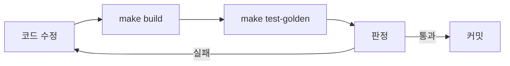
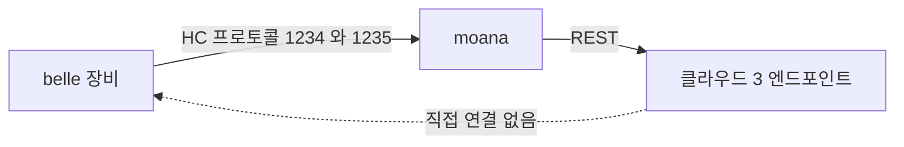

# Phase 1 — 회귀 판정 기준선

> **상태**: 미시작
> **범위**: moana 의 동작 보존 판정 수단. **새 테스트 프레임워크를 도입하지 않는다 — 앱 안에 이미 있는 자동화 훅 4종을 잇는다.**
> **선행**: [Phase 0](./phase0-build-reproducibility.md) — 빌드가 재현돼야 기준선이 의미를 갖는다.
> **후행**: [Phase 2](./phase2-layer-boundary.md) 이후 전부. 이 phase 가 모든 구조 변경의 판정 수단이다.
> **근거**: [principles.md §3·§4](../principles.md) — 동작 보존이 성공 기준이고, 그것을 실행 가능하게 만드는 것이 무장비 실행이다.

---

## 1. 배경

### 1.1 자동 판정은 없다 (확정)

| 항목 | 실측 |
|---|---|
| 자동 테스트 | **0건** |
| CI | **0건** (`.github` · `.gitlab-ci.yml` · `Jenkinsfile` 전부 부재) |
| `test/` 내용 | 수동 테스트 앱 3종(`FrameworkWrapperTest` · `Qt5DatabaseTest` · `ScanView`) + 2018년 녹화 샘플 |

지금 회귀는 **사내 QA**(`[SQA]` 표기 150건)와 **고객 신고**로 잡힌다. 최근 60커밋이 측정 회귀 · PACS 밀림 · FPS 널뜀인 것이 그 결과다([../../review/moana-app.md §9](../../review/moana-app.md)).

### 1.2 그런데 자동화 부품은 이미 앱 안에 있다

이 phase 의 착수 비용이 낮은 이유다.

| 자산 | 위치 | 내용 |
|---|---|---|
| **`CScanAutoTestController`** | `app/Sources/Scan/ScanAutoTestController.{h,cpp}` (267 LOC) | `Q_INVOKABLE start()/stop()/writeCurrentTimestamp()`. `Q_PROPERTY` 로 `scanMode` · `unfreeze` · `saveLogFileEnable` · `saveCaptureFileEnable` · `imageFileName` · `scanPlayer`. **스캔을 프로그램으로 구동하고 캡처를 파일로 떨군다** |
| **`CAgingTestController`** | `app/Sources/Test/AgingTestController.{h,cpp}` (552 LOC) | `Q_INVOKABLE` 4개. 장시간 반복 구동 |
| **`CDummyPlayer` + `CDummyView`** | `app/Sources/Scan/DummyPlayer.{h,cpp}` · `DummyView.{h,cpp}` (352 LOC) | `start()` · `playNextModel()` · `playNextFrame()` — **장비 연결 없이 프레임을 흘린다** |
| **`framework/Record/`** | 20파일 6,571 LOC | 자체 `HEAL` 태그 녹화 포맷 read/write (`BackupFileReader`/`Writer` · `RecordFileReader`/`Writer`) |
| 녹화 샘플 | `test/FrameworkWrapperTest/SnapshotFiles` 외 | 2018년 실장비 녹화 |
| QML 구동면 | `ScanAutoTestView.qml` · `MainAutoTestView.qml` | 위 컨트롤러를 띄우는 화면 |

두 컨트롤러는 이미 QML context property 로 등록돼 있다 — `SononApp.cpp:83-84` 의 `agingTestController` · `scanAutoTestController`.

**즉 "무장비 재생 → 스캔 자동 구동 → 캡처 저장" 이 전부 존재한다.** 없는 것은 둘이다.

1. **입력** — `DummyPlayer` 가 내는 것이 합성 패턴이지 실제 녹화가 아니다
2. **판정** — 캡처를 사람이 눈으로 본다. 기대값 대조가 없다

### 1.3 그런데 **클라우드 축에는 자산이 하나도 없다**

moana 의 외부 경계는 **둘**이다 — 장비(HC 프로토콜)와 클라우드(REST). 위 §1.2 는 전부 **장비 축**이다.

| | 장비 축 | **클라우드 축** |
|---|---|---|
| 무장비 자극원 | `DummyPlayer` ✅ | **없음** |
| 녹화 포맷 | `framework/Record` HEAL ✅ | **없음** |
| 픽스처 · mock · stub | 2018 녹화 샘플 ✅ | **0건**(`find` 실측) |
| 엔드포인트 전환 | — | **소스 수정으로 한다**(아래) |

그리고 규모가 작지 않다 — `CSononCloud::CmdType` **25개**, `CloudAPIController`(1,440) + `framework/Network`(4,217). 엔드포인트가 **셋**이고(Java Spring · Firebase Functions · 정적 배포), **계정 도메인이 Java 와 Firebase 두 시스템에 동시에 존재**한다([../../review/protocol-cloud.md §1·§2](../../review/protocol-cloud.md)).

**게다가 베이스 URL 이 하드코딩돼 있다.**

```
SononCloudApi.cpp:27   // this->baseUrl = "http://test.sonex.healcerion.com:48080/API/"; // Test server URL
SononCloudApi.cpp:28   this->baseUrl = "http://sonex.healcerion.com:8080/API/";           // Default URL
NetworkMonitoringThread.cpp:28  //  hostList.append("http://test.sonex.healcerion.com:48080");
```

**테스트 서버로 전환하려면 소스를 고쳐 다시 빌드한다.** `HC_RELEASE_TARGET` 과 같은 병리다([Phase 0](./phase0-build-reproducibility.md)). 예외는 `firerest.h:25` 하나로, 거기는 `baseUrl` 이 생성자 기본인자라 주입 가능하다.

즉 **[Phase 6-C](./phase6-feature-patient-dicom-cloud.md) 가 2,878 LOC 를 옮기는데 판정 수단이 0 이다.** 이 phase 가 그것을 만든다.

### 1.4 목적

1. **무장비 · 헤드리스**로 스캔 전 경로를 실행한다
2. **클라우드 계약을 픽스처로 고정한다** — 서버 없이 요청·응답을 대조
3. 산출물(캡처 · 측정값 · 패킷 · HTTP 요청)을 **골든과 대조해 자동 판정**한다
4. `make test-golden` + CI 1건 — 이후 phase 가 여기에 붙는다

### 1.5 이것은 record/replay 이지 완전한 E2E 가 아니다

**record/replay = 통신을 녹화해 두고 재생하는 것**이다. 다만 **방향이 비대칭**이고, 그 비대칭이 이 방법이 성립하는 이유다.

| 방향 | 처리 | 역할 |
|---|---|---|
| **들어오는 것**(상대 → moana) | **재생** — 저장해 둔 것을 먹인다 | 실장비·실서버 없이 moana 를 같은 상태로 몰아넣는 **자극원** |
| **나가는 것**(moana → 상대) | **녹화 후 골든 대조** | **판정의 본체** |

| | 재생(입력) | 골든(출력) |
|---|---|---|
| 장비 축 | `Record` 의 HEAL 녹화 → `DummyPlayer` | `SononClient` 송신 HC 패킷 바이트 |
| 클라우드 축 | HTTP 응답 픽스처 → 로컬 스텁 서버 | 요청 URL · 메서드 · 헤더 · 바디 |

**리팩토링은 우리 쪽만 바꾼다** — 장비 펌웨어도 서버도 건드리지 않는다. 그러니 상대는 고정 재생으로 충분하고, 판정은 *"같은 입력에 moana 가 같은 바이트를 내보내는가"* 하나면 된다. 상대를 살아 있게 띄울 이유가 없다.

> 분야별 다른 이름 — HTTP 쪽 VCR/cassette, 일반적으로 golden file test 또는 characterization test. 이 문서는 **계약 고정(contract pinning)** 으로 쓴다.

| | record/replay (이 phase) | 완전 E2E (r1 범위 밖) |
|---|---|---|
| 장비 축 | 녹화 재생 + 송신 패킷 골든 | **에뮬레이터**(`platforms/pc`) 상대 실행 |
| 클라우드 축 | HTTP 픽스처 재생 + 요청 골든 | 스테이징 서버 상대 실행 |
| 덮는 것 | **녹화·픽스처가 지나간 경로** | 상태 전이 · 에러 · 재접속 · 타임아웃 |
| 전제 | 없음 | **belle-fw 빌드 재현**([assessment.md](../assessment.md)) · 서버 접근 |

**리팩토링의 판정 수단으로는 record/replay 로 충분하다** — 같은 입력에 같은 바이트가 나오면 동작이 보존된 것이다([principles.md §3](../principles.md)).

**부족한 지점은 하나다**: 녹화·픽스처가 지나가지 않은 경로 — **에러·재접속·타임아웃**. 그리고 그곳이 하필 상태머신을 건드리는 [Phase 4-A](./phase4-composition-root-presentations.md)(소멸 순서) · [Phase 8-B](./phase8-feature-scan-split.md)(`ScanPlayer` 분해)가 깨뜨리기 쉬운 곳이다. **픽스처에 정상 경로만 담지 않는다**(§2 Step 1-C·1-D).

완전한 장비 E2E 는 [emulator-e2e.md](../emulator-e2e.md) 이고 **belle-fw 빌드 재현이 전제**라 r1 에서 만들 수 없다. **다만 지금 만드는 것이 그때 그대로 쓰인다** — §5 참조.

### 1.6 범위 한계 — 이 기준선이 못 잡는 것

**정직하게 적는다.** [../../review/change-cost.md §7](../../review/change-cost.md) 실측: 최근 회귀 표본에서 **44%(`.qml` 만 건드린 7건)는 확정적으로 이 방식이 못 잡는다.** 나머지 56%(9건) 중 실제로 이 골든이 잡을 수 있는 비율은 **change-cost.md 자신이 "미측정"이라고 명시한다** — 그 문서 초판이 "`framework/` 를 건드림 = 잡힌다 = 4건 25%"로 적었다가 사례와 규칙이 반대임이 드러나 정정됐다(2026-07-28). **여기서도 그 25%를 재사용하지 않는다**(적대적 검증으로 정정, 2026-07-29) — 확정 하한은 44% 뿐이다.

| 잡힌다 | 안 잡힌다 |
|---|---|
| 프레임 파이프라인 · 스캔 컨버전 · 필터 출력 | QML 레이아웃 · 터치 조작 · 화면 전환 |
| 측정 계산값 | 캘리퍼 드래그 UX |
| 프로토콜 패킷 · HTTP 요청 | 플랫폼별 렌더링 차이(Metal · Android 16KB 페이지) |
| DB 스키마 · 파일 포맷 | 서버 측 동작 변경 |

따라서 **사내 QA 를 대체하지 않는다. 병행한다.** UI 쪽 공백은 [Phase 5-E](./phase5-feature-worklist-settings.md) 부터 쌓는 feature `domain` 유닛테스트가 부분적으로 메운다(계산 로직을 UI 밖으로 꺼내므로).

> **운영 서버에 대고 테스트하지 않는다.** `sonex.healcerion.com:8080` 은 **운영 중인 의료기기 백엔드**다. 계정·환자 관련 데이터가 오간다. 픽스처는 **개발용 테스트 서버**(`test.sonex.healcerion.com:48080` — 소스에 주석으로 존재) 또는 힐세리온이 제공하는 샘플에서 뜬다. **접근 가능 여부가 미확인 항목**이다(§4).

---

## 2. 진행 단계

### Step 1-A. `DummyPlayer` 입력을 녹화 재생으로 확장

현재 `DummyPlayer` 는 합성 프레임을 낸다. `framework/Record/` 가 이미 `HEAL` 포맷을 읽으므로 **둘을 잇는다.**

| 작업 | 내용 |
|---|---|
| A-1 | `RecordFileReader` 를 `DummyPlayer` 의 프레임 소스로 연결 |
| A-2 | 재생 속도를 실시간이 아니라 **프레임 단위 스텝**으로 — 결정론적 판정에 필요 |
| A-3 | 재생 대상 녹화를 `tests/fixtures/` 로 정리. 2018년 샘플의 모델·모드 커버리지를 표로 기록 |
| A-4 | **모드별 녹화 확보** — B · CF · PW · M 각 1건 이상. 현재 샘플이 어떤 모드를 담는지 미확인 |

> **`DEVICE_DUMMY` 와 같은 위상이다** — 장비 쪽 `lib/fpga.cpp` 의 더미 vtable 도 "램프 패턴만 낸다" 는 한계가 같다([emulator-e2e.md §3](../emulator-e2e.md)). **양쪽 다 녹화 재생으로 승격하는 것이 해법**이고, 같은 녹화 자산을 쓸 수 있는지는 Phase 4 의 `DevicePort` 도입 뒤 판단한다.

### Step 1-B. 헤드리스 · CLI 구동

지금은 `ScanAutoTestView.qml` 을 사람이 눌러야 시작된다.

| 작업 | 내용 |
|---|---|
| B-1 | `moana --autotest --scenario=<file> --out=<dir>` CLI 인자 추가. `main.cpp` 진입점에서 분기 |
| B-2 | 시나리오 파일 형식 — 모드 전환 · 파라미터 조작 · freeze/unfreeze · 캡처 지점의 순서. `ScanAutoTestController` 의 `Q_PROPERTY` 가 이미 그 조작면이다 |
| B-3 | 오프스크린 렌더링 — `QT_QPA_PLATFORM=offscreen`. **GL 프레임 렌더링(`GLFrame*`)이 offscreen 에서 동작하는지가 이 단계의 핵심 미확인 항목** |
| B-4 | 종료 코드 · 로그를 CI 가 읽을 수 있는 형태로 |

> **B-3 이 실패하면 대안은 SW 렌더러(`QT_QUICK_BACKEND=software`) 또는 가상 디스플레이(`xvfb`)다.** 어느 쪽이든 렌더링 결과가 실기와 달라질 수 있으므로, **골든도 같은 환경에서 뜬 것**이어야 한다. 골든은 "실기의 정답" 이 아니라 **"이 환경에서의 이전 값"** 이다 — 회귀 검출에는 그것으로 충분하다.

### Step 1-C. 골든 산출물 정의

| 산출물 | 얻는 곳 | 판정 |
|---|---|---|
| **캡처 이미지** | `ScanAutoTestController.saveCaptureFileEnable` | 픽셀 해시 또는 허용오차 내 PSNR |
| **측정값** | `Measure/` 계산 결과를 시나리오에서 호출 | 수치 정확 일치 (부동소수 허용오차 명시) |
| **프로토콜 패킷** | `framework/SononClient` 송신 덤프 | 바이트 일치. [proof/protocol-sot](../proof/protocol-sot/) 의 정본과 대조 |
| **DB 스키마** | `framework/Database` | 스키마 덤프 일치 |
| **파일 포맷** | `Record` · `DcmFileSaver` · `Mp4FileSaver` | 산출 파일 구조 일치 |

**허용오차를 처음부터 명시한다.** GL 렌더링은 드라이버·플랫폼에 따라 최하위 비트가 달라진다. 정확 일치를 요구하면 기준선이 매일 깨져서 아무도 안 본다.

### Step 1-D. 클라우드 API 계약 고정

**§1.3 의 공백을 메운다.** [Phase 6-C](./phase6-feature-patient-dicom-cloud.md) 가 2,878 LOC 를 옮기기 전에 판정 수단이 있어야 한다.

| # | 작업 | 비고 |
|---|---|---|
| D-1 | **베이스 URL 주입 가능화** — `SononCloudApi.cpp:28` · `NetworkMonitoringThread.cpp:27,30` 하드코딩 제거 | `firerest.h:25` 는 이미 생성자 기본인자다. **같은 형태로 맞춘다** |
| D-2 | 로컬 HTTP 스텁 서버 — 픽스처를 그대로 되돌려준다 | 서버 접근 없이 돈다 |
| D-3 | **픽스처 기록** — `CmdType` 25개의 요청·응답 | 출처는 §1.6 주석 참조 |
| D-4 | **이중 계정 도메인 양쪽** — Java(`SIGN_IN_ONLINE`) · Firebase(`SIGN_IN_FIREBASE`) 를 각각 | [../../review/protocol-cloud.md §2](../../review/protocol-cloud.md) |
| D-5 | **에러·타임아웃 픽스처** — 4xx · 5xx · 무응답 · 잘린 JSON | §1.5. 정상 경로만 담으면 상태머신 회귀를 못 잡는다 |
| D-6 | 골든 = **요청 바이트**(URL · 메서드 · 헤더 · 바디) + 응답 파싱 결과 | 송신이 골든의 본체다 — 리팩토링은 우리 쪽만 바꾼다 |
| D-7 | 펌웨어 배포 경로 — `distribute.healcerion.com` 버전 JSON + 이미지 다운로드 | [Phase 9-C](./phase9-feature-ambulance-ble.md) `firmware-update` 의 앱 측 |

> **D-1 이 부수 효과가 크다.** 지금은 테스트 서버로 붙으려면 소스를 고쳐 재빌드한다(`:27` 주석). 주입 가능해지면 **개발자도 테스트 서버를 쓸 수 있게 된다** — 리팩토링과 무관하게 이득이다.
>
> **D-6 의 방향을 분명히 한다.** 이것은 **서버를 검증하지 않는다.** moana 를 리팩토링해도 서버는 안 바뀌므로, 판정 대상은 **"moana 가 같은 요청을 보내는가"** 다. 서버 계약 변경은 이 기준선의 범위가 아니다.

### Step 1-E. `make test-golden` + CI

| 작업 | 내용 |
|---|---|
| E-1 | `make test-golden` — 시나리오 전부 실행 후 골든 대조 |
| E-2 | `make golden-update` — 의도된 변경 시 골든 갱신. **커밋에 사유를 적는 것을 규약으로** |
| E-3 | CI 1건 — Linux 타깃으로 `make build` + `make test-golden`. **moana 최초의 CI** |
| E-4 | 실패 시 차이 이미지·수치 diff 를 아티팩트로 남긴다 |

> **Linux 타깃을 CI 대상으로 고르는 이유**: 6타깃 중 헤드리스 실행이 가장 쉽고, `moana` 가 이미 `linux` · `linux_arm64` 를 지원한다. **다만 출하 주력이 Android·iOS 이므로 CI 통과가 출하 검증이 아니다** — 회귀 조기 검출용이다.

---

## 3. 검증

| # | 항목 | 명령 | 기대 |
|---|---|---|---|
| 3.1 | 무장비 실행 | 장비 미연결 상태에서 `moana --autotest` | exit 0 |
| 3.2 | 헤드리스 | `QT_QPA_PLATFORM=offscreen make test-golden` | exit 0 |
| 3.3 | 결정론 | 같은 시나리오 3회 실행 | 산출물 동일 |
| 3.4 | 모드 커버리지 | 시나리오가 B · CF · PW · M 을 전부 통과 | 4모드 캡처 산출 |
| 3.5 | 회귀 검출 | 알려진 버그 1건을 인위적으로 재도입 | `make test-golden` 실패 |
| 3.6 | **클라우드 무접속 실행** | 네트워크 차단 상태에서 `make test-golden` | exit 0. **외부 호출 0건** |
| 3.7 | **클라우드 커맨드 커버리지** | 픽스처가 `CmdType` 25개 중 몇 개를 덮는가 | 덮은 수를 **문서에 명시**. 미달분은 미달로 적는다 |
| 3.8 | **이중 계정 도메인** | Java · Firebase 로그인 경로 양쪽 | 둘 다 픽스처 존재 |
| 3.9 | **에러 경로** | 4xx · 5xx · 타임아웃 · 잘린 JSON 픽스처 | 앱이 크래시하지 않고 정의된 동작 |
| 3.10 | 운영 서버 미접촉 | 테스트 실행 중 `sonex.healcerion.com` 로의 연결 | **0건** |
| 3.11 | CI | push 시 자동 실행 | 통과 |
| 3.12 | 실행 시간 | `make test-golden` | 커밋마다 돌릴 수 있는 시간. 초과 시 시나리오를 smoke/full 로 분리 |

> **3.5 가 진짜 게이트다.** 통과만 하고 아무것도 못 잡는 테스트는 안전망이 아니다. 최근 회귀 커밋(측정값 소실 · CF ROI 흔들림)을 되돌려 실제로 잡히는지 확인한다.
>
> **3.7 은 통과/실패가 아니라 숫자를 남기는 항목이다.** 25개를 다 못 덮을 수 있다 — 그러면 **몇 개를 덮었는지 적고**, [Phase 6-C](./phase6-feature-patient-dicom-cloud.md) 가 덮이지 않은 커맨드를 옮길 때 그 사실을 알고 하게 한다. 커버리지를 숨기면 "테스트가 있다" 가 거짓 안심이 된다.

---

## 4. 위험 · 대응

| 위험 | 영향 | 대응 |
|---|---|---|
| **`GLFrame*` 이 offscreen 에서 안 뜬다** | Step 1-B 가 막힌다 | SW 렌더러 → `xvfb` 순으로 내려간다. 셋 다 실패하면 **캡처 대조를 포기하고 파이프라인 중간 버퍼(`DispBuffer`·`LineBufferTable`)를 골든 대상으로** 삼는다 — 렌더링 전 단계라 GL 무관 |
| 녹화 샘플이 특정 모드만 담는다 | 커버리지 공백 | Step 1-A-4 에서 먼저 조사. 부족분은 **실장비 1회 녹화**로 확보 — 이 phase 가 실장비를 쓰는 유일한 지점이고, 이후로는 쓰지 않는다 |
| 골든이 환경 의존이라 머신마다 다르다 | 기준선이 안 선다 | 골든 생성 환경을 **컨테이너로 고정**. CI 와 개발자가 같은 이미지 사용 |
| 골든 갱신이 남발돼 무의미해진다 | 회귀가 골든 갱신으로 덮인다 | `make golden-update` 커밋에 **사유 필수** 규약. 갱신 diff 를 리뷰 대상으로 |
| 2018년 녹화가 현행 펌웨어 프레임과 포맷이 다르다 | 재생 실패 | `Record` 포맷 버전을 먼저 확인. 다르면 현행 장비로 재녹화 |
| 실행 시간이 길어 아무도 안 돌린다 | CI 가 형식화 | smoke(커밋마다) / full(머지마다) 분리 |
| **클라우드 픽스처를 뜰 곳이 없다** — 테스트 서버 접근 미확인 | Step 1-D 가 막히고 [Phase 6-C](./phase6-feature-patient-dicom-cloud.md) 가 판정 없이 진행된다 | **착수 전 확인 항목.** 순서: ① `test.sonex.healcerion.com:48080` 접근 요청 → ② 힐세리온 제공 샘플 응답 → ③ **코드에서 역산**(`SononCloud.cpp` 의 파싱 코드가 기대하는 JSON 구조를 읽어 픽스처를 손으로 짠다). ③ 은 "서버가 실제로 그렇게 준다" 를 증명하지 못하지만 **moana 측 회귀는 잡는다** — 그 한계를 문서에 적는다 |
| **운영 서버에 실수로 붙는다** | 의료기기 운영 백엔드에 테스트 트래픽 | 3.6·3.10. 스텁 미기동 시 **연결 실패로 죽게** 한다. 운영 URL 폴백 금지 — `SononCloud.cpp:1326` 주석이 폴백으로 사고 난 전례를 기록하고 있다 |
| 픽스처가 정상 경로만 담긴다 | 상태머신 회귀를 못 잡는다 | Step 1-D-5. 3.9 가 게이트 |
| `CmdType` 25개를 다 못 덮는다 | 부분 커버리지가 "테스트 있음" 으로 읽힌다 | 3.7 — **숫자를 명시**한다. 미달분을 Phase 6-C 위험 표로 넘긴다 |

---

## 5. 이 phase 가 여는 것

[why.md §1](../why.md) 이 말하는 **AI 검증 루프의 앱 측 절반**이 여기서 닫힌다.



Phase 2 이후 모든 구조 변경이 이 루프를 통과한다. **이것이 없으면 Phase 3 의 `Common` 15,978 LOC 분해는 "고쳤는지 알 수 없는 변경" 이 된다.**

### 5.1 두 축의 자산은 나중에 서로 다른 곳으로 간다

**여기서 만드는 것이 FW 리팩토링에 재사용되는지가 축마다 다르다.**

| | 이 phase 의 산출물 | FW(belle-fw) 리팩토링에 |
|---|---|---|
| **장비 축** | HC 프로토콜 송신 골든 · 녹화 재생 | **그대로 쓰인다.** 같은 계약([proof/protocol-sot](../proof/protocol-sot/))의 반대편이다 |
| **클라우드 축** | HTTP 픽스처 · 스텁 서버 | **쓰이지 않는다.** 장비는 클라우드를 모른다 |

**장비가 클라우드와 직접 통신하지 않는다** — `belle-fw` 에 HTTP 클라이언트가 없고(`SSL_` 0건 · `getaddrinfo` 0건 · 소켓 사용 5파일이 전부 HC 포트와 로컬 진단), `modules/webserver/belle_flask` 는 로컬 진단 서버다. 펌웨어 이미지조차 **앱이 받아 장비에 넣는다**([../../review/protocol-cloud.md §0](../../review/protocol-cloud.md)).



따라서:

- **장비 E2E 는 두 축의 공동 자산이다.** moana 쪽 절반을 지금 만들고, belle-fw 쪽 절반(`platforms/pc` 에뮬레이터)은 [emulator-e2e.md](../emulator-e2e.md)·[assessment.md](../assessment.md) 의 빌드 재현 뒤에 온다. 둘이 만나면 앱↔장비 전 경로 E2E 다. **중복 작업이 아니다.**
- **클라우드 E2E 는 앱·서버 축 전용이다.** FW 리팩토링에 필요하지 않으므로, 그것을 이유로 FW 착수를 미룰 근거가 없다. 반대로 **moana Phase 6 에는 반드시 선행**한다.

**r1 범위에서는 앱 단독 기준선까지만 만든다.**

---

## 6. cross-reference

- [plan.md §2.7·§5](./plan.md)
- [principles.md §3·§4](../principles.md)
- [emulator-e2e.md](../emulator-e2e.md) — 장비 측 대응. `DEVICE_DUMMY` 가 `DummyPlayer` 와 같은 한계를 갖는다
- [../../review/change-cost.md §7](../../review/change-cost.md) — QML 전용 회귀 44%는 확정 하한, 나머지는 미측정(§7.4 정정 참조)
- [../proof/protocol-sot/](../proof/protocol-sot/) — 패킷 골든의 대조 기준
