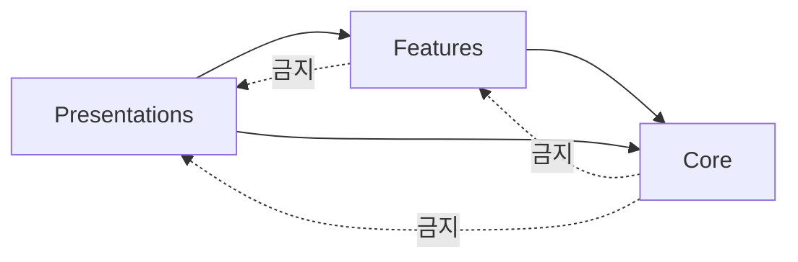
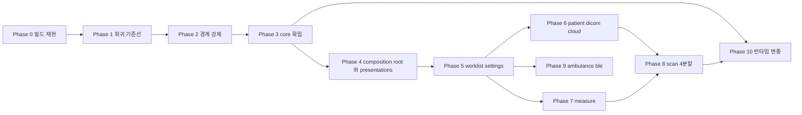

# moana feature-first clean architecture — r1 Plan

> **범위**: `client/legacy/moana` 단일 저장소. 장비·`sonex`·클라우드는 이 갈래에서 다루지 않는다.
> **목표 구조의 정본**: **cctv-platform `desktop/cms-app`** — 같은 Qt/C++ 데스크톱 앱에서 이미 끝난 구조다. 설계안이 아니라 **재현**이다.
> **상위 문서**: [architecture.md §4.1·§4.3·§4.4](../architecture.md) 의 moana 부분을 실행 단위로 편 것.
> **원칙**: [principles.md](../principles.md) — 특히 §1(출하 계통 위에서) · §2(빌드 재현 선행) · §3(동작 보존) · §5(축을 하나씩) · §9(브랜치 대신 코드로 변종).
> **현행 구조 SOT**: [../../review/moana-app.md](../../review/moana-app.md).

**실측 기준**: moana `origin/service_QT693` @ `7b26a9b27` (2026-07-27) · cms-app `master` (2026-07-28).
**`master` 는 2022-02-17 에 멈춰 있으므로 보지 않는다.** LOC 는 `.cpp/.h/.hpp/.cc/.mm/.m` 의 개행 수이며 벤더 트리는 제외했다. **클래스 단위 LOC(예: `GLFrameB`(1,882))는 `.cpp`+`.h` 합산이 기본이다** — 단일 파일만 가리킬 때는 `ScanPlayer.cpp`처럼 확장자를 명시한다(적대적 검증에서 r1 여러 문서가 이 기준을 안 밝혀 같은 클래스 수치가 문서마다 다르게 보이는 문제가 발견돼, 2026-07-29 이 각주와 함께 전체를 `.cpp`+`.h` 합산으로 통일했다).

---

## 1. 왜 moana 를 먼저 하는가

[architecture.md §4.3](../architecture.md) 의 결론을 반복하지 않는다. 한 줄로: **`sonex` 는 moana 를 읽으면서 만들어지므로, 이식 단위를 만드는 작업이 moana 정리다.** 그리고 moana 는 앞으로도 수년간 출하되므로 투자가 버려지지 않는다.

r1 이 끝나면 `sonex` 이식은 "83k LOC 뒤져서 사양 복원" 이 아니라 **"`features/<name>/domain` + `data` 를 옮긴다"** 가 된다. 목표 구조가 UI 를 feature 밖으로 빼는 이유가 여기에도 있다(§3.1) — Qt→Flutter 이식에서 **presentation 은 어차피 다시 쓰고 domain/data 만 옮긴다.**

---

## 2. 현 상태 — 실측

### 2.1 규모

| 축 | 파일 | LOC |
|---|---:|---:|
| `app/Sources/` | 299 | **151,859** |
| `framework/` | 176 | **52,347** |
| 합 | **475** | **204,206** |
| `app/Resources/QML/` | 145 | — |

> **145는 `app/Resources/QML/` 아래 전체 파일 수(`.qml`+`.js`+`.qrc`+`.txt`)다.** `.qml` 확장자만 세면 120이다. §2.4의 92·23·26·2·2 breakdown은 전체 파일 기준이라 합이 정확히 145가 된다(적대적 검증으로 확인·정정, 2026-07-29 — 이전 판은 147로 적어 자체 breakdown과 어긋났다).

`app/Sources/` 내역:

| 디렉토리 | 파일 | LOC | 비고 |
|---|---:|---:|---|
| `Scan` | 78 | 83,075 | **qcustomplot 43,303 포함** — 벤더 분리 시 자체 **39,772** |
| `Common` | 40 | 15,978 | 이름은 유틸인데 **내용은 도메인 + 인프라 혼재**(§2.3) |
| `Measure` | 50 | 12,689 | 모드별로 이미 파일이 갈려 있다 |
| `Ambulance` | 27 | 11,465 | + `framework/Ambulance` 3,441 = **14,906** |
| `PatientList` | 40 | 11,193 | |
| `Setting` | 29 | 6,667 | |
| `DeviceControl` | 9 | 4,215 | `ControlCommand.cpp` 2,672 — 장비 명령 발행부 |
| `Main` | 12 | 2,906 | 진입점 + `FirmwareUpdater` + `LanguageManager` |
| `Cloud` | 2 | 1,440 | |
| `WorkList` | 8 | 955 | |
| `BLE` | 2 | 724 | |
| `Test` | 2 | 552 | `AgingTestController` |

`framework/` 상위 5: `SononClient` 8,359 · `Database` 7,487 · `Record` 6,571 · `ImageProc` 5,061 · `ScanManager` 4,404.

**1,000 LOC 초과 파일 41개, 2,000 LOC 초과 16개.** 최대는 `Scan/ScanPlayer.cpp` **7,526 LOC / 메서드 255개**이고 그 헤더 `ScanPlayer.h` 는 **1,589 LOC**다.

> **"멤버 선언 415줄"(구판)은 산출 근거를 재현할 수 없어 제외했다** — 적대적 검증에서 두 독립 에이전트가 서로 다른 방법(주석·공백 제외, `public`/`private`/`protected` 구간별 계산 등)으로 재계산했으나 각각 136·323이 나왔고 어느 쪽도 415에 도달하지 못했다(2026-07-29). 확실히 재현 가능한 수치인 총 LOC(1,589)만 남긴다.

### 2.2 경계가 컴파일러에게 보이지 않는다

`app/app.pro:405-433` 이 `Sources/` 하위 12개 + `framework/` 하위 14개를 전부 `INCLUDEPATH` 에 올린다. 그래서 **모든 `#include` 가 경로 없는 파일명 하나**다 — 어느 계층 것인지 알 수 없고, **계층을 어겨도 빌드가 성공한다.**

반대편이 더 나쁘다.

```
framework/framework.pro:269   INCLUDEPATH += $$PWD/../app/Sources
```

**정적 라이브러리가 앱 소스 트리를 자기 include path 에 올린다.** 실제 역의존 **6건**:

| framework 파일 | include |
|---|---|
| `SononClient/CtrlChannel.cpp:8` · `SononCtrlPacket.cpp:4` · `SononDataPacket.cpp:5` | `Common/AppSetting.h` |
| `Record/RecordFileWriter.cpp:8` · `BackupFileReader.cpp:11` | `Common/AppSetting.h` |
| `Database/DataManager.cpp:15` | `common/AppUtility.h` |

> **[../../review/moana-app.md §0](../../review/moana-app.md) 의 "역의존 없음" 은 정정 대상이다.** 헤더 basename 중복이 0건이고 `framework/Common/` 에 두 헤더가 없으므로 전부 `app/Sources/Common/` 을 가리킨다. 다만 **475파일 대비 6건은 작다** — 2계층 규율이 대체로 지켜졌다는 원래 평가는 유지된다.
>
> `DataManager.cpp:15` 의 `"common/AppUtility.h"` 는 소문자다. 대소문자 구분 파일시스템에서 해석되지 않는다 — 별건 확인 필요.

### 2.3 `Common` 이 허브인데 도메인과 인프라가 섞여 있다

`app/Sources` 12개 디렉토리 사이 include 는 **42 edge / 387건**이고, 그중 **248건(64%)이 `Common` 으로 들어간다.**

| 수신 | 건수 | | 수신 | 건수 |
|---|---:|---|---|---:|
| `Common` | **248** | | `DeviceControl` | 12 |
| `Scan` | 46 | | `PatientList` | 11 |
| `Measure` | 25 | | `Ambulance` | 7 |
| `Main` | 21 | | `WorkList`·`Cloud`·`Test` | 각 1 |
| `Setting` | 14 | | | |

`Common` 안에 있는 것은 유틸이 아니다 — `PresetItem.cpp` 3,786 · `Model.cpp` 2,839 · `AppSetting.cpp` 1,964(+헤더 1,340) · `FrequencyTable` · `GraymapTable` · `ImageFilterTable` · `MI_TI_Table` · `ScanMode.h` · `AppCommon.h`(`SONON_SCAN_MODE`). **프로브 스펙 · 프리셋 · 파라미터 표 = 도메인 엔티티**이고, `AppUtility`·`AppDebug`·`BackgroundWorker`·`PerfMon` = **인프라**다.

그리고 순환이 12쌍 있다.

| 순환 | 건수 | | 순환 | 건수 |
|---|---|---|---|---|
| `Common` ↔ `Scan` | 85 / 3 | | `Ambulance` ↔ `Main` | 7 / 2 |
| `Common` ↔ `Setting` | 29 / 5 | | `DeviceControl` ↔ `Scan` | 7 / 1 |
| `Common` ↔ `Ambulance` | 29 / 1 | | `Main` ↔ `PatientList` | 4 / 1 |
| `Main` ↔ `Scan` | 22 / 9 | | `Ambulance` ↔ `Setting` | 3 / 1 |
| `PatientList` ↔ `Scan` | 10 / 9 | | `Ambulance` ↔ `PatientList` | 2 / 1 |
| `Ambulance` ↔ `Scan` | 10 / 1 | | `DeviceControl` ↔ `Main` | 1 / 1 |

> **표기 순서 주의(적대적 검증으로 확인, 2026-07-29)**: "A ↔ B | x/y" 는 대부분 "A→B / B→A" 순이지만, `PatientList` 가 관여하는 세 행(`PatientList↔Scan`·`Main↔PatientList`·`Ambulance↔PatientList`)은 라벨의 이름 순서와 무관하게 **`PatientList` 발신 건수가 항상 먼저** 온다 — 예를 들어 `Main ↔ PatientList | 4/1`은 `Main→PatientList`가 아니라 `PatientList→Main=4`다. 독립 재검증으로 세 행 모두 숫자 자체는 정확함을 확인했다(`PatientList→Ambulance=2`·`Ambulance→PatientList=1` 등). phase9-feature-ambulance-ble.md 의 "정방향 1/역방향 2"는 반대로 `Ambulance` 발신을 정방향으로 잡은 서술이라 겉보기엔 이 표(2/1)와 어긋나 보이지만, 관점만 다를 뿐 둘 다 맞다.

**역방향이 전부 한 자릿수다.** 12쌍 중 10쌍의 역방향이 5건 이하 — 끊는 비용이 작다.

### 2.4 프레젠테이션에 feature 구조가 없다

QML 145개 중 **92개가 `app/Resources/QML/` 최상위에 평평하게** 있다. 하위는 `Setting`(23) · `UserRegistration`(26) · `Mobile`(2) · `Desktop`(2) 뿐이다.

다만 **파일명 접두사가 이미 feature 다** — `Scan*` 33개, `Patient*` 9개, `Ambulance*` 3개, `Worklist*`·`Backup*`·`Record*`. 매핑이 기계적이다.

C++↔QML 결합면은 좁고 한곳에 모여 있다 — `SononApp.cpp:75-107` 의 **context property 11개**(`appSetting`·`mainViewController`·`settingViewController`·`workListViewController`·`patientListViewController`·`scanViewController`·`cloudAPIController`·`languageManager`·`agingTestController`·`scanAutoTestController`·`dataListViewController`).

> **`SononApp.cpp` 가 이미 composition root 의 절반이다.** cms-app 의 `app/main.cpp` + `AppServices`(ADR-003)와 같은 자리이고, 객체 생성·주입·소멸이 한 파일에 모여 있다. Phase 4 는 새 패턴 도입이 아니라 **이것의 정리**다.

### 2.5 변종이 컴파일 타임에 박혀 있다

| 매크로 | 파일 | 출현 | | 매크로 | 파일 | 출현 |
|---|---:|---:|---|---|---:|---:|
| `HC_SONON_500L` | **81** | **556** | | `HC_SONON_CERTIFICATION_CHINA` | 7 | 20 |
| `HC_CVIE_SUPPORT` | 12 | 79 | | `HC_SCAN_2CM` | 4 | 14 |
| `HC_POWER_DOPPLER` | 33 | 63 | | `HC_RELEASE_US` | 4 | 8 |
| `HC_RELEASE_RU` | 14 | 39 | | `HC_RELEASE_LOCAL` | 4 | 8 |
| `HC_SONON_FUJI_L43K` | 19 | 32 | | `HC_RELEASE_CE` / `OTHER` | 4 / 3 | 7 / 6 |

QML 쪽 변종 가드는 **0건**이다 — 변종이 전부 C++ 에 있다. `HC_SONON_500L` 하나가 81파일 556곳으로, [architecture.md §6.2](../architecture.md) 가 말하는 belle-fw `-D_USING_500L_DEV_` 의 앱 측 대응물이다.

### 2.6 빌드가 특정 머신에 묶여 있다

| 항목 | 실측 |
|---|---|
| 추적된 루트 `Makefile` | qmake 산출물이 커밋돼 있고 `QMAKE = /Users/rio/Qt6/6.6.3/macos/bin/qmake` |
| `build.py`(406 LOC) | `~/QtCommercial/5.15.2/android` · `~/Qt6/6.6.3/ios` · NDK `21.3.6528147` · JDK `1.8.0_131` · 키스토어 `hermioneDroid.jks`(SRC_ROOT **부모**) · Xcode team ID 2개 |
| 버전 문자열 | **3곳, 2곳이 낡음** — `framework/Common/Def.cpp:9` `M2.03.26`(런타임 사용) / `build.py:8` `M2.03.25` / `app/app.pro:511` `2.3.25.121` |
| 릴리스 타깃 목록 | **두 곳이 어긋남** — `build.py:47` `{CE, US, OTHER, RESEARCH}` vs `.pro` `{OTHER, LOCAL, CE, US, RU}` |
| 그 결과 | `build.py:103` 의 `target=='RU'` 는 `:377` 필터에 걸려 **도달 불가**. `RESEARCH` 는 qmake 에서 어떤 `equals()` 에도 안 걸려 **`HC_RELEASE_*` 무정의로 빌드된다** |
| 타깃 전달 | `app.pro:17` · `framework.pro:16` 이 **각각** 미정의 시 `error()`. 문구가 *"using the same value as framework.pro"* — **사람이 두 파일에 같은 값을 맞춰야 한다** |

마지막 항목이 [CE/US 뒤바뀜 출하 사고](../../review/moana-app.md)가 난 자리다. hard-error 는 **미정의**는 잡아도 **불일치**는 못 잡는다.

### 2.7 자동 판정은 없지만 자동화 훅은 이미 있다

자동 테스트 0건 · CI 0건은 확정 사실이다. 그런데 **앱 안에 자동화 장치가 들어 있다.**

| 자산 | 내용 |
|---|---|
| `Scan/ScanAutoTestController` | `Q_INVOKABLE start()/stop()`, `scanMode` 지정, `saveLogFileEnable`·`saveCaptureFileEnable`. **스캔을 프로그램으로 구동하고 캡처를 파일로 떨군다** |
| `Test/AgingTestController` | `Q_INVOKABLE` 4개. 장시간 반복 |
| `Scan/DummyPlayer` + `DummyView` | **장비 없이 프레임을 흘린다** |
| `framework/Record/` 6,571 LOC | 자체 `HEAL` 태그 녹화 포맷 read/write |
| `test/` 아래 | 2018년 녹화 샘플 |

**"녹화 → 무장비 재생 → 스캔 자동 구동 → 캡처 저장" 의 부품이 전부 있다.** 없는 것은 **판정**과 **CI 배선**이다.

---

## 3. 목표 구조 — cms-app 정본

### 3.1 3계층 (cms-app ADR-001)

의존은 바깥에서 안으로만 흐른다.



| 계층 | 정의 | 금지 |
|---|---|---|
| **Core** | **인프라 · 공통 유틸 · entities · 외부 라이브러리 래퍼** | Features · Presentations 참조 |
| **Features** | 비즈니스 로직. feature 별 `domain/` `data/` `ports/` 캡슐화 | Presentations 참조 |
| **Presentations** | UI 전부 — Qt 위젯 · QML · 뷰컨트롤러 | (없음) |

> **`Presentations → Core` 직참이 허용된다**(ADR-001). logger·i18n·entities 처럼 UI 가 직접 필요한 인프라를 Features 를 거치게 할 이유가 없다. **진짜 금지는 안쪽이 바깥을 역참조하는 것**이다.

### 3.2 폴더 구조 (cms-app ADR-002 · ADR-003)

```
moana/src/
  app/                       ← composition root. main.cpp + AppServices + callback 배선
  core/                      ← 인프라. 도메인이 아니다
    entities/                  Model(프로브 스펙) · PresetItem · 파라미터 표 · ScanMode
    protocol/                  HC 프로토콜 정본 (proof/protocol-sot 산출물)
    services/
      sonon/                   HC 프로토콜 클라이언트 (현 framework/SononClient)
      cloud/                   (현 framework/Network)
    db/                        (현 framework/Database)
    imaging/                   (현 framework/ImageProc · VideoProc · ContextVision · TensorFlow-Lite)
    audio/                     (현 framework/AudioProc)
    log/  util/  widgets/  compat/
  features/                  ← 비즈니스 로직. UI 없음
    <name>/
      domain/                  엔티티 · 서비스 · 순수 비즈니스 정의
      data/                    domain 인터페이스 구현 · 외부 의존성 어댑터
      ports/                   i_*_port.h — 인터페이스만
  platforms/                 ← OS별 코드만
    android/ ios/ uwp/ macos/ windows/ linux/
  presentations/             ← UI 전부
    qt/
      core/                    공통 페이지 베이스 · mixin
      common/                  공통 위젯 유틸
      features/<name>/         뷰컨트롤러 (C++)
      qml/features/<name>/     QML
      locale/                  .ts / .qm
    common/<feature>/          백엔드 무관 프레젠테이션 로직 (레이아웃 등)
```

**cms-app 실측이 이 배치의 근거다** (`src/` 574파일 118,133 LOC):

| 계층 | 파일 | LOC | 비중 |
|---|---:|---:|---:|
| `app/` | 3 | 1,048 | 0.9% |
| `core/` | 135 | 30,004 | 25% |
| `features/` | 182 | 24,149 | 20% |
| `platforms/` | 12 | 592 | 0.5% |
| `presentations/` | 242 | **62,340** | **53%** |

**presentations 가 절반을 넘는다.** feature 안에 UI 를 넣지 않는 결정(ADR-002)이 실제 코드 분포와 맞는다 — UI 를 feature 에 넣으면 `features/` 가 다시 거대해진다.

### 3.3 명명 규약 (cms-app 실측)

| 대상 | 규약 | cms-app 실례 |
|---|---|---|
| feature 디렉토리 | **kebab-case** | `device-registry` · `guard-alarm` · `analytics-meta` · `audit-log` · `image-tuning` · `talk-audio` · `auto-update` |
| port 헤더 | `i_<name>_port.h` | `i_stream_control_port.h` · `i_device_repository_port.h` · `i_settings_data_port.h` |
| Qt 프레젠테이션 파일 | `qt_` prefix | `qt_live_page.cpp` · `qt_live_toolbar.cpp` · `qt_login_dialog.cpp` |
| 소스 파일 | snake_case | `stream_router.cpp` · `device_api.cpp` |

**moana 는 현재 PascalCase(`ScanPlayer.cpp`) + `C` 클래스 prefix(`CScanPlayer`)다.** 파일명 규약 전환은 [Phase 4](./phase4-composition-root-presentations.md) 에서 계층 이동과 **함께** 한다 — 두 번 옮기지 않는다.

### 3.4 moana feature 목록

[architecture.md §5](../architecture.md) 의 **장비·클라이언트 공통 어휘**를 kebab-case 로 적용한다. `scan-b`·`doppler-cf`·`doppler-pw`·`mmode`·`firmware-update` 는 장비 쪽과 같은 이름을 갖는다.

| feature | 현행 위치 | LOC(대략) | 처리 phase |
|---|---|---:|---|
| `worklist` | `app/WorkList` | 955 | [5](./phase5-feature-worklist-settings.md) |
| `settings` | `app/Setting` + `Common/AppSetting` | 6,667 + 3,304 | [5](./phase5-feature-worklist-settings.md) |
| `patient` | `app/PatientList` | 11,193 | [6](./phase6-feature-patient-dicom-cloud.md) |
| `dicom` | `framework/Dicom` + `PatientList/DcmFileSaver` | 1,954 + | [6](./phase6-feature-patient-dicom-cloud.md) |
| `cloud` | `app/Cloud` + `framework/Network` | 1,440 + 4,217 | [6](./phase6-feature-patient-dicom-cloud.md) |
| `measure` | `app/Measure` | 12,689 | [7](./phase7-feature-measure.md) |
| `scan-b` · `doppler-cf` · `doppler-pw` · `mmode` | `app/Scan` + `framework/ScanManager` | 39,772 + 4,404 | [8](./phase8-feature-scan-split.md) |
| `recording` | `framework/Record` | 6,571 | [8](./phase8-feature-scan-split.md) |
| `ambulance` | `app/Ambulance` + `framework/Ambulance` | 14,906 | [9](./phase9-feature-ambulance-ble.md) |
| `ble` | `app/BLE` | 724 | [9](./phase9-feature-ambulance-ble.md) |
| `firmware-update` | `Main/FirmwareUpdater` + `Setting/FirmwareSetting` | — | [9](./phase9-feature-ambulance-ble.md) |
| `device-connection` | `app/DeviceControl` | 4,215 | [4](./phase4-composition-root-presentations.md) 에서 분해 → 각 feature `data/` |

> **`DeviceControl` 은 feature 가 아니다.** `ControlCommand.cpp` 2,672 LOC 가 모든 feature 의 장비 명령을 한 파일에 담고 있다 — cms-app 이 `device_control` 을 `ptz`·`image-tuning`·`alarm` 으로 **분해한 것과 같은 안티패턴**이다(**cctv r4 phase16** (cctv `docs/refactoring/r4/phase16-flutter-feature-domain-alignment.md`) §4). 전송은 `core/services/sonon`, 명령 발행은 각 feature 의 `data/` 로 간다.

---

## 4. Phase 구성

| Phase | 내용 | 범위 | 상태 |
|---|---|---|---|
| **[Phase 0](./phase0-build-reproducibility.md)** | 빌드 재현 — 절대경로 제거, 버전·릴리스 타깃 정본 1벌, `make` 진입점 | 빌드 | 미시작 |
| **[Phase 1](./phase1-regression-baseline.md)** | 회귀 판정 기준선 — **장비 축**(자동화 훅 4종 승격 + 골든) + **클라우드 축**(HTTP 계약 고정) + CI 1건 | 테스트 | 미시작 |
| **[Phase 2](./phase2-layer-boundary.md)** | 레이어 경계 강제 — `INCLUDEPATH` 평탄화 해체, 역의존 6건 제거 | 빌드/코드 | 미시작 |
| **[Phase 3](./phase3-core-layer.md)** | **`core/` 확립** — `framework/` 15모듈 → `core/`·`platforms/`, `Common` 의 entities 분리 | 코드 | 미시작 |
| **[Phase 4](./phase4-composition-root-presentations.md)** | **composition root + `presentations/` 분리** — `SononApp` → `app/main.cpp`+`AppServices`, 뷰컨트롤러·QML 145개 이관 | 코드 | 미시작 |
| **[Phase 5](./phase5-feature-worklist-settings.md)** | feature 3분할 패턴 확립 — `worklist` · `settings` | 코드 | 미시작 |
| **[Phase 6](./phase6-feature-patient-dicom-cloud.md)** | `patient` · `dicom` · `cloud` | 코드 | 미시작 |
| **[Phase 7](./phase7-feature-measure.md)** | `measure` | 코드 | 미시작 |
| **[Phase 8](./phase8-feature-scan-split.md)** | **`scan-b`·`doppler-cf`·`doppler-pw`·`mmode`** + `recording`. qcustomplot 43,303 벤더 분리 선행 | 코드 | 미시작 |
| **[Phase 9](./phase9-feature-ambulance-ble.md)** | `ambulance` · `ble` · `firmware-update` | 코드 | 미시작 |
| **[Phase 10](./phase10-runtime-variant.md)** | 컴파일 타임 변종 → 런타임 설정 | 코드/빌드 | 미시작 |

### Phase 의존



- **0 → 1 → 2 → 3 → 4 는 직렬이다.** 각각이 다음 것의 판정 수단 또는 배치를 만든다.
- **5 이후 feature 는 6·7·9 가 병렬 가능**하다. 서로 include 하지 않는다(§2.3 에 `PatientList`↔`Measure` 간선 없음).
- **8 은 6·7 뒤**다. `Scan → Measure` 25건, `Scan ↔ PatientList` 10/9 가 먼저 끊겨야 한다.
- **10 은 3 뒤 착수 가능하되 8 뒤 완료**된다. `HC_SONON_500L` 556곳 중 다수가 `Scan` 안에 있다.

---

## 5. Phase 요약

### Phase 0 — 빌드 재현

[principles.md §2](../principles.md). 지금은 깨끗한 머신에서 6타깃을 낼 수 없고, **바꾼 결과를 비교할 기준선 자체가 없다.**

**0-A** 커밋된 qmake `Makefile` 제거 · **0-B** `build.py` 툴체인 경로 외부화 · **0-C** 버전 정본 1곳 · **0-D** 릴리스 타깃 정본 1곳(`RESEARCH` 무정의 · `RU` 도달불가 해소) · **0-E** `make` 진입점.

### Phase 1 — 회귀 판정 기준선

moana 의 외부 경계는 **둘**이다 — 장비(HC 프로토콜)와 클라우드(REST). **두 축을 각각 고정한다.**

**1-A** `DummyPlayer` 를 녹화 재생으로 · **1-B** 헤드리스 CLI · **1-C** 장비 축 골든(캡처 해시 · 측정값 · 패킷 덤프) · **1-D** **클라우드 축 계약 고정** · **1-E** `make test-golden` + CI.

**장비 축은 있는 것을 잇는다**(§2.7 — `DummyPlayer`·`Record`·`ScanAutoTestController`). **클라우드 축은 자산이 0 이다** — 픽스처·mock·stub **0건**이고 베이스 URL 이 하드코딩(`SononCloudApi.cpp:28`, 테스트 서버는 `:27` 에 주석)이라 전환에 재빌드가 필요하다. 그런데 [Phase 6-C](./phase6-feature-patient-dicom-cloud.md) 가 옮길 양은 `CloudAPIController`(1,440) + `framework/Network`(4,217)이고 `CmdType` **25개**, 서로 다른 도메인 리터럴 **4~5개**(`sonex.healcerion.com:8080`·`distribute.healcerion.com`·`*.cloudfunctions.net`·`storage.googleapis.com`·구 URL `dev.healcerion.com`), **계정 도메인이 Java·Firebase 둘에 동시 존재**한다(적대적 검증으로 정정, 2026-07-29 — "엔드포인트 3개"는 서비스 성격상 3개 범주로 묶은 것이었으나 그 근거를 명시하지 않아 도메인 리터럴 수와 혼동을 일으켰다).

> **한계 둘을 명시한다.**
> ① 이 기준선은 **record/replay(계약 고정)** 이지 완전한 E2E 가 아니다. 녹화·픽스처가 지나간 경로만 덮으므로 **에러·재접속·타임아웃 픽스처를 반드시 포함**한다. 완전한 장비 E2E 는 belle-fw 빌드 재현이 전제라 r1 밖이다([emulator-e2e.md](../emulator-e2e.md)).
> ② 닿는 것은 **데이터 경로**다. [../../review/change-cost.md §7](../../review/change-cost.md) 실측대로 최근 회귀의 **44%는 QML UI** 라 잡히지 않는다. **사내 QA 를 대체하지 않고 병행한다.**
>
> **운영 서버(`sonex.healcerion.com:8080`)에 대고 테스트하지 않는다** — 운영 중인 의료기기 백엔드다.

**FW 리팩토링과의 관계**: **장비 축 자산은 두 축의 공동 자산**이다 — 여기서 만드는 것이 [proof/protocol-sot](../proof/protocol-sot/) 계약의 앱 쪽 절반이고, belle-fw 쪽 절반(`platforms/pc`)과 만나면 전 경로 E2E 가 된다. **클라우드 축은 아니다** — `belle-fw` 에 HTTP 클라이언트가 없고 펌웨어조차 앱이 받아 넣는다([../../review/protocol-cloud.md §0](../../review/protocol-cloud.md)). 상세 = [phase1 §5.1](./phase1-regression-baseline.md).

### Phase 2 — 레이어 경계 강제

**이 phase 가 없으면 이후 전부가 무효다.** 계층을 어겨도 빌드가 통과하므로 feature 로 나눠도 다시 섞인다.

**2-A** `framework.pro:269` 제거 → 역의존 6건이 컴파일 에러로 드러남 · **2-B** 6건 해소(5건이 `AppSetting.h` 하나) · **2-C** `INCLUDEPATH` 27줄 → 2줄, include 경로 규정형 전환 · **2-D** `make check-layers` 를 CI 에.

### Phase 3 — `core/` 확립

**cms-app `core/` 는 인프라다** — entities · db · log · codec · audio · services · util · widgets(ADR-001). moana 의 `framework/` 15모듈 대부분이 그대로 여기로 간다.

| 현행 | 목표 |
|---|---|
| `framework/Common`(Def · SononLog · SononUtil · FileUtil · Cipher · GlobalContext · BaseThread) | `core/log` · `core/util` |
| `framework/Include`(`SononCommon.h` 프로토콜·장비 상수) | `core/protocol` |
| `framework/Database` | `core/db` |
| `framework/SononClient` | `core/services/sonon` |
| `framework/Network` | `core/services/cloud` |
| `framework/ImageProc` · `VideoProc` · `ContextVision` · `TensorFlow-Lite` | `core/imaging` |
| `framework/AudioProc` | `core/audio` |
| `framework/Platform`(31파일 3,881 — JNI · UWP · iOS 네이티브) | **`platforms/{android,ios,uwp,macos,windows,linux}`** |
| `app/Common` 의 `Model` · `PresetItem` · `FrequencyTable` · `GraymapTable` · `ImageFilterTable` · `MI_TI_Table` · `ScanMode` · `AppCommon` | **`core/entities`** |
| `app/Common` 의 `AppUtility` · `AppDebug` · `BackgroundWorker` · `PerfMon` · `Rect` · `Event` | `core/util` |
| `framework/Record` · `ScanManager` · `Dicom` · `Ambulance` | **`core/` 아님** — feature 다. Phase 6·8·9 로 |

**판정**: `core/` 가 `features/`·`presentations/` 를 include 0건. `Common` ↔ `Scan`·`Setting`·`Ambulance` 순환 3쌍이 여기서 끊긴다.

### Phase 4 — composition root + `presentations/` 분리

**두 작업이 한 phase 인 이유**: 뷰컨트롤러를 `presentations/` 로 옮기면 DI 배선이 함께 바뀐다. 나누면 같은 파일을 두 번 옮긴다.

- **4-A** `app/main.cpp` + `AppServices` 구조체 — `SononApp.cpp:75-107` 의 context property 11개가 이미 그 목록이다(cms-app ADR-003)
- **4-B** `presentations/qt/features/<name>/` 신설 — 뷰컨트롤러 C++ 이관
- **4-C** `presentations/qt/qml/features/<name>/` — 평탄한 QML 92개를 접두사 기준 재배치, `.qrc` 분할
- **4-D** `presentations/qt/locale/` — `.ts` 10개 언어
- **4-E** `presentations/qt/core/` — 공통 페이지 베이스(cms-app `managed_page` · `*_listener_mixin` 대응)
- **4-F** `DeviceControl/ControlCommand`(2,672) 분해 — 전송은 `core/services/sonon`, 명령 발행은 각 feature `data/` 로 예약
- **4-G** 파일명 규약 전환 — PascalCase → snake_case + `qt_` prefix. **이동과 동시에**

### Phase 5 — feature 3분할 패턴 확립 (`worklist` · `settings`)

**가장 작은 것으로 패턴을 세운다.** `WorkList` 955 LOC / 수신 1건, `Setting` 6,667 + `AppSetting` 3,304.

- **5-A** `features/<name>/{domain,data,ports}` 골격 + `.pro` 분할 규약
- **5-B** `worklist` — DICOM MWL. QML 1개
- **5-C** `settings` — cms-app 대응이 명확하다. `ports/i_settings_data_port.h` + `domain/settings_service` + `data/config_store`(cms-app CLAUDE.md §설정 저장)
- **5-D** `AppSetting`(1,964+1,340) 분해 — entities 는 Phase 3 에서 이미 나갔고, 여기서 `domain`/`data`/`ports` 로
- **5-E** 각 feature `domain/` 유닛테스트 — **moana 최초의 자동 테스트**

### Phase 6 — `patient` · `dicom` · `cloud`

**6-A** `patient` — `PatientListViewController.cpp` 2,342 를 `presentations` 와 `domain` 으로 · **6-B** `dicom` — `UnifiedDicomAdapter`(.cpp+.h **1,954**) → `data/` · **6-C** `cloud` — `Cloud`(1,440) + `SononCloud`(1,438) · **6-D** `PatientList ↔ Scan`(10/9) 순환 끊기(Phase 8 전제).

### Phase 7 — `measure`

**모드별로 파일이 이미 갈려 있다** — `MeasureLengthM`/`MeasureDistancePW`/`MeasureTextM`/`MeasureTimePW`… 분할이 파일 이동에 가깝다.

**7-A** `MeasureObject`(.cpp+.h **2,094**)·`MeasureConverter`(.cpp+.h **1,257**) → `domain/` · **7-B** 도구별 → `domain/tools/` · **7-C** `MeasureDDH`(.cpp+.h **1,948**)·`MeasureBloodVolumeFlow` — 임상 계산이므로 **골든 값 회귀 필수** · **7-D** `MeasureView`(3,389)·`MeasureViewPWM`(1,381) → `presentations/qt/features/measure/` · **7-E** `Scan → Measure` 25건을 `ports` 경유로.

### Phase 8 — `scan` 4분할 + `recording`

**가장 크고 가장 이득이 크다.**

- **8-A** **qcustomplot 벤더 분리** — `Scan/ImageAnalyzer/qcustomplot.{cpp,h}` **43,303 LOC** → `third_party/`. 이것만으로 `Scan` 이 83,075 → **39,772** 가 된다
- **8-B** `ScanPlayer.cpp`(7,526 / 메서드 255, 헤더 1,589 LOC) 를 모드별 파이프라인으로 분해
- **8-C~F** `features/{scan-b, doppler-cf, doppler-pw, mmode}/{domain,data,ports}` — `framework/ScanManager`(4,404) 를 각 domain 으로 분배
- **8-G** `presentations/qt/features/<mode>/` — (.cpp+.h) `GLFrameB`(1,882)·`GLFrameCF`(1,461)·`GLFramePW`(680)·`GLFrameM`(422)·`GLFrameViewPWM`(2,692)·`FrameProcessorPWM`(2,498)
- **8-H** 공통 렌더링(`GLBase`·`GLFrame`·`GLFrameView`·`SideRulerView`·`ColormapBar`·`GraymapBar`) → `presentations/qt/core/` 또는 `core/imaging`
- **8-I** QML 42개(`Scan*.qml`, 적대적 검증으로 정정 2026-07-29 — 구판 33) 재배치
- **8-J** `features/recording` — `framework/Record`(6,571). Phase 1 골든이 이 포맷에 의존하므로 **마지막에**

**모드 분기 실측**: `B_MODE` 16파일 46곳 · `CF_MODE` 16/33 · `PW_MODE` 23/52 · `M_MODE` 21/47 = **178곳**이 실제 작업 표면이다.

### Phase 9 — `ambulance` · `ble` · `firmware-update`

`Ambulance` 는 app 27파일 + framework 12파일 = **14,906 LOC** 로 `Measure` 보다 크다. 러시아 EMS 전용이고 `HC_RELEASE_RU`(14파일 39곳)와 얽혀 있다.

**9-A** `features/ambulance` 통합 · **9-B** 순환 5쌍 제거(**역방향 전부 2건 이하**) · **9-C** `features/ble`(724) · **9-D** `features/firmware-update` — `Main/FirmwareUpdater` + `Setting/FirmwareSetting`. **장비 쪽과 같은 feature 이름**([architecture.md §5](../architecture.md)).

> `Ambulance` 의 **현재 운영 여부가 미확인**이다 — 앱 14.9k LOC 에 서버는 39줄 프로토타입뿐이다. **폐기 판단은 우리가 하지 않는다.** 격리까지만 하고 힐세리온에 묻는다.

### Phase 10 — 컴파일 타임 변종 → 런타임 설정

[principles.md §8·§9](../principles.md). **이전 세대(`ginny-fw`)가 이미 런타임 선택이었다** — 되살리는 것이다.

**10-A** `HC_SONON_500L`(81/556) → `core/entities` 모델 스펙 데이터 · **10-B** `HC_SONON_FUJI_L43K`(19/32)·`HC_SCAN_2CM`(4/14) 동일 · **10-C** `HC_POWER_DOPPLER`(33/63) → 기능 플래그 · **10-D** `HC_CVIE_SUPPORT`(12/79) → 라이선스 런타임 판별 · **10-E** `HC_RELEASE_*` → 배포 설정 · **10-F** `HC_SONON_CERTIFICATION_CHINA`(7/20) — **범위 밖**([principles.md §9](../principles.md)).

> **후속 작업이 여기에 붙는다 — `500C`·`500P` 흡수**([phase10 §2.3](./phase10-runtime-variant.md)). 이 phase 밖이지만 **이 phase 가 전제**다. moana 는 이 두 모델을 구동하지 못하고(`Model.cpp` 분기 0), 그것이 `sonex-app` 에 남은 **유일한 실질 존재 이유**다([../moana-vs-sonex.md §3.1](../moana-vs-sonex.md)). **지금 얹으면 컴파일 분기가 하나 더 늘고, 이 phase 뒤에 얹으면 데이터 1건이 된다** — 그래서 §6 판정 10번의 검증을 가상 모델이 아니라 **`500C` 실제 추가**로 한다.
>
> **`500C` 를 단종으로 본 [principles.md §11](../principles.md) 판정은 2026-07-29 에 정정했다** — `500c-sn-fw` 최신 `FW_1_1_8_0` 2026-04-24, Rev1.7 하드웨어·WiFi SDK 전환 진행 중이다([phase10 §1.6](./phase10-runtime-variant.md)).

---

## 6. 성공 판정

| # | 항목 | 기준 | 현재 |
|---|---|---|---|
| 1 | 빌드 재현 | 깨끗한 머신 체크아웃 → 1커맨드 → 6타깃 | 특정 머신 경로 의존 |
| 2 | 정본 단일화 | 버전 · 릴리스 타깃 선언 각 **1곳** | 3곳 / 2곳(불일치) |
| 3 | 계층 방향 | `core → features` · `core → presentations` · `features → presentations` include **각 0건** | 역의존 6건, 나머지는 측정 불가 |
| 4 | 순환 | feature 간 2노드 순환 **0쌍** | **12쌍** |
| 5 | feature 응집 | PW 파라미터 추가가 `features/doppler-pw/` + `presentations/qt/features/doppler-pw/` 안에서 끝난다 | `PW_MODE` 23파일 52곳 |
| 6 | UI 격리 | `features/**` 에 `#include <QQuick*>`·`<QtWidgets>` **0건** | 구분 없음 |
| 7 | 파일 크기 | 자체 코드 **1,000 LOC 초과 0개** | **41개**(2,000 초과 16개) |
| 8 | 벤더 분리 | `src/` 에 서드파티 소스 **0 LOC** | qcustomplot **43,303** |
| 9 | 자동 판정 | `make test-golden` + feature `domain` 유닛테스트가 CI 에서 돈다 | 자동 테스트 0 · CI 0 |
| 10 | 변종 | 모델 추가 = 데이터 1건, 아티팩트 플랫폼당 1개. **판정은 `500C` 실제 추가로** | `HC_SONON_500L` 81파일 556곳 |
| 11 | 명명 규약 | feature kebab-case · port `i_*_port.h` · Qt `qt_*` | PascalCase + `C` prefix |
| 12 | feature 이름 정합 | `scan-b`·`doppler-cf`·`doppler-pw`·`mmode`·`firmware-update` 가 장비 쪽과 동일 | 해당 없음 |
| 13 | `sonex` 이식 단위 | feature 하나의 `domain`+`data` 가 이식 단위로 성립 | 83k LOC 뒤져 사양 복원 |

---

## 7. 위험 · 대응

| 위험 | 영향 | 대응 |
|---|---|---|
| **회귀를 판정할 수 없는 구간** — 골든이 데이터 경로만 덮고 QML UI 44%는 못 잡는다 | Phase 4·8 에서 UI 회귀가 출하까지 간다 | Phase 5-E 부터 `domain` 유닛테스트를 쌓는다. **UI 회귀는 사내 QA(`[SQA]`) 병행 유지** |
| **Phase 4 가 가장 크다** — presentations 가 cms-app 에서 53%였다. moana 도 QML 145 + 뷰컨트롤러 | 한 phase 가 비대해져 출하 계통 복귀가 늦어진다 | feature 단위로 쪼개 낸다. 4-B~4-D 를 feature 별로 반복하고 매번 병합 |
| **`sonex` 가 같은 코드를 따로 고치고 있다** | 정리 중 moana 가 바뀌어 이식 기준이 흔들린다 | feature 단위로 닫는다. 중간에 멈춰도 양쪽 정상([architecture.md §4.3](../architecture.md)) |
| **출하 브랜치 위에서 한다** — `service_QT693` 은 오늘도 커밋된다 | 장수 병렬 브랜치 = [principles.md §1](../principles.md) 위반 | phase 를 짧게 끊고 각각 출하 계통으로 돌린다 |
| **Qt 6.6.3 → 6.9.3 이행이 동시 진행 중** | 같은 파일을 두 작업이 만진다 | Phase 0-2 는 충돌 면이 작다. Phase 3 착수 전 이행 상태 확인 — **미확인 항목** |
| **`NextSRI` 필터를 건드리면 `sonex` 와 바이트 동일성이 깨진다** | 양쪽 영상 품질 분기 | Phase 3 에서 `core/imaging` 으로 **위치만** 옮긴다. 내용 변경 금지 |
| **`AppSetting` 이 entities·저장·Qt 결합을 한 클래스에** (1,964+1,340) | Phase 3·5 에 걸쳐 파급 | entities 를 Phase 3 에서 먼저 꺼내고, 나머지를 Phase 5-D 에서 |
| **`Ambulance` 폐기 여부 미정** | 14,906 LOC 를 정리했는데 버릴 코드일 수 있다 | Phase 9 는 **격리까지만**. 판단은 힐세리온 |
| 인증 브랜치와의 병합 | 인증본 동결 요구와 충돌 | **범위 밖**(Phase 10-F) |

---

## 8. 이 문서가 다루지 않는 것

| 항목 | 판단 |
|---|---|
| **qmake → CMake 이행** | **r1 범위 밖.** cms-app 은 CMake+vcpkg 이고 moana 는 qmake 전용(자체 `CMakeLists.txt` 0건)이다. 빌드 시스템 교체와 구조 변경을 동시에 하면 회귀 원인을 가를 수 없다([principles.md §5](../principles.md)). r1 은 `.pro` 를 계층별로 분할하는 데까지만 간다. **디렉토리 구조가 정리된 뒤가 이행 적기다** |
| 장비(`belle-fw`) feature 분리 · 에뮬레이터 | [../architecture.md §3](../architecture.md) · [../emulator-e2e.md](../emulator-e2e.md) |
| HC 프로토콜 정본 생성 | [../proof/protocol-sot/](../proof/protocol-sot/) — **산출물 완성, 승인 대기**. r1 은 그것을 `core/protocol/` 로 받는다 |
| `sonex` 이식 | [../architecture.md §4.2·§4.4](../architecture.md). r1 이 그 입력을 만든다 |
| 저장소 9.4GB(벤더 바이너리 6.56G) 정리 | 별건. Phase 0 은 툴체인 *경로*만 다루고 `lib/` 벤더 트리는 손대지 않는다 |
| Qt 6.6.3 → 6.9.3 이행 | 힐세리온 진행 중 작업 |

---

## 9. cross-reference

- **cms-app ADR-001** (cms-app `docs/adr/adr-001-3layer-feature-first-clean-architecture.md`) — 3계층 의존 규칙 (§3.1 의 근거)
- **cms-app ADR-002** (cms-app `docs/adr/adr-002-feature-first-folder-structure.md`) — feature 내 `domain/data`, UI 는 최상위 `presentations/` (§3.2 의 근거)
- **cms-app ADR-003** (cms-app `docs/adr/adr-003-composition-root-dependency-injection.md`) — composition root + `AppServices` (Phase 4-A)
- [precedent-cctv.md](../precedent-cctv.md) — 선례 실측과 전이되지 않는 조건
- [architecture.md](../architecture.md) · [principles.md](../principles.md) · [../../review/moana-app.md](../../review/moana-app.md)
