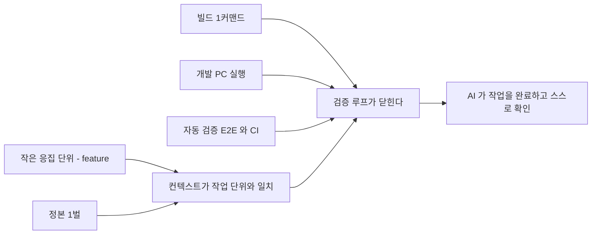
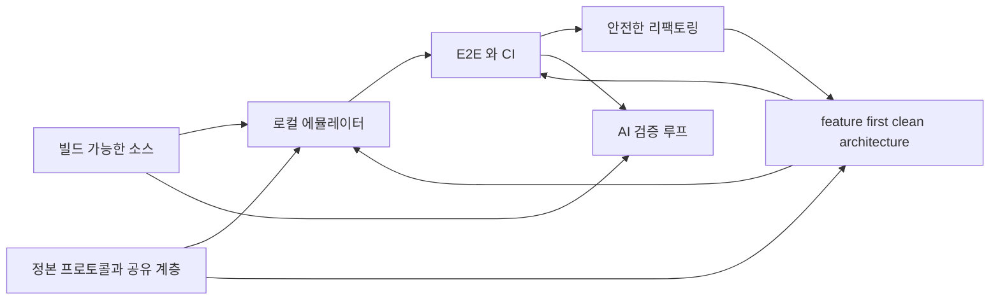

# 현행 구조 실측 — 무엇이 변경을 막는가

> **전제 둘**
> ① **힐세리온의 자체 리팩토링이 3년째 끝나지 않아 외부 검토가 요청됐다**(§3). 그래서 이 문서의 질문은 "리팩토링을 해야 하는가" 가 아니라 **"무엇이 변경을 막고 있는가"** 다.
> ② **작업자는 AI 에이전트다.** 사람이 코드를 직접 쓰는 것을 전제로 한 계획은 성립하지 않는다(§1).
>
> 근거는 전부 코드 실측이다. 힐세리온 쪽 출처는 [../review/](../review/), cctv 쪽 출처는 [precedent-cctv.md](precedent-cctv.md).

## 0. 한 줄

**고쳤는지 확인할 방법이 없어서, 큰 변경이 끝나지 않는다.**

증상이 셋이고 원인은 하나다 — 기능 1건을 바꾸려면 3개 저장소·10개 이상 파일을 건드려야 하고(§6), **자체 리팩토링이 3년 2개월째 도메인 이식 0건이며**(§3), AI 에이전트는 읽고 제안하는 데서 멈춘다(§2). 셋 다 **완료를 판정할 수단이 없다**는 같은 원인이다.

---

## 1. 전제 — 작업자가 바뀌었다

### 1.1 사람이 직접 코딩하지 않는다

cctv-platform 의 2026년 커밋 **3,341건 중 3,063건(91%)** 이 AI 에이전트가 만든 것이다([precedent-cctv.md §1](precedent-cctv.md)). 장비 펌웨어 94% · Qt 데스크톱 앱 85% · 서버 95% — 특정 계층에 몰린 것이 아니다.

**이것은 선호가 아니라 현재 조건이다.** 계획·문서·비용 판단이 전부 여기서 다시 계산된다.

### 1.2 그래서 비용 구조가 바뀐다

| | 사람이 짜던 시절의 가정 | 지금 |
|---|---|---|
| **작업량의 상한** | 인원 × 시간 | **AI 가 안전하게 만질 수 있는 코드 표면** |
| **리팩토링의 비용** | 비싸다 — 기능 대신 사람을 쓴다 | **기능 개발과 경쟁하지 않는다.** 병렬로 돈다 |
| **"큰 파일"의 비용** | 읽기 불편 | **컨텍스트를 무관한 코드로 채워 작업 자체를 실패시킨다** |
| **테스트 없음의 비용** | 사람이 수동으로 확인 | **AI 가 완료를 판정할 수 없다.** 루프가 안 닫힌다 |
| **문서·규약 없음** | 신입 온보딩 지연 | **매 세션 처음부터.** AI 는 지난주 맥락을 기억하지 않는다 |
| **기간 추정** | 의미 있음 | **의미 없음.** Phase·순서만 쓴다 |

세 번째와 네 번째 줄이 핵심이다. 사람에게 불편했던 것이 **AI 에게는 차단**이다. 4,048줄 파일은 사람에겐 "읽기 힘든 파일"이지만, AI 에겐 **PW 도플러 하나를 고치려고 B·CF·M 모드 코드를 전부 컨텍스트에 넣어야 하는** 구조적 낭비다.

### 1.3 AI 가 일을 끝내려면 코드베이스가 만족해야 하는 조건

작업이 **읽기·제안**에서 멈추지 않고 **고침 → 빌드 → 실행 → 판정**까지 닫히려면 다섯이 필요하다.



**그리고 이 다섯은 사람이 유지보수하기 좋은 조건과 정확히 같다.** 따로 최적화하는 것이 아니다 — AI 를 위해 만든 조건이 곧 사람을 위한 조건이고, 반대도 같다. 이 문서가 "AI 를 위해" 와 "유지보수를 위해" 를 구분하지 않는 이유다.

---

## 2. 지금 힐세리온 코드베이스가 AI 를 막는 것

§1.3 의 조건 다섯과 하나씩 대조한다.

| 조건 | 현재 상태(실측) | 결과 |
|---|---|---|
| **작은 응집 단위** | `sonon_receive_fpga.cpp` **4,048** · `scan_controller.dart` **8,354** · `sonon.cpp` **3,522** | PW 모드 하나가 6개 파일에 걸쳐 있다. 컨텍스트가 무관한 코드로 찬다 |
| **정본 1벌** | HC 프로토콜 식별자가 **저장소 9곳**에 있고(`belle-fw` `500c-sn-fw` `belle-kernel` `elsa-fw` `ginny-fw` `moana` `sonex-app` `sonex-framework` `cuattro-sdk`), 구조체 선언이 **3벌** | 어느 정의가 맞는지 코드로 판정되지 않는다. **이번 검토에서 실제로 서브에이전트가 존재하지 않는 구조체를 인용하는 사고가 났다** |
| **빌드 1커맨드** | `petalinuxbsp.conf:15` 가 `EXTERNALSRC_pn-sonon = "/home/jacob/jacob-work-2020/..."`. 커널 모듈 3종 빌드 파일 부재 | 고쳐도 **컴파일해 확인할 수 없다.** 제안까지만 가능하다 |
| **개발 PC 실행** | 실장비 필수. 더미 경로가 있으나 `sonon.cpp:3428` 이 `fpga_init(g_handle, DEVICE_EBI, ...)` 로 **장치 종류를 상수로 넘겨** 고를 수 없다 | 변경의 정오를 판정할 수 없다 |
| **자동 검증** | **CI 31개 저장소 전부 0건**(재실측 확인). 테스트 자체는 `sonex-app`·`sonon-cloud` 에 있으나 돌리는 장치가 없다 | 피드백 신호가 도달하지 않는다 |

추가로 두 가지가 더 있다.

| | 실측 | 영향 |
|---|---|---|
| **저장소 잡음** | `moana` **9.4GB** 중 자체 소스는 `app/Sources` 5.1MB + `framework` 1.9MB = **7MB** | 탐색·인덱싱이 벤더 프리빌트 바이너리에 묻힌다 |
| **암묵 규칙** | 미러가 `.gitignore` 에 있어 루트 재귀 grep 이 **한 건도 안 잡힌다** | **이번 검토에서 "프로토콜 정본이 없다" 는 틀린 결론을 냈다.** 0건이 "없다" 가 아니라 "안 봤다" 였다 |

**마지막 두 줄은 가정이 아니라 이번 검토에서 실제로 발생한 오류다.** 구조가 AI 의 판단을 틀리게 만든다.

> **측정 기준**: LOC 은 **작업 브랜치 기준**이다(`belle-fw` = `production-fw-ver2.0`, `sonex-app` = `feature-apply_v1.23.4`). 이 조직은 master 에서 작업하지 않아 master 로 재면 `sonon_receive_fpga.cpp` 3,812 · `scan_controller.dart` 8,299 로 다르게 나온다.

---

## 3. 자체 리팩토링이 3년째 끝나지 않는다

### 3.1 지금 그들이 실제로 겪고 있는 것

우리 관점의 "구조가 나쁘다" 가 아니라, **저장소에 남아 있는 그들의 비용**이다.

| 겪고 있는 것 | 실측 근거 |
|---|---|
| **회귀 판정이 사람 손에 있다** | 발견 경로가 둘이다 — **사내 QA**(출하 브랜치에 `[SQA]` 표기 **150건**)와 **고객 신고**(`moana` 커밋 `d7cab02d3` "T8807 fix BVF when screenshot and PACS" · `9e43ca740` "T8850 fix PW invert"). **QA 가 없는 것이 아니라 자동 판정이 없다** |
| **출하 사고가 실제로 났다** | `moana` 에 `HC_RELEASE_TARGET` 미설정 시 qmake 가 **hard-error** 를 내도록 강제한 커밋이 있고, 사유는 **M2.03.24 에서 CE/US 빌드가 뒤바뀌어 출하된 사고**다 |
| **자체 리팩토링이 3년 2개월째다** | sonex 착수 2023-05-22. **도메인 이식 0건**, `features/` 3개는 전부 창 관리, 중간에 **336일 공백**. 구 계층은 **분기당 +76%** 로 늘어 이식 대상이 계속 커진다(§3.2) |
| **장비 밑단이 동결됐다** | 커널 2021-10 · BSP 2022-05 이후 정지. 빌드가 특정 개발자 디렉토리 배치에 묶여 있어 손대기 어렵다 |
| **지식이 사람에게 있다** | 힐세리온이 작성한 belle 저장소(`belle-fw`·`belle-bsp`·`belle-msp`)에 README **0건**(`belle-kernel`·`belle-u-boot` 의 README 는 upstream Linux·U-Boot 것 그대로다). 빌드 절차가 `/home/jacob/...` 배치 안에 들어 있다 |
| **완료 조건이 없다** | sonex 전환 완료 조건이 **코드·저장소 문서 어디에도 없다**. 정하지 않으면 앱 2벌 유지 비용이 영구화된다 |

> **증거 차원 표기 — 위 표는 세 종류가 섞여 있다.**
>
> | 차원 | 해당 항목 | 확정 방법 |
> |---|---|---|
> | **식별자 매칭** | CS 티켓 T8807·T8850 ↔ 커밋 | 커밋 메시지에 티켓 번호가 있다. 가장 강한 증거 |
> | **코드 관찰** | 이식 0건 · 구 계층 증가 · 커널/BSP 동결 · 자체 작성 README 0건 · 완료 조건 부재 | 트리와 로그에서 직접 확인 |
> | **그들의 진술** | CE/US 출하 사고 · Maniphest CS 티켓 주제 | 커밋 메시지·이슈 트래커 텍스트. **사건이 있었다는 것은 이 진술에 근거하며 코드 관찰이 아니다** |

### 3.2 원인은 인력이 아니라 방식이다

> **이전 판의 진단("역량이 아니라 인력 배치 문제다 — 한 팀이 두 리팩토링을 동시에 못 한다")은 철회한다.** 그들 자신의 이력이 그 진단을 반박한다. 실측 SOT = [../review/change-cost.md §8](../review/change-cost.md).

| 자체 시도 | 어디서 | 기간 | 커밋 | 출하 도달 |
|---|---|---|---:|---|
| `qt6_upgrade` | 별도 브랜치 | 2022-08-29 ~ 09-02 | 6 | **없음** |
| `QT6_WORK` | 장수 병렬 브랜치 | 2023-10-04 ~ 2025-07-29 | 112 | **없음** — 동일 patch-id 5건뿐 |
| **`service_QT6`** | **출하 계통에서 분기 → 복귀** | 2025-07-29 ~ 2025-10-15 (**2개월 17일**) | 151 | **출하** — 현행 `service_QT693` 의 조상 |
| **sonex** (Qt→Flutter) | **별도 저장소 전면 재작성** | 2023-05-22 ~ **현재 (3년 2개월)** | 773 | **도메인 이식 0건** |

**같은 사람들이다**(`jacob40`·`ben`·`Claud`·`rio` 가 양쪽에 겹친다). 가른 변수는 인력이 아니라 **어디서 했는가** 다 — 출하 계통 위의 변경은 매 단계가 출하물과 대조돼 진척·회귀가 즉시 판정되고, 별도 계통 전면 재작성은 **완료 판정 기준이 재작성이 끝나야 생기므로** 판정 없이 누적되는 동안 대조 대상이 먼저 자란다(`moana` 는 그 3년간 릴리스 12건).

**이것은 §2 와 같은 이야기다.** sonex 가 3년간 이식 0건인 것과 AI 가 읽고 제안하는 데서 멈추는 것은 **같은 원인의 두 증상**이다 — 판정 수단이 없으면 큰 변경은 끝나지 않는다.

**"clean architecture 를 이미 쓴다" 는 성립하지 않는다.** 근거로 쓰이던 `packages/dr_sono` 의 실체는 `pubspec.yaml` 그대로 **"Dr. Sonon 음성/Gemini 모듈"** 이다 — 6,130 LOC(앱 Dart 의 8.9%), `domain/` 251 LOC 이 전부 음성 제어이고 초음파 도메인은 하나도 없다. 구 계층 `lib/modules/` 는 **48,206 LOC** 그대로다.

---

## 4. 무엇을 만드는가

| 구성 | 내용 | 상세 |
|---|---|---|
| **feature-first clean architecture** | device·client 양쪽. 기능이 디렉토리 하나에 모이고 도메인이 하드웨어를 모른다 | [architecture.md](architecture.md) |
| **빌드 가능한 소스** | 깨끗한 체크아웃 → 1커맨드 → 이미지 | [assessment.md §1.3](assessment.md) |
| **로컬 에뮬레이터** | 실장비 없이 개발 PC 에서 전 경로 실행 | [emulator-e2e.md](emulator-e2e.md) |
| **E2E + CI** | **데이터 경로** 회귀를 커밋 시점에 잡는다 — 효과 상한은 [../review/change-cost.md §7](../review/change-cost.md) 에 재어 두었다(최근 표본의 25%) | [emulator-e2e.md §7](emulator-e2e.md) |
| **플랫폼 뼈대** | 정본 프로토콜 · 표준 CLI · 축 사이 공유 계층 | [architecture.md §1](architecture.md) |

이 다섯이 서로를 필요로 한다.



### 4.1 "플랫폼" 이 무엇을 뜻하는가

| 축 | cctv-platform | 힐세리온 현재 |
|---|---|---|
| 저장소 배치 | 축별로 나뉘고 최상위에 산출물이 있다 | 컨테이너 6개가 있으나 **전부 `legacy/` 아래**. 최상위는 비어 있다 |
| 표준 CLI | `make` 하나로 빌드·테스트·이미지 | **저장소마다 다르다** — PetaLinux · ad-hoc 셸 · 플랫폼별 빌드 |
| 공유 계층 | `shared/flutter` 를 여러 축이 공유 | **복제.** 프로토콜 · 프로토콜 클라이언트 3벌 · NextSRI 필터 2벌 |
| CI | 저장소 6곳 | **31개 저장소 전부 0건** |
| 문서 | `docs/development/` 규약 일습 | belle 계열 README **0건** |

**축을 새로 만드는 게 아니다.** 축은 이미 실제 구조에 맞춰 잡혀 있다(루트 `CLAUDE.md` §폴더 구조). 없는 것은 **축의 내용물과 축을 잇는 계약**이다.

---

## 5. 지금 구조 — 기능이 파일에 흩어져 있다

### 5.1 장비: 기술 역할로 잘려 있다

`belle-fw/sonon/` 은 **수신·송신·파이프** 같은 기술 역할로 나뉘어 있다. 기능(B/CF/PW/M 모드)은 그 안에 흩뿌려져 있다.

| 파일 | LOC | 담고 있는 것 |
|---|---:|---|
| `sonon_receive_fpga.cpp` | **4,048** | **모든 모드의 FPGA 명령 핸들러가 한 파일에** |
| `sonon.cpp` | **3,522** | main + 스레드 5개 + 소켓 + 상태 |
| `sonon_receive_device.cpp` | 1,711 | 모든 모드의 장치 명령 |
| `sonon_pw_filter.cpp` | 1,605 | PW 처리 |
| `sonon_transmit.cpp` | 1,104 | 모든 모드의 송신 |

**PW 모드 하나가 최소 6개 파일에 걸쳐 있다.**

### 5.2 클라이언트: 이식이 시작되지 않았다

`moana` 는 이미 feature 로 나뉘어 있다 — `Scan`·`Measure`·`PatientList`·`WorkList`·`Cloud`·`Ambulance`·`BLE`·`Setting`. **여기가 참고 기준이다.**

| `sonex-app` 계층 | 내용 |
|---|---|
| `lib/modules/` (구) | `scan` · `patient_list` · `work_list` · `setting` · `home` · `login` · `signup` · `quick_viewer` — GetX 화면 우선. **48,206 LOC** |
| `lib/features/` (신) | `command_window` · `report_window` · `split_window` — **3개뿐이고 전부 창 관리이지 도메인 기능이 아니다** |
| `packages/dr_sono` | 계층 분리는 돼 있으나 **음성/Gemini 부가 모듈**이다(§3.2) |

핵심 도메인이 아직 `modules/` 에 있고, **`scan_controller.dart` 하나가 8,354 LOC** 다.

---

## 6. 변경 1건이 지금 얼마인가

> **§6.0 은 실측이고, 시나리오 A~D 는 투영이다.** 둘을 섞어 읽으면 안 된다. 전체 실측 = [../review/change-cost.md](../review/change-cost.md).

### 6.0 실측 — Power Doppler 기능 1건이 출하되기까지

| | 실측 |
|---|---|
| 장비(`belle-fw` T7741) | 2023-03-29 ~ 04-24, 3커밋, **18파일** |
| 앱 개발(`moana` `PowerDoppler` 브랜치) | 2023-03-29 ~ 09-20, 7커밋. **어디에도 병합되지 않았고 지금도 15커밋이 갇혀 있다** |
| 출하 계통 도달 | **2023-10-06, 세 브랜치 계열에 각각 따로.** patch-id 가 셋 다 다르다 |
| 재적용의 갈림 | 같은 `ImageProc.cpp` 조차 `+57 −18` / `+57 −13` / `+57 −13` |
| **장비 완료 → 앱 출하 도달** | **5개월 12일** |

**핵심은 파일 수가 아니라 "같은 일을 세 번 했고, 세 번이 서로 달라졌다"** 는 점이다. 변종이 브랜치로 갈려 있고 재적용을 사람이 하기 때문이다.

### 시나리오 A — PW 모드에 파라미터 하나 추가 (**투영**)

아래 A~D 는 실측이 아니라 구조에서 도출한 추정이다. 근거가 되는 작업은 실재한다(`500c-sn-fw` 의 Power Doppler 파라미터 추가, `belle-fw` 의 T1968 CFAR).

| | 지금 | feature-first 이후 |
|---|---|---|
| **장비** | `sonon_receive_fpga.cpp`(4,048) opcode 핸들러 · `sonon_pw_filter.cpp`(1,605) · `sonon_pw_m_proc.cpp`(977) · `sonon_transmit.cpp`(1,104) · `lib/fpga_pw.cpp` · `configs/500l/*.dat` | `features/doppler_pw/` **1개 디렉토리** |
| **프로토콜** | 헤더 **3벌** 각각 수정 | 정의 **1벌** |
| **앱(moana)** | `SononPacket.h` · `DeviceControl/ControlCommand` · `Scan/GLFramePW` | `features/doppler_pw/` 1개 |
| **앱(sonex)** | `NativeMethods.dart` · **`scan_controller.dart`(8,354)** | `features/doppler_pw/` 1개 |
| **합계** | **3개 저장소 · 10개 이상 파일** | **3곳** |

### 시나리오 B — 측정 도구 하나 추가

| | 비용 |
|---|---|
| `moana` | `Measure/` 안에서 끝난다. **이미 feature-first 라 국소적** |
| `sonex` | `modules/scan/scan_controller.dart`(8,354 LOC)에 손대야 한다 |

**같은 작업인데 한쪽만 싸다.** 차이는 구조 하나다.

### 시나리오 C — 새 프로브 모델 지원

| | 지금 | 이후 |
|---|---|---|
| 장비 | 컴파일 플래그 추가 → **모델별 별도 빌드**. `configs/` 트리 복사 | 런타임 설정 1건. **단일 이미지** |
| 앱 | 모델 enum 을 양쪽 앱에 각각 | 설정 데이터 1건 |

이전 세대(`ginny-fw`)는 u-boot 환경변수로 **런타임에 5개 모델을 골랐다.** belle 이 그걸 버렸다([principles.md §8](principles.md)).

### 시나리오 D — 고쳤는지 확인

| | 지금 | 이후 |
|---|---|---|
| 방법 | **실장비 연결 → 수동 스캔** | 개발 PC 에서 E2E 자동 실행 |
| 회귀 발견 시점 | **사내 QA 또는 출하 후**(§3.1) | 커밋 시점 |
| 범위 | 타깃 × 모델 × 인증 변종을 사람이 다 볼 수 없다 | CI 가 전부 |

---

## 7. 유지보수를 막는 것 — 착수 시점에 실제로 걸리는 것

### 7.1 빌드가 저장소 안에서 완결되지 않는다

```
belle-bsp/project-spec/meta-user/conf/petalinuxbsp.conf:15
  EXTERNALSRC_pn-sonon = "/home/jacob/jacob-work-2020/belle_v202002_new/belle-fw"
belle-fw/scripts/release_elsa.sh:8
  FW=/home/jacob/jacob-work-2020/belle_v202002/elsa-fw
```

빌드 정의가 특정 디렉토리 배치를 전제한다. **깨끗한 체크아웃에서 이미지가 나오지 않는다.**

추가로 막힌 것:

- **커널 모듈 3종의 빌드 파일이 없다** — `plif` 는 `readme.makefile` 이라는 이름의 템플릿만 있고 그 안의 커널 경로가 `/home/jacob/BELLE_WORK/...` 이다. `zynqdma`·`msp430_drv` 는 빌드 파일 자체가 없다
- `NE10` — `sonon` 이 링크하는데 `ne10_lib/` 에 **헤더 8개뿐**
- 수동 단계 — FSBL/PMU ELF 배치, `sudo mkfs.ubifs` 로 `hcproc.img` 생성

**리팩토링 이전에 빌드가 되어야 한다.** 안 그러면 바꾼 결과를 확인할 수 없다 — 사람이든 AI 든 같다.

**cctv-platform 이 이미 같은 문제를 `BR2_EXTERNAL`(Buildroot 커스텀 트리) 하나로 풀었다** — 벤더 SDK를 local 패키지로, 앱을 git SHA 핀 패키지로, 커널·U-Boot 를 포크 저장소로 엮는다. belle 은 커널(`belle-kernel`)·U-Boot(`belle-u-boot`)가 이미 같은 배치로 갈라져 있어 이 형태로 옮기는 데 새 구조가 필요 없다. **패키지 정의를 쓰는 행위 자체가 절대경로·빈 Makefile·수동 셸 단계를 강제로 걷어낸다.**

### 7.2 저장소가 실제 코드의 1000배다

| 저장소 | 크기 | 자체 소스 |
|---|---|---|
| `moana` | **9.4 GB** | **7 MB** (`app/Sources` 5.1M + `framework` 1.9M) |
| `sonex-framework` | 2.0 GB | 7 MB |

`moana/lib` 6.1GB + `sonex-framework/sdk/adk/library` 1.1GB 가 **플랫폼 7종별 프리빌트 바이너리**다. Qt5 시절 산출물도 남아 있다. 체크아웃·브랜치 전환·CI 실행마다 이 비용을 낸다.

### 7.3 하드웨어를 바꿀 수 없다

`.xsa` 를 만든 **Vivado 프로젝트가 없다.** PL 설계 변경이 불가하다.

다만 **부팅은 가능하다** — `psu_init_gpl.c`(17,791줄)가 소스로 있고 U-Boot SPL 이 이미 빌드된다. 하드웨어를 안 바꾸는 한 `.xsa` 원본은 빌드 재현의 전제가 아니다.

### 7.4 앱 2벌을 동시에 유지해야 한다

전환이 끝날 때까지 프로토콜 클라이언트·NextSRI 영상 필터·클라우드 연동이 이중이다. **전환 완료 조건이 코드·저장소 문서 어디에도 없다**(실측). 정하지 않으면 이 이중 비용이 영구화된다.
