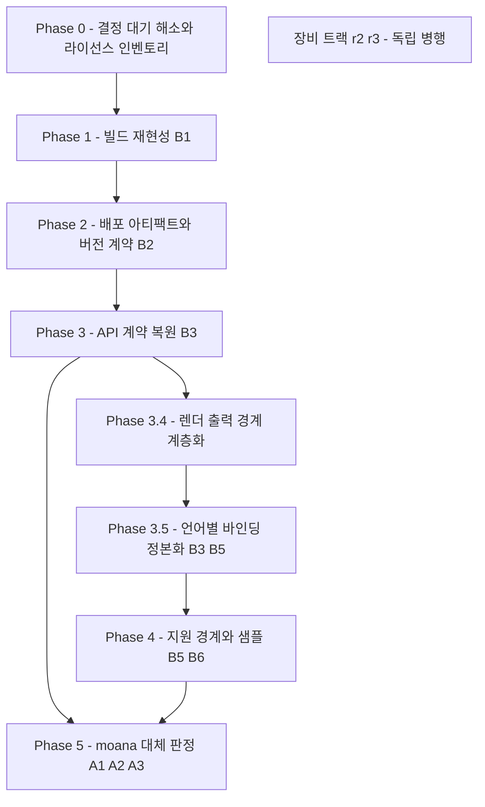

# 완성까지의 작업 순서

> **기준**: [goal.md](goal.md) 의 판정 조건 · **현재 위치**: [gap.md](gap.md) 의 실측
> **표기**: 시간 추정은 하지 않는다. Phase 와 선후 관계만 적는다.

## 순서의 논리

**검증할 수 없는 것은 고칠 수 없다.** 지금은 깨끗한 환경에서 빌드가 되지 않으므로, 무엇을 바꿔도 **바뀐 것이 맞는지 판정할 방법이 없다.** 그래서 빌드 재현성이 다른 모든 항목보다 앞선다.

`moana` 대체 판정(Phase 5)이 마지막인 이유는 우선순위가 낮아서가 아니라 **판정 자체가 앞 단계의 산출물을 필요로 하기 때문**이다 — 재현 가능한 빌드와 버전 고정이 없으면 "동등한가"를 물을 대상이 특정되지 않는다.

## Phase 0 — 결정 대기 해소와 라이선스 인벤토리

**구현이 아니라 조사·질의다.** 착수 즉시 병렬 가능하며, 결과가 이후 범위를 정한다.

| 항목 | 내용 | 산출물 |
|---|---|---|
| 0-1 | [goal.md §6](goal.md) 의 남은 질의 3건 확인 — **CVIE 재배포 권한**(+ 커밋된 `.cov` 처리) · **ADK 백엔드 재가동 여부** · **멀티테넌시 격리** | 답변 기록 |
| 0-2 | **서드파티 인벤토리 — SOUP 기준**(2026-07-30 결정). 구성요소·버전·라이선스·재배포 조건에 더해 **알려진 결함(CVE)·EOL/지원 상태·안전 분류 영향**을 함께 기록한다(IEC 62304 §8.1.2). **의료기기 SW 라 라이선스 적법성만으로는 부족** — EOL·CVE 미상 컴포넌트(예: OpenSSL 1.1.1d)는 그 자체가 미달 항목. SDK·ADK 가 함께 배포되므로 **범위는 양쪽 전체** | SOUP 인벤토리 표 |
| 0-3 | **ANGLE 실제 배치 확보** — 각 플랫폼이 지금 쓰는 바이너리의 출처·리비전을 개발자에게서 회수 | 리비전 확정 |

**성공 판정**: 재배포 불가 항목이 특정되고, 의존성 확보 경로가 확정되며, **EOL·CVE 미상 항목이 0건이거나 대응 계획이 선언된다.**

> **완성 범위는 이미 확정됐다** — 지원 모델 5종(300C·300L·500C·500L·500P, 미포함분은 단종) · 제공 형태(SDK+ADK 한 패키지, 선택은 고객) · 지원 언어 6종. [goal.md §3·§5](goal.md).

> 0-3 이 Phase 1 의 입력이다. **지금은 어느 ANGLE 을 쓰는지 저장소로 알 수 없으므로**([gap.md §3.2](gap.md)) 사람에게 물어 회수하는 것이 유일한 경로다.

## Phase 1 — 빌드 재현성 (B1)

**목표**: 힐세리온 개발자 머신이 아닌 환경에서 clone → 문서 절차 → SDK·ADK 바이너리.

| 항목 | 내용 |
|---|---|
| 1-1 | **의존성 관리 도입** — ANGLE·OpenCV·FreeType·DCMTK·FFmpeg·OpenSSL 을 버전 고정된 형태로 가져오는 단일 경로. 저장소에 커밋할지 패키지 매니저(vcpkg·Conan)로 당길지는 항목별 판단 |
| 1-2 | **경로 선언 일원화** — `third_party/readme.txt`·iOS CMakeLists·macOS CMakeLists 가 **서로 다른 세 경로**를 가리키는 상태를 하나로 정리 |
| 1-3 | **절대경로 제거** — Homebrew·`C:\work\…`·`/Users/rio/…` 의존 제거 |
| 1-4 | **커밋된 빌드 산출물 정리** — `macos/build/` 194파일, 앱 저장소의 `.so` 39개(103MB) |
| 1-5 | **빌드 진입점 통일** — 플랫폼별 MSBuild·`ndk-build`·Xcode·CMake 4갈래에 단일 진입점 |

**성공 판정**: 제3의 깨끗한 머신에서 문서만 보고 빌드가 성공한다. **이것이 외부 제공의 최소 조건이다.**

> **이 Phase 가 목적 1에 직접 값을 낸다.** 고객사가 겪는 첫 경험이 정확히 이 지점이다.

## Phase 2 — 배포 아티팩트와 버전 계약 (B2)

**목표**: 고객사가 받는 **패키지**를 정의하고 자동 생성한다.

| 항목 | 내용 |
|---|---|
| 2-1 | **패키지 정의 — 8개 구성**([goal.md B2](goal.md)) — 바이너리 · 공개 헤더 · 의존 서드파티 · **언어별 wrapper** · **샘플** · 문서 · 라이선스 고지 · 버전 메타. CVIE `.cov`·기밀 문서는 **제외 대상으로 명시**([gap.md §8.1](gap.md)) |
| 2-2 | **CI 도입** — 커밋에서 패키지까지 자동. 현재 **31개 저장소 전부 CI 0건** |
| 2-3 | **버전 계약** — 산출물에 버전이 박히고, 버전에서 소스 커밋이 역추적되며, 앱↔SDK 호환 조합이 선언된다 |
| 2-4 | **태깅 규약 정상화** — `VERSION_TAGGING.md` 규약은 있으나 실제 태그가 이탈 중 |
| 2-5 | **실장비 회귀 시나리오** — CI 로 판정되지 않는 영역(펌웨어 굽기·스캔 화질)의 회귀를 실장비에서 판정하는 절차. 3-9 의 선행 조건 |

**성공 판정**: 태그 하나로 패키지가 재생성되고, 그 패키지가 어느 커밋인지 추적된다.

## Phase 3 — API 계약 복원 (B3)

**목표**: 외부 개발자가 헤더만 보고 쓸 수 있고, 잘못 쓰면 컴파일에서 막힌다.

| 항목 | 내용 |
|---|---|
| 3-1 | **공개 경계 재설계** — 내부 모듈 API 는 이미 타입이 살아 있다([gap.md §2](gap.md)). **새로 설계하는 것이 아니라 끌어올리는 작업**이다 |
| 3-2 | **요청 코드·파라미터 스키마 공개** — `REQUEST_*` 와 JSON 스키마를 헤더로 노출. 제네릭 디스패처를 유지하더라도 계약은 타입으로 표현 가능하다 |
| 3-3 | **ANGLE 로드 책임 정리** — 현재 앱 계층이 지는 로드 순서 책임을 SDK 안으로 넣거나, 최소한 문서·헤더로 계약화([gap.md §4](gap.md)) |
| 3-4 | **계층 소속 규칙 명문화** — 배치는 **현행 유지**하고 두 규칙을 헤더·문서에 적는다: **① 스캔 원본은 SDK, 교환·보관 형식은 ADK ② 기전은 SDK, 정책은 ADK**. **펌웨어 프로토콜 세부는 규칙 ②의 알려진 예외**로 함께 적는다([rendering-boundary.md §7.5](rendering-boundary.md)) |
| 3-5 | **동명 클래스·enum 정리** — `HC::DeviceManager` 가 SDK·ADK 양쪽에 존재하며 뜻이 다르고, `adk/Main/ios/HCSonexSDK_iOS.h` 는 **`HC::ResultCode` 를 다른 값으로 재정의**한다([gap.md §4.4](gap.md)) |
| 3-6 | **모듈 로드 캡슐화** — DLL/`.so` 15개를 앱이 순서대로 수동 로드하는 구조 제거. 2026-05-29 ERROR 127 회귀의 원인([gap.md §7.1](gap.md)) |
| 3-7 | **공개 헤더 정본화** — `HCSonexSDKInterface.h` 가 공개(27 심볼)·구현(54 심볼) **두 벌**이고 공개본이 낡았다. **고객사가 받는 헤더에 API 절반만 있다**([gap.md §7.2](gap.md)) |
| 3-8 | **호환 정책 선언** — 무엇이 깨질 수 있고 무엇이 유지되는가 |
| **3-9** | **펌웨어 프로토콜 세부를 ADK → SDK 이관** — 청크 크기(768B)·stop-and-wait·B3→MSP 단계 순서는 장비가 정한 프로토콜이므로 SDK 소관이다. 정책(버전 판정·FTP·진행률)은 ADK 에 남긴다. 이관 후 **500L 과 500C/500P 의 업그레이드 인터페이스가 통일된다**([rendering-boundary.md §7.5](rendering-boundary.md)) |

**성공 판정**: 샘플 앱이 **공개 헤더만으로** 작성된다. 내부 헤더 참조가 0건이 된다.

> **3-9 의 선행 조건은 Phase 1(빌드) · 2(CI) · 2-5(실장비 회귀)다.** 펌웨어 굽기 실패는 장비 손상이고 최신 커밋이 실장비 검증분(2026-07-23)이라, 판정 장치가 서기 전에는 손대지 않는다. 그때까지는 지원 경계에 *"500C/500P 펌웨어 업그레이드는 ADK 필요"* 를 명시한다([goal.md](goal.md) B6).

## Phase 3.4 — 렌더 출력 경계 계층화 (B3)

**Phase 3.5(언어별 wrapper)의 선행 조건이다.** 순서를 뒤집으면 현재의 결합 4갈래가 **언어 수만큼 곱해진다.** 상세 = **[rendering-boundary.md](rendering-boundary.md)**.

| 항목 | 내용 |
|---|---|
| 3.4-1 | **완성 프레임 반환 API 승격** — 이미 있는 FBO 경로(`g_cineFbo`)를 정식 API 로. `hc_ReadRenderedImage` 가 그 원형이다 |
| 3.4-2 | **공유 서피스 반환** — IOSurface·AHardwareBuffer·D3D shared handle. **제로카피가 본선, 픽셀 버퍼가 폴백**. GL 텍스처 ID 반환은 컨텍스트 공유가 남으므로 피한다 |
| 3.4-3 | **터치·화면 이벤트 경로 정비** — **조작 소유는 SDK 에 남긴다**(`HCTouchRecognizer` 유지). 표시 컴포넌트가 **위젯 좌표 → 텍스처 좌표** 변환만 맡는다([rendering-boundary.md §7.3](rendering-boundary.md)) |
| 3.4-4 | **기본 폰트 동봉** — `hc_SetFontRawData` 경로가 이미 있다. 텍스트 렌더링은 SDK 에 **남기고**(영상 좌표 종속), 고객사가 폰트를 준비하지 않게 한다 |

**성공 판정**: 고객사 앱이 **네이티브 윈도우를 넘기지 않고** 스캔 화면을 표시한다. ANGLE 이 고객사 빌드·로드 대상에서 사라진다.

> **렌더링을 SDK 에서 빼는 작업이 아니다.** `ImageRenderer` 38,501 LOC 와 깊이 눈금·측정 텍스트는 그대로 남는다. 바뀌는 것은 **윈도우를 받느냐, 프레임을 주느냐** 한 가지다.

## Phase 3.5 — 언어별 바인딩 정본화 (B3·B5)

**Phase 3.4 가 선행되어야 한다.** Phase 3(공개 경계 정리)과 이어지지만 산출물이 별개이고, **목적 1에서 고객사가 가장 먼저 손대는 물건**이다. `[CTO]` 답변으로 제공 범위가 **SDK·ADK 양쪽**으로 확정돼 대상이 두 배가 됐다.

**대상 언어 6종** — 1차 **C++ · C# · Python · Flutter**, 2차 **JNI(Android 네이티브) · ObjC++(iOS·macOS 네이티브)**. 상세 = [goal.md §5.2](goal.md).

| 항목 | 내용 |
|---|---|
| 3.5-1 | **전수 대조** — 기존 27벌(약 14,400 LOC)의 심볼 집합을 공개 ABI 와 대조. **`SonexSDKBridge.mm` 3벌이 이미 20/22/23 으로 갈렸다** |
| 3.5-2 | **누락·오타 해소** — 앱이 존재하지 않는 심볼을 lookup 하는 건이 확인만 3건(대소문자 2 · 부재 1). 손으로 쓴 바인딩이라 **컴파일러가 잡지 못한다** |
| 3.5-3 | **1차 정본 수립** — C++(헤더 정비) · C#(정본화) · **Python(신규 — 유일하게 0건)** · Flutter(폐기된 `flutter_sonex_sdk` 복원) |
| 3.5-4 | **생성 또는 검증 자동화** — 공개 헤더를 입력으로 바인딩을 생성하거나, 최소한 헤더↔바인딩 불일치를 CI 가 판정 |
| 3.5-5 | **2차 공개 — JNI · ObjC++.** 신규 개발이 아니다. Flutter 가 그 위에 서 있어 **어차피 유지되는 코드**이며, 공개는 **계약으로 고정하는 일**이다. 3.4(서피스 배관 감소)와 3.5-1~4(표류 해소) 뒤에는 추가 비용이 거의 없다 |

**성공 판정**: 바인딩이 SDK 저장소 산출물로 배포되고, 헤더와의 불일치를 사람이 아니라 도구가 잡는다.

> **2차를 미루는 이유**: 지금 JNI·ObjC++ 가 가장 심하게 표류한 바인딩이다. 이 상태로 공개하면 **표류한 3벌을 그대로 계약으로 굳힌다.** 이 둘이 채우는 자리(네이티브 Android/iOS 앱 고객)는 다른 넷이 덮지 못하므로 목록에서 빼지는 않는다.

> **새로 만드는 작업이 아니다.** 재료가 이미 약 14,400 LOC 존재하며, 문제의 형태가 **HC 프로토콜 정본화와 동일**하다(복제 다수·정본 부재·이름 표류). [legacy/proof/protocol-sot/](legacy/proof/protocol-sot/) 에서 검증된 방법을 그대로 적용할 수 있다 — 전수 대조 → 정본 1벌 → **컴파일러가 동작 보존을 판정**.

## Phase 4 — 지원 경계와 샘플 (B5·B6)

| 항목 | 내용 |
|---|---|
| 4-1 | **지원 매트릭스** — 모델 × 펌웨어 버전 × 플랫폼. 2023년 설계 문서가 제기한 뒤 3년째 미결인 항목 |
| 4-2 | **미지원 조합의 동작 정의** — 명확한 오류 반환 |
| 4-3 | **샘플을 언어당 1벌로 채운다** — 배포가 한 패키지이므로 샘플도 하나이고, 그 안에서 SDK 섹션·ADK 섹션을 나눈다(현행 iOS·Android 샘플이 이미 탭 구조)([goal.md B5](goal.md)) |
| 4-3a | **`SDK-only` 빌드 구성 추가 + CI 판정** — ADK 를 링크하지 않고 빌드가 통과하면 계약 분리가 성립한다는 증명이다. 샘플을 2벌 만드는 것이 아니라 **구성을 하나 더 두는 것**. 현재는 iOS 빌드 역방향(Phase 1-2) 때문에 불가 |
| 4-3b | **Flutter — 제품에서 추출** — `sonex-app` 이 가장 완전한 참조 구현이다. **`SonexScanView` 위젯도 신규 작성이 아니라 이사** — `open_gl_view.dart` 265 · `native_view_widget.dart` 117 · `scan_controller.dart` 의 `hwnd` 116+61 이 위젯 내부로 들어간다([rendering-boundary.md §7.2](rendering-boundary.md)). **`sonex-app` 저장소에 실제 반영하는 작업은 [r1 Phase 8](r1/phase8-app-migration.md)** — 이 phase 는 추출물을 `sample/flutter/` 에 세우는 것까지다 |
| 4-3c | **Python — 코어(Qt 무의존) + `[qt]` 선택 패키지** — 바인딩도 샘플도 0인 유일한 백지. 코어는 프레임을 배열로 반환해 **렌더 경계 판정 시험**을 겸하고, GUI 는 **PySide6**(LGPLv3. PyQt6 는 GPL 이라 배제) |
| 4-3d | **C++ — Qt6 우선** — 표시 컴포넌트를 `SonexScanWidget`(Qt6)로 낸다. `moana` 의 Qt 경험이 재사용되고 LGPLv3 로 비용이 없다. 헤더 정비(Phase 3-7) 선행 |
| 4-4 | **통합 문서** — 시작하기·API 레퍼런스·마이그레이션 |

**성공 판정**: 힐세리온 외부 인원이 문서와 패키지만으로 샘플을 돌린다.

## Phase 5 — `moana` 대체 판정 (A1·A2·A3)

| 항목 | 내용 |
|---|---|
| 5-1 | **기능 정본 목록 작성** — `moana` 도메인 기능 전수. A1 판정의 전제이며 **현재 존재하지 않는다** |
| 5-2 | **동등성 판정** — 목록 대비 sonex 대응 여부 |
| 5-3 | **모델 커버리지 해소** — Phase 0-1 의 답에 따라 단종 처리 또는 이식 |
| 5-4 | **출하 경로 정리** — 인증·국가 변종을 브랜치 영구 분기가 아닌 방식으로 |

**성공 판정**: 기능 목록의 모든 항목이 판정되고, 미달 항목이 0이거나 폐기 승인된다. **이 시점이 `moana` 폐기 가능 시점이다.**

## 병행 트랙 — 장비

앱 결정과 **무관하게** 지금 착수 가능하며 내용이 그대로 유효하다.

| 트랙 | 문서 |
|---|---|
| `belle-fw` feature-first 재구성 | [r2/plan.md](r2/plan.md) |
| Buildroot `BR2_EXTERNAL` 도입 | [r3/plan.md](r3/plan.md) |
| **HC 프로토콜 정본** — 이미 만든 실물, `make` 로 재현 | [legacy/proof/protocol-sot/](legacy/proof/protocol-sot/) |
| **사이버보안 대응(신규개발 항목)** — 범위·일정 미정, 힐세리온 협의 필요 | [cybersecurity.md](cybersecurity.md) §3 |

프로토콜 정본은 **장비↔앱 이음매**라 SoNex 완성 작업과도 만난다. 남은 것은 힐세리온 승인이다.

## 이 계획의 성격

**리팩토링 계획이 아니다.** 힐세리온이 2023년에 정의한 목적을 그대로 두고, **그 목적이 요구하는데 아직 없는 것**만 나열했다. Phase 1~4 는 전부 계획서의 목적 1(외부 SDK/ADK 제공)에서 직접 유도되며, 새로운 요구를 추가하지 않았다.

구조 변경(feature-first clean architecture 등)은 이 목록에 **의도적으로 넣지 않았다.** 목적 달성에 필요한 최소 집합을 먼저 세우고, 구조 개선은 그 위에서 별도로 판단한다.
