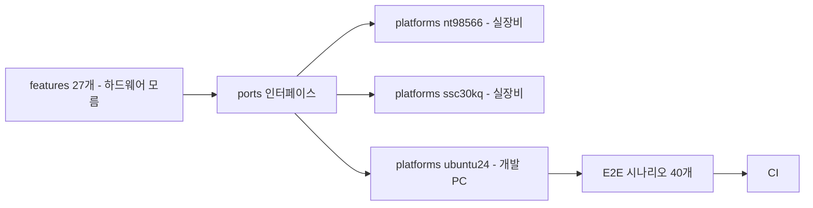

# 선례 — cctv-platform 에서 실제로 무엇이 달라졌나

> **이 문서의 역할**: [why.md](why.md) 의 주장은 "이렇게 하면 좋아진다" 는 예측이 아니라 **이미 한 번 한 일**이다. 같은 팀이 같은 방법으로 **동종 시스템**(임베디드 장비 펌웨어 + 멀티플랫폼 클라이언트 + 클라우드)을 리팩토링했고, 그 결과가 저장소에 남아 있다.
>
> 아래 수치는 전부 `/home/beomsik/project/claude-work/cctv` 실측이다(2026-07-28). **전이되지 않는 조건은 §6 에 따로 적었다** — 그것을 빼고 읽으면 이 문서는 근거가 아니라 광고가 된다.

## 0. 왜 이 선례가 healcerion 에 해당하는가

**출발점이 같다.** cctv 도 벤더 원본 펌웨어를 read-only 미러(`device/fw-orig/`)로 두고 시작했다 — healcerion 의 `<컨테이너>/legacy/` 와 같은 위상이다.

| | cctv (리팩토링 전) | healcerion (현재) |
|---|---|---|
| 원본 위치 | `device/fw-orig/` (벤더 원본, read-only) | `<컨테이너>/legacy/` (힐세리온 원본, read-only) |
| 장비 | IP 카메라·NVR/DVR 펌웨어 (SoC 10종) | 초음파 장비 펌웨어 (ZynqMP) |
| 클라이언트 | 데스크톱·웹·모바일 | Qt 앱 · Flutter 앱 |
| 클라우드 | 관리·중계·저장 서버 | sonon-cloud · sonex-cloud-backend |
| 시작 시점 구조 | 기술 역할별 대형 파일 | **동일** ([why.md §4](why.md)) |

**차이는 도메인이지 구조가 아니다.** 그래서 아래 결과는 도메인 지식이 아니라 구조 작업의 결과다.

## 1. 결정적 수치 — 작업의 91% 를 AI 에이전트가 했다

```bash
git -C <repo> log --all --since=2026-01-01 --grep='Co-Authored-By: Claude' --oneline | wc -l
```

| 저장소 | AI 커밋 / 전체 (2026년) | 비율 |
|---|---:|---:|
| 루트(오케스트레이션·문서) | 865 / 915 | 94% |
| `device/ipc-app` (카메라 펌웨어) | 454 / 479 | 94% |
| `desktop/cms-app` (Qt 관제 앱) | 665 / 782 | 85% |
| `web/web-app` | 314 / 329 | 95% |
| `mobile/mobile-app` | 279 / 296 | 94% |
| `server/api-server` | 197 / 206 | 95% |
| `device/buildroot-cctv` | 236 / 280 | 84% |
| `device/aibox-app` | 53 / 54 | 98% |
| **합계** | **3,063 / 3,341** | **91%** |

**이것이 이 검토의 핵심 전제다.** 사람이 코드를 직접 쓰는 것을 전제로 한 계획은 지금 성립하지 않는다. 작업량은 인원이 아니라 **AI 가 안전하게 작업할 수 있는 코드 표면**에 비례한다.

> **측정의 한계(명시)**: 이 수치는 커밋 메시지의 `Co-Authored-By: Claude` 트레일러를 센 것이다. 트레일러 유무는 **누가 커밋을 만들었는가**를 나타내며, 라인 단위 저작 비율이 아니다. 사람의 리뷰·지시·수정이 그 안에 섞여 있다. 그럼에도 방향은 분명하다 — **커밋을 만드는 주체가 바뀌었다.**

`buildroot-cctv` 는 2021년부터 있던 저장소라 대조군이 된다 — 2021~2025 커밋 642건은 사람이, 2026년 280건은 84% 가 AI 다. **저장소가 바뀐 게 아니라 작업 방식이 바뀌었다.**

## 2. 구조 — feature-first clean architecture 가 실제로 무엇을 만들었나

### 2.1 대조군 — 저장소 5개가 앱 2개가 됐다

**`cctv-stream`·`cctv-net-fcgi` 는 IPC 와 XVR(NVR/DVR)의 공통 코드다.** 따라서 `ipc-app` 하나와 견주면 원본이 과대계상된다. 범위를 맞추려면 XVR 축도 양쪽에 넣어야 한다.

| 원본 (`fw-orig/`) | 역할 | 대체 |
|---|---|---|
| `cctv-ipc` | 카메라 앱 본체 | `ipc-app` |
| `cctv-dvr` · `cctv-nvr` | 녹화장치 앱 본체 | `xvr-app` |
| `cctv-stream` | 스트리밍 (**IPC·XVR 공통**) | 양쪽 `features/streaming` |
| `cctv-net-fcgi` | 웹 API·클라우드 (**IPC·XVR 공통**) | 양쪽 `app/webapi` · `features/cloud-client` |
| `onvif` | ONVIF 서버 | **`onvif-wrapper`** (별도 저장소 — §2.3) |

**측정 규칙(양쪽 동일)**: `.c/.cpp/.h/.hpp` · `build*/`·`example/` 제외 · 벤더 라이브러리(LVGL·aws-webrtc·libavm·cpp-jwt·fcgi) 제외 · **벤더 SoC SDK 헤더**(`hal/*/include/` 의 Novatek `hd_*.h` 604개) 제외 · `cctv-device-db` 는 1회만 계수(§2.2).

| | 원본 5종 | 리팩토링본 `ipc-app`+`xvr-app` |
|---|---:|---:|
| 소스 파일 수 | 879 | **2,174** |
| 총 LOC | 346,991 | 389,332 |
| 1,000줄 초과 | **79 (9%)** | **45 (2%)** |
| 500~1,000줄 | 107 (12%) | 123 (6%) |
| 500줄 미만 | 693 (79%) | **2,006 (92%)** |

> **총 LOC 는 줄지 않았다 — 오히려 12% 늘었다.** 리팩토링의 효과는 코드 총량 감소가 아니다(그 사이 기능도 늘었다). **달라진 것은 분포다** — 파일 수가 2.5배가 되면서 1,000줄 초과가 9% → **2%** 로, 500줄 미만이 79% → **92%** 로 이동했다.
>
> 앞선 판(원본 3종 vs `ipc-app`)에서 "총량 34% 감소" 로 읽혔던 것은 **공통 코드를 IPC 쪽에만 계상한 대조군 오류**였다. 정정한다.

**작업 단위가 파일 하나에 들어온다는 것**이 얻은 것이고, 이것이 AI 컨텍스트 비용을 결정한다. 남은 큰 파일은 예외로 드러난다 — 상위 6개 중 4개가 ONVIF 브리지(§2.3)와 composition root, 2개가 Qt 표시 계층(`presentations/qt4`)이다.

### 2.2 복제가 실제로 있었고, 없어졌다

원본 저장소는 공유 컴포넌트 `cctv-device-db` 를 **각자 복사해 들고 있었다** — 23개 파일이 **5벌 전부 MD5 바이트 동일**이다.

```bash
find <repo>/cctv-device-db -type f \( -name '*.cpp' -o -name '*.h' \) | sort | xargs md5sum | awk '{print $1}' | md5sum
# cctv-ipc / cctv-dvr / cctv-nvr / cctv-stream / cctv-net-fcgi → 전부 03d6cae74048a886
```

**healcerion 의 HC 프로토콜이 저장소 9곳에 흩어져 있는 것과 같은 패턴이다**([why.md §3](why.md)). 리팩토링 후에는 `core/` 로 들어가 앱마다 한 벌만 남았다.

### 2.3 반례 — ONVIF 는 개선되지 않았다

**모든 컴포넌트가 같은 결과를 낸 것이 아니다.** 손으로 쓴 소스만 대칭 비교하면(gSOAP 런타임·WSDL 생성 스펙 양쪽 다 제외):

| | `fw-orig/onvif` | `onvif-wrapper` |
|---|---:|---:|
| 파일 수 | 35 | 44 |
| 총 LOC | 16,539 | **26,657** |
| 1,000줄 초과 | 5 (14%) | **8 (18%)** |
| 500줄 미만 | 23 (66%) | **27 (61%)** |

**커졌고 분포도 나아지지 않았다.** 이유는 둘이다 — gSOAP 이 규격(WSDL)에서 코드를 생성하는 구조라 손으로 쓰는 부분이 **서비스별 대형 파일**로 남고(`device_service.cpp` 3,821 · `media20_service.cpp` 2,677), 그동안 기능 범위 자체가 늘었다.

**여기서 얻는 교훈이 §2.1 만큼 중요하다**: 구조 개선은 균일하게 오지 않는다. **외부 표준 규격에 묶인 표면은 예외로 남는다.** `ipc-app` 안에는 호출측 `features/onvif`(7,917 LOC)만 남기고 서버 구현을 별도 저장소로 분리한 것이 그 인정이다.

healcerion 에 대응시키면 **DICOM·PACS·MWL** 이 같은 성격이다 — 표준 규격 표면이라 feature 분리의 이득이 작을 수 있고, 기대치를 여기에 걸면 안 된다.

### 2.4 feature 27개, 각각이 같은 내부 계층을 갖는다

`device/ipc-app/src/` 는 다음으로 나뉜다.

| 디렉토리 | 내용 |
|---|---|
| `features/` | **27개** — `alarm` `analytics` `audit-log` `auth` `camera` `capability` `cloud-client` `codec` `datetime` `discovery` `ecam` `event` `firmware` `info` `io-control` `isp` `network` `oem` `onvif` `osd-overlay` `ptz` `snmp` `status` `storage` `streaming` `telemetry` `user` |
| `core/` | 하드웨어를 모르는 공용부 — `config` `crypto` `entities` `event` `http` `logging` `messaging` `module` |
| `platforms/` | SoC 어댑터 — `nt98566` `ssc30kq` **`ubuntu24`** |
| `app/` | 조립(composition root)·webapi |
| `oem/` | 고객사 분기 |

feature 내부는 다시 같은 모양이다 — `api` · `ports` · `domain` · `application` · `data` · `interfaces`. **어느 feature 를 열어도 파일이 있을 자리가 같다.**

이 규칙은 문서가 아니라 **테스트로 강제된다**: `make test-architecture` 가 계층 위반을 CI 에서 잡는다.

### 2.5 두 제품 라인이 **같은 feature 어휘**를 쓴다

`xvr-app`(녹화장치)도 feature **27개**이고, `ipc-app`(카메라)과 이름이 **21개 겹친다**.

```
alarm analytics audit-log auth camera capability cloud-client codec datetime
discovery info io-control network onvif ptz snmp status storage streaming telemetry user
```

카메라에만 있는 것은 `isp`·`osd-overlay`·`ecam` 같은 촬상 계열이고, 녹화장치에만 있는 것은 표시·채널 계열이다. `xvr-app` 은 `presentations/`(`qt4`·`qt4-car`) 축이 하나 더 있다 — **화면이 있는 장비**라서다.

**이것이 "device·client 양쪽이 같은 feature 이름을 쓴다" 의 실물이다**([README](README.md) 만들 것 1번). 제품이 달라도 같은 이름을 찾아 들어가면 되므로, 한쪽에서 배운 구조가 다른 쪽에 그대로 쓰인다 — 사람에게도, AI 에게도.

## 3. 에뮬레이터 — `platforms/ubuntu24` 가 곧 에뮬레이터다

별도 시뮬레이터를 만든 것이 아니다. **`platforms/` 에 PC 어댑터를 하나 더 추가**했다. 카메라·PTZ·오디오·알람·시계·설정 어댑터가 전부 PC 구현으로 존재한다.



효과는 두 가지다.

| | |
|---|---|
| **실장비 0대로 전 경로 실행** | 장비 앱이 개발 PC 에서 그대로 뜬다. `make run PLATFORM_ID=ubuntu24` |
| **에뮬레이터가 곧 아키텍처 검증** | PC 에서 돌았다는 것은 **도메인이 하드웨어를 모른다는 증거**다. 구조가 무너지면 즉시 안 돌아간다 |

두 번째가 중요하다. clean architecture 는 보통 "지켜지는지 확인할 방법이 없어서" 무너지는데, **에뮬레이터가 그 판정기 역할을 한다.**

## 4. 빌드 — Buildroot `BR2_EXTERNAL` 로 제품 23종이 한 트리에서 나온다

`device/buildroot-cctv/configs/` 의 defconfig 목록이다.

```
MS339_Pudding_ipc   en675_airknight   en675_ipc      en683_ipc      en683_monitor
hi3521a_skoopia     nt9832x_dvr       nt9832x_nvr    nt98331_edistec
nt98331_skoopia     nt98331_vds       nt98336_cdvr   nt98336_dvr
nt98566_ipc         nt98566_uvc       nt98633_nvr    ss626v100_nvr
ssc30kq_ipc         ssc327de_ipc      ssc335_ipc     ssc335_ipc_glibc
ubuntu24            x86_64_emul
```

**SoC 10종 · 제품 23종 · 고객사 OEM 분기가 defconfig 한 줄로 갈린다.** 그리고 `x86_64_emul` 이 그 목록 안에 같이 있다 — 에뮬레이터가 별도 체계가 아니라 **같은 빌드 시스템의 타깃 하나**다.

healcerion 현재와 대조하면 이것이 [why.md 시나리오 C](why.md) 가 말하는 것의 실물이다.

| | healcerion `belle-fw` | cctv `buildroot-cctv` |
|---|---|---|
| 변종 선택 | `-D_USING_500L_DEV_` 등 **컴파일 타임 분기** | defconfig / 런타임 오버레이 |
| 새 모델 추가 | 플래그 추가 + 모델별 별도 빌드 | **defconfig 1개 추가** |
| rootfs | 저장소 밖 `petalinux-image-minimal` + `sudo mkfs.ubifs` 수동 | 트리 안에서 생성 |
| 개발 PC 타깃 | 없음 | **있다**(`x86_64_emul`·`ubuntu24`) |

## 5. 검증 — E2E 40 시나리오 + 표준 CLI

### 5.1 루트 한 줄로 전 계층이 돈다

```bash
make e2e                          # 전체
make e2e-feature FEATURE=device-online   # 하나만
```

시나리오 40개가 `tests/e2e/features/` 에 있고, 각각 `.sh`(실행)와 `.md`(검증 대상 명세) 쌍이다 — `device-auth` `device-camera` `device-recording` `device-storage-playback` `device-video-analytics` `cloud-provisioning` `cloud-fcm-push` `discovery-multicast` `ipc-xvr-interop` `invitation` 등.

**E2E 의 원칙이 문서로 고정돼 있다** — "API 스키마 검증 금지, 크로스 컴포넌트 실제 동작만". 장비 PING → 서버 상태 전환 → 클라이언트 수신까지 한 흐름으로 검증한다.

### 5.2 저장소마다 같은 `make` 인터페이스

```
make build · test · test-unit · test-integration · test-e2e · test-architecture · run · image · clean
```

**`make image` 가 buildroot-cctv 를 호출해 플래시 이미지까지 만든다.** 앱 저장소에서 펌웨어 이미지가 한 명령으로 나온다.

루트는 빌드 대상이 아니라 오케스트레이터이고, `make build`·`test`·`clean` 을 **거부**한다 — healcerion 루트 Makefile 이 같은 규칙을 쓰고 있다.

### 5.3 CI

저장소 6곳에 워크플로 8건이 있다(`ipc-app` `cms-app` `web-app` ×2 `mobile-app` ×2 `api-server` `buildroot-cctv`). healcerion 은 **31개 저장소 전부 0건**이다(실측 재확인).

## 6. 전이되지 않는 것 — 이 선례의 한계

**이것을 빼고 인용하면 근거가 아니라 광고다.**

| 항목 | cctv | healcerion | 영향 |
|---|---|---|---|
| **규제** | 없음 | **의료기기** — IEC 62304 / ISO 14971, 인증 유지 | **가장 큰 차이.** 변경마다 검증 산출물이 따라와야 한다. 다만 CI·추적성이 그 산출물을 만든다([why.md §반론](why.md)) |
| **소유권** | 벤더 원본을 인수해 우리가 소유 | **힐세리온 소유**, 우리는 read-only 미러 | 작업 방식·반입 승인·IP 경계를 먼저 합의해야 한다 |
| **동시 진행 리팩토링** | 없었음 | **sonex 전환이 진행 중** | 충돌이 아니라 분담으로 풀어야 한다([why.md §3.2](why.md)) |
| **하드웨어 설계** | 벤더 SDK 위 | **PL(FPGA) 설계가 제품의 일부**, Vivado 프로젝트 미확보 | FPGA 축은 이 선례 밖이다 |
| **신호처리** | 없음 | **제품의 본질** — 빔포밍·도플러·영상필터 | 구조 작업의 대상이 아니다. 건드리지 않는다 |
| **기간** | 2026년 상반기에 위 결과 | — | **기간을 근거로 쓰지 않는다.** 조건이 다르다 |

**그럼에도 전이되는 것**은 §1~§5 전부다 — feature-first 구조, PC 플랫폼 어댑터, Buildroot 단일 트리, E2E, 표준 CLI, 그리고 **AI 에이전트가 그 위에서 작업량의 대부분을 처리한다는 사실**. 이것들은 도메인 지식이 아니라 구조에 붙는 성질이다.

## 7. 실측 재현

```bash
C=/home/beomsik/project/claude-work/cctv
# §1 AI 커밋 비율
git -C $C/device/ipc-app log --all --since=2026-01-01 --grep='Co-Authored-By: Claude' --oneline | wc -l
# §2.1 파일 크기 분포 — 원본 5종 (벤더 SDK 헤더·벤더 라이브러리·중복 device-db 제외)
cd $C/device/fw-orig && find cctv-ipc cctv-dvr cctv-nvr cctv-stream cctv-net-fcgi \( -name '*.cpp' -o -name '*.c' -o -name '*.h' -o -name '*.hpp' \) \
  ! -path '*/build*/*' ! -path '*/example/*' ! -path '*/lvgl/*' ! -path '*/lv_freetype/*' \
  ! -path '*/aws-webrtc/*' ! -path '*/libavm/*' ! -path '*/lib/*' ! -path '*/cpp-jwt/*' ! -path '*/fcgi/*' \
  ! -path '*/hal/*/include/*' ! -path 'cctv-dvr/cctv-device-db/*' ! -path 'cctv-nvr/cctv-device-db/*' \
  ! -path 'cctv-stream/cctv-device-db/*' ! -path 'cctv-net-fcgi/cctv-device-db/*' \
  | xargs wc -l | awk '$2!="합계"{n++; if($1>1000)a++; else if($1<500)c++} END{printf "%d files, 1000+:%d, <500:%d\n", n, a, c}'
# 같은 규칙으로 리팩토링본 (IPC·XVR 양쪽 — 범위를 맞춘다)
cd $C/device && find ipc-app/src ipc-app/apps xvr-app/src xvr-app/apps \( -name '*.cpp' -o -name '*.c' -o -name '*.h' -o -name '*.hpp' \) ! -path '*/build*/*' \
  | xargs wc -l | awk '$2!="합계"{n++; if($1>1000)a++; else if($1<500)c++} END{printf "%d files, 1000+:%d, <500:%d\n", n, a, c}'
# §2.4~2.5 feature 목록과 공통 어휘
ls $C/device/ipc-app/src/features
comm -12 <(ls $C/device/ipc-app/src/features | sort) <(ls $C/device/xvr-app/src/features | sort) | wc -l
# §4 defconfig 목록
ls $C/device/buildroot-cctv/configs
# §5.1 E2E 시나리오
ls $C/tests/e2e/features/*.sh | wc -l
```
