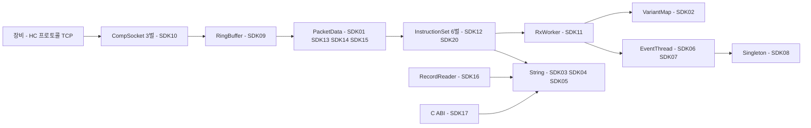

# SDK 코드 결함 인벤토리 — r1 보강

**이 문서가 답하는 질문: `sdk/sdk/`(SDK 계층)에 동작 결함이 있는가, 있다면 리팩토링으로 없어지는가.**

> **기준일 2026-08-02.** 대상 = `sonex-framework` **SDK 축**(`sdk/sdk/` + `sdk/common/` + `sdk/include/`, 437파일 **97,557 LOC**) + `moana` 의 **SDK 대응 계층**(`framework/SononClient`·`ScanManager`·`ImageProc`·`Common`).
> **`sdk/adk/`(ADK 계층)는 이 문서의 범위가 아니다** — [code-defects.md](./code-defects.md) 가 다룬다. 두 문서는 **자매 문서**이고 범위가 겹치지 않는다.
> **실측 기준**: `client/sonex-framework` 작업 사본 `refactor/r1` `eae9f14d` · `moana` 는 **`origin/service_QT693`**(활동 브랜치, `7b26a9b27`). `moana` 항목은 전부 이 브랜치에서 재검증했다 — `master` 체크아웃의 줄번호를 그대로 쓰지 않았다.
> **범위 밖**: 샘플앱 · 서드파티(`third_party/`·`adk/library/`) · `glad`.

## 0. 왜 별도 축인가

[plan.md §8](./plan.md) 은 *"도메인 로직은 다시 쓰지 않는다"* 고 못박고, 그 전제는 **"지금 코드는 동작한다"** 였다. **SDK 축에서도 그 전제가 성립하지 않는다.** 자매 문서가 ADK 에서 내린 것과 같은 결론이고, 처리 원칙도 같다 — **결함 수정은 리팩토링이 아니라 동작 변경**이므로 Phase 항목에 섞지 않고 축 `X` 에 붙인다(§7).

## 1. 검토 방법과 증거 등급

**대리증거를 쓰지 않았다.** 각 항목마다 *어떤 입력에서 무엇이 잘못되는지*를 적었고, 재현하지 못한 것은 §8 에 미확인으로 남겼다.

| 등급 | 뜻 | SDK 21 | `moana` 5 |
|---|---|---:|---:|
| **컴파일러** | gcc 13 / clang 이 경고·오류로 판정. 판단 여지 없음 | **5** | 0 |
| **실행 실험** | 격리 재현 프로그램으로 동작 확인 | **1** | 0 |
| **코드 대조** | `moana` 활동 브랜치의 같은 기능을 줄 단위로 대조 | **3** | **1** |
| **코드 판독** | 제어흐름·수명 추적. 재현 프로그램 없음 | 12 | 4 |

> **결함 항목 수와 경고 건수를 섞지 않는다** — 컴파일러가 잡는 것은 **항목 5건**이고, 그 항목이 만드는 **경고는 16건**이다(`-Wtype-limits` 14 + `-Wdelete-incomplete` 2). SDK-12 하나가 6개 파일에 복제돼 있어 경고만 12건이 나오기 때문이다.

컴파일러 판정은 아래로 재현한다(SDK `shared/` 소스 전체. 43파일은 플랫폼 헤더 부재로 컴파일이 서지 않아 집계에서 빠졌다 — **즉 이 숫자는 하한이다**).

```bash
g++ -std=c++17 -fsyntax-only -Wall -Wextra -DPLATFORM=1 -D__ANDROID__ \
    -Isdk/include -Isdk/common/shared -Isdk/sdk/DeviceManager/shared ... <파일>
```

## 2. 결론

| | 판정 |
|---|---|
| **총 결함** | **SDK 20건**(치명 1 · 높음 7 · 중간 8 · 낮음 4) + **`moana` SDK 대응 계층 5건**(치명 1 · 높음 2 · 중간 2) |
| **몰린 자리** | **둘뿐이다** — ① 장비 입력 경계(`PacketData`·`InstructionSet` 6벌·소켓 3벌·`RingBuffer`) ② 공용 인프라(`String`·`Log`·`EventThread`·`VariantMap`·싱글턴) |
| **도메인 알고리즘** | 확정 결함 **0건**. 스캔변환·필터 본문에서는 나오지 않았다 |
| **컴파일러가 잡는 것** | **20건 중 14건**. `-Wall` 한 줄이면 드러난다 |

**세 가지가 눈에 띈다.**

**① 리팩토링이 건드리려는 표면과 결함이 있는 표면이 같다.** 소켓 3벌(3-J)·거대 dispatcher(3-I)·공개 헤더(3-F)·C ABI(3-E) — [plan.md §4](./plan.md) 가 이미 잡아 둔 항목 위에 결함이 얹혀 있다. **따라서 대부분은 새 Phase 가 아니라 기존 항목의 범위 확장으로 처리된다**(§7).

**② 치명 1건은 프로토콜 자체가 갈린 것이다.** `putFloat` 가 float 을 **1바이트**로 쓴다(SDK-01). `moana` 정본 대비 FPGA 명령 페이로드가 **5→3바이트**라 **두 앱이 같은 장비에 다른 바이트를 보낸다.**

**③ 재작성은 고치기도 했고 옮겨오기도 했다.** `moana` 의 치명 결함(MO-01, 원격 힙 오버플로)은 SDK 가 **구조적으로 해소**했다 — 전선 값을 믿는 대신 잔량을 센다. 반대로 **암호 상수 3개는 글자 단위로 복사됐다**(§6). 자매 문서의 "승계 8 / 포팅 신규 18" 판정과 **방향이 같다**.

## 3. 장비 입력 경계 — `DeviceManager`



| # | 결함 | 위치 | 등급 |
|---|---|---|---|
| **SDK-01** | **`putFloat`·`putDouble` 이 float 을 1바이트로 쓴다.** 본문이 `buffer.push_back(b ? 1 : 0)` — `putBoolean` 을 복사하고 타입만 바꿨다. **같은 클래스의 `getFloat`·`getDouble` 은 4·8바이트를 읽는다**(`:218-233`). 호출 지점 **9곳**(300C:1467 · 300L:876·970·1128·1263·1688 · 500C:1636 · 500L:1547 · 500P:1628) | `HCPacketData.cpp:151-161` | **치명** `코드 대조` |
| **SDK-11** | **프레임 1장마다 `VariantMap` 이 샌다.** `case CMD_RECEIVE_FRAME` 이 함수 끝의 `delete data`(`:341-343`)로 가지 않고 `return` 한다. **SDK-02 때문에 그럴 수밖에 없다** — 지우면 소멸자가 참조계수를 무시하고 프레임을 해제한다. **결함 하나를 다른 결함으로 막고 있고 대가가 프레임당 누수**다. `REQUEST_GET_SCANNER_INFO`(`:269`)도 같다(연결당 1회라 경미) | `HCRxWorker.cpp:283-301` | **높음** `코드 판독` |
| **SDK-12** | **헤더 검증이 죽은 조건이다 — 6벌 모두.** ① `size_t skip = current() - 2; if (skip < 0)` → **`-Wtype-limits` 항상 거짓**. 1바이트만 수신된 상태(TCP 분할 시 흔하다)에서 `skip = SIZE_MAX` 가 `outLength` 로 나가 `pop()` 이 거부되고 **그 바이트가 링에서 소비되지 않는다** ② `contentSize < 0` 도 `size_t` 라 항상 거짓 → **실질 검증이 `targetId != 2 \|\| sessionId != 0` 뿐**이다. 코드에 `// FIXME: Check header validation` 이 붙어 있다 | `InstructionSet{300C:274,295 · 300L:266,287 · 500C:265,290 · 500L:256,278 · 500P:272,294 · Default:104,125}` | **중간** `컴파일러` |
| **SDK-13** | **읽기 경계 언더플로 3건.** ① `getString`: `size_t limit = size() - position - 1` 이 `position >= size()` 에서 언더플로 → `maxSize` 로 클램프 후 **최대 `maxSize` 바이트 힙 초과 읽기**(결과는 `nullptr` 로 버려지나 읽기는 일어난다) ② `getFloat`/`getDouble`: `position > size() - sizeof(float)` 의 **우변이 언더플로**해 4바이트 미만 버퍼에서 검사가 통과. 게다가 오류 반환이 `return false`(=0.0f)라 **정상 0.0 과 구분 불가** ③ `resetPosition`: `if (position < 0)` 항상 거짓 | `HCPacketData.cpp:288-315 · 218-233 · 194-199` | **중간** `컴파일러`+`코드 판독` |
| **SDK-14** | **`clone()` 이 매번 샌다.** `new PacketData(createPacketRaw(), length())` — `createPacketRaw()` 의 `new char[]`(`:305-310`)를 아무도 잡지 않는다(헤더 주석도 `@param raw (destroy: caller)`). 호출 5곳 중 4곳이 송신 경로(`HCSocketCommunicator.cpp:1127·1248·1278·1333`)라 **명령마다** 발생 | `HCPacketData.cpp:38` | **중간** `코드 판독` |
| **SDK-15** | **`version` 필드만 바이트 순서가 반대다.** `setVersion` 은 `buffer[2]=major` 로 **빅엔디언**, `readHeaderInfo` 는 `getUint16`(`memcpy` → 호스트 **리틀엔디언**)로 읽는다. 나머지 필드는 일관된다. 지금 무해한 이유는 **`version` 을 아무도 판정에 쓰지 않기 때문**(SDK-12 의 죽은 검사가 유일한 소비처)이고, 버전 분기를 넣는 순간 결함이 된다 | `HCPacketData.cpp:96-101` vs `:75-85,245-254` | **낮음** `코드 판독` |
| **SDK-20** | **`int fullImageSize = scanlines * samples`** — `uint16*uint16` 최대 4.29e9 가 `INT_MAX` 를 넘겨 **부호 오버플로(UB)**. 지금은 `getBinary()` 의 `size_t` 변환이 우연히 막을 뿐 검사한 것이 아니다. 같은 함수의 `static int diagFrameCount`(`:1949`)는 인스턴스·세션 무관 전역 상태 | `HCInstructionSet500L.cpp:1924` | **낮음** `코드 판독` |

### 3.1 SDK-01 — 두 앱이 장비에 다른 바이트를 보낸다

`REQUEST_TX_FREQUENCY`(FPGA 명령) 기준 대조다.

| | 주파수 인덱스 | 미사용 float | 페이로드 계 |
|---|---|---|---|
| **`moana`**(정본) `SononCtrlPacket.cpp:195-196` | `setParamByte` **1바이트** | `setParamFloat32(0.0)` **4바이트**(`BasePacket.cpp:304-316`, `memcpy FLOAT_SIZE`) | **5바이트** |
| **SDK** `HCInstructionSet500L.cpp:1546-1547` | `putUint16` **2바이트** | `putFloat(0)` **1바이트** | **3바이트** |

**두 축이 동시에 어긋난다** — 필드 폭(1 vs 2)과 float 인코딩(4 vs 1). 값은 둘 다 0 이지만 **길이가 다르다.**

> **장비측 영향은 미확인**(§8). 길이를 안 보고 앞에서부터 읽는 구조면 뒤 필드가 밀리고, 선언 길이로 자르면 조용히 무시된다. 어느 쪽이든 **두 앱이 다른 바이트를 보낸다는 사실은 변하지 않는다.**

### 3.2 SDK-09 · SDK-10 — 링버퍼와 소켓 3벌

| # | 결함 | 위치 | 등급 |
|---|---|---|---|
| **SDK-09** | **`RingBuffer` 3건.** ① `write()` 의 `appendable+insertable` 이 최대 `bufferSize` 라 **정확히 그만큼 쓰면 `tail==head` → `size()`==0** — 방금 받은 데이터 전체가 "빈 버퍼"가 된다. 용량을 `bufferSize-1` 로 잡거나 full 플래그가 있어야 한다. 수신 경로가 `recv(..., buffer->free(), 0)` 라 **커널 큐가 찬 순간 실제로 성립** ② `at(int i)` 의 `while (index < 0)` 이 **`-Wtype-limits` 항상 거짓**이고 `index > bufferSize` 도 `>=` 여야 해 **1바이트 힙 초과 읽기** ③ `memcpy` 를 쓰며 `<cstring>` 미include — **`error: 'memcpy' was not declared`** | `HCRingBuffer.cpp:84-107 · 113-122 · 45,79,96` | **높음** `컴파일러`+`코드 판독` |
| **SDK-10** | **소켓 HAL 3벌 — 같은 결함이 서로 다르게 남아 있다**(아래 표) | `HCCompSocket{Android,IOS,Windows}.cpp` | **높음** `코드 대조` |

세 구현은 실질 줄 기준 50~59% 가 같은 코드다([../../review/sonex-framework.md §10.4](../../review/sonex-framework.md)). **결함도 같은 자리에 있는데 고쳐진 곳이 제각각이다.**

| 결함 | Android | iOS | Windows |
|---|---|---|---|
| **연결 완료를 확인하지 않는다** — `select()` 가 **타임아웃(0)** 을 반환해도 `else` 로 떨어져 `EISCONN` 이 된다. 타임아웃이 `tv{0,10}` = **10µs** 라 첫 select 가 곧바로 0 을 반환 → **connect 가 사실상 항상 SUCCESS**. `SO_ERROR` 를 한 번도 읽지 않는다 | **있음** `:103-112` | **없음** — 2초 타임아웃·시도 10회·`errorfds` 검사 `:120-145` | **있음** `:128-137` |
| `EWOULDBLOCK` 에서 `continue` — **백오프 없는 무한 재시도**. `isListening` 도 안 본다 | 있음 `:245` | 있음 `:306` | 있음 `:243` |
| 부분 전송 시 재귀 `sendPacket()` **반환값 폐기 후 무조건 `SUCCESS`** | 있음 `:185` | 있음 `:246` | 있음 `:199` |
| `writeBuffer()` 반환값 폐기 — 링버퍼 쓰기 실패가 **수신 성공으로 보고** | 있음 `:221` | 있음 `:282` | 있음 `:232` |
| **수신마다 hex 덤프 로그**(성능) | 있음 `:225-236` | 있음 `:286-297` | **제거됨** — `// 매 recv마다 로그 → 성능 저하 원인, 제거` `:229` |

**첫 행이 실질 결함이다.** 논블로킹 `connect()` 의 완료는 `select` + `SO_ERROR` 로 확인해야 하는데 Android·Windows 는 하지 않는다. 연결이 안 됐는데 `SUCCESS` 와 함께 `socketHandle` 이 설정되고, 실패는 뒤따르는 송수신에서 엉뚱한 코드로 드러난다.

**마지막 행이 3벌 유지의 대가를 그대로 보여준다** — 성능 문제를 인지하고 고쳤는데 **자기 플랫폼만 고쳤다.** 첫 행은 그 반대 방향(iOS 만 제대로)이다. **[3-J](./phase3-layer-boundary.md)(소켓 중복 제거)의 근거가 중복 줄 수가 아니라 이것으로 바뀐다.**

## 4. 공용 인프라 — `common/`

**여기 결함은 SDK 전체가 영향권이다.** `String`·`Log` 는 거의 모든 파일이 부른다.

| # | 결함 | 위치 | 등급 |
|---|---|---|---|
| **SDK-02** | **`VariantMap` 이 `void*` 를 `delete` 한다.** `-Wdelete-incomplete`(gcc·clang 둘 다). 표준상 UB 이고 **실제 효과는 소멸자 미호출**이다. 소유 대상이 POD 가 아니다 — `PacketData*`(`HCInstructionSetDefault.cpp:216`, 내부 `std::vector` 힙 전체가 샌다) · `ScanParamB/CF/PW/M*`(`HCSocketCommunicator.cpp` 7곳 · `HCLiveController.cpp` 16곳). 주석이 `// FIXME: get type for safe` 로 이미 인지 | `HCVariantMap.cpp:12-18` | **높음** `컴파일러` |
| **SDK-03** | **`String::formatted*` 가 음수 반환을 검사하지 않는다 → 0바이트 버퍼에 무제한 기록**(아래 §4.1) | `HCString.cpp:403-486` | **높음** `실행 실험` |
| **SDK-06** | **`EventThread` 3건.** ① **큐는 `queueMutex`, 대기는 `waitMutex`** — 생산자가 `queueMutex` 를 쥔 채 `notify_one()`(`:85·125`)하고 소비자는 **다른 뮤텍스**로 `wait_for`(`:196-198`)한다. 두 뮤텍스가 무관해 "큐 확인 → 대기 진입" 사이 통지가 **소실**되고, 놓치면 `nextDelayedEventMs()` 기본값인 **최대 1초** 지연 ② `bool isRunning` 을 **원자 없이** 스레드 간 공유(`:184` 쓰기 / `:190` 읽기) — 최적화가 루프 밖으로 끌어올리면 **정지 요청이 안 먹는다** ③ `sendEvent` 가 `size()` 를 **뮤텍스 밖에서** 읽는다(`:82`) | `HCEventThread.cpp` · `HCEventThread.h:101` | **높음** `코드 판독` |
| **SDK-07** | **이벤트를 버릴 때 `obj` 를 놓친다 — 8곳.** `delete ev` 만 하고 `ev->obj` 를 건드리지 않으며 `ThreadEvent` 에는 소멸자가 없다(`HCThreadEvent.h:10-17`). `Log` 는 `obj` 에 `new String` 을 싣는다 → **종료·큐 초과·큐 비우기마다 대기 로그가 전부 샌다.** `release()`(`:178-181`)는 이미 정지 상태면 `removeAll()` 없이 반환해 **큐 전체**가 샌다 | `HCEventThread.cpp:77,90,112,130,141,150,165,171` | **중간** `코드 판독` |
| **SDK-08** | **지연 초기화 싱글턴이 스레드 안전하지 않다.** `if (instance == nullptr) instance = new ...` 를 `StreamData::increase/decreaseReferenceCount()` 가 **모든 스레드에서** 부른다(`HCStreamData.h:90-102`). 경쟁하면 **관리자가 2개 생겨 `managedData`·`dataMutex` 가 갈라지고 참조계수 보호가 무너진다**(이중 해제 또는 누수). `reserveData`(`:29-34`)도 계수가 이미 0 인지 보지 않아 획득-사용 경쟁을 막지 못한다 | `HCStreamDataManager.cpp:11-16` · `HCLogger.cpp:91-96` | **중간** `코드 판독` |
| **SDK-04** | **포매팅 임시 버퍼가 전역 공유다.** `String::charTemp`·`wcharTemp` 는 **static 멤버**인데 `formatted*` 4개가 여기 쓴다. RxWorker·렌더·필터·이벤트 스레드가 동시에 부른다 — 뮤텍스 없음 → **데이터 경쟁(UB)**. 종료 시 해제도 없다 | `HCString.cpp:10-12` | **중간** `코드 판독` |
| **SDK-05** | **`contains`·`startsWith`·`endsWith`·`indexOf` 가 `caseSensitive` 를 무시한다** — `-Wunused-parameter`. 넷 다 인자를 받고 본문에서 한 번도 쓰지 않는다(`compare()` 만 제대로 구현). 실제로 `false` 를 넘기는 호출자가 있다 — `HCImageRenderCore.cpp:1116` 의 GL 확장 검색(`GL_OES_texture_npot`)이 의도와 달리 대소문자 구분으로 돌아, 드라이버 표기가 다르면 **NPOT 미지원으로 오판해 POT 경로로 강등**된다 | `HCString.cpp:82,86,90,94` | **중간** `컴파일러` |
| **SDK-18** | **콘솔 로그가 켜진 채 출하된다.** `#define CONSOLE_OUT true // Phase C 디버깅 임시 활성화` — 바로 위 주석이 *"프레임당 로그가 과도하여 메모리 누수/성능 저하 유발"* 이라 진단해 놓고 값은 `true` 다. 빌드 구성과 무관한 상수라 릴리스에도 간다. `Log` 의 `EventThread` 는 **기본 인자 `maxEventCount = -1`(무제한)** 이라 소비가 밀리면 큐가 **한계 없이 자란다** | `HCLogger.h:13` · `HCLogger.h:100` | **중간** `코드 판독` |

### 4.1 SDK-03 — 실행으로 확인한 유일한 힙 오버플로 경로

`HCString.cpp:403-486`, 4개 오버로드 전부 같은 형태다.

```cpp
res.length = vsnprintf(charTemp, tempSize, format, apc);   // 실패 시 -1
...
std::unique_ptr<char[]> buffer(new char[res.length + 1]);  // res.length 는 size_t → SIZE_MAX+1 == 0
vsprintf(buffer.get(), format, ap);                        // 경계 없는 기록 → 0바이트 블록 오버플로
res.data.assign(buffer.get(), buffer.get() + res.length);  // buffer + SIZE_MAX
```

**음수가 나오는 조건 둘을 격리 프로그램으로 확인했다**(glibc, x86-64):

```
C 로케일, snprintf("%ls", L"환자이름")   ->  -1
swprintf 잘림(버퍼 16, 출력 20)          ->  -1
new char[(size_t)-1 + 1]                 ->  0 바이트
```

- **경로 ①(잘림)**: `vswprintf` 는 잘릴 때 `-1` 을 반환한다(C 표준). 와이드 포맷 출력이 `tempSize` **8192** 를 넘으면 성립하며 **플랫폼 무관**이다.
- **경로 ②(인코딩)**: `%ls`·`%s` 변환이 로케일에서 실패하면 `-1`. **SDK 전체에 `setlocale` 호출이 0건**이라 기본 `"C"` 로케일이고, 그 상태에서 비ASCII 와이드 문자는 변환에 실패한다. SDK 는 `%ls` 를 **경로·모델명·시리얼**에 쓴다.

> **플랫폼 구분을 지킨다**: 경로 ②는 **glibc 에서만 실측**했다. Android bionic 은 로케일과 무관하게 UTF-8 변환을 하는 것으로 알려져 해당하지 않을 수 있고 Apple libc 는 확인하지 않았다(§8). **경로 ①과 "음수 미검사" 자체는 플랫폼 무관하다.**

여기에 **SDK-19b**(64비트 값을 `%d` 로 넘김, `.size()` 만 31건)가 겹치면 뒤따르는 인자가 밀려 **`%ls` 자리에 잘못된 포인터**가 들어간다.

## 5. 기록 파일 암호 · 공개 C ABI

| # | 결함 | 위치 | 등급 |
|---|---|---|---|
| **SDK-16** | **기록 파일 암호화 4건.** ① **AES-256-CBC IV 가 전부 0**(`static const uint8_t IV[16] = {0}`, bcrypt 경로도 `BYTE iv[16] = {0}`) — 같은 평문 접두가 같은 암호문 접두를 만든다 ② **키 2개가 소스 하드코딩**(`REGENERATION_KEY`·`LEGACY_KEY`, §6) ③ **복호 시도 루프가 키 바이트를 hex 로 stdout 에 출력**한다 — 환자 기록 복호 키가 로그·logcat 으로 나간다 ④ **AES·SHA-256·PBKDF2·HMAC·Base64 자체 구현**이 파일 리더 안에 있고, PKCS7 패딩 제거(`:478-484`)가 **패딩 바이트를 검증하지 않는다** | `HCRecordReader.cpp:267,89,185 · 261,264 · 1403-1408 · 446-487` | **높음** `코드 판독`+`코드 대조` |
| **SDK-17** | **`hc_ProcessPlaybackFrame` 이 성공에 바이트 수를, 실패에 오류코드를 반환한다.** 같은 `int` 채널에 두 도메인이 섞였다 — 규약대로 `== SUCCESS(0)` 로 판정하는 소비자는 **정상 처리를 오류로 읽는다**. 더 나쁜 것은 **필터를 못 찾은 경우(`return inputSize`)와 완전 성공이 같은 값**이라 "필터가 안 걸린 영상"이 조용히 나간다. 같은 함수에 `printf`+`fflush(stdout)` 가 **28회**, 재생 프레임 1장마다 실행된다 | `HCSonexSDKInterface.cpp:792-945` | **높음** `코드 판독` |
| **SDK-19** | **`Log` 를 거치지 않는 직접 `printf` 309건** — `HCRecordReader.cpp` 182 · `HCRecordWriter.cpp` 30 · `HCSonexSDKInterface.cpp` 28 · `HCNLMFilter.cpp` 17 · `HCImageFilterWorker.cpp` 15 · 나머지 7파일 37. **끌 수단이 없고** 대부분 `fflush` 를 동반해 호출마다 시스템콜을 강제한다. 고객사에 넘길 SDK 라는 목적([goal.md B5](../goal.md))과 정면으로 어긋난다 | SDK 12파일 | **낮음** `코드 판독` |
| **SDK-19b** | **64비트 값을 `%d` 로 넘긴다** — `.size()`(`size_t`)만 31건, `frameNo`·`timestamp`(`uint64_t`)까지 더하면 더 많다. x86-64/arm64 에서는 대개 하위 32비트가 찍히지만 표준상 UB 이고 **SDK-03 의 실패 경로로 이어진다** | SDK 다수 | **낮음** `코드 판독` |

`SDK-16` 은 **의료기기 SW 의 환자 기록 암호화** 표면이므로 [../../review/cybersecurity.md](../../review/cybersecurity.md) DC-03 판정에 이어진다 — 그 문서는 WiFi 키·DB 키만 다뤘고 **기록 파일 축은 아직 반영돼 있지 않다.**

## 6. `moana` SDK 대응 계층 — 계보 대조

> **활동 브랜치 `origin/service_QT693` 에서 재검증했다.** `BasePacket.cpp` 는 `master` 와 동일하고, `SononCtrlPacket.cpp`·`SononDataPacket.cpp`·`ScanManager.cpp`·`Cipher.cpp` 는 갱신됐으나 **아래 5건은 전부 활동 브랜치에도 그대로 있다.**

| # | 결함 | 위치(`service_QT693`) | 등급 |
|---|---|---|---|
| **MO-01** | **제어·데이터 채널이 선언된 본문 길이를 검사 없이 읽는다.** `checkPacketHeaderInfo()` 의 본문 크기 검사가 **`packet_body_size <= 0` 하나뿐**이고 상한이 없다. 그 값은 **전선에서 오는 `unsigned int`** 이며 제어 채널 버퍼는 **`헤더+1024`** 다. `setDataLen(getPacketBodySize())` → `read(getData(), dataLen)` — **헤더가 선언한 길이를 그대로 믿고 1KB 버퍼에 쓴다.** 데이터 채널도 같은 구조이고 분할 수신 경로는 `read(getData()+bodyReadPosition, ...)` 로 **누적 위치까지 전선 값을 따라간다.** `getPacketBodySize()` 가 `int` 라 실질 범위는 `(1024, 2^31)` — 그 안이면 **힙 버퍼 오버플로** | `BasePacket.cpp:743,759` · `SononPacket.h:32,122` · `SononCtrlPacket.cpp:1334,1347` · `SononDataPacket.cpp:774,789,815,829` | **치명** `코드 판독` |
| **MO-02** | **`new[]` 를 `delete` 로 해제 2건** — 패킷 버퍼(`new quint8[max_pkt_len]:52` → `delete:112`)와 오디오 리샘플 버퍼(`new quint8[48000*4*2]:1114`(384KB) → `delete:1134`). 둘 다 장비 통신 계층의 핵심 자원이다 | `BasePacket.cpp:52,112` · `ScanManager.cpp:1114,1134` | **높음** `코드 판독` |
| **MO-03** | **파서 상태가 함수 지역 `static` 이다** — `static bool readHead`·`static readStatus status`·`static int bodyReadPosition`. **인스턴스가 아니라 함수에 붙어 있어** ① 본문 수신 도중 연결이 끊기면 **다음 세션이 이전 세션의 `dataLen`·`bodyReadPosition` 으로 시작**해 프레임 정렬을 잃고 ② 채널 객체가 둘 이상이면 서로의 상태를 덮어쓴다 | `SononCtrlPacket.cpp:1310` · `SononDataPacket.cpp:729-730` | **높음** `코드 판독` |
| **MO-04** | **읽기 경계가 "받은 만큼"이 아니라 "할당한 만큼"이다.** `getParam*` 전부가 `m_max_buff_len`(할당−헤더)로만 검사하고 **실제 수신 길이는 어디에도 반영되지 않는다** — `decodeDone()` 은 `m_data_len` 을 **읽은 만큼**으로 되쓰고 전선 헤더를 쓰는 줄은 주석 처리, `decodeHead()` 는 **본문이 통째로 빈 no-op** 다. 짧은 패킷의 없는 필드를 읽으면 **이전 패킷 잔류 바이트가 반환코드 0(성공)과 함께 나온다**(버퍼는 `Create()` 때 한 번만 0으로 민다) | `BasePacket.cpp:412~ · 177-192 · 57-60` | **중간** `코드 판독` |
| **MO-05** | **암호 상수 3개가 SDK 와 글자 단위로 같다**(아래 표) | `Common/Cipher.cpp:7,8,9` | **중간** `코드 대조` |

**MO-01 의 위협 모델**: 장비는 스마트폰이 접속하는 Wi-Fi AP 이고 HC 프로토콜은 **평문·무인증 TCP** 다([../../review/protocol-device.md](../../review/protocol-device.md)·[../../review/cybersecurity.md](../../review/cybersecurity.md)). 촉발원은 ① 장비 펌웨어 오류·손상된 패킷 ② 같은 AP 상의 제3자 **둘 다**다. **현재 출하 중인 앱의 결함이다.**

### 6.1 암호 상수 3개가 그대로 넘어왔다

| 상수 | `moana` | SDK | 일치 |
|---|---|---|---|
| 재생성 키 | `Cipher.cpp:9` `"c890a945cf01417a8dfd55ff4f377c71"` | `HCRecordReader.cpp:264` `REGENERATION_KEY` | **동일** |
| 레거시 키 | `Cipher.cpp:8` `"Healcerion_2012_&u@75t-2}s4fxlN4"` | `HCRecordReader.cpp:261` `LEGACY_KEY` | **동일** |
| AES-CBC IV | `Cipher.cpp:7` `ivBytes[16]` 전 0 | `HCRecordReader.cpp:267` `IV[16] = {0}`(주석 `moana compatible`) | **동일** |

**한쪽이 유출되면 양쪽이 무너지고, 교체하려면 두 코드베이스를 동시에 바꿔야 한다.** SDK 쪽 주석이 `moana compatible` 이라고 적어 둔 대로 **의도된 복사**이며, 따라서 **`moana` 폐기로 사라지지 않는다.**

### 6.2 재작성이 무엇을 고쳤나

| 축 | `moana` | SDK | 판정 |
|---|---|---|---|
| **수신 길이 신뢰** | 전선 값을 그대로 `read()`(MO-01) | 실제 잔량과 대조(`hasAmountOfData`+`getBinary`) | **해소** |
| **파서 상태 위치** | 함수 `static`(MO-03) | 인스턴스 멤버(`RingBuffer`·`position`) | **해소** |
| **버퍼 해제** | `new[]`↔`delete`(MO-02) | `std::vector`·`delete[]` 짝 맞음 | **해소** |
| **float 직렬화** | 4바이트 정상 | **1바이트**(SDK-01) | **역행** |
| **암호 상수 3개** | 하드코딩(MO-05) | **글자 단위 동일**(SDK-16) | **승계** |
| **읽기 경계 검사** | 할당 크기 기준(MO-04) | 잔량 기준이나 언더플로 3건(SDK-13) | **개선 후 재발** |
| **소켓 계층** | Qt `QTcpSocket` 1벌 | **직접 BSD 소켓 3벌**, 결함이 벌마다 다름(SDK-10) | **신규 부담** |
| **참조계수 프레임 관리** | 없음(Qt 시그널) | 도입했으나 `void*` 삭제와 충돌(SDK-02·SDK-11) | **신규 결함** |

**재작성은 장비 입력을 믿지 않는 구조를 제대로 만들었고**(치명 1건 해소) **직접 구현한 인프라**(소켓 3벌·참조계수·문자열·이벤트 스레드)에서 새 결함을 만들었다. 자매 문서의 ADK 판정(*"포팅 신규가 승계의 두 배"*)과 **성격이 같다** — 옮긴 것보다 **옮기며 만든 것**이 문제다.

## 7. 계획 반영

### 7.1 대부분은 기존 Phase 항목의 범위 확장이다

**새 Phase 를 만들지 않는다.** SDK 결함 20건 중 13건이 [plan.md §4](./plan.md) 가 이미 잡아 둔 항목과 **같은 표면**에 있다.

| 결함 | 처리 위치 | 이유 |
|---|---|---|
| **SDK-09③**(`<cstring>`) · `HCString.cpp:416`(`<memory>`) | **Phase 0** — 판정 6b 를 **구현 파일까지** 확대 | 공개 헤더 36건 실패와 **같은 종류**다. 지금은 다른 헤더가 우연히 끌어와 빌드된다 |
| **컴파일러 판정 14건**(SDK-02·05·09②·12·13③) | **Phase 1-E** CI 에 `-Wall -Wextra` **경고 게이트** 추가 | 케이스를 쓰기 전에 이미 잡힌다. **가장 싼 항목** |
| **SDK-10**(소켓 3벌) | **Phase 3-J** 에 흡수 | 3-J 의 근거가 *중복 줄 수* 에서 **"결함이 벌마다 다르게 고쳐졌다"** 로 강화된다 |
| **SDK-12**(6벌 죽은 검사) | **Phase 3-I** 에 흡수 | 3-I 가 이미 `InstructionSet500{C,P}` 40+ case 를 다룬다 — 같은 6개 파일이다 |
| **SDK-17**(반환 규약) · **SDK-02**(`void*` 수명) | **Phase 3-E** 에 흡수 | 3-E 가 이미 C ABI 28건의 타입·수명을 다룬다 |
| **SDK-19·19b·18**(진단 출력·로그 정책) | **Phase 6** 지원 경계와 함께 | 판정 7b(*"빈 API 부재"*)와 같은 성격 — 고객사에 넘길 수 있는 상태인가 |
| **SDK-01·11·13·14·03·04·06·07·08** | **축 `X`**(아래) | 회귀 하니스를 기다릴 수 없거나, 기존 항목에 자리가 없다 |

### 7.2 축 `X` 의 SDK 갈래 — `XS-1` ~ `XS-5`

**축 `X`(결함 수정)는 [code-defects.md §9.2](./code-defects.md) 가 정의했다.** 여기서는 그 축의 SDK 갈래만 더한다 — 번호 충돌을 피해 `XS` 접두를 쓴다.

| 항목 | 내용 | 선행 |
|---|---|---|
| **XS-1** | **프로토콜 직렬화 정정** — SDK-01(`putFloat`/`putDouble` 4·8바이트) + SDK-15(`version` 엔디언). **`moana` 정본과 `protocol-sot` 어느 쪽을 정답으로 삼을지 먼저 정한다** — 필드 폭(1 vs 2)까지 갈려 있어 코드만 보고 결정할 수 없다 | 1-B(mock 서버) · 힐세리온 확인 |
| **XS-2** | **소유권 모델 정리** — SDK-02(`void*` 삭제)를 타입 태그 또는 `std::shared_ptr`/`std::any` 로 교체하고, **그 위에서** SDK-11(프레임 누수)·SDK-14(`clone` 누수)를 함께 없앤다. **셋은 한 덩어리다** — SDK-11 은 SDK-02 를 우회하려고 생긴 것이라 따로 고치면 이중 해제가 된다 | 1-A |
| **XS-3** | **공용 인프라 스레드 안전성** — SDK-06(조건변수/뮤텍스 불일치·비원자 플래그)·SDK-04(static 스크래치)·SDK-08(싱글턴). **SDK 전체가 이 셋 위에서 돈다**. `Log`·`StreamDataManager` 는 `std::call_once` 또는 함수-지역 static 으로 즉시 정정 가능 | 없음 |
| **XS-4** | **입력 경계 정정** — SDK-13(읽기 언더플로 3건)·SDK-09①②(링버퍼)·SDK-20(부호 오버플로). **`PacketData` 는 [phase1 Step 1-G](./phase1-regression-baseline.md) 의 케이스 대상에 이미 들어 있다** — 실패 케이스를 먼저 쓰고 고친다 | 1-G |
| **XS-5** | **문자열·로그 안전성** — SDK-03(음수 미검사)·SDK-05(무시되는 인자)·SDK-18(`CONSOLE_OUT`·무제한 큐)·SDK-07(`obj` 누락). SDK-03 은 **`vsnprintf` 반환값 검사 한 줄**이 최소 수정이고, 근본은 `std::format`/`fmt` 로의 교체다 | 1-A |

**SDK-16(기록 파일 암호)은 축 `X` 에 넣지 않는다.** IV·키를 바꾸면 **기존 기록 파일을 읽지 못한다** — 형식 호환·마이그레이션 결정이 선행이며 그것은 코드 판단이 아니다. 다만 **③(키를 stdout 에 출력)은 호환과 무관하므로 즉시 제거 대상**이고 XS-5 에 포함한다.

### 7.3 `moana` MO-01 은 r1 밖이지만 방치 항목이 아니다

[plan.md §7](./plan.md) 은 `moana` 를 *"폐기 대상. 무관"* 으로 적었고 **리팩토링 범위 판단으로는 여전히 맞다.** 그러나 MO-01 은 **출시 전까지 배포되는 앱의 원격 힙 오버플로**이며, 자매 문서 §9.3 이 정리한 *"현역 위험"* 범주에 **가장 무거운 항목으로 추가**된다.

| | 판단 |
|---|---|
| **r1 이 고치는가** | **아니다** — `moana` 는 리팩토링 대상이 아니다 |
| **보고하는가** | **그렇다** — 힐세리온에 별도 보고. 수정 자체는 `checkPacketHeaderInfo()` 에 **상한 검사 한 줄**(`packet_body_size > m_max_pkt_len - 헤더` → 거부)이다 |
| **왜 지금인가** | 출시 시점이 미정이고, 그때까지 계속 배포된다 |

## 8. 이 검토의 한계

- **정적 판독이 기본이다.** 실행 실험 2건(§4.1)을 빼면 **실장비·실앱에서 재현하지 않았다.** 누수량·발생 빈도의 정량은 미측정이다.
- **SDK-01 의 장비측 영향은 미확인.** `belle-fw`·`500c-sn-fw` 가 `FPGA_TX_FREQUENCY` 페이로드를 길이 기준으로 읽는지 위치 기준으로 읽는지 확인하지 않았다. **두 앱이 다른 바이트를 보낸다는 사실만 확정**했다.
- **SDK-03 경로 ②의 플랫폼 범위 미확인.** glibc 에서만 실측했다. Android bionic·Apple libc 의 `%ls` 변환 동작은 확인하지 않았다.
- **전수가 아니다.** SDK 97,557 LOC 를 정독하지 않았다. `HCImageRenderCore.cpp`(7,679 LOC 단일 파일)·`ImageFilter` 알고리즘 본문은 **결함 없음을 확인한 것이 아니라 보지 않았다.** 컴파일러 판정도 43파일이 빠진 **하한**이다.
- **`moana` 는 SDK 대응 계층만 봤다** — `SononClient`·`ScanManager`·`Common`. Database·Dicom·Network 는 자매 문서 소관이다.
- **심각도는 코드 경로 기준**이다. 실제 발생 빈도는 사용 패턴에 달렸고 측정하지 않았다.

## 9. cross-reference

- [code-defects.md](./code-defects.md) — **자매 문서**. ADK(`sdk/adk/`) + `moana` 의 ADK 대응 계층. 축 `X`(X-1~X-6) 정의
- [plan.md](./plan.md) — r1 실행 계획. §1(현재 상태) · §3.2(선행 케이스 규칙) · §4(Phase 항목) · §7(다루지 않는 것) · §8(유지/변경 축)
- [phase1-regression-baseline.md](./phase1-regression-baseline.md) — Step 1-E(CI, 경고 게이트가 붙을 자리) · Step 1-G(`PacketData` 케이스가 이미 인벤토리에 있다)
- [phase3-layer-boundary.md](./phase3-layer-boundary.md) — 3-E(C ABI 수명) · 3-I(dispatcher 6벌) · 3-J(소켓 3벌)
- [../../review/sonex-framework.md](../../review/sonex-framework.md) — SDK 구조 실측 SOT. §10 이 이 문서의 파일별 진입점
- [../../review/moana-app.md](../../review/moana-app.md) — `moana` 구조 실측 SOT
- [../../review/protocol-device.md](../../review/protocol-device.md) — HC 프로토콜 정본 3벌 대조. SDK-01·SDK-12·MO-01 의 배경
- [../../review/cybersecurity.md](../../review/cybersecurity.md) — SDK-16·MO-05 가 DC-03 판정에 추가되어야 한다
