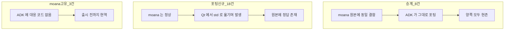

# ADK·`moana` 코드 결함 인벤토리 — r1 보강

**이 문서가 답하는 질문: ADK 를 출시 가능한 상태로 만들려면 무엇을 고쳐야 하는가.**

> **전제 — 재논의 대상이 아니다**: **ADK 는 진행이 확정된 프로젝트다.** 대안 선택지는 없다. 따라서 이 문서는 **채택 여부의 근거가 아니라 진행 중에 처리할 작업 목록**이다. 결함 건수는 "다시 생각해 볼 이유"가 아니라 **완료 조건의 일부**다.

> **기준일 2026-08-02.** 대상 = `sonex-framework` **ADK**(`sdk/adk/`, 실질 31,464 LOC) + `moana` **`framework/`**(44,007 LOC, `origin/service_QT693` = 최신 개발선).
>
> **범위 밖 둘** — ① **SDK 계층**(`sdk/sdk/`)은 별도 검토가 20건을 확인했고 SOT 는 [code-defects-sdk.md](./code-defects-sdk.md) 다. ② **`moana/app/`**(UI 91파일 + QML 174파일)은 **읽지 않았다** — [r2](../r2/plan.md) 가 살리는 계층이므로 **공백이다**(§10).

## 0. 왜 별도 문서인가

[plan.md](./plan.md) 는 **배치·계약·검증 인프라**를 다루고 §8 에서 *"도메인 로직은 다시 쓰지 않는다"* 고 못박는다. 그 전제는 **"지금 코드는 동작한다"** 였는데, 실제로 읽어 보니 그 전제가 성립하지 않는 지점이 있다.

**결함 수정은 리팩토링이 아니다** — 동작을 보존하는 것이 아니라 바꾸는 것이다. 그래서 Phase 항목에 섞지 않고 별도 축으로 세운다. 다만 **판정 수단은 공유한다** — 아래 전부가 Phase 1 회귀 하니스의 케이스가 된다.

## 1. 검토 방법과 계보 판정

ADK 는 `moana` 를 Qt → std/C++17 로 포팅한 것이다(각 파일 첫 줄 주석이 *"Moana ~의 ADK 포팅"* 이라 명시). 따라서 **같은 결함이 원본에도 있는지**가 판단을 가른다.

| 계보 | 뜻 | 함의 |
|---|---|---|
| **승계** | `moana` 원본에 동일 결함이 있고 ADK 가 그대로 옮김 | 두 코드베이스 **양쪽에 지금 존재**한다. `moana` 폐기로 사라지지 않는다 |
| **포팅 신규** | `moana` 는 정상인데 ADK 포팅 과정에서 생김 | **회귀**다. 원본 대조로 정답이 이미 있다 |
| **`moana` 고유** | ADK 에 대응 코드가 없음 | `moana` 폐기 시 함께 소멸. **출시 전까지는 현역** |

판정은 `git show origin/service_QT693:<원본파일>` 로 **같은 함수를 직접 대조**했다. 대조하지 않은 항목은 계보를 **미판정**으로 남겼다 — 서사로 메우지 않는다.

## 2. 결론

| | 판정 |
|---|---|
| **총 결함** | **39건**(확정만. 스타일·취향 항목은 §8 로 분리) |
| **계보** | 승계 8 · **포팅 신규 18** · `moana` 고유 3 · 혼합 1(S-5) · **미판정 9** |
| **가장 무거운 축** | **데이터 파괴 4건** — 전부 조용히 일어나고 사용자에게 오류가 표시되지 않는다 |
| **`moana` 폐기로 해소되는 것** | **3건뿐**(`moana` 고유). 승계 8건은 ADK 에 그대로 남는다 |

**포팅 신규 18건은 나쁜 소식이 아니라 좋은 소식이다.** `moana` 원본에 **정답이 이미 있다**는 뜻이므로, 설계를 다시 하는 게 아니라 **원본 한 줄을 옮겨오면 끝나는 작업**이다. 실제로 D-2 는 하드코딩 문자열을 변수로 바꾸는 것이고, S-1 은 `http` 를 `https` 로 바꾸는 것이며, F-4 는 주석 처리된 한 줄을 되살리는 것이다. **18건 중 대부분이 이 성격이다.**

**이것이 [plan.md §8](./plan.md) 의 *"기존 동작 보존"* 에 단서 하나를 붙인다** — 보존 기준선은 **ADK 의 현재 동작이 아니라 `moana` 의 검증된 동작**이다. ADK 현재 동작을 그대로 고정하면 회귀 18건을 함께 굳히게 된다.

**Qt 가 가려주던 것이 드러났다.** 그 대표가 C-1 하나로, **9개 조회 함수에 걸쳐 있다.** `QVariant::toString()` 은 NULL 컬럼에서 빈 문자열을 주지만 `std::string s = (const char*)sqlite3_column_text(...)` 는 **정의되지 않은 동작**이다. 포팅이 타입만 바꾸고 그 계약 차이를 메우지 않았다.

> **미판정 9건이 적지 않다.** 원본 대조를 하지 않은 것이며 승계일 수도 신규일 수도 있다. 계보가 확정되지 않아도 **결함이라는 판정 자체는 코드로 확인**했다(§10).

## 3. 데이터 파괴 — 조용히 일어난다

| # | 결함 | 위치 | 계보 |
|---|---|---|---|
| **D-1** | **`UPDATE` 에 `WHERE` 절이 없어 장비 테이블 전 행을 덮어쓴다.** 서버에서 장비 정보를 받을 때마다 실행되며, 등록 장비가 2대 이상이면 나머지 전부가 마지막 장비 값으로 치환되거나 `Serial` PK 충돌로 실패한다 | ADK `HCDataBaseAdapter.cpp:1503-1511` · `moana` `SononDataBaseAdapter.cpp:1315-1322` | **승계** |
| **D-2** | **암호화 키가 영구 소실된다.** `SELECT EncryptKey FROM AppSettings` 인데 실제 테이블명은 **`AppSetting`**(단수). prepare 가 실패해 키 복원이 건너뛰어지고, **바로 다음 줄에서 기존 행을 `DELETE`** 한다. `moana` 는 같은 자리에서 `strAppSetting` 변수를 써서 정상이다 | ADK `HCDataBaseAdapter.cpp:1091` vs `moana` `SononDataBaseAdapter.cpp:1116` | **포팅 신규** |
| **D-3** | **배터리 정보 저장이 장비 레코드를 지운다.** `INSERT OR REPLACE` 에 20개 컬럼 중 5개만 지정. 같은 `Serial` 의 기존 행이 통째로 치환되어 모델·SSID·펌웨어버전·스캔통계 등 15개 컬럼이 NULL 이 된다. `batterySerial` 이 `serial` 과 같은 값으로 매핑되므로(`getDeviceList` 의 `dev.batterySerial = dev.serial`) 실제로 충돌한다 | ADK `HCDataBaseAdapter.cpp:1519-1529` · `moana` `:1330-1341` | **승계** |
| **D-4** | **환자를 삭제해도 영상 파일이 남는다.** `deletePatientByID`·`deleteStudyByUID`·`deleteSnapshotByID` 가 **경로 필드가 빈 DTO** 를 만들어 `Delete*` 에 넘긴다. 그 함수들은 DTO 의 경로로 `remove()` 를 부르므로 `remove("")` 가 되고, DB 행만 지워진 채 Raw·JPG·MP4·DICOM 파일이 디스크에 남는다 | ADK `HCDatabaseHelper.cpp:761-810` | 미판정 |

> **의료정보 삭제 요구(D-4)** 는 규제 축과 직결된다 — DB 상으로는 삭제된 환자의 초음파 영상이 파일시스템에 계속 존재한다.

## 4. 크래시·정의되지 않은 동작

| # | 결함 | 위치 | 계보 |
|---|---|---|---|
| **C-1** | **NULL 컬럼 → `std::string(nullptr)`.** `reinterpret_cast<const char*>(sqlite3_column_text(...))` 를 널 검사 없이 `std::string` 에 대입하는 곳이 **9개 조회 함수**에 있다(`getAppSettings`·`getDeviceList`·`getAllPatient`·`getAllWorkItemInfo`·`getPatientInfo`·`getSnapshotInfoBySnapshotID`·`getStudyInfoByStudyID`·`getUserAppLog`·`getServerAppLog`). `AppSetting`·`PatientInfo` 의 대부분 컬럼에 `NOT NULL` 제약이 없어 정상 데이터로 트리거된다. **같은 파일의 `getPatientInfoDbFromQueryResult` 는 `val ? ... : ""` 로 제대로 막고 있다** — 방어가 절반만 적용됐다 | ADK `HCDataBaseAdapter.cpp` 다수 | **포팅 신규**(`moana` 는 `QVariant::toString()` 으로 널 안전) |
| **C-2** | **미초기화 값 읽기.** `HttpResponse` 는 `int statusCode` 에 초기값이 없는데 `HCNetworkProcess::handleEvent` 는 `HttpResponse response;` 를 선언만 하고, 본문이 비어 있는 case 3개(`RESEND_VERIFY_EMAIL_FIREBASE`·`SEND_PASSWORD_RESET_EMAIL_FIREBASE`·`GET_FIREBASE_USER_PROFILE`)에서 그대로 `callback(command, response.statusCode, ...)` 로 넘긴다 | ADK `HttpRequest.h:44-47` · `HCNetworkProcess.cpp:95,159,170,296,359` | **포팅 신규** |
| **C-3** | **0 나눗셈.** `bytesPerFrame = columns * rows * samplesPerPixel * (bitsAllocated/8)` 를 검사 없이 `length / bytesPerFrame` 에 쓴다. 외부 DICOM 의 해당 태그가 없거나 0 이면(또는 `bitsAllocated < 8` 이면 `/8` 이 0) 정수 0 나눗셈으로 죽는다 | ADK `HCUnifiedDicomAdapter.cpp:1010-1013` | **포팅 신규**(`moana` 에 대응 함수 없음) |
| **C-4** | **DICOM 픽셀 버퍼 밖 읽기.** C-3 직후 `totalFrames <= 0` 이면 **1로 강제**한 뒤 `memcpy(outData, pixelData + frameIndex*bytesPerFrame, bytesPerFrame)` 를 수행한다. `length < bytesPerFrame` 인 파일에서 원본 버퍼를 넘어 읽는다 | ADK `HCUnifiedDicomAdapter.cpp:1013-1028` | **포팅 신규** |
| **C-5** | **힙 버퍼 오버플로.** `malloc((*iter).dataLength * count)` — **첫 프레임 크기 × 개수**로 할당해 놓고, 루프에서는 **각 프레임 자신의 크기**로 `memcpy(finalData + i*(*iter).dataLength, ...)` 를 한다. 프레임 크기가 섞이면(해상도·모드 전환) 오프셋과 총량이 동시에 어긋난다 | ADK `HCUnifiedDicomAdapter.cpp:1080,1104` · `moana` `UnifiedDicomAdapter.cpp:728,761` | **승계** |
| **C-6** | **싱글턴 use-after-free + 플랫폼별 이중 인스턴스.** `hc_destroyDatabaseHelperInstance` 가 `delete` 하면서 static `instance` 를 `nullptr` 로 되돌리지 않아 이후 `getInstance()` 가 해제된 포인터를 준다. 게다가 **Windows 진입점은 `getInstance()`, Android 진입점은 `new DatabaseHelper()`** 로 서로 다른 객체를 만드는데, `isAbsoluteDbPath` 등 static 메서드는 `getInstance()` 쪽을 보므로 **Android 에서는 초기화되지 않은(UserID 가 빈) 인스턴스를 참조**한다 → C-11 을 상시 발동시킨다 | ADK `HCDatabaseHelper.cpp:14-22,817-837` | **포팅 신규** |
| **C-7** | **힙 손상.** `char* buff = new char[size*4]` 직후 `memset(buff, 0, sizeof(*buff))` — **`sizeof(*buff)` 는 1**이라 첫 1바이트만 0이 된다. 나머지는 미초기화 상태이고 곧바로 `strcat` 을 반복하므로 쓰레기 값 안의 널 위치부터 이어붙인다 | `moana` `SononUtils.cpp:215-231` | **`moana` 고유** |
| **C-8** | **널 역참조.** `gethostbyname(host)->h_addr` 를 반환값 검사 없이 역참조 — DNS 실패 시 즉시 크래시 | `moana` `WindowFtpUpload.cpp:99` | **`moana` 고유** |
| **C-9** | **고정 버퍼 오버플로.** `char latestActivationKey[32]`·`char presetName[32]` 에 `sprintf(..., "%s", 외부문자열)`. CVIE 활성화 키·프리셋 이름은 설정/서버에서 오는 외부 입력이다 | `moana` `ContextVision.cpp:307,354,448` | **`moana` 고유** |
| **C-10** | **가변인자 UB.** `Log::debugf("%s,Failed to read all rows: %s ", sqlite3_errmsg(db))` — 포맷 지정자 2개에 인자 1개. 두 번째 `%s` 가 스택 쓰레기를 포인터로 읽는다 | ADK `HCDataBaseAdapter.cpp:330` | **포팅 신규** |
| **C-11** | **`UserID` 가 비면 모든 상대경로가 절대경로로 판정된다.** `isAbsoluteDbPath` 의 구현이 `path.find(userID) != npos` 인데 `userID` 가 빈 문자열이면 `find("")` 는 **0을 반환**하므로 항상 참이다. 초기화 전 호출·C-6 경로에서 발동 | ADK `HCDatabaseHelper.cpp:119-124` · `moana` `DataManager.cpp:267-272` | **승계** |
| **C-12** | **무가드 예외.** `std::stoi(paramMap.at("total_size"))` 계열 — 키 부재는 `out_of_range`, 파싱 실패는 `invalid_argument` 를 던지는데 워커 스레드 핸들러에 `try` 가 없다. `check_firmware` 는 `p.at()` 을 6번 연속 호출한다 | ADK `HCNetworkProcess.cpp:233-234` · `HCNetworkController.cpp:474-483` | **포팅 신규** |

## 5. 보안·개인정보

| # | 결함 | 위치 | 계보 |
|---|---|---|---|
| **S-1** | **클라우드 API 전체가 평문 HTTP.** `base_url = "http://sonex.healcerion.com:8080/API/"` — 로그인·회원가입·비밀번호 변경·프로필 조회가 전부 이 경로다. **`moana` 는 같은 기능이 전부 `https://`** 였다 | ADK `HCNetworkProcess.cpp:17` vs `moana` `SononCloud.cpp:9-10,1320` | **포팅 신규(회귀)** |
| **S-2** | **평문 비밀번호가 로그에 남는다.** `CHANGE_PASSWORD` 는 **해시하기 전에** `paramMap` 전체를 순회 출력한다(`cur_pw`·`new_pw` 평문). 해시 후 값도 별도로 출력한다. `moana` 에는 대응 로그가 없다 | ADK `HCNetworkProcess.cpp:322-325,330,337` (그리고 `:107,131,304`) | **포팅 신규** |
| **S-3** | **복호화된 레코드 헤더가 평문 파일로 쌓인다.** `review_dbg.txt` 를 **현재 작업 디렉터리에 append** 하며 복호화 평문의 앞뒤 80자를 기록한다. 코드 주석이 스스로 *"정리 대상"* 이라 적고 있다. 파일 크기 상한도 삭제 시점도 없다 | ADK `HCRecordFileReader.cpp:152-160,171-172` | **포팅 신규(진단 코드 잔류)** |
| **S-4** | **zip 엔트리 경로 무검증.** `path = destination + reader->file_info->filename` 로 대상 경로를 만든다 — 아카이브 안 이름에 `../` 가 있으면 대상 폴더 밖에 쓴다. **같은 파일의 다른 두 해제 경로는 `mz_path_resolve` 로 정규화한다** — 펌웨어 해제 경로만 빠졌다 | ADK `ZipUtil.cpp:409` | **포팅 신규** |
| **S-5** | **DB 암호화 키가 소스에 하드코딩**(PBKDF2 password·salt 리터럴)되어 전 설치본이 동일하고, **검증 실패 시 비암호화 DB 로 폴백**해 계속 진행한다 | ADK `HCDatabaseCrypto.cpp:30-31` · `HCDataBaseAdapter.cpp:170-186` | **승계**(키) + **포팅 신규**(폴백) |
| **S-6** | **셸 인젝션 + Windows 미동작.** `system("rm -rf '" + path + "'")` — 경로에 작은따옴표가 있으면 명령이 갈라진다. 그리고 iOS 만 `std::filesystem` 분기이고 **Windows 가 `#else` 쪽에 들어가** `rm` 을 실행한다(항상 실패) | ADK `HCDataBaseAdapter.cpp:1172-1183` | **포팅 신규** |
| **S-7** | **비밀번호 버퍼 40바이트 고정.** 40자 초과 시 `strcpy_s`(MSVC) 는 **런타임 중단**, `strncpy`(그 외) 는 **조용히 자름** — 같은 입력이 Windows 에서는 크래시, Android 에서는 잘못된 키로 압축된다 | ADK `ZipUtil.cpp:208-215,302-309,460-467` | 미판정 |

> S-5 의 fail-open 폴백은 [phase0-build-reproducibility.md](./phase0-build-reproducibility.md) **Step 0-C-W** 에 이미 기록돼 있다. 여기서는 **호출부에도 같은 폴백이 한 겹 더 있다**는 사실을 더한다 — `applyEncryption()` 이 false 를 반환해도 `Open()` 이 비암호화 접근을 재시도해 성공하면 그대로 진행한다.

## 6. 기능 결손·정합

| # | 결함 | 위치 | 계보 |
|---|---|---|---|
| **F-1** | **DICOM 파일 태그 갱신이 통째로 주석 처리된 껍데기다.** `updateDicomFile()` 본문이 전부 주석이고 `Log::debugf("DICOM file update placeholder")` 만 실행된다. 환자 ID·이름을 수정하면 **DB 는 바뀌고 DICOM 파일 안의 `PatientID`·`PatientName` 은 그대로** 남아 PACS 전송 시 불일치한다. `UpsertStudyInfo` 의 StudyDate/StudyTime 추출도 같은 형태의 껍데기다 | ADK `HCDatabaseHelper.cpp:394-462,723-759` | **포팅 신규(미구현)** |
| **F-2** | **SQL 이스케이프가 필드마다 다르다.** `UpsertSnapshotInfo`·`UpdateSnapshotInfo` 는 경로 3개만 `escapeQuotes` 하고 `SnapshotName`·`StudyInstanceUID`·`Mp4Type`·`Playtime` 은 날것으로 잇는다. 아포스트로피가 든 이름 하나로 쿼리가 깨진다. **바로 옆 `getAllStudyInfoByPID` 는 `sqlite3_bind_text` 를 쓴다** — 한 파일 안에 두 방식이 공존한다 | ADK `HCDataBaseAdapter.cpp:397-400,422-427,554,864` | **승계** |
| **F-3** | **이스케이프가 호출자 객체를 오염시킨다.** `escapeSingleQuote(appSettings->Email)` 가 인자를 **in-place 수정**한다. 같은 객체로 두 번 저장하면 `''` → `''''` 로 증식한다 | ADK `HCDataBaseAdapter.cpp:1066-1087` · `moana` `SononDataBaseAdapter.cpp:1104-1111` | **승계** |
| **F-4** | **신규 장비의 `updateTime` 이 항상 0.** `moana` 는 신규 등록 시 `currentMSecsSinceEpoch()` 를 넣는데 ADK 는 **그 줄을 주석 처리**했고, 호출 경로인 `SetServerDeviceFromMap` 은 `updateTime` 을 설정하지 않는다 | ADK `HCDataBaseAdapter.cpp:1514` vs `moana` `:1327` | **포팅 신규(회귀)** |
| **F-5** | **다운로드가 HTTP 상태코드를 보지 않는다.** `CURLOPT_FAILONERROR` 미설정이고 `curl_easy_perform` 의 반환값만 검사하므로 **404 응답 본문이 펌웨어 파일로 저장**되고 성공으로 보고된다 | ADK `HCHttpClient.cpp:195-218` | 미판정 |
| **F-6** | **GET 만 타임아웃이 없다.** POST·PUT·DELETE 는 `SetTimeout` 을 부르는데 `get()` 은 부르지 않는다. 버전 확인(`CHECK_UPDATE_VERSION`)이 이 경로다 | ADK `HCHttpClient.cpp:59-77` | **포팅 신규** |
| **F-7** | **`case` 관통.** `UPDATE_SOFTWARE` 가 `break` 없이 `CHECK_UPDATE_VERSION` 으로 떨어져 소프트웨어 갱신 요청이 버전 조회를 수행한다 | ADK `HCNetworkProcess.cpp:220-226` | **포팅 신규** |
| **F-8** | **레코드 헤더의 read/write 필드가 비대칭이다.** `PresetName`·`ProbeType` 은 읽지만 쓰지 않고, `Frame` 의 `Width`/`Height` 는 B 프레임에서 쓰이지 않는다. 읽어서 다시 쓰는 경로(백업·변환)에서 그 값이 소실된다 | ADK `HCRecordFileFrameHeader.cpp:47-108` | 미판정 |
| **F-9** | **iOS 전용 raw socket 경로가 HC 패킷을 직접 조립한다.** 체크섬 필드가 `0x00,0x00` 고정이고, B-모드 파라미터 12종이 전부 하드코딩 상수(focus 4·CVIE on·strength 3 …)라 사용자 설정을 반영하지 않는다 | ADK `HCSonexSDK_iOS.cpp:313-330,395-420` | **포팅 신규** |
| **F-10** | **덮어쓰기 거부가 성공으로 보고된다.** `if (err_cb != MZ_OK) return err;` — 반환해야 할 것은 `err_cb` 인데 `err`(=`MZ_OK`)를 준다 | ADK `ZipUtil.cpp:758-763` | 미판정 |

## 7. 자원 누수

| # | 결함 | 위치 | 계보 |
|---|---|---|---|
| **L-1** | 파일 변환 실패 시 `return -20000` 으로 즉시 빠져나가 **zip writer 를 닫지도 해제하지도 않는다.** 열린 핸들과 부분 zip 파일이 남는다 | ADK `ZipUtil.cpp:244-247` | 미판정 |
| **L-2** | `parseRequest` 진입 즉시 `new nlohmann::json()` 을 만들지만 대부분의 분기가 이를 쓰지 않고 다른 경로로 반환한다. 한 분기는 **같은 이름으로 다시 `new`** 해 바깥 것을 가린다 | ADK `HCNetworkController.cpp:526-551` | 미판정 |
| **L-3** | `makeDicomImage` 의 `break` 경로에서 **남은 프레임들의 `data` 가 해제되지 않은 채** `imageDataList.clear()` 로 포인터만 사라진다 | ADK `HCUnifiedDicomAdapter.cpp:1100-1106,1185` | **승계** |
| **L-4** | **널 종료 없는 `strncpy`.** iOS 해제 경로만 `sizeof(utf8_name)` 를 그대로 넘긴다 — 바로 위 non-iOS 경로는 `-1` 후 수동 종료를 한다. 256바이트를 채운 파일명에서 버퍼 밖을 읽는다 | ADK `ZipUtil.cpp:659` · `moana` `ZipUtil.cpp:421` | **승계** |
| **L-5** | 오디오 프레임을 `new` 로 복사해 큐에 쌓지만 **소비하는 인코딩 경로가 `TODO` 로 비어 있다.** 정리는 종료 시점에만 일어나므로 녹화가 길어질수록 단조 증가한다 | ADK `HCVideoEncoder.cpp:846-864` | 미판정 |
| **L-6** | 다운로드 진행률 상태가 **클래스 static 변수 3개**(`downloadedSum`·`prevFileDLNow`·`lastChunk10Pct`)라 동시 다운로드가 서로의 진행률을 덮어쓴다 | ADK `HCHttpClient.cpp:15-20,296-331` | 미판정 |

## 8. 위생 — 결함은 아니나 같은 뿌리

| 항목 | 위치 |
|---|---|
| 개발자 개인 절대경로가 코드에 박혀 있다 — `/Users/Chris/Documents/b-frame/…` | `moana` `AmbulanceManager.cpp:358,447` · `ScanContext.cpp:742` |
| 백업 사본이 저장소에 커밋돼 있다 — `SononDataBaseAdapter.cpp.backup` | `moana` `framework/Database/` |
| 같은 `ALTER TABLE` 을 두 줄 연속 호출(복붙 흔적) | ADK `HCDataBaseAdapter.cpp:208-209` |
| 로거와 `std::cerr`·`std::cout` 이 한 파일에 혼재 — 모바일에서 후자는 사라진다 | ADK `HCDataBaseAdapter.cpp` 다수 · `HCDatabaseHelper.cpp:233` |
| 주석 처리된 코드 블록이 함수 본문의 다수를 차지 | ADK `HCDatabaseHelper.cpp:394-476,723-759` |

## 9. 계획 반영

### 9.1 이 결함들은 어느 Phase 에 붙는가

| 결함군 | 처리 위치 | 이유 |
|---|---|---|
| **D-1~D-4**(데이터 파괴) · **C-1~C-2,C-10~C-12** | **Phase 1 과 병행 — 별도 축 `X`**(§9.2) | 회귀 하니스가 서기를 기다릴 수 없다. 지금 데이터가 깨지고 있다 |
| **S-1~S-3**(전송·로그·진단 파일) | **Phase 1 착수 시 즉시** | 코드 한 줄~수 줄 수준이고 회귀 위험이 없다 |
| **C-3~C-5,L-3**(DICOM) | Phase 1-G 케이스 확보 후 | `DicomHandler` 는 [phase1 Step 1-G](./phase1-regression-baseline.md) 의 GL·소켓 무의존 6모듈에 이미 포함돼 있다 |
| **C-6**(싱글턴 수명) | **Phase 3-E** 에 흡수 | 3-E 가 이미 `hc_create*Instance` 계열 28건의 C ABI 수명을 다룬다 — 같은 표면이다 |
| **F-9**(iOS raw socket) | **Phase 3-D** 에 흡수 | 3-D 가 이미 이 파일의 실사용 여부 확인을 선행 조건으로 걸어 뒀다. **미사용이면 삭제로 해소된다** |
| **S-5**(암호화 폴백) | **Phase 0-C-W** 에 흡수 | 이미 기록된 항목의 범위를 호출부까지 넓힌다 |
| **F-1**(DICOM 껍데기) | **Phase 6-F** 지원 경계 문서화와 함께 | 판정 7b(*"빈 API 부재"*)의 실제 사례다 |
| **C-7~C-9**(`moana` 고유) | **처리하지 않는다** | 폐기 대상. 다만 **출시 전까지 현역**이므로 §9.3 |

### 9.2 새 축 — `X` 결함 수정

**Phase 번호를 주지 않는다.** Phase 는 선행 관계가 있는 순차 축인데 이것은 그 축과 직교한다 — 아무 Phase 에서나 발생할 수 있고, 회귀 하니스가 서기 전에도 착수해야 하는 항목이 있다.

**여섯 항목 중 넷(X-1·X-2·X-3·X-6)이 선행 조건 없이 지금 착수 가능하다.** 빌드가 서기를 기다리는 것은 X-4·X-5 뿐이다.

| 항목 | 내용 | 선행 |
|---|---|---|
| **X-1** | **데이터 파괴 4건 정지** — D-1(WHERE 절)·D-2(테이블명)·D-3(부분 UPSERT)·D-4(파일 잔존). 넷 다 수정 자체는 국소적이나 **이미 손상된 데이터의 복구 여부는 별개 판단**이다(힐세리온 확인 필요) | 없음 |
| **X-2** | **널 안전성 일괄 정정** — C-1 의 9개 함수. 같은 파일에 이미 있는 `val ? ... : ""` 패턴을 전면 적용하거나, 조회 헬퍼 하나로 감싼다 | 없음 |
| **X-3** | **전송·로그 보안 3건** — S-1(HTTPS 전환, 서버 측 지원 확인 필요)·S-2(비밀번호 로그 제거)·S-3(진단 파일 제거) | S-1 은 백엔드 확인 |
| **X-4** | **입력 검증** — C-3·C-4(DICOM 치수)·C-12(무가드 변환)·S-4(zip 경로 정규화). **외부 입력이 들어오는 지점 전수**가 대상이다 | 1-G 케이스 |
| **X-5** | **회귀 케이스화** — X-1~X-4 각 건에 **결함을 재현하는 실패 케이스를 먼저 쓰고** 고친다. 이것이 [§3.2](./plan.md) 규칙(*"바꾸기 전에 동작을 고정하는 케이스"*)의 이 축 버전이다 | 1-A |
| **X-6** | **포팅 회귀 18건을 원본 참조로 정정** — 각 건마다 `moana` 원본이 정답이므로 **설계 판단 없이 옮겨오면 된다.** 이 축에서 가장 값싼 항목이다. **의도된 변경인지 확인이 필요한 것은 S-1 하나뿐**(HTTPS→HTTP 가 서버 구성 때문인지) | 없음(S-1 만 백엔드 확인) |

### 9.3 `moana` 의 위치 — r2 가 답을 이미 갖고 있다

[plan.md §7](./plan.md) 의 이전 표기는 *"폐기 대상. 무관"* 이었으나, `moana` 소관은 [r2/plan.md](../r2/plan.md) 로 옮겨졌다 — **`app/`(UI)은 살리고 `framework/` 는 폐기**한다. 이 검토 결과는 그 구분선과 정확히 맞물린다.

| 역할 | 판정 |
|---|---|
| **결함 판정 기준선** | **그렇다** — ADK 결함 36건 중 **18건이 `moana` 대조로만 회귀임이 드러났다.** SDK 쪽 검토도 같은 방법으로 치명 결함 1건을 확정했다([code-defects-sdk.md](./code-defects-sdk.md)) |
| **`moana` 고유 3건**(C-7·C-8·C-9) | **r2 로 자동 소멸한다** — 셋 다 `framework/Common`·`framework/Network`·`framework/ContextVision` 소속이고 [r2 §2.3](../r2/plan.md) 이 `framework/` 전체를 폐기 대상으로 명시한다. **별도 수정 항목을 세우지 않는다** |
| **출시 전 현역** | **그렇다** — r2 완료 전까지 `moana` 는 배포 중이고 셋은 실재하는 크래시 경로다. **"고치지 않는다"는 판단이지 "위험하지 않다"가 아니다** |
| **ADK 결함이 새 앱의 결함이 된다** | **그렇다** — r2 는 `moana/app/` 을 ADK 위에 얹는다. **[r2 Phase 4](../r2/plan.md)(`*Db` 337회 · `CDataManager` 256회 → ADK)의 목적지가 §3 데이터 파괴 4건이 있는 계층**이다. X-1 이 그 전에 끝나야 한다 |

> **r2 Phase 4-4 와 직결된다.** 그 항목은 *"기존 출하 DB 호환을 확인한다"* 이고 SOT 로 [../../review/client-database.md](../../review/client-database.md) 를 든다. **호환 확인의 대상 코드가 D-1~D-3 을 갖고 있다** — DDL 대조만으로는 잡히지 않는다. 스키마는 맞는데 **쓰는 쪽이 틀렸기** 때문이다.

## 10. 이 검토의 한계

- **정적 판독이다.** 코드를 읽어 판정했을 뿐 **실행해 재현하지 않았다.** 빌드가 서지 않아([phase0](./phase0-build-reproducibility.md)) 실행 확인 수단이 아직 없다. X-5(회귀 케이스화)가 그 확인이다
- **전수가 아니다.** ADK 는 주요 모듈 6개의 핵심 경로를 읽었고, `moana` 는 **ADK 대응 영역**(`framework/`의 Database·Network·Dicom·Record)과 위험 패턴 스캔에 한정했다. `moana` 44,007 LOC 전체 정독이 아니다
- **`moana/app/` 을 읽지 않은 것이 가장 큰 공백이다.** 이 검토는 `framework/`(= r2 가 **폐기**하는 계층)만 봤고, **r2 가 살리는 `app/`(UI 91파일 + QML 174파일·85k LOC)은 한 줄도 보지 않았다.** 결함 판정의 무게가 정확히 반대로 실린 셈이다 — 없어질 코드는 검토했고 남을 코드는 안 했다. **`moana/app/` 결함 검토는 별도 과제로 남는다**
- **`sdk/sdk/`(SDK 계층)는 범위 밖이다** — 별도 검토가 20건 확인, SOT = [code-defects-sdk.md](./code-defects-sdk.md)
- **미판정 9건**은 원본 대조를 하지 않은 것이다. 승계일 수도 신규일 수도 있으며, 그 사실을 그대로 남긴다
- **심각도는 코드 경로 기준**이다. 실제 발생 빈도는 사용 패턴에 달렸고 그것은 측정하지 않았다

## 11. cross-reference

- [plan.md](./plan.md) — r1 실행 계획. **§3.1b(축 `X`)** · §3.2(선행 케이스 규칙) · §7(다루지 않는 것) · §8(유지/변경 축)
- [code-defects-sdk.md](./code-defects-sdk.md) — **SDK 계층 결함 20건.** 같은 축의 다른 절반이다
- [../r2/plan.md](../r2/plan.md) — `moana` UI → SDK/ADK 이관. **§2.3**(무엇이 남고 사라지는가) 이 `moana` 고유 3건의 처리 근거 · **Phase 4** 가 데이터 파괴 4건의 소비처
- [../../review/client-database.md](../../review/client-database.md) — `moana`↔ADK DB DDL 대조. §9.3 의 단서(스키마가 아니라 쓰는 쪽이 틀렸다)가 여기에 걸린다
- [phase0-build-reproducibility.md](./phase0-build-reproducibility.md) — Step 0-C-W(DB 암호화 엔진·fail-open 폴백)
- [phase1-regression-baseline.md](./phase1-regression-baseline.md) — Step 1-G(초기 케이스 인벤토리, `DatabaseHelper` 20 · `DicomHandler` 6 포함)
- [../../review/sonex-framework.md](../../review/sonex-framework.md) — 구조 실측 SOT
- [../../review/cybersecurity.md](../../review/cybersecurity.md) — 보안 축. S-1~S-6 이 그 실코드 사례다
