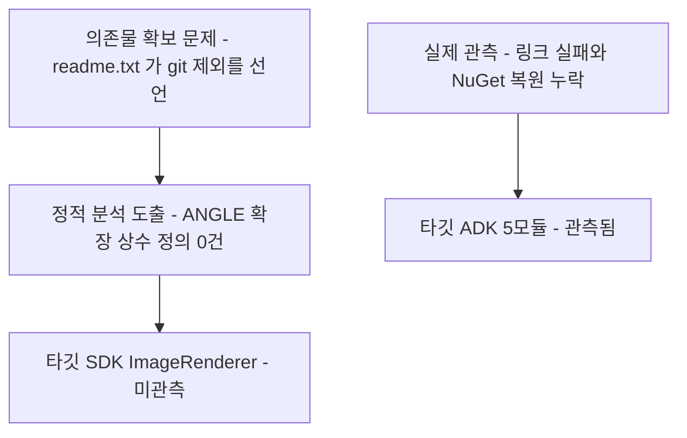
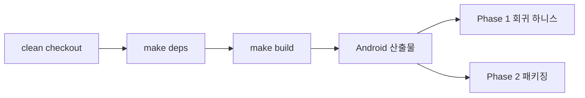

# Phase 0 — 빌드 재현성 (B1)

> **상태**: **0-B·0-C·0-D·0-E·0-F(F-1·F-2·F-3·F-5·F-6)·0-G·0-H·0-I(I-1·I-2)·0-J·0-K(K-1·K-2·K-4·K-5)·0-L(L-1·L-2) 완료.** 2026-08-02 커밋 `9ccf8f9b`·`d2d0f006`·`f395c0af`·`938181be`·`19d1880f`·`c389bfdb`·`614a2337`·`e942bb32`·`6cc350d1`·`db77cf03`. **남은 것 = 0-A**(Android·iOS ANGLE 자체 빌드) · **0-F(F-4)** · 0-K(K-3·K-6·K-7) · 0-L(L-3~L-6) · 0-M
> **`[관측 2026-08-02]` Android 와 Linux 가 둘 다 실제로 빌드된다** — Android = §1.10(드라이버 결함 4건 수정 후 통과) · Linux = [0-L](#step-0-l-platformlinux-신설--l-1l-2-완료2026-08-02-c389bfdb)(`#include` 8줄 보강 후 통과). 이 phase 의 최대 미확인("SDK 타깃이 실제로 어디서 막히는지 관측된 적이 없다")이 해소됐고, **두 플랫폼 모두 막은 것은 서드파티가 아니라 빌드 스크립트와 헤더 위생이었다.**
> **범위**: `sonex-framework`(SDK+ADK)가 **깨끗한 체크아웃에서 문서화된 절차만으로** 빌드되게 한다. 코드 계층·API 계약은 건드리지 않는다 — 이 phase 가 바꾸는 것은 **의존물 확보·경로 선언·빌드 진입점·저장소 위생**뿐이다.
> **선행**: 없음 (0-0 저장소 재배치가 이 phase 의 첫 항목)
> **후행**: [Phase 1](./phase1-regression-baseline.md)
> **근거**: [plan.md](./plan.md) Phase 0 · [goal.md B1](../goal.md) · 판정 SOT = [gap.md §3·§5](../gap.md) · 실측 SOT = [../../review/sonex-framework.md §1·§7](../../review/sonex-framework.md)
> **실측 기준**: `master` `f336e25b`(2026-07-23), 로컬 HEAD == `origin/master`, 마지막 fetch 2026-07-27. 이 문서의 신규 실측은 2026-07-30 에 `client/legacy/sonex-framework` 에서 직접 측정했다.
> **작업 사본**: `client/sonex-framework`, 작업 브랜치 = **`refactor/r1`**(2026-07-31 생성, fork base `master`). 브랜치명은 우리 내부 결정 사항 — 힐세리온 협의 대상이 아니다(§2 Step 0-0 참조).

---

## 1. 배경

### 1.1 "빌드 불가"는 한 가지 사실이 아니다 — 층위가 셋이고, 서로 다른 타깃이다

[gap.md §5](../gap.md)·[plan.md §1](./plan.md) 이 두 층위(정적 분석 vs 실제 관측)를 이미 갈라 놨다. **여기에 세 번째가 붙고, 그보다 중요한 사실이 하나 더 있다 — 두 층위가 같은 실패의 경쟁 설명이 아니다.**

| 층위 | 내용 | 대상 타깃 |
|---|---|---|
| ① **의존물 확보 문제** | `sdk/third_party/readme.txt` 가 *"Actual files are excluded from git"* 로 angle·freetype2·opencv 를 **외부 의존물로 선언**한다. 없는 것이 정상이며 **코드 결함이 아니다** | 전 플랫폼 |
| ② **정적 분석 도출** | `EGL_PLATFORM_ANGLE_*` 정의가 저장소에 0건 — 소비처 `HCImageRenderCore.cpp`(13곳)뿐이고 번들 `glad_egl.h` **3벌 전부 0건** | **SDK `ImageRenderer`** |
| ③ **실제 관측** | 커밋된 `build_adk_arm64_log1.txt`(408줄)의 실패 = **링크**(`ld: error: unable to find library -lSonexCommon`, 3건)와 **NuGet 복원 누락**(`NETSDK1004`, 2건) | **ADK 5모듈** |

`[신규 실측]` **그 로그는 `ImageRenderer` 를 빌드한 적이 없다.**

```bash
grep -aoE 'sdk\\(adk|sdk)\\[A-Za-z_]+\\' build_adk_arm64_log1.txt | sort -u
#  -> sdk\adk\{BackupReadWriter,DatabaseHelper,DicomHandler,NetworkProcess,VideoEncoder,sample,workspace}
grep -ac 'ImageRenderer' build_adk_arm64_log1.txt   # -> 0
```



**귀결**: ②와 ③은 **각각 다른 타깃의, 서로 무관한 실패**다. ANGLE 을 확보해도 ③은 그대로 남고, ③을 고쳐도 ②는 그대로 남는다. [plan.md](./plan.md) 의 *"실제로 빌드를 한 번 돌려 실패 지점을 눈으로 확인"* 은 **최소 두 번**(SDK 타깃 · ADK 타깃) 돌려야 한다.

### 1.2 관측된 ADK 실패는 서드파티가 아니라 빌드 순서다

`[신규 실측]` 로그를 줄 번호로 읽으면 원인이 확정된다.

| 줄 | 내용 |
|---:|---|
| 225 · 273 · 291 | `ld: error: unable to find library -lSonexCommon` (DicomHandler · NetworkProcess · VideoEncoder) |
| **358** | `android.vcxproj -> …\_out\ARM64\bin\Release\libSonexCommon.so` |

**필요로 하는 쪽이 먼저 링크되고, 필요한 산출물은 그 뒤에 생긴다.** `sdk/common/android/android.vcxproj` 는 실재하고 빌드도 성공한다 — 빠진 것은 라이브러리가 아니라 `framework.sln` 의 **프로젝트 간 의존 선언**이다.

> **판단 영향**: 0-A·0-B(ANGLE)는 ADK 빌드를 열지 못한다. 이 층을 맡는 것은 **0-F(빌드 진입점 통일)** 이고, 진입점은 모듈 의존 순서를 반드시 표현해야 한다.

### 1.3 ANGLE — 선언 5곳, 대소문자까지 어긋나고, 회수 가능성이 플랫폼마다 다르다

| # | 선언 위치 | 선언 경로 | 표기 |
|---|---|---|---|
| 1 | `sdk/third_party/readme.txt` | `third_party/angle/out/{android_v7a,v8a,x64,ios_arm64,ios_x64,windows_x64}` | 소문자 |
| 2 | `sdk/sdk/Main/ios/CMakeLists.txt:111,134` | `${SDK_ROOT}/../adk/library/angle_ios/lib{EGL,GLESv2}.xcframework/…` | 소문자 |
| 3 | `sdk/sdk/Main/macos/CMakeLists.txt:101,120` | `${SDK_ROOT}/../third_party/angle{,_macos}/…` | 소문자 |
| 4 | `sdk/sdk/ImageRenderer/android/android.vcxproj` | include `third_party\Angle\include\` · lib `third_party\angle\out\…` | **대문자·소문자 혼재** |
| 5 | `sdk/sdk/ImageRenderer/windows/windows.vcxproj` | `third_party\angle\{include,out\windows_x64}\` | 소문자 |

**4번은 한 파일 안에서 갈린다** — include 는 `Angle`, library 는 `angle`. 대소문자 구분 파일시스템(Linux CI·컨테이너)에서 둘 중 하나가 반드시 깨진다.

`[신규 실측]` **여섯 번째 선언이 커밋된 빌드 캐시 안에 얼어 있다** — `sdk/sdk/Main/macos/build/CMakeFiles/SonexSDK.dir/link.txt` 가 `/Users/rio/work/sonex-framework/sdk/sdk/Main/../../../third_party/angle_macos/libEGL.framework/libEGL` 을 절대경로로 박아 두었다. **0-E 가 이 한 건을 부수 효과로 없앤다.**

`[신규 실측]` **ANGLE 바이너리는 tracked·untracked 어디에도 0건이다.**

```bash
git ls-files | grep -icE 'libEGL|libGLESv2'                 # -> 0
find . -iname 'libEGL*' -o -iname 'libGLESv2*' | grep -v '^./.git/'   # -> (없음)
```

`[신규 실측]` **회수 가능성이 4갈래로 갈린다 — 저장소가 iOS 만 알고 있다.**

| 플랫폼 | 저장소 안의 출처·리비전 |
|---|---|
| **iOS** | **회수 가능** — `docs/sdk/IOS_TODO.md:1460,1465,2884` 이 `celestiamobile/angle-apple` **v1.1.26** prebuilt, 자산명(`libEGL.xcframework.zip` 384KB · `libGLESv2.xcframework.zip` ~22MB), 실행 검증 결과(`OpenGL ES 3.0.0 (ANGLE 2.1.0.)`)까지 기록. `Main/ios/CMakeLists.txt:105` 주석도 같은 내용 |
| Windows · Android · macOS | **0건** — 빌드 스크립트·문서 어디에도 출처·리비전 없음 |

> **0-A 의 실제 크기가 여기서 정해진다.** 사람에게 물어야 하는 것은 **3개 플랫폼**이고, iOS 는 저장소가 답을 갖고 있다. 다만 iOS 출처가 **개인 커뮤니티 포크**라는 공급망 리스크는 그대로다([gap.md §3.3](../gap.md)).

### 1.4 선언된 서드파티 버전이 세 갈래다

`[신규 실측]` opencv 하나만 봐도 저장소가 세 가지 버전을 동시에 말한다.

| 선언처 | opencv | freetype |
|---|---|---|
| `sdk/third_party/readme.txt` | **4.9.0** (android-sdk · ios-framework · windows) | 2.11.1(android) · 2.13.2(ios·windows) |
| 디스크 `sdk/adk/library/` | **3.4.5_msvc64** · **3.4.6_android** | (없음) |
| `sdk/sdk/Main/macos/CMakeLists.txt:99` | **Homebrew 4.12.0_11** | Homebrew `/opt/homebrew/opt/freetype` |

그리고 **Android vcxproj 가 freetype 의 *Windows* 바이너리 include 를 참조한다** — `sdk/sdk/ImageRenderer/android/android.vcxproj:157` 의 `third_party\freetype2\freetype-windows-binaries-2.13.2\include\`. 헤더만 쓰므로 동작할 수는 있으나, **선언이 의도를 표현하지 못한다.**

> 이것이 0-C 가 "경로를 하나로 모으는 일"이 아니라 **"어느 버전이 정본인지 먼저 정하는 일"** 인 이유다.

### 1.5 빌드 진입점 — 툴체인 4갈래, 드라이버 15개, 그중 10개가 머신에 박혀 있다

| 툴체인 | 진입점 | 수 |
|---|---|---:|
| MSBuild | `.vcxproj` (+ `sdk.sln`·`framework.sln`) | **29** (sln 2) |
| CMake | `CMakeLists.txt` (macOS/iOS SDK + Android 샘플 2) | **4** |
| Xcode | `*.xcodeproj/project.pbxproj` | **9** |
| `ndk-build` | `sdk/sdk/build_all_android.sh` 가 `Android.mk` 를 `cat > Android.mk << 'EOF'` 로 **인라인 생성**(`:67,115`) | — |

`[신규 실측]` 그 위에 **자체 빌드 드라이버 스크립트가 15개**(서드파티·샘플 제외)이고, **10개가 개발자 머신 경로에 고정돼 있다.**

| 절대경로 | 건수 | 위치 |
|---|---:|---|
| `cd /d C:\work\flutter\sonex-framework` | **5** | `build_sdk.bat:3` · `build_windows_only.bat:3` · `build_windows_sdk.bat:3` · `rebuild_devicemanager.bat` · `rebuild_sdk_full.bat` |
| `SDK_ROOT="/Users/rio/work/sonex-framework/sdk"` | **3** | `sdk/sdk/build_all_android.sh:13` · `build_direct_android.sh:11` · `build_modules_android.sh:12` |
| `/Users/rio/work/…` 헤더 목록 | **1**(6줄) | `sdk/sdk/fix_ios_exports.sh:9-14` |
| `/opt/homebrew/…` | **1**(7줄) | `sdk/sdk/Main/macos/CMakeLists.txt:98,99,114-118` |
| `build_imagefilter.bat` | 1(2건) | |

> **이것이 B1 판정을 직접 막는다.** [gap.md §5.2](../gap.md) 는 *"Android 가 가장 가깝다"* 고 판정했는데, **그 Android 빌드 드라이버 3개가 전부 `/Users/rio/…` 에 묶여 있다.** 즉 성공 판정(제3의 깨끗한 머신에서 Android 빌드)은 **0-C(의존물)보다 0-D(절대경로)가 먼저 풀려야** 시도조차 된다.
>
> 반대로 `build_adk.bat` · `build_sdk_macos.sh` · `build_universal_sdk.sh` · `copy_dependencies.bat` · `deploy_android_jnilibs.sh` **5개는 이미 상대경로다** — 남은 10개를 이 형태로 맞추는 것이 0-D 의 내용이고, 저장소 안에 본보기가 있다.

### 1.6 커밋된 빌드산출물이 두 곳이고, 어느 쪽도 `.gitignore` 가 덮지 않는다

`[신규 실측]` 알려진 한 곳이 아니라 둘이다.

| 위치 | tracked | 내용 |
|---|---:|---|
| `sdk/sdk/Main/macos/build/` | **194** | `.o` 82 · `.d` 80 · `.cmake` 8 · `Makefile` 계열 · `.framework` 심볼릭 구조. **디스크엔 191** |
| **`sdk/sdk/DeviceManager/android/`** | **28** | `CMakeCache.txt` · `CMakeFiles/` 26 · `Makefile` · `cmake_install.cmake`. 같은 폴더의 소스 8파일과 **섞여 있다** |

**둘 다 `.gitignore` 규칙이 아예 없다.**

```bash
git check-ignore -v sdk/sdk/Main/macos/build/CMakeCache.txt        # exit 1 (미커버)
git check-ignore -v sdk/sdk/DeviceManager/android/CMakeCache.txt   # exit 1 (미커버)
```

이는 `sdk/adk/library/`(2,600파일)의 상황과 **다른 문제**다 — 그쪽은 규칙이 있으나 추적 뒤에 추가돼 소급되지 않는 것이고, 이쪽은 **규칙 자체가 없다.** 따라서 0-E 는 `git rm --cached` 와 **규칙 신설**을 함께 해야 한다.

`[신규 실측]` 커밋된 빌드 로그도 같은 계열의 구멍이다 — `.gitignore` 는 `build_*_log{,2,3,4,5}.txt` 를 열거하는데 **`log1` 규칙만 없어서** `build_adk_arm64_log1.txt` 가 통과했다(`git check-ignore` exit 1). `.gitignore` 는 101줄이고 `build_*_log.txt` 가 **두 번**(25행·47행) 들어 있다 — 사고마다 한 줄씩 덧붙인 목록이다.

### 1.7 `HCCommon.h` 4벌 — macOS 갈래는 빌드시스템이 매크로를 주입해야만 성립한다

| 경로 | md5 | macOS 갈래 |
|---|---|---|
| `sdk/include/HCCommon.h` | `7b04c5df` | **있음** (`#define OS_MACOS` 3회 + `#elif defined(OS_MACOS) && OS_MACOS`) |
| `sdk/common/shared/HCCommon.h` | `a4f66d89` | **없음** |
| `sdk/sdk/sample/SDK_Sample_Android/app/include/HCCommon.h` | `a4f66d89` | 없음 |
| `sdk/adk/sample/Android_SampleApp/app/include/HCCommon.h` | `25382d17` | 없음 (분기 자체가 0) |

`[신규 실측]` **macOS 갈래의 조건이 자기 자신이다** — `sdk/include/HCCommon.h:20` 이 `#elif defined(OS_MACOS) && OS_MACOS` 이고, 그 값을 넣어 주는 곳은 **`sdk/sdk/Main/macos/CMakeLists.txt:160` 의 `OS_MACOS=1` 하나뿐**이다. 즉 macOS 분기는 헤더 안에서 닫히지 않고 **빌드시스템 주입에 의존**한다.

세 조건이 겹친다.
1. 사본에 따라 macOS 갈래가 있고 없다 → **어느 사본이 include 되느냐로 동작이 갈린다**
2. 그 갈래마저 외부 `-DOS_MACOS=1` 없이는 죽는다
3. `#else`·`#error` **둘 다 0건** → 미정의 플랫폼에서 전처리기가 전부 0 으로 평가해 **조용히** 껍데기가 나온다

`OS_MACOS` 사용처는 **자체 소스 12파일**(`HCImageRenderCore.cpp:782` 포함, 문서·빌드캐시 제외). **분기를 하나 더 만들기 전에 사본부터 합쳐야 한다** — 0-G 가 0-C·0-F 뒤에 오는 이유다.

### 1.8 죽은 코드는 두 범주다 — `#if 0` 을 일괄 삭제하면 안 된다

`[신규 실측]` `#if 0` 이 자체 소스 **8파일**에 있으나 성격이 갈린다.

| 범주 | 대상 | 판정 |
|---|---|---|
| **죽은 코드** | `sdk/adk/Main/shared/HCSonexFramework.h`(73줄)·`.cpp`(111줄) — **파일 전체가 `#if 0`** · `sdk/sdk/ImageFilter/shared/filter/HCSRIv22Filter.cpp:255,338` 2블록(주석: *"iter5b 폐기"* · *"iter1/2 ridge 미미"*) | **제거 대상** |
| **디버그 스위치** | `sdk/sdk/DeviceManager/shared/HCSocketCommunicator.cpp` **13블록** — 전부 *"500C_DEBUG 로그 비활성화 — 성능 저하 원인"* | **제거하면 안 된다.** 조건부 로깅으로 전환할 대상 |
| 미분류 | `HCDataBaseController.cpp` · `HCLogger.h` 2벌 · `PatientInfoDb.cpp` | 각 1블록. 착수 시 개별 판정 |

**병합 충돌 마커는 1파일 3덩이다** — `docs/VERSION_TAGGING.md` 22-29 · 151-212 · 225-231, 상대는 `d3ce40b`, 유입 커밋 `9ac1bfd4`. 마커 줄은 9개다.

### 1.9 브랜치 구도 — 이 저장소는 master 가 주 개발선이다

0-0(fork base)과 0-J(흡수 판단)의 전제다.

| 항목 | 실측 |
|---|---|
| HEAD | 로컬 == `origin/master` == `f336e25b`(2026-07-23), 마지막 fetch **2026-07-27** |
| 완전 병합된 브랜치 | `dev/adk_v0.51.0`(2026-04-29) · `adk_work`(2025-08-25) — **고유 커밋 0**, master 가 각 167·363 앞섬 |
| master 밖 | `feature-apply_v1.23.4` **2커밋뿐** — `ef7e9ce3`(2026-07-15, `HCSRIv23_4Filter`) · `83bde28a`(2026-07-11, `HCSRIv23_3Filter`) |

루트 `CLAUDE.md` 의 조직 통칙("master 에서 작업하지 않는다")은 `belle-fw`·`moana` 에 맞고 **이 저장소는 예외**다. **fork base 는 master 다.**

### 1.9-보강. `[실측 2026-07-31]` master 전진 — 0-J 판단이 상류에서 선반영됐다

Step 0-0 착수 직전 재fetch(0-1)에서 `origin/master`가 위 실측 기준(`f336e25b`, 2026-07-23)보다 **10커밋 전진**한 것을 확인했다.

```bash
git -C client/legacy/sonex-framework log --oneline f336e25b..e17280b2
```

| 커밋 | 날짜 | 내용 |
|---|---|---|
| `15350292` | — | V1.23.3 폐기 — SDK 활성경로 제거(v238 단일) |
| `be911695` | — | V1.23.4 SDK 재적용 — canonical HCV238 재동기화 |
| `1080e222`·`e17280b2` | 2026-07-30 | V1.23.5(linmix) SDK 통합 + 병합 |

**귀결**: §1.3·Step 0-J 가 판단을 미뤄 뒀던 `feature-apply_v1.23.4`(`ImageFilter` 를 건드리는 SRI 필터 2커밋)를 힐세리온이 **이미 스스로 master 에 흡수했다.** 새 fork base(`e17280b2`)는 V1.23.4 뿐 아니라 V1.23.5 까지 포함한다 — 0-J 의 "흡수 여부 판단"은 사실상 선반영으로 해소됐다.

**잔여 갭 1건**: `feature-apply_v1.23.4` 브랜치 tip(`c1fafb1d`, 2026-07-27, "V1.23.4 프리셋 동기화 — thyroid 격자·msk 도말/딜레이 수정")은 아직 master 에 없다(`git merge-base --is-ancestor c1fafb1d e17280b2` → NO). `feature-apply_v1.23.3` tip(`83bde28a`)은 master 조상에 포함됨(`git merge-base --is-ancestor` → YES) — 폐기됐어도 커밋 자체는 이력에 남아 있다.

### 1.9-보강②. `[실측 2026-08-02]` 잔여 갭도 내용은 흡수됐다 — 0-J 종결

**커밋 조상 여부와 내용 흡수 여부는 다른 차원이다.** `c1fafb1d` 는 여전히 master 의 조상이 아니지만, 그것이 바꾼 **내용은 master 에 들어 있다.**

| 대조 | 방법 | 결과 |
|---|---|---|
| `c1fafb1d` 가 건드린 파일 | `git show --stat` | `HCSRIv23_4Filter.h` **1개뿐**(+177/-13) |
| 그 변경의 실질 | 커밋 메시지·diff | `presetByName()` 의 thyroid·msk 프리셋 값 동기화 |
| **master 와 대조** | 두 ref 의 `presetByName()` 본문 md5 | **`264ce0ed…` 동일 — byte-identical** |

즉 힐세리온이 `feature-apply_v1.23.5` 계열을 master 에 통합하면서 이 프리셋 값을 함께 실었다. **반입할 잔여분이 없다** — J-1~J-4 는 여기서 종결한다. 나머지 452줄 차이는 master 가 그 뒤에 더한 V1.23.5·V1.23.6(`linmix`·`presetByName235`)이며 우리가 흡수를 판단할 대상이 아니다.

**동시에 확인된 것 — master 가 또 전진했다**: `e17280b2` → **`0656a63d`**("V1.23.6 SDK 통합 — SRI_TYPE_V23_6=10 + SRIv23_6Filter", 9파일 +488/-3). 즉 **주 5회꼴로 SRI 필터가 계속 들어오고 있고**, 이 저장소의 fork base 는 고정된 과녁이 아니다.

> **baseline 정책**(2026-08-02 결정): fork base 는 `baseline-2026-07-31`(`e17280b2`)에 **고정하고 Phase 경계에서만 갱신**한다. 매 상류 커밋마다 rebase 하면 회귀 기준선(Phase 1)이 매번 흔들린다. 현재 상류 1커밋(`0656a63d`)은 우리 4커밋과 **파일 겹침 0** 이라 갱신 비용이 없으나, 갱신 시점을 규칙으로 두는 것이 이 phase 의 목적(재현성)에 맞는다.

### 1.10 `[관측 2026-08-02]` Android 빌드를 실제로 돌렸다 — 막힌 곳이 예상과 달랐다

**이 phase 의 §2 주석이 요구한 것을 실행했다** — *"SDK 타깃을 한 번 돌려 첫 실패 지점을 눈으로 확인한 뒤 우선순위를 정한다."* 지금까지 이 저장소의 빌드 관측 기록은 힐세리온 머신의 ADK 로그 하나뿐이었다.

**환경**: Linux 개발 PC · NDK 28.0.12674087-beta2 · `sdk/sdk/build_all_android.sh`(ndk-build 경로, 모듈 2개 = `SonexCommon`·`DeviceManager`).

**결과 — 실패가 넷 연쇄였고, 넷 다 빌드 스크립트 자체의 결함이다.**

| # | 관측된 실패 | 원인 | 조치 |
|---:|---|---|---|
| 1 | `ld.lld: undefined symbol: std::__ndk1::*` 20여 건 · **4 ABI 전부 빌드**(arm64·armeabi-v7a·x86·x86_64) · `APP_PLATFORM not set. Defaulting to android-21` | ndk-build 호출이 **`NDK_APPLICATION_MK` 을 안 넘긴다.** 바로 옆에 `Application.mk` 를 생성해 놓고도 알리지 않아 `APP_ABI`·`APP_PLATFORM`·`APP_STL` 이 전부 무시됐다 | 호출 2곳에 `NDK_APPLICATION_MK=Application.mk` 추가 |
| 2 | `cp: … /bin/Release/libSonexCommon.so 없음` → `set -e` 로 중단, DeviceManager 는 시작도 못 함 | ndk-build 는 `NDK_LIBS_OUT/<ABI>/` 에 설치하는데 스크립트는 **상위에서** 복사한다 | ABI 변수를 한 곳에 두고 복사 경로를 `$BUILD_OUTPUT/$APP_ABI/` 로 |
| 3 | `Android NDK: Cannot find module with tag '.' in import path` | 생성된 `Android.mk` 가 `LOCAL_SHARED_LIBRARIES := SonexCommon` + `$(call import-module,.)` 인데, **`SonexCommon` 은 별개 ndk-build 프로젝트**라 모듈로 존재하지 않는다 | `PREBUILT_SHARED_LIBRARY` 로 선언 |
| 4 | 같은 `cp` 실패가 prebuilt 참조에서 재발 | ndk-build 가 **설치 전에 `NDK_LIBS_OUT/<ABI>/` 를 비운다** — 방금 참조하려던 파일을 지운다 | prebuilt 출처를 지워지지 않는 `_out/ARM64/obj/local/<ABI>/` 로 |

**넷을 고치자 통과했다** — `exit=0`, 산출물 `libSonexCommon.so`(188KB)·`libDeviceManager.so`(443KB) 둘 다 **ARM64 ELF 실물**이고 `libc++_shared.so`·`libSonexCommon.so` 를 정상 링크한다(`readelf -d` 확인).

**판단에 미치는 영향 넷**

| # | 내용 |
|---|---|
| 1 | **서드파티 결손이 이 경로의 블로커가 아니었다.** `sdk/third_party/` 에 실재하는 것은 `context_vision`·`nlohmann_json` 둘뿐이고 **angle·freetype·opencv 는 없는데도** 두 모듈은 빌드된다. 0-C 는 `ImageFilter`·`ImageRenderer` 로 넘어갈 때 걸린다 |
| 2 | **`build_module()` 함수가 정의만 되고 한 번도 호출되지 않는다.** 올바른 플래그(`NDK_APPLICATION_MK` 포함)가 전부 그 죽은 함수 안에 있었고, 살아 있는 호출부에는 없었다 — **결함이 이렇게 살아남았다.** 0-I(죽은 코드)의 대상이 소스뿐 아니라 **빌드 스크립트에도 있다** |
| 3 | **API 레벨이 세 갈래다** — 선언 `android-24`(`Application.mk`) · `android-31`(vcxproj 14개) · **실측 `android-21`**(ndk-build 기본값). 0-K 의 `[결정필요]` 가 두 갈래가 아니라 셋이었다 |
| 4 | **`build_all_android.sh` 가 `sdk/common/android/{Android,Application}.mk` 를 덮어쓰는데 내용이 tracked 파일과 byte-identical 이다**(git status 무변경). 반면 `DeviceManager/android/` 쪽 2벌은 **생성되지만 저장소에 없다.** 이 phase 의 미확인 2건이 여기서 함께 해소되고, [F-3](#step-0-f-빌드-진입점-통일--f-1f-5--완료2026-08-02-나머지-미시작)의 범위가 "DeviceManager 쪽만 파일로 승격"으로 좁혀진다 |

> **이것이 0-A·0-C 의 우선순위를 낮춘다.** ANGLE·OpenCV 를 확보해야 Android 가 열린다고 보았으나, **모듈 단위로는 이미 열려 있었고 막은 것은 빌드 스크립트였다.** [gap.md §5.2](../gap.md) 의 *"Android 가 가장 가깝다"* 는 판정은 맞았고, 남은 거리가 서드파티가 아니라 **드라이버 결함**이었다는 것이 이번 관측의 내용이다.

---

## 2. 진행 단계

> **순서 주의**: 아래 라벨(0-0·0-A~0-J)은 [plan.md Phase 0](./plan.md) 의 항목 식별자이지 **실행 순서가 아니다.** §1.2·§1.5 의 실측대로 **0-D → 0-F 가 0-A·0-B 보다 먼저 효과를 낸다**(절대경로가 안 풀리면 어떤 머신에서도 시도조차 못 하고, ANGLE 은 ADK 실패와 무관하다). 권장 순서는 §2 끝의 표에 별도로 적는다.

### Step 0-0. 저장소 재배치 — **선행 조건**

**코드를 건드리기 전에 해야 한다.** 지금 `client/legacy/sonex-framework` 는 read-only 미러라 이하 전부를 실행할 수 없다([루트 CLAUDE.md](../../../CLAUDE.md)).

| # | 작업 | 상태 |
|---|---|---|
| 0-1 | **착수 직전 재fetch** — 마지막 fetch 가 2026-07-27 이라 그 이후 `origin/master` 변화는 미확인이다. `git -C client/legacy/sonex-framework fetch --all --prune` 후 tip 재확인 | ✅ 완료(2026-07-31) — `origin/master` `f336e25b`→**`e17280b2`**(2026-07-30)로 10커밋 전진 확인. 상세·영향은 §1.9-보강 |
| 0-2 | `client/legacy/sonex-framework` → **`client/sonex-framework`** 쓰기 가능 작업 사본 생성. **fork base = `master`**(§1.9) | ✅ 완료 — 로컬 clone 후 `origin`을 실제 phabricator 원격(`ssh://git@phab.healcerion.com:2222/diffusion/74/`)으로 교정, `master`를 `e17280b2`로 갱신 후 **작업 브랜치 `refactor/r1`** 생성. 브랜치명은 힐세리온 협의 대상이 아닌 **우리 내부 결정 사항**이라 0-4 와 무관하게 확정했다 |
| 0-3 | 미러는 `legacy/` 에 **그대로 둔다** — 대조 기준선이자 루트 `CLAUDE.md` 의 소유권 표시다. 작업 사본에만 쓴다 | ✅ 완료 — `make git-status` 로 미러 무변경(`Mirrors: 32 clean`) 확인 |
| 0-4 | **힐세리온 원본 반영 방식 협의** — fork-and-PR · 브랜치 위임 등. | ⏸ **미정, 그러나 비차단.** 이후 모든 작업은 `master`·`origin` 을 건드리지 않고 **별도 브랜치 `refactor/r1`** 위에서만 진행한다 — 반영 방식이 fork-and-PR 로 정해지든 브랜치 위임으로 정해지든, 지금까지 쌓은 커밋을 그대로 얹을 수 있어 착수를 막을 이유가 없다. 이 협의가 실제로 필요해지는 시점은 **원본에 반영을 시도하는 순간**(diff 제출 또는 위임 브랜치 push)이지 지금이 아니다. **정해지기 전에는 원본에 강제 동기화하지 않는다**는 원칙만 유지한다 |
| 0-5 | 착수 시점의 `origin/master` SHA 를 작업 사본에 기록(태그 또는 `BASELINE` 파일). Phase 2-B 버전 스탬프가 이 값을 쓴다 | ✅ 완료 — 태그 `baseline-2026-07-31` → `e17280b2` |

> **이 시점부터 이하 모든 Phase 를 실제로 실행할 수 있다.** 재배치 전에도 독립적으로 가능한 것은 [Phase 1](./phase1-regression-baseline.md) 의 `[선행 가능]` 항목들이다.

### Step 0-A. ANGLE 을 소스에서 직접 빌드한다

**회수는 성립하지 않는다.** 아래가 실측이고, 셋을 합치면 "남의 바이너리를 받아온다"는 경로가 닫힌다.

| 플랫폼 | 저장소가 아는 것 | 재현 가능한가 |
|---|---|---|
| **iOS** | `celestiamobile/angle-apple v1.1.26` — **개인 유지보수 fork 의 prebuilt**(`docs/sdk/IOS_TODO.md:1460,1465` · `Main/ios/CMakeLists.txt:105`) | 아니오 — 남이 만든 바이너리 |
| **Android · Windows** | `third_party/angle/out/{android_v7a,v8a,x64,windows_x64}` — **`out/` 은 GN 빌드 출력 레이아웃**이라 자체 빌드로 보인다 | **아니오 — `gn args` 가 저장소 어디에도 없다** |
| **macOS** | 없음 | 아니오 |

**그들이 회피한 이유가 문서에 적혀 있다** — `IOS_TODO.md:1460`: *"Chromium ANGLE 빌드(4~6시간 + 30GB+ 디스크) **완전 회피**"*. `:1718` 은 그것을 대안 C-1 로 평가해 두고 골라내지 않았다.

**개인 머신에서 매번이라면 합리적인 판단이다. 그러나 우리 조건에서는 셈이 다르다.**

| 근거 | 내용 |
|---|---|
| **재현성(B1)** | 리비전·빌드설정이 없으면 같은 바이너리를 다시 만들 수 없다. 바이너리를 받아와도 **B1 은 충족되지 않는다** |
| **공급망(B4)** | 의료기기 SDK 를 **고객사에 재배포**하면서 개인 fork 에 GL 스택을 건다. ANGLE 자체는 BSD 라 재배포는 자유이나, **무엇을 배포하는지 특정할 수 없는 것**이 문제다 |
| **SOUP** | 리비전 미상 바이너리는 IEC 62304 기준 정의상 SOUP 다. 고정 소스 + 기록된 빌드설정이 규제 산출물의 전제다 |
| **플랫폼 일관성** | 지금은 플랫폼마다 리비전이 다를 수 있고 **GL 거동 차이가 나도 추적 근거가 없다**([gap.md §3.3](../gap.md)) |
| **비용이 1회성** | 4~6시간·30GB 는 **CI 이미지에 한 번 굽고 아티팩트로 캐시**하면 끝난다. 매 개발자·매 빌드가 아니다 |

| # | 작업 |
|---|---|
| A-1 | **upstream 리비전 1개 고정** — Google 공식 ANGLE. 플랫폼별로 다르게 두지 않는다 |
| A-2 | **`gn args` 를 플랫폼별 파일로 선언** — 지금 부재한 정보가 정확히 이것이다. `depot_tools`+`gn`+`autoninja` 절차를 스크립트화 |
| A-3 | **CI 가 빌드하고 아티팩트로 캐시** — 리비전·gn args 해시를 캐시 키로. 0-C 매니페스트에 산출물 해시 기록 |
| A-4 | **착수 순서는 Android·Windows 먼저** — Apple 플랫폼(Metal 백엔드)이 가장 어렵고, 그것이 애초에 fork 를 쓴 이유다. **iOS 는 기존 fork 를 임시 유지하며 병행**하고 마지막에 전환 |
| A-5 | **전환 판정은 프레임 골든** — 자체 빌드 산출물로 [Phase 1-C](./phase1-regression-baseline.md) 골든을 돌려 기존 prebuilt 결과와 대조. 리비전·설정 차이가 렌더 거동을 바꾸지 않았음을 보인다 |

> **A-5 때문에 순서가 얽힌다** — 1-C(오프스크린 컨텍스트)가 없으면 대조할 수단이 없고, 1-C 는 ANGLE 이 있어야 돈다. **기존 prebuilt 로 1-C 를 먼저 세우고, 그 골든을 기준으로 자체 빌드를 검증**하는 순서가 자연스럽다. 착수 시 확정한다.

> **질의 항목이 바뀐다** — 힐세리온에 물을 것은 리비전이 아니라 **"왜 그 fork 였는가 · upstream 으로 바꿔도 되는가 · Android/Windows 는 어떤 gn args 로 빌드했는가"** 다.

#### A-실측. `[2026-08-02]` vcpkg `angle` 포트는 절반만 덮는다

0-C-V 가 *"12종 중 11종 존재(`angle` 포함)"* 라고 적어 ANGLE 도 vcpkg 로 끝나는 것처럼 읽히나, **포트를 열어 확인하니 아니다.**

| 확인 | 결과 |
|---|---|
| `ports/angle/portfile.cmake` 의 플랫폼 분기 | `VCPKG_TARGET_IS_LINUX` · `WINDOWS/UWP` · `OSX` — **셋뿐. Android·iOS 분기 0건** |
| `ports/angle/cmake-buildsystem/` | **`ANDROID` 언급 0건** |
| 포트 설명문 | *"Windows, Mac and Linux"* |
| 빌드 방식 | **Google 공식 gn 빌드가 아니다** — WebKit 의 CMake 재구현(`WK_ANGLE_*`)을 받아 쓴다. 커밋+SHA512 고정이라 재현성·SOUP 요건은 충족하나 **upstream 산출물과 같은 바이너리가 아니고 백엔드 구성이 다를 수 있다** |

**A-4(착수 순서)를 뒤집는다.**

| 플랫폼 | 조달 | 비용 |
|---|---|---|
| **Linux · Windows · macOS** | **vcpkg 포트** | 사실상 공짜 |
| **Android · iOS** | **gn 자체 빌드**(A-1~A-3) | 4~6시간·30GB 가 여기에만 든다 |

즉 비싼 구간이 4개가 아니라 **2개**이고, *"Android·Windows 먼저"* 가 아니라 **주 개발 플랫폼인 Linux 를 vcpkg 로 먼저 세우고 그 위에서 gn 절차를 Android 로 확장**하는 순서가 맞는다. [plan.md §0.1](./plan.md) 의 우선순위와도 일치한다.

### Step 0-B. ANGLE 경로 선언 일원화 — ✅ B-2·B-5 완료(2026-08-02, `6cc350d1`), **선언은 5곳이 아니라 7곳이었다**

| # | 작업 |
|---|---|
| B-1 | **정본 경로 1곳 결정** — `sdk/third_party/angle/` 계열(readme.txt·macOS·Windows·Android 가 이미 가리키는 곳). iOS 만 `adk/library/angle_ios/` 라 **계층 역방향**이고, 이것은 [Phase 3-A](./plan.md) 와 같은 대상이다 |
| B-2 | **대소문자 통일 — 소문자.** `android.vcxproj` 의 include 12곳이 `third_party\Angle\include\` 다. `readme.txt` 가 *"Use lower cased folder name"* 을 이미 규약으로 적었으므로 **저장소 안에 정답이 있다** |
| B-3 | 5곳을 정본 1곳 참조로 교체. `.vcxproj` 는 구성 조합마다 반복되므로 **속성 시트(`.props`)로 빼는 것이 실질**이다 |
| B-4 | **6번째 선언은 0-E 가 지운다** — `Main/macos/build/…/link.txt` 의 절대경로 ANGLE 참조(§1.3) |
| B-5 | 대소문자 구분 파일시스템에서 검증 — §3.5 | ✅ **게이트로 바꿨다** — `check-absolute-paths.sh` 가 `third_party` 하위 첫 경로요소의 대문자를 잡는다. Windows·macOS 는 대소문자를 무시해 어긋나도 드러나지 않고 **Linux 만 깨진다** |

#### B-실측. `[2026-08-02]` 선언이 5곳이 아니라 7곳이었다

**게이트를 켜자 문서가 세지 않은 2곳이 드러났다** — 이전 실측이 `.vcxproj`·`CMakeLists.txt` 만 훑었기 때문이다.

| 위치 | 선언 | 문제 |
|---|---|---|
| `ImageRenderer/android/android.vcxproj` | `third_party\Angle\include\` **8건** | 대소문자 |
| `scripts/deploy_android_jnilibs.sh:113` | `third_party/Angle/lib/$ABI` | **문서에 없던 선언** · 대소문자 |
| `sdk/sdk/build_direct_android.sh:125,142,206` | `third_party/OpenCV-android-sdk/...` | **문서에 없던 선언** · 대소문자 · **경로 모양 자체가 다르다** — vcxproj 14개는 `third_party/opencv/opencv-4.9.0-android-sdk/OpenCV-android-sdk/...` 를 쓴다 |

마지막 항목이 이 Step 의 성격을 보여준다 — **대소문자만의 문제가 아니라 같은 의존물을 두 가지 경로 모양으로 가리키고 있었다.**

### Step 0-C. 서드파티 의존성 관리 도입 — ✅ C-1·C-3·C-4·C-6·C-W 완료(2026-08-02, `e942bb32`)

**§1.4 대로 "경로 모으기"가 아니라 "정본 버전 정하기"가 먼저다.**

| # | 작업 |
|---|---|
| C-1 | **버전 대조표 작성 — SOUP 기준으로 확장한다**(2026-07-30 결정, [gap.md §8](../gap.md)). angle · opencv · freetype · dcmtk · ffmpeg · openssl · cpr · curl · minizip · wxsqlite3 · stb 에 대해 **선언(readme.txt) · 디스크(`adk/library/` 13종) · 빌드파일 참조** 3열에 더해 **알려진 결함(CVE)·EOL/지원 상태·재배포 조건** 3열을 추가한다 — ANGLE 에만 적용하던 SOUP 취급(0-A §근거)을 13종 전부로 일반화하는 것. opencv 는 이미 **4.9.0 / 3.4.5·3.4.6 / 4.12.0_11** 로 갈렸고, **`openssl-1.1.1d` 는 이 표에서 EOL 로 즉시 걸린다**(2023-09 단종, C-6·C-V ①) |
| C-2 | **플랫폼별 결손 확정** — Android: angle·freetype / iOS: angle_ios·freetype_ios·opencv_ios / macOS: 전부 + Homebrew 의존 / Windows: ANGLE 출처 0건([gap.md §5.2](../gap.md)) |
| C-3 | **획득 방식 = vcpkg 매니페스트 모드** `[실증]` — 아래 C-V |
| C-4 | **획득 스크립트를 CI 진입점으로** — `make deps`(가칭). 실패 시 어느 의존물이 왜 없는지 이름으로 보고한다 |
| C-5 | 자체 소스는 `~7MB`(0.3%)다. `adk/library/` 2,600파일을 매니페스트로 옮기면 **클론 비용이 이 phase 의 부수 효과로 줄어든다** — 다만 이력(`.git` 525MB)은 그대로 남으므로 **저장소 크기 축소는 이 phase 의 목표가 아니다** |
| **C-6** | **FFmpeg 는 LGPL 전용 구성으로 고정한다**(2026-07-30 결정) — vcpkg `ffmpeg` 포트의 **`gpl` feature 를 켜지 않는다**(기본 비활성 = LGPL 2.1+). x264·x265·xvid 등 GPL 전용 코덱 feature 도 함께 배제한다. 현재 번들(`ffmpeg 4.0.2`·`4.1.4`)이 어떤 구성으로 빌드됐는지는 저장소로 알 수 없으므로([gap.md §8](../gap.md)), vcpkg 전환 전에 **바이너리에서 GPL 전용 심볼(libx264 등) 링크 여부를 먼저 확인**한다 — 있으면 그 번들은 배포 후보에서 제외 |

#### C-실행. `[2026-08-02]` 매니페스트가 실제로 해석된다

`vcpkg.json` 을 만들고 **`vcpkg install --dry-run` 으로 해석을 확인**했다. 실증(C-V)이 "포트가 존재한다" 였다면 이것은 "우리 조합이 풀린다" 다.

| 확인 | 결과 |
|---|---|
| `x64-linux` 11종 | **전부 해석** |
| `arm64-android` | 그래프가 풀린다. **단 `angle` 포트에 Android 분기가 없어 빌드 단계는 별개**(0-A A-실측) |
| **OpenCV 고정** | `overrides` 로 **4.9.0** — `readme.txt` 선언값이고, 저장소가 3.4.5·3.4.6·4.12.0 으로 갈리던 것이 하나가 된다 |
| **OpenSSL** | 3.6.0 으로 올라간다. 현행 1.1.1d 는 EOL 이라 선택지가 아니다 |
| **FFmpeg LGPL(C-6)** | 해석 결과가 `[avcodec,avdevice,avfilter,avformat,core,swresample,swscale]` — **`gpl` 미포함.** 정책이 문서가 아니라 매니페스트로 강제된다 |
| `wxsqlite3`·`sqlite3mc` | **둘 다 포트 없음**(확인). C-W 의 예외가 확정된다 |

**SOUP 인벤토리는 작업 사본의 `docs/THIRD_PARTY.md` 가 정본**이고, 라이선스는 포트에서 실제로 읽은 값이다(4종은 포트 미선언이라 원본 확인 필요로 표기). **CVE 열은 비워 뒀다** — 저장소 안에서 확인할 수 없고, 근거 없는 표는 "확인했다"로 오독된다.

#### C-V. vcpkg 로 고정한다 — 실증 근거

`[실증 2026-07-30]` 문서 판단이 아니라 **실제로 돌려 확인했다.**

| 확인 | 방법 | 결과 |
|---|---|---|
| 포트 존재 | `vcpkg search` | **12종 중 11종 존재** — opencv3(3.4.20)·opencv4(4.12.0)·dcmtk(3.7.0)·ffmpeg(8.0.1)·openssl(3.6.0)·freetype(2.13.3)·minizip-ng(4.0.10)·cpr(1.14.1)·curl(8.18.0)·stb·nlohmann-json·**angle(chromium_7258)**. **`wxsqlite3` 만 없다** |
| 모바일 트리플렛 | `triplets/` 조회 | `arm64-android`·`x64-android`·`arm-neon-android`·`arm64-ios`·`arm64-ios-simulator` 등 **14개** |
| 포트의 모바일 지원 | 각 `vcpkg.json` 의 `supports` | 우리 포트 전부 **Android·iOS 를 막지 않는다**(`dcmtk`·`minizip-ng` 만 `!uwp`). **예외: `sqlcipher` 는 `windows & !uwp`** |
| 의존 그래프 해석 | `vcpkg install opencv3 --triplet arm64-android --dry-run` | **정상 해석** — libjpeg-turbo·libpng·libwebp·tiff·quirc·zlib 까지 arm64-android 로 |
| **실제 크로스 컴파일** | `vcpkg install zlib --triplet arm64-android` | **성공(21초)**. NDK 28.0.12674087 사용 |

**따라서 Android·iOS 를 개별 수작업 빌드할 필요가 없다.** `vcpkg.json` 하나에 의존성을 선언하고 트리플렛만 바꿔 돌린다. `overrides` 로 버전을 고정하면 **플랫폼마다 버전이 갈리는 현재 문제(OpenCV 4.9.0/3.4.5/3.4.6/4.12.0 네 갈래)가 구조적으로 사라진다** — 이것이 vcpkg 채택의 최대 이득이다.

**남는 제약 넷**

| # | 제약 | 대응 |
|---|---|---|
| 1 | **버전 격차가 크다** — ffmpeg 4.0→**8.0**(메이저 4단계) · openssl 1.1.1d(**EOL 2023-09**)→3.6 · dcmtk 3.6.5→3.7 | **API 변경분 코드 수정이 따른다.** `overrides` 로 구버전 고정을 시도하되 **레지스트리 히스토리에 없으면 상향이 강제**된다. OpenSSL 은 EOL 이라 어차피 올려야 한다. **ffmpeg 상향 시에도 `gpl` feature 는 켜지 않는다**(C-6) |
| 2 | android/ios 는 **community 트리플렛**(11개)이라 MS CI 미검증 | **`supports` 무제한 = 막지 않았다이지 검증됐다가 아니다.** zlib 은 통과했으나 **ffmpeg·opencv 같은 대형 포트는 포트별로 실제 빌드를 돌려봐야 한다** |
| 3 | 트리플렛 API 레벨 불일치 — `arm64-android` 가 `VCPKG_CMAKE_SYSTEM_VERSION 28` 인데 저장소는 **`android-24`** | 커스텀 트리플렛으로 24 로 맞추거나 24→28 상향을 판단. **0-K 와 함께** |
| 4 | `ANDROID_NDK_HOME` 미설정 시 **`android-ndk-r13b`(2016) 로 폴백**(`scripts/toolchains/android.cmake:18-21`) | **0-K 의 NDK 고정이 선행**. iOS 는 macOS 호스트(Xcode) 필요 → CI 에 macOS 러너 |

#### C-W. `wxsqlite3` — vcpkg 로 풀리지 않는 유일한 항목

**단순 벤더 사본이 아니라 환자 DB 암호화 엔진 전체**다. 실측 = [../../review/sonex-framework.md §8.1b](../../review/sonex-framework.md).

| 항목 | 값 |
|---|---|
| 정체 | **wxSQLite3 v4.0.4 (sqlite3secure)** |
| 임베드 SQLite | **3.24.0**(2018-06) |
| 실제 암호 | **`PRAGMA cipher = 'aes256cbc'`** + PBKDF2-SHA1 10000회 → Base64 → `left(32)` → hex |
| 호환 요구 | **"Moana 호환"** — 기존 출하 DB 를 열어야 한다 |

**대안 넷을 비교한다.**

| # | 대안 | 포맷 호환 | vcpkg | 판정 |
|---|---|---|---|---|
| **1** | **SQLite3 Multiple Ciphers(sqlite3mc)** — 같은 저자(Ulrich Telle)가 wxSQLite3 의 sqlite3secure 를 독립 프로젝트로 분리한 **직계 후속**. `aes256cbc` 를 legacy 모드로 유지한다 | **호환 가능성 최고**(같은 코드 계보) — **단 바이트 호환은 미검증** | 포트 없음 → **자체 포트 작성 또는 vendored** | **권장** |
| 2 | **SQLCipher** | **불가** — on-disk 포맷이 다르다. 전수 마이그레이션 필요 | 있으나 **`windows & !uwp`** 라 Android·iOS·Linux 에서 못 쓴다 | **배제** |
| 3 | 현행 vendored 유지 + `sqlite3.c` 만 최신 교체 | 유지 | 해당 없음 | **차선** — `codec.c` 가 SQLite 내부 API 에 결합돼 단순 교체가 안 될 수 있다 |
| 4 | 앱 레벨 암호화(파일·필드 단위) | **불가** | 해당 없음 | **배제** |

**권장 경로 — 대안 1, 단 실증이 선행 조건**

| # | 작업 |
|---|---|
| W-1 | **바이트 호환 실증** — 현행 wxSQLite3 4.0.4 로 만든 DB 를 sqlite3mc 가 **같은 PRAGMA 로 열 수 있는지** 확인. **이것이 통과하지 못하면 대안 1 은 대안 3 으로 후퇴**한다. [proof/protocol-sot](../legacy/proof/protocol-sot/) 과 같은 성격의 작은 실증물로 만든다 |
| W-2 | 통과 시 **vcpkg 자체 포트 작성**(overlay port) — 그러면 나머지 11종과 같은 매니페스트에 들어간다 |
| W-3 | 미통과 시 **vendored 유지를 명시적 예외로 선언** — 매니페스트에 "vcpkg 밖" 항목으로 적고 사유·버전·갱신 책임자를 남긴다. **암묵적 예외가 지금 상태다** |

> **이것과 별개로 먼저 고쳐야 할 보안 결함 둘** — ① **Windows 는 아예 암호화하지 않는다**(`#if OS_ANDROID || OS_IOS`) ② **암호화 실패 시 비암호화로 폴백한다**(fail-open). **의존물 교체와 무관하게 성립하는 결함**이고 의료 데이터라 우선순위가 더 높다. 소관은 [goal.md B4](../goal.md) 이나 **발견 사실을 여기 남긴다.**

### Step 0-D. 절대경로 제거 — ✅ 완료(2026-07-31, `eae9f14d`)

**§1.5 대로 이 단계가 성공 판정에 가장 직접 걸린다.**

| # | 작업 | 상태 |
|---|---|---|
| D-1 | **Windows 5건** — `cd /d C:\work\flutter\sonex-framework` 를 스크립트 위치 기준 상대경로로(`%~dp0`) | ✅ `build_sdk.bat`·`build_windows_only.bat`·`build_windows_sdk.bat`·`rebuild_devicemanager.bat`·`rebuild_sdk_full.bat`. `build_imagefilter.bat`(별도 경로 `D:\hc_work\...`, 2건)도 같은 방식으로 처리 |
| D-2 | **Android/iOS 4건** — `SDK_ROOT="/Users/rio/work/sonex-framework/sdk"` 를 스크립트 위치 기준으로. **이 3개가 Android 빌드 드라이버 전부**다 | ✅ `build_all_android.sh`·`build_direct_android.sh`·`build_modules_android.sh` 는 `SCRIPT_DIR/..`, `fix_ios_exports.sh`(6줄)는 `SCRIPT_DIR` 기준으로 |
| D-3 | **macOS CMake 7줄** — Homebrew 절대경로를 `find_package`/`pkg_config` 또는 0-C 매니페스트 경로로. `opencv 4.12.0_11` 같은 **패치 리비전 고정이 링크에 박혀 있다** | ✅ `find_package(Freetype)`/`find_package(OpenCV)` 로 교체 — Step 0-C 의 vcpkg 툴체인이 나중에 붙어도 그대로 동작한다 |
| D-4 | 이미 상대경로인 5개(`build_adk.bat`·`build_sdk_macos.sh`·`build_universal_sdk.sh`·`copy_dependencies.bat`·`deploy_android_jnilibs.sh`)를 **본보기로 삼는다** | 참조만 함(수정 대상 아님) |
| D-5 | 회귀 방지 — 절대경로 패턴을 검사하는 스크립트를 만들고 CI 가 판정([Phase 1-E](./phase1-regression-baseline.md)) | ✅ `scripts/check-absolute-paths.sh` 신설. 수정 전 커밋으로 역검증해 D-1~D-3 전부 잡아냄을 확인 |

### Step 0-E. 커밋된 빌드산출물 제거 — 두 곳 — ✅ 완료(2026-07-31, `62a2ddd7`)

| # | 작업 | 상태 |
|---|---|---|
| E-1 | `git rm -r --cached sdk/sdk/Main/macos/build/` — **194파일** | ✅ |
| E-2 | `git rm -r --cached` 로 `sdk/sdk/DeviceManager/android/` 의 **28파일**(`CMakeCache.txt`·`CMakeFiles/`·`Makefile`·`cmake_install.cmake`). **같은 폴더의 소스 8파일은 남긴다** — 경로 단위 삭제가 아니라 파일 단위여야 한다 | ✅ 소스 8파일 보존 확인 |
| E-3 | `git rm --cached build_adk_arm64_log1.txt` | ✅ |
| E-4 | **`.gitignore` 규칙 신설** — 위 셋 다 현재 **미커버**다(§1.6). `build/`·`CMakeFiles/`·`CMakeCache.txt`·`build_*_log*.txt` 로 열거가 아닌 패턴을 쓴다 | ✅ `sdk/**/{CMakeCache.txt,CMakeFiles/,cmake_install.cmake,Makefile}` 신설, `/sdk/sdk/Main/*/build/` 로 일반화(macOS 도 동일 문제였음), log1 gap 을 `build_*_log*.txt` 로 수정 |
| E-5 | `.gitignore` 정리 — 101줄에 중복 1건(`build_*_log.txt` 25·47행). **사고마다 한 줄 덧붙이는 방식 자체가 E-3 을 낳았다** | ✅ |
| E-6 | **이력은 재작성하지 않는다.** `.git` 525MB 는 그대로 둔다 — 힐세리온 원본과의 반영 방식(0-4)이 정해지기 전에 history rewrite 는 되돌릴 수 없는 변경이다 | ✅ 유지 |

### Step 0-F. 빌드 진입점 통일 — F-1·F-5 ✅ 완료(2026-08-02), 나머지 미시작

**§1.2 의 관측된 ADK 실패를 실제로 고치는 단계다.**

| # | 작업 | 상태 |
|---|---|---|
| F-1 | **모듈 의존 그래프를 선언한다** — `SonexCommon` → 각 SDK/ADK 모듈. `framework.sln` 에서 의존이 선언되지 않아 병렬 빌드가 순서를 지키지 않는 것이 관측된 실패(줄 225·273·291 vs 358)의 원인이다 | ✅ `framework.sln` 에 의존 간선 **12개 추가**. 게이트 = `scripts/check-project-dependencies.py`. 아래 F-1-실측 |
| F-2 | **단일 진입점 신설** — 내부적으로 MSBuild·Xcode·CMake·`ndk-build` 를 호출하되 **외부 계약은 하나**다 | ✅ 루트 `Makefile`. `make build PLATFORM=linux\|android` · **`make check`(게이트 4종을 한 줄로 — CI 가 이것을 부른다)** · `make deps TRIPLET=...` · `make clean`. windows·ios·macos 는 **"아직 연결되지 않았다"를 종료코드와 함께 알린다** — 조용히 아무것도 안 하는 것보다 낫다 |
| F-3 | `build_all_android.sh` 의 **`Android.mk` 인라인 생성**을 파일로 분리 | ✅ heredoc 4개 제거. `common/android` 쪽 2벌은 **이미 저장소에 있었고 생성분과 byte-identical** 이었고, `DeviceManager/android` 쪽 2벌만 없어서 그것을 커밋했다. **죽은 `build_module()` 도 함께 삭제** — 올바른 플래그가 거기 갇혀 있어 결함이 오래 살아남았다(§1.10) |
| F-4 | 드라이버 스크립트 **15개를 정리** — 겹치는 것(`build_sdk.bat`·`build_windows_sdk.bat`·`rebuild_sdk_full.bat`)을 진입점 옵션으로 흡수 | 미시작 |
| F-5 | **NuGet 복원을 빌드 전 스텝으로** — 관측된 `NETSDK1004` 2건은 `Framework_Sample_Windows`·`ADK_Sample_Test`(C# 샘플)에서 났다. 진입점이 복원을 먼저 부르면 사라진다 | ✅ solution 을 부르는 msbuild **4곳 전부**에 `-restore` 추가(`build_adk.bat`·`build_sdk.bat`·`build_windows_sdk.bat`·`rebuild_sdk_full.bat`). 단일 `.vcxproj` 만 부르는 2곳은 NuGet 이 없어 대상 아님 |
| F-6 | **절차 문서화** — B1 의 판정 문구가 *"문서화된 절차만으로"* 다 | ✅ 작업 사본에 **`docs/BUILD.md` 신설**(절차 정본). 값은 넣지 않는다 — `toolchain.json`·`vcpkg.json` 이 값의 정본이고 이 문서는 **부르는 순서**만 적는다. `CLAUDE.md` 빌드 절은 요약 + 링크로 줄였다 |

#### F-1-실측. `[2026-08-02]` 두 solution 이 정반대였다

**`sdk.sln` 은 이미 완전하고, `framework.sln` 만 비어 있었다** — 규약이 없어서가 아니라 **한쪽에만 적용된 것**이다.

| solution | 수정 전 의존 간선 | 내용 |
|---|---:|---|
| `sdk.sln` | 17 | 모듈 6종 × 2플랫폼 → `SonexCommon`, `SonexSDK` → 전 모듈, 샘플 3 → `SonexSDK.Windows`. **결손 0** |
| `framework.sln` | 3 | `SonexFramework.{Android,Windows}` → 모듈들, `Framework_Sample_Windows` → `SonexFramework.Windows`. **ADK 모듈 5종은 어느 플랫폼도 `SonexCommon` 을 선언하지 않았다** |

**링크는 하는데 순서만 선언이 없다**는 것이 실측으로 확정된다 — ADK 모듈 5종은 Windows 에서 `AdditionalDependencies` 에 `SonexCommon.lib`, Android 에서 `AdditionalOptions` 에 `-l SonexCommon` 을 **전부 갖고 있다.** 관측된 실패 3건(DicomHandler·NetworkProcess·VideoEncoder)은 그중 일부가 먼저 스케줄된 것뿐이다.

**드라이버가 이미 우회하고 있었다** — `build_adk.bat:105-110` 이 solution 빌드 **전에 `SonexCommon` 프로젝트를 따로 한 번 빌드**한다(주석: *"Build SonexCommon first (other projects depend on SonexCommon.lib)"*). 즉 그들도 원인을 알고 있었고, solution 대신 스크립트로 막아 뒀다. **F-1 이 그 우회를 불필요하게 만든다** — 다만 Windows 머신에서 확인하기 전까지 우회 자체는 남겨 둔다(제거는 F-4 소관).

| 추가한 간선 | 수 |
|---|---:|
| ADK 모듈 5종(BackupReadWriter·DatabaseHelper·DicomHandler·NetworkProcess·VideoEncoder) × Android·Windows → `SonexCommon.{Android,Windows}` | 10 |
| `SonexFramework.Android` → `SonexCommon.Android`(Windows 갈래에만 있던 것) | 1 |
| `ADK_Sample_Test` → `SonexFramework.Windows`(`LibraryImport("SonexFramework.dll")` 로 P/Invoke) | 1 |

수정 후 `framework.sln` 의 의존 그래프는 `sdk.sln` 과 **모양이 같다**.

#### F-1-게이트. `scripts/check-project-dependencies.py`

`.sln` 을 파싱해 **링크 입력과 의존 선언이 어긋나면 실패**한다. 0-D 의 `check-absolute-paths.sh`·0-H 의 `check-merge-markers.sh` 와 같은 계열이며, CI 연결은 F-2 진입점이 선 뒤다.

| 판정 | 항목 |
|---|---|
| **error** | ① `vcxproj` 가 링크하는 형제 산출물에 의존 간선이 없음 ② `csproj` 가 P/Invoke 하는 형제 DLL 에 간선이 없음 ③ 의존 순환 |
| **warning** | ④ 깨진 링커 플래그 |

**역검증**: 수정 전 커밋에 대해 돌려 **error 12건**(위 표의 12개 간선과 정확히 일치)을 잡아냄을 확인했다. 수정 후 error 0.

> **경로 오탐 함정 하나를 실제로 밟았다** — `.sln` 은 **CRLF** 라 `^EndProject$` 가 매칭되지 않아 첫 판에서 **프로젝트 0건을 파싱하고 "OK" 를 출력했다.** 역검증을 하지 않았으면 빈 검사기를 게이트로 커밋했을 것이다. 개행 정규화로 고쳤고, 이 사례가 §검증의 "게이트는 반드시 수정 전 상태로 역검증한다" 규칙의 근거다.

> **함께 고친 것 — 0-D 의 게이트가 자기 자신을 잡고 있었다.** `check-absolute-paths.sh` 는 `git ls-files` 의 `*.sh` 를 전부 훑는데 **자신의 `PATTERNS` 배열에 `/opt/homebrew/` 등이 리터럴로 들어 있어** 항상 FAIL 이었다(HEAD 에서도 실패). 자기 제외를 추가했고, 추가 후에도 실제 절대경로 재유입은 여전히 잡는 것을 역검증했다.

#### F-1-미결. `ImageFilter.android` x64 의 깨진 링커 플래그

게이트가 warning 으로 보고하는 **실재 결함 1건**이다. `sdk/sdk/ImageFilter/android/android.vcxproj` 의 `Debug|x64`·`Release|x64` 가 `-l cvie64` 를 **`- cvie64`** 로 적었다(`-` 는 링커에게 stdin 입력을 뜻한다).

| 근거 | 내용 |
|---|---|
| 유입 시점 | `f6b07d8f`("T8698 average filter") 가 `-lm` 뿐이던 줄에 `- cvie64` 를 **추가**했다 — 의도는 cvie64 링크 |
| 그런데 | `libcvie64.so` 는 `third_party/context_vision/android/bin/**arm64-v8a**` **하나뿐**이다. x86_64 용 바이너리가 없다 |
| 그래서 | `-l cvie64` 로 고쳐도 x64 는 링크되지 않는다. `ARM`·`x86` 갈래처럼 **빼는 것**이 맞을 수도 있다 |

**어느 쪽이 맞는지는 [0-K](#step-0-k-플랫폼-툴체인sysroot-고정) 의 미결 항목 "Android ABI 확장 여부"가 정한다** — 현재 `APP_ABI := arm64-v8a` 단일이라 x64 갈래는 빌드된 적이 없다. 추측으로 고치지 않고 **warning 으로 드러낸 채 남긴다.**

### Step 0-G. `OS_LINUX` 1급 분기 신설 + `HCCommon.h` 정본화 — ✅ 완료(2026-08-02, `19d1880f`)

**§1.7 대로 사본 통합이 선행이다. 분기를 먼저 늘리면 4벌에 각각 늘리게 된다.**

| # | 작업 | 상태 |
|---|---|---|
| G-1 | **`HCCommon.h` 4벌 → 1벌.** 정본은 `sdk/include/`(macOS 갈래 보유) | ✅ **"4벌" 이 아니라 "실체 2 + 전달 2" 였다**(`[정정]`). `common/shared`·`SDK_Sample_Android` 사본을 전달 헤더로 바꿨다. **`Android_SampleApp` 의 377바이트 사본은 남긴다** — `ExportLibs` 를 정의하는 **샘플 전용 옛 헤더**이고 SDK 코드가 쓰지 않는다. 같은 이름이라고 함께 합치면 그 샘플이 깨진다 |
| G-2 | **macOS 갈래의 외부 의존 해소** — `#elif defined(OS_MACOS) && OS_MACOS` 는 `Main/macos/CMakeLists.txt:160` 의 `-DOS_MACOS=1` 이 있어야만 성립한다 | ✅ `TargetConditionals.h` 로 `__APPLE__` 안에서 iOS/macOS 를 가른다. **헤더 안에서 닫힌다** |
| G-3 | **`#else` + `#error` 추가** — 미정의 플랫폼이 조용히 전부 거짓으로 평가되는 결함([gap.md §5.3](../gap.md))을 컴파일 에러로 바꾼다 | ✅ G-2 뒤에 넣었다. **컴파일로 확인** — 플랫폼 매크로를 전부 지우면 `#error` 로 정지한다 |
| G-4 | **`OS_LINUX` 1급 분기 추가** — Linux 는 **주 개발 플랫폼**이다([plan.md §0.1](./plan.md)). 이 분기 위에서 CI·[Phase 5](./plan.md) Python wrapper·[Phase 6](./phase6-samples-support.md) Qt6 샘플이 함께 선다 | ✅ 구현체는 [0-L](#step-0-l-platformslinux-신설). **`__ANDROID__` 가 `__linux__` 도 정의하므로 Android 분기를 먼저 둔다** — 순서를 뒤집으면 Android 가 Linux 로 판정된다 |
| G-5 | **`#else` 에 `#error`** — 분기를 5개로 늘려도 6번째 플랫폼이 같은 함정에 빠질 수 있다 | ✅ G-3 과 같은 항목이었다(중복 번호) |
| G-7 | `OS_MACOS` 사용처가 통합 후에도 같게 평가되는지 확인 — 특히 `HCImageRenderCore.cpp`(ANGLE 백엔드 선택)와 `HCImageFilter.cpp`(CVIE `#if !OS_MACOS` 게이트) | ✅ **사용처 11파일**(`[정정]`, 이전 판 12). macOS 에서 `-DOS_MACOS=1` → `true`, 비-macOS 에서 `false` 로 이전과 동일하다. **달라지는 경우는 하나뿐** — 비-Apple 플랫폼에 `-DOS_MACOS=1` 을 주입하던 상황이며, 그것을 없애는 것이 G-2 의 목적이다 |
| G-6 | **Linux 타깃은 이 단계에서 렌더 서피스를 만들지 않는다** — headless(오프스크린) 컨텍스트는 [Phase 1-C·Phase 4-D](./plan.md) 의 **신규 구현**이다. 플랫폼(`linux`)과 서피스 모드(`headless`)는 다른 축이다([plan.md §0.1.1](./plan.md)) | ✅ 0-L 의 CMake 타깃은 `SonexCommon`·`DeviceManager` 만 만든다. GL 을 부르는 모듈은 들어 있지 않다 |

#### G-검증. `[컴파일 확인 2026-08-02]`

**분기를 문서로 주장하지 않고 컴파일러가 판정하게 했다.**

```cpp
static_assert(OS_WINDOWS + OS_ANDROID + OS_IOS + OS_MACOS + OS_LINUX == 1, ...);
```

| 조건 | 결과 |
|---|---|
| 호스트 Linux · `PLATFORM=1`(Android) · `=2`(iOS) · `=3`(Windows) | **4개 조합 전부 통과** — 정확히 하나만 참 |
| 플랫폼 매크로 전부 제거 | **`#error` 로 정지**(G-3 이 실제로 동작한다) |
| `-DOS_ANDROID=1` 주입 + `-Wall` | **경고 0** — 선행 `#undef` 가 재정의를 막는다 |
| 전달 헤더 경유(`-I sdk/common/shared`) | 통과 |
| Android ndk-build 재빌드 | `exit=0` · **`OS_ANDROID macro redefined` 경고 23건 → 0건** |

### Step 0-H. 병합 충돌 마커 제거 — ✅ 완료(2026-07-31, `1911035f`)

| # | 작업 | 상태 |
|---|---|---|
| H-1 | `docs/VERSION_TAGGING.md` 의 **3덩이**(22-29 · 151-212 · 225-231) 해소. 상대가 `d3ce40b`, 유입 커밋 `9ac1bfd4` 라 양쪽 원문을 복원할 수 있다 | ✅ 마커만 제거, 양쪽 내용 순서 그대로 보존 |
| H-2 | **어느 쪽이 맞는지는 [Phase 2-C](./plan.md)(태깅 규약 정상화)가 정한다.** 이 단계는 마커만 없애고 내용 판단은 넘긴다 | 판단 안 함 — Phase 2-C 로 이월 |
| H-3 | 회귀 방지 — 충돌 마커 검사를 CI 에 추가. 전 저장소 13건 중 이 1건뿐이라 **비용이 거의 없는 게이트**다 | ✅ `scripts/check-merge-markers.sh` 신설(CI 연결은 Phase 0-F 진입점이 서면) |

### Step 0-I. 죽은 코드 제거 — I-1·I-2 ✅ 완료(2026-07-31, `01505b66`), I-3~I-5 는 범위 밖 유지

**§1.8 대로 범주를 갈라서 한다.**

| # | 작업 |
|---|---|
| I-1 | **제거** — `sdk/adk/Main/shared/HCSonexFramework.{h,cpp}` 184줄(파일 전체 `#if 0`). **활성 클래스는 `adk/Main/ios/HCSonexFramework.h`(별개)** 이므로 이름이 같다고 함께 지우지 않는다 — ✅ 완료, `SonexFramework.vcxitems` 참조도 함께 정리(안 하면 존재하지 않는 파일을 찾아 빌드가 깨짐) |
| I-2 | **제거** — `HCSRIv22Filter.cpp:255`(82줄) · `:338`(52줄). 주석이 폐기 사유를 남겨 뒀다 — ✅ 완료 |
| I-3 | **제거하지 않는다** — `HCSocketCommunicator.cpp` 13블록은 *"500C_DEBUG 로그 비활성화 — 성능 저하 원인"* 스위치다. **런타임 로그 레벨로 전환**하되, 그것은 이 단계의 범위가 아니므로 **항목으로만 기록**한다 |
| I-4 | 나머지 4블록(`HCDataBaseController.cpp` · `HCLogger.h` 2벌 · `PatientInfoDb.cpp`) 개별 판정 |
| I-5 | **빌드 산출물이 바뀌지 않아야 한다** — `#if 0` 제거는 정의상 컴파일 결과가 동일하다. [Phase 1](./phase1-regression-baseline.md) 이 서기 전이므로 **이 성질이 이 단계의 유일한 안전망**이고, 그래서 I-3 처럼 성격이 다른 것을 섞지 않는다 |

### Step 0-J. `feature-apply_v1.23.4` 2커밋 흡수 판단 — ✅ 종결(2026-08-02)

**흡수할 것이 남지 않았다.** 근거 = §1.9-보강·§1.9-보강②.

| # | 작업 | 상태 |
|---|---|---|
| J-1 | **2커밋 diff 를 읽는다** — `ef7e9ce3`(`HCSRIv23_4Filter`) · `83bde28a`(`HCSRIv23_3Filter`). 커밋 메시지만 확인됐고 `ImageFilter` 실변경은 미확인이다([../../review/sonex-framework.md §11](../../review/sonex-framework.md)) | ✅ 두 커밋 모두 master 조상에 포함. 브랜치 tip `c1fafb1d` 만 조상 밖이었고 그 **내용도 master 와 byte-identical**(§1.9-보강②) |
| J-2 | **힐세리온에 머지 예정 여부 질의** — `feature-apply_v1.23.3` 브랜치도 남아 있어(2026-07-11) 이 계열이 **연속 반입 중**일 가능성이 있다 | **질의 불필요** — 코드로 답이 나왔다. 계열이 연속 반입 중인 것도 확정됐다(V1.23.3→23.6, 최신 `0656a63d`) |
| J-3 | **흡수 여부를 확정한다.** 이후 Phase 가 어느 코드 위에 서는지가 여기서 정해지고, 특히 [Phase 4-G](./plan.md)·[Phase 3-H~3-J](./plan.md) 의 diff 기준선이 걸린다 | ✅ **흡수 대상 없음.** 이후 Phase 의 코드 기준선 = `baseline-2026-07-31`(`e17280b2`) |
| J-4 | 흡수하지 않기로 하면 **fork base = master 를 유지하고 그 사실을 기록**한다. 나중에 흡수할 때 재작업량이 늘어난다는 것을 아는 채로 정하는 것과 모르는 것은 다르다 | ✅ fork base 유지. 갱신 규칙은 §1.9-보강② 의 baseline 정책 |

### 권장 실행 순서

| 순 | 단계 | 이유 |
|---:|---|---|
| 1 | ✅ **0-0** | 이것 없이는 아무것도 실행되지 않는다 |
| 2 | ✅ **0-H · 0-I(I-1·I-2) · 0-E** | 저비용·저위험. 산출물이 바뀌지 않으므로 회귀 기준선 없이 할 수 있다 |
| 3 | ✅ **0-J** | 이후 Phase 의 코드 기준선을 확정한다 |
| 4 | ✅ **0-D** | 절대경로가 풀려야 다른 머신에서 **시도**라도 된다(§1.5) |
| 5 | ✅ **0-F(F-1·F-5)** | 관측된 ADK 실패를 실제로 고치는 것은 여기다(§1.2). **단 실판정은 Windows 머신이 필요하다** — 여기서 한 것은 선언과 정적 게이트까지다 |
| 6 | ✅ **0-K(K-1·K-2·K-4·K-5)** | **툴체인·sysroot 가 서야 그 위에서 의존물을 빌드한다.** 0-A 의 ANGLE 자체 빌드가 이것을 전제한다. **K-5 는 할 일이 없었고**(오판정), K-3 은 힐세리온 결정, K-6·K-7 은 Linux 빌드(0-G·0-L)와 CI 인프라 선행 |
| 7 | ✅ **0-G · 0-L(L-1·L-2)** | **Linux 분기와 구현체.** 주 개발 플랫폼이므로([plan.md §0.1](./plan.md)) 이후 단계가 딛고 설 바닥이다. 0-G 는 `HCCommon.h` 사본 통합 뒤에만 안전하다(§1.7). **§1.10 이 이 순서를 뒷받침한다** — Android 가 서드파티 없이 모듈 단위로 도는 것이 확인됐으므로, 같은 방식으로 Linux 를 세우는 것이 0-A·0-C 보다 앞선다 |
| 8 | ✅ **0-C · 0-B** / **0-A 만 남음** ← **다음** | **순서가 바뀌었다**(2026-08-02). vcpkg `angle` 포트가 Linux·Windows·macOS 를 덮으므로(0-A A-실측) 의존물 관리를 먼저 들였다. **남은 0-A 는 Android·iOS 자체 빌드뿐**이고, 그것이 이 phase 에서 유일하게 남은 큰 항목이다 |
| 9 | ✅ **0-F(F-2·F-6)** · 남은 것은 **F-4**(드라이버 15개 정리) | 진입점·문서 마무리 |

> **6번이 8번 앞에 오는 이유** — ANGLE 을 어느 NDK·어느 SDK sysroot 로 빌드하느냐가 산출물을 결정한다. 툴체인이 안 정해진 상태에서 빌드하면 **재현 불가능한 바이너리를 또 하나 만드는 것**이고, 그것이 지금 상태다.
>
> **7번이 8번 앞에 오는 이유** — Linux 분기가 서야 **ANGLE Linux 빌드가 붙을 곳이 생긴다.** 그리고 ANGLE 4플랫폼 중 Linux 가 가장 쉬우므로(Metal·D3D 백엔드 불필요) **자체 빌드 절차를 여기서 먼저 검증**하고 나머지로 넓히는 것이 안전하다.

### Step 0-L. `platform/linux` 신설 — ✅ L-1·L-2 완료(2026-08-02, `c389bfdb`), L-3~L-6 미시작

**Linux 는 주 개발 PC 다**([plan.md §0.1](./plan.md)). 기존 문서들이 *"제품 지원 대상이 아니다"* 로 적은 것은 2023년 계획서 기준이며, 이 전제 아래에서는 **범위가 바뀐 것**이지 판정이 틀렸던 것이 아니다.

`[실측 2026-07-30]` **파일은 0개지만 비용이 고르지 않다.**

| 플랫폼 디렉토리 | 파일 수 |
|---|---:|
| `shared` | 539 |
| `macos` | 198 |
| `android` | 152 |
| `windows` | 114 |
| `ios` | 59 |
| **`linux`** | **0** |

| 대상 | 실측 | 비용 |
|---|---|---|
| **소켓** | `HCCompSocketAndroid.cpp` 가 **Android 전용 API 0건**·POSIX 호출 11건 — **순수 POSIX** | **사실상 공짜.** [3-J](./phase3-layer-boundary.md)(공통 추출)와 함께 하면 Linux 가 그 결과를 그대로 받는다 |
| **오디오** | Android 가 **OpenSLES** 라 이식 불가 | **신규** — ALSA 또는 PulseAudio. 이 phase 최대 항목 |
| **렌더 서피스** | EGL 이 네이티브. 현재 `GLContext` 구현은 `HCiOSGLContext` 하나뿐이고 그마저 빌드 제외 | **오히려 유리** — [Phase 4-A](./phase4-render-boundary.md) 렌더 HAL 의 **첫 구현체로 삼기 좋다**. surfaceless 컨텍스트가 [1-C](./phase1-regression-baseline.md) 헤드리스 골든의 가장 깨끗한 경로다 |
| **분기 감사** | `OS_WINDOWS` 111파일 · `OS_ANDROID` 71 · `OS_IOS` 41 | **실제 작업량은 여기다** — Linux 가 Android 경로를 타면 되는 곳과 갈라야 하는 곳을 가른다 |

| # | 작업 | 상태 |
|---|---|---|
| L-1 | 디렉토리 골격 | ✅ **골격이 아니라 빌드되는 타깃을 만들었다** — `sdk/linux/CMakeLists.txt`. 범위는 **서드파티 의존이 0인 두 모듈**(`SonexCommon`·`DeviceManager`). 모듈마다 빈 `linux/` 디렉토리를 만드는 대신, 실제로 링크되는 진입점 하나를 먼저 세웠다 |
| L-2 | **소켓** — 3-J 의 공통 POSIX 추출 결과를 Linux 에 연결. 3-J 가 아직이면 `HCCompSocketAndroid.cpp` 를 기준으로 최소 구현 | ✅ **사본을 만들지 않았다.** `HCCompSocketAndroid.{h,cpp}` 를 `posix/HCCompSocketPosix.{h,cpp}` 로 옮겨 **Android·Linux 가 함께 쓴다**. `Rx/TxWorker` 가드를 `OS_ANDROID \|\| OS_LINUX` 로 넓혔다. 4번째 사본을 만들었으면 3-J 가 지울 대상이 하나 늘었을 뿐이다 |
| L-3 | **오디오** — ALSA/PulseAudio 중 택1. 배포 대상 배포판 결정이 선행(0-K K-6) | 미시작 — `toolchain.json` 에 `pending` |
| L-4 | **렌더 서피스** — EGL 컨텍스트 생성. **surfaceless 를 먼저** 만든다(1-C 가 이것을 쓴다) | 미시작 — [Phase 4-A·4-D](./phase4-render-boundary.md) 와 한 벌 |
| L-5 | **`OS_ANDROID` 71파일 분기 감사** — Linux 도 참인 것 / Android 전용인 것을 가르고, 전자는 `OS_POSIX` 같은 상위 술어 도입 검토 | 미시작 — **다만 L-2 가 그 첫 사례다.** 소켓은 "Linux 도 참" 이었고 디렉토리 이름만 Android 였다 |
| L-6 | **서드파티 Linux 조달** — OpenCV·DCMTK·FFmpeg·OpenSSL·freetype. 0-C 매니페스트에 Linux 열 추가 | 미시작 — 0-C 와 한 벌. **현재 Linux 타깃이 서드파티를 안 쓰므로 블로커가 아니다** |

#### L-실측. `[2026-08-02]` Linux 가 얼마나 가까웠나 — 결손은 `#include` 8줄이었다

**착수 전 예상은 "소켓은 공짜, 오디오가 신규, 분기 감사가 실작업량" 이었다. 소켓 판정은 맞았고, 실제 장벽은 다른 데 있었다.**

| 단계 | 실측 |
|---|---|
| `sdk/common/shared` 15개 소스 컴파일 | **9 통과 / 6 실패** — 실패 전부 표준 헤더 누락(`<cstring>`·`<cmath>`·`<memory>`) |
| 헤더 자립성 | `HCImageData.h`·`HCAudioData.h` 가 `memcpy` 를 include 없이 쓴다. **`sdk/include/` 공개 헤더와 `common/shared/` 사본 양쪽 모두** |
| `DeviceManager` 13개 소스 | 위를 고친 뒤 **전부 통과**. `HCPacketData.h` 에 `<cstdint>` 하나 더 |
| **합계 결손** | **파일 8개 · `#include` 8줄** |

**즉 Linux 이식 비용의 대부분은 이식이 아니라 위생이었다.** 다른 플랫폼 툴체인이 전이적으로 끌어와 가려 두던 것이 드러난 것이고, 성격은 [0-M](#step-0-m-자립-컴파일-결손-정정--판정-6b-를-구현-파일까지)과 같다.

**산출물**: `libSonexCommon.so`(265KB) · `libDeviceManager.so`(610KB), 둘 다 **x86-64 ELF 실물**이고 `DeviceManager` 가 `SonexCommon` 을 정상 링크한다.

> **`-Wall -Wextra` 가 경고 182건을 드러낸다** — `-Wunused-variable` 147 · `-Wtype-limits` 14 · `-Wsign-compare` 10 · `-Wswitch` 6 · **`-Wdelete-incomplete` 2** · **`-Wnonnull` 1** · 기타 2. 뒤의 셋은 정의상 결함이다: `HCVariantMap.cpp:14,16` 이 **`void*` 를 delete** 하고(소멸자가 돌지 않는다), `HCTxWorker.cpp:102` 는 **`this` 가 null** 이다. 경고 게이트를 [Phase 1-E](./phase1-regression-baseline.md) 에 올리자는 판단([code-defects-sdk.md §7.1](./code-defects-sdk.md))이 실측으로 뒷받침된다.

> **부수 효과가 크다** — Linux 가 서면 [Phase 5](./phase5-language-wrappers.md) Python 코어의 호스트가 정해지고, [Phase 6-B](./phase6-samples-support.md) Qt6 샘플이 *"core 가 Linux 를 지원하지 않아 Windows·macOS 로 시작"* 하던 제약에서 풀린다.

### Step 0-K. 플랫폼 툴체인·sysroot 고정

**0-C 가 서드파티 *라이브러리*를 다룬다면 0-K 는 플랫폼 *SDK* 다.** 둘 다 없으면 재현 빌드가 성립하지 않는데, 지금까지 후자는 논의된 적이 없다.

`[실측 2026-07-30]` **고정 수준이 플랫폼마다 다르고 일부는 아예 없다.**

| 플랫폼 | 고정된 것 | **고정 안 된 것** |
|---|---|---|
| **Android** | `APP_ABI := arm64-v8a`(단일) · `APP_PLATFORM := android-24` · `APP_STL := c++_shared` · `-std=c++17` | **NDK 버전 0건**(`ndkVersion` 선언 없음) → **sysroot 가 머신의 NDK 에 따라 달라진다** |
| **iOS** | — | **`IPHONEOS_DEPLOYMENT_TARGET` 이 두 갈래**(15.0 **24건** / 16.4 **10건**, 같은 프로젝트 안에서) · Xcode·SDK 버전 미고정 |
| **macOS** | `CMAKE_OSX_DEPLOYMENT_TARGET 11.0` · `CMAKE_OSX_ARCHITECTURES "arm64"` · `CMAKE_CXX_STANDARD 17` | **`CMAKE_OSX_SYSROOT` 0건** → 머신 기본 SDK. 커밋된 빌드캐시에 **`MacOSX26.2.sdk`·`arm64-apple-macosx15.7.0`·clang 17** 이 박혀 있다 |
| **Windows** | `<PlatformToolset>v143`(82회 출현 / **파일 14개**) · **`WindowsTargetPlatformVersion` `10.0.22621.0` — Windows 프로젝트 14개 전부**(`[정정 2026-08-02]`) | **없음. 이 항목은 이미 고정돼 있다** |
| **Android(vcxproj)** | `<UseOfStl>c++_shared` · `<PlatformToolset>Clang_5_0`(14파일) | **`<AndroidAPILevel>android-31`** — `Application.mk` 의 `android-24` 와 **어긋난다**(`[신규 2026-08-02]`) |
| **Linux** | — | **존재 자체가 없다**(`platform/linux/` 파일 0개 · `OS_LINUX` 0건 — 0-G 가 분기를, 0-L 이 구현체를 신설). glibc·gcc 버전 미정. **주 개발 플랫폼인데 고정된 것이 하나도 없다**([plan.md §0.1](./plan.md)) |

**macOS 는 `arm64` 전용이고 사유가 주석에 있다** — *"Apple Silicon only (Homebrew OpenCV가 arm64 전용)"*. **서드파티 조달 방식이 아키텍처 지원을 좁힌 것**이라 0-C(Homebrew 탈피)와 함께 풀어야 x86_64 Mac 이 열린다.

#### K-0. 무엇으로 고정할 것인가 — 구체안

**표기**: `[코드확정]` 저장소가 이미 요구하는 값 · `[제안]` 우리 판단(근거 명시) · `[결정필요]` 힐세리온이 정해야 하는 값.

**공통**

| 항목 | 값 | 근거 |
|---|---|---|
| C++ 표준 | **C++17** `[코드확정]` | `-std=c++17` 7곳 · `CMAKE_CXX_STANDARD 17` 2곳. **C++20 전용 헤더(`<concepts>`·`<ranges>`·`<span>`·`<format>`) 사용 0파일**이라 올릴 이유도 내릴 이유도 없다 |

**Linux — 주 개발·CI·배포 기준선**

| 항목 | 값 | 근거 |
|---|---|---|
| **glibc 기준선** | **2.31**(Ubuntu 20.04) `[제안]` | **이 선택이 고객사 호환 범위를 정한다.** SDK 는 재배포물이므로 **빌드 glibc 보다 낮은 시스템에서는 실행되지 않는다.** 낮게 잡을수록 고객이 넓어지고 최신 툴체인은 포기한다. 2.31 은 RHEL 8(2.28)보다 높고 대부분의 현행 배포판을 덮는 절충안이다 — **더 넓히려면 `manylinux_2_28` 계열 컨테이너** |
| 컴파일러 | **GCC 9**(Ubuntu 20.04 기본) 또는 **Clang 14** `[제안]` | C++17 완전 지원. **OpenCV 3.4.x 가 최신 컴파일러에서 경고·오류를 내므로 상한이 있다**(§K-0 주의) |
| 빌드 환경 | **컨테이너 이미지로 고정** `[제안]` | K-7. 개발 PC 배포판이 사람마다 달라도 산출물이 같아야 한다 |
| 오디오 백엔드 | ALSA / PulseAudio `[결정필요]` | [0-L](#step-0-l-platformslinux-신설) L-3. 배포 대상 배포판과 함께 정해진다 |

**Android**

| 항목 | 값 | 근거 |
|---|---|---|
| **NDK** | **r25c**(LTS, clang 14) `[제안]` | 현재 **선언 0건**이라 아무 값이나 쓰인다. r25c 는 LTS 이고 `android-24`·`c++_shared` 와 검증된 조합. **더 올리면 OpenCV 3.4.6 프리빌트와의 STL ABI 정합을 재확인해야 한다** |
| minSdk / API | **`android-24`** `[코드확정]` | `APP_PLATFORM := android-24` |
| ABI | **`arm64-v8a`**(현행 유지) `[코드확정]` + 확장 여부 `[결정필요]` | 현재 단일. 단 `third_party/readme.txt` 는 `android_v7a`·`android_x64` 도 상정한다 — **선언과 실제가 어긋나므로 어느 쪽으로 맞출지 정해야 한다** |
| STL | **`c++_shared`** `[코드확정]` | `APP_STL := c++_shared` |

**Windows — 포팅 검증 대상**

| 항목 | 값 | 근거 |
|---|---|---|
| 툴셋 | **v143**(VS 2022) `[코드확정]` | `.vcxproj` 82건 |
| **Windows SDK** | **10.0.22621.0** `[제안]` | **29개 중 14개만 선언**돼 있고 그 14개가 이 값이다. **나머지 15개를 같은 값으로 맞춘다** — 새 값을 고르는 게 아니라 이미 있는 값으로 통일 |
| 주입 방식 | `Directory.Build.props` `[제안]` | K-5. 29곳을 개별 편집하면 다시 갈라진다 |

**iOS·macOS — 포팅 검증 대상**

| 항목 | 값 | 근거 |
|---|---|---|
| **iOS 배포 타깃** | **15.0 또는 16.4 중 택1** `[결정필요]` | 현재 **같은 프로젝트에 15.0(24건)·16.4(10건) 공존**. **낮추면 지원 기기가 넓어지고 높이면 최신 API 를 쓴다** — 제품 정책이라 우리가 정할 수 없다. 다수가 15.0 이므로 **기본값은 15.0 제안** |
| macOS 배포 타깃 | **11.0** `[코드확정]` | `CMAKE_OSX_DEPLOYMENT_TARGET 11.0` |
| **macOS sysroot** | **`CMAKE_OSX_SYSROOT` 를 명시 선언** `[제안]` | 현재 **0건**이라 머신 기본 SDK 를 탄다. 커밋된 캐시에 `MacOSX26.2.sdk`·`arm64-apple-macosx15.7.0`·clang 17 이 박혀 있는 것이 그 증거다 |
| macOS 아키텍처 | `arm64` → **universal 검토** `[제안]` | 현행 `arm64` 전용이고 사유가 *"Homebrew OpenCV가 arm64 전용"* 이다. **0-C 로 Homebrew 를 벗어나면 제약이 사라진다** |
| Xcode | 배포 타깃을 만족하는 최소 버전 고정 `[결정필요]` | CI 러너 이미지와 함께 정해진다 |

> **주의 — 서드파티가 툴체인 상한을 만든다.** 선언(`third_party/readme.txt`)은 **OpenCV 4.9.0** 인데 실제 `adk/library/` 는 **3.4.5(msvc64)·3.4.6(android)** 이고 macOS 는 Homebrew **4.12.0_11** 이다 — **세 갈래**다. **OpenCV 3.4.x 는 2018년 계열이라 최신 컴파일러에서 깨진다.** 따라서 **툴체인 상한과 서드파티 버전 통일(0-C)은 같이 풀어야 하고**, 어느 OpenCV 로 통일하는지가 컴파일러 선택을 되돌려 제약한다.
>
> **부수 발견 — `openssl-1.1.1d` 는 EOL(2023-09) 이다.** 툴체인 항목은 아니나 **재배포물에 EOL 암호 라이브러리가 들어간다**는 것은 B4 에서 별도로 다뤄야 한다.

| # | 작업 | 상태 |
|---|---|---|
| K-1 | **툴체인 매니페스트 1파일** — 위 K-0 표를 파일로 고정. `[결정필요]` 는 **미결로 표기한 채 커밋**한다 | ✅ **`toolchain.json` 신설.** 항목마다 `status` = `fixed`(코드확정) / `proposed`(우리 판단) / `pending`(결정필요, 값 `null`). **0-C 의 서드파티는 여기 넣지 않는다** — vcpkg 매니페스트가 그 자리다 |
| K-2 | **Android NDK 버전 고정** — ABI 는 현행 `arm64-v8a` 단일 유지 여부 별도 판단 | ✅ **머신이 고르게 두는 구조를 없앴다.** `build_all_android.sh`·`build_modules_android.sh` 가 `ls -d $HOME/Library/Android/sdk/ndk/* \| tail -1` 로 아무거나 집던 것을 제거하고 `scripts/ndk-env.sh` 로 대체 — `ANDROID_NDK_HOME` 을 **요구**하고 설치 개정판을 매니페스트와 대조해 경고한다. `build_direct_android.sh` 의 **`prebuilt/darwin-x86_64` 하드코딩**은 `uname` 기반으로(Linux 에서 아예 못 돌던 것) |
| K-3 | **iOS 배포타깃 통일** — 15.0 / 16.4 두 갈래를 하나로 | ⏸ **`pending` 으로 매니페스트에 기록.** 제품 정책이라 우리가 정하지 않는다. 게이트가 매번 warning 으로 드러낸다 |
| K-4 | **macOS `CMAKE_OSX_SYSROOT` 명시** + `arm64` 전용 제약을 0-C 와 함께 해소 | ✅ `set(CMAKE_OSX_SYSROOT macosx)` 추가. `arm64` 제약 해소는 0-C 대기 |
| K-5 | ~~**Windows SDK 버전을 29개 전부에 선언**~~ | ✅ **할 일이 없다 — 오판정이었다.** vcxproj 29개 = **windows 14 + android 14 + ios 1** 이고, `WindowsTargetPlatformVersion` 은 **windows 14개 전부**가 `10.0.22621.0` 을 선언한다. 이전 판의 *"29개 중 14개만, 나머지 15개는 머신 기본"* 은 **Android·iOS 프로젝트를 분모에 넣은 것**이다. `Directory.Build.props` 도 필요 없다 |
| K-6 | **Linux 툴체인 고정**(0-G·0-L 과 짝) — K-0 의 Linux 절(glibc 2.31 · GCC 9/Clang 14)을 CI 컨테이너 이미지로 굽는다. **headless 실행 모드는 이 항목이 아니다** — 그것은 [Phase 4-D](./phase4-render-boundary.md) 소관이고 여기서는 툴체인만 정한다 | 미시작 — 매니페스트에 값은 `proposed` 로 들어갔으나 **강제할 대상(Linux 빌드)이 아직 없다**(0-G·0-L 선행) |
| K-7 | **CI 이미지에 굽는다** — 매니페스트가 문서로만 있으면 또 표류한다. **이미지가 강제 수단**이다 | 미시작 — CI 인프라 선택이 [Phase 1-E](./phase1-regression-baseline.md)·힐세리온 결정 사항 |

#### K-게이트. `scripts/check-toolchain.py`

**매니페스트가 문서로만 있으면 표류한다**(K-7). 이미지가 서기 전까지 그 자리를 메우는 것이 이 게이트다 — `toolchain.json` 과 트리의 빌드 파일을 대조한다.

| 판정 | 항목 |
|---|---|
| **error** | `fixed`·`proposed` 값과 트리가 어긋남 · **머신이 NDK 를 고르게 두는 구조**(`ls \| tail`) · **호스트 OS 하드코딩**(`prebuilt/darwin-x86_64`) |
| **warning** | `pending` 항목(Android API 레벨 · iOS 배포타깃)과 그때의 실측 불일치 |

**역검증**: 착수 시점 트리에 대해 error **4건**(Android 드라이버 3 + macOS sysroot 1)을 잡았고, K-2·K-4 적용 후 **error 0 · warning 2**(둘 다 `pending`)로 내려간다.

> **여기서도 0-D 의 함정을 반복하지 않았다** — 게이트가 찾는 패턴(`prebuilt/darwin-x86_64`)을 자기 소스에 리터럴로 갖고 있어 **자기 자신을 잡는다.** 자기 제외를 넣었고, 검사 대상도 `git ls-files` 로 좁혀 디스크에 남은 빌드 산출물(`CMakeFiles/`)을 오탐하지 않게 했다.

> **골든 재현성이 여기 걸린다** — [Phase 1-C](./phase1-regression-baseline.md) 의 프레임 골든은 부동소수·컴파일러 버전에 민감하다. 툴체인이 고정되지 않으면 **골든이 머신마다 깨지고**, 그러면 회귀 판정 자체를 신뢰할 수 없다.

### Step 0-M. 자립 컴파일 결손 정정 — 판정 6b 를 구현 파일까지

`[컴파일러 판정 2026-08-02]` 공개 헤더 62개 중 36개가 단독 컴파일에 실패하고 그중 **28개가 표준 include 누락**이라는 것은 이미 기록돼 있다(판정 6b). **같은 종류가 `.cpp` 에도 있다.**

| 파일 | 증상 | 빠진 include |
|---|---|---|
| `sdk/common/shared/HCRingBuffer.cpp:45·79·96` | `error: 'memcpy' was not declared in this scope` | `<cstring>` |
| `sdk/common/shared/HCString.cpp:416·441·460·481` | `error: 'unique_ptr' is not a member of 'std'` | `<memory>` |

**지금 빌드가 서는 이유는 다른 헤더가 우연히 끌어오기 때문이다.** include 하나만 바뀌거나 표준 라이브러리 구현이 달라지면 깨진다 — **고객사가 자기 툴체인으로 빌드하는 순간이 정확히 그 조건**이다(B1·B5).

| # | 작업 |
|---|---|
| M-1 | **각 `.cpp` 가 자기 헤더만으로 컴파일되는지** 전수 확인 — 위 2건은 확인된 것이고, **43파일은 플랫폼 헤더 부재로 검사 자체를 못 했다**. 0-C(vcpkg)·0-K(툴체인) 이후 재실행하면 숫자가 늘어난다 |
| M-2 | 누락 include 추가. **IWYU(include-what-you-use) 를 한 번 돌려 목록을 만들되**, 자동 수정은 적용하지 않는다(불필요 include 제거는 별건이고 위험하다) |
| M-3 | **3-F(공개 헤더 정본화)와 같은 검사기를 쓴다** — 헤더 28건과 구현 파일이 같은 결함이므로 게이트도 하나여야 한다 |

> **이 항목은 결함 수정이지만 축 `X` 가 아니다** — 동작이 바뀌지 않고 **빌드 가능성만 바뀐다.** 그래서 Phase 0 에 둔다([code-defects-sdk.md §7.1](./code-defects-sdk.md)).

---

## 3. 검증

`<repo>` = `client/sonex-framework`(0-0 이후 작업 사본).

| # | 항목 | 명령 | 기대 |
|---|---|---|---|
| 3.1 | **ANGLE 경로 선언 1곳** | `git -C <repo> grep -ril 'angle' -- '*.vcxproj' '*.props' 'CMakeLists.txt' '*.txt'` | 정본 선언 파일 **1건**(+ 참조만 하는 파일) |
| 3.2 | ANGLE 대소문자 | `git -C <repo> grep -c 'Angle' -- '*.vcxproj'` | **0** |
| 3.3 | ANGLE 상수 해결 | `<repo>` 에서 `ImageRenderer` 만 컴파일 | `EGL_PLATFORM_ANGLE_ANGLE` 미정의 에러 **0건** |
| 3.4 | 서드파티 버전 단일 | 0-C 매니페스트 vs 빌드파일 참조 대조 스크립트 | 항목별 버전 **1개** |
| 3.5 | **대소문자 구분 FS** | 대소문자 구분 볼륨(또는 Linux 컨테이너)에 clone 후 `make deps && make build PLATFORM=android` | 경로 대소문자 실패 **0건** |
| 3.6 | **절대경로 0건** | `git -C <repo> grep -nE 'C:\\work\|/Users/[a-z]+/\|/opt/homebrew' -- '*.sh' '*.bat' '*.ps1' '*.vcxproj' 'CMakeLists.txt'` | **0건** (현재 10 스크립트 + macOS CMake 7줄) |
| 3.7 | **커밋된 산출물 0건** | `git -C <repo> ls-files '*.o' '*.d'` · `git -C <repo> ls-files \| grep -E 'CMakeCache\.txt\|CMakeFiles/'` | 각 **0** (현재 **164** · **213**) |
| 3.8 | ignore 커버 | `git -C <repo> check-ignore -v sdk/sdk/Main/macos/build/CMakeCache.txt` | **exit 0** (현재 exit 1) |
| 3.9 | **빌드 순서** | `make build PLATFORM=android` 를 **병렬 최대치**로 | `unable to find library -lSonexCommon` **0건**. **선행 정적 판정 = 3.9a** |
| **3.9a** | **의존 선언 정합**(F-1 게이트) | `<repo>/scripts/check-project-dependencies.py` | error **0**. 링크 입력과 solution 의존 선언이 어긋나면 실패한다. **Windows 머신 없이 돌아가므로 3.9 보다 먼저 걸린다** |
| 3.10 | NuGet | 같은 명령 | `NETSDK1004` **0건** |
| 3.11 | **`HCCommon.h` 1벌** | `git -C <repo> ls-files \| grep -c 'HCCommon\.h$'` | **1** (현재 4) |
| 3.12 | 미정의 플랫폼 방어 | 플랫폼 매크로 없이 `HCCommon.h` 컴파일 | **`#error` 로 실패** (현재 조용히 통과) |
| 3.13 | **Linux 타깃** | `make build PLATFORM=linux` | 링크까지 성공. **렌더 서피스 동작은 판정하지 않는다**(0-G-6) |
| **3.13a** | **툴체인 정합**(0-K 게이트) | `<repo>/scripts/check-toolchain.py` | error **0**. `pending` 항목은 warning 으로만 나온다 |
| **3.13b** | **Android 모듈 빌드**(관측 기준선, §1.10) | `<repo>/sdk/sdk/build_all_android.sh` | `exit=0` · `libSonexCommon.so`·`libDeviceManager.so` 가 **arm64-v8a 단일 ABI** 로 생성 · `APP_PLATFORM not set` 경고 **0건**. **현재 통과한다** — 회귀하면 여기서 걸린다 |
| 3.14 | 충돌 마커 | `git -C <repo> grep -c '^<<<<<<< '` | **출력 없음** (현재 `docs/VERSION_TAGGING.md:3`) |
| 3.15 | 죽은 코드 | `git -C <repo> ls-files sdk/adk/Main/shared/HCSonexFramework.*` | **0건** |
| 3.16 | **디버그 스위치 보존** | `git -C <repo> grep -c '#if 0' -- sdk/sdk/DeviceManager/shared/HCSocketCommunicator.cpp` | **13 유지**(또는 로그 레벨 전환 시 등가) |
| 3.17 | **B1 성공 판정** | **제3의 깨끗한 머신**에서 clone → 문서 절차만 → Android 빌드 | 산출물 생성 |
| 3.18 | 결정론 | 3.17 을 2회 | 동일 산출물 목록 |
| **3.19** | **SOUP 인벤토리 완결성**(C-1) | 매니페스트의 13종 각 행에 CVE·EOL 열이 채워졌는지 대조 | **공란 0건.** EOL 컴포넌트(`openssl-1.1.1d` 등)는 대체 버전 또는 예외 사유가 함께 기재돼야 통과 |

> **3.17 이 진짜 게이트다.** 나머지는 그 조건을 만드는 과정이며, [goal.md B1](../goal.md) 의 판정 문구(*"힐세리온 개발자 머신이 아닌 환경에서 clone → 문서 절차 → 빌드 성공"*) 그대로다.
>
> **3.5 를 빼지 말 것.** §1.3 의 `Angle`/`angle` 혼재는 macOS·Windows 의 대소문자 무시 파일시스템에서 **드러나지 않는다.** 힐세리온 머신에서 통과하는 것이 곧 재현성이 아니라는 것이 이 phase 의 전제다.

---

## 4. 위험 · 대응

| 위험 | 영향 | 대응 |
|---|---|---|
| **ANGLE 출처를 3개 플랫폼에서 회수 못 한다** | 0-A 정지, ②층위 미해소 | **iOS 는 저장소가 답을 갖고 있다**(§1.3). 나머지는 A-2 질의를 **가장 먼저 발신**하고, 회수 전까지는 Android(freetype·angle 2건 결손) 하나로 목표를 좁힌다 — 성공 판정이 1개 플랫폼인 이유 |
| **ANGLE 을 확보해도 ADK 빌드가 여전히 실패한다** | "고쳤는데 안 된다"로 phase 신뢰 상실 | §1.2 를 착수 전에 공유한다. **관측된 실패는 빌드 순서이고 ANGLE 과 무관**하다. 0-F-1 이 그 층을 맡는다 |
| **0-C 의 획득 방식 선택이 조직 결정 사항** | 착수 지연 | C-3 은 **CI 무인 재현 가능성** 하나로 가른다. 결정 전에는 매니페스트(C-1·C-3 의 공통 선행)만 만든다 — 어느 방식을 골라도 필요한 산출물이다 |
| **`git rm --cached` 가 힐세리온 로컬 빌드를 깬다** | 반영 시 충돌 | 0-4(반영 방식 협의) 이후에 0-E 를 밀어 넣는다. **삭제 대상이 전부 생성물**임을 목록으로 제시한다 |
| **history rewrite 유혹** | 되돌릴 수 없고 힐세리온 원본과 영구 분기 | **0-E-6 — 하지 않는다.** `.git` 525MB 는 이 phase 의 문제가 아니다 |
| **회귀 판정 수단이 아직 없다** | 0-G(헤더 통합)·0-I 가 동작을 바꿔도 모른다 | 이 phase 는 **산출물이 바뀌지 않는 변경**만 한다. `#if 0` 제거·경로 선언 통일·`git rm --cached` 는 정의상 컴파일 결과가 같다. **0-G-1·G-2 만 예외**이므로 [Phase 1](./phase1-regression-baseline.md) 직후 재검증 대상으로 표시한다 |
| **0-G-3(`#error`)이 macOS 를 즉시 깬다** | 빌드 중단 | G-1·G-2 완료 후에만 넣는다. §1.7 대로 macOS 갈래는 현재 **외부 매크로 주입에 의존**해 성립한다 |
| **0-I 가 디버그 스위치까지 지운다** | 500C 디버깅 수단 상실 | I-3 — `HCSocketCommunicator.cpp` 13블록은 **제거 대상이 아니다.** `#if 0` 검색 결과를 그대로 삭제 목록으로 쓰지 않는다 |
| **착수 후 힐세리온이 master 에 계속 커밋한다** `[실현됨]` | 작업 사본과 원본이 갈라진다 | **실제로 일어나고 있다** — 착수 후 이틀 만에 상류 1커밋(`0656a63d`). 대응 = §1.9-보강② 의 **baseline 정책**(Phase 경계에서만 갱신) + 0-5 의 baseline 태그로 diff 범위를 항상 계산 가능하게 둔다 |
| ~~**`feature-apply_v1.23.4` 계열이 계속 자란다**~~ | ~~0-J 판단이 계속 미뤄진다~~ | **해소** — 계열은 계속 자라지만(V1.23.6까지) **master 로 흡수되며 자란다.** 우리가 판단할 잔여분이 없음을 코드로 확정했다(§1.9-보강②) |
| 절대경로 제거가 힐세리온 개발자 워크플로를 바꾼다 | 반발·되돌림 | **이미 상대경로인 스크립트 5개가 저장소에 있다**(D-4). 새 규약을 들여오는 것이 아니라 **그들이 이미 쓰는 방식으로 나머지를 맞추는 것**이다 |

---

## 5. 이 phase 가 여는 것



**이 phase 가 만드는 것은 기능이 아니라 판정 가능성이다.**

- [Phase 1](./phase1-regression-baseline.md) 의 CI 는 **빌드가 무인으로 도는 것**을 전제한다. 지금은 드라이버 10개가 두 사람의 머신 경로에 묶여 있어(§1.5) CI 러너에서 시작조차 못 한다
- [Phase 1-C](./phase1-regression-baseline.md)(헤드리스 렌더 골든)는 0-G·0-L 의 **Linux 타깃**이 링크되어야 그 위에 올라간다 — 창 없이 도는 것(headless)은 그 다음 층이다
- [Phase 2](./plan.md)(배포 패키지)의 8구성 중 **③ 의존 서드파티**가 0-C 의 매니페스트 그대로다. 지금은 무엇을 넣어야 하는지 저장소가 세 가지로 답한다(§1.4)
- [Phase 3~4](./plan.md) 의 모든 구조 변경은 "바꾸기 전과 후가 같은가"를 물어야 하는데, **바꾸기 전이 빌드되지 않으면 그 질문이 성립하지 않는다**

그리고 **[goal.md B1](../goal.md) 이 목적 1(외부 고객사 제공)의 첫 관문**이다. B2~B6 가 아무리 채워져도 고객사가 빌드하지 못하면 나머지는 판정 대상이 되지 못한다 — [gap.md §1](../gap.md) 의 B5 판정(*"B1 때문에 고객사가 빌드할 수도 없다"*)이 그 종속을 이미 기록했다.

---

## 6. cross-reference

- [plan.md](./plan.md) Phase 0 — 이 문서의 뼈대. §4 Phase 0 표의 0-0~0-J 를 그대로 전개했다
- [../gap.md](../gap.md) §3(ANGLE)·§5(B1 빌드) — 판정 SOT
- [../goal.md](../goal.md) B1 — 성공 판정 문구
- [../../review/sonex-framework.md](../../review/sonex-framework.md) §1(저장소 구성)·§2.3(플랫폼 분기)·§3.6(`HCCommon.h` 4벌)·§7(빌드)·§10.5(죽은 코드) — 실측 SOT
- [../rendering-boundary.md](../rendering-boundary.md) — 0-G 가 만들지 **않는** 것(오프스크린 서피스)의 근거. §4.1
- [phase1-regression-baseline.md](./phase1-regression-baseline.md) — 후행. 이 phase 의 단일 진입점 위에 CI 가 선다
- [../../../CLAUDE.md](../../../CLAUDE.md) — 0-0 이 해소하는 read-only 미러 제약의 근거

### 이 phase 의 미확인

- **F-1·F-5 의 실판정** — 선언과 정적 게이트까지만 했다. **`framework.sln` 을 `/m` 병렬로 실제 빌드해 `-lSonexCommon` 실패가 사라졌는지, `-restore` 로 `NETSDK1004` 가 사라졌는지는 Windows 머신에서만 확인된다.** 이 환경에는 MSBuild 가 없고 `dotnet` 도 깨져 있다(`host/fxr` 부재)
- **`ImageFilter.android` x64 의 `- cvie64`** — 오타는 확정, **올바른 수정은 0-K 의 Android ABI 결정에 달렸다**(F-1-미결)
- **Windows·Android·macOS ANGLE 리비전** — 저장소에 출처 0건, 바이너리 0건. **코드로 회수 불가**(0-A-2)
- **`ImageFilter`·`ImageRenderer` 가 어디서 막히는지** — §1.10 이 관측한 것은 `SonexCommon`·`DeviceManager` **2모듈**이고 이 둘은 서드파티를 안 쓴다. **OpenCV·ANGLE 을 쓰는 모듈은 여전히 관측된 적이 없다** — 0-C 이후에 같은 방식으로 확인한다
- **`adk/library/` 13종 벤더 프리빌트의 출처·빌드 옵션** — 파일은 있으나 어디서 받았는지·어떤 구성으로 빌드됐는지 저장소에 없다. FFmpeg GPL 구성 여부([gap.md §8](../gap.md))가 여기 걸린다
- **`Android.mk` 인라인 생성분과 `.vcxproj` 의 소스 목록이 일치하는지** — 같은 모듈을 두 빌드시스템이 각각 기술하는데 대조하지 않았다. **생성분과 tracked `.mk` 의 동일성은 해소됐다**(§1.10 영향 ④)
- **Android API 레벨 정본** — 세 갈래다(선언 24 · vcxproj 31 · ndk-build 기본 21). `toolchain.json` 에 `pending` 으로 남겼고 **minSdk 를 바꾸는 결정이라 힐세리온 판단**이다
