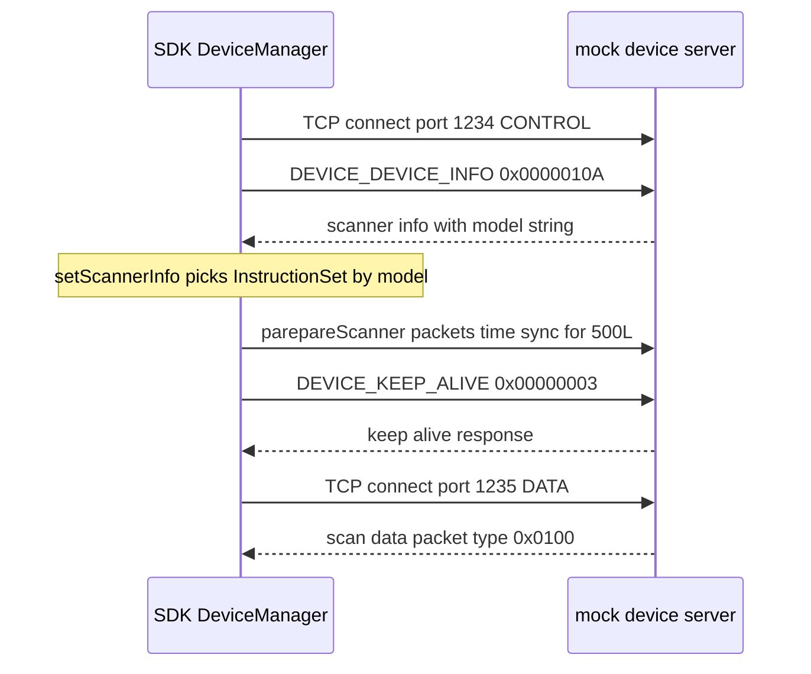
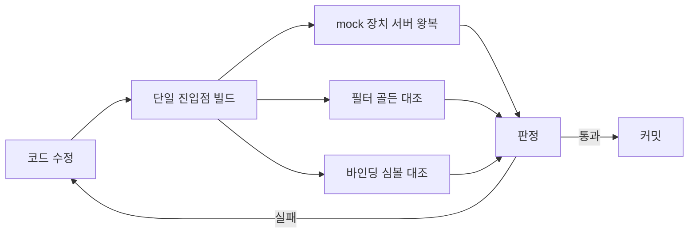

# Phase 1 — 회귀 판정 기준선

> **상태**: 미시작
> **범위**: `sonex-framework`(SDK+ADK)의 동작 보존 판정 수단. **belle-fw(r2)와 달리 프레임워크에는 승격할 테스트 자산이 없다 — 처음부터 짓는다.** 다만 완전한 백지는 아니다(§1.2).
> **선행**: [Phase 0](./phase0-build-reproducibility.md)
> **후행**: [Phase 2](./phase2-release-packaging.md) 이후 전부
> **근거**: [legacy/principles.md §3](../legacy/principles.md) · [../../review/sonex-framework.md §9](../../review/sonex-framework.md)
> **실측 기준**: `sonex-framework` `master` `f336e25b`(2026-07-23) · 측정일 2026-07-30

---

## 1. 배경

### 1.1 r2 와 정반대다 — 승격할 프레임워크 자산이 없다

[r2 Phase 1](../r2/phase1-regression-baseline.md) 은 *"판정 수단이 **있다**"* 로 시작한다. `belle-fw` 에는 `lib/test/cf_ff_compare.c`(218 LOC) 하니스가 출하 브랜치 위에 있고 정량 합격 기준까지 문서화돼 있어서, 그 문서의 일은 **있는 것을 CI 에 올리고 확장하는 것**이었다.

`sonex-framework` 는 그 자산이 없다.

| 항목 | 실측 |
|---|---|
| 단위 테스트 | **실질 1파일** — `sdk/adk/Main/shared/test/test_firmware_version_checker.cpp` **134줄**. 손으로 쓴 `check()`·`g_total`/`g_fail` 카운터, 헤더 주석에 MSVC `cl` 직접 컴파일 명령이 적힌 **standalone** |
| 빌드 등록 | **0건** — 파일명 `test_firmware_version_checker` 로 저장소를 전수 검색해도 CMakeLists·`.vcxproj`·`Android.mk` 어디에도 없다. **커밋마다 돌지 않을 뿐 아니라 아무도 돌리지 않아도 티가 나지 않는다** |
| 테스트 프레임워크 | gtest·Catch2·XCTest·doctest 심볼 **0건**. 검색 매치는 전부 오탐이다(`HCNLMFilter.cpp:446` 의 `cv::UMat matorgtest`) |
| Android 로컬 유닛테스트 | `src/test` 디렉터리 **0건** — gradle 스캐폴딩조차 없다 |
| CI | **0건** — `.github/`·`.gitlab-ci.yml`·`Jenkinsfile`·`azure-pipelines.yml` 이 `sonex-framework`·`sonex-app` 양쪽에 없다 |

**그래서 이 phase 의 성격이 r2 와 다르다.** r2 Step 1-B 는 `build.sh` 를 `make test-golden` 진입점으로 잇는 일이었지만, 여기서는 **잇을 대상 자체를 먼저 만든다.**

### 1.2 그러나 백지도 아니다 — 자산 둘이 다른 저장소에 있다

**r2 와 대비만 하면 이 phase 를 잘못 잡는다.** 실제로는 골든 비교 계통이 이미 둘 있고, 둘 다 "테스트"라는 이름을 달고 있지 않아서 §1.1 의 집계에 안 잡혔을 뿐이다.

| 자산 | 위치 | 실측 |
|---|---|---|
| **필터 파이프라인 단계 덤프** | `sonex-framework` SDK 내부 | `HCDumpManager`(`.h` 84 + `.cpp` 202줄) + **`sdk/sdk/ImageFilter/DUMP_FORMAT.md` 347줄**. `REQUEST_DEBUG_DUMP_START 0x100D0001`/`STOP 0x100D0002` 로 켜고, 단계마다 raw + png + json sidecar 를 쓴다. 덤프 지점은 `HCDefaultBFilter.cpp:131,185,282,312` **4곳**(`stage0_raw`·`stage1_bh_avg`·`stage2_sri`·`stage3_graymap`) |
| **앱 측 테스트·검증기** | `sonex-app` | Dart 테스트 **10파일 2,692줄**(`test/spec/app_scan_spec_test.dart` + `test/fixtures/app_scan_spec.yaml` 598줄 스펙 73케이스 · `test/services/adk/` 6파일) + **`test/HNS_v1/` 파이썬 검증기 424줄 + 덤프 5.7M**. `pubspec.yaml` 에 `flutter_test`·`integration_test` 선언 |

**`DUMP_FORMAT.md` 가 도입 목적을 스스로 밝힌다** — *"외부 ImageFilter 래퍼와 SDK 내부 필터의 입출력 비트 정확 비교"*(도입 2026-05-03). 이것이 r2 의 `cf_ff_compare.c` 에 해당하는 자산이다. **목업이 아니라 실코드의 중간 산출을 비트 단위로 대조한다**는 점에서 [emulator-e2e.md §1](../legacy/emulator-e2e.md) 의 원칙과도 같다.

`DumpManager::start(dir, frameLimit, tag)` 가 **출력 폴더·프레임 수·태그를 전부 인자로 받는다** — 자동화에 그대로 얹을 수 있는 형태다.

### 1.3 그런데 r2 Step 1-A 와 똑같은 함정이 있다

`test/HNS_v1/verify_v21_byte.py`·`verify_v21_full.py` 는 **범위 제외된 저장소에 절대경로로 매달려 있다.**

```python
NEXTSRI_ROOT = Path(r"C:\work\nextsri")
sys.path.insert(0, str(NEXTSRI_ROOT))
from nextsri.pipeline_v1_21_2 import apply_v1_21_2, V1_21_2_PRESETS
```

`NextSRI`(id 77)는 루트 `CLAUDE.md` 가 **신호처리 R&D 로 범위 제외**한 저장소다. **r2 의 `NextDoppler`(id 78) 문제와 구조가 같다** — 범위 제외 판단이 in-scope 코드의 검증 의존물을 잘랐다. 그리고 루트 `CLAUDE.md` 는 이미 그 제외 판단을 **재검토 대상**으로 표시해 뒀다.

**이것이 이 phase 의 선행 조건이고, 코드를 건드리기 전에 결론이 나야 한다**(§2 선행 조건).

### 1.4 공백은 여섯이다

| # | 공백 | 내용 |
|---|---|---|
| 1 | **테스트 프레임워크가 없다** | 어떤 새 단위테스트도 얹을 자리가 없다 |
| 2 | **실장비 없이는 아무것도 못 돈다** | 연결·명령·프레임 수신 전 경로가 장비 의존 |
| 3 | **렌더 경로에 골든이 없다** | 덤프는 graymap(`stage3`)까지다. **렌더러 출력은 안 덮는다** |
| 4 | **덤프가 B 모드만이다** | `process/` 에 `HCDefaultCfFilter`·`HCDefaultPwFilter`·`HCDefaultMFilter` 가 있으나 덤프 지점 0건. **r2 Step 1-C(CF 만 → B·PW·M 확장)의 정확한 거울상** |
| 5 | **CI 가 없다** | 위 전부를 사람이 손으로 돌린다 |
| **6** | **ADK 측 통합 더블이 아예 없다** | SDK 는 mock 장치 서버(1-B)가 있는데, ADK 가 부르는 클라우드 HTTP(19개 엔드포인트, [gap.md §7.3](../gap.md))·DICOM SCP 는 흉내낼 더블이 **하나도 계획에 없었다.** ADK 만 떼어 검증할 방법이 없다는 뜻이다(§Step 1-H) |

### 1.5 목적

1. 테스트 프레임워크를 도입하고 기존 1파일을 그 위로 **승격**한다
2. **실장비 0대**로 연결→명령→프레임 왕복이 도는 mock 장치 서버를 세운다
3. **필터 골든을 승격·확장**하고, **렌더 골든은 신규로** 세운다
4. 앱↔SDK 심볼 불일치를 **기계가 판정**하게 한다
5. Phase 2~6 의 모든 변경이 이 게이트를 통과하게 한다

### 1.6 범위 한계

| 잡힌다 | 안 잡힌다 |
|---|---|
| 필터 파이프라인의 픽셀 회귀(stage0~3) | 실장비 타이밍·재연결·전파 열화 |
| 프로토콜 패킷 바이트와 헤더 거부 경로 | CVIE 유효 라이선스 경로(§4) |
| 심볼 계약 불일치(헤더·산출물 export) | 실기기 GPU 드라이버별 렌더 차이 |
| 모델별 `InstructionSet` 분기 선택 | 펌웨어 굽기 |

**실장비 검증은 [plan.md](../plan.md) Phase 2-5 가 별도로 다룬다.** mock 서버가 보장하는 것은 **프로토콜 정본과의 바이트 일치까지**다.

---

## 2. 진행 단계

> **선행 조건 — `NextSRI` 범위 재판정.** §1.3 의 의존을 먼저 정리한다. ① `NextSRI`(id 77) 클론 가능 여부 확인 ② `pipeline_v1_21_2` 모듈과 `nlm_apply.exe` 확보 ③ 루트 `CLAUDE.md` 의 "신호처리 R&D 제외" 정정 ④ **확보 불가 시 대안**: 현행 출하본으로 덤프를 새로 떠서 그 출력을 골든으로 삼는다. **"정답"이 아니라 "이전 값"이면 회귀 검출에 충분하다**([principles.md §3](../legacy/principles.md)) — r2 Step 1-A-4 와 같은 처리다.

### Step 1-A. 단위테스트 프레임워크 도입

**CMake 갈래부터 시작한다.** 빌드 진입점 4갈래 중 CMake 가 가장 작다 — `CMakeLists.txt` 4개 중 SDK 를 짓는 것은 `sdk/sdk/Main/ios/CMakeLists.txt`·`sdk/sdk/Main/macos/CMakeLists.txt` **2개뿐**이고(둘 다 `project(SonexSDK)` + `add_library(SonexSDK SHARED)`), 나머지 2개는 샘플앱용이다. `.vcxproj` 는 29개·솔루션 2개(`sdk/sdk/workspace/sdk.sln`·`sdk/adk/workspace/framework.sln`), `ndk-build` 는 `sdk/common/android/{Android,Application}.mk` 다.

| # | 작업 |
|---|---|
| A-1 | `test/` 신설(§[plan.md 2.2](./plan.md) 폴더 구조). CMake 대상에 `FetchContent` 로 gtest 연결 |
| A-2 | **기존 1파일 승격** — `test_firmware_version_checker.cpp` 134줄의 손수 만든 `check()` 를 `EXPECT_EQ` 로 옮긴다. **케이스 수를 보존한다**(3.2). 이 저장소에서 유일하게 "있는 것을 잇는" 항목이다 |
| A-3 | 첫 대상 선정 — 플랫폼·GL·소켓에 얽히지 않은 순수 계산부터. `ImageFilter`(`test/core/image_filter_test.cpp`)·`ScanBuffer`(`test/core/scan_buffer_test.cpp`) |
| A-4 | MSBuild 확장 — `sdk.sln` 에 테스트 프로젝트 추가 |
| A-5 | `ndk-build` 확장 — Android 로컬 유닛테스트. gradle `src/test` 스캐폴딩부터 신설 |

> **A-3 의 관문은 Phase 0 이다.** 깨끗한 체크아웃이 빌드되지 않으면([gap.md §3.2](../gap.md)) 테스트도 빌드되지 않는다. A-1·A-2 는 `HCFirmwareVersionChecker` 처럼 의존이 적은 대상이라 ANGLE 회수를 기다리지 않아도 된다.

### Step 1-B `[선행 가능]`. Mock HC 프로토콜 장치 서버

**[legacy/proof/protocol-sot](../legacy/proof/protocol-sot/) 정본으로 300C·300L·500C·500L·500P `InstructionSet` 을 흉내내는 최소 TCP 서버.** `make` 로 재현되는 실물이 이미 있으므로 옮겨 적지 않고 그 헤더를 쓴다.

#### B-0. 왜 지금 만들 수 있나 — 연결 대상이 코드가 아니라 인자다

```cpp
// HCSocketCommunicator.h:35
ResultCode connectDevice(String ip, uint16_t controlPort, uint16_t dataPort,
                         uint8_t retryCount, uint16_t retryIntervalMs, bool newConnection = false);
```

SDK 어디에도 `192.168.10.1` 이 상수로 박혀 있지 않다. `HCLiveController.cpp:262-297` 이 요청 JSON 의 `ip`·`controlPort`·`dataPort` 를 읽어 그대로 넘긴다. **SDK 를 한 줄도 고치지 않고 mock 을 향하게 할 수 있다.**

**단 앱은 그렇지 않다** — `sonex-app` 이 `{ "ip": "192.168.10.1", "controlPort": 1234, "dataPort": 1235, ... }` JSON 리터럴을 **6곳·4파일**에 박아 뒀다(`scan_controller.dart:486,2768,3194` · `scan_stabilizer.dart:97` · `scan_launch_helper.dart:258,672` · `home_controller.dart:272`). 앱까지 mock 에 붙이려면 이 상수를 설정으로 빼는 것이 선행이다.

#### B-1. 핸드셰이크 — 실측한 순서 그대로



연결은 항상 `InstructionSetDefault` 로 시작한다(`HCSocketCommunicator.cpp:151` — `instructionSet = instructionSetList[0]`, 등록 순서는 `:60-65`). `InstructionSetDefault` 가 만드는 패킷은 **4종뿐**이다 — `GET_SCANNER_INFO`·`KEEP_ALIVE`·`SHUTDOWN`·`POWER_OFF`(`HCInstructionSetDefault.cpp:19-83`). **mock 의 최소 응답 집합이 이만큼 작다.**

#### B-2. model 문자열 하나가 5개 코드 경로를 고른다

`SocketCommunicator::setScannerInfo(model, packet)`(`HCSocketCommunicator.cpp:702-731`)가 `isSupportedModel(model)` 로 목록을 훑어 `InstructionSet` 을 교체한다.

| 반환 model | 선택되는 구현 | LOC |
|---|---|---:|
| `300C` 또는 `310C` | `InstructionSet300C` | 1,951 |
| `300L` | `InstructionSet300L` | 2,133 |
| `500C` | `InstructionSet500C` | 2,575 |
| `500L` | `InstructionSet500L` | 2,188 |
| `500P` | `InstructionSet500P` | 2,568 |
| 그 외 | 없음 → `SCANNER_NOT_SUPPORT` | — |

**mock 서버 파라미터 1개가 11,415줄을 갈라 태운다.** 6종 전부 `hasDataChannel() == true` 이므로 1234·1235 두 포트가 다 필요하다.

#### B-3. 응답 헤더 제약 — 틀리면 6곳이 전부 거부한다

```cpp
if (packet.version < 0 || packet.targetId != 2 || packet.sessionId != 0
    || packet.packetType < 0 || packet.contentSize < 0) { ... }
```

이 검사가 `HCInstructionSet{Default:125, 300C:295, 300L:287, 500C:290, 500L:278, 500P:294}.cpp` **6곳에 한 글자도 다르지 않게 복제**돼 있다. mock 은 `targetId = 2`(`HC_PACKET_TARGET_ID_CLIENT`)·`sessionId = 0` 을 반드시 세워야 한다. **그리고 이 6벌 복붙이 mock 회귀로 고정된다** — Phase 3-I 가 dispatcher 를 정리할 때 여섯 곳이 같이 움직였는지 판정할 수단이 생긴다.

#### B-4. 정본에 `sonex-framework` 를 4번째 입력으로 추가한다 — **먼저 해야 한다**

`[실측 2026-07-30]` **정본은 belle-fw·moana·500c-sn-fw 3벌로 만들었고 `sonex-framework` 는 반영돼 있지 않다.** 4번째 선언이며 철자가 또 다르다.

| 값 | `sonex-framework` `HCPacketData.h` | 정본 `hc_protocol.h` |
|---|---|---|
| 14 | `HC_PACKET_HEADER_SIZE` | `HC_HEADER_SIZE`(`:29`) |
| 0x0002 | `HC_PACKET_TARGET_ID_CLIENT` (`uint8_t`) | `HC_TARGET_ID_CLIENT`(`:395`, moana 별칭 `HC_HEADER_TARGET_ID_CLIENT`) |
| 0x0001 | `HC_PACKET_TYPE_DEVICE_COMMAND` | `HC_PACKET_TYPE_DEVICE_COMM`(`:71`) |
| 0x0100 | `HC_PACKET_TYPE_SCAN_DATA`·`HC_PACKET_TYPE_B_MODE` | **철자까지 이미 있음**(moana 계열 상속) |

**값은 전부 같다.** 어긋난 것은 이름이고, `reconcile.py` 가 이미 그 형태의 불일치 41건을 무손실로 통합한 선례가 있다. **mock 서버가 쓸 헤더가 SDK 와 어긋나 있으면 mock 이 만든 바이트가 정본 기준인지 SDK 기준인지 갈리므로, 코드를 쓰기 전에 대조부터 돌린다.**

> **`recv_id` 잠복 결함은 sonex 에 재현되지 않는다**(새 실측). 정본 README 가 기록한 moana 의 결함(`recv_id[1]` 바이트 인덱스가 리틀엔디언과 어긋나 target 검사가 죽어 있음)은 여기 없다 — `PacketData::readHeaderInfo()` 가 `targetId = getUint16()` 로 읽고 `setTargetId()` 가 바이트 4·5 에 LE 로 쓴다(`HCPacketData.cpp:82,109-110`). **정본 통합 시 sonex 쪽은 수정 대상이 아니다.**

#### B-5. 작업 순서

| # | 작업 |
|---|---|
| B-a | `reconcile.py` 에 `sonex-framework` 를 4번째 입력으로 추가. 커밋 SHA 로 고정, **옮겨 적지 않는다** |
| B-b | 정본 헤더로 14바이트 헤더 인코더·디코더. `make` 게이트에 얹는다 |
| B-c | `InstructionSetDefault` 응답 4종 + model 문자열 파라미터 |
| B-d | 모델별 `parseScannerInfo` 레이아웃 재현 — 500L 은 `HCInstructionSet500L.cpp:353` 이하 필드 순서 그대로 |
| B-e | DATA 채널(1235) 스캔 데이터 재생 — 녹화한 프레임을 그대로 흘린다 |
| B-f | **에러 경로** — 잘린 패킷 · 미지 opcode · `targetId` 오류 · 타임아웃 · 연결 끊김 |
| B-g | SDK 를 mock 에 붙인다(**0-0 재배치 후**). 앱까지 붙이려면 B-0 의 앱 상수 6곳 분리 선행 |

> **[r2 Phase 4](../r2/phase4-platform-pc-emulator.md) 와 대칭이다.** 그쪽은 장비 코드가 PC 를 흉내내고, 이쪽은 PC 가 장비를 흉내낸다. 같은 정본을 쓰면 둘을 붙일 때 계약이 이미 맞아 있다.

### Step 1-C. 헤드리스 렌더 골든 — **"주석 해제"로 되는 일이 아니다**

**이 항목을 낮게 잡으면 Phase 4 전체가 판정 불가가 된다.** 이전 판은 *"PBuffer 주석만 해제하면 된다"* 고 봤으나 틀렸다.

#### C-0. 실측 — 창 없이 도는 경로가 지금 존재하지 않는다

| 대상 | 실측 |
|---|---|
| EGL config | `HCImageRenderCore.cpp:900-912` **전체가 주석**(MSAA x4 시도분). `EGL_PBUFFER_BIT` 는 `:908` 주석 줄 **안의 재주석**이다 |
| 활성 config | `:914-920` — `EGL_RED/GREEN/BLUE_SIZE`·`EGL_RENDERABLE_TYPE`·`EGL_NONE` **5개뿐이고 `EGL_SURFACE_TYPE` 자체가 없다** |
| pbuffer 호출 | **SDK 에 `eglCreatePbufferSurface` 호출 0건.** 매치는 `glad_egl.h` 3벌의 **선언**뿐 |
| 유일한 실호출 | `sdk/adk/sample/iOS_SampleApp/iOS_SDK_SampleApp/AngleProbe.mm:56` — 16x16 pbuffer + `eglCreateContext`. 동작 확인용 probe 지만 **창 없이 컨텍스트가 서는 선례**다. 출발점으로 쓴다 |
| `g_cineFbo` | **헤드리스가 아니다** — `:2709-2716` 이 `glGetIntegerv(GL_FRAMEBUFFER_BINDING, &prevFbo)` 로 **기존 바인딩을 백업**하고 cine FBO 로 갈아탄 뒤 되돌린다. cine snapshot 용이며 **컨텍스트를 만들지 않는다** |
| 메인 경로 | `eglCreateWindowSurface(..., nativeWindow, ...)` — 윈도우 고정 |

#### C-1. 픽셀 반출은 하나뿐인 것보다 더 좁다 — **플랫폼 가드가 층마다 다르다**

`[실측 2026-07-30]` `hc_ReadRenderedImage` 는 **공개 헤더에 무조건 선언**돼 있지만(`sdk/include/HCSonexSDKInterface.h:263` · `sdk/sdk/Main/shared/HCSonexSDKInterface.h:290`) 구현은 전부 가드 안이고 **가드가 일치하지 않는다.**

| 층 | 파일:줄 | 가드 |
|---|---|---|
| C ABI | `HCSonexSDKInterface.cpp:331` | `#if OS_IOS` |
| 파사드 | `HCSonexSDK.cpp:483` | `#if OS_IOS` |
| 렌더러 | `HCImageRenderer.cpp:1008` | `#if OS_IOS \|\| OS_MACOS` |
| 코어 | `HCImageRenderCore.cpp:2787` | `#if OS_IOS \|\| OS_MACOS` |

**결과 셋**:
1. **Android·Windows 산출물에는 이 심볼이 아예 없다.** 헤더에는 있으니 앱은 lookup 하고 런타임에 실패한다 — 1-D 가 잡아야 할 유형 그대로다
2. **macOS 는 아래 두 층만 있고 위 두 층이 없다** — 코어에 구현이 있어도 C ABI 로 도달할 수 없다
3. **CI 가 돌릴 만한 플랫폼(headless·Android·Windows)에 픽셀 반출 경로가 없다**

그리고 구현 본문의 주석이 `// pbuffer에서 픽셀 데이터 읽기`(`:2800`)인데 **pbuffer 는 없다** — 실제로는 현재 바인딩된 프레임버퍼에서 `glReadPixels` 한다. **의도를 앞서 적어 둔 주석이며, 코드를 훑는 사람을 "이미 있다"로 오도한다.**

#### C-2. 두 갈래로 쪼갠다

| 갈래 | 대상 | 성격 | 착수 |
|---|---|---|---|
| **① 필터 골든** | stage0~3 (`HCDumpManager`) | **승격·확장** — §1.2 의 자산이 그대로 쓰인다 | 선행 조건 해소 후 즉시 |
| **② 렌더 골든** | stage3 이후 렌더러 출력 | **신규 구현** — 오프스크린 컨텍스트 + 반출 API 둘 다 없다 | Phase 4-D 를 앞당겨 씀 |

| # | 작업 |
|---|---|
| C-a | **① 필터 골든 자동화** — `DumpManager::start(dir, frameLimit, tag)` 를 테스트 하니스에서 호출. 출력 폴더가 인자라 그대로 얹힌다 |
| C-b | **① B 외 모드 확장** — `HCDefaultCfFilter`·`HCDefaultPwFilter`·`HCDefaultMFilter` 에 같은 4단계 덤프 지점을 넣는다. **r2 Step 1-C 와 같은 일** |
| C-c | **① 합격 기준 정의** — 부동소수·OpenCV 버전 의존이 있으므로 허용오차를 처음부터 명시. `verify_v21_byte.py` 가 이미 *"96% 매치"* 형태의 기준을 쓴다 |
| C-d | **② 오프스크린 EGL 컨텍스트 신규 구현** — 활성 config 에 `EGL_SURFACE_TYPE` 을 세우고 pbuffer 또는 surfaceless 컨텍스트를 만든다. `AngleProbe.mm:56` 이 출발점 |
| C-e | **② 픽셀 반출 API 를 전 플랫폼으로** — `hc_ReadRenderedImage` 의 4층 가드를 정리한다. **가드를 넓히는 것이지 알고리즘을 고치는 것이 아니다** |
| C-f | **② IQ 고정 입력 → 렌더 → 픽셀 골든** — 입력 덤프는 실장비 1회 수집 또는 `test/HNS_v1/dump/` 재활용 |

> **① 이 ② 없이도 성립한다는 것이 이 분할의 핵심이다.** ② 가 ANGLE 백엔드 편차로 막혀도 필터 회귀는 계속 잡힌다(§4).

### Step 1-D `[선행 가능]`. 바인딩 오탐 검출 스크립트

**앱이 부르는 `hc_*` 고유 심볼 108개 중 29개가 프레임워크에 정의 0건**이다([../../review/sonex-framework.md §3.5](../../review/sonex-framework.md), `master`·`feature-apply_v1.23.4` 양쪽). 표본 재확인(2026-07-30): `hc_GetLatestFrameByType`·`hc_ReadLastFramebufferBgra`·`hc_GetMeasureObjectsData`·`hc_SetPlaybackScanMode`·`hc_GrabFrontBufferBgraNow`·`hc_ReleaseWcharPointer` **6건 전부 framework=0 / app>0**.

#### D-0. 실패가 조용한 정도 — 로그만이 아니다

`NativeMethods.dart` 는 `lookup<...>().asFunction()` 을 전부 `try`/`catch` 로 감싸고, catch 에서 `print` 뒤 **`-1` 을 반환하는 스텁 함수를 돌려준다.**

```dart
} catch (e) {
  if (LogConfig.sdkError) { print("[실패] hc_PushPlaybackFrame 함수를 찾을 수 없음: $e"); }
  return (_, __, ___, ____, _____, ______, _______, ________) => -1;
}
```

`lookup` 호출 **84곳**, 이 패턴 **45곳**. 즉 앱은 없는 기능을 부른 채 정상 동작인 척 계속 돈다.

#### D-1. 두 층을 봐야 한다 — 헤더 대조만으로는 부족하다

**`hc_ReadRenderedImage` 가 이 스크립트의 시험 케이스다.** 공개 헤더에는 선언이 있으므로 헤더 대조는 통과하지만, Android·Windows 산출물에는 심볼이 없다(§C-1).

| 층 | 입력 | 잡는 것 |
|---|---|---|
| ① 선언 대조 | 공개 헤더 심볼 vs 앱 `lookup()` 문자열 | 오타·대소문자·미구현 — `hc_ReleaseWcharPointer`(앱) vs `hc_ReleaseWCharPointer`(SDK, `HCSonexSDKInterface.cpp:344`) |
| ② export 대조 | 플랫폼별 산출물의 export 심볼(`nm -D` · `dumpbin /exports`) vs 앱 `lookup()` 문자열 | **플랫폼 가드로 사라진 심볼** |

②는 Phase 0 이 빌드를 세운 뒤에야 돌지만, ①은 **지금 만들 수 있다.** [`reconcile.py`](../legacy/proof/protocol-sot/) 와 같은 패턴이다 — 원본을 옮겨 적지 않고 저장소에서 직접 읽는다.

> **교훈을 기계로 고정하는 것이 이 항목의 목적이다.** "앱이 선언했다"와 "SDK 가 제공한다"는 다른 차원의 사실이고, 이전 판이 앱 선언을 SDK 기능으로 읽어 *"픽셀 반출 API 가 이미 셋 있다"* 고 잘못 적었다. 사람이 다시 틀리지 않게 만드는 것이 1-D 다.

### Step 1-E. CI 파이프라인 신설

| # | 작업 |
|---|---|
| E-1 | **앱부터 올린다** — `sonex-app` 은 지금도 `flutter test` 한 줄이면 Dart 10파일 2,692줄이 돈다. **프레임워크보다 앱이 먼저 CI 에 오른다** |
| E-2 | Phase 0-F 의 단일 진입점 위에서 Android + headless(0-G) 커밋마다 빌드 |
| E-3 | 게이트 편성 — 빌드 매트릭스 · 1-A 단위테스트 · 1-B mock 왕복 · 1-C ① 필터 골든 · 1-D ① 선언 대조 |
| E-4 | 실패 시 픽셀 diff·수치 diff 를 아티팩트로 |
| E-5 | 인프라 선택(GitHub Actions 등)은 **힐세리온 결정 사항** — 31개 저장소 CI 0건이라 조직 표준 자체가 없다([../../review/dev-environment.md §2.2](../../review/dev-environment.md)) |

**`make` 인터페이스 — cctv taxonomy 로 통일**([precedent-cctv.md §5.2](../legacy/precedent-cctv.md) `test-unit`·`test-integration`·`test-e2e`·`test-architecture`)

| 타겟 | 동작 | 성격 |
|---|---|---|
| `make test-unit` | 1-A gtest + **G-4 의 mock-port 기반 도메인 테스트**(포트가 늘 때마다 여기로 편입) | 단위 — 실물 없음 |
| `make test-integration` | 1-B mock 장치 서버 왕복(모델 5종) + 1-C 필터·렌더 골든 | 통합 — 실물을 흉내낸 더블과 바이트가 오간다 |
| `make test-architecture` | [r1/plan.md §2.3](./plan.md) AF-1~3(도메인→플랫폼 직접 include 금지 등) + 1-D 선언·export 대조 | 정적 — 런타임 없음, 방향·계약 위반만 판정 |
| `make test-e2e TARGET=mock` | **[Step 1-H](#step-1-h-sdk-e2e·adk-e2e-시나리오) — SDK·ADK 각자의 cross-feature 시나리오** | E2E — mock·헤드리스 위에서, 커밋마다(CI) |
| `make test-e2e TARGET=device` | **같은 시나리오를 실장비로**([plan.md Phase 2-5](./plan.md) 가 접근 확보) | E2E — mock 이 재현 못 하는 것(§H-0) 포함, 별도 빈도 |
| `make golden-update` | 의도된 변경 시 갱신. **커밋에 사유 필수** | — |

**`test-mock`·`check-bindings` 이름은 폐기하고 위 4종으로 흡수한다** — cctv 와 이름이 다르면 "제품이 달라도 같은 이름을 찾아 들어간다"는 이식성이 깨진다([precedent-cctv.md §2.5](../legacy/precedent-cctv.md)).

### Step 1-F `[선행 가능]`. 원격 갱신분 재확인

**브랜치 구도는 이미 확정됐다.** `[실측 2026-07-30]`

| 항목 | 값 |
|---|---|
| 로컬 HEAD | `f336e25bb513c54e318f3423de8f84cd4ab06fc6` |
| `origin/master` | **동일** — `f336e25b`, 2026-07-23 17:54:56 +0900 |
| 마지막 fetch | `.git/FETCH_HEAD` 2026-07-27 |
| 원격 브랜치 | 5개. `origin/master`(07-23) · `feature-apply_v1.23.4`(07-15) · `feature-apply_v1.23.3`(07-11) · `dev/adk_v0.51.0`(2026-04-29) · `adk_work`(2025-08-25) |
| diverge | `origin/master..origin/feature-apply_v1.23.4` = **2커밋** |

**남은 것은 2026-07-27 이후 원격 변화뿐이다.** 착수 직전 재fetch 로 `origin/master` tip 과 `feature-apply_v1.23.4` 상태를 다시 본다(→ Phase [0-0](./phase0-build-reproducibility.md)·0-J).

### Step 1-G. 초기 테스트 케이스 인벤토리

**1-A 는 프레임워크를 세우고, 1-G 는 무엇을 덮을지 정한다.** 이것이 없으면 gtest 만 연결된 빈 스위트가 남는다.

#### G-0. 하드웨어 없이 지금 덮을 수 있는 표면 — 실측

`[실측 2026-07-30]` 모듈별로 **GL·소켓 의존 파일 수**를 셌다. 아래 6개는 **둘 다 0** 이라 실장비·GL 컨텍스트 없이 곧바로 단위테스트 대상이 된다.

| 모듈 | 계층 | `.cpp` | GL 의존 | 소켓 의존 |
|---|---|---:|---:|---:|
| `ImageFilter` | SDK | 38 | 0 | 0 |
| `FileReadWriter` | SDK | 6 | 0 | 0 |
| `ScanBuffer` | SDK | 5 | 0 | 0 |
| `ScanTimeSync` | SDK | 5 | 0 | 0 |
| `DatabaseHelper` | ADK | 20 | 0 | 0 |
| `DicomHandler` | ADK | 6 | 0 | 0 |

**프로토콜 파싱도 소켓 없이 된다** — `HCPacketData.h:40` `class PacketData` 의 `getUint16()`·`getString(size_t)` 는 바이트 배열만 받는 순수 접근자다. **mock 서버(1-B)를 기다리지 않고 패킷 해석을 먼저 덮을 수 있다.**

#### G-1. 케이스 작성 순서 — 의존이 적은 것부터

| 순서 | 대상 | 케이스 성격 | 선행 |
|---|---|---|---|
| 1 | `FirmwareVersionChecker` | **이미 있다**(134줄). 1-A-2 에서 gtest 로 이관하며 케이스 수 보존 | 없음 |
| 2 | `PacketData` 해석 | 헤더 14바이트 · `'H'`/`'C'` 매직 · 필드 오프셋 · **경계값**(잘린 패킷·길이 초과) | 없음 |
| 3 | `ImageFilter` 순수 계산 | 필터별 입출력. **`HCDumpManager` 4단계 덤프가 이미 있으므로 골든 입력으로 쓴다**(§1.2) | 없음 |
| 4 | `ScanBuffer`·`ScanTimeSync` | 링버퍼 경계·오버런·타임스탬프 정렬 | 없음 |
| 5 | `FileReadWriter`(HCP/HCM) | 왕복(write→read) 동일성 · 손상 파일 거부 | 없음 |
| 6 | `DatabaseHelper`·`DicomHandler` | 스키마 왕복 · DICOM 태그 매핑 | ADK 빌드 |
| 7 | `DeviceManager` 통합 | 연결→명령→프레임 왕복 | **1-B(mock 서버)** |
| 8 | 렌더 골든 | 프레임 픽셀 비교 | **1-C(오프스크린 컨텍스트)** |

**1~6 은 Phase 0(빌드)만 끝나면 되고 1-B·1-C 를 기다리지 않는다.** 이 순서가 "하니스가 다 서야 테스트를 쓴다"는 교착을 푼다.

#### G-2. 케이스 형식은 기존 1건을 따른다

`test_firmware_version_checker.cpp` 가 이미 좋은 형태다 — **외부 의존 0, 표 주도(table-driven), 통과/실패 카운트**. 주석이 기준까지 밝힌다: *"Moana `CFirmwareSetting::checkFirmwareVersion()` 500L 분기 동작을 기준으로 작성"*.

**"정답"이 아니라 "이전 값"을 기준으로 삼는 방식**이며([r2/phase1-regression-baseline.md](../r2/phase1-regression-baseline.md) Step 1-A-4 와 같은 원칙), 회귀 검출에는 그것으로 충분하다.

#### G-3. 덮지 않는 것을 명시한다 — **단, Phase 1 시점 한정이다**

| 대상 | 이유 | Phase 1 이후 |
|---|---|---|
| `ImageRenderer` 내부 141메서드 | GL 컨텍스트 전제. **1-C 의 프레임 골든으로 통째 판정**하고 메서드 단위로 쪼개지 않는다 | **재개방된다** — [Phase 4-A](./phase4-render-boundary.md)가 `domain/`·`ports/i_render_surface_port.h` 를 가르면, 스캔변환·좌표계·측정 계산은 GL 없이 단위테스트 대상이 된다(G-4) |
| `DeviceManager` 프로토콜 도메인 | 지금은 소켓 실물 없이 못 돈다고 보고 **1-B(mock 서버) 하나로 미룸** | **미룰 필요가 없다** — [Phase 3-J](./phase3-layer-boundary.md)가 `i_socket_port.h` 를 가르면, 명령 조립·응답 파싱은 mock 포트로 1-B 보다 먼저·가볍게 단위테스트된다(G-4) |
| 플랫폼 HAL(소켓·오디오 3벌씩) | 실장비·OS API. **이건 계속 안 덮는다** — HAL 구현 자체는 실기기 대조가 맞는 검증이다 | 유지 (통합·수동 검증 대상) |
| CVIE 경로 | **라이선스 키가 장비에서 온다**(장비 정보 패킷 필드 31). mock 으로 유효 경로를 만들 수 없다(§4) | 유지 |
| 펌웨어 굽기 | 실패 비용이 장비 손상. [plan.md](./plan.md) Phase 7 보류 사유와 같다 | 유지 |

**표에서 "재개방"이 붙은 두 줄이 이 phase 가장 큰 함정이다** — G-0~G-1 의 "6모듈·GL·소켓 무의존" 목록을 **최종 커버리지 범위로 착각하면 안 된다.** 그건 **Phase 0만 끝나면 즉시 되는 바닥**이지, Phase 3·4가 끝난 뒤의 천장이 아니다. G-4 가 그 확장을 명문화한다.

#### G-4. 커버리지는 여기서 멈추지 않는다 — 포트가 늘 때마다 같이 는다

**규칙**: [r1/plan.md §2.3](./plan.md)이 요구하는 `i_*_port.h` 는 나올 때마다 **production 구현(`platform/`) 과 test double(mock) 을 함께 낸다.** 산출물이 인터페이스 하나뿐이면 그 포트는 "정의됐다"이지 "테스트 가능해졌다"가 아니다. 선례는 [legacy/r1(moana) Phase7](../legacy/r1/phase7-feature-measure.md) 의 `i_scan_geometry_port.h` — *"이것을 인터페이스로 만들면 측정 계산이 스캔 없이 테스트 가능해진다"* 며 `mock i_scan_geometry_port` 로 `measure_converter_test` 를 짰다. 이 저장소도 같은 패턴을 따른다.

| 포트 | 도입 phase | mock 구현 | 그걸로 풀리는 단위테스트 |
|---|---|---|---|
| `i_render_surface_port.h` | [Phase 4-A](./phase4-render-boundary.md) | `test/mocks/mock_render_surface.cpp` — display·surface·context 호출을 기록만 하고 반환값을 고정 | `ImageRenderer` 의 `domain/`(스캔변환·좌표계·측정 계산) — GL 컨텍스트·ANGLE 없이 |
| `i_socket_port.h` | [Phase 3-J](./phase3-layer-boundary.md) | `test/mocks/mock_socket.cpp` — `connect`/`send`/`recv` 를 바이트 큐로 대체 | `DeviceManager` 의 `domain/`(명령 조립·응답 파싱·모델별 `InstructionSet` 분기) — 실소켓·mock TCP 서버(1-B) 없이 |

**mock 포트와 1-B·1-C 는 성격이 다르다** — 1-B(mock 장치 서버)·1-C(헤드리스 골든)는 **실물을 흉내내는 통합 테스트 더블**(바이트가 실제로 오간다)이고, 이 표의 mock 포트는 **호출을 대체하는 단위테스트 더블**(바이트가 안 오간다, 호출 여부·인자만 확인)이다. cctv 의 4단계 taxonomy(`test-unit`·`test-integration`·`test-e2e`·`test-architecture`, [precedent-cctv.md §5.2](../legacy/precedent-cctv.md))로 보면 전자는 `test-integration`, 이 표는 `test-unit` 이다.

**판정**: Phase 3·4 각각이 끝날 때 "그 phase 가 새로 연 도메인 로직에 대응하는 단위테스트가 있는가"를 [r1/plan.md §3.2](./plan.md) 표의 항목처럼 **선행 조건으로 건다.** 포트만 만들고 mock·테스트를 안 만든 채 다음 phase 로 넘어가지 않는다.

### Step 1-H. SDK e2e·ADK e2e 시나리오

**1-B(mock 장치 서버)·1-C(헤드리스 골든)는 각각 SDK 안의 단일 기능(연결, 렌더링)만 왕복한다. `DeviceManager→ImageRenderer→ImageFilter` 처럼 여러 feature 를 가로지르는 흐름, 그리고 ADK 쪽 흐름은 아직 아무것도 안 덮는다.** [r1/plan.md §2.0](./plan.md)이 SDK·ADK 를 별도 bounded context 로 확정한 이상, **"SDK 만 있어도 되는지"·"ADK 만 있어도 되는지"를 검증하려면 각자 자기 완결적인 e2e 가 있어야 한다.**

#### H-0. 시나리오는 하나, 타깃은 둘 — `mock`·`device`

**e2e 를 "mock 에서 도는 것"과 "실장비 회귀"로 나눠 이름까지 다르게 부른 것이 이전 판의 오류다.** cctv 의 40개 E2E 시나리오는 **하나의 정의**이고 `platforms/{nt98566,ssc30kq,ubuntu24}` 어느 쪽으로 붙느냐만 다르다(`make run PLATFORM_ID=ubuntu24`, [precedent-cctv.md §3·§4](../legacy/precedent-cctv.md)) — 시나리오를 두 벌 짜지 않는다. 이 저장소도 같은 모델을 쓴다.

**이게 성립하는 이유는 이미 §Step 1-B B-0 이 확인해 뒀다** — SDK 코드 어디에도 연결 대상(`192.168.10.1` 등)이 상수로 박혀 있지 않고 `connectDevice(ip, controlPort, dataPort, ...)` 인자로 받는다. ADK 쪽도 H-2 가 `base_url` 을 시험 시점에 주입 가능한 형태로 만든다. **즉 시나리오 스크립트는 "무엇을 하는가"만 정의하고, "어디에 붙는가"(mock 서버 IP·포트 vs 실제 스캐너 IP·포트, mock HTTP vs 실제 `sonex.healcerion.com`)는 타깃 인자다.**

```
make test-e2e TARGET=mock      # 기본값. 커밋마다, 개발 PC, 실장비 0대
make test-e2e TARGET=device    # 실장비 접근 확보 시([plan.md](./plan.md) Phase 2-5 가 그 접근을 별도로 확보)
```

| 축 | `TARGET=mock` | `TARGET=device` |
|---|---|---|
| 붙는 대상 | mock 장치 서버(1-B)·헤드리스 렌더(1-C)·mock ADK 백엔드(H-2) | 실제 스캐너·실제 클라우드 |
| 실행 빈도 | 커밋마다(CI) | 접근 확보된 시점([plan.md Phase 2-5](./plan.md)) |
| 잡는 것 | cross-feature 흐름의 코드 로직 — 순서·상태 전이·데이터 변환 | **더해서** 타이밍·전파 열화·GPU 드라이버 편차·CVIE 유효 라이선스 경로(§4) 등 mock 이 재현 못 하는 것 |
| 시나리오 정의 | **아래 H-1·H-3·H-4 표와 동일** — 타깃별로 다시 안 짠다 | 동일 |

**둘 다 필요하다** — `mock` 없이 `device` 만 있으면 커밋마다 못 돌리고(장비가 유한), `device` 없이 `mock` 만 있으면 mock 이 재현 못 하는 범주(위 표 마지막 행)가 영원히 미검증으로 남는다.

**단, 시나리오별로 타깃 적용이 갈린다** — 아래 각 표의 "타깃" 열이 그 시나리오가 `mock`·`device` 어느 쪽에서 도는지(또는 한쪽 전용인지) 명시한다. cctv 원칙 **"API 스키마 검증 금지, 크로스 컴포넌트 실제 동작만"**([precedent-cctv.md §5.1](../legacy/precedent-cctv.md))은 두 타깃 모두에 적용한다.

#### H-1. SDK e2e

`TARGET=mock` 은 1-B·1-C 가 서면(선행) **신규 더블 없이** 조립 가능하다. 형식은 cctv 와 같이 시나리오당 `.sh`(실행) + `.md`(검증 대상 명세) 쌍.

| 시나리오 | 흐름 | 타깃 | 근거 |
|---|---|---|---|
| `sdk-connect-scan-render` | mock/실 서버 연결 → model 판정(§1-B B-2) → 스캔 데이터 수신 → 렌더 → 픽셀 대조 | **둘 다** | `DeviceManager`→`ImageRenderer` cross-feature. `device` 에서는 헤드리스 대신 실 GPU 렌더 경로 |
| `sdk-measurement-roundtrip` | 렌더 → 측정 기하 `exportMeasurements` → `importMeasurements` 왕복 | **둘 다** | [phase4 Step 4-C2](./phase4-render-boundary.md) |
| `sdk-firmware-upgrade-500l` | SN 응답 재생/실응답 → `HCLiveController` 상태 전이 | **둘 다**, 단 `device` 는 **인간 승인 게이트 필수** — 실패 시 장비 손상([plan.md Phase 7](./plan.md) 보류 사유와 같은 위험) | [gap.md §4.5](../gap.md) 의 SDK 쪽 절반("SN 명령 전송") |
| **`sdk-only-build-and-run`** | `adk/` 를 지운 트리에서 위 시나리오가 그대로 통과 | **mock 전용** — 빌드 구성 시험이라 실장비 유무와 무관 | [Phase 3-K](./phase3-layer-boundary.md) 판정을 e2e 레벨에서 재확인 |
| **`sdk-cvie-license-valid`** | 500 계열 실장비에서 CVIE 유효 라이선스 경로 → 필터 활성화 확인 | **device 전용** — 라이선스가 장비 바인딩이라 mock 이 만들 수 없다(§4) | [gap.md §8.1](../gap.md) |

#### H-2. ADK e2e 를 위해 먼저 필요한 것 — **mock ADK 백엔드가 없다**

**§1.4 공백 6번.** ADK 가 실제로 부르는 대상 둘 다 더블이 없다.

| 대상 | 실측 | 필요한 더블 |
|---|---|---|
| 클라우드 HTTP | `base_url = "http://sonex.healcerion.com:8080/API/"`, 계정(SSO) 10 + 장비(SDI) 7 + 로그(ELA) 1 = **19개 엔드포인트**([gap.md §7.3](../gap.md)) | 최소 stub HTTP 서버 — `SignUp`·`LogIn`·`GetDeviceList`·`RegistBattery`·`AddEventLog` 등 19개에 고정 응답 |
| DICOM(PACS) | `DicomHandler` 가 dcmtk 기반 C-STORE 전송(`adk/library/dcmtk_3.6.5_android`) | mock DICOM SCP — dcmtk `storescp` 또는 최소 C-STORE 수신기로 충분, 신규 구현 아님(재사용) |

이 둘이 **1-B(mock 장치 서버)의 ADK 대응물**이다. SDK 는 이미 있고 ADK 는 지금까지 계획에 없었다 — 이번에 §1.4 공백에 추가한 이유가 이것이다.

| # | 작업 |
|---|---|
| H2-a | stub HTTP 서버 신설 — 19개 엔드포인트에 고정 JSON 응답. `HCNetworkProcess.cpp:17,96` 의 `base_url` 을 시험 시 이 서버로 교체(런타임 설정, 코드 변경 없음 — 1-B의 B-0 원칙과 같다) |
| H2-b | mock DICOM SCP — dcmtk `storescp` 재사용, C-STORE 수신 확인만 |
| H2-c | 에러 경로 — 401/500 응답, 타임아웃, DICOM 연결 거부 |

#### H-3. ADK e2e — H-2 가 선 뒤

| 시나리오 | 흐름 | 타깃 |
|---|---|---|
| `adk-login-register-device` | signIn → getUserProfile → getDeviceList → getBatteryList([adk_network_service.dart](../../review/sonex-framework.md) 워크플로우 그대로) | **둘 다** — `device` 는 mock HTTP 대신 실제 `sonex.healcerion.com:8080` |
| `adk-dicom-export` | 스캔 결과 → DICOM 변환(`DicomHandler`) → SCP 로 C-STORE → 저장 확인 | **둘 다** — `device` 는 mock SCP 대신 실 PACS(확보 시) |
| **`adk-only 시험`** | **ADK e2e 가 SDK 없이 도는지** — 단, `HCFirmwareController.cpp` 의 FTP 펌웨어 업로드 경로처럼 ADK 가 장비를 직접 만지는 예외([gap.md §4.4](../gap.md))는 이 시험에서 **알려진 예외**로 표시하고 통과 기준에서 뺀다 | **mock 전용** — SDK-only 대칭 시험(H-1 의 `sdk-only-build-and-run`)이라 실장비 유무와 무관 |

#### H-4. 경계 교차 시나리오 — 둘 다 필요

**[gap.md §4.5](../gap.md)의 펌웨어 업그레이드 비대칭이 정확히 이 성격이다** — ADK 의 정책(순서 상태머신)과 SDK 의 기전(SN 명령 전송)이 실제로 맞물려 도는지는 SDK e2e 나 ADK e2e 어느 한쪽만으로는 안 잡힌다.

| 시나리오 | 흐름 | 타깃 | 필요 더블(`mock`) |
|---|---|---|---|
| `firmware-upgrade-500c-full` | ADK `FirmwareController`(버전 판정·FTP 업로드 오케스트레이션) → SDK `HCLiveController`(SN 명령 전송) → 장치 서버 | **둘 다**, `device` 는 **인간 승인 게이트 필수**(펌웨어 굽기 실패 = 장비 손상) | 1-B + H-2 |

**이 시나리오 하나가 gap.md §4.5 가 지적한 "장비 계열마다 비대칭"을 회귀 감시로 고정한다** — 500L 은 SDK 단독으로 끝나야 하는데(현재 `TODO` 스텁, [gap.md §5](../gap.md)) 500C/P 는 이 교차 경로가 필수라는 차이 자체가 테스트 대상이다.

**성공 판정**:
- `make test-e2e TARGET=mock` 가 CI 에서 커밋마다 H-1·H-3·H-4 중 **mock 적용 시나리오 전부**를 실장비 없이 통과시킨다
- `make test-e2e TARGET=device` 가 실장비 접근 확보 시(Phase 2-5) **device 적용 시나리오 전부**를 통과시킨다 — 펌웨어 관련 2건은 인간 승인 게이트를 거친다
- 두 타깃의 결과가 **갈리면**(mock 은 통과, device 는 실패 또는 반대) 그 자체가 조사 대상이다 — mock 이 실장비 동작을 잘못 흉내낸 것이거나, 실장비에만 있는 조건을 놓친 것이다

---

## 3. 검증

| # | 항목 | 명령 | 기대 |
|---|---|---|---|
| 3.1 | 프레임워크 도입 | `make test-unit` | exit 0 |
| 3.2 | **기존 1파일 승격** | gtest 로 옮긴 `firmware_version_checker` | **케이스 수 보존**(원본 대비 감소 0) |
| 3.3 | **mock 왕복** | 실장비 0대로 연결→모델판정→명령→프레임 수신 | 통과 |
| 3.4 | **모델 커버리지** | 300C·300L·500C·500L·500P | **5/5** (미달 시 숫자 명시) |
| 3.5 | 헤더 거부 경로 | `targetId != 2` · `sessionId != 0` · 잘린 패킷 · 미지 opcode | **전부 거부**(6개 InstructionSet 동일) |
| 3.6 | 정본 대조 | `reconcile.py` 에 `sonex-framework` 포함 | **같은 이름·다른 값 0건** |
| 3.7 | 필터 골든 | `DumpManager` stage0~3 재현 | 허용오차 내 일치 |
| 3.8 | **모드 커버리지** | B·CF·PW·M | **4모드**. 현재 B 만 — **미달을 숫자로 명시** |
| 3.9 | **헤드리스 렌더** | 창 없이 프레임 1장 반출 | 픽셀 버퍼 획득 성공 |
| 3.10 | 바인딩 대조 | `make test-architecture`(구 `check-bindings`, §2 Step 1-E 표) | 부재 **0건** (현재 29 / 108) |
| 3.11 | **회귀 검출** | 알려진 결함 재도입 — ① `hc_ReleaseWCharPointer` 철자 되돌리기 ② `targetId != 2` 검사 1곳 삭제 | **둘 다 실패해야 한다** |
| 3.12 | CI | push 시 자동 실행 | 통과 |
| 3.13 | 결정론 | 3회 실행 | 동일 결과 |
| 3.14 | 실행 시간 | | 커밋마다 돌릴 수 있는 시간 |
| **3.15** | **SDK e2e — `mock`** | `make test-e2e TARGET=mock` — H-1 중 mock 적용 5개 | **5/5 통과**, 현재 0 |
| **3.15b** | **SDK e2e — `device`** | `make test-e2e TARGET=device` — H-1 중 device 적용 4개(`sdk-cvie-license-valid` 포함) | **4/4 통과**(접근 확보 시), 현재 0 |
| **3.16** | **ADK mock 백엔드** | H-2 stub HTTP(19 엔드포인트)·mock DICOM SCP | 존재하고 기동, 현재 **0**(§1.4 공백 6) |
| **3.17** | **ADK e2e — 양 타깃** | `make test-e2e` — H-3 시나리오 3개, `mock`/`device` 각각 | 타깃별 통과, 현재 0 |
| **3.18** | **경계 교차 e2e — 양 타깃** | `make test-e2e` — H-4 `firmware-upgrade-500c-full`, `device` 는 인간 승인 게이트 | 통과, **gap.md §4.5 비대칭이 회귀로 고정** |
| **3.19** | **타깃 간 결과 일치** | 같은 시나리오의 `mock`·`device` 결과 대조(§H-4 성공 판정 마지막 항목) | **불일치 0건**, 불일치 시 원인 규명 전까지 게이트 실패 |

> **3.11 이 진짜 게이트다.** 나머지는 "돌았다"를 보이지만 3.11 만이 **"안 돌았으면 잡혔을 것"** 을 보인다. ②는 6벌 복붙 중 하나만 지우는 것이라 사람 리뷰가 놓치는 유형이다.
>
> **3.8·3.9 는 미달을 숨기지 않는다.** 렌더 골든(②)이 ANGLE 백엔드 편차로 막히면 3.9 를 "미달"로 적고 Phase 4-D 뒤로 넘긴다 — 통과한 것처럼 적지 않는다.

---

## 4. 위험 · 대응

| 위험 | 영향 | 대응 |
|---|---|---|
| **`NextSRI` 골든·참조 구현을 확보 못 한다** | `verify_v21_*.py` 424줄이 못 돈다 | 선행 조건 ④ — 현행 출하본으로 덤프를 새로 떠 **"이전 값"** 을 골든으로. r2 Step 1-A-4 와 같은 처리 |
| **PBuffer 가 ANGLE 백엔드(D3D11/Metal/Vulkan)별로 지원 편차** | 1-C ② 가 막히면 **렌더 회귀 oracle 이 없어져 Phase 4 전체가 판정 불가** | **1-C 를 ①·②로 쪼갠 이유가 이것이다.** ① 필터 골든은 GL 없이 돌고, ② 는 `AngleProbe.mm:56` 선례부터 백엔드별로 확인 |
| **`hc_ReadRenderedImage` 가 CI 플랫폼에 존재하지 않는다** | 1-C ② 를 headless·Android 에서 시작할 수 없다 | C-e 가 가드 정리를 **1-C 안에 포함**한다. 가드를 넓히는 것이지 알고리즘 변경이 아니므로 회귀 위험이 낮다 |
| **CVIE 라이선스가 장비 바인딩** | mock 으로 CVIE 유효 경로를 못 만든다 | `HCInstructionSet500L.cpp:393` 이 장비정보 필드 31 에서 키를 읽고 `HCLiveController.cpp:3079` 가 `cvieValidation(serial, key)` 로 검증한다. **500L·500P·500C 해당.** mock 은 `cvieLicense=false` 경로만 덮는다 — CVIE 없는 경로(HNS·NLM·SRI 자체 필터)부터 자동화하고 **실장비 의존을 그대로 인지한다** |
| **앱이 IP·포트를 6곳에 박아 뒀다** | 앱 레벨 e2e 가 mock 을 못 본다 | SDK 층 왕복(B-g)을 먼저 세운다. 앱 상수 분리는 [Phase 8-F](./phase8-app-migration.md) 소관 |
| **0-0 재배치 전이라 코드를 못 고친다** | 1-A·1-C·1-E 착수 불가 | `[선행 가능]` 3건(1-B·1-D·1-F)을 먼저 한다. `protocol-sot` 선례대로 **우리 루트 git 안에서 독립적으로** |
| **힐세리온 CI 인프라가 없다**(31개 저장소 0건) | 1-E 지연 | 우리는 파이프라인 사양·스크립트만 제공. 인프라 선택은 힐세리온 결정 |
| 필터 골든이 환경 의존(OpenCV 버전·부동소수·NEON) | 매일 깨진다 | 허용오차를 처음부터 명시. 골든 생성 환경을 **컨테이너로 고정** |
| 골든 갱신 남발 | 회귀가 갱신으로 덮인다 | `golden-update` 커밋에 **사유 필수** |
| **착수 후 힐세리온이 master 에 계속 커밋한다** | 골든 기준선이 안 선다 | 특정 커밋(`f336e25b` 또는 재fetch 결과)을 **기준선으로 고정**하고 동기화 지점을 합의(→ 0-0) |
| 앱 테스트 2,692줄이 실제로 통과하는지 미확인 | 1-E E-1 이 첫날부터 빨간불 | **미확인 항목이다** — `flutter test` 를 실행해 보지 않았다. E-1 착수 시 1회 확인하고, 실패분은 고치기 전에 **현행 상태로 기록**한다 |

---

## 5. 이 phase 가 여는 것



**Phase 1 이 [plan.md §3](./plan.md) 의 분기점인 이유가 이 그림이다.** 여기서 mock 장치 서버가 서면 그 뒤(Phase 2~6)는 **개발 PC 에서 판정된다.** Phase 0~1 은 힐세리온 로컬 머신·실장비를 oracle 로 삼는 마지막 구간이다.

이것이 없으면:

| 이후 작업 | 판정 수단이 없을 때 |
|---|---|
| [Phase 3-I](./plan.md) `parseRequest` 53-case → lookup-table | 로직 형태가 바뀌는 **유일한 항목**인데 동작 보존을 확인할 방법이 없다 |
| [Phase 3-J](./plan.md) 소켓 HAL 71% 중복 제거 | 플랫폼별로 갈라진 동작 차이를 못 본다 |
| [Phase 4-G](./plan.md) `HCImageRenderCore.cpp` 7,679 LOC 분할 | 픽셀이 같은지 알 수 없다 — **파일 분할이 회귀를 위장한다** |
| [Phase 5-C](./plan.md) 바인딩 29건 해소 | 고쳤는지, 다른 곳이 새로 깨졌는지 판정 불가 |

그리고 **[r2 Phase 1-D](../r2/phase1-regression-baseline.md) 와 짝이다.** 앱이 보내는 것(1-B)과 장비가 받는 것(r2 1-D)이 같은 정본을 쓰면, [r2 Phase 4](../r2/phase4-platform-pc-emulator.md) 의 PC 에뮬레이터와 이쪽 mock 서버를 붙일 때 계약이 이미 맞아 있다. **B-4 가 정본에 `sonex-framework` 를 넣는 이유가 그것이다** — 지금 정본은 3벌만 알고 있고, 네 번째를 넣지 않으면 두 갈래가 같은 정본 위에 서지 못한다.

---

## 6. cross-reference

- [plan.md §4 Phase 1](./plan.md) — 이 문서의 뼈대
- [../r2/phase1-regression-baseline.md](../r2/phase1-regression-baseline.md) — **장비 축의 짝 문서.** `NextDoppler` 범위 문제(§1.3)·모드 확장(§C-b)·패킷 골든(Step 1-D)이 서로 대응한다
- [../r2/phase4-platform-pc-emulator.md](../r2/phase4-platform-pc-emulator.md) — Step 1-B 의 대칭 구조
- [../legacy/proof/protocol-sot/](../legacy/proof/protocol-sot/) — mock 서버가 쓸 정본. **`make` 로 재현되는 실물.** B-4 가 여기에 4번째 입력을 추가한다
- [../../review/sonex-framework.md](../../review/sonex-framework.md) §3.5(심볼 불일치) · §4.2(오프스크린) · §5(장치 통신) · §9(품질 장치)
- [../../review/sonex-app.md](../../review/sonex-app.md) — 앱 측 테스트 자산(§1.2)
- [../gap.md](../gap.md) §7.2 — 1-D 의 확인된 3건
- [../rendering-boundary.md](../rendering-boundary.md) §4.1·§7 — 1-C ② 가 앞당겨 쓰는 Phase 4-C·4-D 의 사양
- [../legacy/principles.md §3](../legacy/principles.md) — *"정답이 아니라 이전 값"* 원칙
- [../legacy/emulator-e2e.md §1](../legacy/emulator-e2e.md) — 목업이 아닌 실코드 검증. `DUMP_FORMAT.md` 가 이미 그 형태다
- [../../review/dev-environment.md §2.2](../../review/dev-environment.md) — CI 인프라 부재
