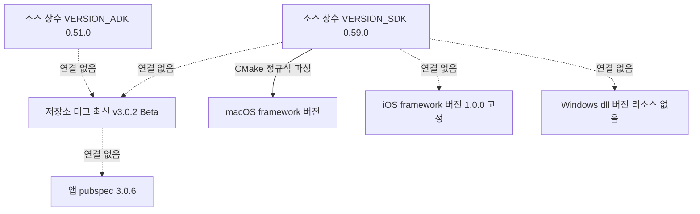

# Phase 2 — 배포 패키지·버전 자동화 (B2)

> **상태**: 미시작 (2-B 만 `[선행 가능]`)
> **범위**: `sonex-framework` 산출물을 [goal.md B2](../goal.md) 의 **8구성 패키지**로 자동 생성하고, 그 패키지에서 소스 커밋을 역추적한다. **API 계약(B3)·렌더 경계는 건드리지 않는다** — 여기서 만드는 것은 "무엇을 담아 내보내는가"이지 "무엇을 노출하는가"가 아니다.
> **선행**: [Phase 1](./phase1-regression-baseline.md)
> **후행**: [Phase 3](./phase3-layer-boundary.md) 이후 전부. 예외로 **2-G 의 게이트 활성화만 Phase 3-K 로 넘어간다**
> **근거**: [goal.md B2·B4](../goal.md) · [gap.md §6·§8](../gap.md) · [plan.md Phase 2](../plan.md)

---

## 1. 배경

### 1.1 버전 장치가 **있다** — 손으로 유지되고, 서로 이어져 있지 않을 뿐

Phase 1(테스트·CI)과 달리 여기는 백지가 아니다. 이 사실을 먼저 세운다.

| 있는 것 | 실측 위치 |
|---|---|
| SDK 버전 상수 | `sdk/include/HCCommon.h:43-47` — `VERSION_SDK_MAJOR/MINOR/PATCH/BUILD` = **0.59.0 / Build 100** |
| ADK 버전 상수 | `sdk/adk/Main/shared/HCSonexADK.cpp:110-113` — `VERSION_ADK` = **0.51.0** |
| 모듈·필터 버전 상수 | `constexpr int VERSION_*` **42개 이름 / 38파일**(샘플·벤더 제외). 부분 상수 7개를 빼면 **35개 값**, 그중 33개가 모듈·필터 단위 |
| 런타임 조회 경로 | `REQUEST_GET_SDK_VERSION = 0x00000002`(`HCRequestCommands.h:37`) → `SonexSDK::parseGetSdkVersion`(`HCSonexSDK.cpp:1342`) |
| 태깅 규약 문서 | `docs/VERSION_TAGGING.md` — semver 2.0.0 명시, 태그 생성·삭제·push 절차까지 기술 |
| 태그 | **16개** |

**그런데 이 여섯이 서로를 참조하지 않는다.** 하나를 바꿔도 나머지가 따라가지 않으며, 그것을 잡아 줄 자동 판정이 없다(CI 설정 파일 **0건** — `.github`·`gitlab-ci`·`jenkins`·`azure-pipelines`·`.arcconfig` 전부 부재).

### 1.2 버전 이름공간이 다섯이고, 연결이 없다



| # | 실측 | 근거 |
|---|---|---|
| 1 | **소스 상수와 태그가 어긋난다** — 소스는 `0.58.0`→`0.59.0` 으로 올라갔는데 **v0.58·v0.59 태그가 없다.** 최신 태그 `v3.0.2-Beta`(2026-05-05)에서 **master 가 119커밋 앞서** 있다 | `git log -- sdk/include/HCCommon.h` · `git rev-list --count v3.0.2-Beta..HEAD` = 119 |
| 2 | **major 가 0.5x 에서 3.0.x-Beta 로 점프**했는데 소스 상수는 여전히 `0.x` 다. 태그 메시지는 SRI 필터 교체 내용이고 **호환성 파괴 선언이 없다** | `git tag -l -n20 v3.0.1-Beta` |
| 3 | **플랫폼 접미사 태그** `v1.0.0-macos`(2025-10-12)가 `v0.5x` 계열(2025-12~)보다 **먼저** 있다 | 태그 목록 |
| 4 | **소급 태깅** — `v0.50.0`~`v0.53.2` **6개가 2026-01-08 한날** 붙었고, 대상 커밋은 2025-12-16~2026-01-08 에 흩어져 있다 | `for-each-ref taggerdate` vs 커밋일 |
| 5 | **lightweight 태그 2건** — `adk_v0.51.0`·`v0.57.0` 은 태그 객체가 없다(`objecttype=commit`). 게다가 `adk_` 접두는 이 하나뿐이다 | 〃 |
| 6 | **앱과 이어지는 선이 없다** — `sonex-app` `pubspec.yaml:19` 은 `3.0.6+1` 이고, 앱은 요청 코드 이름만 매핑할 뿐 SDK 버전을 **검사하지 않는다** | `home_controller.dart:58` |

### 1.3 산출물에 버전이 박히지 않는다 — 플랫폼마다 다른 이유로

| 플랫폼 | 스탬프 경로 | 실측 |
|---|---|---|
| macOS | `HCCommon.h` 를 **정규식으로 읽어** framework `VERSION` 설정 | `sdk/sdk/Main/macos/CMakeLists.txt:126-142` — **유일하게 소스와 이어진 경로** |
| iOS | framework `VERSION 1.0.0` **하드코딩** | `sdk/sdk/Main/ios/CMakeLists.txt:148-149`. 같은 파일 166-170 의 `VERSION_SDK_*`·`VERSION_SDK_HEX` 는 **어디에서도 쓰이지 않는 죽은 코드**(전수 검색 결과 정의부 1건뿐) |
| Windows | **없음** — `.rc` 파일이 저장소에 **0건**이라 DLL 에 버전 리소스가 붙지 않는다 | `git ls-files '*.rc'` |
| Android | **없음** — `ndk-build`·`android.vcxproj` 어디에도 버전 주입 단계가 없다 | `build_all_android.sh` |

커밋된 macOS 산출물이 이 결과를 그대로 보여 준다 — `sdk/sdk/Main/macos/build/SonexSDK.framework/Versions/A/Resources/Info.plist` 의 **`CFBundleVersion`·`CFBundleShortVersionString` 이 둘 다 빈 문자열**이다.

> **iOS 의 죽은 코드에는 사고 기록이 남아 있다.** `ios/CMakeLists.txt:172-174` 주석이 *"CMake 매크로 expansion 시 `constexpr int 100 = 100;` 형태로 충돌 발생"* 이라고 적는다. 컴파일 정의로 버전을 주입하려다 소스 상수와 충돌했고, 정의를 걷어내면서 `set(...)` 만 남았다. **버전 주입을 다시 설계할 때 밟지 말아야 할 지뢰가 이미 표시돼 있다.**

### 1.4 산출물의 모양이 플랫폼마다 다르다 — 2-A 가 가장 먼저 부딪히는 것

| 축 | Windows | Android | iOS | macOS |
|---|---|---|---|---|
| SDK | `sdk.sln` → **DLL 8개** | `android.vcxproj` 8개 → `.so` 8개 | CMake → **`SonexSDK.framework` 1개** | CMake → **`SonexSDK.framework` 1개** |
| ADK | `framework.sln` → **DLL 6개** | `android.vcxproj` 6개 → `.so` 6개 | `.xcodeproj` 6개 | **없음** |
| 구성 | `Debug/Release × x86·x64·ARM·ARM64` = 8 | `APP_ABI=arm64-v8a` 단일 | arm64 | arm64 |

**같은 SDK 가 Windows·Android 에서는 바이너리 8개, Apple 에서는 1개다.** Apple 쪽은 `file(GLOB ...)` 로 전 모듈 소스를 한 타깃에 몰아넣기 때문이다(`macos/CMakeLists.txt:32-60`). 패키지 레이아웃을 플랫폼 공통으로 잡을 수 없다는 뜻이고, 8구성 중 **구성 1(네이티브 바이너리)의 정의가 플랫폼마다 갈린다.**

두 가지가 더 붙는다.

- **바이너리 이름이 일반명이다** — Windows 14개 타깃 중 접두가 붙은 것은 `SonexCommon`·`SonexSDK`·`SonexFramework` **3개뿐**이고, 나머지는 `DeviceManager.dll`·`ImageFilter.dll`·`DatabaseHelper.dll`·`NetworkProcess.dll`·`VideoEncoder.dll` 처럼 **고객사 앱 디렉토리에서 충돌하기 쉬운 이름**이다. 앱이 이 이름들을 의존 순서대로 손으로 로드한다(`adk_native_methods.dart:242-295`)
- **ADK 본체의 산출물 이름이 `SonexFramework` 다** — 제품 명칭(ADK)과 파일명이 어긋난다(`sdk/adk/Main/windows/windows.vcxproj` `TargetName`)

### 1.5 패키징의 원형도 이미 있다 — 목적지가 샘플 앱일 뿐

| 자산 | 하는 일 | 한계 |
|---|---|---|
| `scripts/deploy_android_jnilibs.sh` | `sdk/_out/<Platform>/bin/<Config>` 에서 `.so` 를 걷어 **ABI 4종 매핑**(arm64-v8a·armeabi-v7a·x86_64·x86)으로 배치. 모듈은 `lib<M>.so` → `lib<M>_Android.so` 로 리네임, 서드파티(openssl·ffmpeg)는 원본명 유지. **상대 경로 기반** | 목적지가 `Android_SampleApp/.../jniLibs` — **배포물이 아니라 샘플 앱** |
| `sdk/adk/workspace/copy_dependencies.bat` | 서드파티 DLL(cpr·dcmtk·sqlite3·zlib)을 `_out` 으로 수집. `%~dp0` 기반 **상대 경로** | 목적지가 빌드 출력 폴더. Debug/Release 만 구분 |

**2-F 는 새 스크립트를 짓는 것이 아니라 이 둘의 목적지를 `dist/` 로 돌리고 제외 필터를 씌우는 일에 가깝다.**

반면 **빌드 진입점 쪽은 승격 대상이 아니다.** 벤더·샘플을 뺀 빌드/배포 스크립트 **15개 중 9개가 개발자 머신에 묶여 있다** — `C:\work\flutter\sonex-framework` 5건(`.bat`), `/Users/rio/work/sonex-framework` 4건(`.sh`). **서로 다른 두 대의 머신**이다.

### 1.6 공백은 넷이다

| # | 공백 | 내용 |
|---|---|---|
| 1 | **자동 경로가 없다** | CI 설정 0건. 산출물↔커밋 역추적 수단이 **버전 문자열밖에 없는데 그 문자열조차 산출물에 없다** |
| 2 | **재배포 고지가 없다** | `sdk/adk/library/` 추적 파일 **2,600건에 LICENSE·COPYING·NOTICE 가 0건**. 저장소 전체 라이선스 파일은 4건(CVIE `COPYRIGHT.txt` 3 + `nlohmann_json/LICENSE.MIT` 1) |
| 3 | **내보내면 안 되는 것이 섞여 있다** | CVIE 상용 라이선스 키 1건 + `CONTEXTVISION COMPANY CONFIDENTIAL` 표기 파일 **5건**(§2-A) |
| 4 | **빌드가 매트릭스로 돌아 본 적이 없다** | 커밋된 `build_adk_arm64_log1.txt` 가 **NuGet 복원 누락 2건 + `-lSonexCommon` 링크 실패 3건**으로 끝난다 |

### 1.7 범위 한계

이 phase 가 만드는 것은 **패키지 생성 파이프라인**이다.

| 여기서 한다 | 여기서 하지 않는다 |
|---|---|
| 8구성의 저장소 경로 매핑·제외 목록 | 공개 헤더 심볼 정본화 → [Phase 3](./phase3-layer-boundary.md) 3-F |
| 버전 스탬프·태깅 규약·호환 조합 선언 | wrapper 정본 수집 → Phase 5 (구성 4는 **자리만 잡고 내용은 비운다**) |
| 빌드 매트릭스·패키징·게시 대상 | 샘플 재편·신규 작성 → Phase 6 (구성 5도 동일) |
| `SDK-only` **구성 추가** | `SDK-only` **게이트 활성화** → Phase 3-K |
| 서드파티 인벤토리·고지 생성 | **재배포 권한 자체의 확보** — 계약 문제이며 코드로 판정 불가 |

> **구성 4·5 를 "비운 채로 자리만 잡는" 것이 의도된 설계다.** Phase 5·6 이 산출물을 내놓을 때 패키징 스크립트를 다시 짜지 않고 채워 넣기만 하면 되게 한다. 대신 **§3 검증에서 그 두 칸이 비어 있음을 명시적으로 실패가 아닌 것으로 판정**한다.

---

## 2. 진행 단계

### Step 2-A. 패키지 구성 확정

[goal.md B2](../goal.md) 의 8구성을 저장소 산출물 경로에 **1:1 로 매핑**한다. 매핑되지 않는 칸은 비운 채로 남기고 어느 Phase 가 채우는지 적는다.

| 구성 | 저장소 산출물 | 상태 |
|---|---|---|
| 1 네이티브 바이너리 | Windows `sdk/_out/<Platform>/bin/<Config>/*.dll`(SDK 8·ADK 6) · Android `lib*.so` · Apple `SonexSDK.framework` | **플랫폼마다 모양이 다르다**(§1.4). 레이아웃을 플랫폼별로 정의 |
| 2 공개 헤더 | `sdk/include/` **120파일** vs CMake `PUBLIC_HEADER` **2파일**(`HCSonexSDK.h`·`HCSonexSDKInterface.h`) | **정의가 둘로 갈린다.** 이 단계에서는 `PUBLIC_HEADER` 를 정본으로 삼고, 집합 확정은 3-F |
| 3 의존 서드파티 | `sdk/adk/library/` 13개 · `sdk/third_party/` 3개 · **ANGLE 은 저장소에 없다** | ANGLE 은 Phase 0-A 산출물을 받는다 |
| 4 언어별 wrapper | **없음** — 자리만 만든다 | Phase 5 |
| 5 샘플 | **없음** — 자리만 만든다 | Phase 6 |
| 6 문서 | `docs/` 중 외부용만 선별 | 내부 TODO·진행보고는 제외(아래) |
| 7 라이선스 고지 | **0건** — 생성해야 한다 | 2-F-5 |
| 8 버전 메타 | **없음** — 생성해야 한다 | 2-B |

| # | 작업 |
|---|---|
| A-1 | 위 표를 `ci/package_manifest.yaml` 로 고정한다. **allowlist 형식** — 담을 것을 열거하고 나머지는 담지 않는다 |
| A-2 | **제외 목록을 별도로 명시**한다(아래). allowlist 라도 제외 목록을 따로 두는 이유는, 실수로 allowlist 에 들어왔을 때 **빌드를 실패시키기 위해서**다 |
| A-3 | 플랫폼별 레이아웃 3종 정의 — Windows(DLL 다수) · Android(ABI 별 `.so`) · Apple(`.framework` 단일) |
| A-4 | **모델 아티팩트 처리 결정** — `HNSFilter_macOS.mm:44-45` 등 4파일이 `[NSBundle mainBundle]` 에서 `UltrasoundDenoiser.mlmodelc` 를 찾는다. **SDK framework 가 아니라 통합자 앱 번들**이고, 저장소에는 컴파일 전 `.mlpackage` 만 있다. 패키지에 `.mlmodelc` 를 동봉하고 임베드 지침을 문서 구성에 넣는다 |

**제외 목록** `[실측]`

| 대상 | 실측 | 사유 |
|---|---|---|
| `sdk/third_party/context_vision/license_key/ID-0001200-001.cov` | 1파일 4,490 B | **상용 라이선스 키** |
| CVIE `READMESDK.txt`·`README_CVIESDK.txt` | **5파일**(android 2 · ios 1 · windows 2), 첫 줄 `CONTEXTVISION COMPANY CONFIDENTIAL`(Copyright 2011-2022 ContextVision AB) | **기밀 표기 문서의 제3자 전달** |
| `sdk/ai_models/.../pytorch/*.pth` · `scripts/convert_*.py` | 학습 원본 1 + 변환 스크립트 3 | 배포 대상이 아니다. 추론 아티팩트(ONNX·CoreML)만 담는다 |
| `sdk/ai_models/.../docs/cvie_replacement_plan.md` 외 내부 문서 | 4파일 | **상용 벤더 대체 계획**이라 외부 전달 부적절 |
| `sdk/sdk/Main/macos/build/` | **194파일** | 커밋된 빌드 산출물. Phase 0-E 가 저장소에서 제거하지만, 제거 전이라도 패키지에는 들어가지 않아야 한다 |
| `build_adk_arm64_log1.txt` · 개발자 머신 경로 스크립트 9건 | — | `C:\Users\Rio\...`·`/Users/rio/...` 경로 노출 |
| `docs/sdk/*_TODO.md` · `*_PROGRESS_REPORT.md` · `*_HANDOFF.md` 등 | — | 내부 진행 문서. 구성 6 의 "문서"와 구분한다 |

> **CVIE 재배포 조건은 이 단계에서 확정되지 않는다.** ContextVision↔힐세리온 계약서가 저장소에 없고, `COPYRIGHT.txt` 3벌은 **CVIE 가 포함한 서브컴포넌트**(Khronos·NVIDIA 등) 고지이지 계약이 아니다([gap.md §8.1](../gap.md)). **`.cov`·기밀 문서를 빼는 것은 "재배포해도 된다"는 판정이 아니라 "명백히 빼야 할 것을 뺀 것"일 뿐이다.** 바이너리(`libcvie64.so`·`cvie64.framework`·`cvie64.dll`, 82MB)의 재배포 가부는 **미확인**으로 남으며, 계약 확인 전까지 패키지의 CVIE 포함 여부를 결정할 수 없다 → 2-H 선행 질의.

### Step 2-B. 버전 스탬프 자동화 `[선행 가능]`

**재배치(0-0) 전에도 만들 수 있다.** 생성기는 git 저장소와 출력 경로만 알면 되고 `sonex-framework` 코드를 건드리지 않는다 — [legacy/proof/protocol-sot](../legacy/proof/protocol-sot/) 의 `reconcile.py` 와 같은 선례다.

| # | 작업 |
|---|---|
| B-1 | `ci/version_stamp.py` — git 상태에서 헤더 1벌을 생성한다. **손으로 고치는 파일이 아니라는 것을 파일 자체가 선언**하게 한다 |
| B-2 | **방향을 하나로 정한다** — 지금은 `HCCommon.h` 를 손으로 올리고 태그를 나중에 붙인다(0.58.0·0.59.0 은 태그가 없다). 생성 헤더는 **git 을 단일 출처**로 삼고, `VERSION_SDK_*` 는 그대로 두되 **둘이 어긋나면 빌드를 실패**시킨다 |
| B-3 | 4개 빌드 계통에 주입 — macOS 는 기존 정규식 파싱을 생성 헤더 참조로 교체, **iOS 는 하드코딩 `1.0.0` 제거**, Windows 는 `.rc` 신설, Android 는 `ndk-build` 전처리 |
| B-4 | **`ios/CMakeLists.txt:166-170` 죽은 코드 제거** — 매크로 충돌 사고의 잔해다(§1.3) |
| B-5 | **재현성 확보** — 빌드 시각·호스트명을 넣지 않는다. 넣으면 같은 커밋에서 두 번 빌드한 결과가 달라져 §3.6 을 통과할 수 없다 |
| B-6 | 런타임 노출 — `REQUEST_GET_SDK_VERSION` 응답에 커밋 SHA 필드를 추가한다. 지금 응답은 `major*1000000 + minor*1000 + patch` 정수 하나뿐이라(`HCSonexSDK.cpp:1342-1354`) **역추적이 불가능하다** |

```c
// ci/version_stamp.py output -- generated, do not edit
#define HC_VERSION_STRING   "0.59.0"
#define HC_VERSION_COMMIT   "f336e25b"
#define HC_VERSION_DESCRIBE "v3.0.2-Beta-119-gf336e25b"
#define HC_VERSION_DIRTY    0
```

> **`HC_VERSION_DESCRIBE` 가 §1.2 의 어긋남을 그대로 드러낸다** — 최신 태그가 `v3.0.2-Beta` 인데 소스 상수는 `0.59.0` 이고 그 사이가 119커밋이다. **이 문자열을 산출물에 굽는 순간 2-C 를 미룰 수 없게 된다.** 순서가 그렇게 짜여 있다.

### Step 2-C. 태깅 규약 정상화

**0-H 가 하는 것은 `VERSION_TAGGING.md` 의 머지 충돌 마커 제거(커밋 `9ac1bfd4`)까지다.** 규약 본문을 실제 태그와 맞추는 것은 여기다.

| # | 작업 |
|---|---|
| C-1 | **이름공간 확정** — 한 저장소가 SDK·ADK 를 함께 낸다. 접두를 쓸지(`sdk/vX.Y.Z`·`adk/vX.Y.Z`) 단일 번호로 갈지 정한다. 지금은 `adk_v0.51.0` **1건만** 다른 접두를 쓴다 |
| C-2 | **플랫폼 접미사 금지** — `v1.0.0-macos`. 플랫폼 지원 상태는 태그 메시지와 지원 매트릭스(Phase 6-E)로 표현한다. 규약 문서 자체가 이미 *"플랫폼별 지원 상태는 태그 메시지와 문서에 기록"* 이라 적고 있다 — **문서가 아니라 실행이 이탈했다** |
| C-3 | **annotated 강제** — lightweight 2건(`adk_v0.51.0`·`v0.57.0`). CI 가 태그 객체의 메타를 읽으므로 형식을 고정해야 한다 |
| C-4 | **소급 태깅 금지** — 6개가 한날 붙은 이력이 있다. CI 가 **태그 push 를 트리거로 패키지를 만들면** 소급 태그는 그 시점 환경으로 다시 빌드돼 원본과 달라진다 |
| C-5 | **`0.5x` → `3.0.x-Beta` 점프의 의미 확정** — 태그 메시지에 호환성 파괴 선언이 없고 소스 상수는 `0.x` 로 남아 있다. **앱 버전(3.0.6)에 맞추려던 것인지 SDK 자체의 major 승격인지 코드로 판정할 수 없다** → **미확인**, 힐세리온 질의 |
| C-6 | **태그 공백 해소** — master 가 최신 태그보다 119커밋 앞서 있고 소스 상수는 두 번 올랐다. 착수 시점의 tip 에 기준 태그를 하나 세운다 |

### Step 2-D. 앱↔SDK 호환 조합 선언

지금은 **앱이 어느 SDK 빌드와 짝인지 저장소에서 확인할 수단이 없다**([gap.md §6](../gap.md)). 앱은 `REQUEST_GET_SDK_VERSION` 을 **이름으로만 알고 검사하지 않는다**(`home_controller.dart:58`).

| # | 작업 |
|---|---|
| D-1 | **선언 파일 신설** — `COMPATIBILITY.md` + 기계 판독용 `compatibility.json`. 축은 앱 버전 × SDK 버전 × ADK 버전. **모델·펌웨어 축은 여기서 다루지 않는다**(Phase 6-E) |
| D-2 | **런타임 검사 추가** — 앱이 연결 직후 SDK 버전을 조회해 최소 호환 버전 미만이면 **명확한 오류를 반환**한다. 지금은 조회 자체를 하지 않는다 |
| D-3 | **기존 자산을 형태로 재사용** — `HCFirmwareVersionChecker`(`sdk/adk/Main/shared/`)가 이미 **모델 계열별 펌웨어 호환 레벨**(`MustUpgrade`·`MayUpgrade`·`Latest`·`NotUpgrade`)을 판정하고, **저장소에서 유일한 실질 단위테스트**(`test_firmware_version_checker.cpp`)가 붙어 있다. 같은 형태를 앱↔SDK 축으로 만든다 — **새 개념을 들이는 것이 아니다** |
| D-4 | **모듈 단위 버전의 처리 결정** — 모듈·필터 상수 33개는 외부 계약이 아니다. **패키지 메타에 넣을지 내부로 남길지 정한다.** 넣는다면 갱신 자동화가 함께 필요하고, 안 넣는다면 `REQUEST_GET_*_VERSION` 응답에서의 의미를 문서에 적는다 |

> **D-4 에는 이미 표류 위험이 실재한다** — `VERSION_COMMON`·`VERSION_IMAGE_FILTER`·`VERSION_DICOM_HANDLER`·`VERSION_DEFAULT_B_FILTER` 는 **각각 두 파일에 따로 정의**돼 있다. 값이 지금은 같지만 갱신 시 한쪽만 바뀌는 것을 막는 장치가 없다.

### Step 2-E. 멀티플랫폼 빌드 매트릭스 자동화

Phase 0-F 의 단일 진입점 위에 올린다. **관측된 실패를 그대로 매트릭스의 요구사항으로 삼는다.**

| # | 작업 |
|---|---|
| E-1 | **매트릭스 확정** — Windows `Debug/Release × x86·x64·ARM·ARM64` · Android ABI(현재 `arm64-v8a` 단일이나 배포 스크립트는 **4종을 매핑**한다 — 어느 쪽이 정본인지 먼저 정한다) · iOS arm64 · macOS arm64 · headless(0-G). **macOS ADK 는 존재하지 않으므로 빈칸으로 명시**한다 |
| E-2 | **NuGet 복원 단계를 포함한다** — 관측된 `NETSDK1004` **2건**(`Framework_Sample_Windows`·`ADK_Sample_Test`, `project.assets.json` 부재). C# 프로젝트 빌드 앞에 복원을 명시적으로 넣지 않으면 **이 실패가 그대로 재현된다** |
| E-3 | **모듈 링크 순서 확정** — 관측된 `ld: error: unable to find library -lSonexCommon` **3건**(ADK android 의 `DicomHandler`·`NetworkProcess`·`VideoEncoder`). `SonexCommon` 을 먼저 만들고 라이브러리 경로를 넘기는 의존 그래프를 빌드 시스템에 세운다 |
| E-4 | **Android 진입점 이중화 해소** — `build_all_android.sh`(ndk-build, `Android.mk` 인라인 생성, **모듈 2개만** 빌드: `SonexCommon`·`DeviceManager`)와 `android.vcxproj` **14개**가 병존한다. **전자는 SDK 전체를 만들지 못한다** — 하나를 정본으로 정한다 |
| E-5 | **`file(GLOB)` 제거** — Apple 빌드가 모듈 소스를 glob 으로 모은다. 파일이 추가·삭제돼도 CMake 재실행 전까지 반영되지 않아 **같은 커밋에서 다른 산출물이 나올 수 있다.** 소스 목록을 명시로 바꾼다 |
| E-6 | **출력 경로 통일** — MSBuild `OutDir` 은 `sdk/_out/<Platform>/bin/<Config>/` 인데 `build_all_android.sh` 는 `sdk/sdk/_out/ARM64/bin/Release` 를 쓴다(**한 계층 다르다**). 수집 스크립트가 두 곳을 뒤지지 않도록 하나로 |
| E-7 | **머신 의존 제거 확인** — Phase 0-D 가 절대경로를 없애야 매트릭스가 성립한다. 착수 시 15개 스크립트 중 남은 것이 없는지 재확인 |

> **E-2·E-3 이 이 단계의 핵심이다.** 나머지는 정리지만 이 둘은 **실제로 관측된 실패**이고, 고치지 않으면 매트릭스를 아무리 잘 짜도 첫 실행이 같은 지점에서 멈춘다.

### Step 2-F. 패키징 스크립트

| # | 작업 |
|---|---|
| F-1 | `ci/package.py` — 2-A 의 manifest 를 읽어 `dist/<platform>/` 아래 아카이브를 만든다 |
| F-2 | **기존 스크립트 승격** — `deploy_android_jnilibs.sh` 의 목적지를 샘플 앱 → `dist/`, `copy_dependencies.bat` 의 서드파티 수집 목록을 manifest 로 이동. **둘 다 이미 상대 경로 기반**이라 그대로 쓸 수 있다 |
| F-3 | **제외 필터를 빌드 실패로 연결** — 제외 목록(§2-A)의 파일이 `dist/` 에 나타나면 exit 1. 경고가 아니라 실패여야 한다 |
| F-4 | **바이너리 이름 정책 적용** — 일반명 DLL 11개에 접두를 붙일지, 서브디렉토리로 격리할지 정한다. **이름을 바꾸면 앱의 수동 로드 목록**(`adk_native_methods.dart:242-295`)**이 함께 바뀐다** — 앱 저장소 트랙과 동기화가 필요하므로 이 단계에서 결정만 하고 반영 시점을 합의한다 |
| F-5 | **라이선스 고지 생성** — 서드파티 인벤토리(구성요소·버전·라이선스·재배포 조건)를 만들고 `THIRD_PARTY_NOTICES` 를 자동 생성한다. **원본 라이선스 텍스트가 저장소에 없으므로**(§1.6-2) 벤더별로 회수해 `ci/licenses/` 에 고정한다 |
| F-6 | **결정론 판정** — 같은 커밋에서 두 번 패키징해 아카이브 내용이 동일한지 확인. 타임스탬프·경로 절대화가 이 판정에서 걸린다 |
| F-7 | **체크섬 동봉** — 구성별 SHA-256. 2-H 가 정해지기 전에도 산출물의 동일성을 확인할 수 있게 한다 |

> **F-5 의 FFmpeg 는 정책이 확정됐다 — LGPL 전용 구성만 배포한다**(2026-07-30 결정, [phase0 Step C-6](./phase0-build-reproducibility.md)). 번들 빌드(`ffmpeg 4.0.2`·`4.1.4`)의 GPL 구성 여부가 **여전히 미확인**이므로([gap.md §8](../gap.md)), 인벤토리 작성 시 바이너리에서 GPL 전용 컴포넌트(libx264·libx265·libxvid 등) 링크 여부를 먼저 확인한다. **하나라도 걸리면 그 번들은 배포 후보에서 제외하고 `--disable-gpl`(vcpkg `gpl` feature 비활성) 로 재빌드**한다 — "GPL이면 어떻게 할지"를 그때 판단하는 것이 아니라, 처음부터 LGPL 결과만 통과시킨다.

### Step 2-G. `SDK-only` 빌드 구성 추가 — **게이트는 켜지 않는다**

**Windows 는 이미 구조적으로 성립한다** — `sdk.sln` 에 `adk` 문자열이 **0건**이고, 역으로 `framework.sln`(ADK)도 SDK 모듈을 참조하지 않는다(공유는 `SonexCommon` 뿐). **문제는 Apple 쪽 하나다.**

| # | 작업 |
|---|---|
| G-1 | Windows 확인만 — `sdk.sln` 에 ADK 참조 0건을 CI 판정 가능한 형태(스크립트)로 고정 |
| G-2 | **Apple 이 막힌다** — `sdk/sdk/Main/ios/CMakeLists.txt` 가 `../adk/library/{angle_ios,freetype_ios,opencv_3.4.6_ios,openssl-1.1.1d_ios}` 를 **10곳**에서 참조한다. macOS 는 `adk` 참조가 **0건**이라 이미 중립이다 — **이탈은 iOS 국소적이다** |
| G-3 | 구성 이름을 정의하고(`SDK_ONLY`) 매트릭스에 항목으로 넣되 **판정에서 제외**한다 |
| G-4 | **게이트 활성화는 Phase 3-K** — 3-A(iOS 빌드 역방향 제거)가 끝나야 통과할 수 있다. **2-G 시점에 실패하는 것이 정상**이며, 이 사실을 CI 설정에 주석이 아니라 **구성으로** 표현한다(allow-failure 항목) |

### Step 2-H. 아티팩트 게시 대상 결정 — **선행 질의가 먼저다**

**힐세리온에 CI 인프라 자체가 없다**([dev-environment.md §2.2](../../review/dev-environment.md), conduit 31건 CI 0건). 우리가 도구를 고르는 것이 아니라 **질의 목록을 만들고 답이 오기 전까지 도구 중립으로 짓는 것**이 이 단계의 내용이다.

| # | 질의 항목 |
|---|---|
| H-1 | CI 실행 환경 — Phabricator Harbormaster · GitHub Actions · 사내 러너 중 무엇을 쓸 것인가. **저장소가 Phabricator 에 있고 GitHub 미러가 없다** |
| H-2 | 아티팩트 저장소 — 패키지에 서드파티가 포함되므로 **용량이 실제 제약**이다. 저장소 2.0GB 중 벤더 프리빌트만 1,128MB 이고, 그 상당량이 패키지에 들어간다 |
| H-3 | 고객사 전달 경로 — 게시 위치가 곧 접근 통제 대상이다. **CVIE 포함 여부(§2-A)가 여기서 갈린다** |
| H-4 | 서명 — Windows Authenticode · Apple codesign/notarization. **의료기기 SW 라 서명 정책이 GMP 문서 체계와 얽힐 수 있다**([dev-environment.md §2.5](../../review/dev-environment.md)) |

| # | 작업 |
|---|---|
| H-5 | 답이 오기 전까지 **로컬 `dist/` + 체크섬(2-F-7)** 으로 성립시킨다. 게시 단계만 비워 두고 나머지를 완성한다 |
| H-6 | 게시 스크립트는 **업로드 대상을 인자로** 받는다. 도구가 정해질 때 스크립트를 다시 짜지 않게 한다 |

---

## 3. 검증

| # | 항목 | 명령 | 기대 |
|---|---|---|---|
| 3.1 | 태그 하나로 재생성 | 태그 push → CI | 8구성 패키지 산출 |
| 3.2 | **역추적** | 산출물에서 커밋 회수 | `HC_VERSION_COMMIT` 이 태그 커밋과 일치 |
| 3.3 | **버전 일치** | 소스 상수 vs 태그 vs 산출물 메타 | **셋이 같다.** 다르면 빌드 실패 |
| 3.4 | 플랫폼 커버리지 | Windows · Android · iOS · macOS | **4개 전부** (미달 시 숫자 명시) |
| 3.5 | **제외 목록** | `.cov` · CONFIDENTIAL 5파일 · `.pth` · 내부 문서 | `dist/` 에 **0건**. 1건이라도 있으면 exit 1 |
| 3.6 | **결정론** | 같은 커밋 2회 패키징 | 아카이브 내용 동일 |
| 3.7 | 서드파티 고지 | 13 벤더 + CVIE + ANGLE | **인벤토리 항목수 = 고지 항목수** |
| 3.8 | 빌드 매트릭스 | NuGet 복원 · `SonexCommon` 링크 | 관측된 실패 **5건 전부 재현되지 않는다** |
| 3.9 | `SDK-only` 구성 | 구성 존재 여부 | **존재한다. 통과는 요구하지 않는다**(3-K) |
| 3.10 | 구성 4·5 | wrapper · 샘플 칸 | **비어 있어도 실패가 아니다.** 단 manifest 에 자리와 담당 Phase 가 적혀 있어야 한다 |
| **3.11** | **FFmpeg 라이선스 구성** | 번들 `.so`/`.dll`/`.a`/`.framework` 심볼 스캔(`nm`/`strings`)으로 GPL 전용 심볼(`x264_`·`x265_`·`xvid_` 등) 검사 | **0건.** 1건이라도 있으면 exit 1 — LGPL 정책(phase0 C-6) 위반 |

> **3.3 이 진짜 게이트다.** 나머지는 "만들었는가"를 묻지만 3.3 은 **§1.2 의 다섯 이름공간이 실제로 하나로 합쳐졌는가**를 묻는다. 이 검증이 서면 `0.58.0`·`0.59.0` 이 태그 없이 지나가는 일이 구조적으로 불가능해진다.

---

## 4. 위험 · 대응

| 위험 | 영향 | 대응 |
|---|---|---|
| **CVIE 재배포 권한을 확인하지 못한다** | 패키지에 CVIE 를 넣을지 뺄지 정할 수 없어 구성 3 이 미완 | **`.cov`·기밀 문서 제외는 권한과 무관하게 지금 한다.** 바이너리 포함 여부만 미결로 남기고, 패키지를 **CVIE 포함/미포함 두 변형**으로 만들 수 있게 manifest 를 설계한다. macOS 가 **이미 CVIE 없이 도는 실증**이라([sonex-framework.md §8.3](../../review/sonex-framework.md)) 미포함 변형이 가상의 구성이 아니다 |
| **FFmpeg 번들이 GPL 구성일 수 있다** | 고객사 재배포 조건이 근본적으로 달라진다 | **정책: LGPL 전용 구성만 배포**(2026-07-30 결정, phase0 C-6). 인벤토리에서 빌드 구성을 먼저 확정(F-5) — GPL 전용 컴포넌트가 확인되면 그 번들은 배포하지 않고 `--disable-gpl` 로 재빌드한다. Phase 0-C(vcpkg 전환) 의 `ffmpeg` 포트에서도 `gpl` feature 를 켜지 않는다 |
| **ANGLE 이 확보되지 않는다** | 구성 3 이 채워지지 않고 Apple·Windows 패키지가 성립하지 않는다 | Phase 0-A 선행. **회수 전에는 매니페스트에 자리만 만들고 패키징을 통과시키지 않는다** — 조용히 빠진 채로 나가는 것이 더 나쁘다 |
| 태그 규약 정상화가 **기존 태그를 건드린다** | 이미 배포된 산출물과의 연결이 끊긴다 | **기존 태그를 지우거나 옮기지 않는다.** 규약은 착수 시점 이후 태그에만 적용하고, 이전 태그는 `VERSION_TAGGING.md` 에 **예외 이력으로 기록**한다 |
| **`0.5x` → `3.0.x` 의 의미가 확정되지 않는다** | 2-C·2-D 가 어느 번호 체계 위에 서는지 정해지지 않는다 | C-5 를 힐세리온 질의로 올린다. 답이 오기 전에는 **착수 시점 tip 에 새 기준 태그를 세우고**(C-6) 그 위에서만 규약을 적용한다 |
| 바이너리 이름 변경이 **앱을 깨뜨린다** | 앱이 DLL 을 이름으로 수동 로드한다 | F-4 는 **결정만** 하고 반영은 앱 트랙과 동기화. 과도기에는 **구 이름 별칭을 함께 배치**한다 |
| 패키지 용량이 아티팩트 저장소를 넘는다 | 게시 자체가 불가 | H-2 를 선행 질의로. 벤더 프리빌트를 패키지 안에 넣을지 **별도 다운로드로 뺄지**를 함께 묻는다 |
| **CI 인프라 결정이 늦어진다** | 2-A~2-G 가 완성돼도 자동 실행되지 않는다 | 전 단계를 **도구 중립 스크립트**(`ci/` 아래 Python·셸)로 짓는다. CI 설정 파일은 그 스크립트를 호출하는 얇은 층이 되게 한다. **이렇게 하면 인프라가 정해질 때 다시 짜지 않는다** |
| 패키징 파이프라인 자체의 회귀 | 어느 시점부터 잘못 담기는데 아무도 모른다 | **Phase 1 의 하니스로 판정한다** — 이 phase 가 Phase 1 뒤에 오는 이유다. 3.5·3.6 을 커밋마다 돌린다 |

---

## 5. 이 phase 가 여는 것


Phase 3~6 이 만드는 것이 전부 이 파이프라인의 **칸을 채우는 일**이 된다 — Phase 3-F 는 구성 2(공개 헤더)의 집합을, Phase 5 는 구성 4(wrapper)를, Phase 6 은 구성 5(샘플)와 구성 6(문서)을 확정한다. **자리가 먼저 있어야 그 산출물들이 "만들었다" 로 끝나지 않고 "배포된다" 까지 간다.**

그리고 [goal.md §2](../goal.md) 가 지적한 **"완성 기준이 존재한 적이 없다"** 에 대한 첫 실물 답이 여기서 나온다. B2 의 판정 방법 세 가지 — ① 산출물에 버전이 박혀 있고 ② 그 버전으로 커밋이 역추적되며 ③ 앱↔SDK 조합이 선언돼 있을 것 — 이 각각 §3.2·§3.3·2-D 에 대응하고, **전부 명령 한 줄로 판정된다.**

> **2-B 는 지금 시작할 수 있다.** 재배치를 기다리지 않는다. 그리고 그 산출물이 생기는 순간 §1.2 의 어긋남이 문자열로 드러나므로, **2-C 를 미루기 어려워지는 것이 이 순서의 의도다.**

---

## 6. cross-reference

- [plan.md Phase 2](./plan.md) — 이 문서의 뼈대(2-A~2-H)
- [../goal.md B2·B4](../goal.md) — 8구성 정의와 재배포 라이선스. **이 phase 의 사양**
- [../gap.md §6·§8](../gap.md) — B2 버전 계약 부재 · B4 미정리의 실측 근거
- [../plan.md Phase 2](../plan.md) — 상위 계획. 성공 판정("태그 하나로 패키지 재생성 + 커밋 추적")을 그대로 따른다
- [../../review/sonex-framework.md §7·§8·§9](../../review/sonex-framework.md) — 빌드 4갈래 · 서드파티 13+3 · CI 0건의 실측 SOT
- [../../review/dev-environment.md §2.2·§2.5](../../review/dev-environment.md) — CI 인프라 부재(2-H 선행 질의) · GMP 체계(서명 정책)
- [./phase1-regression-baseline.md](./phase1-regression-baseline.md) — 선행. 패키징 파이프라인의 회귀를 판정하는 수단
- [./phase3-layer-boundary.md](./phase3-layer-boundary.md) — 후행. **3-A 가 2-G 의 게이트를 켜는 조건이고, 3-F 가 구성 2 를 확정한다**
- [../legacy/proof/protocol-sot/](../legacy/proof/protocol-sot/) — 재배치 전 독립 스크립트 선례(2-B `[선행 가능]` 의 근거)
