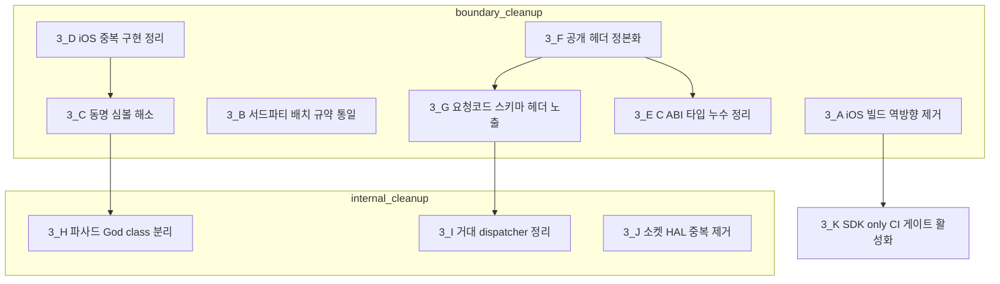
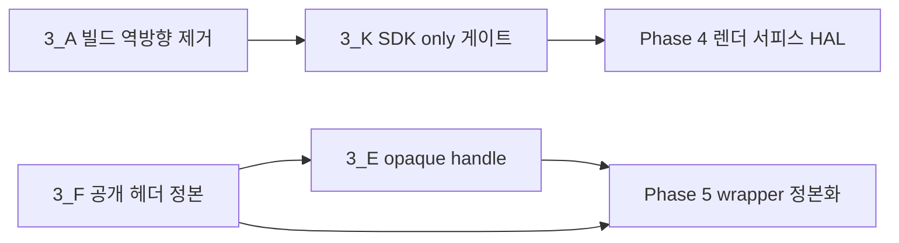

# Phase 3 — SDK/ADK 경계 정리·내부 구조 정리 (B3)

> **상태**: 진행 중 — **3-C·3-E(실측)·3-F·3-G 의 판정 장치·실측 완료**(2026-08-02, 커밋 `b8dc55bf`·`ce121c4a`·`b83869f5`). 게이트 3종이 CI 에 올랐고 실측이 계획을 크게 바꿨다(§실측 2026-08-02). 코드 이동(3-A·3-B·3-D·3-E·3-H·3-I·3-J·3-K)은 미시작
> **범위**: `sonex-framework` 의 **계층 경계 이탈 정리**(3-A~3-G) + **파일·함수 단위 내부 정리**(3-H~3-J) + **Phase 2 가 만든 게이트 활성화**(3-K). **모듈의 계층 배치는 바꾸지 않는다** — 배치 판정은 [rendering-boundary.md §7.5](../rendering-boundary.md) 가 이미 "현행 유지"로 끝냈다.
> **선행**: [Phase 2](./phase2-release-packaging.md) — 특히 2-G(`SDK-only` 빌드 구성)가 있어야 3-K 를 켤 수 있고, [Phase 1](./phase1-regression-baseline.md) 회귀 하니스가 있어야 3-H~3-J 를 판정할 수 있다
> **후행**: [Phase 4](./phase4-render-boundary.md) — 4-A(렌더 서피스 HAL)는 3-F(공개 헤더 정본)가 선 뒤에야 계약을 바꿀 자리가 생긴다
> **근거**: [plan.md §4 Phase 3](./plan.md) · [gap.md §4·§7](../gap.md) · [../../review/sonex-framework.md §2·§3·§10](../../review/sonex-framework.md)
> **실측 기준**: `master` `f336e25b` = 로컬 HEAD == `origin/master`. 이 문서의 `[실측 2026-07-30]` 표기는 이 커밋에서 직접 측정한 값이다.

---

## 실측 (2026-08-02) — 판정 장치를 먼저 세우고 재니 세 항목이 다르게 보인다

Phase 0~2 로 **빌드·테스트·게이트가 서고 나서** 3-C·3-F·3-G 를 실제로 측정했다. 셋 다 계획의 수치와 어긋난다.

### 3-C — ODR 위반이 1건이 아니라 **6건**이다

계획은 `HC::ResultCode` 하나를 지목했다. 전 헤더를 훑으니 **같은 이름이 다른 뜻을 갖는 enum 이 6개**다. 전부 `namespace HC` 안이라 **ODR 위반**이고, 어느 헤더를 include 한 번역 단위냐에 따라 같은 정수가 다른 뜻이 된다 — **컴파일도 링크도 통과한다.**

| enum | 충돌 | 실질 결과 |
|---|---|---|
| **`HC::ResultCode`** | `1` = `NOT_CONNECTED`(ADK iOS) vs `PROGRESSING`(SDK) | **"연결 안 됨"이 "진행 중"으로 읽힌다** |
| **`HC::ScanMode`** | `3` = `SCAN_MODE_PD` vs `SCAN_MODE_PW` | **파워도플러와 펄스파가 뒤바뀐다** |
| **`HC::LogType`** | `0` = `USER_ACTIVITY` vs `LOG_TYPE_DEBUG` | 사본 **3벌**이 어긋난다. 로그 심각도가 잘못 읽힌다 |
| **`HC::Error`** | `2` = `NotSupported` vs `FileIo` · `3`·`4` 도 어긋남 | **기록 파일 reader 와 writer 가 서로 다른 오류표를 쓴다** |
| `HC::StreamMode` · `HC::BackupFileReaderError` | 멤버 집합 자체가 다름 | |

**값 집합이 같은 사본은 결함이 아니다** — 중복일 뿐 뜻이 갈리지 않는다. 그런 것이 **11건** 더 있고 warning 으로 분리했다. 이 구분이 없으면 게이트가 사본 정리(3-F)와 뜻 충돌(3-C)을 뭉뚱그린다.

게이트 = `scripts/check-duplicate-enums.py`(래칫). 6건은 iOS 코드가 섞여 있어 여기서 빌드로 판정할 수 없으므로 **새 충돌만 error 로 막는다.**

### 3-F — 공개 헤더 자립률이 **111/120** 이다

계획의 *"62개 중 36개 실패"* 보다 나은 출발점이었고(Phase 0-L·0-M 이 이미 일부를 고쳤다), 이번에 **98 → 111** 로 올렸다. 결손 21건은 `<cstdint>` 13 · `<list>`·`<cmath>`·`HCString.h`·`HCCommon.h` 각 1 · **배열 선언 문법 오류 6**(`uint32_t[10] multiFocalTable;` — C++ 문법이 아니다).

> **남은 9건 중 6건이 한 원인이고 무겁다** — `sdk/include/objects/HCScanMCursor.h` 가 **공개 트리에 없다.** `HCImageRenderCore.h:22` 가 그것을 include 하므로 **`HCSonexSDK.h` 를 비롯한 6개가 깨진다. 즉 SDK 의 주 진입점이 고객사에서 컴파일되지 않는다.**
>
> **복사로 고치지 않았다.** `sdk/include/objects/` 의 15개 사본이 `sdk/sdk/ImageRenderer/shared/objects/` 원본과 **이미 전부 갈라져 있다**(md5 상이). 어느 쪽을 공개 계약으로 낼지가 3-F 의 본체이고, 추측으로 한쪽을 고르면 그 결정이 근거 없이 굳는다.

### 3-E — 누수 표면이 **Windows·Android 뿐**이고, 헤더는 전 플랫폼에 광고한다

`hc_create*Instance` / `hc_destroy*Instance` **12개**(모듈 6종 × 2)가 `extern "C"` 로 **`class HC::DeviceManager*` 를 반환**한다. C ABI 로 C++ 타입이 나가므로 클래스 레이아웃이 곧 바이너리 계약이 된다.

**그런데 구현이 6개 모듈 전부 이 모양이다** `[실측 2026-08-02]`:

```cpp
#if OS_WINDOWS
    class ExportDev HC::DeviceManager* _cdecl hc_createDeviceManagerInstance() { ... }
#elif OS_ANDROID
    class HC::DeviceManager* hc_createDeviceManagerInstance() { ... }
#endif   // ← #else 가 없다
```

| 플랫폼 | 이 API |
|---|---|
| Windows · Android | **있다** — SDK 파사드가 모듈 DLL/so 를 동적 로딩해 이 심볼을 찾는다 |
| **Linux · iOS · macOS** | **없다.** Apple 은 `file(GLOB)` 으로 전 모듈을 한 프레임워크에 몰아넣어 동적 로딩이 필요 없고, Linux 는 정적 링크다 |
| 공개 헤더 | **무조건 선언한다** |

**따라서 3-E 는 두 결함이지 하나가 아니다.**

| # | 결함 | 성격 |
|---|---|---|
| 1 | **공개 헤더가 플랫폼별 API 를 무조건 선언한다** | `hc_renderCineFrameFromGray`(§Phase 4 정정)·`hc_ReadRenderedImage`(iOS 전용)와 **같은 종류**다. 고객사는 선언을 보고 부르고, 없는 플랫폼에서 런타임에 실패한다 |
| 2 | 있는 곳에서는 **C++ 객체가 C ABI 로 나간다** | opaque handle 로 바꾸는 것이 3-E 의 원래 내용. **대상은 전 플랫폼이 아니라 Windows·Android 다** |

> **순서가 갈린다** — 결함 1 은 `sdk/include/` 정본화(3-F)와 같은 작업이고 지금 게이트가 이미 17건을 세고 있다. 결함 2 는 API 변경이라 §3.2 대로 **왕복 케이스가 먼저**이며, 그 케이스는 Windows·Android 에서만 돌 수 있다 — **Linux 에서는 이 API 자체가 없어 판정할 수 없다.**

### 3-F-추가 — **사본 갈림은 위생이 아니라 ABI 문제다** `[실측 2026-08-02]`

Phase 4 에서 렌더 코어를 오프스크린에 세우다 발견했다. **이것이 3-F 의 가장 무거운 근거다.**

```
sizeof(ImageRenderCore) = 3728   (-I sdk/sdk/ImageRenderer/shared 우선)
sizeof(ImageRenderCore) = 3144   (-I sdk/include 우선)
```

**같은 클래스가 include 경로 순서에 따라 584바이트 다르다.** 이 객체를 스택에 두면 **생성자가 호출자 프레임을 넘어 쓴다** — AddressSanitizer 가 생성자에서 `stack-buffer-overflow`(WRITE of size 8)를 짚었고, 실행은 `*** stack smashing detected ***` 로 죽는다.

원인은 `HCImageRenderCore.h` 가 include 하는 헤더 **8개**가 두 트리에서 md5 가 다르고, 그중 **멤버를 가진 클래스**가 레이아웃을 바꾸기 때문이다 — `HCRenderObject` · `HCScanCFConvex` · `HCScanCFLinear` · `HCScanSpectrum` · `HCScanSideRuler` · `HCScanPwCursor` · `HCGlslShader` · `glad/glad.h`.

**전수 실측**: 공개 헤더 중 내부 동명이 있는 것 **121건** — 동일 71 · 전달 1 · **갈림 49**.

| | 이전 판의 3-F 근거 | 이번 실측 |
|---|---|---|
| 성격 | 심볼 수가 다르다(27 vs 54) · 헤더가 컴파일되지 않는다 | **ABI 가 깨진다** |
| 영향 | 고객사가 샘플을 못 짠다 | **고객사가 이 클래스를 스택에 두면 스택이 깨진다** |
| 판정 | 헤더 단독 컴파일 | 위 + **사본 갈림 0** |

> **전달 헤더는 갈린 것이 아니다.** [0-G](./phase0-build-reproducibility.md) 가 `HCCommon.h` 를 그렇게 만들었고 그것이 3-F 가 지향하는 상태다 — 실체는 하나이고 옛 경로가 그리로 넘긴다. 게이트(`scripts/check-header-copies.py`)가 둘을 구분한다.
>
> **완료 판정**: 이 게이트가 0 이 되면 `test/render/test_render_core_offscreen.cpp` 의 `DISABLED_` 를 뗄 수 있다. **3-F 가 끝났는지를 렌더 케이스가 판정하는 구조**다.

#### 3-F 실행 결과 — **사본 49 → 0** `[2026-08-03]`

`sizeof(ImageRenderCore)` 가 **양쪽 다 3728** 로 같아졌고, `DISABLED_` 를 뗀 렌더 케이스 2건이 통과한다(**103/103**). 위 완료 판정이 실제로 성립했다.

**방향은 줄 수가 아니라 선언 집합으로 정했다.** 42벌은 내부가 정본이고 **4벌은 공개가 정본**이다 — `HCRequestCommands.h` 는 공개가 995줄 더 길어 "공개가 뚱뚱하다" 로 보이지만 그 995줄은 고객용 Request JSON 문서 주석이고, 주석·공백을 지운 선언 집합으로 재면 **공개 229심볼 ⊃ 내부 165심볼**(내부 전용 0 · 같은 이름 다른 값 0)이다. 줄 수로 판정했으면 API 문서가 사라졌다.

**사본이 감추고 있던 것** — 통합하면서 드러난 것이 사본 정리 자체보다 무겁다.

| 헤더 | 공개(고객사가 보는 것) | 내부(SDK 가 실제로 쓰는 것) |
|---|---|---|
| `HCRecordWriter.h` | `REC_FILE_VER 6.11` | **`7.2`** — 레코드 파일 포맷이 한 세대 다르다 |
| `HCInstructionSet300C/300L/500L.h` | `createPacketUpdataFirmwareStart(out)` | `(out, VariantMap*)` — **공개 헤더로 컴파일하면 링크되지 않는다** |
| `HCAverageBFilter.h` | `cv::UMat prevFrame[N]` | `cv::Mat prevFrame[N]` — 크기가 다른 타입의 배열 |
| `HCFileReadWriter.h` / `HCRecordWriter.h` | `ExportFRW` 가 전자에만 | 후자에만 — **방향이 서로 반대**라 표류의 증거다 |

부수 효과로 **공개 헤더 자기완결성 실패가 9 → 2** 로 내려갔다. 내부 사본은 이미 자기완결적이었고 공개 사본만 낡아 있었기 때문이다. 공개 트리에 아예 없던 `HCScanMCursor.h`·`HCMeasureBVF.h` 도 채웠다 — 공개 `HCImageRenderCore.h` 가 이미 include 하던 것이라 **고객사는 지금까지 이 헤더를 컴파일할 수 없었다**.

**파일은 지우지 않았다.** 사본을 없애는 가장 짧은 길은 내부 파일을 삭제하고 include 경로가 공개를 찾게 두는 것이지만, `.sln`·`.vcxitems`·`ndk-build`·Xcode 가 **경로로 파일을 나열**하므로 우리가 빌드하지 못하는 플랫폼이 조용히 깨진다. 전달 헤더는 경로를 살리면서 실체를 하나로 만든다.

#### 3-F 파생 — **사본이 아닌 것이 섞여 있었다(이름 충돌)** `[2026-08-03]`

사본 게이트가 "갈라진 사본" 으로 세던 것 중 하나가 사본이 아니었다.

```
sdk/sdk/DeviceManager/shared/HCDeviceManager.h   → class HC::DeviceManager (하드웨어 소켓)
sdk/adk/Main/shared/managers/HCDeviceManager.h   → class HC::DeviceManager (클라우드 장비·배터리 등록)
```

**이름이 같고 겹치는 멤버가 하나도 없다.** 사본은 합치면 되지만 이름 충돌은 **합칠 수 없고 이름을 바꿔야 한다** — 둘을 한 바구니에 담으면 "사본 0" 을 달성해도 충돌이 남는다. 그래서 게이트를 분리했다(`scripts/check-name-collisions.py`, **멤버 교집합이 공집합인 동명 클래스**를 찾는다). ADK 쪽을 `CloudDeviceManager` 로 바꿔 해소했다(C ABI 미노출이라 공개 API 변경이 아니다).

같은 게이트가 **더 무거운 것**을 하나 더 찾았다. `sdk/adk/Main/ios/HCSonexSDK_iOS.h` 는 SDK 의 iOS 포팅이 아니라 **손으로 다시 쓴 별개 구현**인데, 선언을 `namespace HC` 에 두어 진짜 SDK 와 이름이 겹쳤다.

| 이름 | 가짜(iOS) | 진짜 |
|---|---|---|
| `HC::ResultCode` `NOT_CONNECTED` | 1 | **14** |
| `HC::ResultCode` `NOT_SUPPORTED` | 2 | **12** |
| `HC::ResultCode` `INVALID_PARAMETER` | 3 | **6** |
| `HC::ScanMode` 값 3 | `SCAN_MODE_PD` | `SCAN_MODE_PW` |
| `HC::StreamData` | 3필드 POD | 10필드 이상 |

**같은 iOS 타깃 안에서** `HCSonexADK.cpp`·`HCNetworkController.cpp` 는 진짜 값을 쓰고, 같은 헤더를 포함한 `HCSonexFramework.cpp` 는 가짜 값을 쓴다. 한 바이너리에 같은 이름의 두 정의가 있으므로 ODR 위반이고, **오류 코드가 경계를 넘을 때 뜻이 바뀐다**. 구현 통합은 iOS 를 빌드할 수 있는 곳에서 할 일이라 여기서는 **이름 충돌만 없앴다**(`HC::iosbridge` 로 내림) — 이름 변경은 컴파일 시점에 실패하므로 조용히 틀리는 이전 상태보다 안전하다.

같은 계보로 **고객용 iOS 샘플의 크래시 요인**도 드러났다. `SonexSDKBridge.mm` 이 `HC::StreamData` 를 손으로 다시 선언하고 SDK 가 넘긴 `void*` 를 그리로 캐스팅하는데, 그 사본에는 `float linePosition` 이 빠져 있다.

```
진짜 imageData offset = 32
사본 imageData offset = 24   ← 그 자리는 실제로 linePosition(float) 이다
```

**콜백마다 float 비트열을 포인터로 역참조했다.** 이 파일이 진짜 헤더를 피한 이유("내부 구현 헤더는 제외")가 성립했던 까닭은 공개 헤더가 혼자 컴파일되지 않았기 때문인데, **3-F 가 그것을 고쳐 이제 헤더 하나만 포함하면 된다.** 고쳤다.

### 3-G — **통합이 무손실이다**

`HCRequestCommands.h` 3벌의 상수가 **175 / 119 / 81** 로 다르다. 그러나 **사본 간 "같은 이름·다른 값" 이 0건**이다. `protocol-sot` 전수 대조에서 무손실 통합의 근거였던 것과 같은 판정이고 같은 방법으로 얻었다.

**따라서 3-G 는 값을 조정하는 일이 아니라 노출 범위를 정하는 일로 좁혀진다** — `include` 벌 175 가 상위집합이고 나머지는 부분집합이다.

> `_BASE`·`_MAX` 같은 범위 표지는 구간 처음/끝 명령과 값이 같은 것이 정상이라 충돌 검사에서 뺐다. 안 빼면 오탐이 난다(실제로 났다).

---

## 1. 배경

### 1.1 계층은 코드에서 지켜지고 빌드에서 깨진다

이 사실을 먼저 세운다. **"SDK/ADK 분리가 안 돼 있다" 는 사실과 다르다.**

| 방향 | 수준 | 실측 | 판정 |
|---|---|---|---|
| ADK → SDK (정상) | 코드 | **7파일**이 SDK 참조 | 설계대로 |
| SDK → ADK (금지) | 코드 | **0건** | **지켜지고 있다** |
| SDK → ADK (금지) | **빌드** | **iOS CMakeLists 10건** | 이탈 |

`[실측 2026-07-30]` SDK 소스에서 ADK 를 참조하는 파일은 `sdk/sdk/` 전체에서 **0건**이다(샘플 제외). 이탈은 **빌드 파일 한 곳에 집중**돼 있다 — `sdk/sdk/Main/ios/CMakeLists.txt` 의 include 5줄(111-115)·link 5줄(134-138)이 `${SDK_ROOT}/../adk/library/{angle,freetype,opencv,openssl}_ios/…` 를 가리킨다.

**설계 판단이 아니라 로컬 환경 편의다.** 같은 파일 104줄 주석이 그렇게 적혀 있다 — *"Phase 2-C C-2: third_party 경로 → sdk/adk/library/ 우리 환경 일치."* macOS CMakeLists 는 같은 자리에 중립 위치(`${SDK_ROOT}/../third_party/angle_macos/`)를 쓴다.

### 1.2 이탈은 10건이 아니라 14건이고, `common` 도 포함된다

`[실측 2026-07-30 — 신규]` 빌드 파일 전수에서 `adk/library/` 를 참조하는 **비-ADK 코드**는 두 곳이다.

| 참조원 | 건수 | 대상 |
|---|---:|---|
| `sdk/sdk/Main/ios/CMakeLists.txt` | **10** | `angle_ios` · `freetype_ios` · `opencv_3.4.6_ios` · `openssl-1.1.1d_ios` |
| **`sdk/common/ios/Common.iOS.xcodeproj/project.pbxproj`** | **4** | `openssl-1.1.1d_ios` (include 2 · lib 2) |

**`common` 은 SDK·ADK 양쪽이 쓰는 공유 계층이다.** SDK CMakeLists 만 고치면 `SDK-only` 빌드는 여전히 `adk/library/` 를 요구한다 — **3-K 게이트가 통과하지 않는다.** 3-A 의 범위를 14건으로 잡아야 하는 이유다.

### 1.3 그런데 그 경로의 실물이 대부분 없다

`[실측 2026-07-30 — 신규]` iOS CMakeLists 가 참조하는 4개 디렉토리 중 **저장소에 실재하는 것은 1개뿐**이다.

| 참조 경로 | 실재 |
|---|---|
| `sdk/adk/library/angle_ios/` | **없음** |
| `sdk/adk/library/freetype_ios/` | **없음** |
| `sdk/adk/library/opencv_3.4.6_ios/` | **없음** |
| `sdk/adk/library/openssl-1.1.1d_ios/` | 있음 |

`sdk/third_party/` 에 있는 것도 `context_vision`·`nlohmann_json`·`readme.txt` 셋뿐이고 **ANGLE 은 저장소 어디에도 없다**. 즉 **3-A 는 "경로를 되돌리는 일"만으로 끝나지 않는다** — 되돌릴 대상 위치가 비어 있으므로 [Phase 0-C](./plan.md)(의존성 관리 도입)의 산출물이 먼저 서야 한다. 경로만 바꾸면 빌드 실패 지점이 옮겨갈 뿐이다.

### 1.4 서드파티 배치 규약 자체가 계층을 무시한다

`[실측 2026-07-30]` `sdk/adk/library/` 13개 디렉토리.

| 성격 | 디렉토리 |
|---|---|
| ADK 고유(DICOM·영상·DB·HTTP) | `dcmtk_3.6.5_android` · `ffmpeg_4.0.2_android` · `ffmpeg_4.1.4-msvc64` · `wxsqlite3` · `cpr_1.12.0_android` · `curl_8.13.0_android` · `minizip_2.8.4_{android,ios}` |
| **SDK 도 쓰는 것** | `opencv_3.4.5_msvc64` · `opencv_3.4.6_android` · `openssl-1.1.1d_{android,ios}` · `stb` |

**ANGLE 은 가장 눈에 띄는 사례일 뿐이다.** 계층별로 서드파티를 나눌 규약이 없어서 "먼저 필요해진 쪽 디렉토리"에 들어갔고, 플랫폼 접미사(`_android`·`_msvc64`·`_ios`)까지 디렉토리 이름에 박혀 있다.

### 1.5 이 phase 는 성격이 둘이다



| 묶음 | 성격 | 무엇이 바뀌나 |
|---|---|---|
| **3-A~3-G** | **경계 이탈 정리** | 계층 배치는 그대로. 빌드 경로·심볼 이름·헤더 계약만 |
| **3-H~3-J** | **파일/함수 단위 내부 정리** | 모듈 소속 그대로. 한 파일·한 클래스 안의 책임만 나눔 |
| **3-K** | **교차 항목** | Phase 2-G 가 만든 구성의 CI 게이트를 켠다 |

**섞으면 안 되는 이유**: 3-A~3-G 는 실패하면 빌드가 안 되거나 심볼이 안 맞으므로 **컴파일러·링커가 판정**한다. 3-H~3-J 는 컴파일이 되면서 동작이 바뀔 수 있으므로 **[Phase 1](./phase1-regression-baseline.md) 회귀 하니스가 판정**한다. 판정자가 다르다.

---

## 2. 진행 단계

### 2.1 경계 이탈 정리 (3-A ~ 3-G)

#### Step 3-A. iOS 빌드 역방향 제거

**[Phase 0-C](./plan.md) 완료가 선행 조건이다**(§1.3).

| # | 작업 |
|---|---|
| A-1 | **범위를 14건으로 확정** — `sdk/sdk/Main/ios/CMakeLists.txt` 10건 + `sdk/common/ios/Common.iOS.xcodeproj` 4건(§1.2) |
| A-2 | 네 의존물(angle·freetype·opencv·openssl)의 iOS 배포본을 Phase 0-C 가 정한 중립 위치에 배치 |
| A-3 | 두 빌드 파일의 경로를 중립 위치로 교체. macOS CMakeLists 형태를 따르되 **macOS 를 그대로 베끼지는 않는다** — macOS 는 freetype·opencv 를 `/opt/homebrew/…` 절대경로로 잡고 있어 [Phase 0-D](./plan.md) 대상이다 |
| A-4 | `git grep -n 'adk/library' -- 'sdk/sdk/**' 'sdk/common/**'` **0건** 확인 |
| A-5 | **완료 즉시 3-K 로 넘어간다** |

#### Step 3-B. 서드파티 배치 규약 통일

[Phase 0-C](./plan.md) 의 의존성 관리 도입과 **같은 작업의 다른 면**이다 — 0-C 가 "어떻게 가져오나", 3-B 가 "어디에 두나".

| # | 작업 |
|---|---|
| B-1 | **규약 명문화** — 서드파티는 계층 소속이 아니라 **소비처 수**로 가른다. 둘 이상이 쓰면 중립 위치, 한 계층만 쓰면 그 계층 아래 |
| B-2 | 규약대로 `sdk/adk/library/` 13건 재배치(§1.4). `opencv`·`openssl`·`stb` 는 중립, `dcmtk`·`ffmpeg`·`wxsqlite3`·`cpr`·`curl`·`minizip` 은 ADK 잔류가 규약 결과 |
| B-3 | **플랫폼 접미사를 디렉토리 이름에서 뺀다** — `opencv_3.4.5_msvc64`·`opencv_3.4.6_android` 처럼 같은 라이브러리가 버전까지 갈라진 것을 버전 1벌 + 플랫폼 하위로 |
| B-4 | 이동 후 **모든 빌드 파일의 경로 갱신**. MSBuild `.vcxproj` 29개·`ndk-build`·Xcode·CMake 4갈래 전부 |

> **B-3 이 부수 효과를 낸다** — 같은 라이브러리의 플랫폼별 버전이 갈라져 있다는 사실(`opencv` 3.4.5 vs 3.4.6, macOS 는 Homebrew 4.12.0)이 디렉토리 이름에 가려져 있었다. 이름을 합치면 **버전 불일치가 드러난다.**

#### Step 3-C. 동명 심볼 해소

**착수 전에 3-D 의 런타임 실사용 확인이 와야 한다**(§4 위험표).

`[실측 2026-07-30 — 미확인 항목 해소]` [../../review/sonex-framework.md §11](../../review/sonex-framework.md) 이 "동명 심볼이 공개 헤더로 반출되는지 미확인"으로 남긴 것을 확인했다.

| 심볼 | 정의처 | 외부 반출 |
|---|---|---|
| `HC::DeviceManager` (SDK, 물리 스캐너) | `sdk/sdk/DeviceManager/shared/` | **반출됨** — `sdk/include/HCDeviceManager.h` |
| `HC::DeviceManager` (ADK, 클라우드 자산) | `sdk/adk/Main/shared/managers/` | `sdk/include/` 에 **ADK 헤더 0건** |
| `HC::ResultCode` (SDK, 약 50값) | `sdk/include/HCCommon.h` | **반출됨** |
| **`HC::ResultCode` (ADK iOS, 6값)** | `sdk/adk/Main/ios/HCSonexSDK_iOS.h` | **반출 안 됨** |

마지막 행의 근거는 둘이다. `SonexFramework.iOS.xcodeproj` 가 이 헤더를 `ATTRIBUTES = (Project, )` 로 등록하고(Public 은 `SonexFrameworkWrapper.h`·`SonexFramework_iOS.h`·`SonexUtils.h` 셋), umbrella 헤더 `SonexFramework_iOS.h:17` 이 명시적으로 제외한다 — *"주의: HCSonexFramework.h / HCSonexSDK_iOS.h 는 C++ 헤더 … umbrella 에 포함하면 ObjC module 검증 실패. 외부에 노출되는 것은 ObjC wrapper + SonexUtils 만."*

**위험도가 낮아진 것이 아니라 위험의 종류가 바뀐다.** 고객사 헤더 충돌은 확인되지 않았고, 남는 것은 **같은 링크 단위 안의 ODR 위반**이다 — 같은 네임스페이스·같은 enum 이름·같은 숫자·다른 뜻이 두 번역 단위에 각각 정의된다. 그리고 **값 1 이 SDK 는 `PROGRESSING`(정상 진행)인데 ADK iOS 헤더로는 `NOT_CONNECTED`(연결 실패)** 라 사람이 읽을 때의 오독 위험은 그대로다.

| 값 | SDK `HCCommon.h` | ADK `HCSonexSDK_iOS.h` |
|---:|---|---|
| 1 | `PROGRESSING` | **`NOT_CONNECTED`** |
| 2 | `PROCESS_CANCELLED` | `NOT_SUPPORTED` |
| 3 | `INVALID_PLATFORM` | `INVALID_PARAMETER` |
| 4 | `INVALID_INSTANCE` | `BUFFER_TOO_SMALL` |
| 5 | `INVALID_COMMAND` | `INTERNAL_ERROR` |

| # | 작업 |
|---|---|
| C-1 | **`HC::ResultCode` 재정의 제거** — 3-D 가 `HCSonexSDK_iOS.cpp` 를 걷어내면 이 헤더도 함께 사라진다. **3-D 가 "미사용 잔재" 로 판정되면 C-1 은 삭제로 끝난다** |
| C-2 | 3-D 가 "실사용" 으로 판정되면 재정의를 지우고 SDK `HCCommon.h` 를 include 한다. `StreamMode` 도 같이 재정의돼 있으므로 함께 |
| C-3 | **`HC::DeviceManager` 이름 분리** — 두 계층의 도메인이 실제로 다르므로([gap.md §4.2](../gap.md)) 통합이 아니라 개명이다. ADK 쪽을 `HC::ADK::DeviceRegistry` 류로. **SDK 쪽 이름은 유지** — 공개 헤더에 이미 반출돼 고객사 코드가 붙어 있다 |
| C-4 | 개명 후 `sdk/adk/**` 에서 SDK `HCDeviceManager.h` 를 include 하는 곳과 심볼이 어긋나지 않는지 확인 |

#### Step 3-D. iOS 중복 구현 정리 — **착수 전 확인이 선행**

`sdk/adk/Main/ios/HCSonexSDK_iOS.cpp`(782줄)에 `connectToDevice(ip, controlPort, dataPort)` 가 **POSIX raw socket 으로 중복 구현**돼 있다. control·data 2소켓 구조까지 SDK 와 같고, 기본값이 `connectToDevice("192.168.10.1", 1234, 1235)`(655줄)로 **HC 프로토콜 포트 그대로**다.

`[실측 2026-07-30 — 신규]` 빌드 편입 방식과 구조적 원인을 확인했다.

| 사실 | 근거 |
|---|---|
| `.cpp` 는 **Sources 빌드 페이즈에 없다** | `project.pbxproj` PBXSourcesBuildPhase 11개 항목에 부재 |
| 대신 **소스 인클루드로 편입** | `HCSonexFramework.cpp:5` — `#include "HCSonexSDK_iOS.cpp"  // 직접 포함하여 빌드` |
| **그 진입점이 2벌이고 md5 가 같다** | `sdk/adk/Main/ios/HCSonexFramework.cpp` == `sdk/sdk/sample/SDK_Sample_iOS/SDK_Sample_iOS/HCSonexFramework.cpp` (`747a8ac1`) |
| **iOS ADK 프레임워크는 SDK 를 링크하지 않는다** | PBXFrameworksBuildPhase = `Common_iOS` · `DatabaseHelper_iOS` · `DicomHandler_iOS` · `NetworkProcess_iOS` · `BackupReadWriter_iOS` · `VideoEncoder_iOS` — **SonexSDK 없음** |
| 그 번역 단위는 SDK 헤더를 하나도 include 하지 않는다 | `HCSonexFramework.cpp`·`HCSonexSDK_iOS.cpp` 의 include 목록 전수 |

**마지막 두 줄이 원인이다.** iOS ADK 프레임워크 타깃이 SDK 를 링크하지 않으므로, 장치 연결이 필요해진 시점에 **SDK 를 부를 방법이 없어서 다시 짰다.** 3-D 는 "중복 코드를 지우는 일" 이 아니라 **타깃 의존 그래프를 고치는 일**이다.

| # | 작업 |
|---|---|
| **D-0** | **런타임 실사용 확인 — 이 phase 전체에서 가장 먼저 한다.** [sonex-app.md §5](../../review/sonex-app.md) 는 iOS 앱이 `SonexSDKBridge.mm` 을 쓴다고 기록한다. 빌드 편입은 확인됐으나 **실행 경로가 이 코드를 타는지는 미확인**이다. 확인 수단: iOS 앱이 실제로 로드하는 프레임워크와 호출 심볼 대조 |
| D-1a | **미사용 잔재로 판정되면** — `HCSonexSDK_iOS.{h,cpp}` 삭제, 두 `HCSonexFramework.cpp` 의 `#include` 제거, pbxproj Headers 항목 제거. **3-C 의 `ResultCode` 문제가 같이 해소된다** |
| D-1b | **실사용으로 판정되면** — iOS ADK 프레임워크 타깃에 `SonexSDK` 링크를 추가하고, `connectToDevice` 를 SDK `DeviceManager` 호출로 교체 |
| D-2 | `SDK_Sample_iOS` 의 동일 사본도 함께 처리. **md5 가 같으므로 한쪽만 고치면 표류가 시작된다** |
| D-3 | **FTP 경로는 이 단계에서 건드리지 않는다** — `HCFirmwareController.cpp:24-27` 의 `FTP_SERVER_IP="192.168.10.1"`·`FTP_USER="root"` 는 ADK 가 장비를 직접 만지는 두 번째 경로지만, 범용 프로토콜이고 ADK 가 네트워크 담당이라 방어 가능하다([gap.md §4.4](../gap.md)). 다만 **같은 파일에 장비 FTP 비밀번호 2종이 평문 상수로 박혀 있다** — 별도 보안 항목으로 올리고 이 phase 범위 밖에 둔다 |

#### Step 3-E. C ABI 타입 누수 정리

`[실측 2026-07-30 — 재확인]` `extern "C"` 선언이 `HC::` 클래스 포인터를 주고받는 곳이 **28건**이다(`sdk/include/*.h` + `sdk/sdk/Main/shared/*.h`).

| 파일 | 건수 | 형태 |
|---|---:|---|
| `HCDeviceManager.h` · `HCImageFilter.h` · `HCImageRenderer.h` · `HCFileReadWriter.h` · `HCScanBuffer.h` · `HCScanTimeSync.h` | **각 4** | `hc_create*Instance()` 반환 + `hc_destroy*Instance(HC::클래스*)` 인자, Windows(`_cdecl`)·비Windows 2벌씩 |
| `HCSonexSDKInterface.h`(공개·구현 각각) | 각 2 | `hc_GetScannerInfo` → `HC::ScannerInfo*` · `hc_GetLatestRawFrame` → `HC::StreamData*` |

**`hc_GetLatestRawFrame` 같은 단발 사례가 아니라 인스턴스 생성 계약 전체가 그렇다.** 6개 모듈이 모두 C++ 클래스 포인터를 C ABI 로 내보낸다.

| # | 작업 |
|---|---|
| E-1 | **opaque handle 타입 정의** — `typedef struct hc_DeviceManager_s* hc_DeviceManagerHandle;` 형태로 모듈당 1개 |
| E-2 | `hc_create*Instance`·`hc_destroy*Instance` 12쌍의 서명을 handle 로 교체. 구현부는 `reinterpret_cast` 한 줄 |
| E-3 | `HC::ScannerInfo`·`HC::StreamData` 반환 2건은 **POD 구조체 복사 또는 out-parameter** 로. 두 타입이 실제 POD 인지 먼저 확인하고, 아니면 getter 로 분해 |
| E-4 | **3-F 와 동시에 한다** — 공개 헤더가 두 벌인 상태에서 서명을 바꾸면 어느 쪽을 바꿨는지가 갈린다 |
| E-5 | 기존 바인딩 27벌이 이 심볼을 어떻게 쓰는지 대조. 실제 교체는 [Phase 5](./plan.md) 소관이나 **깨질 목록은 여기서 만든다** |
| **E-6** | **반환 규약 결함 1건을 같이 고친다** `[실측 2026-08-02]` — `hc_ProcessPlaybackFrame`(`HCSonexSDKInterface.cpp:792-945`)이 **성공에는 처리 바이트 수를, 실패에는 `HC::INVALID_PARAMETER` 열거값을** 반환한다. 한 `int` 채널에 두 도메인이 섞여 있어 규약대로 `== SUCCESS(0)` 로 판정하는 소비자는 **정상 처리를 오류로 읽는다.** 더 나쁜 것은 **필터를 못 찾은 경로도 `return inputSize`** 라 완전 성공과 값이 같다 — "필터가 안 걸린 영상"이 조용히 나간다. **out-parameter 로 바이트 수를 빼고 반환은 `ResultCode` 로 통일**한다([code-defects-sdk.md](./code-defects-sdk.md) SDK-17) |
| **E-7** | **`void*` 수명 문제도 같은 표면이다** `[컴파일러 판정]` — `VariantMap` 이 소유 포인터를 `delete (void*)` 로 해제한다(`HCVariantMap.cpp:12-18`, `-Wdelete-incomplete`). **소멸자가 돌지 않아** `PacketData` 의 `std::vector` 힙 등이 통째로 샌다. 그 때문에 `RxWorker` 가 **프레임마다 `VariantMap` 을 일부러 누수**시켜 이중 해제를 피하고 있다(`HCRxWorker.cpp:283-301`). **셋이 한 덩어리라 따로 고치면 이중 해제**가 되므로, E-1~E-3 의 handle 타입 도입과 **같은 설계 결정 안에서** 처리한다 — 축 `X` 의 [XS-2](./code-defects-sdk.md) |

#### Step 3-F. 공개 헤더 정본화

`[실측 2026-07-30 — 신규]` `sdk/include/` 는 **큐레이션된 계약이 아니라 내부 헤더의 수동 사본**이고, **이미 표류했다.**

| 측정 | 값 |
|---|---:|
| `sdk/include/` 헤더 총수(하위 디렉토리 포함) | **120** |
| 내부 원본과 **바이트 동일** | 82 |
| **표류(내용 상이)** | **38** (32%) |
| 내부에 대응물이 없는 것 | 0 |

표류 38건에는 계약의 중심이 다 들어 있다 — `HCSonexSDKInterface.h` · `HCSonexSDK.h` · `HCCommon.h` · `HCRequestCommands.h` · `HCDeviceManager.h` · `HCLiveController.h` · `HCImageRenderCore.h` · `HCInstructionSet{300C,300L,500C,500P,500L}.h` 등.

**그리고 표류 방향이 파일마다 반대다.**

| 파일 | 공개 `sdk/include/` | 내부 | 어느 쪽이 앞서나 |
|---|---:|---:|---|
| `HCSonexSDKInterface.h` | 341줄 / **27 심볼** | 672줄 / **54 심볼**(구현 `.cpp` 는 58) | **내부가 앞선다** |
| `HCRequestCommands.h` | 2,311줄 / **175 코드** | `sdk/common/shared/` 1,468줄 / **119 코드** | **공개가 앞선다** |
| `HCCommon.h` | `OS_MACOS` 정의 있음 | `sdk/common/shared/` 에는 **없음** | **공개가 앞선다** |

**"공개 헤더가 뒤처져 있다" 는 절반만 맞다.** 실제 상태는 **양방향 표류**이고, 그래서 "내부를 공개로 복사" 하는 방향의 일괄 처리가 성립하지 않는다.

그들 자신도 알고 있다 — `sdk/sdk/Main/ios/CMakeLists.txt:105-106` 주석이 *"정식 sdk/include 우선 (HCRequestCommands.h 최신 …). sdk/common/shared/HCRequestCommands.h 는 구버전"* 이라고 적고, **그러면서 include 경로에 두 곳을 모두 올려 둔다**(`${SDK_ROOT}/../include` 와 `${COMMON_ROOT}/shared`). **어느 사본이 이기는지가 include 경로 순서에 달려 있다.**

| # | 작업 |
|---|---|
| F-1 | **표류 38건 전수 대조** — 파일별로 어느 쪽이 정본인지 판정한다. [legacy/proof/protocol-sot](../legacy/proof/protocol-sot/) 의 `reconcile.py` 패턴 그대로 |
| F-2 | **사본 구조 자체를 없앤다** — `sdk/include/` 를 원본 위치로 삼고 내부 모듈이 그것을 include 하거나, 빌드 시 생성한다. **손으로 유지되는 사본이 남아 있으면 다시 표류한다** |
| F-3 | **공개 표면을 실제로 고른다** — 지금 `sdk/include/` 에는 `HCRxWorker.h`·`HCTxWorker.h`·`HCSocketCommunicator.h`·`HCInstructionSet500C.h` 같은 **내부 구현 클래스가 그대로 들어 있다**. 공개할 것과 내부에 남길 것을 가른다 |
| F-4 | **ADK 공개 헤더 신설** — `sdk/include/` 에 ADK 헤더 **0건**. `sdk/adk/Main/shared/HCSonexADKInterface.h`(228줄·**25 심볼**)를 `adk/include/` 로 승격 |
| F-5 | include 경로에서 중복 사본 제거 — F-2 이후 `${COMMON_ROOT}/shared` 와 `${SDK_ROOT}/../include` 가 같은 헤더를 두 벌 제공하지 않게 |
| F-6 | **심볼 수 일치 판정을 CI 항목으로** — Phase 1-D 의 바인딩 오탐 검출 스크립트를 확장한다 |

#### Step 3-G. 요청 코드·스키마 헤더 노출

`[실측 2026-07-30 — 판정 정정]` [gap.md §7](../gap.md) 은 *"요청 코드가 헤더에 없다 · JSON 파라미터 스키마가 어디에도 선언돼 있지 않다"* 로 적었다. **이 판정은 너무 강하다.**

| 실측 | 값 |
|---|---:|
| `sdk/include/HCRequestCommands.h` 의 `constexpr int32_t REQUEST_*` | **175** |
| 같은 파일의 `EVENT_*`·`CMD_*` | 23 |
| `Request JSON` 주석 블록을 가진 코드 | **122** (70%) |
| `Result JSON` 주석 블록을 가진 코드 | 123 |

**요청 코드는 공개 헤더에 있고, 70%는 JSON 스키마까지 주석으로 문서화돼 있다.** 남는 진짜 문제는 넷이다.

1. **도달하지 못한다** — `sdk/include/HCSonexSDKInterface.h`(파사드 공개 헤더)가 `HCRequestCommands.h` 를 include 하지 않는다. 고객사가 파사드 헤더만 넣으면 코드를 볼 수 없다
2. **3벌로 갈라졌다** — 공개 175 · `sdk/common/shared/` 119 · `SDK_Sample_Android` 사본 **81**. 셋 다 md5 상이
3. **스키마가 주석이라 컴파일러가 안 잡는다** — `hc_SendRequest(int, const wchar_t*)` 는 오타를 런타임까지 보낸다
4. **53개 코드에 스키마 문서가 없다**(175 − 122)

같은 패턴이 ADK 에도 있다 — `NetworkProcess::sendRequest(int commandCode, const std::map<std::string,std::string>&)`(`HCNetworkProcess.cpp:60`).

| # | 작업 |
|---|---|
| G-1 | **`HCRequestCommands.h` 3벌을 정본 1벌로** — 3-F 의 F-1·F-2 와 같은 작업. 공개본(175)이 상위집합이고 **내부 전용 코드는 0건**이므로 무손실 통합이 가능하다(전수 대조로 확인) |
| G-2 | 파사드 공개 헤더가 정본을 include 하게 |
| G-3 | **스키마 문서 미비 53건 채우기** |
| G-4 | **타입 있는 개별 함수 복원 — 우선순위 상위 코드부터.** [gap.md §7](../gap.md) 이 지적한 대로 2023 설계는 `connectDevice(ip, controlPort, dataPort, retryCount, retryInterval)` 였다. `hc_SendRequest` 디스패처는 **유지**하고 그 위에 타입 있는 래퍼를 얹는다 — 기존 바인딩 27벌을 한 번에 깨지 않기 위해서다 |
| G-5 | **JSON 스키마를 기계가 읽는 형태로** — 주석을 구조화 형식(별도 스키마 파일)으로 옮기면 3-I 의 lookup-table 과 [Phase 5-E](./plan.md) 의 바인딩 생성이 같은 입력을 쓴다 |

### 2.2 파일/함수 단위 내부 정리 (3-H ~ 3-J)

**여기부터는 컴파일러가 판정하지 못한다.** 매 단계 직후 [Phase 1](./phase1-regression-baseline.md) 회귀 하니스를 돌린다.

#### Step 3-H. 파사드 God class 분리

| 클래스 | 헤더 | public | private | `.cpp` |
|---|---|---:|---:|---:|
| `SonexSDK` | `HCSonexSDK.h` 205줄 | 35 | 52 | 1,796줄 / 66 메서드 |
| `SonexADK` | `HCSonexADK.h` 250줄 | 38 | 68 | 1,339줄 |

둘 다 **초기화 · 라이브러리 로딩 · 요청 디스패치 · 콜백 · 상태**를 한 클래스에서 처리한다.

**[r1/plan.md §2.0](./plan.md) 의 feature-first clean architecture 채택이 이 Step 의 목표 형태를 정한다** — God class 는 "내부 클래스로 나누고 끝"이 아니라, **조립(composition root) 과 오케스트레이션(각 feature 의 `application/`) 을 서로 다른 자리로 보낸다.**

| # | 작업 |
|---|---|
| H-1 | **책임 축을 먼저 확정** — 초기화/라이프사이클 · 모듈 로딩 · 요청 디스패치 · 콜백 릴레이 · 상태 보관. 5축이 실제 멤버 분포와 맞는지 헤더에서 확인한 뒤 확정 |
| **H-1a** | **축을 두 자리로 가른다** — 초기화·모듈 로딩(=**배선**, `platform/` 구현체를 골라 `ports/` 에 꽂는 일)은 `sdk/app/`·`adk/app/`(composition root, [r1/plan.md §2.2](./plan.md))로. 요청 디스패치·콜백 릴레이·상태 보관(=**오케스트레이션**)은 각 feature 의 `application/` 로 — 한 모듈이 아니라 6개(SDK)+5개(ADK) feature 로 흩어진다 |
| H-2 | **내부 클래스로 분리, 공개 서명은 유지** — `SonexSDK` 의 public 35개는 그대로 두고 몸통만 위임한다. 공개 계약이 바뀌면 3-F 와 충돌한다 |
| H-3 | **위치만 이동(mechanical move)** — 메서드 본문을 옮기되 한 줄도 다시 쓰지 않는다 |
| H-4 | `SonexADK` 동일. 단 ADK 는 3-F 의 F-4(공개 헤더 신설)가 먼저 서야 "공개 서명" 이 정의된다 |
| H-5 | **diff 판정** — 옮긴 본문의 알고리즘 변경 **0줄** 확인 |
| **H-6** | **`app/` 판정 — 배선만 남았는지 확인**([r1/plan.md §2.3](./plan.md) AF-3). 분기·판정 로직이 `app/` 에 남아 있으면 H-1a 가 안 끝난 것이다 |

#### Step 3-I. 거대 dispatcher 정리 — **이 계획에서 유일하게 로직 형태가 바뀐다**

`[실측 2026-07-30 — 재측정]` 파일별 최대 단일 `switch` 를 중괄호 깊이로 구간을 잡아 다시 셌다.

| 위치 | case | 구간 | 줄 |
|---|---:|---|---:|
| `LiveController::parseRequest` (`HCLiveController.cpp`) | **40** | 71-193 | 123 |
| 같은 파일 결과 처리 switch | 16 | 3049-3399 | 351 |
| `InstructionSet500P.cpp` 최대 switch | **46** | 42-245 | 204 |
| `InstructionSet500C.cpp` 최대 switch | **45** | 43-236 | 194 |
| `InstructionSet500L.cpp` 최대 switch | 41 | 42-229 | 188 |
| `SonexSDK::unifiedRequest` (`HCSonexSDK.cpp`) | **17** | 312-367 | 56 |
| `Utils::requestCodeToString` (`HCCommonUtils.cpp`) | 87 | 54-164 | 111 |
| `Utils::resultCodeToString` (`HCCommonUtils.cpp`) | 60 | 170-241 | 72 |

> **`[재측정 불일치]`** [../../review/sonex-framework.md §10.3](../../review/sonex-framework.md) 은 `parseRequest` 를 **53 case · 128줄**로 적었다. 위 방법으로는 **40 case · 123줄**이 나오고 파일 전체 `case` 라벨은 100개다. 53 이 재현되지 않는다 — **§10.3 정정 대상**으로 남긴다. 결론(최대 dispatcher 이고 lookup-table 대상)은 바뀌지 않는다.
>
> `HCCommonUtils.cpp` 의 87·60 case 는 **코드→문자열 매핑**이라 성격이 다르다. 로직이 없으므로 3-I 대상이 아니고, **3-G 의 정본이 생기면 자동 생성 대상**이다.

| # | 작업 |
|---|---|
| I-1 | **`SonexSDK::unifiedRequest`(17 case)부터 시작** — 가장 작고 이미 서브컨트롤러 위임 구조라 변환 패턴을 여기서 확립한다 |
| I-2 | `LiveController::parseRequest`(40 case) 를 **코드 → 핸들러 테이블**로. 3-G 가 만든 정본 코드 목록을 키로 쓴다 |
| I-3 | `InstructionSet500{C,P,L}` 최대 switch 3건(46·45·41) — **프로토콜 명령 테이블**이라 3-G 의 스키마와 대응시킬 수 있다. 단 `InstructionSet` 5종은 모델별 차이가 실제 프로토콜 차이이므로 **공통화하지 않는다**. 형태만 바꾼다 |
| I-4 | **매 변환 직후 회귀 하니스 실행.** 3-H·3-J 와 달리 이 항목은 `switch` 폴스루·`default` 처리·case 순서 의존이 조용히 사라질 수 있다 |
| I-5 | **폴스루 case 를 먼저 목록화** — `parseRequest` 의 `REQUEST_FIRMWARE_UPGRADE_SN_*` 4연속처럼 여러 case 가 한 본문을 공유하는 자리가 변환 시 가장 위험하다 |
| **I-6** | **같은 6개 파일에 죽은 헤더 검증이 복제돼 있다 — 걷어내면서 한 벌로 모은다** `[컴파일러 판정 2026-08-02]`. `InstructionSet{300C,300L,500C,500L,500P,Default}` 의 `parseReceivedPacket` 진입부가 **파일마다 같은 코드**이고 각각 `-Wtype-limits` 2건이 뜬다: ① `size_t skip = current() - 2; if (skip < 0)` — **항상 거짓**이라 1바이트만 수신된 상태(TCP 분할 시 흔하다)에서 `skip = SIZE_MAX` 가 `outLength` 로 나가고 `pop()` 이 거부돼 **그 바이트가 링에서 소비되지 않는다** ② `contentSize < 0` 도 `size_t` 라 항상 거짓 → **실질 검증이 `targetId != 2 \|\| sessionId != 0` 뿐**이다. 코드에 `// FIXME: Check header validation` 이 붙어 있다. **뒤이은 `hasAmountOfData(contentSize)` 가 실제 잔량으로 다시 막으므로 그 자체가 오버플로는 아니다** — 과장하지 않는다([code-defects-sdk.md](./code-defects-sdk.md) SDK-12) |
| **I-7** | **I-6 은 로직 형태 변경이 아니라 동작 변경이다** — 지금 항상 통과하던 검사가 실제로 걸리기 시작한다. 따라서 **축 `X`(XS-4)로 취급**하고, 변환 전에 **잘린 패킷·경계값 케이스**를 먼저 쓴다([phase1 Step 1-G](./phase1-regression-baseline.md) 의 `PacketData` 인벤토리) |

#### Step 3-J. 소켓 HAL 중복 제거

`[실측 2026-07-30 — 정밀 재측정]` 빈 줄·중괄호만 있는 줄을 제외하고 선행 공백을 제거한 뒤 정렬 교집합으로 다시 쟀다.

| 파일 | 총 줄 | 실질 줄 |
|---|---:|---:|
| `DeviceManager/android/HCCompSocketAndroid.cpp` | 275 | 188 |
| `DeviceManager/ios/HCCompSocketIOS.cpp` | 335 | 240 |
| `DeviceManager/windows/HCCompSocketWindows.cpp` | 276 | 193 |

| 쌍 | 실질 줄 일치 | 총 줄 기준 |
|---|---:|---:|
| Android ∩ iOS | **110** (Android 의 59%) | 196 (71%) |
| **Android ∩ Windows** | **94** (Android 의 50%) | 177 |
| iOS ∩ Windows | 52 | 134 |
| **3자 공통** | **52** | — |

> **[../../review/sonex-framework.md §10.4](../../review/sonex-framework.md) 의 71% 는 빈 줄·중괄호를 포함한 값이다.** 실질 줄 기준은 59% 다. 둘 다 같은 방법의 다른 정의이고 결론(중복 실재)은 같다.
>
> **§11 의 미확인 항목 하나가 해소된다** — *"Windows 는 WinSock 이라 텍스트 diff 유의미성이 낮아 생략"* 했으나, **Windows 도 Android 와 실질 94줄이 같고 3자 공통이 52줄**이다. WinSock 차이는 소켓 생성·종료에 국한되고 **버퍼 관리·타임아웃·에러 분기는 공유된다.**

| # | 작업 |
|---|---|
| J-1 | **3자 공통 52줄을 먼저 추출** — 플랫폼 무관 공통 유틸. 여기가 가장 안전하다 |
| **J-1a** | **`HCCompatibleSocket.h` 를 `sdk/features/DeviceManager/ports/i_socket_port.h` 로 승격**([r1/plan.md §2.0·§2.2](./plan.md)) — 지금도 인터페이스 형태이므로 새로 설계하는 게 아니라 **위치·이름만** 옮긴다 |
| **J-1b** | **`test/mocks/mock_socket.cpp` 를 J-1a 와 같은 커밋에 낸다** — `connect`/`send`/`recv` 를 바이트 큐로 대체하는 단위테스트 더블(1-B mock 장치 서버와는 다르다, 실제 TCP 가 안 열린다). **[r1/plan.md §2.3 AF-4](./plan.md)** 가 CI 로 강제 |
| **J-1c** | **`DeviceManager` 의 `domain/` 단위테스트 착수 — J-1b 가 서는 즉시.** 명령 조립·응답 파싱·모델별 `InstructionSet` 분기 선택을, 실소켓·1-B mock 서버 없이 검증한다. [phase1 G-3](./phase1-regression-baseline.md) "재개방" 표를 실행하는 항목 |
| J-2 | Android ∩ iOS 전용 58줄(110 − 52)을 POSIX 공통으로. `i_socket_port.h`(J-1a) 는 유지 |
| J-3 | Windows 는 **WinSock 초기화·핸들 타입·에러 코드 변환만** 플랫폼 구현에 남긴다 |
| J-4 | **iOS 가 240줄로 가장 크다 — 답이 나왔다(2026-08-02).** 그 초과분의 핵심은 iOS 고유 요구도 표류도 아니라 **혼자만 제대로 구현된 논블로킹 connect 완료 확인**이다(아래 §J-6). **정본은 iOS 다** |
| **J-6** | **정본 선정이 J-1 보다 먼저다** — 아래 표대로 결함이 벌마다 다르게 남아 있어, 공통 추출을 먼저 하면 **어느 벌의 동작을 3플랫폼에 퍼뜨릴지 모른 채** 합치게 된다 |
| J-5 | 이 작업은 [Phase 4](./phase4-render-boundary.md) 의 `platform/` 통합과 **같은 방향**이다. 4-A 가 렌더 서피스로 같은 일을 할 때 이 구조를 재사용한다 |

##### J-6 근거 — 중복이 아니라 **다른 동작**이다

`[실측 2026-08-02]` 이 항목의 논거가 바뀐다. 지금까지는 *"같은 코드가 3벌"* 이라는 **유지비** 논거였는데, 실제로 읽어 보니 **같은 결함이 벌마다 다르게 고쳐져 있다** — 즉 세 플랫폼의 **동작이 다르다**([code-defects-sdk.md §3.2](./code-defects-sdk.md) SDK-10).

| 결함 | Android | iOS | Windows |
|---|---|---|---|
| **논블로킹 connect 완료 미확인** — `select()` 의 **타임아웃 반환(0)** 이 `else` 로 떨어져 `EISCONN` 이 된다. 타임아웃이 `tv{0,10}` = **10µs** 라 첫 select 가 곧바로 0 을 반환 → **connect 가 사실상 항상 SUCCESS**. `SO_ERROR` 를 읽지 않는다 | **있음** `:103-112` | **없음** — 2초 타임아웃·시도 10회·`errorfds` 검사 `:120-145` | **있음** `:128-137` |
| `EWOULDBLOCK` 에서 `continue` — 백오프 없는 무한 재시도, `isListening` 미확인 | 있음 `:245` | 있음 `:306` | 있음 `:243` |
| 부분 전송 재귀 `sendPacket()` **반환값 폐기 후 무조건 `SUCCESS`** | 있음 `:185` | 있음 `:246` | 있음 `:199` |
| `writeBuffer()` 반환값 폐기 — 링버퍼 쓰기 실패가 **수신 성공으로 보고** | 있음 `:221` | 있음 `:282` | 있음 `:232` |
| 수신마다 hex 덤프 로그(성능) | 있음 `:225-236` | 있음 `:286-297` | **제거됨** `:229` |

**두 방향으로 갈렸다.** 성능 문제는 **Windows 만** 고쳤고(`// 매 recv마다 로그 → 성능 저하 원인, 제거`), 연결 정확성은 **iOS 만** 고쳤다. 각자 자기 플랫폼만 손댄 결과다.

**따라서 J-6 을 J-1 앞에 둔다.**

| # | 작업 |
|---|---|
| J-6a | **행별로 정본을 명시**한다 — 연결 완료 확인 = **iOS**, 로그 정책 = **Windows**, 나머지 3행은 **세 벌 다 결함**이라 새로 쓴다 |
| J-6b | 3행(무한 재시도·부분전송 SUCCESS·`writeBuffer` 무시)은 **공통 유틸로 올릴 때 함께 고친다** — 어차피 한 벌이 되므로 따로 3번 고칠 이유가 없다 |
| J-6c | **판정은 1-B mock 장치 서버**다 — 연결 실패·부분 전송·수신 버퍼 포화를 mock 이 만들 수 있어야 하고, 그것이 [plan.md §3.2](./plan.md) 가 3-J 에 요구한 *"연결·송수신·오류 경로 케이스"* 의 구체 내용이다 |

> **이것이 이 phase 의 성격을 하나 바꾼다.** 3-J 는 §1.5 가 분류한 *"파일/함수 단위 내부 정리"* — 즉 **동작 보존** 항목이었다. **연결 정확성 행은 동작이 바뀐다.** 그 부분은 축 `X`(결함 수정)로 취급하고, [plan.md §8](./plan.md) 의 "mechanical move" 주장에서 **명시적으로 제외**한다.

### 2.3 교차 항목 (3-K)

#### Step 3-K. `SDK-only` CI 게이트 활성화

[Phase 2-G](./phase2-release-packaging.md) 가 ADK 를 링크하지 않는 빌드 구성을 만들되 **게이트는 끈 채로 둔다** — 3-A 이전에는 통과할 수 없기 때문이다. **3-A 완료 직후 그 게이트를 켠다.**

| # | 작업 |
|---|---|
| K-1 | 2-G 구성을 CI 판정 항목으로 전환 |
| K-2 | **판정 조건 — `adk/` 디렉토리를 지운 트리에서 SDK 가 빌드된다.** 경로 참조 0건 검사보다 강하다 |
| K-3 | **`common` 포함 확인** — §1.2 대로 `sdk/common/ios/Common.iOS.xcodeproj` 도 `adk/library/` 를 참조하므로 이것이 안 고쳐지면 K-2 가 실패한다. **이 실패가 게이트가 실제로 동작한다는 증거다** |
| K-4 | 통과 시 [goal.md B5](../goal.md) 의 "SDK 단독 제공" 이 빌드로 증명된다. **[Phase 4](./phase4-render-boundary.md) 판정 시험 ①의 전제**가 여기서 성립한다 |

---

## 3. 검증

| # | 항목 | 명령 | 기대 |
|---|---|---|---|
| 3.1 | 코드 역방향 | `git grep -l 'adk/' -- 'sdk/sdk/**/*.cpp' '*.h'` | **0건** (착수 전에도 0) |
| 3.2 | **빌드 역방향** | `git grep -n 'adk/library' -- 'sdk/sdk/**' 'sdk/common/**'` | **0건** (현재 **14**) |
| 3.3 | **`SDK-only` 빌드** | `adk/` 삭제 트리에서 SDK 빌드 | 성공 (3-K) |
| 3.4 | 서드파티 배치 | `sdk/adk/library/` 에 SDK 소비 라이브러리 | 0개 |
| 3.5 | 동명 심볼 | `HC::ResultCode`·`HC::DeviceManager` 정의처 수 | **각 1** (현재 각 2) |
| 3.6 | 장치 연결 구현 | `socket(AF_INET` 호출이 `sdk/adk/**` 에 | **0건** (현재 `HCSonexSDK_iOS.cpp`) |
| 3.7 | **C ABI 순수성** | `extern "C"` 선언의 `HC::` 클래스 포인터 | **0건** (현재 **28**) |
| 3.8 | **공개 헤더 표류** | `sdk/include/` ↔ 내부 원본 바이트 대조 | **0건 표류** (현재 **38 / 120**) |
| 3.9 | 공개 심볼 완전성 | `sdk/include/HCSonexSDKInterface.h` 의 `hc_*` | 구현과 동수 (현재 27 / 54, 구현 `.cpp` 58) |
| 3.10 | ADK 공개 헤더 | `adk/include/` 심볼 수 | **25 이상** (현재 디렉토리 자체 없음) |
| 3.11 | 요청 코드 정본 | `HCRequestCommands.h` 사본 수 | **1** (현재 3 — 175 / 119 / 81) |
| 3.12 | 스키마 문서 | `Request JSON` 블록 / 코드 수 | **175 / 175** (현재 122 / 175) |
| 3.13 | 파사드 분해 | `SonexSDK`·`SonexADK` public 메서드 | 책임별 클래스로 분할 (현재 35 / 38 단일 클래스) |
| 3.14 | dispatcher | 최대 단일 `switch` case 수 | lookup-table 전환 (현재 46) |
| 3.15 | 소켓 중복 | 3자 공통 실질 줄 | **0** (현재 52) |
| 3.16 | **회귀** | 3-H·3-I·3-J 각 단계 직후 `make test-integration`(구 `test-golden`, [phase1 §2 Step 1-E](./phase1-regression-baseline.md)) | **통과** |
| 3.17 | **알고리즘 불변** | 3-H·3-J diff | **본문 변경 0줄** |
| 3.18 | 바인딩 영향 | 3-E·3-G 로 깨지는 심볼 목록 | 산출 (교체는 Phase 5) |

> **3.16 이 3-I 의 유일한 안전망이다.** 3-H·3-J 는 3.17 로 "안 바뀌었음"을 diff 가 증명하지만, **3-I 는 형태가 바뀌므로 diff 로 증명할 수 없다.** 회귀 하니스 판정만 남는다.

---

## 4. 위험 · 대응

| 위험 | 영향 | 대응 |
|---|---|---|
| **3-D 의 런타임 실사용을 확정하지 못한다** | 3-C 가 착수 못 하고, 잘못 지우면 iOS 앱이 죽는다 | **D-0 을 이 phase 의 첫 작업으로 둔다.** 확정 못 하면 3-C 는 `ResultCode` 재정의에 **`#error` 대신 정적 assert 로 SDK 값과 대조**하는 방어만 넣고 삭제를 미룬다 |
| **3-I 가 이 계획에서 유일하게 로직 형태를 바꾼다** | `switch` 폴스루·`default`·case 순서 의존이 조용히 사라져 **회귀가 diff 로 안 보인다** | I-5 로 폴스루를 먼저 목록화하고, I-4 로 **변환 1건마다** 회귀 하니스를 돌린다. [Phase 1](./phase1-regression-baseline.md) 이 안 서 있으면 **3-I 를 시작하지 않는다** |
| **3-A 의 이동 대상 위치가 비어 있다**(§1.3, 4개 중 3개 부재) | 경로만 바꾸면 빌드 실패 지점이 옮겨갈 뿐 | [Phase 0-C](./plan.md) 완료를 3-A 의 선행 조건으로 명시. ANGLE 리비전 회수는 **사람에게 물어야 하는 정보**다([gap.md §3.2](../gap.md)) |
| **`common` 이 `adk/library/` 를 참조한다**(4건) | SDK CMakeLists 만 고치면 3-K 가 실패한다 | A-1 에서 범위를 **14건**으로 확정. K-3 이 이것을 판정한다 |
| **공개 헤더 표류가 양방향**(§3-F) | "내부를 공개로 복사" 하는 일괄 처리가 성립하지 않는다 | F-1 로 38건을 **파일별로** 판정. F-2 로 **사본 구조 자체를 없애야** 재발하지 않는다 |
| 3-E 가 기존 바인딩 27벌을 깬다 | 앱·샘플 동시 수정 필요 | E-5 로 **깨질 목록만 산출**하고 교체는 [Phase 5](./plan.md) 로. `hc_create*Instance` 는 이미 앱이 안 쓸 가능성이 있어 실제 영향은 목록 확인 후 판단 |
| 3-G 의 타입 있는 함수 복원이 심볼 수를 늘린다 | FFI 경계 심볼 증가 — 원 설계가 디스패처로 수렴한 이유 | G-4 대로 **디스패처를 유지하고 그 위에 래퍼**를 얹는다. 우선순위 코드부터 점진 적용 |
| **3-H 가 공개 서명을 건드린다** | 3-F 와 충돌해 계약이 두 번 바뀐다 | H-2 — public 35 / 38 은 **그대로 두고 몸통만 위임**. 계약 변경은 3-F·3-G 전담 |
| **착수 중 힐세리온이 `master` 에 계속 커밋** | 병합 비용. `HCLiveController`·`InstructionSet500*` 는 활발한 파일이다 | [Phase 0-0](./plan.md) 의 반영 방식 합의에 따른다. 3-I·3-J 처럼 큰 파일을 건드리는 작업은 **동기화 지점을 먼저 잡는다** |
| `InstructionSet` 5종을 "공통화" 하고 싶어짐 | 모델별 프로토콜 차이가 사라져 실장비 회귀 | I-3 — **형태만 바꾸고 공통화하지 않는다.** 모델 차이는 실제 프로토콜 차이다 |

---

## 5. 이 phase 가 여는 것



**셋이 열린다.**

1. **`SDK-only` 가 빌드로 증명된다**(3-K) — [Phase 4](./phase4-render-boundary.md) 판정 시험 ①("SDK 단독 샘플이 ADK 없이 빌드된다")의 전제가 여기서 성립한다. 그 전까지는 Phase 4 의 성공 판정 절반을 시험할 수 없다
2. **공개 계약이 하나가 된다**(3-E·3-F·3-G) — [Phase 5](./plan.md) 의 wrapper 정본화가 **무엇에 맞출지**를 갖는다. 지금은 맞출 대상이 27 / 54 / 58 / 175 / 119 / 81 로 갈려 있어 "정본화" 의 정의부터 성립하지 않는다
3. **`platform/` 통합의 첫 사례가 선다**(3-J) — 소켓 3벌을 공통 코어 + 플랫폼 차이로 나눈 구조를 [Phase 4-A](./phase4-render-boundary.md) 가 렌더 서피스에 그대로 쓴다. **렌더 서피스는 HAL 이 아예 없는 쪽**이라 선례가 있는 것과 없는 것의 차이가 크다

**열리지 않는 것도 적는다.** 3-A~3-K 를 다 해도 [gap.md §7.1](../gap.md) 의 "앱이 DLL 15개를 손으로 순서 지정해 로드한다" 는 남는다. 그것은 패키징·wrapper 소관이고 [Phase 2](./phase2-release-packaging.md)·[Phase 5](./plan.md) 가 다룬다.

---

## 6. cross-reference

- [plan.md §4 Phase 3](./plan.md) — 이 문서의 뼈대. §5 성공 판정 4·5·6·7·14·15·16 이 여기 대응
- [phase1-regression-baseline.md](./phase1-regression-baseline.md) — 3-H·3-I·3-J 의 판정 수단. **없으면 3-I 를 시작하지 않는다**
- [phase2-release-packaging.md](./phase2-release-packaging.md) — 2-G 가 3-K 의 재료
- [phase4-render-boundary.md](./phase4-render-boundary.md) — 3-K·3-F 가 전제. 3-J 가 4-A 의 선례
- [../gap.md §4](../gap.md) — 계층 경계 실측 (§4.0 ANGLE 3계층 · §4.1 의존 방향 · §4.2 분리 의도 · §4.4 iOS 이탈 · §4.5 펌웨어 비대칭)
- [../gap.md §7](../gap.md) — B3 API 계약. **§7 의 "요청 코드가 헤더에 없다" 는 3-G 에서 정정**
- [../rendering-boundary.md §7.5](../rendering-boundary.md) — 모듈 소속 규칙 2개(데이터 성격 · 책임 성격). **이 phase 가 배치를 바꾸지 않는 근거**
- [../goal.md B3·B5](../goal.md) — 판정 기준
- [../../review/sonex-framework.md §2·§3·§6·§10](../../review/sonex-framework.md) — 실측 SOT. **§10.3(53 case)·§10.4(71%)·§11(동명 심볼 반출 미확인·Windows 소켓 미비교) 은 이 문서의 재측정으로 갱신 대상**
- [../../review/sonex-app.md §5](../../review/sonex-app.md) — 3-D 의 D-0 이 대조할 기록
- [../legacy/proof/protocol-sot/](../legacy/proof/protocol-sot/) — 3-F·3-G 전수 대조의 방법 선례(`reconcile.py`)
