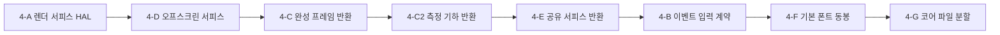
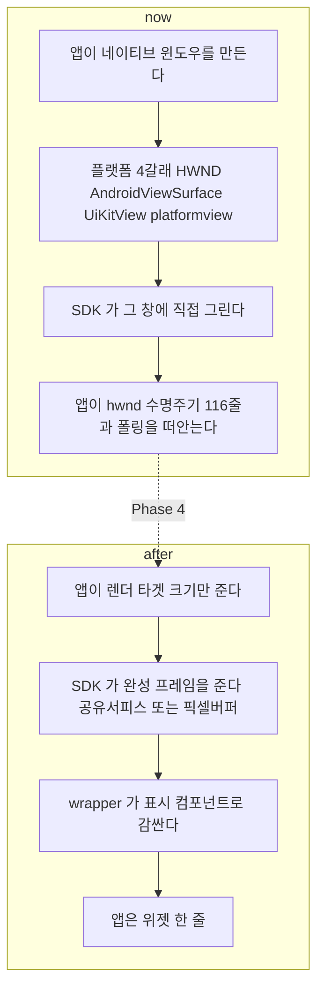

# Phase 4 — 렌더 서피스 HAL·출력 경계 계층화

> **상태**: 미시작
> **⚑ 판정 시험 ② 재정의(2026-08-02)**: 언어 범위가 Qt/C++ 1종으로 좁혀지면서(→[../goal.md §1 ⚑](../goal.md)) **"Python 이 창 없이"** 라는 표현이 근거를 잃었다. **헤드리스 요구 자체는 그대로 남는다** — 이유가 "언어 독립 증명" 에서 **"CI 가 렌더 회귀를 판정할 유일한 수단"** 으로 바뀐다(§3.2).
> **범위**: `sonex-framework` 의 **렌더 출력 계약**. SDK 가 받는 것을 윈도우 핸들에서 렌더 타겟 크기로, 주는 것을 없음에서 완성 프레임으로 바꾼다. **`ImageRenderer` 의 알고리즘 본문은 건드리지 않는다.**
> **선행**: [Phase 3](./phase3-layer-boundary.md) — 3-A(iOS 빌드 역방향)·3-E(C ABI 타입 누수)·3-F(공개 헤더 정본화)가 이 phase 의 API 작업이 설 바닥이다
> **후행**: [Phase 5](./phase5-language-wrappers.md) — 순서를 뒤집으면 지금의 결합 4갈래가 언어 수만큼 곱해진다([rendering-boundary.md §8](../rendering-boundary.md))
> **근거**: **사양서 = [rendering-boundary.md](../rendering-boundary.md)** · 실측 SOT = [../../review/sonex-framework.md §2.2·§4·§10.2](../../review/sonex-framework.md) · [../../review/legacy/sonex-rendering.md](../../review/legacy/sonex-rendering.md). 이 문서의 줄번호는 `master` `f336e25b` 직접 확인(2026-07-30)

---

## 1. 배경

### 1.1 이 문서가 하는 일

**판단은 [rendering-boundary.md](../rendering-boundary.md) 에서 이미 끝났다.** 목표 경계(§7)·계층 셋(§4)·SDK 가 소유해야 하는 것(§3)·wrapper 산출물(§7.2)을 여기서 다시 세우지 않는다.

**이 문서의 일은 그것을 코드 변경 단위로 번역하는 것 하나다.** 그래서 각 Step 은 "무엇이 옳은가"가 아니라 **어느 파일의 무엇을 어떤 순서로 바꾸는가**만 적는다.

### 1.2 착수 전 실측 정정 — **있는 자산이 이전 판단보다 적다**

이 절이 이 문서에서 가장 중요하다. 이전 판이 **없는 것을 있다고 셌고**, 그 위에서 작업량을 낮게 잡았다.

| 항목 | 이전 판단 | **실측(2026-07-30)** |
|---|---|---|
| PBuffer | "주석만 해제하면 된다" | **구현된 적이 없다.** EGL config 블록 `HCImageRenderCore.cpp:900-912` **전체가 주석**(MSAA x4 시도분)이고 `EGL_PBUFFER_BIT` 는 그 주석 줄(`:908`) 안의 **재주석**이다. 활성 config(`:914-920`)에는 `EGL_SURFACE_TYPE` **자체가 없다**. SDK 전체에 `eglCreatePbufferSurface` 호출 **0건** — 있는 곳은 iOS 샘플 `sdk/adk/sample/iOS_SampleApp/iOS_SDK_SampleApp/AngleProbe.mm:39,56`(동작 확인 probe) |
| `g_cineFbo` | "헤드리스 렌더가 이미 된다" | **헤드리스가 아니다.** `HCImageRenderCore.cpp:77-381`(`namespace cine`)·`:2650-2785`(`processOneCineJobGL`). **기존 GL 컨텍스트를 전제**하고 `prevFbo` 를 백업·복원할 뿐(`:2710-2711`, `:2763`) **컨텍스트를 만들지 않는다** → 창 없이는 못 돈다 |
| 측정 기하 반환 | "이미 있다" | **C ABI 는 0건.** `hc_GetMeasureObjectsData` 는 앱 Dart 선언만, `hc_GetRenderObjects` 는 앱에도 프레임워크에도 없다 |

**이 오류의 성격을 남긴다** — 앱이 심볼을 **선언**한 것을 SDK 가 **제공**하는 것으로 읽은 **증거 차원 혼동**이었다. 앱 `NativeMethods.dart` 는 `lookup()` 실패를 `print` 로 덮으므로(`:973`·`:992`·`:1034`) 선언이 있어도 런타임에 조용히 없을 수 있다. **선언은 존재의 증거가 아니다.** 이후 단계에서 "이미 있다"를 주장할 때는 반드시 **정의 위치**를 댄다.

### 1.3 다만 프레임 반환 경로가 **하나 실제로 돌고 있다** — 새 실측

`[실측 2026-07-30]` 위 정정을 적용해도 **4-C 는 백지가 아니다.** 브리핑이 "픽셀 반출은 `hc_ReadRenderedImage` 하나뿐"이라고 본 것보다 상태가 낫다.

| API | 정의 | 플랫폼 | 성격 |
|---|---|---|---|
| `hc_GetBufferRenderedFrameAt` | `HCSonexSDKInterface.cpp:430-471` | **가드 없음(전 플랫폼)** | ScanBuffer `[frameIdx]` 를 **SDK 렌더 파이프라인에 다시 넣어** RGBA 로 반환. **티어 ②의 실동작 원형** |
| `hc_renderCineFrameFromGray` | `HCImageRenderer.cpp:1047-1054` | 가드 없음 | 위의 하위 위임. **공개 헤더 `sdk/include/HCImageRenderer.h:206` 에 있는 유일한 프레임 반환 경로** |
| `hc_GetBufferRawFrameAt` | `HCSonexSDKInterface.cpp:378` | 가드 없음 | raw grayscale — 티어 ① 성격. 위가 실패하면 앱이 이쪽으로 폴백 |
| `hc_ReadRenderedImage` | `HCSonexSDKInterface.cpp:331-339` | **`#if OS_IOS`** | 현재 바인드된 프레임버퍼 readback |

**호출 사슬이 이미 이어져 있다** — `hc_GetBufferRenderedFrameAt` → `SonexSDK::renderCineFrame`(`HCSonexSDK.cpp:1111-1140`, `GetProcAddress`/`dlsym` 로 ImageRenderer export lookup) → `hc_renderCineFrameFromGray` → `cine::submitCineJobExternal`(`HCImageRenderCore.cpp:357`) → 렌더 스레드 잡 큐(`:2559`·`:2571`) → `processOneCineJobGL` → `ensureCineFbo`(`:303`) → `renderScanB->render`(`:2757`) → `glReadPixels`(`:2760`).

**한계 셋이 그대로 4-C 의 작업 항목이 된다.**

| # | 한계 |
|---|---|
| ① | **B 모드만 합성한다** — `renderScanB` 하나만 그린다. CF·Spectrum·눈금·측정 오버레이가 빠진다 |
| ② | **기존 GL 컨텍스트·렌더 스레드를 전제한다** — 잡 큐를 도는 것이 `worker()`(`:5226`)이고 그것은 `initialize(nativeWindow, false)` 이후에만 존재한다. **창 없이는 못 돈다**(4-D 가 이것을 푼다) |
| ③ | **입력이 ScanBuffer 인덱스 고정** — 라이브 현재 프레임을 뽑는 형태가 아니다 |

> **주석이 코드보다 낡았다.** 공개 문서 주석은 *"1차 단계: skeleton — 항상 NOT_PREPARED 반환"*(`HCSonexSDKInterface.h:376` 앞 주석)이라 적었으나 구현은 이미 FBO 합성까지 간다. `hc_ReadRenderedImage` 쪽은 반대 방향으로 틀렸다 — *"ANGLE renders to off-screen pbuffer"* 라고 적었는데 **pbuffer 는 존재하지 않는다.** 둘 다 4-C 에서 정정한다.

### 1.4 HAL 이 없는 둘이 정확히 렌더링과 이벤트다

| 대상 | 상태 |
|---|---|
| 소켓 | ✓ `HCCompSocket{Windows,Android,IOS}` 3벌 |
| 오디오 출력 | ✓ `HCAudioPlayer_{Windows,Android,iOS}` 3벌 |
| AI 필터 | Apple 만 (`HNSFilter{,V2}_{iOS,macOS}.mm`) |
| **렌더 서피스** | **없음** — `HCiOSGLContext.mm`(586줄)이 유일했고 CMakeLists 에서 **주석 처리**됐다(*"HCiOSGLContext는 ANGLE 사용 시 불필요"*) |
| **이벤트 입력** | **없음** — `hc_DispatchTouchEvent` 로 앱이 좌표를 밀어넣는다 |

그래서 `HCImageRenderCore.cpp`(shared)가 직접 플랫폼 API 를 부른다 — **플랫폼 분기 21곳**, **EGL 함수 22종**, `GetDC((HWND) nativeWindow)`(`:767`), `eglCreateWindowSurface(display, bestConfig, (EGLNativeWindowType) nativeWindow, surfaceAttr)`(`:1030`). **윈도우 핸들이 공개 API 로 샌다** — `hc_PrepareRenderer(void* nativeWindow, bool useAppThread, int streamIndex)`.

**분기점은 이미 서 있다** — `:888-893` 이 `nativeWindow != nullptr` 로 `initNativeDisplay()` / `initCurrentDisplay()`(`:708-754`)를 가른다. 후자는 `eglGetCurrentDisplay`·`eglGetCurrentContext`·`eglGetCurrentSurface` 로 **호출자가 이미 current 로 만들어 둔 컨텍스트를 채택**한다. 스스로 만들지 않으므로 헤드리스는 아니지만, **4-A 의 HAL 이 붙을 자리는 이 분기다.**

### 1.5 이 phase 가 없애는 앱 측 결합 — 기준선

| 실측 | 값 |
|---|---:|
| `Texture` 위젯 · `TextureRegistrar` · `registerTexture` (스캔 경로) | **0건** — 티어 ②가 아예 없다 |
| `scan_controller.dart` 총 줄수 / `hwnd` 언급 | 8,299 / **116** |
| `open_gl_view.dart` + `native_view_widget.dart` + `native_view_controller.dart` | 265 + 117 + **901** |
| Windows 렌더링 의존 | **`flutter_native_view: ^0.0.2`**(0.0.x 서드파티) |
| 측정 오버레이 조율 계층 3파일 | **1,273**(605 + 429 + 239) |

플랫폼 4갈래 — Windows `flutter_native_view`+HWND / Android `PlatformViewLink`+`AndroidViewSurface` / iOS `UiKitView` / macOS platform view.

### 1.6 미확인 — 착수 전·중 확인 대상

서사로 메꾸지 않는다. 각 항목이 걸리는 Step 을 함께 적는다.

- **`hc_ReadRenderedImage` 의 정확한 소스** — 구현은 FBO 바인드 없이 `glReadPixels`(`:2801`) 하므로 **호출 시점에 바인드된 프레임버퍼**를 읽는다. 그 경로에 FBO 바인드가 없어 **기본 프레임버퍼(윈도우 서피스)로 판단**하나, 렌더 스레드와의 호출 순서를 실행으로 확인하지 않았다 → C-3
- **`useAppThread` 의 런타임 실제 값** — 호출 순서 의존이라 코드만으로 확정 불가. 실행 로그가 필요하다 → A-5
- **Flutter Impeller 전환**(Skia GL → Metal/Vulkan)과 external texture 경로의 정합성 — 앱 쪽을 이 관점으로 보지 않았다 → [Phase 5](./phase5-language-wrappers.md) 의 Flutter wrapper 설계에 직접 영향
- **Android ANGLE Vulkan 백엔드의 실제 폴백 빈도** — 기기별 드라이버 편차 → E-2
- **표시 컴포넌트의 프레임 갱신 감지 방식**(SDK 콜백 vs 폴링)과 **앱 생명주기**(pause/resume) 처리 — [rendering-boundary.md §7.2](../rendering-boundary.md) 가 책임 목록만 정했고 방식은 정하지 않았다 → B-3·E-4
- **폰트 미설정 시 현행 동작** → F-5
- **`processOneCineJobGL` 이 라이브 프레임에도 안전한가** — 지금은 freeze 상태 전제로 `renderScanB` 의 텍스처를 일시 덮어쓴다(`:2703-2707`). **C-2(현재 프레임 반환)가 이 전제를 깬다**

### 1.7 하지 않는 것

**`ImageRenderer` 의 스캔변환·graymap·도플러·눈금·측정 알고리즘 본문은 그대로 둔다.** 4-A·4-G 가 바꾸는 것은 **윈도우를 받느냐 프레임을 주느냐**, 그리고 **파일이 몇 개로 나뉘느냐**이지 계산 로직이 아니다. diff 에서 알고리즘 본문 변경 **0줄**을 확인한다(§3.3).

**ANGLE 도 제거하지 않는다.** `ImageRenderer` 가 OpenGL ES 로 쓰였고(glad + GLES2 셰이더), Windows 에는 네이티브 GLES 가 없으며 Apple 은 OpenGL ES 를 deprecate 했다. **바뀌는 것은 노출 여부지 제거가 아니다**([rendering-boundary.md §4.2](../rendering-boundary.md)).

---

## 2. 진행 단계

**4-A 가 먼저인 이유** — 나머지 전부가 "서피스를 어디서 얻는가"에 걸린다. **4-G 가 마지막인 이유** — 앞 단계가 코어에서 EGL·플랫폼 분기를 이미 걷어내므로 남은 분할 대상이 줄고, 헤더를 건드리는 작업이라 [Phase 3-F](./phase3-layer-boundary.md)(공개 헤더 정본화) 완료가 전제다.

### Step 4-A. 렌더 서피스 HAL 신설

**대상**: `HCImageRenderCore.cpp` 의 플랫폼 분기 **21곳** · EGL 함수 **22종** → `sdk/platform/{windows,android,ios,macos,linux}/render_surface`([r1 plan.md §2.2](./plan.md) 폴더 구조). **창 없이 도는 것(headless)은 플랫폼이 아니라 서피스 종류 `offscreen` 이다**([plan.md §0.1.1](./plan.md)).

| # | 작업 |
|---|---|
| A-1 | **인터페이스 정의** — `sdk/features/ImageRenderer/ports/i_render_surface_port.h`([r1/plan.md §2.0·§2.2](./plan.md) feature-first 채택분). display 획득 · config 선택 · surface 생성 · context 생성/current · swap · resize · destroy. **surface 종류 3개**: `window`(현행) · `adopted`(호출자 컨텍스트 채택) · `offscreen`(4-D) |
| **A-1a** | **`test/mocks/mock_render_surface.cpp` 를 A-1 과 같은 커밋에 낸다** — 호출을 기록만 하고 고정값을 반환하는 단위테스트 더블(1-B·1-C 의 실물 흉내 더블과는 다르다, [phase1 §2 Step 1-G G-4](./phase1-regression-baseline.md)). **[r1/plan.md §2.3 AF-4](./plan.md)** 가 이걸 CI 로 강제한다 — 포트만 내고 mock 을 안 내면 게이트 실패 |
| **A-1b** | **`ImageRenderer` 의 `domain/` 단위테스트 착수 — A-1a 가 서는 즉시.** mock 렌더 서피스 위에서 스캔변환·좌표계·측정 계산을 GL 컨텍스트 없이 검증한다. 1-C(헤드리스 골든, 실 EGL)를 기다리지 않는다 — 이 항목이 [phase1 G-3](./phase1-regression-baseline.md) 의 "재개방" 표를 실행한다 |
| A-2 | **플랫폼 구현 5벌** — windows(`GetDC`/HWND) · android(`ANativeWindow`) · ios/macos(ANGLE 정적링크 + `dlsym(RTLD_DEFAULT, ...)`) · **linux**(EGL 네이티브, [Phase 0-G·0-L](./phase0-build-reproducibility.md) 타깃). 라이브러리 로딩 분기(`LoadLibrary`/`dlopen`/더미 핸들 `0x1`)가 전부 여기로 내려간다 |
| A-3 | **`ImageRenderCore` 에서 EGL 호출 전부 제거** — 코어는 HAL 이 준 컨텍스트 위에서 GL 만 부른다. `eglCreateWindowSurface`(`:1030`)·`GetDC`(`:767`)·백엔드 폴백 순서(`:774-793`)가 이동 대상 |
| A-4 | **널 윈도우 분기 흡수** — `:888-893` 의 2갈래를 HAL 의 surface 종류로 재표현한다. `initCurrentDisplay`(`:708-754`)는 **`adopted` 모드로 보존한다**(iOS 브리지가 이 경로를 쓴다) |
| A-5 | **`useAppThread` 를 계약으로 승격** — 지금은 인자 하나로 렌더 스레드 소유가 갈리고(`initialize`, `:669-706`) 호출처마다 값이 다르며 `start()` 는 빈 stub 이다(`:1956-1961`, 본문이 `// TODO: start render`). **소유를 명시 API 로 표현**하고 stub 을 없앤다 |
| A-6 | **공개 API 에서 윈도우 핸들 제거** — `hc_CreateRenderTarget(width, height)` · `hc_ResizeRenderTarget` 신설. **`hc_PrepareRenderer` 는 deprecated 로 남긴다** — 앱 4갈래가 아직 그것을 부르므로 즉시 제거하면 [Phase 5](./phase5-language-wrappers.md) 전에 앱이 깨진다 |

> **A-3 이 이 Step 의 판정 기준이다.** `ImageRenderCore` 에서 `egl*` grep 0건이 되면 HAL 이 선 것이고, 남아 있으면 이름만 옮긴 것이다(§3.5·3.6).

### Step 4-B. 이벤트 입력 경로 정비

**HAL 을 신설하지 않는다 — 이것이 이 Step 의 판단이다.** [rendering-boundary.md §7.1](../rendering-boundary.md) 이 "이벤트 입력 HAL 없음"을 결손으로 적었으나, **그 결손은 SDK 가 창을 소유할 때만 결손이다.** 티어 ②로 가면 이벤트를 먼저 받는 쪽은 언제나 앱의 UI 프레임워크이고, SDK 가 OS 이벤트 루프를 소유하면 §2 의 합성·Z-order 문제가 되돌아온다.

**조작 소유는 SDK 에 남긴다** — `HCTouchRecognizer`(`.cpp` 268 + `.h` 83)가 drag·double-click 판정까지 하는 구조를 유지한다. SDK 가 그리면 조작 대상(캘리퍼 핸들)의 위치도 SDK 만 알기 때문이다([rendering-boundary.md §7.3](../rendering-boundary.md)).

| # | 작업 |
|---|---|
| B-1 | **좌표계 계약 명문화** — 앱이 넘기는 좌표는 **렌더 타겟 좌표**다. 위젯 좌표 → 렌더 타겟 좌표 변환은 **wrapper 의 표시 컴포넌트 책임**(Phase 5) |
| B-2 | **`hc_DispatchTouchEvent`(streamIndex 有)와 `hc_DispatchCineTouchEvent`(streamIndex 無) 2갈래 통일** — 렌더 타겟 단위로 일원화. cine 전용 분기가 남는 것은 티어 ② 부재의 흔적이라 4-C 완료 후 소멸 대상 |
| B-3 | **히트테스트 결과 반환** — 어느 객체를 잡았는지 앱이 알아야 커서·햅틱을 낼 수 있다. 현재는 반환값이 결과코드뿐 |
| B-4 | 좌표 스케일 계약 — `hc_SetDisplayMultiplier`(density)와 렌더 타겟 크기의 관계를 헤더에 명시. 지금은 앱이 추측한다 |

### Step 4-C. 완성 프레임 반환 API 승격

**§1.3 이 이 Step 의 출발점이다** — 처음부터 만드는 것이 아니라 **이미 도는 cine 경로를 일반화하고 공개 계약으로 올리는 것**이다.

| # | 작업 |
|---|---|
| C-1 | **`hc_GetBufferRenderedFrameAt` 의 합성 범위 확장** — 지금은 `renderScanB` 하나만 그린다(`:2757`). **CF · Spectrum · 눈금(`HCScanSideRuler`) · 측정 오버레이**까지 합성한다. **[rendering-boundary.md §7.4](../rendering-boundary.md) 의 1,273 LOC 를 없애는 것이 이 항목이지 4-C2 가 아니다** |
| C-2 | **입력을 "현재 프레임"으로 확장** — 지금은 ScanBuffer 인덱스만 받는다. 라이브 최신 프레임을 반환하는 형태를 추가한다 |
| C-3 | **`hc_ReadRenderedImage` 가드 정리** — ABI·파사드는 `#if OS_IOS`(`HCSonexSDKInterface.cpp:331`·`.h:280-291`·`sdk/include/HCSonexSDKInterface.h:253-264`·`HCSonexSDK.cpp:483-491`)인데 **코어 메서드만 `#if OS_IOS \|\| OS_MACOS`**(`HCImageRenderCore.cpp:2787-2811`)다. **macOS 는 구현이 빌드되지만 부르는 쪽이 없다.** 전 플랫폼으로 연다 |
| C-4 | **거짓 주석 2건 정정** — ① *"ANGLE renders to off-screen pbuffer, so we need to read pixels manually"*(양쪽 헤더) — **pbuffer 는 없다.** 실제는 현재 바인드된 기본 프레임버퍼 readback이다 ② *"1차 단계: skeleton — 항상 NOT_PREPARED 반환"*(`HCSonexSDKInterface.h`) — 구현이 이미 앞서 있다 |
| C-5 | **공개 헤더 승격** — `hc_GetBufferRenderedFrameAt` 은 `sdk/include/` 에 **없다**(구현 헤더에만). 공개 헤더에 있는 프레임 반환 경로는 `sdk/include/HCImageRenderer.h:206` 의 `hc_renderCineFrameFromGray` 뿐이다. [Phase 3-F](./phase3-layer-boundary.md) 의 정본 헤더에 올린다 |
| C-6 | **앱 선언 3종을 되살리지 않는다** — `hc_ReadLastFramebufferBgra` · `hc_RequestCaptureNextFrame` · `hc_GrabFrontBufferBgraNow` 는 프레임워크에 정의 0건이다. **같은 일을 하는 이름이 셋인 것 자체가 계약 부재의 증상**이므로 정본 1개로 흡수하고 앱 선언은 폐기한다 |
| C-7 | **반환 계약 확정** — 픽셀 포맷(RGBA/BGRA) · 원점(상단/하단) · 스트라이드 · 버퍼 소유. 현행 cine 경로는 `orthoMat` 의 t/b swap 으로 GL 단계에서 flip 해 Flutter 규약에 맞춘다(`:2721-2753`). **이 암묵 규약을 헤더에 명시**하지 않으면 언어별 wrapper 가 각자 flip 한다 |

### Step 4-C2. 측정 기하 반환 API 신규 구현

`[실측 2026-07-30]` **C++ 직렬화는 이미 있고 C ABI 만 없다.**

| 있는 것 | 없는 것 |
|---|---|
| `ImageRenderCore::exportMeasurements(String& outJson)` · `importMeasurements(const String&)` — `HCImageRenderCore.h:269-270` · `HCImageRenderer.h:157-158` · `HCImageRenderer.cpp:988-996` | `hc_GetMeasureObjectsData`(앱 선언만) · `hc_GetCineMeasureObjectsData`(앱 선언만) · `hc_GetRenderObjects`(**어디에도 없음**) |

| # | 작업 |
|---|---|
| C2-1 | **`exportMeasurements`·`importMeasurements` 를 C ABI 로 승격** — 반환 문자열 수명은 `hc_ReleaseWCharPointer` 계열 규약을 따른다 |
| C2-2 | **JSON 스키마 확정 + 공개 헤더 문서화** — 측정 13종(`shared/measure/` 7,099 LOC) · 좌표계(**영상 좌표계 mm 기준**) · 단위 · 프레임 식별자 |
| C2-3 | **주석 처리된 `importMeasurements` 호출 판정** — `HCSonexSDK.cpp:1623-1626` 에 회귀 진단 흔적(*"review 가 살아나면 importMeasurements 가 원인 확정"*)으로 호출이 주석 처리돼 있다. **원인을 먼저 확인**하고 복구할지 폐기할지 정한다 |
| C2-4 | **용도 한정을 헤더에 명시** — **그리기용이 아니다.** 측정값 리스트·리포트·접근성·앱 자체 주석용이다. 이것이 흐려지면 고객사가 각자 그리기 시작하고 [rendering-boundary.md §7.3](../rendering-boundary.md) 의 전제가 무너진다 |
| C2-5 | 앱 선언과 이름·시그니처 정합 — 앱이 `hc_GetMeasureObjectsData(int, Pointer<Float>, int)` 로 선언한 형태(`NativeMethods.dart:1738`)를 그대로 따를지, JSON 정본으로 흡수할지 결정 |

> **없으면 사양이 성립하지 않는다.** [rendering-boundary.md §7.3](../rendering-boundary.md) 이 "보조 경로"로 전제한 것이 이것이며, 지금은 그 전제가 코드에 없다.

### Step 4-D. 오프스크린 서피스 **신규 구현**

**되살리는 것이 아니라 새로 만드는 것이다**(§1.2).

| # | 작업 |
|---|---|
| D-1 | **EGL config 에 `EGL_SURFACE_TYPE` 을 세운다** — 활성 config(`:914-920`)에 없다. `EGL_WINDOW_BIT \| EGL_PBUFFER_BIT` 를 명시하고, 주석 블록(`:900-912`)은 정리한다 |
| D-2 | **HAL 의 `offscreen` 서피스 구현**(4-A A-1 의 세 번째 종류) — pbuffer 또는 surfaceless 컨텍스트 생성. **이것이 "headless" 의 실체다** — 플랫폼이 아니라 서피스 종류이며, 플랫폼 구현 5벌 각각이 이 종류를 지원할 수 있다(Linux surfaceless 가 가장 깨끗) |
| D-3 | **출발점 = `AngleProbe.mm:39,56`** — iOS 샘플이 `EGL_SURFACE_TYPE, EGL_PBUFFER_BIT` config 로 `eglCreatePbufferSurface` 를 성공시키는 선례다. 백지가 아니다 |
| D-4 | **백엔드별 지원 편차 실측** — D3D11·D3D9·Metal·Vulkan·OpenGL 각각에서 pbuffer/surfaceless 가 되는지 확인하고, **헤드리스 전용 폴백 순서**를 별도로 둔다(창 있는 경로의 순서 `:774-793` 과 다를 수 있다) |
| D-5 | **[Phase 1-C](./plan.md)(헤드리스 렌더 골든)와 한 벌** — 1-C 가 검증용으로 먼저 세운 경로를 정식 API 로 승격한다. **두 번 구현하지 않는다** |
| D-6 | 렌더 스레드 소유 정리 — 헤드리스에서는 잡 큐를 도는 `worker()`(`:5226`) 대신 **동기 호출**이 자연스럽다. A-5 의 계약이 두 모드를 함께 표현해야 한다 |

> **판정 시험 ②가 여기서 성립한다** — 4-D 없이는 §3.2 를 통과할 수 없고, 그러면 [Phase 1-C](./phase1-regression-baseline.md)(헤드리스 렌더 골든)도 서지 않는다.

### Step 4-E. 공유 서피스 반환 추가

**제로카피가 본선, 픽셀 버퍼(4-C)가 폴백이다.** 이 순서를 뒤집으면 "성능 때문에 안 된다"는 반론이 정당해진다([rendering-boundary.md §4.1](../rendering-boundary.md)).

| # | 작업 |
|---|---|
| E-1 | **플랫폼별 생성을 HAL(4-A) 아래에 둔다** — Windows D3D11 shared handle · Apple `IOSurface` · Android `AHardwareBuffer`. **현재 사용처 0건**(`EGLImage`·`IOSurface`·`AHardwareBuffer` 전부, glad 는 함수 포인터만 로드) |
| E-2 | **ANGLE 백엔드 정합 확인** — Windows D3D11 과 Apple Metal 은 자연스럽게 낸다. **Android 는 Vulkan 백엔드가 1순위**(`:774-793`)라 `AHardwareBuffer` 연동 경로를 별도 확인한다 |
| E-3 | **GL 텍스처 ID 반환은 하지 않는다** — 고객사와 GL 컨텍스트를 공유해야 하므로 **ANGLE 이 다시 노출된다.** 이 phase 의 목적과 정면으로 어긋난다 |
| E-4 | **한 API 뒤에 두 반환 형태** — 공유 서피스 실패 시 픽셀 버퍼로 자동 폴백하고, 어느 쪽인지 호출자가 조회할 수 있게 한다 |
| E-5 | **wrapper 등록은 Phase 5 소관** — HAL 이 **생성**하고 wrapper 가 `CVPixelBuffer`·`SurfaceTexture`·Flutter GPU surface descriptor 로 **등록**한다. 이 선을 4-E 에서 넘지 않는다 |

### Step 4-F. 기본 폰트 동봉

**freetype 은 SDK 에 남는다** — 그리는 텍스트가 전부 영상 좌표 종속이기 때문이다(깊이 눈금 `depthText`·`topCmText`·`graduationTexts`, 측정 `resultText`·`angleText`·`volumeText`). 앱으로 빼면 **좌표계가 두 곳에 생긴다**([rendering-boundary.md §3.1](../rendering-boundary.md)). 개선 여지는 아키텍처가 아니라 **패키징**이다.

| # | 작업 |
|---|---|
| F-1 | **폰트 선정** — 재배포 가능한 라이선스(OFL 등). [goal.md B4](../goal.md)(재배포 라이선스) 축과 직결되므로 고지 문안까지 함께 정한다 |
| F-2 | **배포 패키지에 포함** — [Phase 2-A](./plan.md) 의 8구성에 폰트 항목 추가 |
| F-3 | **초기화 시 자동 적재** — 기존 `hc_SetFontRawData(rawData, size)` 경로를 그대로 쓴다. 고객사가 아무것도 하지 않아도 텍스트가 나오는 것이 목표다 |
| F-4 | **`hc_SetFontFilePath` 는 남긴다** — 다국어·고객사 지정 폰트 대체용 |
| F-5 | **폰트 미설정 상태의 현행 동작 확인** — 눈금·측정 수치가 조용히 사라지는지 미확인이다. 사라진다면 의료기기 관점의 결함이므로 F-3 의 우선순위가 올라간다 |

### Step 4-G. `HCImageRenderCore.cpp` 분할

**7,679 LOC · 141 메서드 — 이 저장소 최대 God class.** 헤더도 842줄이다.

**이미 물리적으로 나뉜 것이 있다** — `shared/objects/` 8,141 · `shared/measure/` 7,099 · `shared/shader/` 527. **분할 대상은 코어 한 파일이다.**

| 책임 | 근거(현행 위치) | 갈 곳 |
|---|---|---|
| 서피스·컨텍스트 | 플랫폼 분기 21곳 · EGL 22종 | **4-A 의 HAL** (이 phase 안에서 이미 빠진다) |
| cine 오프스크린 | `namespace cine` `:77-381` · `processOneCineJobGL` `:2650-2785` | `HCImageRenderOffscreen.cpp` |
| 렌더 루프·스레드 | `worker()` `:5226` · `renderCv` wait/notify | `HCImageRenderLoop.cpp` |
| 듀얼·cine 상태 | 파일 내 `cine`/`dual` 언급 **1,046줄** · 뮤텍스로 나뉜 컨테이너 12개 이상 | `HCImageRenderDual.cpp` |
| 터치 히트테스트·측정 객체 수명 | `onPressed`/`onReleased` 계열 | `HCImageRenderInput.cpp` |
| 좌표 변환·zoom | ortho 행렬·`setZoom`·cine zoom 상태 | `HCImageRenderGeometry.cpp` |
| 잔여 = 프레임 합성 본체 | | `HCImageRenderCore.cpp` |

| # | 작업 |
|---|---|
| G-1 | **[Phase 3-F](./phase3-layer-boundary.md) 완료 확인이 선행** — 렌더러 공개 헤더가 **4벌**이고 이미 표류했다(`HCImageRenderCore.h` 가 사본 간 50줄·599줄 차이, `sizeof` 가 갈린 ODR 잠재 결함). **정본이 서기 전에 분할하면 표류가 곱해진다** |
| G-2 | **mechanical move 만 한다** — 함수 본문 편집 금지. 이동 단위마다 커밋을 나눠 diff 로 판정 가능하게 한다 |
| G-3 | 각 이동 직후 [Phase 1](./plan.md) 회귀 하니스(헤드리스 렌더 골든)로 즉시 판정 |
| G-4 | **하드코딩 절대경로 제거** — `onPressed`/`onReleased` 안의 `fopen_s(..., "c:\\Users\\Rio\\work\\sonex-app\\log\\press.log", "a")`(`:5734`·`:5864`). **모든 터치마다** 존재하지 않는 경로에 append 를 시도한다. 저비용 동시 정리 |
| G-5 | 파일 크기 상한을 CI 판정 항목으로 — 다시 자라는 것을 막는다. 이 파일은 **2026-04-29 → 06-15 6주 반에 +68%** 로 자랐다 |

> **G-5 의 배경**: 이 코드는 지금 가장 빠르게 자라는 코드이고, 증식 구간이 곧 듀얼/cine 이다. 분할만으로는 되돌아온다.

---

## 3. 검증

| # | 항목 | 방법 | 기대 |
|---|---|---|---|
| 3.1 | **판정 시험 ①** | SDK 단독 샘플을 ADK 없이 빌드 | 성공 ([Phase 3-A·3-K](./phase3-layer-boundary.md) 전제). **타깃 구분 없음** — 컴파일·링크 시점 속성이라 실장비 유무가 결과에 영향 없다 |
| 3.2 | **판정 시험 ②** | **CI 가 창 없이** 연결 → 스캔 → 프레임 획득 — [phase1 Step 1-H](./phase1-regression-baseline.md)의 `sdk-connect-scan-render` 와 **동일 시나리오**, `TARGET=mock`(mock 장치 서버, Phase 1-B)·`TARGET=device`(실장비) 둘 다. 드라이버 언어는 무관하다 | **둘 다** 성공. **이 phase 의 최종 판정** |
| 3.3 | **알고리즘 본문 불변** | `git diff` — `objects/`·`measure/`·`shader/` 및 스캔변환·graymap·도플러 함수 본문 | **변경 0줄** |
| 3.4 | 픽셀 동등성 | 4-A·4-G 전후 헤드리스 골든(Phase 1-C) 대조 | 바이트 일치 |
| 3.5 | 플랫폼 분기 제거 | `ImageRenderCore` 에서 `OS_WINDOWS\|OS_ANDROID\|OS_IOS\|OS_MACOS` grep | **0건** (현재 21) |
| 3.6 | EGL 제거 | `ImageRenderCore` 에서 `egl[A-Z]` grep | **0건** (현재 22종) |
| 3.7 | 윈도우 핸들 비노출 | 공개 헤더에서 `void* nativeWindow` grep | 0건(deprecated 표기분 제외) |
| 3.8 | 프레임 반환 API 이식성 | 프레임 반환 심볼의 `#if OS_` 가드 | **0건** (현재 `hc_ReadRenderedImage` 가 iOS 전용) |
| 3.9 | 합성 범위 | `hc_GetBufferRenderedFrameAt` 결과에 CF·Spectrum·눈금·측정이 포함 | 라이브 화면과 픽셀 동등 |
| 3.10 | 측정 기하 계약 | C ABI 로 export → import 왕복 | 측정값 불변 |
| 3.11 | 헤드리스 백엔드 | 백엔드 5종 × pbuffer/surfaceless | 지원표 작성. **미지원은 숫자로 명시** |
| 3.12 | 공유 서피스 | 플랫폼 3종에서 제로카피 경로 | 성공 또는 **폴백이 자동 동작** |
| 3.13 | 폰트 무설정 | `hc_SetFont*` 를 부르지 않고 스캔 | 눈금·측정 텍스트가 그려진다 |
| 3.14 | 파일 크기 | 코어 단일 파일 | 상한 이하 (현재 7,679) |
| 3.15 | 바인딩 정합 | Phase 1-D 스크립트 | 앱 참조 렌더 심볼 중 정의 부재 **0건** (현재 29/108 중 렌더·재생 계열 다수) |
| 3.16 | 성능 | 공유 서피스 경로 fps vs 픽셀 버퍼 폴백 | 폴백 저하폭을 수치로 기록 |
| **3.17** | **`domain/` 단위테스트 커버리지**(A-1a·A-1b) | `mock_render_surface` 위에서 도는 gtest 스위트 | **존재하고 CI(`make test-unit`)에서 통과** (현재 0 — `ImageRenderer` 전체가 1-C 통합테스트로만 판정됨) |

> **3.2 가 진짜 게이트다.** 나머지가 전부 통과해도 **창 없이 돌지 않으면 CI 가 렌더 회귀를 판정할 수단이 없다** — [Phase 1-C](./phase1-regression-baseline.md) 헤드리스 골든이 여기 걸리고, 그것이 없으면 4-G(코어 7,679 LOC 분할)의 픽셀 동등성(§3.4)을 확인할 수 없어 **파일 분할이 회귀를 위장한다.** 부수 효과로 다른 언어 wrapper 도 이 경계 위에서 수렴한다 — **그것은 이번 범위가 아니지만 경계는 같다.**

---

## 4. 위험 · 대응

| 위험 | 영향 | 대응 |
|---|---|---|
| **pbuffer·surfaceless 가 ANGLE 백엔드별로 편차** | 4-D 지연에 그치지 않는다 — **Phase 1-C 가 막히면 렌더 회귀 oracle 자체가 없어져 이 phase 전체가 판정 불가** | 1-C 를 pbuffer 에만 걸지 않는다. **이미 도는 `g_cineFbo`+`hc_GetBufferRenderedFrameAt` 을 1차 경로로**, pbuffer 는 대안. 픽셀 readback 은 느려도 골든 비교에는 충분 |
| **`hc_PrepareRenderer` 제거가 앱 4갈래를 즉시 깬다** | 앱이 Phase 5 전에 못 돈다 | A-6 대로 **deprecated 병행 유지**. 제거는 Phase 5 의 `SonexScanView` 가 선 뒤 |
| **렌더 스레드 계약이 실동작 기준으로 확정되지 않았다** | 4-A 가 관측되지 않은 동작을 바꾼다 | `useAppThread` 는 호출처마다 값이 다르고 `prepareRender()` 는 이미 초기화됐으면 인자를 무시한다 — **정적 분석으로 확정 불가.** A-5 착수 전 **실행 로그로 실제 값을 1회 관측**한다 |
| **cine 경로가 지금 가장 빠르게 자라는 코드다**(6주 +68%) | 4-C·4-G 가 병행 개발과 충돌 | 착수 시점 기준 커밋을 힐세리온과 합의. `master` 가 주 개발선이므로 diverge 관리가 [Phase 0-0](./plan.md) 의 반영 방식 합의에 걸린다 |
| **공유 서피스가 일부 조합에서 불가** | E-1 이 반쪽 | E-4 의 자동 폴백을 **처음부터** 계약에 넣는다. 미지원 조합은 [Phase 6-E](./plan.md) 지원 매트릭스에 명시 |
| **4-G 가 표류한 헤더 4벌 위에서 진행** | ODR 잠재 결함이 실현된다 | G-1 — **Phase 3-F 완료가 착수 조건.** 정본 1벌 + 설치 규칙이 선 뒤에만 파일을 쪼갠다 |
| **측정 기하 API 를 "그리기용"으로 오해** | 고객사가 각자 그려 캘리퍼 표시가 기기마다 갈린다 — 의료기기 품질·인증 문제 | C2-4 — 헤더·문서·샘플 셋 다에 용도 한정을 적는다. 샘플에 **드로잉 예제를 넣지 않는다** |
| **"정리하는 김에" 알고리즘을 손댄다** | 화질·측정값 회귀. 파일 분할이 회귀를 위장한다 | 3.3 을 **매 커밋 게이트**로. mechanical move 외 변경은 별도 커밋으로 분리 |
| **1,273 LOC 조율 계층이 앱 저장소에 있다** | 이 phase 만으로는 사라지지 않는다 | 없애는 것은 4-C(C-1) 이지만 **삭제는 [Phase 8-E](./phase8-app-migration.md) 소관**이다. 이 phase 는 **삭제 가능 조건을 만드는 데까지** |
| ANGLE 실배치를 아직 회수 못 함 | Phase 0 이 안 끝나면 여기까지 오지 못함 | 이 phase 의 선행 전부([Phase 0](./plan.md)·1·2·3)가 그 위에 있다. 별도 대응 없음 |

---

## 5. 이 phase 가 여는 것

**[Phase 5](./phase5-language-wrappers.md) 가 여기서 비로소 수렴한다.** 지금 wrapper 를 쓰면 그 일이 `언어 × UI프레임워크 × 플랫폼` 으로 불어나지만, 티어 ②가 서면 **모든 UI 프레임워크가 이미 갖고 있는 표준 이미지 경로**(Flutter `Texture` · WPF `D3DImage` · Android `SurfaceTexture` · Apple `CVPixelBuffer`/`MTLTexture`)에 얹는 일로 줄어든다.

그리고 **[Phase 6](./plan.md) 의 Qt6/C++ 샘플이 성립한다.** 판정 시험 ②와 같은 코드가 CI 회귀 하니스로 그대로 쓰인다.

**남는 것은 그대로 남는다** — `ImageRenderer` 의 도메인 가치(스캔변환·graymap·도플러 합성·좌표계·눈금·측정 텍스트), ANGLE(내부 구현 상세로), freetype(기본 폰트 동봉으로 부담만 제거), `HCTouchRecognizer`(조작 소유).

---

## 6. cross-reference

- **[../rendering-boundary.md](../rendering-boundary.md) — 이 phase 의 사양서.** §3(경계 기준) · §4(계층 셋) · §7(목표 경계) · §7.1(HAL) · §7.2(wrapper 산출물) · §7.3(드로잉·입력 소유) · §7.4(1,273 LOC 의 원인)
- [./plan.md](./plan.md) §4 Phase 4 — 이 문서의 뼈대. Phase 0~3 선행 항목과 Phase 5~6 후행
- [./phase3-layer-boundary.md](./phase3-layer-boundary.md) — 3-A(iOS 빌드 역방향) · 3-E(C ABI) · **3-F(공개 헤더 정본화, 4-G 의 착수 조건)**
- [./phase5-language-wrappers.md](./phase5-language-wrappers.md) — 이 phase 의 산출물을 소비한다. 5-C 의 "진짜 부재" 심볼이 4-C·4-C2 의 구현 대상
- [../../review/sonex-framework.md](../../review/sonex-framework.md) §2.2(HAL 절반) · §3.5(앱 심볼 29/108 부재) · §4(렌더링) · §10.2(God class)
- [../../review/legacy/sonex-rendering.md](../../review/legacy/sonex-rendering.md) — 렌더 계층 상세. §3(ANGLE 스택) · §4(Flutter 결합 4갈래) · §5(렌더 루프 계약) · §7.1(헤더 4벌 표류) · §9(6주 +68%)
- [../gap.md](../gap.md) §3(ANGLE) · §4(고객사 부담) · §7.2(바인딩 오탐)
- [../goal.md](../goal.md) — B4(재배포 라이선스, 4-F) · B5(샘플) · B6(지원 경계)
