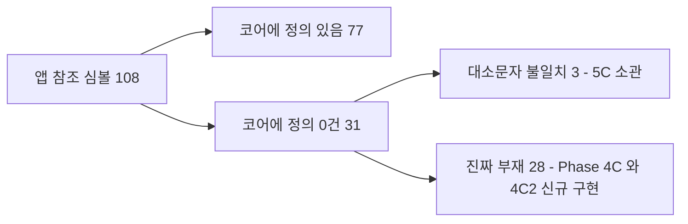
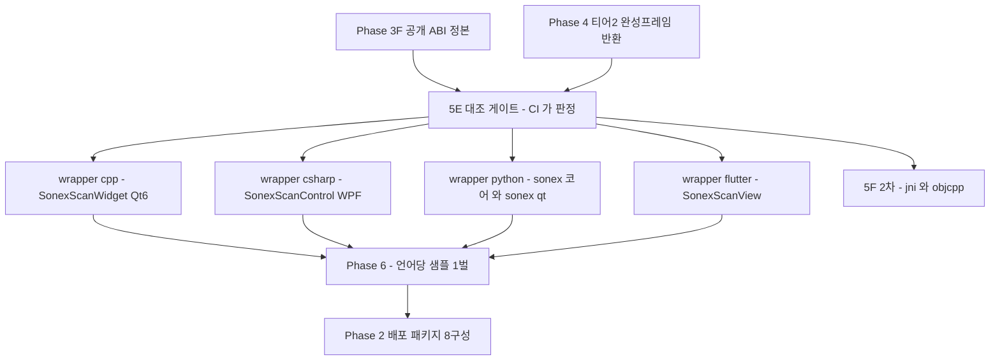

# Phase 5 — 언어별 wrapper 정본화

> **상태**: 미시작
> **범위**: `sonex-framework` 작업 사본의 `wrapper/`. **바인딩을 새로 발명하지 않는다 — 27벌 14,363 LOC 를 정본 1벌씩으로 수렴시키고 그 정합을 CI 가 판정하게 한다.** 산출물은 언어별 **표시 컴포넌트**이지 심볼 목록이 아니다([../rendering-boundary.md §7.2](../rendering-boundary.md)).
> **선행**: [Phase 4](./phase4-render-boundary.md) — 순서를 뒤집으면 지금의 서피스 결합 4갈래가 언어 수만큼 곱해진다
> **후행**: [Phase 6](./phase6-samples-support.md)
> **근거**: [../goal.md §5.2·§5.3·B5](../goal.md) · [../rendering-boundary.md §7.2](../rendering-boundary.md) · [../gap.md §7.1·§7.2](../gap.md) · 실측 SOT = [../../review/sonex-framework.md](../../review/sonex-framework.md)
> **실측 기준**: `sonex-framework` `master` `f336e25b`(2026-07-23) · `sonex-app` `master`. 이 문서의 수치는 2026-07-30 재측정분이다.

---

## 1. 배경

### 1.1 재료는 이미 있다 — 없는 것은 정본이다

`[실측]` **5개 언어 27개 파일, 14,363 LOC.** 전부 샘플 또는 앱 안에 있고 **배포 산출물은 0벌**이다([../gap.md §7.2](../gap.md)).

| 언어 | 파일 | 위치 | LOC |
|---|---:|---|---:|
| Dart | 14 | 앱 `lib/services/sdk/` 5 + `lib/services/adk/` 9 | 7,281 |
| ObjC++ | 3 | SDK 샘플 1 + 앱 iOS·macOS 2 | 3,146 |
| C#(P/Invoke) | 4 | SDK 샘플 3 + `ADK_Sample_Test` 1 | 1,801 |
| JNI(C++) | 3 | SDK 샘플 1 + ADK 샘플 1 + 앱 1 | 1,670 |
| Java | 3 | SDK 샘플 1 + ADK 샘플 1 + 앱 1 | 465 |
| **합계** | **27** | | **14,363** |

**Python 만 진짜 백지다.** `[실측]` 프레임워크 전체에 `ctypes`·`pybind11`·`cffi` 사용처가 **0건**이고, 존재하는 `.py` 6개는 빌드 스크립트와 PyTorch→CoreML/ONNX 변환기다.

### 1.2 이미 표류했다 — 형태가 셋이고, 대조 방법이 각각 다르다

**"복제 27벌" 로 뭉뚱그리면 5-B 의 작업 내용을 정하지 못한다.** 실측하면 표류가 세 종류다.

| 형태 | 실측 | 잡는 방법 |
|---|---|---|
| **① 본문 표류** | `SonexSDKBridge.mm` 3벌 MD5 전부 상이. `hc_*` 심볼 **20 / 22 / 23** | 심볼 집합 대조로는 **부족하다**(아래) |
| **② 범위 표류** | JNI 3벌 **328 / 1,154 / 188 LOC**, `hc_*` 심볼 **19 / 17 / 12** | 합집합 대비 각 벌의 결손 |
| **③ 세대 표류** | C# 4벌 중 **2벌이 존재하지 않는 ABI 세대**에 묶여 있다 | 공개 ABI 대비 **미존재 심볼** 검출 |

**①이 심볼 대조를 빠져나간다.** 앱 iOS 와 앱 macOS 는 심볼이 `hc_SetFontFilePath` **1개** 차이인데, 공백 정규화 후 본문은 **iOS 전용 35줄 · macOS 전용 153줄** 이 갈렸다. 즉 **심볼 집합이 같아도 두 벌이 다른 코드다.** SDK 샘플 벌과 앱 iOS 벌도 148줄이 다르다.

**②는 복제가 아니라 각자 다른 부분집합이다.** 앱 JNI 12심볼은 SDK 샘플 JNI 19심볼의 **완전한 부분집합**(교집합 12)이고, ADK 샘플 `jni.cpp` 는 `JNIEXPORT` **49개**로 ADK 쪽에 치우쳐 있다(SDK 샘플 16 · 앱 11).

**③이 새로 드러난 것이다.** `[실측]` C# 4벌 중 둘은 `hc_*` 를 **하나도 부르지 않는다**.

| 파일 | LOC | 부르는 심볼 | 코어에 존재 |
|---|---:|---|---|
| `SDK_Sample_Windows/NativeMethods.cs` | 327 | `hc_*` 15 | ✓ |
| `ADK_Sample_Test/Model/NativeMethods.cs` | 1,263 | `hc_*` 18 | ✓ |
| `SDK_DeviceManager_Sample_Windows/NativeMethods.cs` | 145 | `sn_CreateSonexSDKInstance`·`sn_ConnectDevice`·`sn_SendCommand` 계열 | **0건** |
| `SDK_ImageRender_Sample_Windows/NativeMethods.cs` | 66 | `imageRendererPrepare`·`setCallbackFuncPointer` 계열 | **0건** |

뒤 두 벌 **211 LOC** 는 코어 어디에도 없는 심볼을 `LibraryImport("SonexSDK.dll")` 로 선언한다 — C# P/Invoke 는 첫 호출에서 `EntryPointNotFoundException` 이므로 **빌드는 되고 실행이 죽는다.** 5-D 의 C# 작업은 "4벌→1벌 병합"이 아니라 **2벌 폐기 판정 + 2벌 병합**이다.

### 1.3 계약이 어디에도 없다 — 앱 호출의 82%가 공개 헤더 밖이다

`[실측]` 이것이 표류가 계속되는 구조적 이유다.

| | 값 |
|---|---:|
| 앱 `lib/services/` 가 참조하는 `hc_*` 고유 심볼 | **108** |
| 그중 공개 헤더 `sdk/include/HCSonexSDKInterface.h`(27심볼) 안에 있는 것 | **19** |
| **공개 헤더 밖** | **89 (82%)** |

공개 헤더 27심볼 중에도 **8개는 앱이 부르지 않는다.** 즉 고객사가 받는 계약과 실제로 쓰이는 계약이 **거의 겹치지 않는다.** 바인딩이 27벌로 갈라진 것은 관리 소홀이 아니라 **맞출 기준이 없었기 때문**이며, 그래서 5-B 의 대조 기준은 저장소 전체가 아니라 **[Phase 3-F](./phase3-layer-boundary.md) 가 만드는 공개 ABI 여야 한다.**

### 1.4 부재 29건 — 성격을 가르는 것이 이 phase 의 판단이다

`[실측]` 앱이 참조하는 108개 중 **29개가 프레임워크 정의 0건**이다(`.cpp`·`.h`·`.mm`·`.cs`·`.java` 전수, `master`·`feature-apply_v1.23.4` 양쪽).

**그런데 기준을 "실제로 링크되는 코어"(샘플 제외)로 좁히면 31개다.** 차이 2건이 이 phase 의 논지 자체다.

| 심볼 | 코어 정본 철자 | 저장소 전 파일 grep 에서 "존재"로 잡힌 이유 |
|---|---|---|
| `hc_setLogMessageCallback` | `hc_SetLogMessageCallback` | `SDK_Sample_Windows/NativeMethods.cs:51,154` 가 **같은 오철자를 복제** |
| `hc_setLogMessageToConsole` | `hc_SetLogMessageToConsole` | 〃 `:54,150` |

**손으로 쓴 바인딩 두 벌이 독립적으로 같은 오타에 도달했고, 그래서 전 파일 대조에서 오타가 오타를 가린다.** 정본 헤더에 대조하지 않으면 이 종류는 영원히 안 잡힌다.

코어 기준 31건의 분류:



| 분류 | 건수 | 심볼 | 소관 |
|---|---:|---|---|
| **대소문자 불일치** | 3 | `hc_ReleaseWcharPointer`↔`hc_ReleaseWCharPointer` · `hc_setLogMessageCallback`↔`hc_SetLogMessageCallback` · `hc_setLogMessageToConsole`↔`hc_SetLogMessageToConsole` | **5-C** — 철자 교정 |
| **진짜 부재** | 28 | 렌더·재생 경로 대량 — `hc_ReadLastFramebufferBgra`·`hc_GrabFrontBufferBgraNow`·`hc_RequestCaptureNextFrame`·`hc_GetMeasureObjectsData`·`hc_SetPlaybackScanMode`·`hc_PushPlaybackFrameWithType` 등 | **[Phase 4-C·4-C2](./phase4-render-boundary.md)** — 신규 구현 |

**이 구분을 흐리면 Phase 4 의 작업이 Phase 5 의 오타 정리로 위장된다.** 28건은 wrapper 를 고쳐서 사라지는 것이 아니라 **SDK 가 그 기능을 아직 제공하지 않는다는 뜻**이고, 그것이 [../rendering-boundary.md §7.4](../rendering-boundary.md) 의 리뷰 조율 1,273 LOC 가 존재하는 이유와 같은 원인이다.

**앱은 실패를 로그로 덮는다** — `[실측]` `lib/services/` 전체에 `print("[실패] … 함수를 찾을 수 없음")` 방어가 **49군데**다(`NativeMethods.dart:731,849,870,892,910,930,950,973,992,1014,…`). 컴파일러가 검증하지 못하므로 오타가 런타임까지 가고, 런타임에서도 예외가 삼켜진다.

### 1.5 모듈 로드를 앱이 한다 — wrapper 가 흡수해야 할 책임

`[실측]` `NativeMethods.dart:91-140` 이 **DLL 25개를 이름과 순서를 지정해 직접 로드**한다. 그중 `// Sonex 기본 모듈들 (순서 중요)` 주석이 붙은 블록이 15개이고, 앞의 10개는 ANGLE 2(`libEGL.dll`:93 · `libGLESv2.dll`:94)와 OpenCV·freetype·DCMTK 다. Android 는 `SonexJNI.java` 에서 `System.loadLibrary()` 를 모듈별로 나열한다.

**이 목록이 캡슐화 부재의 신호다.** 정상적인 동적 링크라면 import table 을 따라 의존물이 자동 로드되므로 목록 자체가 필요 없다. 그리고 목록에 **OpenCV 두 버전(`opencv_world490d.dll`·`opencv_world345.dll`)이 함께 실린다** — 한 프로세스가 서로 다른 OpenCV 두 벌을 로드하고 있다는 뜻이며, 이 사실이 앱 Dart 소스에만 기록돼 있다.

**실제 사고가 났다** — 2026-05-29, 커밋 `adea11b` 가 *"Sonex 핵심 모듈들만"* 이라며 `sqlite3`·`opencv_world345`·`BackupReadWriter`·`DatabaseHelper`·`VideoEncoder` 를 제거하자 `SonexFramework.dll` 의 cascade dependency 가 깨져 `DynamicLibrary.open` 시 **ERROR 127**, **ADK 가 작동하지 않았다**. 목록이 앱 소스에만 있어 정리하면 깨지고, 한 번 깨졌으며, 되돌리는 데 시간이 걸렸다.

**wrapper 가 이 지식을 흡수하지 않으면 고객사가 같은 사고를 다시 낸다.** 로드 순서·ANGLE 초기화·모듈 분해도는 wrapper 초기화 함수 뒤로 들어가야 할 **SDK 내부 구현 상세**다([../rendering-boundary.md §4.2](../rendering-boundary.md)).

### 1.6 있어야 할 자리가 비어 있다 — `flutter_sonex_sdk`

`[실측]` `sonex-app/pubspec.yaml:114-115` 에 **주석으로만** 남아 있다.

```yaml
  # Sonex SDK Flutter Plugin
  # flutter_sonex_sdk:
  #   path: /Users/rio/work/sonex-framework/flutter_sonex_sdk/
```

경로가 개발자 로컬이고, `sonex-framework` 에 실물이 없으며 `.podspec` 도 없다. **이름으로 보아 SDK 저장소 안에 두려던 산출물인데 만들어지지 않았다.** 5-D 의 Flutter 항목이 정확히 이 자리를 채운다.

### 1.7 선례 — 같은 문제 형태를 이미 한 번 풀었다

**복제 다수 · 정본 부재 · 이름 표류.** [../legacy/proof/protocol-sot/](../legacy/proof/protocol-sot/) 가 HC 프로토콜에서 이 형태를 풀었고, 방법이 그대로 적용된다.

| protocol-sot 에서 한 것 | Phase 5 대응 |
|---|---|
| 원본 3벌을 **옮겨 적지 않고** 커밋 SHA 로 고정한 미러에서 `reconcile.py` 가 직접 읽는다 | 5-B 의 대조 스크립트가 27벌과 공개 헤더를 **직접 읽는다** |
| 전수 대조 — 값 138개, 명명 불일치 41건, **같은 이름 다른 값 0건** | 5-B — 심볼 합집합 대비 각 벌의 결손·오철자·미존재 |
| 원본 철자 198개를 **전부 별칭으로 보존** → 호출부 한 줄도 안 바꾼다 | 5-C — 오철자를 지우기 전에 **별칭으로 먼저 잇는다** |
| **컴파일러가 동작 보존을 판정**(`_Static_assert`) | 5-E — 헤더↔바인딩 불일치를 **CI 가 판정** |
| `make check` 가 원본과 어긋나면 실패 | 5-E — 헤더 변경이 바인딩 갱신 없이 통과하지 못한다 |

**차이는 하나다.** protocol-sot 은 `#define` 상수를 다뤘으므로 컴파일러가 전부 판정했지만, 바인딩은 **문자열 리터럴 `lookup()`** 이라 컴파일러가 닿지 않는다. 그래서 5-E 는 컴파일러가 아니라 **별도 대조 게이트**여야 한다 — 이 phase 에서 가장 중요한 신규 장치다.

### 1.8 범위 한계

| 이 phase 가 하는 것 | 하지 않는 것 |
|---|---|
| 흩어진 27벌을 `wrapper/` 로 수집·정본화 | **부재 28건의 SDK 측 구현** — [Phase 4-C·4-C2](./phase4-render-boundary.md) |
| 공개 ABI 대비 심볼 정합 | **공개 ABI 자체의 확정** — [Phase 3-F](./phase3-layer-boundary.md) |
| 언어별 표시 컴포넌트 제공 | **샘플·문서** — [Phase 6](./phase6-samples-support.md) |
| 오철자 교정과 별칭 | **앱(`sonex-app`)이 정본 wrapper 를 소비하도록 바꾸는 일** — 앱 저장소 트랙([plan.md §7](./plan.md)) |

---

## 2. 진행 단계

### Step 5-A. `wrapper/` 신설 — 정본 위치 확보

**코드를 고치기 전에 자리부터 만든다.** 지금은 `wrapper` 라는 개념 자체가 없어 어느 벌이 정본인지 물을 수 없다.

| # | 작업 |
|---|---|
| A-1 | `wrapper/{cpp,csharp,python,flutter,jni,objcpp}/` 신설([plan.md §2.2](./plan.md)) |
| A-2 | **`sample/` 과의 구분을 문서화** — `wrapper/` 는 **고객사가 링크하는 계약**, `sample/` 은 그 사용례([../goal.md B5](../goal.md)). 지금 이 구분이 아예 없어 27벌이 전부 샘플·앱 안에서 발견된다 |
| A-3 | 27벌을 **원본 위치 그대로 둔 채** `wrapper/*/vendored/` 로 커밋 SHA 와 함께 복사 — protocol-sot 의 `vendored/` 와 같은 방식. 정본이 설 때까지 원본은 움직이지 않는다 |
| A-4 | 각 벌의 출처(저장소·경로·커밋 SHA·MD5)를 기계 판독 가능한 매니페스트로 |

> **A-3 이 되돌릴 수 있게 만든다.** 원본을 먼저 옮기면 "정본이 원본과 같은가"를 물을 대조 대상이 사라진다.

### Step 5-B. 전수 대조 — 공개 ABI 기준

**기준은 [Phase 3-F](./phase3-layer-boundary.md) 가 확정한 공개 헤더다.** 저장소 전체가 아니다 — §1.4 가 그 이유를 보여준다.

| # | 작업 |
|---|---|
| B-1 | 공개 ABI 심볼 집합 추출 — SDK(`sdk/include/`) + **신설되는 ADK 공개 헤더**(현재 0건, `HCSonexADKInterface.h` 25심볼이 후보) |
| B-2 | 27벌 각각의 심볼 집합 추출. 언어별 파서가 다르다 — Dart `lookup<...>("hc_*")` 문자열 · C# `[LibraryImport]`/`[DllImport]`+`EntryPoint` · JNI `JNIEXPORT` 함수와 그 안의 `hc_*` 호출 · ObjC++ 직접 호출 |
| B-3 | **4갈래 판정** — ⓐ 공개 ABI 에 있고 벌에도 있음 ⓑ 공개 ABI 에만 있음(미노출) ⓒ 벌에만 있음(**미존재 심볼**) ⓓ 대소문자·철자만 다름 |
| B-4 | **본문 표류 별도 측정** — 심볼 집합이 같아도 본문이 갈린다(§1.2 ①: iOS 35줄 · macOS 153줄). 공백 정규화 diff 로 벌 간 차이를 수치화 |
| B-5 | **③ 세대 표류 판정** — `sn_*`·`imageRendererPrepare` 계열 2벌(211 LOC)이 코어에 0건임을 확정하고 **폐기 대상으로 분류** |
| B-6 | 결과를 protocol-sot `make report` 형식의 표로 — 각 벌의 결손·초과·오철자 건수 |

**출발점은 `SonexSDKBridge.mm` 3벌**이다(MD5 전부 상이, 심볼 20/22/23). 다만 B-4 없이 심볼만 보면 앱 iOS·macOS 가 "1개 차이"로 보여 **표류를 과소평가한다.**

### Step 5-C. 누락·오타 해소 — 대소문자 3건

**5-C 의 소관은 3건이다.** 나머지 28건은 [Phase 4-C·4-C2](./phase4-render-boundary.md) 로 넘긴다(§1.4).

| # | 작업 |
|---|---|
| C-1 | **성격 분류 확정** — B-3 의 ⓓ(철자)와 ⓒ(미존재)를 가른다. 이 분류가 이 phase 와 Phase 4 의 경계다 |
| C-2 | **별칭 먼저, 삭제는 나중** — 코어에 `hc_ReleaseWcharPointer`·`hc_setLogMessageCallback`·`hc_setLogMessageToConsole` 를 정본 심볼의 별칭으로 export 한다. protocol-sot 이 원본 철자 198개를 보존한 것과 같은 이유 — **도입이 호출부를 한 줄도 바꾸지 않아야** 첫 변경의 위험이 0 이 된다 |
| C-3 | 정본 wrapper 는 **정본 철자만** 쓴다. 별칭은 기존 앱·샘플의 호환용이며 폐기 일정을 붙인다 |
| C-4 | **`print` 방어 49군데 정리 방침 결정** — 정합이 CI 로 판정되면 이 방어는 실패를 숨기는 쪽으로만 작동한다. 앱 트랙 작업이므로 여기서는 **목록과 방침만** 낸다 |
| C-5 | C# 죽은 바인딩 2벌(211 LOC) 처리 — 폐기 또는 정본 재작성. `SDK_DeviceManager_Sample_Windows`·`SDK_ImageRender_Sample_Windows` 는 **샘플이기도 하므로** [Phase 6-A](./phase6-samples-support.md) 와 함께 판단 |

> **C-2 가 이 phase 를 "안전한 첫 변경"으로 만든다.** 별칭 추가는 기존 심볼을 하나도 건드리지 않으므로, 지금 도는 앱과 샘플이 그대로 돈다.

### Step 5-D. 1차 정본 4종 — C++ · C# · Python · Flutter

**산출물은 심볼 목록이 아니라 표시 컴포넌트다**([../rendering-boundary.md §7.2](../rendering-boundary.md)).

| 언어 | 현재 | 작업 성격 | 표시 컴포넌트 |
|---|---|---|---|
| **C++** | 공개 헤더가 계약(27/54 심볼) | 헤더 정비 | **`SonexScanWidget`(Qt6 우선)** |
| **C#** | P/Invoke 4벌 1,801 LOC(그중 2벌 사용 불가) | 2벌 폐기 + 2벌 병합 | `SonexScanControl`(WPF UserControl) |
| **Python** | **0건** | **신규 — 유일한 백지** | 코어는 **Qt 무의존**, GUI 는 `sonex[qt]` 선택 패키지(**PySide6**) |
| **Flutter** | Dart 1,869 LOC(앱 내부) | **추출·이사** | `SonexScanView` |

| # | 작업 |
|---|---|
| D-1 | **공통 저수준 계약 확정** — 모든 언어가 같은 것을 감싼다. 초기화(모듈 로드 흡수, §1.5) · 연결 · 스캔 제어 · 렌더 타겟 생성/크기변경 · 프레임 획득 · 입력 전달 |
| D-2 | **고수준과 저수준을 함께 낸다** — 표시 컴포넌트(대부분 고객사, 한 줄)와 `textureId`+제어 API 직접 노출(자체 합성이 필요한 고객사). 위젯만 있으면 커스터마이즈가 막히고, 저수준만 있으면 지금의 배관이 언어마다 반복된다 |
| D-3 | **위젯이 떠안는 책임 다섯** 을 언어마다 동일하게 구현 — 텍스처 수명주기 · 크기 변경 감지 · 터치 좌표 변환 · 프레임 갱신 알림 · 앱 생명주기(pause/resume) |
| D-4 | **C++ / Qt6** — `QQuickFramebufferObject`·`QRhiWidget`(6.7+)·`QOpenGLWidget` 중 경로 선택. Qt6 를 고르는 근거는 `moana` 의 사내 Qt 경험 재사용 · LGPLv3 동적 링크로 **라이선스 비용 0** · 데스크톱 3종 커버 · 텍스처 통합 경로 존재 |
| D-5 | **Python** — `sonex`(코어, Qt 의존 없음, 프레임을 배열로 반환) + `sonex[qt]`(선택, **PySide6**). **PyQt6 가 아니다** — PySide6 는 Qt Company 공식 LGPLv3 라 고객사 상용 제품에 동적 링크할 수 있으나 PyQt6(Riverbank)는 GPLv3 또는 상용이라 고객사 코드까지 영향을 준다 |
| D-6 | **Flutter** — 신규 작성이 아니라 **이사**다: `open_gl_view.dart` 265줄(플랫폼 4분기 → `Texture` 한 갈래) · `native_view_widget.dart` 117줄(소멸) · `scan_controller.dart` 의 `hwnd` 116줄 + 재생성·폴링 61줄 → 전부 위젯 내부로 |
| D-7 | **C#** — 살아 있는 2벌(`SDK_Sample_Windows` 327 · `ADK_Sample_Test` 1,263)을 병합. `ADK_Sample_Test` 가 ADK 커버리지를 갖고 있으므로 **SDK 섹션+ADK 섹션 구조**로 |
| D-8 | **모듈 로드 흡수** — §1.5 의 25개 목록과 ANGLE 초기화를 wrapper 초기화 뒤로. 고객사 코드에서 `libEGL`·`libGLESv2` 이름이 사라지는 것이 판정 기준이다 |

> **[Phase 3-E](./phase3-layer-boundary.md) 가 선행되어야 5-D 가 성립한다.** `extern "C"` 인데 C++ 클래스 포인터를 반환하는 것이 **28건**이고 `hc_create*Instance` 계열 6모듈이 전부 여기 해당한다. C#·Java·Python 에서 **소비할 수 없는 형태**이므로 opaque handle 로 교체되지 않으면 정본 wrapper 를 쓸 수 없다.

> **Linux 가 1순위 호스트다** — 주 개발 PC 이고([plan.md §0.1](./plan.md)) Phase [0-G](./phase0-build-reproducibility.md)·[0-L](./phase0-build-reproducibility.md)이 `OS_LINUX` 분기와 `platforms/linux` 를 만든다. **Python 코어(Qt 무의존)와 Qt6 표시 컴포넌트 둘 다 Linux 에서 먼저 선다.** 이전 판의 *"core 가 Linux 를 지원하지 않아 Windows·macOS 로 시작"* 은 Linux 1급화 이전 서술이다.

### Step 5-E. 생성·검증 자동화 — 이 phase 의 핵심 장치

**컴파일러가 닿지 않는 경계라 게이트를 따로 세워야 한다**(§1.7).

| # | 작업 |
|---|---|
| E-1 | **공개 헤더를 단일 입력으로 확정** — 5-B 의 파서를 재사용해 심볼·시그니처를 기계 판독 형태로 추출 |
| E-2 | **불일치 판정 CI 게이트** — 헤더에 있는데 바인딩에 없거나, 바인딩에 있는데 헤더에 없거나, 철자가 다르면 **실패**. [Phase 1-D](./phase1-regression-baseline.md) 의 오탐 검출 스크립트를 정본 대상으로 확장한 것 |
| E-3 | **시그니처까지 대조** — 심볼 이름만 맞고 인자 개수·타입이 다르면 런타임에 스택이 깨진다. 이름 일치는 최소 조건이지 충분 조건이 아니다 |
| E-4 | **생성 도입 여부 판단** — 헤더를 입력으로 바인딩을 **생성**할지, 손으로 쓰되 대조만 할지. 생성이 이상적이나 언어별 표시 컴포넌트(5-D)는 생성 대상이 아니므로 **저수준만 생성 + 고수준은 수작업** 이 현실적이다 |
| E-5 | **헤더 변경이 바인딩 갱신 없이 통과하지 못하게** — protocol-sot 의 `make check` 와 같은 위치의 게이트 |

> **E-2 가 없으면 5-B~5-D 의 효과가 한 번에 소멸한다.** 27벌이 갈라진 것은 대조 장치가 없었기 때문이고, 정본 1벌을 만들어도 장치가 없으면 다시 갈라진다.

### Step 5-F. 2차 — JNI · ObjC++

**미루는 이유는 비용이 아니라 순서다.** 지금 이 둘이 가장 심하게 표류한 바인딩이고(§1.2 ①·②), **이 상태로 공개하면 표류한 3벌을 그대로 계약으로 굳힌다.**

| # | 작업 |
|---|---|
| F-1 | ObjC++ 3벌 정본화 — 본문 diff(iOS 35 · macOS 153 · 샘플 148줄)를 하나로 수렴. `hc_SetFontFilePath` 유무처럼 **의도된 차이와 표류를 구분**해 기록 |
| F-2 | JNI 3벌 정본화 — 합집합 기준으로 결손을 채운다. 앱 12심볼 ⊂ SDK 샘플 19심볼이므로 **앱 벌이 정본이 될 수 없다** |
| F-3 | Java 계층 정리 — `System.loadLibrary()` 모듈 나열(§1.5)을 wrapper 초기화로 흡수 |
| F-4 | Android View · UIView 표시 컴포넌트 |

**신규 개발이 아니다.** Flutter 가 이 둘 위에 서 있어 어차피 유지되는 코드이고, 공개는 코드를 만드는 일이 아니라 **계약으로 고정하는 일**이다. [Phase 4](./phase4-render-boundary.md)(서피스 배관 감소)와 5-B~5-D(표류 해소) 뒤에는 추가 비용이 거의 없다.

---

## 3. 검증

| # | 항목 | 명령 | 기대 |
|---|---|---|---|
| 3.1 | 정본 벌 수 | `wrapper/` 트리 확인 | 1차 4언어 **각 1벌** |
| 3.2 | **심볼 정합** | 5-E 대조 게이트 | 공개 ABI ↔ 정본 wrapper **불일치 0건** |
| 3.3 | **미존재 심볼** | 〃 | 정본 wrapper 가 부르는 심볼 중 코어 정의 0건인 것 **0개** (현재 앱 기준 31) |
| 3.4 | **철자** | 〃 | 대소문자 불일치 **0건** (현재 3) |
| 3.5 | **시그니처** | 〃 | 인자 개수·타입 불일치 0건 |
| 3.6 | **회귀 검출** | 헤더에 심볼 1개 추가 후 바인딩 미갱신 | **CI 가 실패해야 한다** |
| 3.7 | 〃 | 바인딩 심볼 1개를 대소문자만 바꿔 재도입 | **CI 가 실패해야 한다** |
| 3.8 | **모듈 로드 은폐** | 정본 wrapper 소비 코드 grep | `libEGL`·`libGLESv2`·개별 모듈 DLL 이름 **0건** |
| 3.9 | **Python 헤드리스** | 창 없이 연결→스캔→프레임 획득 | 통과 ([../rendering-boundary.md §7](../rendering-boundary.md) 판정 시험 ②) |
| 3.10 | Flutter 배관 소멸 | 앱 측 `hwnd` grep | **0** (현재 116) · `flutter_native_view` 의존 제거 |
| 3.11 | 죽은 바인딩 | `sn_*`·`imageRendererPrepare` 계열 | `wrapper/` 아래 **0건** |
| 3.12 | 표시 컴포넌트 | 각 언어 최소 사용례 | **한 줄**로 스캔 화면이 뜬다 |

> **3.6·3.7 이 진짜 게이트다.** 나머지는 "지금 맞다"를 보이지만 이 둘만이 **"앞으로도 어긋날 수 없다"**를 보인다. 27벌 표류의 원인이 정확히 이 장치의 부재였다.

---

## 4. 위험 · 대응

| 위험 | 영향 | 대응 |
|---|---|---|
| **Phase 4 가 부재 28건을 다 채우지 못한다** | 3.3 미달. 정본 wrapper 가 미존재 심볼을 그대로 안고 간다 | **성격 분류(5-C-1)를 먼저 확정**하고 미구현분은 정본에서 **제외**한다. 앱 쪽 `print` 방어를 그대로 두는 것이 아니라 **미지원 API 로 명시**한다 |
| **Phase 3-E(C ABI 타입 누수 28건) 미완** | C#·Java·Python 정본이 아예 성립하지 않는다 | **5-D 착수 전제로 못박는다.** 3-E 미완이면 5-D 는 C++·Flutter 만 진행하고 나머지는 대기 |
| 공개 ABI(3-F) 확정이 늦어져 대조 기준이 없다 | 5-B 가 저장소 전체를 기준으로 삼아 §1.4 의 오류를 반복 | **5-B 를 3-F 뒤로 고정.** 기준 없이 대조하면 "오타가 오타를 가리는" 결과가 그대로 남는다 |
| **오철자 교정이 지금 도는 앱·샘플을 깨뜨린다** | 출하 중인 앱 회귀 | **5-C-2 별칭 우선.** protocol-sot 이 원본 철자 198개를 보존한 것과 같은 이유 — 첫 변경이 "값도 이름도 동작도 그대로"여야 한다 |
| 표시 컴포넌트가 언어 × UI프레임워크로 다시 폭발한다 | wrapper 수렴 실패 | **[Phase 4](./phase4-render-boundary.md) 의 티어 ②(완성 프레임 반환)가 선행 조건.** 티어 ③(윈도우 인계)이 남아 있으면 C# 만 해도 WinForms·WPF·MAUI·Unity 로 갈린다. 1차는 **프레임워크당 대표 1종**(C#=WPF)으로 한정하고 저수준 API 를 함께 공개해 나머지를 고객사가 잇게 한다 |
| **Qt6 를 고르는 판단이 뒤집힌다** | C++ 정본 재작업 | LGPLv3 동적 링크·사내 경험·데스크톱 3종 커버가 근거이며 **Linux 미지원은 이미 인지된 제약**이다(D-4 주석). 저수준 API 와 표시 컴포넌트를 분리했으므로 Qt 를 바꿔도 저수준은 남는다 |
| Python 코어에 Qt 가 딸려 들어간다 | CI·헤드리스에서 부담. **3.9 판정 시험이 무의미해진다** | `sonex` / `sonex[qt]` 분리를 패키지 메타에서 강제하고, **코어 패키지에 PySide6 import 가 0건임을 CI 가 판정** |
| PySide6 대신 PyQt6 가 섞여 들어간다 | 고객사 코드가 GPLv3 영향 | 의존성 검사에 **PyQt 계열 금지 규칙**을 명시. B4(재배포 라이선스) 판정 항목과 연결 |
| **5-F 를 계속 미룬다** | 표류한 JNI·ObjC++ 가 방치되고, Flutter 가 그 위에 서 있어 표류가 Flutter 로 전파 | 5-F 는 **선택이 아니라 순서**다. Flutter 정본(5-D)이 ObjC++·JNI 를 경유하므로 **5-D 완료 시점에 이미 상당 부분이 정리된다** — F 단계에서 남는 것은 계약 고정뿐 |
| 생성(codegen) 도입이 커진다 | 5-E 가 phase 를 잡아먹는다 | **E-4 에서 명시적으로 가른다** — 저수준만 생성, 고수준은 수작업. 생성이 어려우면 **대조만으로도 3.6·3.7 은 성립한다**(protocol-sot 이 그렇게 했다) |
| 병행 개발이 27벌을 계속 바꾼다 | 정본이 서기 전에 원본이 움직인다 | A-3 의 커밋 SHA 고정 + A-4 매니페스트. protocol-sot 이 원본을 SHA 로 고정한 것과 같은 이유 |

---

## 5. 이 phase 가 여는 것

**고객사에게 처음으로 줄 수 있는 물건이 생긴다.** 지금은 Flutter 고객사에게 줄 것이 없고([../gap.md §7.1](../gap.md)), Python 고객사에게는 아무것도 없으며, C# 고객사에게 주면 4벌 중 2벌이 실행 중에 죽는다.



| 열리는 것 | 근거 |
|---|---|
| **[Phase 6](./phase6-samples-support.md) 이 성립한다** | 샘플은 wrapper 의 사용례다. 정본이 없으면 샘플이 어느 벌을 쓰는지 물을 수 없다 |
| **[../goal.md B2](../goal.md) 8구성 중 "언어별 wrapper" 가 채워진다** | 지금 배포 산출물 0벌 |
| **[../rendering-boundary.md §7](../rendering-boundary.md) 판정 시험 ②가 통과 가능해진다** | Python 에서 창 없이 동작 — Phase 4 가 경로를 만들고 5-D 가 소비 수단을 만든다 |
| **앱 측 배관 1,273 + 901 + 116 LOC 의 회수 경로가 열린다** | [../rendering-boundary.md §5.3·§7.4](../rendering-boundary.md). 다만 **회수 자체는 앱 저장소 트랙**이며 이 phase 는 대체물을 낼 뿐이다 |
| **다시 갈라지지 않는다** | 3.6·3.7 게이트. 27벌 표류의 원인이 이 장치의 부재였다 |

**그리고 이 phase 가 끝나면 "SDK 를 외부에 제공한다"는 목적 1이 처음으로 판정 가능해진다** — 고객사가 받는 것이 헤더 27심볼과 정합하는 언어별 정본 1벌이고, 그 정합을 사람이 아니라 CI 가 보증하기 때문이다.

---

## 6. cross-reference

- [plan.md §Phase 5](./plan.md) — 이 문서의 뼈대
- [phase4-render-boundary.md](./phase4-render-boundary.md) — **선행.** 4-C·4-C2 가 부재 28건의 실제 소관
- [phase6-samples-support.md](./phase6-samples-support.md) — 후행
- [phase3-layer-boundary.md](./phase3-layer-boundary.md) — 3-E(C ABI 타입 누수 28건)·3-F(공개 헤더 정본화)가 5-B·5-D 의 전제
- [phase1-regression-baseline.md](./phase1-regression-baseline.md) — 1-D 바인딩 오탐 검출 스크립트가 5-E 의 씨앗
- [../rendering-boundary.md §7.2](../rendering-boundary.md) — **이 phase 의 사양.** wrapper 의 산출물은 표시 컴포넌트다
- [../goal.md §5.2·§5.3·B5](../goal.md) — 지원 언어 6종 · 언어별 출력 계층 · 샘플 판정
- [../gap.md §7.1·§7.2](../gap.md) — 바인딩 27벌 실측 · `flutter_sonex_sdk` 부재
- [../legacy/proof/protocol-sot/](../legacy/proof/protocol-sot/) — **같은 문제 형태의 검증된 해법.** 전수 대조 → 정본 1벌 → 기계 판정
- [../../review/sonex-framework.md §3.5·§3.6](../../review/sonex-framework.md) — 실측 SOT
