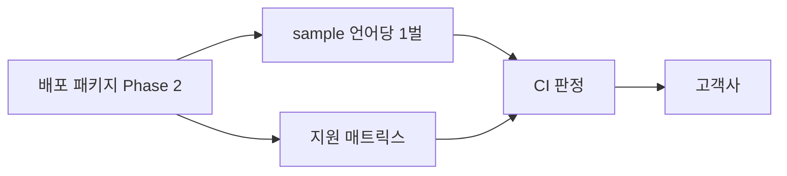

# Phase 6 — 샘플·문서·지원 경계 (B5·B6)

> **상태**: 미시작
> **범위**: 샘플을 언어당 1벌로 정본화하고, 지원 매트릭스와 지원 경계를 선언한다. **SDK 기능을 새로 만들지 않는다** — 유일한 코드 변경은 6-E 의 미지원 조합 오류 반환이다.
> **선행**: [Phase 5](./phase5-language-wrappers.md)
> **후행**: 없음. [Phase 7](./plan.md)(펌웨어 프로토콜 이관)은 보류이며 착수 조건이 이 저장소 밖에 있다
> **근거**: [goal.md B5·B6·§5.1](../goal.md) · [rendering-boundary.md §3.2·§7.5](../rendering-boundary.md) · [../../review/sonex-framework.md §5·§6.3](../../review/sonex-framework.md)
> **실측 기준**: `sonex-framework` `master` `f336e25b`(2026-07-23). 이 문서의 `[실측]` 은 2026-07-30 직접 확인분이다

---

## 1. 배경

### 1.1 샘플은 9벌이고 세 곳에 흩어져 있다 `[실측]`

| 위치 | 샘플 | 언어 | 규모 | 덮는 계층 |
|---|---|---|---:|---|
| `sdk/sdk/sample/` | `SDK_Sample_Windows` | C# | 744 LOC | SDK |
| `sdk/sdk/sample/` | `SDK_DeviceManager_Sample_Windows` | C# | 272 LOC | SDK |
| `sdk/sdk/sample/` | `SDK_ImageRender_Sample_Windows` | C# | 228 LOC | SDK |
| `sdk/sdk/sample/` | `SDK_Sample_Android` | JNI/Java | cpp 328 + java 1,038 | SDK |
| `sdk/sdk/sample/` | `SDK_Sample_iOS` | ObjC++/Swift | mm 962 + swift 1,664 | SDK |
| `sdk/adk/sample/` | `Framework_Sample_Windows` | C# | **50 LOC** | **없음 — 빈 템플릿** |
| `sdk/adk/sample/` | `Android_SampleApp` | JNI/Java | cpp 1,154 + java 5,318 | SDK+ADK |
| `sdk/adk/sample/` | `iOS_SampleApp` | ObjC++/Swift | swift 4,975 + m/mm 607 | SDK+ADK |
| **`sdk/adk/workspace/`** | **`ADK_Sample_Test`** | **C#** | **9,993 LOC** | **SDK+ADK** |

**가장 큰 C# 샘플이 `sample/` 밖에 있다.** `sample/` 아래의 `Framework_Sample_Windows` 는 `dotnet new wpf` 템플릿 그대로이고 SDK·ADK 호출이 **0건**이다(`MainWindow.xaml.cs` 는 `InitializeComponent()` 하나). 실제 C# ADK 샘플의 본체는 `workspace/ADK_Sample_Test`(뷰 8개 · ViewModel 9개)다.

즉 [goal.md B5](../goal.md) 의 "C# 은 정본화만 하면 된다"는 판단은 맞지만, **정본화의 입력은 `sample/` 이 아니라 `workspace/` 에 있다.**

### 1.2 언어별로 작업 성격이 다르다 — 이 구분이 이 phase 의 핵심

| 언어 | 참조 구현 | 작업 성격 | 1차 공개 |
|---|---|---|---|
| C# | `SDK_*_Sample_Windows` 3 · `Framework_Sample_Windows` · **`ADK_Sample_Test`** | **정본화(재편)** | ○ |
| JNI/Java | `SDK_Sample_Android` · `Android_SampleApp` | **정본화(재편)** | 2차 |
| ObjC++/Swift | `SDK_Sample_iOS` · `iOS_SampleApp` | **정본화(재편)** | 2차 |
| Flutter | **제품 `sonex-app` 전체** — SDK·ADK 를 모두 쓰는 유일한 실제 제품 | **추출·분리** — 샘플이 없는 것이 아니라 **샘플과 제품이 분리돼 있지 않다** | ○ |
| **C++** | **없음** — SDK 내부 코드와 iOS 브리지 조각뿐 | **신규 작성** | ○ |
| **Python** | **없음** | **전부 신규 — 유일한 백지** | ○ |

`SDK_Sample_iOS` 안의 `.cpp`·`.py` 는 **iOS 브리지 조각과 Xcode 프로젝트 조작 스크립트**이지 C++·Python 샘플이 아니다 — `HCSonexFramework.cpp`(731 LOC, 프레임워크 소스 사본) · `add_cvie64.py`(49) · `add_resources.py`(102).

**1차 공개 4종 중 정본화만 하면 되는 것은 C# 하나**이고, 2차로 미룬 JNI·ObjC++ 가 오히려 갖춰져 있다. **바인딩 공백과 샘플 공백이 같은 언어에 겹친다.**

### 1.3 샘플이 배포 패키지가 아니라 소스 트리에 붙어 있다 `[실측]`

성격이 정반대인 실패 둘이 공존한다.

| 방향 | 실측 |
|---|---|
| **소스 트리 역참조** | C# 샘플 3벌이 `sdk/sdk/workspace/sdk.sln` 의 프로젝트 멤버이고, `Framework_Sample_Windows`·`ADK_Sample_Test` 는 `framework.sln` 멤버다 — **SDK 소스 프로젝트와 같은 솔루션에서 함께 빌드**되고 출력도 `_out\x64\bin` 을 공유한다. `Android_SampleApp/app/CMakeLists.txt` 는 `ADK_ROOT=../../../../../sdk` 로 **소스 트리 헤더 14경로를 직접 include** 한다(`adk/library/cpr_1.12.0_android`·`third_party/nlohmann_json` 포함). 주석이 의도를 밝힌다 — *"실제 SDK/ADK 헤더 경로를 우선 (app/include/ 의 간소화 stub 보다 먼저 검색)"* |
| **산출물 부재** | `SDK_Sample_Android` 는 반대로 자족적 구조다 — 자기 `app/include/` 에 헤더 **222벌**을 복사해 두고 `jniLibs/${ANDROID_ABI}/lib*.so` 8개를 절대링크한다. 그런데 **`jniLibs/` 가 저장소에 없다**(README 는 *"빌드 스크립트로 생성"*). 링크 대상이 없으므로 체크아웃만으로는 빌드되지 않는다 |
| **로컬 경로 유입** | `SDK_Sample_iOS/XCODE_SETUP_GUIDE.md` 가 절차 안에 `/Users/rio/work/sonex-framework/sdk/sdk/sample/SDK_Sample_iOS` 를 박아 뒀다 |

**따라서 [goal.md B5](../goal.md) 판정 ①("배포 패키지만으로 빌드")이 현재 한 벌도 성립하지 않는다.** 판정 ③(`SDK-only` CI 빌드)도 마찬가지다 — 구성 자체가 없다(Phase 2-G).

### 1.4 문서는 0 이 아니다 — 대상이 다를 뿐 `[실측]`

`docs/` 에 45파일(md 39, 20,899줄)이 있다. SDK 24 · ADK 19 · 기타 2.

| 성격 | 예 |
|---|---|
| 고객 대면에 가까움 | `adk/ADK_INTEGRATION_GUIDE.md` · `sdk/SDK_FLUTTER_INTEGRATION_GUIDE.md` · `sdk/FLUTTER_FIRMWARE_UPGRADE_GUIDE.md` · `adk/scenarios/` 7벌 |
| 내부 개발 문서 | `SDK_*_TODO.md` **8벌** · `SDK_500C_FPS_DEBUG_PROGRESS.md` · `SDK_500P_CF_ROOT_CAUSE.md` · `MEASUREMENT_REVIEW_HANDOFF.md` |

**시나리오 문서가 `moana` QML 줄번호를 참조한다** — `adk/scenarios/01_NETWORK_SCENARIOS.md:220` 이 *"로그인 화면 `LoginView.qml:984`"* 로 대응 위치를 적는다. 외부 고객사에는 그 파일이 없다. 이 문서들은 **moana 대비 기능 동등성을 확인하려고 쓴 내부 자료**이지 고객 대면 문서가 아니다.

→ 이 phase 의 문서 작업은 "없는 것을 쓰기"가 아니라 **분류와 대상 재조정**이다.

### 1.5 목적

1. 샘플을 `sample/` 아래 **언어당 1벌**(SDK 섹션 + ADK 섹션)로 모으고, **배포 패키지 기준으로 빌드**되게 한다
2. C++·Python 두 백지를 채운다 — Python 코어 샘플은 **[Phase 4](./phase4-render-boundary.md) 판정 시험 ②를 겸한다**
3. 지원 매트릭스(모델 × 펌웨어 × 플랫폼)를 선언하고 미지원 조합에 **명시 오류**를 반환한다
4. 지원 경계 3건(음향출력 표시 책임 · 펌웨어 업그레이드 범위 · CVIE 적용 범위)을 명시한다

### 1.6 범위 한계와 미확인

**하지 않는 것**: SDK 기능 추가, [Phase 7](./plan.md)(500C/500P 펌웨어 프로토콜 SDK 이관), 앱 저장소(`sonex-app`) 실제 수정([Phase 8](./phase8-app-migration.md) 소관 — 이 phase 는 추출물까지만 낸다).

**미확인** — 이 phase 착수 전에 답이 필요하다.

| # | 항목 | 영향 |
|---|---|---|
| 1 | `ADK_Sample_Test` 등 기존 샘플이 **어느 커밋 기준으로 동작 검증됐는지** | 합류 시 어느 쪽 동작을 기준으로 삼을지 결정 못 함 |
| 2 | **외부 고객사 요구사항 문서의 존재 여부** | B2·B6 의 수준(어느 플랫폼·어느 모델까지 보증하는가)이 여기서 정해진다. [goal.md §7](../goal.md) 이 이미 미확인으로 남긴 항목 |
| 3 | `*_miti.csv` 를 실제로 읽는 주체가 앱인지 `moana` 인지 (→ §2 6-F) | F-1 이 문서화할 수 있는 계약의 형태가 달라진다 |

---

## 2. 진행 단계

### Step 6-A. 기존 샘플 재편

| # | 작업 |
|---|---|
| A-1 | `sample/<language>/` 로 이동. **언어당 1벌**, 내부는 **SDK 섹션 + ADK 섹션**. ADK 는 SDK 위에 얹히므로 ADK 샘플에서 SDK 를 뺄 수 없고, 실제로 빼지 않았다([goal.md B5](../goal.md)) |
| A-2 | **C# — 5벌을 1벌로.** 정본의 뼈대는 `ADK_Sample_Test`(탭 8: `SdkIntegration`·`BackUp`·`BusinessLogic`·`DataBase`·`Dicom`·`MoanaDbTest`·`Network`·`VideoEncoder`)이고, `SDK_*_Sample_Windows` 3벌의 SDK 시나리오를 `SdkIntegration` 섹션에 합친다. `Framework_Sample_Windows`(50 LOC 템플릿)는 **폐기** |
| A-3 | **JNI — `SDK_Sample_Android` + `Android_SampleApp`.** 뼈대는 후자(`TabPagerAdapter` + Fragment 8, `SdkIntegrationFragment` 2,088 LOC · `RenderActivity`·`AngleSurfaceView` 로 SDK 렌더링 공존), 전자의 `SonexRenderView`·`ControlScanner` 를 SDK 섹션에 흡수 |
| A-4 | **ObjC++ — `SDK_Sample_iOS` + `iOS_SampleApp`.** 후자가 탭으로 계층을 나눈다 — `Backup`·`Database`·`Dicom`·`Network`·`BusinessLogic`·`MoanaDb`(ADK) + **`SdkIntegration`**(SDK, 1,498 LOC) |
| A-5 | **샘플 안의 프레임워크 소스 사본 제거** — `SDK_Sample_iOS/SDK_Sample_iOS/HCSonexFramework.cpp`(731 LOC, `adk/Main/shared/` 동명 파일과 **MD5 상이**) · `SDK_Sample_Android/app/include/` 헤더 **222벌**. 샘플은 배포 패키지의 공개 헤더를 include 한다 |
| A-6 | **커밋된 바이너리 처리 판단** — `Android_SampleApp/.../jniLibs/` `.so` **35개** · `SDK_Sample_iOS/Frameworks/{SonexSDK,cvie64}.framework`. **`cvie64` 는 `CONTEXTVISION COMPANY CONFIDENTIAL` 표기 상용 바이너리**이므로 샘플 동봉 여부는 B4 판단 사항이다([gap.md §8.1](../gap.md)). Phase 2-A 의 패키지 제외 목록과 함께 정한다 |

> **A-2~A-4 는 두 벌을 합치는 것이지 큰 쪽을 고르는 것이 아니다** `[실측]`. 각 벌이 부르는 `hc_*` 심볼 집합이 서로 다르다 — iOS **20**(`SonexSDKBridge.mm`) vs **26**(`SonexFrameworkBridge.m`), Android **19**(`SonexJNI.cpp`) vs **17**(`jni.cpp`). **합집합이 정본의 커버리지**이며 §3.10 이 그것을 판정한다.

> **브리지는 샘플이 소유하지 않는다.** `SonexSDKBridge.mm` 3벌 중 2벌이 여기(`SDK_Sample_iOS`)와 `sonex-app`(`ios/Runner`·`macos/Runner`)에 있고, MD5 가 전부 다르다. 재편 후 샘플은 [Phase 5-F](./phase5-language-wrappers.md) 의 정본 wrapper 를 **참조**한다.

### Step 6-B. C++ 샘플 신규 작성

**[Phase 3-F](./plan.md)(공개 헤더 정본화) 선행 근거가 실측으로 확인된다** `[실측]`.

`sdk/include/` 는 최상위 헤더 62개 + 하위 디렉토리 6개(총 120헤더)로 공개 계약을 표방하나, `hc_*` 심볼은 **27**(구현 `sdk/sdk/Main/shared/` 는 **54**)이고 — 더 결정적으로 — **헤더 자체가 컴파일되지 않는다.**

`sdk/include/HCScannerModelSpec.h` 를 `g++ -std=c++17 -fsyntax-only` 로 확인한 결과:

```
error: 'list' in namespace 'std' does not name a template type   // <list> 미인클루드
error: 'float_t' does not name a type
error: expected unqualified-id before '[' token                  // uint32_t[10] multiFocalTable;
```

`String`·`rect` 도 미정의다. 그리고 이 struct 는 **저장소 어디에서도 참조되지 않는다** — 동일 사본 3벌(`sdk/include/`·`sdk/common/shared/`·`SDK_Sample_Android/app/include/`)만 존재하고 `#include` 하는 코드가 0건이다.

**즉 "공개 헤더만으로 샘플을 못 짠다"는 것은 심볼 수 부족이 아니라 헤더가 빌드되지 않는다는 뜻**이며, 그 상태로 만든 샘플은 판정 장치가 아니라 장식이 된다.

| # | 작업 |
|---|---|
| B-1 | [Phase 5-D](./phase5-language-wrappers.md) 의 `SonexScanWidget`(Qt6)을 쓰는 소비자 관점 샘플. **프레임워크 자체에는 Qt 의존이 0건**이므로 Qt 는 wrapper·샘플 층에만 들어온다 |
| B-2 | **대상 플랫폼은 Linux 우선이다.** Linux 가 주 개발 PC 이고([plan.md §0.1](./plan.md)) Phase [0-G](./phase0-build-reproducibility.md)(`OS_LINUX` 분기)·[0-L](./phase0-build-reproducibility.md)(`platforms/linux`)이 그 바닥을 만든다. **Qt6 가 Linux 데스크톱을 자연스럽게 부르던 것이 이제 제약이 아니라 이점**이다 — 이전 판이 *"core 가 Linux 를 지원하지 않아 Windows·macOS 로 시작"* 이라 적은 것은 Linux 1급화 이전 서술이다. Windows·macOS 는 **포팅 검증 시점**에 확인한다 |
| B-3 | 시나리오 — SDK 섹션(연결→스캔→렌더→저장) + ADK 섹션(로그인→환자관리→DICOM→백업) |
| B-4 | `SDK-only` 구성에서 빌드되게 만든다. **구성 추가는 Phase 2-G, 게이트 활성화는 Phase 3-K 소관**이고 이 phase 는 샘플이 그 구성에서 빌드되게 하는 것만 담당한다 |

### Step 6-C. Python 샘플 신규 작성 — [Phase 4](./phase4-render-boundary.md) 판정 시험과 겸한다

| # | 작업 |
|---|---|
| C-1 | **코어 패키지 `sonex`** — **Qt 의존 없음**, 프레임을 배열로 반환. 대상은 검증·자동화·연구·CI |
| C-2 | **C-1 의 샘플 스크립트가 곧 [Phase 4](./phase4-render-boundary.md) 판정 시험 ②** — *"Python 에서 SDK 가 창 없이 동작한다"*. **같은 코드가 겸하며 별도 시험 코드를 만들지 않는다** |
| C-3 | **선택 패키지 `sonex[qt]`** — PySide6 `SonexScanWidget`. **PyQt6 는 GPLv3 이라 배제**하고 PySide6(Qt Company 공식, LGPLv3)를 쓴다 |
| C-4 | 두 벌의 시나리오 문서 — 코어는 GUI 없이 연결→스캔→프레임 획득, `[qt]` 는 위젯 표시까지 |

> **코어에 Qt 를 넣지 않는 이유는 이 코드베이스의 Python 실사용이 증거다** `[실측]`. 존재하는 Python 은 `sonex-app/test/HNS_v1/verify_v21_byte.py`·`verify_v21_full.py`(SDK 출력을 numpy 로 바이트 비교) · 프레임워크 `build_device_manager.py` · `ai_models/.../convert_pytorch_to_{coreml,onnx_opencv}.py` 3벌 · `SDK_Sample_iOS/add_{cvie64,resources}.py`(Xcode 프로젝트 조작)이다. **GUI 를 띄우는 Python 은 한 벌도 없다.** 코어에 Qt 를 강제하면 CI·헤드리스에서 부담만 되고 판정 시험 ②도 무의미해진다.

### Step 6-D. Flutter 샘플 — 별도 신규 작성 없음

`sonex-app` 이 SDK·ADK 를 모두 쓰는 유일한 실제 제품이므로 **[Phase 5-D](./phase5-language-wrappers.md) 의 추출이 곧 샘플**이다.

| # | 작업 |
|---|---|
| D-1 | 추출 대상 `[실측]` — `lib/modules/scan/open_gl_view.dart`(265) · `native_view_widget.dart`(117) · `native_view_controller.dart`(901) · `scan_controller.dart`(8,299) 중 `hwnd` 경로 |
| D-2 | **앱의 Dart 층에 SDK/ADK 분리가 이미 있다** `[실측]` — `lib/services/sdk/NativeMethods.dart`(1,869) vs `lib/services/adk/adk_native_methods.dart`(346). **샘플의 SDK 섹션·ADK 섹션 경계를 이 분리에 그대로 대응시킨다** — 새로 가르는 것이 아니라 있는 선을 승계한다 |
| D-3 | 앱 저장소 실제 수정은 [Phase 8](./phase8-app-migration.md) 소관. 이 phase 는 추출물을 `sample/flutter/` 에 세우는 것까지 |
| D-4 | `test/services/adk/adk_native_methods_test.dart` 가 이미 있다 — 샘플 회귀 확인에 재사용할지 검토 |

### Step 6-E. 지원 매트릭스

> **2023년 설계 문서가 이미 이 항목을 인지했고 3년째 미결이다** — 블록 다이어그램 Command Set 절에 *"앱에서 지원하는 펌웨어 버전에 대한 범위가 결정됨(상위 버전도 지원 가능)"* · *"타사 장비에 대한 처리 가능 여부는 검토 필요"*([goal.md B6](../goal.md)).

세 축을 먼저 실측으로 고정한다.

**모델 축 — 판정 지점은 `isSupportedModel()` 이다** `[실측]`

| InstructionSet | 받는 모델 문자열 |
|---|---|
| `HCInstructionSet300C` | `300C` · **`310C`** |
| `HCInstructionSet300L` | `300L` |
| `HCInstructionSet500C` | `500C` |
| `HCInstructionSet500L` | `500L` |
| `HCInstructionSet500P` | `500P` |
| `HCInstructionSetDefault` | 폴백 |

**클래스는 5 + Default 이지만 모델 문자열은 6이다** — `310C` 가 300C 셋에 얹혀 있다. 매트릭스는 클래스가 아니라 **모델 문자열 기준**으로 쓴다.

**펌웨어 축 — 데이터와 판정 로직이 이미 있으나 둘 다 샘플·ADK 안에 있다** `[실측]`

| `.ini` | 대상 | version | minCompatibleVersion | date |
|---|---|---|---|---|
| `Firmware.ini` | 300C/300L | `M1.01.09` | `M1.01.09` | 20210715 |
| `500-Firmware.ini` | 500L | `M1.03.16` | `PP.00.02` | 20241128 |
| `500-SN-Firmware.ini` | 500C/500P | `M0.01.08` | `M0.00.01` | **20260723** |

세 파일은 **`sdk/adk/workspace/ADK_Sample_Test/Resources/Firmware/` 에만 있다.** csproj 주석이 성격을 밝힌다 — *"Moana Resources/Firmware/\*.ini 동등 — 앱 내장 메타를 하니스에서 미리 구현"*.

판정 로직은 `HCFirmwareVersionChecker::check(model, appVersion, deviceVersion, deviceDate, minCompatibleVersion)` 이며 모델 family 로 알고리즘을 가른다 — `500C`·`500P`·`500LS` → `checkSocionext`(정수 인코딩), 그 외(`300C`·`310C`·`300L`·`500L`·`L43K`) → `check500L`(ES/PP/M 계열). 결과는 `FWUpgradeLevel{Error, MustUpgrade, MayUpgrade, Latest, NotUpgrade}` 다. 위치는 **ADK**(`sdk/adk/Main/shared/`)이고, 저장소의 **실질 단위테스트 1파일**(`test/test_firmware_version_checker.cpp`)이 바로 이것을 검증한다.

> **`500LS`·`L43K` 는 매트릭스에 넣지 않는다.** 버전 체커 분기에만 있고 `isSupportedModel()` 에는 어느 셋에도 없다 — 연결 자체가 성립하지 않는다. **이 어긋남을 드러내는 것이 6-E 의 부수 효과**다(→ E-5).

**플랫폼 축** — **Linux** · Android · Windows · iOS · macOS **5종**([plan.md §0.1](./plan.md) 우선순위 순). 이전 판이 *"Linux 는 SDK core 미지원"* 이라 적은 것은 **Linux 1급화 이전 서술**이며 B-2 가 이미 정정했다 — 여기 문장만 남아 있었다(2026-08-02 정리).

**전송 축은 하나다** `[실측]` — WiFi TCP 뿐이고 USB·BLE 코드가 0건이다. 장비가 자체 AP 이며 고정 IP `192.168.10.1`, 논리 채널 2개(CONTROL **1234** / DATA **1235**), `SOCKET_BUFFER_SIZE = 1MB`([../../review/sonex-framework.md §5](../../review/sonex-framework.md)).

| # | 작업 |
|---|---|
| E-1 | **매트릭스 선언** — 모델문자열 6 × 펌웨어 계열 3 × 플랫폼 4. 선언 위치는 배포 패키지의 문서 구성([goal.md B2](../goal.md) 8구성 중 6번). 소스는 `.ini` 3벌 + `isSupportedModel()` + `FirmwareVersionChecker` |
| E-2 | **`.ini` 를 샘플 리소스에서 패키지 자산으로 승격** — 지금은 `ADK_Sample_Test` 안에만 있어 **고객사가 받는 패키지에 펌웨어 호환 정보가 존재하지 않는다** |
| E-3 | **미지원 조합 오류 반환** — 지금은 `InstructionSetDefault` 폴백이라 미지원 모델이 조용히 통과한다. 미지원 모델·최소호환 미만 펌웨어에서 **명시 오류 코드**를 내게 한다. **이 phase 의 유일한 코드 변경**이며 [Phase 1](./plan.md) 회귀 하니스로 판정한다 |
| E-4 | **mock 장치 서버(Phase 1-B)에 시나리오 추가** — 미지원 모델 문자열 · `minCompatibleVersion` 미만 펌웨어 · 빈 버전 문자열. 매트릭스를 **CI 가 판정**하게 만든다 |
| E-5 | **`500LS`·`L43K` 어긋남 해소** — 지원 목록에서 빼거나 `isSupportedModel()` 을 맞춘다. **힐세리온 확인 필요**(단종 여부·OEM 계약) |

### Step 6-F. 지원 경계 문서화

**F-1. 음향출력(MI/TI) 표시 책임 — 분담은 정당하나 데이터 경로가 아직 없다**

MI/TIB 는 SDK 렌더러에 **0건**이고 앱이 그린다. 로고·환자명·Study UID·타임스탬프와 **한 정보 패널**이며([rendering-boundary.md §3.2](../rendering-boundary.md)), 영상 좌표와 무관한 화면 모서리 고정 텍스트이고, 설계 명세가 *"SDK 는 환자 정보를 몰라야 한다"* 고 못박았다. **분담 자체는 정당하다.** 다만 완제품 인증 책임이 제품을 내는 쪽에 있으므로 **명시하지 않으면 고객사가 빠뜨린다.**

> **그런데 SDK 가 "데이터로 제공"하는 경로가 지금 없다** `[실측 — 이 phase 의 발견]`.
> `acusticOutputMi`·`acusticOutputTib` 는 `ScannerModelSpec` 에만 있고, 그 struct 는 **컴파일되지 않으며 어디에서도 참조되지 않는다**(§6-B). 런타임 소재로 보이는 `500{C,P}_probe_id_{0,1}_miti.csv` 4벌도 **`ADK_Sample_Test/Resources/` 안에만** 있고 이를 읽는 코드가 `sdk/` 에 **0건**이다. 저장소 문서는 이 파일들을 `moana` 의 `MI_TI_Tables/` 자산과 대응시킨다(`docs/sdk/SDK_500C_500P_IMPLEMENTATION_PLAN.md:81`).
>
> **따라서 F-1 은 문서 한 줄이 아니다.** *"표시는 통합자 책임"* 을 적으려면 통합자에게 넘겨줄 데이터 경로가 먼저 있어야 한다. 경로 확정은 [Phase 3-F](./plan.md)(공개 헤더)·[Phase 4-C2](./phase4-render-boundary.md)(측정 기하 반환)와 같은 성격의 항목이고, **없는 채로 문서화하면 지킬 수 없는 약속이 된다.** 확정 못 하면 *"SDK 미제공"* 으로 적는다 — 빈 약속보다 낫다.

**F-2. 펌웨어 업그레이드 범위 — 모델에 따라 ADK 가 필요하다**

| 계열 | SDK 단독 | 실제 경로 |
|---|---|---|
| **500L** | 인터페이스상 단일 호출 | ADK `FirmwareController` 가 버전 판정 → **FTP 업로드**(`192.168.10.1`, user `root`) → SDK `REQUEST_FIRMWARE_UPGRADE_START` |
| **500C/500P** | **불가** | ADK `FirmwareController` 의 **SN 순서 상태머신**. SN 명령 전송 자체는 SDK `HCLiveController` 소관 |

> **`[실측 정정 — 이 phase 에서 확인]`** `DeviceManager::startFirmwareUpdate(filePath)` 는 `sdk/include/HCDeviceManager.h:85` 에 선언돼 있으나 구현은 **`SocketCommunicator::startFirmwareUpdate` → `return SUCCESS; // TODO`** 인 껍데기다(`sdk/sdk/DeviceManager/shared/HCSocketCommunicator.cpp:643`). 저장소 문서도 같은 판정을 적어 뒀다(`docs/sdk/FIRMWARE_UPGRADE_ANALYSIS.md:325`).
> **비대칭의 방향은 그대로이나 폭이 더 넓다** — 지원 경계는 *"500C/500P 만 ADK 필요"* 가 아니라 **"펌웨어 업그레이드는 전 계열이 ADK 경유"** 로 적어야 사실에 맞는다.

> **`[실측 보강]`** SN 상태머신은 2단계가 아니라 **3단계**다 — `snB3`·`snMsp` 에 **`snWifi`(RS9116 `.rps`, 약 2MB)** 가 붙었고 `snSkipWifi`·`snWifiCrc` 까지 있다(`HCFirmwareController.h`). 2026-07-23 실장비 검증 커밋과 대응한다. 청크 크기도 **헤더 주석은 768B, 구현은 1000B** 다(`HCFirmwareController.cpp:429` — *"청크 1000 byte (장비 버퍼 1024 이내). Moana 는 768 이나 …"*). **지원 경계 문서에 프로토콜 세부 숫자를 복사하지 않고 경계만 적는 이유가 여기 있다** — 숫자는 코드에서 이미 표류하고 있다.

이 비대칭의 해소(SDK 이관)는 **[Phase 7](./plan.md) 로 보류**됐다 — 최근 500C/P 실장비 검증분을 무효화할 위험, 펌웨어 굽기 실패는 **장비 손상**, mock 서버로는 실장비 회귀를 대체할 수 없다([rendering-boundary.md §7.5](../rendering-boundary.md)). **그때까지 지원 경계 명시로 갈음한다.**

**F-3. CVIE 적용 범위도 경계 항목이다** `[실측]`

| 축 | 경계 |
|---|---|
| 모델 | **500 시리즈만** — `HCInstructionSet500L`·`500P`·`500C` 만 키를 읽는다 |
| 플랫폼 | **macOS 미지원** — `#if !OS_MACOS` |
| 라이선스 | **장비에서 온다** — 장비 정보 패킷 필드 31 → `ImageFilter::cvieValidation(serial, key)` |
| 재배포 | 상용 계약 사안 — B4 소관, 미확인([gap.md §8.1](../gap.md)) |

SDK 만 쓰는 고객사가 macOS 를 타깃하면 CVIE 없이 도는 경로에 선다. 이것은 결함이 아니라 경계이고, **적지 않으면 화질 차이가 버그로 보고된다.**

**F-4. 계약 분리 문서화**

SDK 와 ADK 는 **한 패키지로 배포**하고 고객사가 사용 시점에 선택한다 — SDK 만 → 고객사 자체 클라우드 / SDK+ADK → 힐세리온 클라우드([goal.md §5.1](../goal.md)). **요구되는 것은 "패키지 분리"가 아니라 "계약 분리"** 이므로, 고객이 헤더와 라이브러리만 보고 어디까지가 SDK 인지 구분할 수 있어야 하고 SDK 만 쓰기로 한 고객이 ADK 를 모르고 끌어쓰는 일이 없어야 한다.

**부수 함의도 함께 적는다** — SDK 만 쓰는 고객도 ADK 의 서드파티(DCMTK·sqlite3·curl·FFmpeg)를 함께 받으므로 **재배포 고지 범위는 언제나 SDK+ADK 전체**다.

**F-5. 문서 분류·대상 재조정**

`docs/` 45파일을 ① 고객 대면 ② 내부 개발로 가른다. 고객 대면본에서는 `moana` QML 줄번호 참조를 제거한다(§1.4). 내부 문서(`SDK_*_TODO.md` 8벌 등)는 **Phase 2-A 의 패키지 제외 목록**으로 넘긴다 — 제외는 패키지 필터이지 저장소 삭제가 아니다.

---

## 3. 검증

| # | 항목 | 방법 | 기대 |
|---|---|---|---|
| 3.1 | 샘플 벌수 | `sample/` 아래 디렉토리 | 언어당 **1** (1차 4 + 2차 2) |
| 3.2 | **배포 패키지 빌드** | 깨끗한 머신에서 **배포 아카이브만** 풀어 각 샘플 빌드 | 성공. 소스 트리 경로 참조 **0건** |
| 3.3 | `SDK-only` 구성 | ADK 라이브러리 미링크 빌드 | 통과 (게이트 활성화는 Phase 3-K) |
| 3.4 | 시나리오 커버리지 | SDK 섹션 4단계 · ADK 섹션 4단계 | 전 언어 샘플에 존재 |
| 3.5 | **Python 헤드리스** | 창 없이 프레임 획득 | 통과. **[Phase 4](./phase4-render-boundary.md) 판정 시험 ②와 동일** |
| 3.6 | 프레임워크 소스 사본 | `sample/` 아래 `HCSonexFramework.cpp`·복사 헤더 | **0파일** (현재 731 LOC + 222헤더) |
| 3.7 | 지원 매트릭스 | 패키지 안 문서 | 모델문자열 6 × 펌웨어 3 × 플랫폼 4 표 존재 |
| 3.8 | **미지원 조합** | mock 서버(1-B)가 미지원 모델·구펌웨어 응답 | **명시 오류 코드**. `SUCCESS` 아님 |
| 3.9 | 경계 문서 | F-1·F-2·F-3 | 3건 모두 존재. F-1 은 데이터 경로 확정 또는 "미제공" 명시 |
| 3.10 | **`hc_` 커버리지** | 정본 샘플의 `hc_*` 집합 ⊇ 합류 전 각 벌의 합집합 | 누락 0 (iOS 20∪26 · Android 19∪17) |

> **3.2 가 이 phase 의 실질 게이트다.** 나머지는 문서로 만족시킬 수 있으나 이것만은 CI 가 판정하며, **현재 9벌 중 통과하는 것이 0벌**이다(§1.3).

> **3.10 을 사람 눈으로 확인하지 않는다.** 두 벌 합류에서 시나리오가 조용히 빠지는 것이 이 단계의 전형적 실패이며, 심볼 집합 대조는 [Phase 1-D](./plan.md) 의 바인딩 검증 스크립트를 그대로 쓴다.

---

## 4. 위험 · 대응

| 위험 | 영향 | 대응 |
|---|---|---|
| **MI/TI 데이터 경로가 실재하지 않는다** | F-1 이 지킬 수 없는 약속이 된다 | 6-F 착수 전 경로 확정을 [Phase 3-F](./plan.md)·[4-C2](./phase4-render-boundary.md) 항목으로 올린다. 확정 못 하면 **"SDK 미제공"으로 명시** |
| **`.ini` 를 패키지로 올리면 갱신 의무가 생긴다** | 고객사 릴리스마다 펌웨어 메타가 낡는다 | 매트릭스에 **유효 기준일과 갱신 채널**을 함께 선언. 지금 `500-SN-Firmware.ini` 가 2026-07-23 자로 이미 최신 검증분과 묶여 있다 |
| 두 샘플 합류에서 시나리오 누락 | 커버리지가 조용히 줄어든다 | §3.10 심볼 합집합 판정. 자동화 |
| **`cvie64` 상용 바이너리가 샘플에 커밋돼 있다** | 재배포 계약 미확인 상태로 고객사에 나간다 | Phase 2-A **제외 목록에서 먼저 막고** B4 결론을 기다린다. 샘플이 CVIE 없이도 도는 경로를 기본으로 |
| **Linux 지원이 Phase 0 에서 안 서면 6-B·6-C 가 함께 밀린다** | Qt6 샘플·Python 코어의 1순위 호스트가 사라진다 | 착수 전 [0-G](./phase0-build-reproducibility.md)(`OS_LINUX` 분기)·[0-L](./phase0-build-reproducibility.md)(`platforms/linux`, **오디오가 신규**) 완료 확인. 미달이면 Windows·macOS 로 임시 대체하되 **주 개발 흐름과 어긋난다는 것을 명시** |
| **매트릭스에 실장비 없이 못 채우는 칸이 있다** | 표가 미완으로 남는다 | mock 서버로 **프로토콜 수준까지만** 판정하고, 실장비 칸은 **"미검증"으로 표에 남긴다.** 빈칸으로 두거나 추정으로 채우지 않는다 |
| **Phase 7 보류가 길어져 F-2 가 영구 경계가 된다** | 고객사가 500C/500P 를 SDK 만으로 지원 못 하는 상태가 고착 | 경계 문서에 **보류 사유와 해소 조건**(Phase 0·1 완료 + [plan.md Phase 2-5](../plan.md) 실장비 회귀)을 함께 적는다 |
| 문서 재분류가 내부 문서 삭제로 흐른다 | `moana` 대비 동등성 근거를 잃는다 | 제외 목록은 **패키지 필터**이지 저장소 삭제가 아니다(F-5) |
| **샘플의 기준 커밋을 모른다**(§1.6 미확인 1) | 합류 시 어느 동작이 정답인지 판정 불가 | 힐세리온에 질의. 답이 없으면 **재편 직전 상태를 기준선으로 고정**하고 그 사실을 기록 |

---

## 5. 이 phase 가 여는 것



[goal.md B5](../goal.md) 판정 3개(배포 패키지 빌드 · 대표 시나리오 · `SDK-only` CI)와 [B6](../goal.md) 판정(매트릭스 + 미지원 조합 동작 정의)이 여기서 닫힌다.

**그리고 6-C 의 코어 샘플이 [Phase 4](./phase4-render-boundary.md) 판정 시험 ②를 겸하므로, Phase 4 의 성공 판정이 이 phase 에서 실증된다** — 렌더 경계가 실제로 언어 독립인지는 "Python 이 창 없이 프레임을 받는가" 한 줄로 갈리고, 그 코드가 곧 샘플이다.

이 phase 뒤 r1 에 남는 것은 [Phase 7](./plan.md) 하나이며, 그 착수 조건(실장비 회귀 시나리오)은 이 저장소 밖에 있다. **F-2 의 경계 문서가 그 자리를 대신하는 동안 고객사는 무엇이 되고 무엇이 안 되는지를 알게 된다** — 지금은 그것조차 선언돼 있지 않다.

---

## 6. cross-reference

- [plan.md §4 Phase 6](./plan.md) — 이 문서의 뼈대. Phase 2-G·3-K(`SDK-only` 구성·게이트) · Phase 7(보류) 정의
- [../plan.md Phase 4](../plan.md) — 상위 계획의 B5·B6 대응 절
- [../goal.md B5·B6·§5.1](../goal.md) — **이 phase 의 사양**. 성공 판정 원문
- [../rendering-boundary.md §3.2·§7.5](../rendering-boundary.md) — MI/TI 분담 근거 · 펌웨어 프로토콜 이관 보류 근거
- [../../review/sonex-framework.md §2.3·§5·§6.2·§6.3·§8.2](../../review/sonex-framework.md) — Linux 미지원 · 장치 통신 · ADK 의 장비 직접 접촉 · 펌웨어 업그레이드 계열별 경계 · CVIE
- [../gap.md §4.5·§7.2·§8.1](../gap.md) — 펌웨어 비대칭 · 공개 헤더 27/54 · 기밀 표기 제외 대상
- [./phase4-render-boundary.md](./phase4-render-boundary.md) — 판정 시험 ②를 6-C 가 겸한다
- [./phase5-language-wrappers.md](./phase5-language-wrappers.md) — 선행. `sample/` 과 `wrapper/` 는 다른 것이다(계약 vs 사용례)
