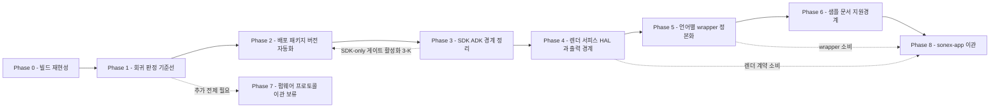

# `sonex-framework` 렌더 경계 리팩토링 — r1 Plan

> **범위**: 지금은 `client/legacy/sonex-framework`(read-only 미러) 기준. **Phase 0-0(저장소 재배치) 이후는 `client/sonex-framework` 작업 사본**이 대상이다(SDK+ADK). **`sonex-app`(Dart) 이관은 [Phase 8](./phase8-app-migration.md)** 로 이 문서 범위 안에 들어온다 — 별도 저장소(`client/legacy/sonex-app`)라 Phase 8 자체의 저장소 재배치(8-0)를 갖는다.
> **목표**: [rendering-boundary.md](../rendering-boundary.md) 의 목표 경계(§7)를 실제 코드 구조로 만든다.
> **원칙**: 상위 [plan.md](../plan.md) 의 "검증할 수 없는 것은 고칠 수 없다"를 그대로 따른다. 이 저장소는 **CI 0건·실질 단위테스트 1파일**([../../review/sonex-framework.md §9](../../review/sonex-framework.md))이라 구조를 바꾸기 전에 회귀 판정 기준선부터 세운다 — **빌드·테스트·배포 자동화 보강이 렌더 경계 작업보다 먼저 온다.**
> **현행 구조 SOT**: [../../review/sonex-framework.md](../../review/sonex-framework.md). **현재 상태 판정 SOT**: [../gap.md](../gap.md).
> **실측 기준**: `sonex-framework` `master` `f336e25b`(2026-07-23) = **로컬 HEAD == `origin/master`**(마지막 fetch 2026-07-27).
> **이 저장소는 master 가 주 개발선이다** — 루트 `CLAUDE.md` 의 조직 통칙("master 에서 작업하지 않는다")이 `belle-fw`·`moana` 에는 맞지만 **여기는 예외**다. master(2026-07-23)가 모든 브랜치보다 최신이고, `dev/adk_v0.51.0`·`adk_work` 는 **master 에 완전 병합**돼 고유 커밋이 0 이다(master 가 각 167·363 앞섬). master 밖에 있는 것은 `feature-apply_v1.23.4` 의 **2커밋뿐**(SRI 필터 `HCSRIv23_3`·`HCSRIv23_4` SDK 통합, 2026-07-11·07-15). **따라서 이 계획의 fork base 는 master 다**(0-0).

> **이름에 대해**: `r1` 은 client 트랙 슬롯이다. 이전 `r1`(`moana` feature-first 재구성)은 `moana` 폐기로 [legacy/r1/](../legacy/r1/) 에 남아 있다. 이 문서가 client 트랙의 현재 실행 계획이다.

> **IMPORTANT — 지금과 착수 후의 차이**: 지금 `client/legacy/sonex-framework` 는 검토 단계의 **read-only 미러**라 이 문서를 쓰는 시점엔 코드를 고칠 수 없다([루트 CLAUDE.md](../../../CLAUDE.md)). **이건 영구 제약이 아니라 지금이 아직 검토 단계라서다.** **Phase 0-0(저장소 재배치)** 로 `client/sonex-framework` 쓰기 가능 작업 사본을 만들면 그 뒤로는 이 계획을 그대로 실행한다 — 위탁 리팩토링 전제([legacy/README.md](../legacy/README.md) 전제 ②)대로 **작업자는 AI 에이전트다.** 힐세리온에 사양만 넘기고 끝나는 문서가 아니다. 재배치 전에도 독립적으로 할 수 있는 것(Phase 1-B·1-D·1-F·2-B — `protocol-sot` 선례)은 지금 시작할 수 있고 `[선행 가능]` 으로 표시했다.

## 0. 전제 — 상위 계획과의 관계

**이 문서는 [plan.md](../plan.md) 의 Phase 1(B1)·Phase 2(B2)·Phase 3·Phase 3.4·Phase 3.5 를 `sonex-framework` 저장소 수준에서 구체화한 실행 계획이다.** 새 요구를 추가하지 않는다 — **단, Phase 8(`sonex-app` 이관)은 예외다**: 상위 plan.md 가 산출물의 실제 소비처 반영을 다루지 않았던 공백을 메우는 신규 항목이다.

| r1 Phase | 상위 [plan.md](../plan.md) 대응 |
|---|---|
| Phase 0 — 빌드 재현성 | Phase 1 (B1) |
| Phase 1 — 회귀 판정 기준선 | Phase 2 의 CI·회귀 관련 항목(2-2·2-5)을 이 저장소에 신설 |
| **Phase 2 — 배포 패키지·버전 자동화** | **Phase 2 (B2)** |
| Phase 3 — SDK/ADK 경계 정리 | Phase 3 (3-1·3-3·3-5·3-6·3-7) |
| Phase 4 — 렌더 서피스 HAL·출력 경계 계층화 | **Phase 3.4** — [rendering-boundary.md](../rendering-boundary.md) 가 SOT |
| Phase 5 — 언어별 wrapper 정본화 | **Phase 3.5** |
| Phase 6 — 샘플·문서·지원 경계 | Phase 4 (B5·B6) |
| Phase 7(보류) — 펌웨어 프로토콜 이관 | Phase 3-9 |
| **Phase 8 — `sonex-app` 이관** | **신규 — 상위 plan.md 에 대응 항목 없음.** Phase 4(B5·B6)가 산출물을 규정하지만 소비처 반영은 다루지 않았던 공백을 메운다 |

### 0.1 개발 플랫폼 전제 — Linux 가 주 개발 PC 다

**이 전제가 이 계획의 플랫폼 우선순위를 정한다.**

| 축 | 플랫폼 | 역할 |
|---|---|---|
| **주 개발** | **Linux · Android** | 일상 개발·CI·회귀 판정이 여기서 돈다 |
| **포팅 검증** | Windows · iOS | 나중에 **동작 확인**. 상시 개발 대상이 아니다 |
| (파생) | macOS | iOS 포팅의 부수. 현재 `arm64` 전용 제약 있음 |

**따라서 Linux 는 부차적 headless 타깃이 아니라 1급 지원 대상이다.** 기존 문서들이 *"Linux 는 제품 지원 대상이 아니다"* 로 적은 것은([gap.md §5.3](../gap.md)) **2023년 계획서 기준의 서술**이고, 이 전제 아래에서는 더 이상 맞지 않는다 — 판정이 바뀐 것이 아니라 **범위가 바뀐 것**이다.

#### 0.1.1 어휘 — `linux` 와 `headless` 는 다른 축이다

`[2026-08-02 정리]` 두 낱말이 r1 문서 전반에서 섞여 있었고, **`headless/` 가 플랫폼 디렉토리 자리를 차지**하고 있었다. Linux 1급화 이전 어휘가 남은 것이다.

| 낱말 | 축 | 뜻 | 같은 자리에 오는 것 |
|---|---|---|---|
| **`linux`** | **플랫폼** | 툴체인·sysroot·`platform/linux/` 구현체·배포 대상 | `windows` · `android` · `ios` · `macos` |
| **`headless`** | **렌더 서피스 모드** | 창 없이 도는 실행 형태(surfaceless·pbuffer). Phase 4-A 의 서피스 종류 중 **`offscreen`** 이 이것이다 | `window` · `adopted` |

**한 플랫폼이 두 모드를 다 갖는다** — Linux 도 창 있는 빌드와 headless 빌드가 둘 다 되고, Windows·Android 도 headless 로 돌 수 있다. **따라서 `headless` 는 플랫폼 목록에 들어갈 수 없다.** 이 문서 이하 r1 전체가 이 구분을 따른다.

**이것이 여러 곳을 동시에 푼다**

| 항목 | 이전 상태 | Linux 1급화 이후 |
|---|---|---|
| Phase 0 성공 판정 | Android 1개 플랫폼 | **Linux 우선**, Android 병행 |
| Phase 1-C 헤드리스 렌더 | 오프스크린 컨텍스트가 난제 | **Linux EGL surfaceless 가 가장 깨끗한 경로** |
| Phase 5 Python 코어 | 호스트가 애매 | **Linux 가 자연스러운 자리** |
| Phase 6 C++ Qt6 샘플 | *"Linux 를 부르나 core 가 미지원"* 이라 Windows·macOS 로 시작 | **Linux 에서 바로 된다** |
| CI | 인프라 미정 | **Linux 러너가 기본** |

**드는 비용도 실측했다** — §1 의 "Linux 지원 표면" 행 참조. 소켓은 사실상 공짜이고 오디오가 신규다.

**선행 조건 — 상위 [plan.md Phase 0-3](../plan.md)("ANGLE 실제 배치·리비전 회수")의 전제가 실측으로 무너졌다.** 회수할 대상이 사실상 없다 — 리비전 기록은 iOS 하나뿐이고 그마저 개인 fork prebuilt 이며, Android·Windows 는 빌드 설정이 남아 있지 않다. **따라서 r1 은 회수가 아니라 자체 빌드로 간다**(0-A). 사람에게 물어야 할 것은 리비전이 아니라 **"왜 그 fork 였는가 · 바꿔도 되는가"** 다.

## 1. 현재 상태 — 실측 요약

상세 근거는 [../../review/sonex-framework.md](../../review/sonex-framework.md)·[../gap.md](../gap.md). 이 표는 r1 착수 판단에 필요한 것만 추린다.

| 축 | 실측 |
|---|---|
| 규모 | 자체 소스 **~240,900 LOC**(전체 2.0GB 중 0.3%). SDK 347파일 86,853 · ADK 219파일 32,192 |
| 계층 구조 | `sdk/sdk`(SDK)·`sdk/adk`(ADK) 경계는 **코드 수준에서 유지**(ADK→SDK 7파일, 역방향 0건) |
| **HAL** | **절반만 존재** — 소켓·오디오 3벌씩 ✓, **렌더 서피스 0·이벤트입력 0** |
| **빌드** | **저장소만으로는 불가. 원인이 최소 셋이고 서로 무관하다** — ① **ANGLE 부재**(정적 분석): 확장 상수 정의 0건이라 `ImageRenderer` 컴파일 차단. `sdk/third_party/readme.txt` 가 *"Actual files are excluded from git"* 로 선언하므로 **코드 결함이 아니라 의존물 확보 문제** ② **빌드 순서**(실제 관측): 커밋된 `build_adk_arm64_log1.txt` 에서 `-lSonexCommon` 링크 실패(225·273·291줄)가 `libSonexCommon.so` 산출(**358줄**)보다 **먼저** 난다 — `framework.sln` 의 프로젝트 간 의존 선언 누락이고 **ANGLE 로는 안 열린다**(0-F 소관) ③ **NuGet 복원 누락**(`NETSDK1004`). **①과 ②는 같은 실패의 두 층위가 아니라 다른 타깃의 무관한 실패다** — 그 로그는 ADK 5모듈만 빌드했고 `ImageRenderer` 는 **0회 등장**한다 |
| **단위 테스트** | **도입되지 않았다** — 실질 **1파일**(`test_firmware_version_checker.cpp` 134줄, standalone, **어떤 빌드파일에도 미등록**). gtest·Catch2·XCTest 심볼 **0건** |
| **검증 자산(테스트 아님)** | **완전한 백지는 아니다** — `HCDumpManager`(202줄)+`DUMP_FORMAT.md`(347줄)가 B모드 필터 4단계 덤프를 제공하고, `sonex-app/test/` 에 덤프 89파일 + 파이썬 검증기(`verify_v21_byte.py`·`verify_v21_full.py`)가 있다. **다만 검증기가 `C:\work\nextsri` 절대경로로 범위 제외된 `NextSRI` 에 매달려 있다** — 장비 축 `NextDoppler` 문제와 **구조가 같다** |
| **CI** | **0건** — 그 1파일조차 커밋마다 자동 실행되지 않는다 |
| **배포·버전 자동화** | **없음** — 앱↔SDK 버전 고정 장치 없음, `VERSION_TAGGING.md` 규약 대비 태그 이탈, 산출물↔커밋 역추적 불가 |
| **바인딩** | 5개 언어 **27벌 약 14,400 LOC**, 전부 샘플/앱 안에 산개. 정본 0 |
| **바인딩 정합성** | **앱이 부르는 `hc_*` 108개 중 29개가 프레임워크에 정의 0건**(2026-07-30 실측, `master`·`v1.23.4` 양쪽). 렌더·재생 경로 대량 포함 — `hc_ReadLastFramebufferBgra`·`hc_GetMeasureObjectsData`·`hc_SetPlaybackScanMode` 등. 앱은 lookup 실패를 `print` 로 덮는다([../../review/sonex-framework.md §3.5](../../review/sonex-framework.md)) |
| **공개 헤더** | SDK 공개 27 심볼 vs 구현 54 심볼. **ADK 공개 헤더 개념 자체가 없음**(0건) |
| **동명 심볼** | `HC::DeviceManager`(SDK=물리스캐너 vs ADK=클라우드자산) · `HC::ResultCode`(같은 값 1 이 SDK 는 `PROGRESSING`, ADK iOS 헤더는 `NOT_CONNECTED`) |
| **경계 이탈** | iOS CMakeLists 가 SDK 빌드에서 `adk/library/` 를 역방향 참조(10건). macOS 는 이미 중립 위치 사용 — **국소 이탈** |
| **이미 있는 자산** | **있는데 고객사에 안 보인다**(2026-07-30 재실측) — **작동하는 완성프레임 반환 경로가 이미 하나 돈다**: `hc_GetBufferRenderedFrameAt`(**플랫폼 가드 없음**) → `renderCineFrame` → cine FBO → `glReadPixels`, 앱도 실제로 호출. **그런데 공개 헤더에 없다**(구현 전용 27개 중 하나). 한계 셋 = B모드만·GL 컨텍스트 전제·인덱스 입력 고정 |
| **렌더 자산의 함정** | `hc_ReadRenderedImage` 는 **iOS 전용**이다 — C ABI·파사드가 `#if OS_IOS`, 코어만 `#if OS_IOS \|\| OS_MACOS`(**가드 불일치**, macOS 는 구현이 빌드되나 호출자가 없다). 그런데 **공개 헤더는 무조건 선언**한다. **CI 가 돌릴 Linux·Android 에는 이 경로가 없다** · **PBuffer 는 구현된 적 없다**(`eglCreatePbufferSurface` 호출 0건). 헤더 주석의 *"ANGLE renders to off-screen pbuffer"* 는 **존재하지 않는 메커니즘을 문서화한 것** · `g_cineFbo` 는 기존 GL 컨텍스트를 전제해 헤드리스가 아니다 |
| 활동성 | 524커밋(2023-05~2026-07), **13개 미러 중 유일하게 현재 활발**. **master 가 주 개발선**이고 최신 tip 이다 — 병행 diverge 는 `feature-apply_v1.23.4` 2커밋뿐(위 실측 기준) |
| **동작 결함(신규 축, 2026-08-02)** | **검토된 적 없던 축이고 실제로 있다 — SDK 21건**(치명 1·높음 8·중간 8·낮음 4). 자리는 둘로 몰린다: **① 장비 입력 경계**(`PacketData`·`InstructionSet` 6벌·소켓 3벌·`RingBuffer`) **② 공용 인프라**(`String`·`Log`·`EventThread`·`VariantMap`·싱글턴). 도메인 알고리즘에서는 확정 결함 0건. **치명 1건 = `putFloat` 이 float 을 1바이트로 쓴다** — `moana` 정본 대비 FPGA 명령 페이로드가 5→3바이트라 **두 앱이 같은 장비에 다른 바이트를 보낸다.** **컴파일러 경고 16건이 그중 5건을 곧바로 가리킨다** — `-Wall` 한 줄이면 드러난다. SOT = [code-defects-sdk.md](./code-defects-sdk.md) |
| **코드 품질(파일/함수 단위)** | `HCImageRenderCore.cpp` **7,679 LOC·141메서드**(God class 1순위) · `SonexSDK`/`SonexADK` 파사드 각 35/38 public 메서드 · `LiveController::parseRequest` **40-case dispatcher** · 소켓 HAL 중복(실질 줄 기준 Android-iOS **59%**, Android-Windows **50%** — **3벌 전체**) · 죽은 코드 184줄(`#if 0`). 상세 = [../../review/sonex-framework.md §10](../../review/sonex-framework.md) |
| **공개 헤더가 컴파일되지 않는다** | `sdk/include/*.h` **62개 중 36개 단독 컴파일 실패** — **28개는 표준 include 누락(순수 코드 결함)**, 8개는 외부 의존 헤더 부재. **계약의 본체 `HCSonexSDKInterface.h` 포함**. 28건은 ANGLE·freetype 확보와 **무관하게 지금 고칠 수 있다** |
| **성공을 반환하는 빈 API** | `SocketCommunicator::startFirmwareUpdate` = `return SUCCESS; // TODO`. **공개 헤더에 노출돼 있어 고객사가 조용히 실패한다.** 펌웨어 업그레이드는 500L 포함 **전 계열이 ADK 경유** |
| **ANGLE 공급망** | 리비전 기록이 **iOS 1건뿐**이고 그것도 **개인 유지보수 fork 의 prebuilt**(`celestiamobile/angle-apple 1.1.26`). `IOS_TODO.md:1460` 이 *"Chromium ANGLE 빌드(4~6시간 + 30GB+) **완전 회피**"* 라고 사유를 적어 뒀다. Android·Windows 는 `angle/out/…` GN 레이아웃인데 **gn args 부재** → **자체 빌드로 전환**(0-A) |
| **툴체인·sysroot** | **플랫폼마다 고정 수준이 다르고 일부는 없다** — Android **NDK 버전 0건**(ABI `arm64-v8a` 단일·`android-24`) · iOS 배포타깃 **15.0(24건)/16.4(10건) 두 갈래** · macOS `CMAKE_OSX_SYSROOT` 0건에 **arm64 전용**(Homebrew OpenCV 탓, x86_64 Mac 빌드 불가) · Windows `WindowsTargetPlatformVersion` **29개 중 14개만** · **Linux 는 존재 자체가 없다** → 0-K |
| **Linux 지원 표면**(§0.1 전제) | **파일 0개**(`windows` 114 · `android` 152 · `ios` 59 · `macos` 198 · `shared` 539 vs **`linux` 0**). 다만 **비용이 고르지 않다** — **소켓은 사실상 공짜**(`HCCompSocketAndroid.cpp` 가 Android 전용 API **0건**·POSIX 호출 11건으로 **순수 POSIX**) · **오디오는 신규**(Android 가 **OpenSLES** 라 ALSA/PulseAudio 필요) · **렌더는 오히려 쉽다**(EGL 이 네이티브, ANGLE Linux 빌드가 4플랫폼 중 최易) · 분기 감사 대상은 `OS_WINDOWS` 111파일·`OS_ANDROID` 71·`OS_IOS` 41 |

**결론**: 승격할 기존 테스트·CI·배포 자산이 사실상 없다. Phase 1(회귀 기준선)·Phase 2(배포 자동화)는 "있는 것을 잇는" 작업이 아니라 **처음부터 짓는 작업**이다. 그리고 아키텍처 경계(SDK/ADK·렌더링) 뿐 아니라 **파일·함수 단위 정리 대상도 실재한다** — Phase 0·3·4 에 반영했다.

## 2. 목표 구조

### 2.0 아키텍처 결정 — feature-first clean architecture

**명시적으로 채택한다.** 지금까지 이 문서는 "인터페이스 뒤로", "책임 축 확정" 처럼 메커니즘을 서술 없이 남겨 뒀다 — 이름이 없으면 강제 장치(테스트·CI)의 판정 대상도 만들어지지 않는다. [legacy/r1](../legacy/r1/)(moana, 포트 패턴)은 이미 그 이름과 근거를 문서에 박아 뒀고, r1(이 문서)만 그게 없었다. **선례는 [precedent-cctv.md §2.4](../legacy/precedent-cctv.md)** — `features/{domain,ports,data,application,interfaces}` + `platforms/`(HW 어댑터) + `app/`(composition root), `make test-architecture` 로 CI 강제.

**적용 범위 — SDK features·ADK features 한정.** `sdk/features/*`·`adk/features/*`(아래 §2.2) 각 모듈에 적용한다. **범위 밖**: `wrapper/`(5개 언어 바인딩, feature-first 바깥의 C ABI 소비자, Phase5) · `sample/` · `core/`(개명 전 `common/`, 공유 인프라·엔티티, feature 아님) · `sonex-app`(별도 저장소, [§7](#7-이-문서가-다루지-않는-것)).

**명명 충돌 둘을 여기서 바로잡는다 — 라벨만 바꾸는 게 아니라 내용도 대응된다.** cctv 의 `core/` 는 "하드웨어·기능을 모르는 공용부"이고 내부가 `config`·`crypto`·`entities`·`event`·`http`·`logging`·`messaging`·`module` 로 나뉜다([precedent-cctv.md §2.4](../legacy/precedent-cctv.md)). 이 문서의 이전 판은 이름을 **거꾸로** 썼다.

| | 이전 판 | cctv 어휘 | 실물(`sdk/common/`, [실측](../../review/sonex-framework.md)) | 개명 |
|---|---|---|---|---|
| 모듈 컨테이너 | `sdk/core/`(`DeviceManager`·`ImageRenderer`…) | `features/` | — | `core/` → **`features/`** |
| 공유부 | `common/` | `core/` | `HCLogger`·`HCCipher`·`HCRingBuffer`·`HCEventThread`(≈logging·crypto·event) · `HCScannerInfo`·`HCStreamData`·`HCScanParamB/CF/M/PW`·`HCScannerModelSpec`(≈entities) · `HCModulePipeInterface`(≈module) · `HCRequestCommands.h` | `common/` → **`core/`** |

**`common/` 도 개명 대상이다** — 지금 실물 구성이 cctv `core/` 의 하위 갈래(entities·logging·crypto·module)와 **내용까지 겹친다.** 코드가 아직 없는 계획 단계이므로 지금 이름을 맞춘다. 착수 후 발견되는 사람에게도, 나중에 이 계획을 이어받는 AI 에이전트에게도 **cctv 문서를 그대로 대응시켜 읽을 수 있다는 것**이 이름을 맞추는 이유다([precedent-cctv.md §2.5](../legacy/precedent-cctv.md)).

**단, cctv 처럼 앱마다(=SDK·ADK 각각) `core/` 를 따로 두지는 않는다.** cctv 의 `ipc-app`·`xvr-app` 은 **별도 저장소**라 공유할 방법이 없어 `core/` 를 앱마다 복제했다([precedent-cctv.md §2.2](../legacy/precedent-cctv.md) — 그마저도 원래 5개 원본에 흩어졌던 것을 정리한 결과다). sonex-framework 는 SDK·ADK 가 **같은 저장소**이고 지금도 `common/` 하나를 공유한다(§4.1 "`common` 은 SDK·ADK 양쪽이 쓰는 공유 계층") — 굳이 없던 복제를 만들 이유가 없으므로 **`core/` 는 최상위에 하나만 둔다**(아래 §2.2). 이것은 cctv 를 안 따라한 게 아니라, cctv 가 저장소 분리 때문에 감수한 복제를 **원레포라서 안 해도 되는 이점**을 쓴 것이다.

**`sdk/`·`adk/` 는 개명 대상이 아니다 — features 컨테이너가 아니라 bounded context 루트다.** cctv 는 bounded context 가 하나(카메라 기능)라 최상위에 `features/` 하나면 끝나지만, sonex-framework 는 **둘**이다 — `HC::DeviceManager` 가 SDK 에선 "물리 스캐너", ADK 에선 "클라우드 자산"으로 **같은 이름·다른 도메인 모델**인 것이 그 실측 근거([gap.md §4.2](../gap.md)). 게다가 이 경계는 임의 분할이 아니라 **고객사에게 부분 제공해야 하는 계약 경계**다(`[계획서]` "외부 업체의 SDK / ADK 제공 요청" — 요청 자체가 두 단위) — [Phase 3-K](./phase3-layer-boundary.md)의 "`adk/` 를 통째로 지운 트리에서 SDK 가 빌드된다"는 판정도 `adk/` 가 최상위에서 물리적으로 분리돼 있어야 성립한다. 그래서 `sdk/`·`adk/` 이름은 **cctv 어휘(`features`/`core`)로 흡수하지 않는다** — "core"와 달리 이건 우리가 붙인 내부 이름이 아니라 **고객 요청 문서가 이미 쓰는 제품 포장 어휘**이고, feature-first 패턴도 "bounded context 는 하나"를 요구하지 않는다. 각 bounded context(`sdk/`·`adk/`) 안에서 feature 단위(§2.2)로 조직하는 것이 정확한 적용이다.

**이식되지 않는 부분(선반영 — [precedent-cctv.md §2.3·§6](../legacy/precedent-cctv.md))**: ONVIF 가 gSOAP 규격에 묶여 구조 개선 효과가 작았던 것처럼, **CVIE**(ContextVision 상용 필터, [gap.md §8.1](../gap.md))처럼 외부 계약에 묶인 표면은 feature 분리의 이득이 작을 수 있다. 기대치를 여기에 걸지 않는다.

### 2.1 계층

**구조는 [rendering-boundary.md §7.1](../rendering-boundary.md) 이 SOT** — `language wrapper → C ABI → SDK/ADK core → platform HAL → OS`. 여기서 다시 그리지 않는다. §2.0 의 feature-first 는 이 그림의 `SDK/ADK core` 내부를 어떻게 짜는지에 대한 답이다 — 그림 자체는 바뀌지 않는다.

**핵심은 방향이 두 개라는 것이다**: HAL 은 SDK→OS(플랫폼이 주는 것을 받아온다), wrapper 는 앱→SDK(프레임워크가 요구하는 것에 맞춘다). 지금 `HCImageRenderCore.cpp` 가 `#if OS_*` 로 `eglCreateWindowSurface(nativeWindow)` 를 직접 부르는 것은 **이 선이 없어서** 벌어진다([../../review/sonex-framework.md §2.2](../../review/sonex-framework.md)).

### 2.2 폴더 구조 — 제안

`[제안]`. 기존 모듈 이름은 유지하되(`DeviceManager`·`ImageRenderer` 등), **컨테이너 이름을 `core/` → `features/` 로 개명**해 cctv 어휘와 맞춘다(§2.0). 그 안에 **각 모듈마다 `domain/ports/data/application` 4분할**을 신설하는 것이 이번 판의 핵심 변화다 — `platform/` 통합(구판 §2.2)은 유지한다.

```
sonex-framework/
  sdk/
    features/                 ← 개명(구 core/). cctv "features/" 어휘와 통일
      DeviceManager/           프로토콜 (§Phase3 — HC 정본은 legacy/proof/protocol-sot 참조)
        domain/                프로토콜 상태·명령 판정 — 플랫폼 의존 0
        ports/                 i_socket_port.h 등 — 이 모듈이 밖에서 필요로 하는 것
        data/                  HCPacketData 직렬화
        application/           연결 오케스트레이션(Main/ 파사드에서 내려오는 몫)
      ImageRenderer/           §Phase4 핵심 대상
        domain/                스캔변환·좌표계·측정 계산 — GL 호출 0
        ports/                 i_render_surface_port.h(§Phase4 4-A 의 "인터페이스 정의"가 여기)
        data/  application/
      ImageFilter/  FileReadWriter/  ScanBuffer/  ScanTimeSync/   (동일 4분할)
    platform/                 기존 유지. ports 의 구현체 — 렌더서피스 이벤트입력 소켓 오디오
      windows/  android/  ios/  macos/  linux/      (linux = §Phase0 0-G·0-L, cctv "ubuntu24" 대응)
    app/                      ← 신설. composition root — ports↔platform 배선만, 얇게 유지
                                (구 `Main/` 파사드에서 조립 책임만 분리. 나머지는 각 feature 의 application/ 로, §Phase3 3-H)
    include/                   공개 헤더 정본 (§Phase3 3-F)
  adk/
    features/                  (개명, 동일 원칙)
      BackupReadWriter/  DatabaseHelper/  DicomHandler/  VideoEncoder/  NetworkProcess/
    platform/                 기존 유지. iOS raw socket 중복(§Phase3 3-D) 정리 대상
    app/                      ← 신설. 구 `Main/` 파사드의 조립 책임
    include/                   신설 — ADK 공개 헤더 0건 해소
  core/                      ← 개명(구 common/, 69파일). cctv "core/" 어휘 통일, SDK·ADK 공유이므로 최상위 1벌(§2.0)
  wrapper/                  ← 신설. 언어별 canonical wrapper (§Phase5). feature-first 바깥, C ABI 소비자
    cpp/  csharp/  python/  flutter/  jni/  objcpp/
  sample/                    기존 sdk/sdk/sample·sdk/adk/sample 재편 — 언어당 1벌
  test/                      신설 — 회귀 하니스 (§Phase1)
  ci/                        신설 — 빌드매트릭스·패키징·버전스탬프 스크립트 (§Phase2) + 아키텍처 강제(§2.3)
  third_party/  ai_models/   기존 유지
```

**`sample/` 와 `wrapper/` 는 다른 것이다** — `wrapper/` 는 배포되는 계약(고객사가 링크하는 것), `sample/` 은 그 사용례([goal.md B5](../goal.md)). 지금은 이 구분이 아예 없다 — 바인딩 27벌이 전부 샘플·앱 안에서 발견된다.

### 2.3 아키텍처 강제 — `test-architecture`

**이름 붙이는 것만으로는 지켜지지 않는다.** cctv 는 방향 규칙을 문서가 아니라 CI 로 강제한다([precedent-cctv.md §2.4](../legacy/precedent-cctv.md) — `make test-architecture`). 이 저장소에 옮기면 판정 항목은 셋이다.

| # | 규칙 | 검사 |
|---|---|---|
| AF-1 | `features/*/domain` 이 `platform/` 헤더를 직접 include 하지 않는다 | `git grep -l 'platform/' -- 'sdk/features/*/domain/**'` **0건** |
| AF-2 | `features/*/domain`·`application` 이 다른 모듈의 `data/`·`application` 을 직접 참조하지 않는다(모듈 간은 `ports/` 경유) | 모듈쌍별 include 대조 |
| AF-3 | `app/`(composition root) 는 배선 코드만 갖는다 — 분기·판정 로직 0 | LOC·cyclomatic complexity 상한 |
| **AF-4** | **모든 `ports/i_*.h` 는 `platform/` 구현체와 `test/mocks/` 더블을 둘 다 갖는다** — 인터페이스만 있고 mock 이 없으면 위반 | `ports/` 파일 수 == `test/mocks/` 대응 파일 수 |

**Phase 3-K([phase3-layer-boundary.md](./phase3-layer-boundary.md))가 만드는 CI 항목에 통합한다** — SDK-only 게이트와 같은 성격(구조 위반을 컴파일·링크가 아니라 정적 검사가 판정). **AF-4 가 [phase1-regression-baseline.md §2 Step 1-G G-4](./phase1-regression-baseline.md)의 커버리지 확장 규칙을 CI 로 고정하는 항목이다** — 포트만 만들고 mock·단위테스트를 안 만든 채 다음 phase 로 못 넘어간다.

## 3. Phase 구성



**Phase 1 이 분기점이다.** 여기서 mock 장치 서버와 헤드리스 렌더 골든이 서면 그 뒤(2~6)는 **개발 PC 에서 판정**된다. Phase 0~1 은 지금의 유일한 검증 수단인 힐세리온 로컬 머신·실장비를 oracle 로 패리티 대조한다.

**Phase 2 는 Phase 3~6 보다 먼저 온다.** 구조를 바꾸는 매 Phase 마다 "이번 산출물이 재현 가능한 버전으로 패키징되는가"를 판정할 장치가 없으면, Phase 1 의 회귀 하니스처럼 **바뀐 것이 맞는지 확인할 수단 없이 쌓이기만 한다.**

### 3.1 상세 문서

**아래 §4 는 요약이고, 각 Phase 의 진행 단계·검증 항목·위험은 전용 문서가 정본이다.**

| Phase | 문서 |
|---|---|
| 0 — 빌드 재현성 | [phase0-build-reproducibility.md](./phase0-build-reproducibility.md) |
| 1 — 회귀 판정 기준선 | [phase1-regression-baseline.md](./phase1-regression-baseline.md) |
| 2 — 배포 패키지·버전 자동화 | [phase2-release-packaging.md](./phase2-release-packaging.md) |
| 3 — SDK/ADK 경계·내부 구조 정리 | [phase3-layer-boundary.md](./phase3-layer-boundary.md) |
| 4 — 렌더 서피스 HAL·출력 경계 | [phase4-render-boundary.md](./phase4-render-boundary.md) |
| 5 — 언어별 wrapper 정본화 | [phase5-language-wrappers.md](./phase5-language-wrappers.md) |
| 6 — 샘플·문서·지원 경계 | [phase6-samples-support.md](./phase6-samples-support.md) |
| 7 — 펌웨어 프로토콜 이관 | **전용 문서 없음** — 보류이므로 §4 의 Phase 7 절이 전부다 |
| 8 — `sonex-app` 이관 | [phase8-app-migration.md](./phase8-app-migration.md) |

**Phase 축과 직교하는 문서가 하나 더 있다.**

| 축 | 계층 | 문서 |
|---|---|---|
| **X — 코드 결함 수정** | **SDK**(`sdk/sdk/`·`sdk/common/`) + `moana` 의 SDK 대응 계층 | [code-defects-sdk.md](./code-defects-sdk.md) — SDK 21건 + `moana` 5건. 축 갈래 `XS-1`~`XS-5` |
| **X — 코드 결함 수정** | **ADK**(`sdk/adk/`) + `moana` 의 ADK 대응 계층 | [code-defects.md](./code-defects.md) — 39건. 축 갈래 `X-1`~`X-6` |

두 문서는 **자매 문서**이고 계층 범위가 겹치지 않는다. 항목 ID 도 분리했다(`X-n` vs `XS-n`).

### 3.1b 축 `X` — 진행하면서 함께 고치는 것 (2026-08-02 추가)

> **SDK·ADK 완성은 확정된 방향이고 대안 선택지는 없다.** 이 절은 **채택 여부를 되묻는 자료가 아니라 완료 조건 목록**이다.

**코드를 실제로 읽어 확인한 동작 결함이 계층 합계 60건**이다(여기에 `moana` 의 SDK 대응 계층 5건이 더 있다). 이 계획은 §8 에서 *"도메인 로직은 다시 쓰지 않는다"* 고 못박는데, 그 전제는 **"지금 코드는 동작한다"** 였다. 그 전제가 성립하지 않으므로 완료 조건에 더한다.

**검토는 두 갈래로 나뉘어 진행됐고 결과가 서로를 보강한다.**

| 대상 | 결함 | SOT |
|---|---:|---|
| **SDK**(`sdk/sdk/`·`sdk/common/`) | **21건** — 치명 1·높음 8·중간 8·낮음 4. 장비 입력 경계와 공용 인프라 **둘에만** 몰리고 도메인 알고리즘에는 확정 결함 0건 | [code-defects-sdk.md](./code-defects-sdk.md) |
| `moana` 의 **SDK 대응 계층**(`SononClient`·`ScanManager`·`Common`) | **5건** — 치명 1(원격 힙 오버플로) · 높음 2 · 중간 2. **활동 브랜치 `service_QT693` 에서 재검증** | [code-defects-sdk.md §6](./code-defects-sdk.md) |
| **ADK**(`sdk/adk/`) + `moana` 의 **ADK 대응 계층** | **39건** — 데이터 파괴 **3** · 크래시/UB 12 · 보안 7 · 기능 결손 **11** · 누수 6. **별도 세션 반증 검증 완료**(정정 5 · 보강 3 · 반증 0) | [code-defects.md](./code-defects.md) |

**두 갈래가 같은 방법으로 같은 결론에 도달했다 — `moana` 원본 대조가 결정적이다.**

- SDK 쪽 치명 1건(`putFloat` 이 float 을 1바이트로 기록)은 **`moana` 정본 대비 FPGA 명령 페이로드가 5→3바이트**임을 대조로 확인한 것이다
- ADK 쪽은 같은 함수를 줄 단위로 대조해 **ADK 결함 중 17건이 원본에는 없던 회귀**임을 확인했다(반증 검증에서 18 → 17 — S-1 은 `moana` 도 같은 평문 URL 이라 회귀가 아니었다, [code-defects.md §11](./code-defects.md))

**대조 없이는 양쪽 다 "원래 그런 코드"로 보인다.** 이것이 `moana` 가 폐기 대상이면서도 **판정 기준선으로 남아야 하는 이유**다(§7).

**이 계획에 미치는 영향 넷**

1. **§8 의 "기존 동작 보존"에 기준선이 붙는다** — 보존 대상은 **ADK 의 현재 동작이 아니라 `moana` 의 검증된 동작**이다. 현재 동작을 그대로 고정하면 회귀 18건을 함께 굳힌다. **뒤집어 말하면 그 18건은 원본에 정답이 있어 설계 판단 없이 옮겨오면 되는, 이 축에서 가장 값싼 항목이다**
2. **일부는 Phase 1 을 기다릴 수 없다** — 데이터 파괴 **3건**(암호화 키 소실·배터리 저장이 장비 레코드 파괴·환자 삭제 후 영상 파일 잔존)은 회귀 하니스가 서기 전에 멈춰야 한다. **네 번째로 세었던 D-1(WHERE 절 부재)은 반증 검증에서 데이터 파괴가 아닌 것으로 판명**됐다 — PK 충돌로 statement 가 abort 되므로 다른 행이 덮어써지지 않고 갱신이 조용히 실패할 뿐이다
3. **기존 Phase 에 흡수되는 것이 오히려 다수다** — ADK 쪽은 C-6(싱글턴 수명)→**3-E** · F-9(iOS raw socket)→**3-D** · S-5(암호화 폴백)→**0-C-W** · F-1(DICOM 껍데기)→**6-F**([code-defects.md §9.1](./code-defects.md)). **SDK 쪽은 21건 중 14건이 이미 잡아 둔 항목과 같은 표면에 있다** — SDK-10(소켓 3벌)→**3-J** · SDK-12(6벌 죽은 검사)→**3-I** · SDK-17·SDK-02(C ABI 반환규약·수명)→**3-E** · include 결손→**Phase 0**(판정 6b 를 구현 파일까지) · **컴파일러 경고 16건(항목 5건) → Phase 1-E 에 `-Wall -Wextra` 경고 게이트**([code-defects-sdk.md §7.1](./code-defects-sdk.md))
4. **기존 항목의 *근거*가 바뀌는 곳이 있다** — **3-J(소켓 중복 제거)의 근거가 "중복 줄 수 50~59%"에서 "같은 결함이 3벌에서 서로 다르게 고쳐졌다"로 강화된다.** 성능 로그 제거는 **Windows 만**, 논블로킹 connect 완료 확인은 **iOS 만** 돼 있다. 중복은 유지비 문제였지만 이것은 **플랫폼마다 다른 동작**이다

> **`moana` MO-01 은 r1 이 고치지 않지만 방치 항목도 아니다** — `SononClient` 의 제어·데이터 채널이 **전선 헤더가 선언한 본문 길이를 상한 검사 없이 1KB 버퍼에 읽는다**(원격 힙 오버플로, `service_QT693` 에서 확인). `framework/` 는 r2 가 폐기하지만 **출시 전까지 계속 배포된다.** 수정은 `checkPacketHeaderInfo()` 에 상한 검사 한 줄이며 **힐세리온 별도 보고 대상**이다([code-defects-sdk.md §7.3](./code-defects-sdk.md))

> **r2 가 이 축의 무게를 키운다** — [r2](../r2/plan.md) 는 `moana/app/`(UI)을 살려 **ADK 위에 얹는다.** 그 Phase 4(데이터 계층 이관)의 목적지가 **데이터 파괴 3건이 있는 바로 그 계층**이다. 결함을 남긴 채 이관하면 새 앱이 그것을 그대로 물려받는다.

### 3.2 테스트 케이스는 Phase 마다 선행 조건이다

**Phase 1 은 하니스를 세우고, 케이스는 각 Phase 가 자기 것을 먼저 만든다.** 순서를 뒤집으면 "고쳤는지 알 수 없는 변경"이 쌓인다 — 이 계획 전체가 그것을 막으려고 Phase 1 을 앞에 둔 것이므로, **Phase 1 이 끝났다고 테스트가 끝난 것이 아니다.**

**규칙**: 코드를 바꾸는 항목은 **바꾸기 전에 그 동작을 고정하는 케이스가 있어야 한다.** 아래가 그 대응이다.

| 대상 항목 | 바꾸기 전에 있어야 할 케이스 | 판정 |
|---|---|---|
| **0-I** 죽은 코드 제거 | 없음 — 빌드 통과로 충분(`#if 0` 은 실행되지 않는다). 단 **`HCSocketCommunicator.cpp` 13블록은 500C 디버그 스위치라 대상 아님** | 빌드 |
| **3-C** 동명 심볼 해소 | `ResultCode` 값별 해석 케이스. 값 1(`PROGRESSING` vs `NOT_CONNECTED`)이 핵심 | 단위 |
| **3-E** C ABI 누수 정리(28건) | `hc_create*Instance` 계열 **생성→사용→해제 왕복** 케이스 | 단위 |
| **3-F** 공개 헤더 정본화 | **공개 헤더 단독 컴파일 케이스**(현재 62개 중 36개 실패) — 이것 자체가 회귀 게이트다 | CI |
| **3-H** 파사드 God class 분리 | 분리 전 `SonexSDK`/`SonexADK` **public 메서드 계약 케이스** — 같은 입력에 같은 결과 | 단위 |
| **3-I** dispatcher → lookup-table | **40 case 전수 디스패치 케이스.** 이 계획에서 **유일하게 로직 형태가 바뀌는 항목**이라 가장 엄격하다 | 단위 |
| **3-J** 소켓 중복 제거 | mock 서버(1-B) 기반 **연결·송수신·오류 경로** 케이스 | 통합 |
| **4-A·4-G** 렌더 HAL·God class 분할 | **프레임 골든**(1-C). 메서드 단위로 쪼개지 않고 출력 픽셀로 판정 | 골든 |
| **4-C·4-C2** 프레임·기하 반환 승격 | 승격 전 `hc_GetBufferRenderedFrameAt` **현행 출력 골든** — 일반화가 기존 경로를 바꾸지 않았음을 보인다 | 골든 |
| **5-B~5-D** wrapper 정본화 | **심볼 대조 자동화**(1-D) + 언어별 **왕복 스모크**(연결→스캔→프레임) | CI + 통합 |
| **2-F** 패키징 | 패키지에서 **샘플이 빌드되는지**(B5 판정 ①) | CI |
| **X-1~X-4** 결함 수정([code-defects.md](./code-defects.md)) | **결함을 재현하는 실패 케이스를 먼저 쓴다**(X-5). 다른 항목과 방향이 반대다 — 여기서는 케이스가 **현행 동작을 고정하는 게 아니라 현행 동작이 틀렸음을 고정**한다 | 단위 |
| **XS-1** 프로토콜 직렬화 정정([code-defects-sdk.md](./code-defects-sdk.md)) | **바이트 단위 패킷 골든** — mock 서버(1-B)가 `protocol-sot` 기준으로 수신 바이트를 검증한다. **`moana` 정본과 필드 폭까지 갈려 있어 정답 확정이 케이스보다 먼저다** | 통합 |
| **XS-2** 소유권 모델 정리 | `PacketData`·`StreamData` **생성→참조→해제 왕복 케이스**. 셋(SDK-02·11·14)이 한 덩어리라 **따로 고치면 이중 해제**가 된다 — 케이스도 함께 짠다 | 단위 |
| **XS-4** 입력 경계 정정 | **잘린 패킷·빈 버퍼·경계값 입력 케이스.** `PacketData` 는 [phase1 Step 1-G](./phase1-regression-baseline.md) 인벤토리에 이미 있다 | 단위 |

**케이스가 없으면 그 항목은 착수하지 않는다.** 특히 **3-I 와 4-G** 가 그렇다 — 전자는 제어 흐름이 바뀌고, 후자는 7,679 LOC 를 쪼갠다. 둘 다 "mechanical move 라 안전하다"는 주장을 **케이스가 뒷받침해야** 성립한다.

> 초기 케이스 인벤토리(무엇부터 덮는가·덮지 않는 것)는 [phase1-regression-baseline.md](./phase1-regression-baseline.md) **Step 1-G** 가 정본이다. **1~6번 대상은 Phase 0 만 끝나면 mock 서버·오프스크린 컨텍스트를 기다리지 않고 바로 쓸 수 있다.**

## 4. Phase 요약

### Phase 0 — 빌드 재현성 (B1)

**목표**: 깨끗한 체크아웃에서 문서화된 절차만으로 빌드된다.

| 항목 | 내용 |
|---|---|
| **0-0** | **저장소 재배치 — 완료(2026-07-31).** `client/legacy/sonex-framework`(읽기전용 미러)를 `client/sonex-framework`(쓰기 가능 작업 사본)로 복제했다. **fork base = `master`**, 재fetch 결과 `origin/master`가 `f336e25b`→`e17280b2`(2026-07-30)로 전진 — 이 안에 `feature-apply_v1.23.4`의 SRI 필터 흡수·V1.23.5 통합이 이미 포함돼 있어 0-J 판단이 사실상 선반영됐다(잔여분 1커밋은 미흡수, 상세 = [phase0 §1.9-보강](./phase0-build-reproducibility.md)). **작업 브랜치 = `refactor/r1`.** **이 시점부터 이하 모든 Phase 를 실제로 실행할 수 있다.** 힐세리온 원본에 대한 반영 방식(fork-and-PR·브랜치 위임 등)은 **미정이나 비차단** — 작업이 별도 브랜치에서만 진행되므로 실제 반영 시점 전에만 확정하면 된다 |
| **0-A** | **ANGLE 을 소스에서 직접 빌드한다 — 회수가 아니라 소유로 간다.** 회수는 애초에 성립하지 않는다: 리비전 기록이 **iOS 하나뿐**이고(`celestiamobile/angle-apple 1.1.26`, **개인 유지보수 fork 의 prebuilt**), Android·Windows 는 `third_party/angle/out/{android_v7a,v8a,x64,windows_x64}` 라는 **GN 빌드 출력 레이아웃**이라 자체 빌드로 보이는데 **gn args 가 저장소 어디에도 없다.** 바이너리를 받아와도 **재현이 안 되고**, 의료기기 SDK 를 고객사에 재배포하면서 개인 fork 에 공급망을 거는 상태가 남는다. → **upstream 리비전 1개 고정 + gn args 파일화 + CI 가 빌드해 아티팩트로 캐시.** 근거·비용은 [phase0](./phase0-build-reproducibility.md) Step 0-A |
| 0-B | **ANGLE 경로 선언 일원화 — 3곳이 아니라 5곳**(실측): `sdk/third_party/readme.txt` · iOS CMakeLists · macOS CMakeLists · `ImageRenderer/android/android.vcxproj` · `ImageRenderer/windows/windows.vcxproj`. **대소문자까지 어긋난다**(`third_party\Angle\include\` vs 소문자). `readme.txt` 가 *"Actual files are excluded from git"* 로 외부 의존물임을 선언하므로 **코드 결함이 아니라 의존물 확보 문제**다 |
| 0-C | **서드파티 의존성 관리 = vcpkg 매니페스트 모드** `[실증]` — 문서 판단이 아니라 실제로 돌려 확인했다: 포트 **12종 중 11종 존재**(`angle` 포함) · Android·iOS **트리플렛 14개** · 우리 포트가 모바일을 막지 않음 · `opencv3` 의존 그래프가 `arm64-android` 로 정상 해석 · **`zlib` 이 `arm64-android` 로 실제 컴파일 성공(21초, NDK 28)**. → **Android·iOS 를 개별 수작업 빌드할 필요가 없다.** `overrides` 로 버전을 고정하면 **OpenCV 가 네 갈래인 현재 문제가 구조적으로 사라진다.** 남는 제약 = 버전 격차(ffmpeg 4→8 · **openssl 1.1.1d 는 EOL**) · community 트리플렛 미검증 · API 레벨 24↔28 · NDK 폴백. **의료기기 SW 라 인벤토리는 SOUP 기준(CVE·EOL·안전분류)까지 확장한다**(C-1, 2026-07-30 결정) · **ffmpeg 는 LGPL 전용 구성 고정**(C-6). 상세 = [phase0](./phase0-build-reproducibility.md) Step 0-C-V |
| **0-C-W** | **`wxsqlite3` 는 vcpkg 로 안 풀린다 — 유일한 예외.** 단순 벤더 사본이 아니라 **환자 DB 암호화 엔진**이다(wxSQLite3 v4.0.4 sqlite3secure, SQLite 3.24.0 임베드, `aes256cbc` + PBKDF2-SHA1 10000, **"Moana 호환"**). 대안 4개 중 **sqlite3mc**(같은 저자의 직계 후속)가 권장이나 **바이트 호환 실증(W-1)이 선행 조건**이고, 미통과 시 vendored 유지를 **명시적 예외로 선언**한다. `sqlcipher` 는 포맷 불호환 + vcpkg 에서 **Windows 전용**이라 배제. **함께 발견된 보안 결함 셋** — Windows 는 **완전히 별도의 무코덱 SQLite 를 링크**해 아예 비암호화, 암호화 실패 시 **fail-open 폴백**, **"Moana 호환" 레거시 재시도가 키를 재적용하지 않는 죽은 코드**라 마이그레이션·임포트 시나리오에서 상시 폴백으로 떨어짐([../../review/sonex-framework.md §8.1b](../../review/sonex-framework.md)) |
| 0-D | **절대경로 제거** — Homebrew(`/opt/homebrew/Cellar/opencv/4.12.0_11/`) · `C:\work\flutter\sonex-framework\...` · `/Users/rio/work/...`([gap.md §5.4](../gap.md)) |
| 0-E | **커밋된 빌드산출물 제거** — `sdk/sdk/Main/macos/build/` 194파일. `git rm` 필요(`.gitignore` 는 이미 추적된 파일엔 무효) |
| 0-F | **빌드 진입점 통일** — MSBuild(`.vcxproj` 29개)·`ndk-build`·Xcode·CMake **4갈래**에 단일 진입점. **F-1·F-5 완료(2026-08-02)** — `framework.sln` 에 의존 간선 12개 추가(`sdk.sln` 은 이미 완전했고 ADK 쪽만 비어 있었다), solution msbuild 4곳에 `-restore`. 게이트 `scripts/check-project-dependencies.py` 신설. **실판정은 Windows 머신 필요** |
| 0-G | **`OS_LINUX` 정식 분기 신설 + `HCCommon.h` 정본화** — §0.1 대로 Linux 는 **주 개발 플랫폼**이므로 "headless 용 가드"가 아니라 **1급 분기**를 넣는다(`sdk/common/shared/HCCommon.h:8-23` 이 Windows/Android/Apple **3갈래**이고 `#else` 도 `#error` 도 없어 미정의 플랫폼이 조용히 전부 거짓이 된다). **`#else` 에는 `#error`** 를 함께 넣어 이후 새 플랫폼이 같은 함정에 빠지지 않게 한다. **선행 문제**: `HCCommon.h` 가 **4벌로 갈라져 있고 `sdk/include/` 만 `OS_MACOS` 를 정의**하는데 사용처가 12파일이다([../../review/sonex-framework.md §3.6](../../review/sonex-framework.md)) — **분기를 늘리기 전에 사본부터 합친다** |
| **0-L** | **`platforms/linux` 신설** — 파일 0개에서 시작하되 비용이 고르지 않다(§1). **소켓**: `HCCompSocketAndroid.cpp` 가 순수 POSIX 라 3-J(공통 추출)와 함께 하면 **거의 공짜로 얻는다** · **오디오**: Android 가 OpenSLES 라 **ALSA 또는 PulseAudio 신규 구현** · **렌더 서피스**: EGL 네이티브라 Phase 4-A 의 첫 구현체로 삼기 좋다. **`OS_ANDROID` 71파일 분기 감사**가 실제 작업량이다 — Linux 가 Android 경로를 타면 되는 곳과 갈라야 하는 곳을 가른다 |
| 0-H | 병합 충돌 마커 제거 — `docs/VERSION_TAGGING.md` 커밋 `9ac1bfd4` |
| 0-I | **죽은 코드 제거** — `adk/Main/shared/HCSonexFramework.h/.cpp`(184줄, **전체가 `#if 0`**) · `HCSRIv22Filter.cpp` 의 `#if 0` 블록 2개(82+52줄). 저비용 즉시 정리([../../review/sonex-framework.md §10.5](../../review/sonex-framework.md)) |
| **0-M** | **자립 컴파일 결손 정정 — 판정 6b 를 구현 파일까지 넓힌다.** 공개 헤더 36건 실패(그중 28건이 표준 include 누락)와 **같은 종류가 `.cpp` 에도 있다**: `HCRingBuffer.cpp` 가 `memcpy` 를 쓰며 `<cstring>` 미include(`:45·79·96`), `HCString.cpp:416` 이 `std::unique_ptr` 을 쓰며 `<memory>` 미include. **지금은 다른 헤더가 우연히 끌어와 빌드된다** — include 하나만 바뀌어도 깨진다. 판정 = **각 `.cpp` 가 자기 헤더만으로 컴파일된다**([code-defects-sdk.md §7.1](./code-defects-sdk.md)) |
| **0-K** | **플랫폼 툴체인·sysroot 고정 — 구체값까지 정한다.** 0-C 가 *서드파티 라이브러리*라면 이것은 *플랫폼 SDK* 이고, 둘 다 없으면 재현 빌드가 성립하지 않는다. **C++17**(코드확정, C++20 헤더 0건) · **Linux glibc 2.31 기준선**(제안 — **이 값이 고객사 호환 범위를 정한다**) · **Android NDK r25c**(제안, 현재 선언 0건) · **Windows SDK 10.0.22621.0**(**이미 Windows 프로젝트 14개 전부가 선언한다 — "14/29" 는 Android·iOS 를 분모에 넣은 오판정이었다**, 2026-08-02 정정) · **macOS `CMAKE_OSX_SYSROOT` 명시**(현재 0건). **K-1·K-2·K-4·K-5 완료(2026-08-02)** — `toolchain.json` 매니페스트 + `scripts/check-toolchain.py` 게이트 신설, NDK 를 머신에서 자동 선택하던 구조 제거, 호스트 OS 하드코딩(`prebuilt/darwin-x86_64`) 해소. **미결 3건** = Linux 오디오 백엔드 · **Android API 레벨(24·31·실측 21 세 갈래)** · **iOS 배포타깃 15.0/16.4 택1**(제품 정책). 전체 표 = [phase0](./phase0-build-reproducibility.md) Step 0-K-0 |
| **0-J** | **종결 — 흡수할 잔여분이 없다(2026-08-02).** 2커밋(`ef7e9ce3`·`83bde28a`)은 master 조상에 포함됐고, 조상 밖이던 브랜치 tip `c1fafb1d`(프리셋 동기화)도 **`presetByName()` 본문이 master 와 byte-identical** 이다. 힐세리온 질의 불필요 — 코드로 답이 나왔다. **동시에 master 가 또 전진했고**(`e17280b2`→`0656a63d`, V1.23.6) SRI 필터 반입이 계속되므로, **fork base 는 `baseline-2026-07-31` 에 고정하고 Phase 경계에서만 갱신**한다. 상세 = [phase0 §1.9-보강②](./phase0-build-reproducibility.md) |

**성공 판정**: 제3의 깨끗한 머신에서 문서만 보고 **Linux 가 빌드된다**(§0.1 — 주 개발 플랫폼이므로 여기가 1순위다). **Android 를 그 다음**으로 둔다 — 벤더 6종 중 4종이 이미 있어 결손이 `angle`·`freetype` 둘뿐이다([gap.md §5.2](../gap.md)). Windows·iOS 는 이 phase 의 판정 대상이 아니다.

> **착수 전 1회 해야 할 일**: §1 대로 실패 원인이 **셋이고 서로 무관하다.** 특히 **SDK 타깃(`ImageRenderer` 포함)을 실제로 빌드한 관측 기록이 없다** — 커밋된 로그는 ADK 5모듈만 돌렸다. **SDK 타깃을 한 번 돌려 첫 실패 지점을 눈으로 확인**한 뒤 0-A~0-F 의 우선순위를 정한다. 지금 목록은 "고칠 것이 여기 있다"는 것이지 "이 순서로 막힌다"가 아니다. 상세 = [phase0-build-reproducibility.md](./phase0-build-reproducibility.md).

### Phase 1 — 회귀 판정 기준선

**단위 테스트가 아직 도입되지 않았다** — §1 의 결론대로 처음부터 짓는다. Phase 0-0(저장소 재배치) 전에도 시작할 수 있는 항목은 `[선행 가능]` 으로 표시한다.

| 항목 | 내용 |
|---|---|
| 1-A | **단위테스트 프레임워크 도입** — `test/` 신설, CMake 대상(macOS/iOS)에 `FetchContent` 로 gtest 연결부터 시작. 기존 1파일(`test_firmware_version_checker.cpp` 134줄)을 **케이스 수 보존하며 이관**. 이후 MSBuild(`sdk.sln`)·`ndk-build`로 확장 |
| **1-G** | **초기 테스트 케이스 인벤토리** — 프레임워크만 세우고 케이스를 안 정하면 빈 스위트가 남는다. **GL·소켓 의존이 0인 모듈 6개**(`ImageFilter` 38 · `DatabaseHelper` 20 · `FileReadWriter` 6 · `DicomHandler` 6 · `ScanBuffer` 5 · `ScanTimeSync` 5)와 `PacketData` 순수 접근자가 **mock 서버·오프스크린 컨텍스트를 기다리지 않고** 덮을 수 있는 표면이다. 작성 순서·형식·**덮지 않는 것**까지 [phase1-regression-baseline.md](./phase1-regression-baseline.md) Step 1-G 가 정본 |
| 1-B `[선행 가능]` | **Mock HC 프로토콜 장치 서버** — [legacy/proof/protocol-sot](../legacy/proof/protocol-sot/) 정본으로 300C·300L·500C·500L·500P `InstructionSet` 을 흉내내는 최소 TCP 서버. **재배치(0-0) 전에도 우리 루트 git 안에서 독립적으로 지금 만들 수 있다** — `sonex-framework` 코드는 건드리지 않고 프로토콜 정본 헤더만 참조한다. `DeviceManager` 가 실제로 이 서버에 붙게 만드는 것(연결 대상 IP 를 mock 서버로 교체)은 작업 사본이 선 뒤 이어서 한다. |
| 1-C | **헤드리스 렌더 골든** — IQ 고정 입력 → 렌더 → 픽셀 버퍼를 골든과 비교. **"주석 해제"로 되는 일이 아니다**(아래 주의). 오프스크린 EGL 컨텍스트 생성이 **신규 구현**이고, 그 위에서 **`hc_GetBufferRenderedFrameAt` 경로**(플랫폼 무관·실동작)를 재사용한다 — `hc_ReadRenderedImage` 는 **iOS 전용이라 CI 플랫폼에서 못 쓴다.** Phase 4-C·4-D 를 앞당겨 쓰는 것 |
| 1-D `[선행 가능]` | **바인딩 오탐 검출 스크립트** — [gap.md §7.2](../gap.md) 의 확인된 3건(대소문자 2·부재 1)과 같은 lookup 실패를, 공개 헤더 심볼과 앱이 `lookup()` 하는 문자열을 대조해 잡는 Python 스크립트. `reconcile.py`([legacy/proof/protocol-sot](../legacy/proof/protocol-sot/))와 같은 패턴 — **재배치 전에도 지금 만들 수 있다** |
| 1-E | **CI 파이프라인 신설** — **Linux 를 기본 러너로**(§0.1) Linux + Android 를 커밋마다 빌드. Windows·iOS 는 상시가 아니라 **포팅 검증 시점의 별도 잡**으로 둔다. CI 인프라(GitHub Actions 등) 선택은 조직 표준에 맞춰 힐세리온과 협의 |
| **1-E2** | **경고 게이트 — 이 계획에서 가장 싼 항목이다.** `-Wall -Wextra` 만 켜면 **SDK 결함 5건이 케이스 한 줄 없이 드러난다**(경고 16건): `-Wtype-limits` 14건(전부 **죽은 검사** — `if (skip < 0)` 처럼 `size_t` 에 `< 0` 을 건 것, 6개 `InstructionSet` 에 복제) · `-Wdelete-incomplete` 2건(`void*` 삭제) · `-Wunused-parameter`(`caseSensitive` 를 받고 안 쓰는 4함수). **도입 순서를 지킨다** — ① 경고 수집만(실패 아님) → ② 신규 코드에 `-Werror` → ③ 기존분 소진 후 전면. 지금 `-Werror` 를 켜면 `-Wunused-variable` 152건에 묻힌다([code-defects-sdk.md §1·§7.1](./code-defects-sdk.md)) |
| 1-F `[선행 가능]` | **원격 갱신분 재확인** — 브랜치 구도는 이미 확정됐다(위 실측 기준: master 가 주 개발선, diverge 2커밋). 남은 것은 **마지막 fetch(2026-07-27) 이후 원격 변화**뿐이다. 착수 직전 재fetch 로 master tip 과 `feature-apply_v1.23.4` 상태를 다시 본다 |

**성공 판정**: `make test-integration`([phase1 §2 Step 1-E](./phase1-regression-baseline.md) — cctv taxonomy)이 CI 에서 돌고, mock 장치 서버로 연결→명령→프레임 수신 왕복이 실장비 없이 통과한다.

> **한계 ①**: mock 장치 서버는 프로토콜 정본과의 **바이트 일치**까지만 보장한다. 실장비의 타이밍·오류 특성 재현은 범위 밖이며, **같은 e2e 시나리오를 `TARGET=device`([phase1 Step 1-H](./phase1-regression-baseline.md))로 재실행**해 잡는다 — 실장비 접근 확보는 [plan.md](../plan.md) Phase 2-5 소관.
>
> **주의 — 1-C 를 낮게 잡지 말 것**(2026-07-30 재실측): 이전 판은 *"PBuffer 주석만 해제하면 된다"* 고 봤으나 **틀렸다.** 주석 처리된 것은 MSAA config 시도분이고 `EGL_PBUFFER_BIT` 는 그 안의 재주석이며, **SDK 전체에 `eglCreatePbufferSurface` 호출이 0건**이다(iOS 샘플 `AngleProbe.mm` 만 예외). `g_cineFbo` 도 **기존 GL 컨텍스트를 전제**하고 `prevFbo` 를 백업·복원할 뿐 컨텍스트를 만들지 않는다. **즉 창 없이 도는 경로가 지금 존재하지 않으며, 오프스크린 컨텍스트 생성이 이 항목의 실제 내용이다.** 다만 `AngleProbe.mm:56` 이 pbuffer 생성에 성공하는 선례라 출발점은 있다.

### Phase 2 — 배포 패키지·버전 자동화 (B2)

**목표**: 태그 하나로 [goal.md B2](../goal.md) 의 8개 구성이 재생성되고, 그 산출물이 어느 커밋인지 역추적된다. Phase 1 로 회귀를 잡을 수 있어야 착수한다 — 패키징 파이프라인 자체도 매 변경을 회귀 하니스로 판정해야 하기 때문이다.

| 항목 | 내용 |
|---|---|
| 2-A | **패키지 구성 확정** — [goal.md B2](../goal.md) 8구성(네이티브 바이너리·공개헤더·의존 서드파티·언어별 wrapper·샘플·문서·라이선스 고지·버전 메타)을 저장소 산출물 경로에 매핑. **CVIE `.cov`·`READMESDK.txt` 등 기밀 표기 문서는 제외 목록으로 명시**([gap.md §8.1](../gap.md)) |
| 2-B `[선행 가능]` | **버전 스탬프 자동화 — 상수는 이미 있다. 연결이 없을 뿐이다.** `VERSION_SDK`(0.59.0)·`VERSION_ADK`(0.51.0)가 `constexpr` 로 존재하고 `VERSION_*` 이름이 **42개**(부분 상수 7개를 빼면 35개 값)다. 할 일은 **git↔상수↔산출물을 잇는 것**이지 버전 체계를 만드는 게 아니다. **스탬프 경로가 macOS 하나뿐**이라는 것이 실제 공백이다(iOS 는 `VERSION 1.0.0` 하드코딩, Windows `.rc` 0건, 커밋된 macOS `Info.plist` 의 `CFBundleVersion` 이 **빈 문자열**). 생성 스크립트는 플랫폼 무관이라 재배치 전에도 `ci/` 아래 독립 스크립트로 만들 수 있다 |
| 2-C | **태깅 규약 정상화 — 이름공간이 갈라져 있다.** 소스 상수 **0.59.0** vs 최신 태그 **`v3.0.2-Beta`** vs 앱 `pubspec` **3.0.6+1**. **master 가 최신 태그보다 119커밋 앞서고** 0.58·0.59 는 태그가 아예 없다. 여기에 플랫폼 접미사(`v1.0.0-macos`)·소급 태깅이 겹친다([gap.md §6](../gap.md)) |
| 2-D | **앱↔SDK 호환 조합 선언** — 어느 앱 버전이 어느 SDK 빌드와 짝인지 저장소에서 선언(현재 버전 고정 장치 없음, [gap.md §6](../gap.md)) |
| 2-E | **멀티플랫폼 빌드 매트릭스 자동화** — **Linux**·Android·Windows·iOS·macOS 를 Phase 0 의 단일 진입점 위에서 병렬 빌드, 각 산출물을 표준 경로에 수집. 순서는 §0.1 의 우선순위(주 개발 → 포팅 검증)를 따른다 |
| 2-F | **패키징 스크립트** — 8구성(2-A)을 플랫폼별 배포 아카이브로 묶는 자동화. 제외 목록 필터링 포함 |
| 2-G | **`SDK-only` 빌드 구성 추가** — ADK 를 링크하지 않는 빌드 구성을 만든다. **여기서는 구성만 만들고 CI 게이트는 켜지 않는다** — iOS 빌드 역방향(3-A) 때문에 지금은 통과할 수 없기 때문이다. **판정 게이트 활성화는 Phase 3-A 완료 직후**(→ 3-K). 순서가 갈리는 유일한 항목이라 명시한다 |
| 2-H | **아티팩트 게시 대상 결정** — 사내 아티팩트 저장소·릴리스 페이지 등. 힐세리온 CI 인프라 자체가 지금 없어([../../review/dev-environment.md §2.2](../../review/dev-environment.md), conduit 31건 CI 0건) 인프라 선택은 힐세리온과 별도 협의 |

**성공 판정**: 태그 하나로 8구성 패키지가 재생성되고, 그 패키지가 어느 커밋인지 추적된다(상위 [plan.md Phase 2](../plan.md) 판정 기준 그대로).

### Phase 3 — SDK/ADK 경계 정리·내부 구조 정리 (B3)

**Phase 1 로 회귀를 잡을 수 있어야 착수한다.** 3-A~3-G 는 계층 배치를 바꾸지 않고 **경계 이탈만 정리**한다. 3-H~3-J 는 §1 의 코드 품질 실측([../../review/sonex-framework.md §10](../../review/sonex-framework.md))에서 나온 **파일/함수 단위 정리**다 — 모듈 소속은 그대로 두고 한 파일·한 클래스 안의 책임만 나눈다.

| 항목 | 내용 |
|---|---|
| 3-A | **iOS 빌드 역방향 제거 — SDK 10건 + `common` 4건.** `sdk/sdk/Main/ios/CMakeLists.txt` 10건에 더해 **`sdk/common/ios/Common.iOS.xcodeproj` 가 `adk/library/openssl-1.1.1d_ios` 를 4건 참조**한다. `common` 은 공유 계층이라 **SDK 쪽만 고치면 3-K 게이트가 여전히 실패한다.** 또 **되돌릴 위치가 비어 있다** — 대상 4개 중 `angle_ios`·`freetype_ios`·`opencv_3.4.6_ios` **3개 부재**라 **Phase 0-C 선행 필수**([gap.md §4.1](../gap.md)) |
| 3-B | **서드파티 배치 규약 통일** — `adk/library/` 안에 ANGLE·freetype·opencv·openssl 이 계층 구분 없이 섞인 것을 Phase 0-C 의 의존성 관리와 함께 정리 |
| 3-C | **동명 심볼 해소** — `HC::DeviceManager`(SDK=물리스캐너 vs ADK=클라우드자산) 이름 분리, `HC::ResultCode` 재정의(`adk/Main/ios/HCSonexSDK_iOS.h`, 값 1 이 `PROGRESSING`/`NOT_CONNECTED` 로 충돌) 제거 |
| 3-D | **iOS 중복 구현 정리** — `adk/Main/ios/HCSonexSDK_iOS.cpp` 의 raw socket 중복. **착수 전 런타임 실사용 여부 확인 선행**([gap.md §9](../gap.md) 미확인 — `sonex-app.md` 는 iOS 앱이 `SonexSDKBridge.mm` 을 쓴다고 기록해 잔재일 가능성) |
| 3-E | **C ABI 타입 누수 정리 — 28건**(`sdk/include` + `Main` 실측). `hc_GetLatestRawFrame` 같은 단발이 아니라 **`hc_create*Instance` 계열 6모듈이 전부 `HC::클래스*` 를 반환**한다. opaque handle 로 교체. **여기에 반환 규약 결함 1건이 더해진다** — `hc_ProcessPlaybackFrame` 은 **성공에 바이트 수를, 실패에 오류 열거값을 반환**해 규약대로 `== SUCCESS(0)` 로 판정하는 소비자가 정상 처리를 오류로 읽고, **필터를 못 찾은 경우와 완전 성공이 같은 값**이라 "필터 안 걸린 영상"이 조용히 나간다([code-defects-sdk.md](./code-defects-sdk.md) SDK-17). **`void*` 수명 문제(SDK-02)도 같은 표면**이라 여기서 함께 본다 |
| 3-F | **공개 헤더 정본화** — `sdk/include/`(27 심볼) 와 `sdk/sdk/Main/shared/`(54 심볼) 통합. **ADK 공개 헤더 신설**(`sdk/adk/Main/shared/HCSonexADKInterface.h` 25심볼을 `adk/include/` 로 승격) |
| 3-G | **요청코드·스키마 정합 — "헤더에 없다"는 틀렸다.** `sdk/include/HCRequestCommands.h` 에 `REQUEST_*` 가 **175개** 있고 상당수가 JSON 스키마를 주석으로 갖는다. 실제 문제는 **3벌이 갈라진 것**이다 — 공개 175 vs `sdk/common/shared/` **119** vs 샘플 81. **여기선 공개본이 오히려 앞선다**(3-F 의 `HCSonexSDKInterface.h` 와 방향이 반대). 할 일은 노출이 아니라 **정본화 + 주석 스키마를 타입으로 승격** |
| 3-H | **파사드 God class 분리** — `SonexSDK`(`HCSonexSDK.h`, public 35·private 52)·`SonexADK`(`HCSonexADK.h`, public 38·private 68)가 초기화·라이브러리 로딩·요청 디스패치·콜백·상태를 한 클래스에서 처리한다. 책임별로(초기화/디스패치/콜백) 내부 클래스 분리 — SRP |
| 3-I | **거대 dispatcher 정리** — `LiveController::parseRequest`(`HCLiveController.cpp:70~`, **40-case**), `InstructionSet500{C,P}`(각 40+ case)를 lookup-table 또는 command-pattern 으로. 3-G(요청코드 정본화)와 함께 가야 요청 추가마다 switch 가 계속 자라는 걸 막는다. **같은 6개 파일에 죽은 헤더 검증이 복제돼 있다** — `skip < 0`·`contentSize < 0` 이 `size_t` 라 항상 거짓이라 실질 검증이 `targetId`·`sessionId` 둘뿐이고, `skip` 은 1바이트 수신 시 `SIZE_MAX` 로 언더플로한다(`// FIXME: Check header validation` 이 이미 붙어 있다). **dispatcher 를 걷어내면서 헤더 검증도 한 벌로 모은다**([code-defects-sdk.md](./code-defects-sdk.md) SDK-12) |
| 3-J | **소켓 HAL 중복 제거 — 2벌이 아니라 3벌이고, 근거가 중복 줄 수가 아니다.** 실질 줄 193/188/240 중 **Android-iOS 110줄(59%)·Android-Windows 94줄(50%)** 공통([../../review/sonex-framework.md §10.4](../../review/sonex-framework.md))이라는 것은 유지비 논거였다. **실제 논거는 같은 결함이 벌마다 다르게 고쳐졌다는 것이다** — 논블로킹 connect 완료 확인은 **iOS 만** 제대로이고(Android·Windows 는 `select()` 타임아웃을 `EISCONN` 으로 취급해 **connect 가 사실상 항상 SUCCESS**), 수신마다 hex 덤프를 지운 것은 **Windows 만**이다. **중복은 비용이지만 이것은 플랫폼마다 다른 동작이다.** 공통 유틸 추출 시 **어느 벌을 정본으로 삼을지부터 정한다**([code-defects-sdk.md §3.2](./code-defects-sdk.md) SDK-10) |
| **3-K** | **`SDK-only` CI 게이트 활성화** — 2-G 가 만든 구성을 **3-A 직후** CI 판정 항목으로 켠다. 통과하면 계약 분리가 성립한다는 증명이다([goal.md B5](../goal.md)). **Phase 2 에 정의하고 Phase 3 에서 켜는 유일한 교차 항목** |

**성공 판정**: SDK→ADK 참조가 **코드·빌드 양쪽에서 0건**. 동명 심볼 충돌 0건. 공개 헤더 심볼수 = 구현 심볼수. `SonexSDK`/`SonexADK` public 메서드가 책임별 클래스로 나뉜다.

### Phase 4 — 렌더 서피스 HAL·출력 경계 계층화 (Phase 3.4)

**핵심 phase. [rendering-boundary.md](../rendering-boundary.md) 가 그대로 사양서다.**

| 항목 | 내용 |
|---|---|
| 4-A | **렌더 서피스 HAL 신설** — `HCImageRenderCore.cpp` 의 `#if OS_*` 직접 `eglCreateWindowSurface(nativeWindow)` 호출을 `platform/*/render_surface` 인터페이스 뒤로 |
| 4-B | **이벤트 입력 경로 정비** — 조작 소유는 SDK 에 남긴다(`HCTouchRecognizer` 유지, [rendering-boundary.md §7.3](../rendering-boundary.md)). wrapper 가 위젯 좌표 → 텍스처 좌표 변환만 맡도록 계약 정리 |
| 4-C | **완성 프레임 반환 API 일반화·승격 — 백지가 아니다.** `hc_GetBufferRenderedFrameAt`(플랫폼 가드 없음, 앱이 실호출)가 **티어 ②의 실동작 원형**이다. **한계 셋을 푸는 것이 작업 내용** — ① B모드만 ② GL 컨텍스트 전제 ③ 인덱스 입력 고정(라이브 스트림 아님). 그리고 **공개 헤더로 내보낸다**(현재 구현 전용). `hc_ReadLastFramebufferBgra`·`hc_RequestCaptureNextFrame`·`hc_GrabFrontBufferBgraNow` 는 앱 선언만 있으므로 **이 경로로 흡수하거나 폐기**한다 |
| 4-C2 | **측정 기하 반환 API 승격 + 스키마 확정** — C++ 직렬화(`exportMeasurements`/`importMeasurements`)는 **이미 있고 C ABI 만 0건**이다. 완전 신규가 아니라 **노출 + 스키마 고정**. `hc_GetMeasureObjectsData` 는 앱 선언만, `hc_GetRenderObjects` 는 아무데도 없다. [rendering-boundary.md §7.3](../rendering-boundary.md) 이 "보조 경로"로 전제한 것이라 **없으면 그 절의 논지가 성립하지 않는다** |
| 4-D | **오프스크린 서피스 신규 구현** — **되살리는 것이 아니라 새로 만드는 것**이다(PBuffer 는 구현된 적이 없다, Phase 1 주의 참조). pbuffer 또는 surfaceless 컨텍스트를 만들고 EGL config 에 `EGL_SURFACE_TYPE` 을 세운다. Phase 1-C 가 검증용으로 먼저 세운 경로를 정식 API 로 승격 |
| 4-E | **공유 서피스 반환 추가** — IOSurface·AHardwareBuffer·D3D shared handle. **제로카피가 본선, 픽셀 버퍼가 폴백**. GL 텍스처 ID 반환은 컨텍스트 공유가 남으므로 피한다([rendering-boundary.md §4.1](../rendering-boundary.md)) |
| 4-F | **기본 폰트 동봉** — `hc_SetFontRawData` 경로 활용. freetype 은 영상 좌표 종속 텍스트를 그리므로 SDK 에 **남긴다**([rendering-boundary.md §3.1](../rendering-boundary.md)) |
| 4-G | **`HCImageRenderCore.cpp` 분할** — **7,679 LOC·141메서드**([../../review/sonex-framework.md §10.2](../../review/sonex-framework.md)), `ImageRenderCore` 하나가 렌더 오브젝트·측정·셰이더·서피스 관리를 전부 담당하는 최대 God class. 4-A(서피스 HAL)로 플랫폼 분기를 빼는 것과 별개로, 나머지를 오브젝트별(스캔이미지·눈금·측정)·셰이더·서피스 관리 단위로 파일을 쪼갠다 |

**성공 판정 — 판정 시험 둘**([rendering-boundary.md §7](../rendering-boundary.md)):
1. **SDK 단독 샘플이 ADK 없이 빌드된다** (Phase 3-A 가 전제)
2. **Python 에서 SDK 가 창 없이 동작한다** — 4-D·4-E 의 헤드리스 경로로 프레임을 받는다

> **하지 않는 것**: `ImageRenderer` 38,501 LOC 의 스캔변환·graymap·도플러·눈금·측정 텍스트 **알고리즘 본문은 그대로 둔다.** 4-A·4-G 가 바꾸는 것은 윈도우를 받느냐 프레임을 주느냐, 그리고 그 코드가 몇 개 파일에 나뉘어 있느냐이지 — 계산 로직이 아니다. diff 에서 알고리즘 본문 변경 0줄 확인(§6).

### Phase 5 — 언어별 wrapper 정본화 (Phase 3.5)

**Phase 4 선행.** 순서를 뒤집으면 지금의 결합 4갈래가 언어 수만큼 곱해진다([rendering-boundary.md §8](../rendering-boundary.md)).

> **⚑ 범위 축소(2026-08-02)** — **이번 실행은 5-D 의 `C++`(`SonexScanWidget`, Qt6) 1벌만** 한다. C#·Python·Flutter(5-D 나머지)와 JNI·ObjC++(5-F)는 **연기**다([../goal.md §1 ⚑](../goal.md)). **5-A~5-C·5-E 는 축소하지 않는다** — 정본 위치·전수 대조·부재 심볼 해소·CI 판정은 Qt 1벌에도 그대로 필요하고, 그것이 나머지 언어의 재개 비용을 낮춘다.

| 항목 | 내용 |
|---|---|
| 5-A | **`wrapper/` 신설** — 27벌 약 14,400 LOC 가 샘플·앱 안에 흩어진 것을 정본 위치로 수집 |
| 5-B | **전수 대조 — 심볼만으로는 표류가 안 잡힌다.** 공개 ABI(Phase 3-F) 대비 심볼 집합 대조가 1단계이나, 앱 iOS·macOS 브리지는 **심볼 1개 차이인데 본문이 iOS 35줄·macOS 153줄로 갈렸다.** **본문 diff 대조를 별도 항목으로 둔다.** 대조 기준은 저장소 전체가 아니라 **공개 ABI** 여야 한다 — 앱 호출 108개 중 **89개(82%)가 공개 헤더 밖**이다 |
| 5-C | **누락·오타 해소 — 저장소 전체 기준 29건, 코어 기준 31건**(108개 중, [../../review/sonex-framework.md §3.5](../../review/sonex-framework.md)). **차이 2건이 함정이다** — `hc_setLogMessageCallback`·`hc_setLogMessageToConsole` 은 **C# 샘플이 앱과 똑같은 오철자를 복제**해 전 파일 grep 에서 "존재"로 잡힌다. **오타가 오타를 가린다.** 대소문자 불일치는 2건이 아니라 **3건**. 대소문자와 **진짜 부재**를 먼저 가르고, 후자는 5-C 가 아니라 **4-C·4-C2 의 구현 대상**이다 |
| 5-D | **1차 정본 4종** — **C++**(`SonexScanWidget`, Qt6) · **C#**(**"4벌→1벌"이 아니라 "2벌 폐기 + 2벌 병합"** — `SDK_DeviceManager_Sample_Windows`·`SDK_ImageRender_Sample_Windows` 2벌 211 LOC 가 `sn_CreateSonexSDKInstance`·`imageRendererPrepare` 등 **코어에 0건인 죽은 ABI 세대**를 `LibraryImport` 한다. P/Invoke 라 빌드는 되고 실행에서 죽는다) · **Python**(신규 — `sonex` 코어 + `sonex[qt]` PySide6) · **Flutter**(`sonex-app` 에서 추출 `SonexScanView` — `open_gl_view.dart` 265 + `native_view_widget.dart` 117 + `scan_controller.dart` 의 `hwnd` 116+61) |
| 5-E | **생성/검증 자동화** — 공개 헤더를 입력으로 바인딩을 생성하거나, 최소한 헤더↔바인딩 불일치를 CI 가 판정(Phase 1-D 확장) |
| 5-F | **2차 — JNI·ObjC++** — 표류 해소 후 정본화. Phase 4·5-B~D 뒤에는 추가 비용이 거의 없다 |

**성공 판정**: `wrapper/` 아래 **Qt/C++ 1벌**(전체 목표는 언어당 1벌). 앱이 부르는 심볼 중 구현에 없는 것 0건(전수 — 108개 중 29개 부재, 코어 기준 31. 대소문자 오타 3건은 5-C 소관, 나머지 28건은 4-C·4-C2 구현 대상으로 이미 분류됨).

### Phase 6 — 샘플·문서·지원 경계 (B5·B6)

상세는 상위 [plan.md Phase 4](../plan.md) 가 SOT. 이 저장소가 만드는 것만 적는다 — 패키징·버전 항목은 Phase 2 로 옮겼다.

**언어별로 성격이 다르다**([goal.md B5](../goal.md)) — C#·JNI·ObjC++ 는 기존 샘플을 재편하면 되지만, **C++·Python 은 참조 구현 자체가 0 이라 신규 작성이다.** 재편과 신규를 하나로 뭉치면 후자의 비용이 가려진다.

> **⚑ 범위 축소(2026-08-02)** — **이번 실행은 6-B(C++/Qt6 샘플) 1벌만** 한다. 6-A(C#·JNI·ObjC++ 재편)·6-C(Python)·6-D(Flutter)는 **연기**다([../goal.md §1 ⚑](../goal.md)).
> **6-E(지원 매트릭스)·6-F(지원 경계)는 축소하지 않는다** — 출시 제품이 그것을 필요로 한다. 특히 6-F 의 펌웨어 경계는 500C/500P 굽기 경로에 직접 걸린다([r2 Phase 5-D](../r2/phase5-measure-controls.md)).

| 항목 | 내용 |
|---|---|
| 6-A | **기존 샘플 재편** — C#(`SDK_Sample_Windows` 외 2벌·`Framework_Sample_Windows`·`ADK_Sample_Test`)·JNI(`SDK_Sample_Android`·`Android_SampleApp`)·ObjC++(`SDK_Sample_iOS`·`iOS_SampleApp`)를 `sample/` 아래 언어당 1벌, SDK 섹션+ADK 섹션 구조로 통합 |
| **6-B** | **C++ 샘플 신규 작성** — 지금 SDK 내부 코드와 iOS 브리지 조각뿐이고 **외부 소비자 관점 샘플이 0**. Phase 5-D 의 `SonexScanWidget`(Qt6)을 쓰는 대표 시나리오(연결→스캔→렌더→저장)를 새로 짠다. Phase 3-F(공개 헤더 정본화) 선행 |
| 6-C | **Python 샘플 신규 작성 — 연기.** 바인딩·샘플 **둘 다 0**인 유일한 백지. `sonex` 코어 + `sonex[qt]`(PySide6) 두 벌. **Phase 4 판정 시험 ②를 이것이 겸하던 구도는 해소됐다** — 판정 주체가 Python 샘플에서 **CI 헤드리스 하니스**로 바뀌었다([phase4 §3.2](./phase4-render-boundary.md)) |
| 6-D | Flutter 샘플 — `sonex-app` 자체가 이미 SDK+ADK 를 함께 쓰는 참조 구현이다. Phase 5-D 의 `SonexScanView` 추출(이사)이 곧 샘플이라 **별도 신규 작성 없음** |
| 6-E | 지원 매트릭스(모델×펌웨어×플랫폼) + 미지원 조합 오류 반환 |
| 6-F | 지원 경계 문서화 — 음향출력(MI/TIB) 표시 책임은 통합자, **펌웨어 업그레이드는 전 계열이 ADK 필요** — 500L `startFirmwareUpdate` 도 `TODO` 껍데기라 500C/500P 만의 문제가 아니다([goal.md B6](../goal.md)) |

### Phase 7 — 펌웨어 프로토콜 이관 (보류)

**착수하지 않는다.** [rendering-boundary.md §7.5](../rendering-boundary.md) 의 이유를 그대로 따른다 — 최근 500C/P 실장비 검증 커밋(2026-07-23 계열)을 무효화할 위험, 펌웨어 굽기 실패는 장비 손상, mock 장치 서버(Phase 1-B)로는 실장비 회귀를 대체할 수 없다.

**전제**: Phase 0(빌드)·Phase 1(CI) 완료 + [plan.md Phase 2-5](../plan.md)(실장비 회귀 시나리오, 이 저장소 밖에서 별도 확보). 그때까지는 [goal.md B6](../goal.md) 에 "500C/500P 펌웨어 업그레이드는 ADK 필요"를 명시하는 것으로 갈음한다(Phase 6-F).

### Phase 8 — `sonex-app` 이관

**목표**: `sonex-app`(Flutter)이 Phase 2~6 산출물(정본 wrapper·새 렌더 계약·버전 고정)을 실제로 소비하도록 갈아끼운다. **Phase 0~7 이 만드는 것은 계약과 산출물이고, 이 phase 가 그것을 소비처에 적용해 실제 가치로 바꾼다** — 여기가 없으면 앞의 여섯 phase 는 "쓰이지 않는 정본"으로 남는다. 상세 = [phase8-app-migration.md](./phase8-app-migration.md).

> **별도 저장소다.** `client/legacy/sonex-app` 이 read-only 미러이므로 Phase 0-0 과 같은 재배치가 이 phase 자체의 첫 항목이다(8-0).

| 항목 | 내용 |
|---|---|
| 8-0 | **저장소 재배치** — `client/legacy/sonex-app` → `client/sonex-app` 작업 사본 |
| 8-A | **Flutter wrapper 교체** — 자체 FFI 바인딩(`lib/services/sdk/` 3,732 LOC + `lib/services/adk/` 3,549 LOC)을 Phase 5-D 의 정본 `wrapper/flutter` 패키지로 대체 |
| 8-B | **렌더 경로 전환** — `open_gl_view.dart`(265)·`native_view_widget.dart`(117) 를 `SonexScanView` 위젯으로, `scan_controller.dart` 의 `hwnd` 관리(116+61줄) 제거. Phase 4 의 `hc_CreateRenderTarget→textureId` 계약 전제 |
| 8-C | **모듈 로드 목록 정리** — Windows DLL 15개·Android `.so` 나열을 Phase 3(모듈 로드 캡슐화)·Phase 2 F-4(바이너리 이름 정책) 결과에 맞춰 정리. 2026-05-29 ERROR 127 회귀([gap.md §7.1](../gap.md))의 재발 방지책이 이 항목이다 |
| 8-D | **바인딩 오탐 정정** — 108개 중 29개(코어 기준 31개) 부재 심볼 호출을 실제로 고친다 |
| 8-E | **리뷰 화면 조율 계층 제거** — `review_annotation_overlay.dart`+`review_sdk_measurement_coordinator.dart`+`review_measure_import.dart` = 1,273 LOC. Phase 4-C 가 재생 경로에도 프레임 반환을 열면 흡수된다([rendering-boundary.md §7.4](../rendering-boundary.md)) |
| 8-F | **IP·포트 하드코딩 해소** — 6곳·4파일의 리터럴을 설정으로. [Phase 1-B mock 장치 서버](./phase1-regression-baseline.md)를 앱까지 붙이는 전제 |
| 8-G | **클라우드 경로 단일화** — `http_manager.dart`(Dart 직접)과 `adk_network_service.dart`(ADK 경유) 중 운영 경로 확정([gap.md §9](../gap.md)) |
| 8-H | **버전 고정 반영** — Phase 2-D 의 앱↔SDK 호환 조합 선언에 맞춰 `pubspec.yaml` 버전 고정 |

**성공 판정**: 앱이 자체 FFI 바인딩 없이 정본 wrapper 만 참조, `hwnd` 참조 0건, 수동 로드 목록 0건, 부재 심볼 호출 0건, 리뷰 조율 계층 소멸, IP·포트 리터럴 0건.

> **하지 않는 것**: 앱의 도메인 기능(워크리스트·측정·DICOM 등)은 바꾸지 않는다. 바뀌는 것은 **SDK/ADK 를 소비하는 배선**뿐이다.

## 5. 성공 판정 — 전체

| # | 항목 | 기준 | 현재 |
|---|---|---|---|
| 1 | 개발 PC 실행 | 실장비 0대로 mock 장치 서버에 연결→명령→프레임 수신 왕복 | 실장비 필요 |
| **1b** | **SDK·ADK e2e — 타깃 둘**([phase1 Step 1-H](./phase1-regression-baseline.md)) | **하나의 시나리오 집합**(SDK·ADK·경계교차)이 `TARGET=mock`(커밋마다)·`TARGET=device`(실장비 접근 확보 시) **양쪽 다** 통과. **ADK 는 mock 클라우드·DICOM 더블이 선행**(§1.4 공백 6) | 시나리오 0개, **ADK mock 더블 0개**(SDK 는 1-B 로 있음), 실장비 타깃 미실행 |
| 2 | **단위 테스트** | 프레임워크 도입 + 회귀 하니스가 CI 에서 자동 실행 | gtest 등 0건, CI 0건 |
| 2b | **테스트 케이스 커버리지 — 바닥, 천장 아니다** | Phase 1 종료 시 GL·소켓 무의존 6모듈 + `PacketData` **가 바닥**이고, Phase 3·4 가 `i_socket_port`·`i_render_surface_port` 를 낼 때마다 `DeviceManager`·`ImageRenderer` 의 `domain/` 단위테스트가 **같은 phase 안에서 따라온다**([phase1 §2 Step 1-G G-4](./phase1-regression-baseline.md)). 코드를 바꾸는 항목마다 선행 케이스가 존재(§3.2) | 실질 1파일(`FirmwareVersionChecker`)뿐 |
| 3 | **배포 패키지 자동화** | 태그 1개로 8구성 패키지 재생성 + 커밋 역추적 | 수동/부재 |
| 4 | 계층 방향 | SDK→ADK 참조 **코드·빌드 양쪽 0건** | 코드 0 · 빌드 **15건**(SDK 11 + `common` 4, iOS) |
| 5 | 동명 심볼 | `HC::DeviceManager`·`HC::ResultCode` 충돌 0건 | 2건 확인 |
| 6 | 공개 헤더 완전성 | `sdk/include` 심볼수 = 구현 심볼수 | 27 / 54 |
| 6b | **공개 헤더 컴파일** | `sdk/include/*.h` 전부 단독 컴파일 통과 | **62개 중 36개 실패**(28 = 표준 include 누락) |
| 7 | C ABI 순수성 | `extern "C"` 경계에 C++ 클래스 포인터 반환 0건 | **28건**(`hc_create*Instance` 6모듈 포함) |
| 7b | **빈 API 부재** | 공개 API 중 `return SUCCESS; // TODO` 껍데기 0건 | `startFirmwareUpdate`·`cancelFirmwareUpdate` 확인 |
| 8 | **렌더 경계** | SDK 단독 샘플이 ADK 없이 빌드 + Python 이 창 없이 동작 | 둘 다 불가 |
| 9 | wrapper 정본 | `wrapper/` 아래 1차 4언어 각 1벌 | 27벌 산개, Python 0 |
| 10 | **샘플 커버리지** | 1차 4언어(C++·C#·Python·Flutter) 각 `sample/` 아래 1벌(SDK+ADK 섹션) | **C++·Python 0**, C#·Flutter 는 앱/샘플 안에 흩어짐 |
| 11 | 바인딩 정합성 | 앱이 부르는 심볼 중 구현 부재 0건 | **29 / 108 부재**(코어 기준 31). 앱 호출의 **82%가 공개 헤더 밖** |
| 12 | 서드파티 경로 | ANGLE 등 의존성 선언 경로 **1곳** | **5곳**, 전부 부재(대소문자까지 상이) |
| 12b | **ANGLE 자체 빌드** | 고정 리비전 + gn args 파일에서 **CI 가 4플랫폼을 빌드**하고 아티팩트로 캐시. 개인 fork 의존 0 | prebuilt 차용, 리비전 기록 iOS 1건뿐 |
| 12c | **툴체인·sysroot 고정** | OS 별 sysroot·SDK·툴체인 버전이 **파일로 선언**되고 CI 이미지에 고정 | Android NDK 0건 · iOS 배포타깃 2갈래 · macOS sysroot 0건 · Windows 14/29 · **Linux 없음** |
| 12d | **Linux 1급 지원**(§0.1) | `OS_LINUX` 분기 + `platforms/linux`(소켓·오디오·렌더 서피스)에서 **빌드·CI·회귀 판정이 돈다** | `linux` 디렉토리 **0파일**, 분기 없음 |
| 13 | 커밋된 산출물 | `.o`/build 캐시 git 추적 0파일 | 194파일 |
| 14 | **God class 분해** | `SonexSDK`·`SonexADK`·`ImageRenderCore` 가 책임별 클래스/파일로 분리 | 각 35/38 public 메서드, `ImageRenderCore` 141메서드·7,679 LOC |
| 15 | **거대 dispatcher** | `parseRequest` 류가 lookup-table/command-pattern 으로 전환 | **40-case** switch |
| 16 | **플랫폼 코드 중복** | 소켓 HAL 공통 로직 추출, 플랫폼별 중복 대폭 감소 | 실질 줄 기준 Android-iOS **59%** · Android-Windows **50%**(3벌 전체) |
| 17 | **아키텍처 강제**(§2.3) | `test-architecture` 4항목(AF-1~4)이 CI 게이트로 돈다 — **AF-4 는 포트마다 mock 더블 존재를 강제**해 커버리지 확장(2b)이 CI 로 고정된다 | 없음 — 방향 규칙이 문서 서술로만 존재 |
| **18** | **코드 결함 — ADK**(축 `X`, §3.1b) | [code-defects.md](./code-defects.md) 39건 중 **데이터 파괴 3 · 크래시 12 · 보안 7 이 0건**이고, 각 건에 재현 케이스가 남아 회귀를 막는다 | **39건 확인**(승계 9 · 포팅 신규 17 · `moana` 고유 3 · 혼합 1 · 미판정 9 — 반증 검증 반영), 재현 케이스 0건 |
| **18b** | **코드 결함 — SDK**(축 `X` 의 `XS` 갈래) | [code-defects-sdk.md](./code-defects-sdk.md) 21건 중 **치명 1(`putFloat`) · 높음 8 이 0건.** 장비로 나가는 바이트가 `moana` 정본·`protocol-sot` 과 일치하고, `PacketData`·`RingBuffer`·`String` 에 경계 케이스가 남는다 | **21건 확인**, 재현 케이스 0건 |
| **18c** | **경고 게이트**(1-E2) | CI 에서 `-Wall -Wextra` 가 돌고 **`-Wtype-limits`·`-Wdelete-incomplete` 0건**. 신규 코드는 `-Werror` | **`-Wtype-limits` 14 · `-Wdelete-incomplete` 2 · `-Wswitch` 10**(43파일이 컴파일 불가라 **하한**), 게이트 없음 |
| **18b** | **`moana` 대비 회귀** | 포팅 신규 **17건**이 **원본 동작으로 정정**되거나, 의도된 변경임을 힐세리온이 확인 | 미확인 — 질의 대상(X-6). **S-1 은 목록에서 빠졌다**(회귀 아님, 승계) |

## 6. 위험·대응

| 위험 | 영향 | 대응 |
|---|---|---|
| **ANGLE 자체 빌드 비용**(4~6시간·30GB+, depot_tools·gn·autoninja) | Phase 0 지연 | **그들이 회피한 계산과 우리 계산이 다르다** — 개인 머신에서 매번이면 회피가 합리적이나, **CI 이미지에 한 번 굽고 아티팩트로 캐시하면 1회성**이다. Apple 플랫폼(Metal 백엔드)이 가장 어려우므로 **Android·Windows 부터 착수**하고 iOS 는 기존 fork 를 임시 유지하며 병행 |
| **ANGLE 자체 빌드가 기존 동작을 바꾼다**(리비전·gn args 차이로 GL 거동 변화) | 화질·렌더 회귀 | **Phase 1-C 프레임 골든이 게이트다.** 자체 빌드 산출물로 골든을 다시 돌려 기존 prebuilt 와 대조한다. 이 대조를 하려면 **1-C 가 0-A 보다 먼저 서야 할 수도 있다** — 착수 시 순서 재확인 |
| mock 장치 서버가 실장비 타이밍·오류 특성을 재현 못함 | 회귀 오탐·누락 | 프로토콜 정본과의 바이트 일치까지만 보장 범위로 명시. **같은 e2e 시나리오를 `TARGET=device` 로도 돌려**([phase1 Step 1-H](./phase1-regression-baseline.md)) mock 이 못 잡는 범주를 커버 — 실장비 접근 확보는 [plan.md](../plan.md) Phase 2-5 소관 |
| **CVIE 라이선스가 장비 바인딩** | mock 서버로는 CVIE 유효 경로를 테스트할 수 없다 | CVIE 없는 경로(macOS HNS 필터)부터 자동화. 500계열 CVIE 유효성은 실장비 의존을 그대로 인지 |
| **힐세리온 CI 인프라 자체가 없음**(31개 저장소 CI 0건) | Phase 1-E·Phase 2 전체 지연 | 인프라 선택(GitHub Actions 등)은 힐세리온 결정 사항. 우리는 파이프라인 사양과 스크립트만 제공 |
| `HC::ResultCode` 해소가 기존 iOS 앱 동작을 바꿈 | 회귀 | Phase 3-D 의 런타임 실사용 여부 확인이 3-C 보다 먼저 와야 한다 |
| `SDK-only` 빌드 구성이 iOS 빌드 시스템 재작업 요구 | 2-G 는 만들었는데 통과하지 못하는 상태가 길어짐 | **구성 추가(2-G)와 게이트 활성화(3-K)를 분리**했다. 2-G 시점엔 실패해도 정상이며, 3-A 완료가 게이트를 켜는 조건이다 |
| **PBuffer 가 ANGLE 백엔드(D3D11/Metal/Vulkan)별로 지원 편차** | 4-D 지연에 그치지 않는다 — **1-C(헤드리스 렌더 골든)가 막히면 렌더 회귀 oracle 자체가 없어져 Phase 4 전체가 판정 불가**가 된다 | 1-C 를 렌더 골든 하나에 걸지 않는다 — **필터 골든(①, `HCDumpManager` stage0~3)은 오프스크린 컨텍스트 없이 이미 성립**해 회귀 감시가 끊기지 않는다. 렌더 골든(②)은 `g_cineFbo`(기존 GL 컨텍스트 전제, 헤드리스 아님)·`hc_ReadRenderedImage`(iOS 전용) 둘 다 CI 헤드리스에 못 쓰므로, **`AngleProbe.mm` 의 pbuffer 생성 선례를 출발점으로 오프스크린 EGL 컨텍스트를 신규 구현**한다([phase1-regression-baseline.md Step 1-C](./phase1-regression-baseline.md)) |
| 병행 개발과 충돌 — **규모가 제한적이다** | 병합 비용(제한적) | 실측상 master 가 주 개발선이고 diverge 는 `feature-apply_v1.23.4` **2커밋뿐**이다. 다만 그 2커밋이 SRI 필터라 `ImageFilter` 를 건드리므로 **0-J 에서 흡수 여부를 먼저 정한다.** 진짜 위험은 병행 브랜치가 아니라 **착수 후 힐세리온이 master 에 계속 커밋하는 것** — 0-0 재배치 시점의 반영 방식 합의(아래 행)로 관리 |
| 신호처리·렌더 알고리즘을 "정리"하고 싶어짐(3-H·3-I·3-J·4-G 포함) | 화질·동작 회귀, 파일 분할이 회귀를 위장 | `ImageRenderer`·`DeviceManager`·파사드 도메인 로직은 **위치만** 이동(mechanical move). diff 에서 알고리즘 본문 변경 0줄 확인. 매 분할 직후 Phase 1 회귀 하니스로 즉시 판정 |
| **힐세리온 원본과의 반영 방식 미정**(비차단) | 상시 위험 아님 — 작업이 별도 브랜치 `refactor/r1`(2026-07-31 생성)에서만 진행돼 `master`·`origin`을 건드리지 않는 한 갈라질 것이 없다. 위험은 **원본에 실제로 반영을 시도하는 시점**(diff 제출·위임 브랜치 push)에만 발생한다 | 그 시점 전에 fork-and-PR·브랜치 위임 등 반영 방식을 힐세리온과 확정. 정해지기 전에는 작업 사본을 원본에 강제 동기화하지 않는다. 상세 = [phase0 Step 0-0](./phase0-build-reproducibility.md) |

## 7. 이 문서가 다루지 않는 것

| 항목 | 판단 |
|---|---|
| `moana` | **소관이 [r2/plan.md](../r2/plan.md) 로 옮겨졌다**(2026-08-02 정정 — 이전 표기 *"폐기 대상. 무관"*). r2 는 `app/`(UI)을 **살리고** `framework/` 를 **폐기**한다. 이 문서와의 접점은 둘이다: ① `moana/framework/` 가 **ADK 결함의 계보 기준선**이고 그 대조로 **포팅 회귀 17건**이 드러났다(§3.1b) ② **r2 가 `moana/app/` 을 ADK 위에 얹으므로 ADK 결함이 곧 새 앱의 결함이 된다** — [r2 Phase 4](../r2/plan.md)(데이터 계층 이관)의 목적지가 축 `X` 의 데이터 파괴 3건이 있는 바로 그 계층이다 |
| `belle-fw`·Buildroot(장비) | **범위 밖** — 500L 출시 제외로 이전 r2·r3 삭제(2026-08-01, [../README.md](../README.md)). **현재 `r2` 슬롯은 `moana` UI 이관이 쓴다**(위 행) |
| 500C/500P 실장비 **접근 확보** | [plan.md](../plan.md) Phase 2-5 소관. 시나리오 자체는 [phase1 Step 1-H](./phase1-regression-baseline.md)가 정의(`TARGET=device`) — 이 저장소 작업만으로 안 되는 것은 물리적 접근이지 시나리오 설계가 아니다 |
| 서버·클라우드(`sonon-cloud`·`sonex-cloud-backend`) | 별도 트랙 |
| 멀티테넌시(`sdi` 스키마) | [goal.md §6](../goal.md) 남은 질의. 백엔드 쪽 사안이라 범위 밖 |
| ~~평문 HTTP~~ | **범위 안으로 들어왔다**(2026-08-02 정정). *"백엔드 쪽 사안"* 이 아니라 **ADK 클라이언트 코드가 `base_url` 을 `http://` 로 하드코딩**한 것이고(`HCNetworkProcess.cpp:17`), 로그인·회원가입·비밀번호 변경이 전부 이 경로다. **`moana` 는 같은 기능이 전부 `https://`** 였으므로 포팅 회귀다 → X-3 |
| 펌웨어 프로토콜 이관(500C/500P) | §Phase 7, 보류 |

## 8. 이 계획의 성격 — 유지되는 것과 바뀌는 것

**리팩토링 대상은 배치·계약·검증 인프라이지, 도메인 로직이 아니다.** 전체적으로 봤을 때 "지금 것을 유지"하는 계획이 맞다 — 다만 유지되는 축과 바뀌는 축이 다르다.

| 축 | 유지 | 바뀜 |
|---|---|---|
| 알고리즘 | 렌더링(스캔변환·graymap·도플러)·신호처리·프로토콜 파싱 — **본문 한 줄도 다시 쓰지 않는다** | — |
| 모듈 배치 | SDK/ADK 3계층 분리, 모듈 이름(`DeviceManager`·`ImageRenderer`·`FileReadWriter` 등) | 모듈마다 흩어진 플랫폼 서브폴더 → `platform/` HAL 통합(§2.2) |
| 파일 단위 | — | God class 분할(3-H·4-G)·죽은 코드 제거(0-I)·소켓 중복 제거(3-J) — **코드는 그대로, 위치·크기만** |
| 제어 흐름 | — | switch dispatcher → lookup-table(3-I) — **유일하게 로직 형태 자체가 바뀌는 항목.** 동작은 회귀 하니스로 보존 확인 |
| 경계 | — | 경계 이탈(iOS 빌드 역참조·동명 심볼) 수정, 렌더 출력 계약(윈도우 인계 → 프레임 반환) 신설 |
| 신규 | — | CI·테스트 하니스·패키징 자동화·`wrapper/`·mock 장치 서버 — 재구성이 아니라 **순수 추가** |
| **동작**(축 `X`, 2026-08-02 추가) | — | **결함 수정 — ADK 39건**([code-defects.md](./code-defects.md)) **+ SDK 21건**([code-defects-sdk.md](./code-defects-sdk.md)). 이 표에서 **유일하게 관측 가능한 동작이 바뀌는 축**이다. 위 여섯 축이 전부 "동작 보존"을 조건으로 삼는 것과 성격이 반대이므로 Phase 가 아니라 별도 축으로 두었다. **SDK 쪽 21건 중 14건은 기존 Phase 항목(3-E·3-I·3-J·0-M·1-E2)에 흡수되므로**, 축 `X` 로 남는 것은 프로토콜 직렬화·소유권 모델·스레드 안전성처럼 **동작 변경 결정이 필요한 7건**이다 |

**왜**: 검증 인프라(Phase 1)가 서기 전에는 도메인 로직을 다시 쓰지 않는다. 그래야 "바뀐 게 맞는지"를 diff 로 판정할 수 있다. **알고리즘 자체를 다시 설계하고 싶다면 이 계획의 범위 밖이고, 별도 논제가 필요하다.**

> **축 `X` 는 이 원칙의 예외가 아니라 적용이다.** 결함 수정도 *"바뀐 게 맞는지"* 를 판정해야 하며, 그 판정 수단이 **결함을 재현하는 실패 케이스**(X-5)다. 다른 축이 "현행 동작을 고정하는 케이스"를 먼저 쓴다면, 이 축은 **"현행 동작이 틀렸음을 고정하는 케이스"** 를 먼저 쓴다. 방향만 반대이고 규칙은 같다.

## 9. cross-reference

- [../plan.md](../plan.md) — 상위 계획, Phase 1·2·3·3.4·3.5
- [../rendering-boundary.md](../rendering-boundary.md) — **Phase 4 의 SOT**
- [../gap.md](../gap.md) §3·4·5·6·7·8 — 현재 상태 근거
- [../goal.md](../goal.md) — B1~B6 판정 기준
- [../../review/sonex-framework.md](../../review/sonex-framework.md) — 실측 SOT. §10 = 파일/함수 단위 핫스팟(Phase 0-I·3-H~3-J·4-G 의 근거)
- [../../review/dev-environment.md](../../review/dev-environment.md) §2.2 — CI 인프라 부재(Phase 2 근거)
- [../legacy/proof/protocol-sot/](../legacy/proof/protocol-sot/) — HC 프로토콜 정본. Phase 1-B(mock 서버)·Phase 1-D(바인딩 검증)·Phase 3(정본 참조)의 재료이자 패턴 선례
- [../legacy/precedent-cctv.md](../legacy/precedent-cctv.md) — §2.0 아키텍처 결정의 근거. feature-first clean architecture 실물, `make test-architecture`, `platforms/ubuntu24` 에뮬레이터, §2.3·§6 의 전이 안 되는 조건
- [../legacy/README.md](../legacy/README.md) — 위탁 리팩토링 전제 셋(특히 전제 ② "작업자는 AI 에이전트다")
- [phase8-app-migration.md](./phase8-app-migration.md) — `sonex-app` 이관. Phase 4·5 산출물의 실제 소비처
- [code-defects.md](./code-defects.md) — **축 `X` 의 SOT.** ADK·`moana` 코드 결함 39건과 계보 판정(§3.1b·§3.2·§7·§8 의 근거)
- [code-defects-sdk.md](./code-defects-sdk.md) — **축 `X` 의 SDK 갈래 SOT.** `sdk/sdk/`·`sdk/common/` 21건 + `moana` SDK 대응 계층 5건. **0-M·1-E2·3-E·3-I·3-J 의 근거**이고, `XS-1`~`XS-5` 를 정의한다. 자매 문서와 계층 범위·ID 가 겹치지 않는다
