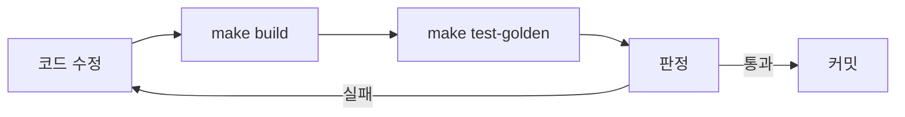

# Phase 1 — 회귀 판정 기준선

> **상태**: 미시작
> **범위**: belle-fw 의 동작 보존 판정 수단. **새 프레임워크를 만들지 않는다 — `lib/test/` 하니스를 확장하고 CI 에 올린다.**
> **선행**: [Phase 0](./phase0-hygiene-protocol-sot.md)
> **후행**: [Phase 2](./phase2-layer-skeleton.md) 이후 전부
> **근거**: [principles.md §3](../legacy/principles.md)

---

## 1. 배경

### 1.1 판정 수단이 **있다** — 자동으로 돌리는 계통이 없을 뿐

이 사실을 먼저 세운다. "belle 은 회귀를 판정할 방법이 없다" 는 **사실과 다르다.**

`lib/test/`, 커밋 `b8b12a7`(2026-06-17), **실험 브랜치가 아니라 출하 브랜치 위**다.

| 파일 | 내용 |
|---|---|
| `cf_ff_compare.c`(218 LOC) | **실제 펌웨어 `lib/cf-doppler.c` 를 호스트에서 컴파일**해 `cf_process()` 를 IQ 덤프(`scanlineNNN.dat` + `param.txt`)에 구동 |
| `build.sh` | `-D_CF_SAMPLE_40M_` 정의, `__NEON_ASSEM__` **미정의**(순수 C 폴백)로 링크 |
| `README.md` | *"골든 모델(파이썬) 재구현이 아니라 **펌웨어 코드 자체를 검증한다(목업 없음)**"* |

**정량 합격 기준까지 문서화돼 있다** — `recall=1.0`(device 보존) · `scatter=0` · `v21 far ≥ v20 far` · **골든 검출마스크 일치 ≥0.95**.

> **이 방식이 [emulator-e2e.md §1](../legacy/emulator-e2e.md) 의 원칙과 정확히 같다** — 목업이 아니라 진짜 코드를 검증한다. 우리가 가르칠 것이 아니라 **이미 그들이 하고 있는 것을 확장**하는 일이다.

### 1.2 공백은 셋이다

| # | 공백 | 내용 |
|---|---|---|
| 1 | **CI 가 없다** | 31개 저장소 전부 0건. 하니스를 **사람이 손으로 돌린다** |
| 2 | **골든이 범위 밖 저장소에 있다** | 드라이버 `run_fw_v21_compare.py` 와 골든 데이터가 **`NextDoppler`**(id 78)에 있고, 루트 `CLAUDE.md` 가 그것을 **범위 제외**했다 |
| 3 | **CF 한 모드만 덮는다** | B·PW·M 에 같은 하니스가 없다 |

**2번이 이 phase 의 선행 조건이다.** 범위 제외 판단이 in-scope 출하 펌웨어의 검증 의존물을 잘랐다 — [device-firmware.md §6.5](../../review/device-firmware.md) 가 그렇게 기록했다.

### 1.3 목적

1. `lib/test/` 하니스를 **CI 에 올린다** — belle-fw 최초의 CI
2. 같은 방식을 **B·PW·M 으로 확장**
3. **HC 프로토콜 패킷 골든** — [Phase 0-D](./phase0-hygiene-protocol-sot.md) 정본과 대조
4. Phase 2~9 의 모든 변경이 이 게이트를 통과하게 한다

### 1.4 범위 한계

이 시점의 검증은 **함수 단위 호스트 실행**이다.

| 잡힌다 | 안 잡힌다 |
|---|---|
| 신호처리 함수의 수치 회귀(`cf_process` 등) | 스레드·이벤트 타이밍 |
| 프로토콜 패킷 바이트 | 실장비 FPGA 레지스터 시퀀스 |
| 자료구조 레이아웃 | 부팅·프로세스 감시 |

**전 경로 실행은 [Phase 4](./phase4-platform-pc-emulator.md) 뒤에 온다.** 그때 에뮬레이터가 서면 이 골든은 그 위에서 계속 쓰인다 — 버리는 자산이 아니다.

---

## 2. 진행 단계

### Step 1-A. `NextDoppler` 범위 재판정 — **선행 조건**

**코드를 건드리기 전에 해야 한다.**

| # | 작업 |
|---|---|
| A-1 | `NextDoppler`(id 78) 클론 가능 여부 확인 |
| A-2 | `run_fw_v21_compare.py` 드라이버 + 골든 데이터 확보 |
| A-3 | **범위 판단 갱신** — 루트 `CLAUDE.md` 의 "신호처리 R&D 제외" 를 정정한다. 이미 [sonex-architecture.md §7](../../review/sonex-architecture.md) 근거로 재검토 대상이었다 |
| A-4 | 확보 불가 시 **대안**: 현행 출하본으로 IQ 덤프를 새로 뜨고 그 출력을 골든으로 삼는다. **"정답" 이 아니라 "이전 값" 이면 회귀 검출에 충분하다**([principles.md §3](../legacy/principles.md)) |

### Step 1-B. 하니스를 CI 에 올린다

| # | 작업 |
|---|---|
| B-1 | `lib/test/build.sh` 를 `make test-golden` 진입점으로 |
| B-2 | 골든 데이터를 저장소 안 `tests/fixtures/` 로 (또는 LFS·외부 참조 규약) |
| B-3 | CI 1건 — 호스트 컴파일 + 하니스 실행 + 합격 기준 판정. **belle-fw 최초의 CI** |
| B-4 | 실패 시 수치 diff 를 아티팩트로 |

### Step 1-C. B · PW · M 확장

`cf_ff_compare.c` 와 **같은 형태**로 만든다 — 펌웨어 함수를 호스트 컴파일해 덤프에 구동.

| 모드 | 대상 함수 후보 | 현행 위치 | LOC |
|---|---|---|---:|
| **B** | 합성개구 · 컨벤셔널 수신 | `sonon/sonon_b_sa.cpp`(358) · `image_proc/b_sa.cpp`(1,376) · `b_conventional.cpp`(671) | |
| **PW** | 벽필터 · 스펙트럼 | `sonon/sonon_pw_filter.cpp`(1,605) | |
| **M** | M 라인 조립 | `sonon/sonon_pw_m_proc.cpp`(977) 의 M 부분 | |
| 공통 | 스캔 컨버전 | `sonon/sonon_scanconversion.cpp`(1,278) | |

| # | 작업 |
|---|---|
| C-1 | 각 모드의 **순수 계산 함수를 식별**한다. 하드웨어·소켓에 얽힌 것은 이 단계에서 제외 |
| C-2 | 호스트 컴파일 가능 여부 확인 — `__NEON_ASSEM__` 미정의 폴백이 있는지 |
| C-3 | 입력 덤프 확보 — 실장비 1회 수집 |
| C-4 | 합격 기준 정의 — CF 의 `recall`·`scatter`·`마스크 일치 ≥0.95` 형식을 따른다 |

> **C-2 가 관문이다.** `cf-doppler.c` 는 NEON 폴백이 있어 호스트 컴파일이 됐다. 다른 모드에 폴백이 없으면 **그것을 만드는 것이 이 단계의 실제 작업**이고, 부수 효과로 [Phase 4](./phase4-platform-pc-emulator.md) 의 PC 어댑터가 쉬워진다.

### Step 1-D. HC 프로토콜 패킷 골든

| # | 작업 |
|---|---|
| D-1 | `sonon` 이 내보내는 패킷을 덤프하는 훅 — `sonon_transmit.cpp` |
| D-2 | 시나리오별 골든 — 연결 · 스캔 시작 · 모드 전환 · freeze · 파라미터 변경 |
| D-3 | [proof/protocol-sot](../legacy/proof/protocol-sot/) 정본과 대조. **[r1 Phase 1-D](../r1/phase1-regression-baseline.md) 의 앱 측 패킷 골든과 짝이다**(r1 문서가 이 관계를 "장비 축의 짝 문서"로 명시 인용) |
| D-4 | **에러 경로 포함** — 잘린 패킷 · 미지 opcode · 타임아웃 |

> **D-3 이 두 갈래를 잇는다.** 앱이 보내는 것과 장비가 받는 것이 같은 정본을 쓰면, [Phase 4](./phase4-platform-pc-emulator.md) 에서 둘을 붙일 때 계약이 이미 맞아 있다.

### Step 1-E. `make` 인터페이스

| 타겟 | 동작 |
|---|---|
| `make test-golden` | 전 모드 하니스 + 패킷 골든 |
| `make golden-update` | 의도된 변경 시 갱신. **커밋에 사유 필수** |
| `make check-layers` | ([Phase 2-D](./phase2-layer-skeleton.md) 에서 추가) |

---

## 3. 검증

| # | 항목 | 명령 | 기대 |
|---|---|---|---|
| 3.1 | 호스트 실행 | 실장비 없이 `make test-golden` | exit 0 |
| 3.2 | 결정론 | 3회 실행 | 동일 결과 |
| 3.3 | **모드 커버리지** | CF · B · PW · M | **4모드 전부** (미달 시 숫자 명시) |
| 3.4 | CF 합격 기준 | `recall=1.0` · `scatter=0` · 마스크 일치 ≥0.95 | 통과 |
| 3.5 | 패킷 골든 | 시나리오 5종 | 바이트 일치 |
| 3.6 | **회귀 검출** | 알려진 버그 1건 재도입 | **실패해야 한다** |
| 3.7 | CI | push 시 자동 실행 | 통과 |
| 3.8 | 실행 시간 | | 커밋마다 돌릴 수 있는 시간 |

> **3.6 이 진짜 게이트다.** 최근 커밋이 전부 **T1968 컬러 도플러 저SNR 검출**이므로, 그 시리즈 중 하나를 되돌려 하니스가 잡는지 확인한다.

---

## 4. 위험 · 대응

| 위험 | 영향 | 대응 |
|---|---|---|
| **`NextDoppler` 골든을 확보 못 한다** | Phase 1 이 반쪽 | Step 1-A-4 — 현행 출하본으로 골든을 새로 뜬다. **"정답" 이 아니라 "이전 값"** 이면 충분 |
| B·PW·M 에 NEON 폴백이 없어 호스트 컴파일 불가 | 3.3 미달 | **폴백을 만드는 것이 Phase 4 의 선투자**다. 그래도 안 되면 해당 모드는 Phase 4 뒤로 미루고 **미달을 명시** |
| 입력 덤프를 실장비로만 뜰 수 있다 | 착수 지연 | **이 phase 가 실장비를 쓰는 마지막 지점**이다. 이후는 녹화로 돈다 |
| 골든이 환경 의존(부동소수·컴파일러) | 매일 깨진다 | 허용오차를 처음부터 명시. 골든 생성 환경을 **컨테이너로 고정** |
| 골든 갱신 남발 | 회귀가 갱신으로 덮인다 | `golden-update` 커밋에 **사유 필수** |
| T1968 이 진행 중이라 CF 골든이 계속 바뀐다 | 기준선이 안 선다 | **힐세리온과 동기화 지점 합의.** 특정 커밋을 기준선으로 고정 |

---

## 5. 이 phase 가 여는 것

Phase 2 이후 모든 변경이 이 루프를 통과한다. **이것이 없으면 [Phase 7](./phase7-feature-scan-split.md) 의 `sonon_receive_fpga.cpp` 4,048 LOC 분해는 "고쳤는지 알 수 없는 변경" 이 된다.**

그리고 [Phase 4](./phase4-platform-pc-emulator.md) 에서 에뮬레이터가 서면 **이 골든이 그 위에서 계속 돈다** — 함수 단위 → 전 경로로 넓어질 뿐 버려지지 않는다.

---

## 6. cross-reference

- [plan.md §1.8·§4](./plan.md)
- [../../review/device-firmware.md §6.5](../../review/device-firmware.md) — `lib/test/` 하니스 실측과 범위 제외 문제
- [emulator-e2e.md §1·§5.4](../legacy/emulator-e2e.md) — 목업이 아닌 실코드 검증 원칙 · FPGA 팀 골든 모델 선례
- [../r1/phase1-regression-baseline.md](../r1/phase1-regression-baseline.md) — 앱 측 패킷 골든. **Step 1-D 와 짝**
- [../proof/protocol-sot/](../legacy/proof/protocol-sot/)
