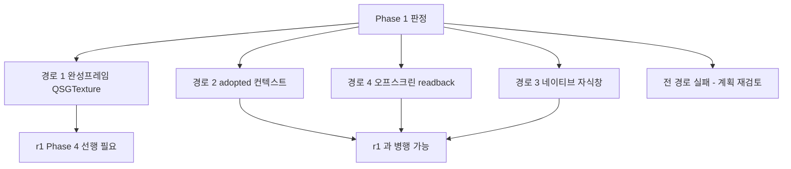

# Phase 1 — 렌더 합성 실증 ★

> **상태**: 미시작
> **범위**: **SDK 가 그린 스캔 화면을 `moana` 의 QtQuick 씬그래프에 합성할 수 있는가**를 실증한다. 코드를 이관하지 않는다 — **최소 시험물로 경로를 확정하고 계약을 문서화한다.**
> **선행**: [Phase 0](./phase0-repo-scope-cut.md)(권장이나 필수 아님 — 이 phase 는 별도 최소 앱으로 칠 수 있다)
> **후행**: [Phase 2](./phase2-sdk-adk-adapter.md) 이후 전부
> **근거**: [plan.md §3 Phase 1](./plan.md) · [../r1/phase4-render-boundary.md](../r1/phase4-render-boundary.md) · [../rendering-boundary.md](../rendering-boundary.md)
> **실측 기준**: `sonex-framework` `origin/master` `e17280b2`(2026-07-30) · `moana` `origin/service_QT693`. 줄번호는 2026-08-01~02 직접 확인분이다.

---

## 1. 배경

### 1.1 이 phase 가 이 계획의 첫 관문인 이유

**여기가 서지 않으면 [plan.md](./plan.md) 전체가 무의미하다.** 그리고 **실장비 없이 판정할 수 있다** — 이 계획에서 사람 검증이 병목인 항목([plan.md §5](./plan.md)) 중 유일하게 그렇지 않다. 그래서 가장 먼저 친다.

### 1.2 문제 — 둘 다 GL 컨텍스트와 렌더 스레드를 소유하려 한다 `[실측]`

| | `moana` (QtQuick) | `sonex` SDK (현행) |
|---|---|---|
| GL 컨텍스트 | **Qt 가 소유**(QSG) | **자체 EGL 생성** — `initEGL()`·`initNativeDisplay()`(`HCImageRenderCore.h:284-289`) |
| 렌더 스레드 | Qt QSG 렌더 스레드 | **자체 스레드** — `std::thread renderThread`(`:325`)·`wakeRenderThread()`(`:335`) |
| 출력 대상 | 씬그래프 안 FBO — `GLFrameView` = `QQuickFramebufferObject`(`GLFrameView.h:42,524`) | **네이티브 창** — `prepareRender(void* nativeWindow, bool useAppThread, int streamIndex)`(`sdk/include/HCSonexSDK.h:76`) |
| 리사이즈 | Qt 레이아웃 | `onSurfaceChanged(int width, int height)`(`HCImageRenderCore.h:59`) |

**네이티브 자식 창은 QtQuick 씬그래프 위에 뜨는 별도 표면**이라, 그 위에 QML 을 얹는 문제는 `sonex-app`(Flutter)이 겪는 것과 **구조적으로 같다** — 그쪽은 `Texture`/`TextureRegistrar` 사용 **0건**에 `hwnd` 관리 116줄 + 재생성 폴링 61줄, 측정 오버레이를 얹으려고 **투명 네이티브 창을 합성**하는 조율 계층 **1,273 LOC** 를 쓴다([../r1/phase4-render-boundary.md §1.5](../r1/phase4-render-boundary.md)).

> **Qt 라서 자동으로 해소되지 않는다.** `QWidget::winId()` 가 네이티브 핸들을 주는 것은 맞지만, 그것은 위 표의 **3행(출력 대상)만 해결**하고 1·2행은 그대로 남긴다.

### 1.3 그러나 SDK 쪽에 붙을 자리가 셋 있다 `[실측]`

백지가 아니다.

| # | 자산 | 위치 | 성격 |
|---|---|---|---|
| ① | **`adopted` 컨텍스트 경로** | `initCurrentDisplay()`(`HCImageRenderCore.cpp:708-754`) — `eglGetCurrentDisplay`·`eglGetCurrentContext`·`eglGetCurrentSurface` 로 **호출자가 current 로 만들어 둔 컨텍스트를 채택**한다. 분기는 `:888-893` 의 `nativeWindow != nullptr` | **이미 존재하고 iOS 브리지가 쓴다.** [r1 4-A4](../r1/phase4-render-boundary.md) 가 이 경로를 `adopted` 모드로 **보존**하기로 했다 |
| ② | **오프스크린 FBO 합성** | `namespace cine`(`HCImageRenderCore.cpp:77-381`)·`processOneCineJobGL`(`:2650-2785`)·`ensureCineFbo`(`:303`). 주석이 *"라이브와 동일한 fan-conversion mesh 로 offscreen FBO 에 그린 뒤 RGBA"*(`HCImageRenderCore.h:66-69`) | **실제로 돈다.** 다만 **기존 GL 컨텍스트를 전제**하고 `prevFbo` 를 백업·복원할 뿐 컨텍스트를 만들지 않는다 — **창 없이는 못 돈다**([r1 4 §1.2](../r1/phase4-render-boundary.md)) |
| ③ | **완성 프레임 반환 API** | `hc_GetBufferRenderedFrameAt`(`HCSonexSDKInterface.cpp:430-471`, **가드 없음**) → `renderCineFrame` → `hc_renderCineFrameFromGray` → `submitCineJobExternal` → 렌더 스레드 잡 큐 → `processOneCineJobGL` → `glReadPixels` | **호출 사슬이 이미 이어져 있다.** 한계 셋 = **B 모드만 합성** · **기존 컨텍스트·렌더 스레드 전제** · **입력이 ScanBuffer 인덱스 고정** |

> **`useAppThread` 가 열쇠일 수 있다** — `initialize(nativeWindow, useAppThread)` 의 두 번째 인자가 렌더 스레드 소유를 가른다(`:669-706`). 다만 **호출처마다 값이 다르고 `start()` 는 빈 stub**(`:1956-1961`)이라 **정적 분석으로 실동작을 확정할 수 없다**([r1 4 §1.6](../r1/phase4-render-boundary.md)). 이 phase 가 **실행으로 관측**한다.

### 1.4 `500C/500P` 라서 유리한 점

장비가 **완성된 JPEG** 을 보내고 PW 만 raw 스펙트럼이다([../../review/protocol-device.md §5.1](../../review/protocol-device.md)). 즉 **프레임레이트가 raw scanline 계열보다 낮고 데이터량이 작다** — 픽셀 복사 경로(④)가 성립할 여지가 그만큼 넓다. 이 phase 는 그것을 **수치로 확인**한다(§2 Step 1-E).

---

## 2. 진행 단계

### Step 1-A. 시험대 구성

**`moana` 트리에서 하지 않는다** — 최소 Qt6 앱으로 격리해야 원인이 섞이지 않는다.

| # | 작업 |
|---|---|
| A-1 | 최소 Qt6 QtQuick 앱 — `QQuickFramebufferObject` 파생 아이템 하나 + 그 위에 QML 오버레이(사각형·텍스트) |
| A-2 | **오버레이를 반드시 얹는다.** 영상만 뜨는 것은 판정이 아니다 — 이 phase 가 가르려는 것은 **합성**이다 |
| A-3 | 입력은 **재생 데이터**로 고정 — 실장비 없이 반복 가능해야 한다. `moana` 의 `.hcp`/`.hcm` 녹화 또는 SDK 의 `hc_GetBufferRenderedFrameAt`(ScanBuffer 인덱스) |
| A-4 | 대상 플랫폼은 **하나로 시작**한다. 나머지는 경로가 확정된 뒤 넓힌다(§2 Step 1-F) |

### Step 1-B. 경로 ① — 완성 프레임 → `QSGTexture` **(본선)**

**[r1 Phase 4](../r1/phase4-render-boundary.md) 가 세우는 계약을 소비한다.** SDK 가 창을 받지 않고 `hc_CreateRenderTarget(width,height)` 로 렌더 타겟만 받은 뒤 완성 프레임을 반환하는 형태다.

| # | 작업 |
|---|---|
| B-1 | 프레임을 받아 `QSGTexture` 로 감싸 씬그래프에 넣는다 |
| B-2 | **공유 서피스(제로카피)와 픽셀 버퍼(폴백) 둘 다 시험한다** — [r1 4-E](../r1/phase4-render-boundary.md) 가 전자를 본선으로 둔다 |
| B-3 | **r1 Phase 4 미완 시점에도 부분 시험이 가능하다** — ③의 `hc_GetBufferRenderedFrameAt` 가 이미 RGBA 를 반환하므로, **B 모드 한정·ScanBuffer 인덱스 한정으로 경로 자체는 지금 검증할 수 있다** |
| B-4 | 반환 계약을 기록 — 픽셀 포맷·원점·스트라이드·버퍼 소유. 현행 cine 경로는 `orthoMat` 의 t/b swap 으로 GL 단계에서 flip 한다(`:2721-2753`) |

### Step 1-C. 경로 ② — `adopted` 컨텍스트

**Qt 가 만든 GL 컨텍스트를 SDK 가 채택한다.** 성립하면 제로카피이고 r1 Phase 4 에 걸리지 않는다.

| # | 작업 |
|---|---|
| C-1 | `QQuickFramebufferObject::Renderer::render()` 안에서 Qt 컨텍스트가 current 인 상태로 `prepareRender(nullptr, useAppThread=true)` 를 호출 — `:888-893` 분기가 `initCurrentDisplay()` 로 가는지 확인 |
| C-2 | **Qt 의 GL 컨텍스트가 ANGLE/EGL 과 호환되는지가 관건**이다. Qt6 는 플랫폼에 따라 desktop GL·GLES·ANGLE 중 무엇을 쓰는지 달라진다 — **`QSG_RHI_BACKEND` 와 Qt 의 GL 백엔드를 함께 기록**한다 |
| C-3 | SDK 가 `prevFbo` 백업·복원을 하므로(②) **Qt 의 FBO 바인딩을 깨뜨리지 않는지** 확인 |
| C-4 | **렌더 스레드 소유를 실행으로 관측한다** — `useAppThread` 의 실제 값과 `worker()`(`:5226`) 기동 여부를 로그로 남긴다([r1 4-A5](../r1/phase4-render-boundary.md) 의 미확인 항목을 이 시험이 해소한다) |

### Step 1-D. 경로 ③ — 네이티브 자식 창 **(현행 SDK 로 즉시 가능)**

| # | 작업 |
|---|---|
| D-1 | `QWidget`(`WA_NativeWindow`) 또는 `QWindow::fromWinId()` 의 핸들을 `prepareRender` 에 전달 |
| D-2 | **판정 대상은 "영상이 뜨는가"가 아니라 "그 위에 QML 이 얹히는가"다**(A-2) |
| D-3 | 얹히지 않으면 **`QQuickWidget` + Widgets 조합**을 시험한다 — QML 을 위젯 계층으로 내리면 z-order 를 위젯이 관리한다 |
| D-4 | 성립하더라도 **비용을 기록한다** — Flutter 가 이 경로에서 치른 것(1,273 LOC 조율 계층·투명창 합성)이 Qt 에서 얼마나 재현되는지 |

### Step 1-E. 경로 ④ — 오프스크린 FBO → readback → 텍스처 업로드

| # | 작업 |
|---|---|
| E-1 | ②의 cine FBO 경로를 **화면 전체**로 확장 가능한지 본다. 현재는 `renderScanB` 하나만 그린다(`:2757`) — **CF·Spectrum·눈금·측정이 빠진다** |
| E-2 | `hc_ReadRenderedImage` 는 **`#if OS_IOS` 가드**가 걸려 있다(`HCSonexSDKInterface.cpp:331`). 코어 메서드만 `OS_IOS \|\| OS_MACOS` 라 **macOS 는 구현이 빌드되지만 부르는 쪽이 없다** — 시험 플랫폼 선택에 영향 |
| E-3 | **복사 비용을 수치로 낸다** — §1.4 대로 500C/P 는 데이터량이 작아 성립 여지가 있다. 추정하지 말고 잰다 |

### Step 1-F. 판정과 계약 확정

| # | 작업 |
|---|---|
| F-1 | 네 경로의 **성립 여부 × 프레임레이트 × 지연**을 표로 낸다. 미지원 조합은 **숫자로 명시**한다 |
| F-2 | **본선과 폴백을 정한다.** 하나만 고르지 않는다 — 플랫폼별로 갈릴 수 있다 |
| F-3 | **r1 Phase 4 의존 여부를 확정한다** — ①만 성립하면 이 계획은 r1 Phase 0~4 완료에 걸린다. ②·④가 성립하면 병행 가능하다. **이것이 [plan.md](./plan.md) 의 최대 일정 변수다** |
| F-4 | 확정 경로의 **계약을 문서화**한다 — 픽셀 포맷·원점·스트라이드·버퍼 소유·스레드 규약·리사이즈 규약. Phase 3 이 이 계약 위에 선다 |
| F-5 | **좌표 변환 계약도 여기서 정한다** — 위젯 좌표 → 렌더 타겟 좌표. `moana` 의 `ppcm = contentHeight / (viewDepth/10)`(`MeasureView.cpp:2712`)가 대체될 자리다([r1 4-B1](../r1/phase4-render-boundary.md)) |

---

## 3. 검증

| # | 항목 | 방법 | 기대 |
|---|---|---|---|
| 3.1 | **영상 표시** | 재생 데이터로 스캔 화면이 뜬다 | 최소 1개 경로에서 성공 |
| 3.2 | **QML 오버레이 합성** | 영상 위에 QML 사각형·텍스트가 보인다 | **이것이 진짜 게이트다.** 3.1 만 통과하고 3.2 가 실패하면 그 경로는 탈락 |
| 3.3 | 리사이즈 | 창 크기 변경 시 영상이 따라온다 | 깨지지 않음 |
| 3.4 | 프레임레이트 | 경로별 fps | **수치 기록.** 500C/P 실사용 프레임레이트와 대조 |
| 3.5 | 렌더 스레드 소유 | `useAppThread` 실제 값·`worker()` 기동 여부 | **로그로 관측**(정적 분석 불가) |
| 3.6 | 합성 범위 | CF·Spectrum·눈금·측정이 함께 나오는가 | 현행 ③은 **B 모드만**이다. 부족분을 목록화 |
| 3.7 | 플랫폼 편차 | 확정 경로를 다른 플랫폼에서 재시험 | 지원표 작성. **미지원은 숫자로 명시** |

> **3.2 가 이 phase 의 존재 이유다.** 영상만 띄우는 것은 Flutter 도 이미 한다 — 문제는 그 위에 UI 를 얹는 것이고, `moana` UI 를 쓰겠다는 결정 전체가 여기에 걸린다.

---

## 4. 위험 · 대응

| 위험 | 영향 | 대응 |
|---|---|---|
| **네 경로 모두 실패** | **[plan.md](./plan.md) 전체 무효** | 가장 먼저 친다. 실장비 불필요라 조기에 드러난다. 실패 시 대안은 `sonex-app`(Flutter) 복귀이며, **그 판단에 필요한 근거를 이 phase 가 만든다** |
| **①만 성립한다** | r1 Phase 0~4 가 선행이 되어 총량이 커진다 | F-3 에서 명시적으로 판정. B-3 대로 **r1 미완 시점에도 부분 시험이 가능**하므로 조기에 알 수 있다 |
| Qt 의 GL 백엔드가 ANGLE 과 안 맞는다(②) | `adopted` 경로 탈락 | C-2 — 백엔드를 기록하고, `QSG_RHI_BACKEND` 를 바꿔 재시험 |
| **③이 성립해 안심한다** | Flutter 가 겪는 조율 부채를 Qt 로 옮겨 온다 | D-4 — 성립해도 **비용을 함께 기록**한다. "된다"와 "쓸 만하다"는 다르다 |
| 합성 범위 부족(3.6) | 측정·눈금이 빠진 화면으로 성립 판정을 내린다 | E-1 — **부족분을 목록으로 낸다.** 해소는 [r1 4-C1](../r1/phase4-render-boundary.md) 소관이며 이 phase 는 요구사항만 낸다 |
| 한 플랫폼만 보고 확정 | 나중에 다른 플랫폼에서 무너진다 | A-4·3.7 — 확정 후 재시험을 계획에 넣는다. **출시 플랫폼 미확정이 여기 걸린다**([plan.md §6](./plan.md)) |
| **시험물이 `moana` 트리를 오염** | 원인이 섞인다 | Step 1-A — 별도 최소 앱으로 격리 |

---

## 5. 이 phase 가 여는 것

**F-3 의 답이 [plan.md](./plan.md) 의 일정 구조를 정한다.** 병행 가능하면 r1 과 r2 가 동시에 돌고, ①에만 걸리면 순차가 된다.

그리고 **이 phase 의 산출물이 [Phase 3](./phase3-render-path.md) 의 입력**이다 — 확정된 계약 위에서 `GLFrameView` 내부를 갈아끼우고 `app/Sources/Scan/` 렌더 코어 13.8k LOC 를 지운다.

---

## 6. cross-reference

- [plan.md](./plan.md) §3 Phase 1 · §6(위험) — 이 문서의 뼈대
- [../r1/phase4-render-boundary.md](../r1/phase4-render-boundary.md) — **경로 ①의 계약을 만드는 문서.** §1.2(있는 자산 정정)·§1.3(도는 프레임 반환 경로)·4-A(HAL 3종)·4-C(합성 범위 확장)·4-D(오프스크린 신규 구현)
- [../rendering-boundary.md](../rendering-boundary.md) — 렌더 경계 사양서. §4.1(제로카피 우선)·§7.3(드로잉·입력 소유)
- [phase0-repo-scope-cut.md](./phase0-repo-scope-cut.md) — 선행(권장)
- [phase3-render-path.md](./phase3-render-path.md) — 이 phase 의 계약을 소비한다
- [../../review/protocol-device.md](../../review/protocol-device.md) §5.1 — 500C/P 가 JPEG 을 보낸다는 근거(§1.4)
- [../../review/legacy/sonex-rendering.md](../../review/legacy/sonex-rendering.md) — 렌더 계층 상세·Flutter 결합 4갈래
