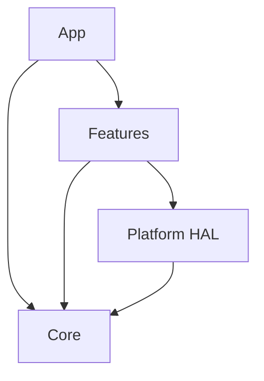

# Phase 2 — 4계층 골격 + 경계 강제

> **상태**: 미시작
> **범위**: `apps/` · `src/{app,core,features,platforms}` · `third_party/` 골격 생성. CMake 계층 분할. `make check-layers` 도입. **파일 내용을 옮기지 않는다 — 자리를 만들고 경계를 걸 장치를 세운다.**
> **선행**: [Phase 1](./phase1-regression-baseline.md)
> **후행**: [Phase 3](./phase3-platform-hal.md) 이후 전부
> **구조 정본**: ipc-app **ADR-001** — `cctv/device/ipc-app/docs/adr/adr-001-4layer-feature-first-architecture.md`

---

## 1. 배경

### 1.1 지금은 경계가 없다

루트 `CMakeLists.txt` 가 `add_subdirectory` 하는 것은 8개(`bcd`·`gpio`·`lib`·`sonon`·`deviced`·`watchdogd`·`image_proc`·`tools`)이고, **`modules/`(커널 드라이버·Flask 웹서버)는 CMake 그래프 밖**이다. 계층이라는 개념 자체가 빌드에 없다.

그 결과:

- `tools/` 23파일이 `lib/`(HAL)를 거치지 않고 `/dev/mem`·`/dev/i2c` 를 직접 연다
- `deviced` 가 I2C 를 독자 open 한다
- **막을 도구가 없어 어겨도 빌드가 통과한다**

### 1.2 ipc-app 의 답 — 4계층 + grep 판정



| 계층 | ipc-app 실측(파일/LOC) | belle-fw 대응 |
|---|---:|---|
| `apps/` | 3 / 738 | 프로세스 4종 `main()` |
| `app/` | 44 / 13,163 | `sonon.cpp` 조립부 |
| `core/` | 71 / 6,064 | `lib/event`·`common`, `bcd` 일부 |
| `features/` | 389 / 43,452(27개) | `sonon/`+`image_proc/`+`deviced/` |
| `platforms/` | 184 / 18,324 | `lib/` 전체 |

**ADR-004 의 대안 비교가 핵심이다**:

> 대안 2(`#ifdef` 로 코드 내 분기) — "새 플랫폼 추가 시 기존 파일 수정 필요, 컴파일 오류 위험 증가" 로 **기각**.

belle-fw 는 지금 정확히 그 대안 2 상태다(`_USING_500L_DEV_` 등). 그러나 **그 문제는 [Phase 9](./phase9-runtime-variant.md) 의 대상**이고, 이 phase 는 그보다 먼저 필요한 **디렉토리 계층**을 세운다.

### 1.3 목적

1. 4계층 디렉토리 골격 확립
2. CMake 를 계층별로 분할하고 **`modules/` 를 그래프에 넣는다**
3. include 경로 규정형 전환
4. **`make check-layers`** — 경계를 도구가 지키게 한다

### 1.4 범위 한계

- **소스 내용을 옮기지 않는다.** `lib/` → `platforms/` 이동은 [Phase 3](./phase3-platform-hal.md), feature 분해는 [Phase 6](./phase6-feature-config-power-diagnostics.md)·[7](./phase7-feature-scan-split.md)
- HAL 우회 23파일을 여기서 고치지 않는다 — [Phase 3-D](./phase3-platform-hal.md)
- `_USING_500L_DEV_` 등 컴파일 타임 변종을 여기서 다루지 않는다 — [Phase 9](./phase9-runtime-variant.md)

---

## 2. 목표 배치

```
belle-fw/
  apps/
    sonon/main.cpp   bcd/main.cpp   deviced/main.cpp   watchdogd/main.cpp
  src/
    app/{bootstrap,composition,protocol,runtime}/
    core/{entities,protocol,config,event,logging,messaging,time,util}/
    features/                      ← Phase 6·7·8 에서 내용이 채워진다
    platforms/{hal,common,zynqmp,pc}/
  third_party/{strtk,ne10,xilinx}/  ← Phase 0 에서 이미 생성
  data/lut/                        ← Phase 0-B
```

**지금은 껍데기다.** `core/`·`features/`·`platforms/hal`·`platforms/zynqmp` 디렉토리를 만들되, 내용은 대부분 아직 `lib/`·`sonon/` 등 원래 자리에 있다. **경계 검사 스크립트가 먼저 서고, 그 다음 phase 들이 내용을 옮길 때마다 검사를 통과시킨다.**

---

## 3. 진행 단계

### Step 2-A. 골격 생성

```bash
mkdir -p apps/{sonon,bcd,deviced,watchdogd}
mkdir -p src/app/{bootstrap,composition,protocol,runtime}
mkdir -p src/core/{entities,protocol,config,event,logging,messaging,time,util}
mkdir -p src/features
mkdir -p src/platforms/{hal,common,zynqmp,pc}
```

각 디렉토리에 `CMakeLists.txt` 뼈대 + README(역할 1줄).

### Step 2-B. CMake 계층 분할

| # | 작업 |
|---|---|
| B-1 | 루트 `CMakeLists.txt` 를 `add_subdirectory(src/core)` · `add_subdirectory(src/features)` · `add_subdirectory(src/platforms)` · `add_subdirectory(apps)` 로 재구성. **기존 8개 subdirectory 는 이 phase에서 이동하지 않고, 각 상위 CMakeLists 가 옛 경로를 `add_subdirectory(../../lib)` 식으로 임시 참조** |
| B-2 | **`modules/` 를 그래프에 넣는다** — 커널 드라이버(`plif`·`zynqdma`·`msp430_drv`)는 Buildroot `kernel-module` package 로, `webserver`(Flask)는 별도 install 타겟으로 |
| B-3 | 하드코딩 변종 플래그 6개(`_USING_500L_DEV_` 등)는 **그대로 둔다** — Phase 9 전까지 손대지 않는다 |
| B-4 | 6타깃(zynqmp 실장비만 우선, pc 는 Phase 4) 빌드 확인 |

> **B-1 이 "임시 참조" 인 이유**: 이 phase 는 파일을 옮기지 않으므로, 새 계층 디렉토리는 당장 비어 있다. CMake 그래프만 먼저 계층 이름으로 정리하고, **내용 이동은 Phase 3 이후 각자의 몫**이다.

### Step 2-C. include 경로 규정형 전환

| # | 작업 |
|---|---|
| C-1 | `sonon/`·`lib/`·`bcd/`·`deviced/` 등 원본 경로 include 를 **경로 명시형**으로. moana([legacy/r1 Phase 2](../legacy/r1/phase2-layer-boundary.md))와 같은 방식 |
| C-2 | 헤더 basename 중복 확인 — `fpga_ebi.h`/`fpga_dummy.h` 등은 `lib/` 안에서 이미 구분되므로 충돌 낮을 것으로 예상. **착수 시 실측** |
| C-3 | `INCLUDEPATH`(CMake `target_include_directories`) 를 계층별로 좁힌다 |

### Step 2-D. `make check-layers`

경로 규정형이 되면 규칙을 기계 판정할 수 있다.

| 규칙(ADR-001) | 판정 |
|---|---|
| `core/**` 이 `features/`·`platforms/`·`app/` 를 include 하지 않는다 | `grep` |
| `platforms/**` 이 `features/`·`app/` 를 include 하지 않는다 | `grep` |
| `features/**` 이 `app/` 를 include 하지 않는다 | `grep` |
| (Phase 6 이후) `features/*/domain/` 이 `#ifdef`·HAL·타 feature 를 참조하지 않는다(ADR-011) | `grep` |

**`third_party/` 는 예외**([Phase 0-A5](./phase0-hygiene-protocol-sot.md)) — 서드파티는 계층 규칙 밖이다.

`make check-layers` 를 [Phase 1](./phase1-regression-baseline.md) 의 `make test-golden` 과 나란히 CI 에 붙인다.

---

## 4. 검증

| # | 항목 | 명령 | 기대 |
|---|---|---|---|
| 4.1 | 골격 존재 | `ls -d apps src/{app,core,features,platforms}` | 전부 존재 |
| 4.2 | `modules/` 그래프 편입 | CMake 트리에서 `plif`·`zynqdma`·`msp430_drv`·`webserver` 확인 | ✓ |
| 4.3 | 경로 규정형 | include 중 basename 만인 것 | 0건 |
| 4.4 | 계층 검사 | `make check-layers` | exit 0(현재는 대부분 미이동 상태라 대상 파일 적음) |
| 4.5 | 실장비 빌드 | `make build TARGET=zynqmp` | exit 0 |
| 4.6 | **동작 불변** | `make test-golden`([Phase 1](./phase1-regression-baseline.md)) | 통과 |
| 4.7 | 부팅 | 실장비 부팅 + 스캔 | 정상 |

---

## 5. 위험 · 대응

| 위험 | 영향 | 대응 |
|---|---|---|
| **커널 모듈을 CMake 그래프에 넣는 방법이 Buildroot 전제와 안 맞는다** | B-2 가 막힌다 | Buildroot 는 커널 모듈을 보통 별도 package 로 다룬다. **CMake 안에 억지로 넣지 말고 Buildroot package 로 분리**하는 것이 정답일 수 있다 — 착수 시 재판단 |
| include 경로 규정형 전환이 대규모 diff | 리뷰 불가 · 회귀 은폐 | 디렉토리 단위로 쪼갠다. 각각 4.6 확인 |
| `modules/webserver`(Flask)의 편입 방식 미정 | 로컬 진단 도구를 CMake 로 감쌀 이유가 약함 | **[Phase 8-D](./phase8-feature-firmware-process.md) 에서 유지/제거 결정.** 이 phase 는 자리만 마련 |
| 헤더 basename 충돌 | C-2 재작업 | 착수 시 전수 확인. moana 는 0건이었지만 belle 은 다를 수 있다 |
| `make check-layers` 가 너무 이르게 걸려 이후 phase 를 막는다 | 개발 정체 | 규칙을 **점진 추가** — Phase 2 시점에는 최상위 4규칙만, feature 규칙은 Phase 6 이후 |

---

## 6. cross-reference

- [plan.md §2.1·§2.2·§4](./plan.md)
- ipc-app **ADR-001**(4계층) · **ADR-004**(대안 비교) — `cctv/device/ipc-app/docs/adr/`
- [../legacy/r1/phase2-layer-boundary.md](../legacy/r1/phase2-layer-boundary.md) — moana 의 같은 성격 phase
- [phase3-platform-hal.md](./phase3-platform-hal.md) — 이 골격에 내용을 채우는 다음 단계
