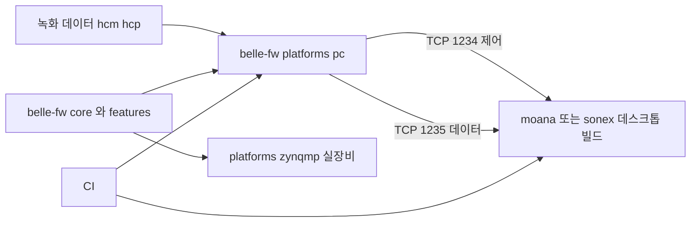
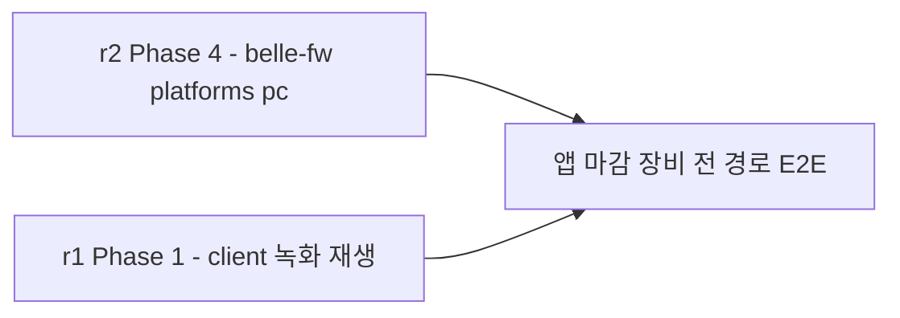

# Phase 4 — `platforms/pc` — 에뮬레이터가 선다 ★

> **상태**: 미시작
> **범위**: r2 의 분기점. `DEVICE_DUMMY` 를 실사용 가능한 PC 어댑터로 승격하고, 녹화 재생을 붙여 **같은 펌웨어 소스가 실장비와 개발 PC 양쪽에서 뜨게** 한다.
> **선행**: [Phase 3](./phase3-platform-hal.md) — HAL 인터페이스와 런타임 선택 경로가 있어야 한다.
> **후행**: [Phase 5](./phase5-core-layer.md) 이후 전부가 이 위에서 판정된다.
> **SOT**: [emulator-e2e.md](../legacy/emulator-e2e.md) — **왜 별도 시뮬레이터가 아닌지**가 이 phase 존재의 근거다.

---

## 1. 배경

### 1.1 왜 별도 시뮬레이터가 아닌가 — 요약

[emulator-e2e.md §1](../legacy/emulator-e2e.md) 의 결론을 반복하지 않는다. 핵심 한 줄: **독립 시뮬레이터는 우리가 프로토콜을 다시 구현한 것이라 "맞다" 는 보장이 없고, cctv 에서 정확히 이 이유로 사고가 났다**(`fw-orig-parity-audit.md`, ndvr 채널당 single profile 누락이 자기구현 oracle 때문에 수많은 테스트를 통과).

**해법은 진짜 펌웨어를 PC 에서 돌리는 것**이고, 그 발판이 [Phase 3](./phase3-platform-hal.md)에서 이미 승격한 `i_fpga_port.h` 다.

### 1.2 현재 `DEVICE_DUMMY` 의 실제 한계 — 2가지

```c
// lib/fpga_dummy.cpp (117 LOC)
```

| 한계 | 실측 |
|---|---|
| **선택 불가** | [Phase 3-E](./phase3-platform-hal.md) 에서 이미 해결 — `BELLE_PLATFORM=pc` |
| **입력이 램프 패턴** | `dummy_read_frame` 이 `*(buf+i) = i & 0xff` 만 채운다. **녹화 재생이 아니다** |
| **함수 3개 누락** | `read_reg_32`·`write_reg_32`·`mmap` — [Phase 3-A](./phase3-platform-hal.md) 의 순가상함수 전환으로 컴파일 타임에 강제된다 |

### 1.3 비용을 낮게 잡지 않는다

| | ipc-app | belle-fw |
|---|---:|---:|
| PC 어댑터 | `platforms/ubuntu24` **6,665 LOC**(184파일 중 다수) | `fpga_dummy.{cpp,h}` + `_ext.h` **3파일 117 LOC** |
| 실장비 어댑터 | `platforms/nt98566` | `fpga_ebi` 계열 **7,351 LOC** |

**cctv 에서도 PC 어댑터가 작지 않다** — 하드웨어가 하던 일을 소프트웨어로 대신해야 하기 때문이다. belle 은 여기에 **FPGA 레지스터 · 프로브 · 빔포밍**이 얹히므로 ipc-app 카메라 스트리밍보다 무거울 수 있다. **117 LOC 는 골격일 뿐이고, 이 phase 가 그것을 실제 크기로 키운다.**

### 1.4 목적

1. `DEVICE_DUMMY` → **녹화 재생 가능한 PC 어댑터**
2. `127.0.0.1:1234/1235` 로 앱이 접속해 **전 경로가 뜬다**
3. **[r1 Phase 1](../r1/phase1-regression-baseline.md) 의 앱 측 녹화 재생과 만난다** — 장비·앱 양쪽 절반이 합쳐져 실제 E2E 가 된다

### 1.5 범위 한계

- **신호처리 알고리즘을 PC 용으로 다시 만들지 않는다.** `cf-doppler.c` 등은 [Phase 3](./phase3-platform-hal.md) 에서 여전히 hardware-agnostic 계산부로 분리 중이며, 그 결과물을 **PC 에서도 그대로 실행**한다 — PC 어댑터가 대신하는 것은 **FPGA 레지스터·AFE·펄서** 이지 신호처리가 아니다
- 클라우드는 이 phase 의 범위가 아니다(장비는 클라우드와 무관 — [legacy/r1 Phase 1 §5.1](../legacy/r1/phase1-regression-baseline.md) 참조. 현재 r1 문서에 동일 절이 재확인되지 않아 legacy 인용을 유지)

---

## 2. 목표 형태



**같은 펌웨어 소스가 두 플랫폼으로 나간다** — cctv 의 `platforms/{nt98566, ssc30kq, ubuntu24}` 와 같은 형태([emulator-e2e.md §2](../legacy/emulator-e2e.md)).

---

## 3. 진행 단계

### Step 4-A. 빠진 3함수 구현

`i_fpga_port` 가 [Phase 3-A](./phase3-platform-hal.md) 에서 순가상함수가 됐으므로, PC 구현체가 `read_reg_32`·`write_reg_32`·`mmap` 을 세우지 않으면 **컴파일이 실패한다.**

| # | 작업 |
|---|---|
| A-1 | `read_reg_32`/`write_reg_32` — 가상 레지스터 맵(메모리 배열)에 대한 read/write. 실제 하드웨어 부수효과 없이 값만 저장·반환 |
| A-2 | `mmap` — 실제 `/dev/mem` 대신 **힙 메모리 블록**을 매핑된 것처럼 반환 |
| A-3 | 레지스터 초기값을 [Phase 1](./phase1-regression-baseline.md) 골든과 맞춘다 — 실장비 레지스터 덤프가 있으면 그것을 초기 상태로 |

### Step 4-B. 녹화 재생 — 이 phase 의 핵심

| # | 작업 |
|---|---|
| B-1 | `dummy_read_frame` 을 **녹화 파일 리더**로 교체 |
| B-2 | 입력 포맷 결정 — **`moana/framework/Record/`(`RecordFileHeaderV6`)와 공유할지, belle 고유 포맷을 쓸지** 확정. HC 프로토콜이 이미 공유되므로 프레임 포맷도 공유가 자연스럽다 |
| B-3 | 데이터 층위 확정 — **RF 라인인가 스캔변환 후 영상인가**([emulator-e2e.md §10](../legacy/emulator-e2e.md) 미확인 항목). `sonon_receive_fpga.cpp` 가 FPGA 로부터 받는 층위와 일치해야 한다 |
| B-4 | 재생 속도 — 실시간이 아니라 **프레임 단위 스텝**(결정론적 판정) |
| B-5 | 픽스처 정리 — `tests/fixtures/`. **[legacy/r1 Phase 1-A](../legacy/r1/phase1-regression-baseline.md) 의 2018년 샘플과 세대 호환 여부 확인** — 비호환이면 실장비 1회 재수집 |
| B-6 | 모드별 녹화 확보 — B·CF·PW·M 각 1건 이상 |

> **B-3 이 가장 중요한 판단이다.** 잘못 고르면 PC 어댑터가 신호처리 일부를 대신 떠맡게 되어 [Phase 7](./phase7-feature-scan-split.md) 의 feature 분리와 충돌한다. **원칙**: PC 어댑터는 하드웨어를 대신하지 신호처리를 대신하지 않는다 — FPGA 가 원래 넘기던 것과 같은 층위(원시 RF/IQ)를 넘겨야 한다.

### Step 4-C. 나머지 HAL 의 PC 구현

[Phase 3](./phase3-platform-hal.md) 의 HAL 인터페이스 8종(`i_afe_port`·`i_pulser_port`·`i_buffer_port`·`i_clock_port`·`i_i2c_port`·`i_gpio_port`·`i_msp430_port`) 각각의 PC 구현.

| 인터페이스 | PC 구현 방향 |
|---|---|
| `i_afe_port` | 설정값을 저장만 하는 목(mock) — 실제 아날로그 동작 없음 |
| `i_clock_port` | 시스템 클록 사용 |
| `i_i2c_port` | 가상 레지스터 맵(온도·배터리는 고정값 또는 파일 기반 시뮬레이션) |
| `i_gpio_port` | 로그만 남기는 no-op |
| `i_msp430_port` | 고정 응답(정상 부팅 · 배터리 100%) |

### Step 4-D. PC 빌드 타깃

| # | 작업 |
|---|---|
| D-1 | `-DBELLE_BUILD_PC=ON` — ipc-app 의 `-DIPC_BUILD_UBUNTU24=ON` 대응 |
| D-2 | Buildroot 밖에서도 빌드 가능하게 — 개발자 호스트에서 직접 컴파일(x86_64) |
| D-3 | `make build TARGET=pc` |

### Step 4-E. 앱 접속 확인 — [r1](../r1/plan.md) 과의 접점

| # | 작업 |
|---|---|
| E-1 | `sonon`(PC 빌드) 를 `127.0.0.1:1234/1235` 로 기동 |
| E-2 | 데스크톱 빌드(`moana` 당시는 **[legacy/r1 §8](../legacy/r1/plan.md) 의 qmake→CMake/vcpkg 판단**과 연동이었다. 현재 client 트랙(`sonex-framework`)은 이미 CMake 라 이 판단 자체가 소멸 — [gap.md](../gap.md) 로 재확인)로 접속 |
| E-3 | 스캔 시작 → 모드 전환 → 측정 → freeze 의 기본 경로 확인 |
| E-4 | 이 상태가 **완전한 장비 E2E** 다 — [legacy/r1 Phase 1 §1.5](../legacy/r1/phase1-regression-baseline.md) 가 "r1 범위 밖" 이라 부른 것이 여기서 실현된다 |

---

## 4. 검증

| # | 항목 | 명령 | 기대 |
|---|---|---|---|
| 4.1 | PC 빌드 | `make build TARGET=pc` | exit 0, 호스트 네이티브 바이너리 |
| 4.2 | 무장비 기동 | 실장비 없이 `sonon` 실행 | 정상 리스닝 |
| 4.3 | 녹화 재생 | 픽스처 재생 → 프레임 출력 | 결정론적 |
| 4.4 | **앱 접속** | `moana`(또는 `sonex`) 데스크톱 빌드가 `127.0.0.1` 접속 | 스캔 화면 정상 표시 |
| 4.5 | 모드 전환 | B→CF→PW→M 전환 | 정상, 크래시 없음 |
| 4.6 | 4모드 커버리지 | 픽스처가 4모드 전부 재생 | ✓ |
| 4.7 | HAL 계약 | PC/zynqmp 두 구현이 같은 `i_fpga_port` 를 만족 | 컴파일 타임 보장(순가상함수) |
| 4.8 | **실장비 회귀 없음** | `make build TARGET=zynqmp` + 실장비 부팅 | Phase 3 이후 상태 유지 |
| 4.9 | CI | PC 타깃 빌드 + 무장비 스캔 시나리오 | CI 에서 자동 |

> **4.4 가 이 phase 의 진짜 게이트다.** [emulator-e2e.md §9](../legacy/emulator-e2e.md) 의 판정 기준 그대로 — "같은 펌웨어 소스가 실장비와 PC 양쪽에서 뜬다."

---

## 5. 위험 · 대응

| 위험 | 영향 | 대응 |
|---|---|---|
| **녹화 데이터 층위를 잘못 고른다**(§3 Step 4-B 주석) | PC 어댑터가 신호처리를 떠안아 Phase 7 과 충돌 | 착수 전 `sonon_receive_fpga.cpp` 가 FPGA 로부터 받는 실제 데이터 형식을 먼저 문서화. **레지스터 read 결과의 바이트 구조**를 기준으로 삼는다 |
| 2018년 샘플이 belle 세대와 비호환 | Step B 전체가 막힌다 | [Phase 1](./phase1-regression-baseline.md)에서 이미 실장비로 1회 수집한 자산이 있으면 그것을 우선 사용. 없으면 이 phase 에서 **처음이자 마지막으로** 실장비 수집 |
| PC 어댑터 규모를 과소평가해 일정이 밀린다 | 후속 phase 전체 지연 | §1.3 의 ipc-app 6,665 LOC 를 기준선으로 처음부터 잡는다 |
| client 데스크톱 빌드가 안 선다 | E-2 가 막힌다 | 현재 client 트랙(`sonex-framework`)의 데스크톱 빌드 상태와 **일정 동기화 필수** — 앱 쪽 데스크톱 빌드가 이 phase 의 숨은 전제다. (구 moana 의 qmake→CMake/vcpkg 판단은 [legacy/r1 §8](../legacy/r1/plan.md)) |
| HAL 우회로 남은 코드(`tools/` 잔여)가 PC 에서 컴파일 안 됨 | 4.1 실패 | [Phase 3-D](./phase3-platform-hal.md) 에서 미이관분을 `#ifdef ZYNQMP_ONLY` 로 임시 격리 후 이 phase에서 재확인 |
| 레지스터 초기값이 실제와 달라 스캔 파라미터가 비현실적 | 앱이 이상 동작으로 오인 | A-3 — 실장비 레지스터 덤프를 초기 상태로 삼는다. 없으면 문서화된 기본값 사용 |

---

## 6. 이 phase 가 여는 것

**Phase 5~9 전체의 판정 방식이 여기서 바뀐다.**

| Phase 3 이전 | Phase 4 이후 |
|---|---|
| 현행 출하본을 oracle 로 하는 **패리티 대조** | **개발 PC 에서 전 경로 실행 + 판정** |

그리고 **현재 client 트랙([r1](../r1/plan.md), `sonex-framework`)의 mock 서버 작업과 만난다** — 작성 당시는 `moana`([legacy/r1](../legacy/r1/plan.md))였다:



r1 Phase 1 이 "r1 범위에서는 앱 단독 기준선까지만 만든다" 고 못 박은 이유가 여기 있다 — **완전한 E2E 는 이 phase 가 서야 완성**된다.

---

## 7. cross-reference

- [emulator-e2e.md](../legacy/emulator-e2e.md) — 이 phase 전체의 SOT. §1(독립 시뮬레이터 기각) · §3(vtable 발판) · §4(만들 것 3가지) · §9(판정 기준)
- [plan.md §1.6·§4](./plan.md)
- [phase3-platform-hal.md](./phase3-platform-hal.md) — 이 phase 가 승격하는 인터페이스의 출처
- [../r1/phase1-regression-baseline.md](../r1/phase1-regression-baseline.md) — **현재 client 트랙**. 앱 측 절반과의 관계(Step 1-B mock 서버)
- [../legacy/r1/phase1-regression-baseline.md §5.1](../legacy/r1/phase1-regression-baseline.md) · [../legacy/r1/plan.md §8](../legacy/r1/plan.md) — legacy. `moana` 데스크톱 빌드(vcpkg/CMake) 판단과의 일정 의존(폐기)
