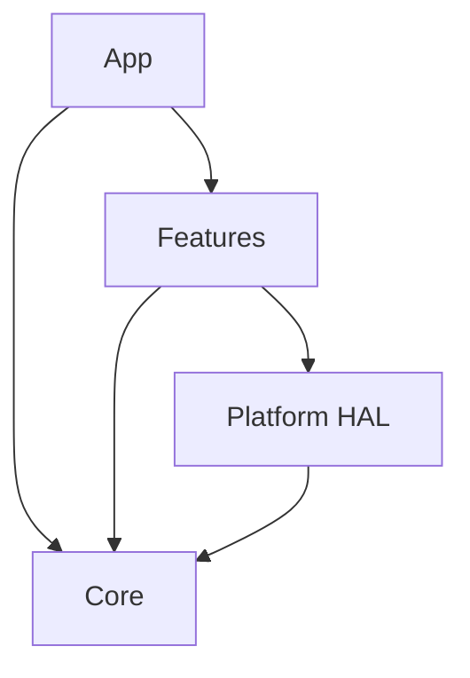
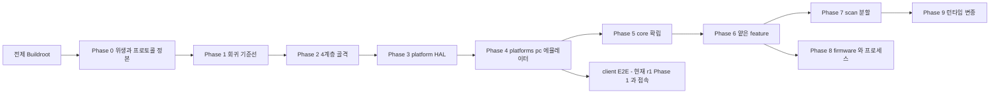

# belle-fw feature-first clean architecture — r2 Plan

> **범위**: `device/legacy/belle-fw` 단일 저장소. 클라우드는 이 갈래에서 다루지 않는다.
> **앱 축 갱신(2026-07-30)**: 이 문서가 인용하는 "r1"은 **현재 client 트랙**(`sonex-framework`, [../r1/plan.md](../r1/plan.md))이다. 작성 당시(`moana`가 client 트랙이던 시점)의 계획은 `moana` 폐기로 [legacy/r1](../legacy/r1/plan.md)에 격리돼 있다 — 상세 = [../README.md](../README.md) 전제①. belle-fw 자체 구조 작업(§1~§4)은 앱 선택과 무관해 **그대로 유효**하지만, §2.4·성공판정 11번의 앱-공유 feature 이름 주장은 재확인 전이라 표시해 뒀다.
> **목표 구조의 정본**: **cctv-platform `device/ipc-app`** — 같은 임베디드 리눅스 장비 펌웨어에서 이미 끝난 구조다. 설계안이 아니라 **재현**이다.
> **원칙**: [legacy/principles.md](../legacy/principles.md) — 특히 §2(빌드 재현 선행) · §3(동작 보존) · §5(축을 하나씩) · §8(사내 선례 우선).
> **현행 구조 SOT**: [../../review/device-firmware.md](../../review/device-firmware.md) · [../../review/belle-gaps.md](../../review/belle-gaps.md) · [../../review/belle-hardware.md](../../review/belle-hardware.md).

**실측 기준**: belle-fw `origin/production-fw-ver2.0` @ HEAD(2026-07-01) · ipc-app `master`(2026-07-28).
**`master` 는 2021-09 에 멈춰 있으므로 보지 않는다.** LOC 는 `.c/.cpp/.h/.hpp/.cc` 의 개행 수다.

---

## 0. 전제 — Buildroot 가 이미 있다

**이 계획은 빌드 재현이 끝난 상태에서 시작한다.** [legacy/assessment.md §3](../legacy/assessment.md) 의 `BR2_EXTERNAL` 도입이 선행 조건이고, 구체적으로 아래가 해결돼 있다고 본다.

| 현행 문제 | 전제하는 해결 상태 |
|---|---|
| 빌드가 PetaLinux · ad-hoc 셸 · 저장소 밖 Vivado/커널모듈 **3갈래**([device-firmware.md §2](../../review/device-firmware.md)) | 단일 Buildroot 트리 |
| `/home/jacob/jacob-work-2020/...` 절대경로가 BSP·스크립트를 잇는다 | `BR2_EXTERNAL` package 로 대체 |
| 커널 모듈 3종(`plif`·`zynqdma`·`msp430_drv`)에 **Makefile 이 없다** — `modules/plif/readme.makefile` 템플릿 1개뿐 | Buildroot `kernel-module` package |
| 메인 바이너리 `sonon` 이 rootfs 에 없고 UBI 오버레이로 복사된다 | 정규 install |
| 루트 `CMakeLists.txt` 에 변종 플래그 6개 하드코딩 | Buildroot config 로 노출 |
| CMake 그래프에 `modules/` 가 없다 | 포함 |

**전제가 성립하지 않으면 r2 는 시작할 수 없다.** 바꾼 결과가 기존과 같은지 확인할 방법이 없기 때문이다([legacy/principles.md §2](../legacy/principles.md)).

> 다만 **FSBL·PMU 소스와 `.xsa` Vivado 프로젝트 부재는 r2 의 전제가 아니다** — 그것은 하드웨어 변경 시 필요하고, `psu_init_gpl.c` 가 소스로 있어 U-Boot SPL 이 이미 빌드된다([legacy/README.md](../legacy/README.md)).

---

## 1. 현 상태 — 실측

### 1.1 규모 — 절반 이상이 자체 코드가 아니다

**251파일 193,087 LOC** 인데, 그중 **104,167 LOC(54%)가 서드파티·생성물·데이터**다.

| 디렉토리 | 파일 | LOC | 비고 |
|---|---:|---:|---|
| `tools` | 52 | **80,545** | `psu_init.h` 32,749(Xilinx 생성) · `strtk.hpp` 24,293(**서드파티**) · `read_ddrc.c` 9,937 |
| `system_header` | 1 | **24,293** | **`strtk.hpp` 두 번째 사본** |
| `modules` | 46 | 22,753 | 커널 드라이버 + Flask 웹서버 + python |
| `sonon` | 46 | **21,837** | **스캔 엔진 본체** |
| `lib` | 61 | **21,235** | FPGA·AFE 레지스터(static lib `fpga`) |
| `image_proc` | 13 | 11,617 | 자체 2,355 + **LUT 헤더 9,262(데이터)** |
| `ne10_lib` | 8 | 3,633 | ARM NEON — **서드파티, 헤더만** |
| `bcd` | 13 | 3,324 | 설정 브로커 |
| `deviced` | 3 | 2,991 | I2C 온도·배터리 |
| `gpio` | 7 | 456 | |
| `watchdogd` | 1 | 403 | |

**자체 코드는 약 88,920 LOC** 다.

> **`strtk.hpp` 24,293 LOC 가 두 벌**이다(`tools/` · `system_header/`). [legacy/principles.md §7](../legacy/principles.md)(정본은 하나) 위반이 서드파티에서도 일어났다.

### 1.2 `sonon/` — 기술 역할로 잘려 있어 기능이 흩어진다

| 파일 | LOC | 내용 |
|---|---:|---|
| `sonon_receive_fpga.cpp` | **4,048** | **모든 모드의 FPGA 명령**. 함수 81개 |
| `sonon.cpp` | **3,522** | main + `pthread_create` **13곳** + 소켓 + 상태 |
| `sonon_receive.h` | 2,227 | 프로토콜 선언 + opcode 82개 |
| `sonon_receive_device.cpp` | 1,711 | 모든 모드의 장치 명령 |
| `sonon_pw_filter.cpp` | 1,605 | PW 필터 |
| `sonon_scanconversion.cpp` | 1,278 | 스캔 컨버전 |
| `sonon_transmit.cpp` | 1,104 | 모든 모드의 송신 |
| `sonon_pw_m_proc.cpp` | 977 | PW·M 처리 |
| `sonon_receive.cpp` | 950 | |
| `sonon_mode_change_proc.cpp` | **879** | **모드 전환 상태머신** |
| `aging.cpp` | 712 | 내구시험(별도 `main`) |
| 그 외 | | `sonon_b_sa` · `sonon_b_conventional` · `sonon_pipe` · `sonon_button` · `sonon_receive_verify` |

**PW 모드를 바꾸려면 6개 파일을 연다.** 반대로 `sonon_receive_fpga.cpp` 하나를 열면 B·CF·PW·M 이 다 들어 있다.

### 1.3 모드가 열거형이 아니라 **이벤트 상태머신**이다

이것이 moana([legacy/r1 Phase 8](../legacy/r1/phase8-feature-scan-split.md) — moana 재구성안, 폐기됨)와 결정적으로 다른 점이다. moana 는 `SONON_SCAN_MODE { B_MODE, CF_MODE, PW_MODE, M_MODE }` 열거형을 178곳에서 `switch` 한다. **belle-fw 에는 그 열거형이 없다.**

| 기전 | 위치 |
|---|---|
| **이벤트 플래그** | `lib/fpga_define.h:363` `EVENT_DATA_SCAN_MODE_CHANGE` / `:364` `_ACK` — `lib/event.cpp` 가 set/wait/clear |
| **전환 상태머신** | `sonon/sonon_mode_change_proc.cpp` **879 LOC** |
| **모드별 패킷 타입** | `HER_PACKET_TYPE_{B_ONLY_SCAN_DATA 0x0100, B_C_SCANLINE_DATA 0x0101, B_C_FRAME_DATA 0x0102, PW_FRAME_DATA 0x0104, M_FRAME_DATA 0x0106}` |

**즉 "모드" 가 데이터가 아니라 제어 흐름에 녹아 있다.** `grep 'PW_MODE'` 같은 기계적 분류가 통하지 않고, **이벤트 흐름을 읽어 모드 경계를 복원하는 작업이 Phase 7 의 실제 내용**이다.

### 1.4 프로세스 4종 · IPC 3종

| 실행물 | 역할 | IPC |
|---|---|---|
| `sonon` | 실시간 스캔 엔진 | **TCP 2채널**(1234 ctrl / 1235 data), 커스텀 바이너리 |
| `bcd` | Board Config Daemon | **SysV 메시지 큐** |
| `deviced` | I2C 온도·배터리 폴링 | SysV 메시지 큐 |
| `watchdogd` | 생존 감시 + HW 워치독 | **Unix 도메인 소켓** |

**IPC 방식이 셋 다 다르다.** ipc-app 은 `core/messaging` 하나로 통일돼 있다.

### 1.5 HAL 이 규약이 아니라 선택지다

`lib/` 가 중앙 HAL 로 존재하지만 우회가 많다 — `deviced` 가 `/dev/i2c-*` 직접 open, `tools/spidev.cpp` 가 독자 `/dev/mem` mmap, `tools/max17205.cpp` 가 퓨얼게이지 재구현. **`tools/` 아래 23개 파일이 독자적으로 `ioctl()`/`open("/dev...")` 를 호출한다**([device-firmware.md §6.4](../../review/device-firmware.md)).

### 1.6 그런데 **포트가 이미 있다**

```c
// lib/fpga_define.h:24-25
#define DEVICE_EBI      (1)    // 실장비 (FPGA / EBI 버스)
#define DEVICE_DUMMY    (2)    // PC 경로

// lib/fpga.cpp:21 — 함수 포인터 vtable 로 분기
RET fpga_init(Handle *handle, int device_type, int subtype)
```

| 분기 | 세우는 함수 | 구현 규모 |
|---|---|---:|
| `DEVICE_EBI` | 13개 — `init` `open` `close` `prepare_scan` `read_frame` `read_reg` `write_reg` **`read_reg_32`** **`write_reg_32`** **`mmap`** … | `fpga_ebi.cpp` 3,126 + `fpga_ebi_control.cpp` 4,225 |
| `DEVICE_DUMMY` | 10개 — **굵은 3개가 빠진다** | `fpga_dummy.cpp` **117** |

**이것이 ipc-app `platforms/hal/i_*.h` 의 원시 형태다.** 새 인터페이스를 설계하는 것이 아니라 **있는 vtable 을 승격**하는 일이다.

막는 것은 하나뿐이다 — `sonon/sonon.cpp:3428` 이 `fpga_init(g_handle, DEVICE_EBI, DEVICE_SUB_PRESET1)` 로 **상수를 넘겨 DUMMY 를 고를 수 없다.**

### 1.7 변종이 컴파일 타임이다

루트 `CMakeLists.txt` 에 하드코딩:

| 매크로 | 파일 | 출현 | 의미 |
|---|---:|---:|---|
| `_USING_500L_DEV_` | **12** | **57** | 500L 프로브 |
| `_USING_SA_DEV_` | 7 | 11 | 합성개구 수신 |
| `_ES3_DEV_` | 2 | 7 | ES3 보드 리비전 |
| `_CF_SAMPLE_40M_` | 5 | 7 | CF 40MHz 샘플링 |
| `_USING_B_CONVEN_DEV_` | 1 | 2 | **비활성** — `b_conventional.cpp` 컴파일 제외 |
| `_LINEAR_ARRAY` · `_MSPLIB_` | **0** | **0** | **정의만 있고 아무도 안 본다** |

`configs/300l/` 이 트리에 남아 있으나 현재 플래그 조합으로는 **도달 불가능한 죽은 데이터**다.

> **이전 세대는 런타임이었다** — `ginny-fw` 는 u-boot 환경변수로 5개 모델을 고르는 단일 유니버설 이미지였고 시리얼로 보드 리비전까지 판별했다([legacy/principles.md §8](../legacy/principles.md)). **되살리는 것이다.**

### 1.8 회귀 판정 수단이 **있다** — 다만 손으로 돌린다

`lib/test/`, 커밋 2026-06-17, **출하 브랜치 위**다.

| 파일 | 내용 |
|---|---|
| `cf_ff_compare.c`(218 LOC) | **실제 펌웨어 `lib/cf-doppler.c` 를 호스트에서 컴파일**해 `cf_process()` 를 IQ 덤프에 구동 |
| `build.sh` | `__NEON_ASSEM__` 미정의(순수 C 폴백)로 링크 |
| `README.md` | *"골든 모델 재구현이 아니라 펌웨어 코드 자체를 검증한다(목업 없음)"* |

정량 합격 기준이 문서에 있다 — `recall=1.0` · `scatter=0` · **골든 검출마스크 일치 ≥0.95**.

**즉 belle 축을 "판정 수단이 없는 곳" 으로 인용하면 사실과 다르다.** 없는 것은 **CI**(31개 저장소 전부 0건)이고, 이 하니스의 드라이버·골든 데이터가 **범위 제외한 `NextDoppler` 저장소에 있다**는 것이 실제 공백이다.

---

## 2. 목표 구조 — ipc-app 정본

### 2.1 4계층 (ipc-app ADR-001)



| 계층 | 정의 | 의존 |
|---|---|---|
| **App** | 진입점. 모든 모듈 조립 + 외부 프로토콜 노출 | 전부 |
| **Features** | 도메인별 독립 기능 | Core · HAL |
| **Core** | 로깅·설정·이벤트·엔티티·메시징 | **없음** |
| **Platform HAL** | 하드웨어 추상화 | Core |

**역방향 의존 전면 금지.**

### 2.2 폴더 구조 (ipc-app ADR-002 · ADR-004)

```
belle-fw/
  apps/                        ← 실행 바이너리 (현 프로세스 4종 유지)
    sonon/main.cpp  bcd/main.cpp  deviced/main.cpp  watchdogd/main.cpp
  src/
    app/
      bootstrap/                 초기화 순서
      composition/               CompositionRoot — DI 조립 (ADR-003)
      protocol/                  HC 프로토콜 서버 (TCP 1234/1235)
      runtime/                   스레드·수명주기
    core/                      ← 인프라. 의존 없음
      entities/                  프로브 스펙 · 스캔 파라미터 · 프레임 타입
      protocol/                  HC 정본 (proof/protocol-sot 산출물)
      config/  event/  logging/  messaging/  time/  util/
    features/<name>/           ← ADR-002 3계층
      ports/                     i_*.h — 인터페이스만
      domain/                    순수 비즈니스 로직. **#ifdef 금지**(ADR-011)
      data/                      구현 · 어댑터
    platforms/
      hal/                       i_*.h — HAL 인터페이스 (ADR-004)
      common/                    플랫폼 공통
      zynqmp/                    실장비 — 현 lib/fpga_ebi 계열
      pc/                      ★ 개발 PC — 현 lib/fpga_dummy 승격 = 에뮬레이터
  third_party/                 ← strtk · NE10 · Xilinx 생성물
```

**ipc-app 실측이 이 배치의 근거다**(`src/` 706파일 82,394 LOC):

| 계층 | 파일 | LOC | belle-fw 대응 후보 |
|---|---:|---:|---|
| `apps/` | 3 | 738 | 현 4종 `main()` |
| `app/` | 44 | 13,163 | `sonon.cpp` 의 소켓·스레드·조립 |
| `core/` | 71 | 6,064 | `lib/event`·`common` · `bcd` 일부 |
| `features/` | **389** | **43,452** (**27개**) | `sonon/` + `image_proc/` + `deviced/` |
| `platforms/` | 184 | 18,324 | `lib/` 전체 |
| `oem/` | 15 | 653 | (해당 없음) |

**`platforms/ubuntu24` 가 6,665 LOC 로 실장비 어댑터보다 크다** — 하드웨어가 하던 일을 소프트웨어가 대신하기 때문이다. belle 의 `fpga_dummy.cpp` **117 LOC** 는 골격일 뿐이다.

### 2.3 HAL 인터페이스 (ADR-004)

ipc-app `platforms/hal/` 에 `i_*.h` **21개**가 있다(`i_video_encoder` · `i_gpio_manager` · `i_rtc_manager` · `i_ptz_controller` · `i_system_power_port` …).

belle-fw 대응:

| HAL 인터페이스 | 현행 | 규모 |
|---|---|---:|
| `i_fpga_port.h` | `lib/fpga.cpp` vtable **승격** | 13함수 |
| `i_afe_port.h` | `lib/afe.cpp` | 603 |
| `i_pulser_port.h` | `lib/pulser.cpp` | 512 |
| `i_clock_port.h` | `lib/clock.cpp` | — |
| `i_buffer_port.h` | `lib/bufdev.cpp` | 510 |
| `i_i2c_port.h` | `deviced` 직접 open · `tools/` 우회 23파일 | — |
| `i_gpio_port.h` | `gpio/` | 456 |
| `i_msp430_port.h` | `modules/msp430_drv` | — |
| `i_config_store_port.h` | `bcd` | 3,324 |

### 2.4 feature 목록

[legacy/architecture.md §5](../legacy/architecture.md) 의 **device·client 공통 어휘**를 kebab-case 로 적용한다. `scan-b`·`doppler-cf`·`doppler-pw`·`mmode`·`firmware-update` 는 **[legacy/r1](../legacy/r1/plan.md) 의 moana 와 같은 이름으로 잡았던 것**이다.

> **미확인(2026-07-30)**: `moana` 폐기로 client 트랙이 `sonex-framework` 로 바뀌었고, 그 실행계획([r1(현재)](../r1/plan.md))은 SDK/ADK 모듈 단위(`DeviceManager`·`ImageRenderer` 등)라 이 scan-mode 이름 체계를 정의하지 않는다. `sonex-framework`·`sonex-app` 에 동등 명칭이 실재하는지 **재확인 전**이다 — 확인 전까지 아래 성공판정 11번은 보류로 둔다. belle-fw 자체 feature 분해(Phase 7)는 이름 확정과 무관하게 진행 가능하다.

| feature | 현행 위치 | 처리 phase |
|---|---|---|
| `probe` | `_USING_500L_DEV_` 분기 + `configs/{300l,500l}` | [6](./phase6-feature-config-power-diagnostics.md) |
| `device-config` | `bcd/`(3,324) | [6](./phase6-feature-config-power-diagnostics.md) |
| `power-battery` | `deviced/`(2,991) + `modules/msp430_drv` + `tools/max17205.cpp` | [6](./phase6-feature-config-power-diagnostics.md) |
| `diagnostics` | `sonon/aging.cpp`(712) + `tools/` 덤프류 | [6](./phase6-feature-config-power-diagnostics.md) |
| `info` · `network` | `DEVICE_READ_*` opcode 20개 중 해당분 | [6](./phase6-feature-config-power-diagnostics.md) |
| **`scan-b`** | `sonon_b_sa`·`sonon_b_conventional` + `image_proc/b_*` | [7](./phase7-feature-scan-split.md) |
| **`doppler-cf`** | `lib/cf-doppler.c`(1,585) + `lib/fpga_doppler.cpp`(879) | [7](./phase7-feature-scan-split.md) |
| **`doppler-pw`** | `sonon_pw_filter`(1,605) + `sonon_pw_m_proc`(977) + `lib/fpga_pw.cpp`(1,672) | [7](./phase7-feature-scan-split.md) |
| **`mmode`** | `sonon_pw_m_proc` 의 M 부분 | [7](./phase7-feature-scan-split.md) |
| `scan-session` | `sonon_mode_change_proc.cpp`(879) — 모드 전환 상태머신 | [7](./phase7-feature-scan-split.md) |
| `firmware-update` | `upgrade.sh` + A/B 뱅크 | [8](./phase8-feature-firmware-process.md) |

---

## 3. Phase 구성

| Phase | 내용 | 범위 | 상태 |
|---|---|---|---|
| **[Phase 0](./phase0-hygiene-protocol-sot.md)** | 저장소 위생 · 서드파티 분리 · **HC 프로토콜 정본 도입** | 빌드/코드 | 미시작 |
| **[Phase 1](./phase1-regression-baseline.md)** | 회귀 판정 기준선 — `lib/test/` 하니스 승격 + IQ·패킷 골든 + CI | 테스트 | 미시작 |
| **[Phase 2](./phase2-layer-skeleton.md)** | `src/` 4계층 골격 + 경계 강제(`make check-layers`) | 빌드/코드 | 미시작 |
| **[Phase 3](./phase3-platform-hal.md)** | `platforms/hal` — vtable → 인터페이스 승격, `zynqmp` 분리 | 코드 | 미시작 |
| **[Phase 4](./phase4-platform-pc-emulator.md)** | **`platforms/pc` — 에뮬레이터가 선다** ★ | 코드 | 미시작 |
| **[Phase 5](./phase5-core-layer.md)** | `core/` 확립 — `lib/event`·`common` · IPC 3종 통일 | 코드 | 미시작 |
| **[Phase 6](./phase6-feature-config-power-diagnostics.md)** | feature 골격 + `device-config`·`power-battery`·`diagnostics`·`probe`·`info`·`network` | 코드 | 미시작 |
| **[Phase 7](./phase7-feature-scan-split.md)** | **`scan-b`·`doppler-cf`·`doppler-pw`·`mmode`·`scan-session`** ★ 최대 | 코드 | 미시작 |
| **[Phase 8](./phase8-feature-firmware-process.md)** | `firmware-update` · 프로세스 4종 경계 정리 | 코드 | 미시작 |
| **[Phase 9](./phase9-runtime-variant.md)** | 컴파일 타임 변종 → 런타임 설정. **단일 유니버설 이미지** | 코드/빌드 | 미시작 |

### Phase 의존



**핵심 순서는 [legacy/emulator-e2e.md §8](../legacy/emulator-e2e.md) 을 따른다** — `빌드 재현 → platforms 분리 → 에뮬레이터 → E2E → CI → feature 분리`.

- **Phase 4 가 분기점이다.** 여기서 에뮬레이터가 서면 그 뒤 작업(5~9)은 **개발 PC 에서 판정**된다. 그 전(0~3)은 **현행 출하본을 oracle 로 하는 패리티 대조**로 한다
- **Phase 7 이 가장 위험**하므로 에뮬레이터·CI 가 선 뒤에 온다
- Phase 4 산출물이 **[현재 r1 Phase 1](../r1/phase1-regression-baseline.md) 의 장비 축과 만난다** — 같은 HC 프로토콜 계약의 양쪽이다. client 트랙이 `sonex-framework` 로 바뀐 뒤에도 이 대칭은 유지된다 — 그쪽 문서가 이미 이 문서를 "장비 축의 짝 문서"로 인용한다([r1 phase1 §1.1·§8](../r1/phase1-regression-baseline.md))

---

## 4. Phase 요약

### Phase 0 — 저장소 위생 · 프로토콜 정본

**구조를 바꾸기 전에 옮길 대상을 줄인다.** 193,087 LOC 중 104,167(54%)이 서드파티·생성물이다.

- **0-A** `third_party/` 신설 — `strtk.hpp`(**2벌 → 1벌**, 24,293 절감) · `ne10_lib` · `psu_init.h` · `read_ddrc.c`
- **0-B** `image_proc/lut_header/`(9,262) 를 **데이터**로 분리
- **0-C** 죽은 것 제거 — `configs/300l`(도달 불가) · `_LINEAR_ARRAY`·`_MSPLIB_`(0회 사용) · `hcproc.img`(2021년 빌드 산출물 9.5MB)
- **0-D** **HC 프로토콜 정본 도입** — `sonon/sonon_receive.h`(2,227, opcode 82개)의 자체 선언을 [legacy/proof/protocol-sot](../legacy/proof/protocol-sot/) 로 교체. **산출물은 이미 완성돼 있다**
- **0-E** CRC 부재 기록 — `verify_packet_header_and_crc` 가 이름과 달리 검사하지 않는다. **고치지 않는다**(프로토콜 변경이므로 앱과 동시)

### Phase 1 — 회귀 판정 기준선

**있는 것을 잇는다**(§1.8). `lib/test/cf_ff_compare.c` 가 이미 "펌웨어 코드 자체를 호스트에서 검증" 한다.

- **1-A** `lib/test/` 하니스를 **CI 에 올린다** — 드라이버·골든이 `NextDoppler` 에 있으므로 **범위 재판정이 선행**
- **1-B** 같은 방식을 B·PW·M 으로 확장 — 각 모드의 처리 함수를 호스트 컴파일
- **1-C** **HC 프로토콜 패킷 골든** — 장비가 내보내는 바이트. [legacy/proof/protocol-sot](../legacy/proof/protocol-sot/) 정본과 대조
- **1-D** `make test-golden` + CI 1건 — **belle-fw 최초의 CI**

> **한계**: 이 시점의 검증은 **함수 단위 호스트 실행**이다. 전 경로 실행은 Phase 4 뒤에 온다.

### Phase 2 — 4계층 골격 + 경계 강제

**이 phase 가 없으면 이후 전부가 무효다.** 지금 `tools/` 23파일이 HAL 을 우회하고, 그것을 막는 장치가 없다.

- **2-A** `src/{app,core,features,platforms}` + `apps/` + `third_party/` 골격
- **2-B** CMake 를 계층별로 분할. **`modules/` 를 CMake 그래프에 넣는다**(현재 밖에 있다)
- **2-C** include 를 경로 규정형으로 — `#include "core/event/event.h"`
- **2-D** **`make check-layers`** — ADR-001 의존 규칙을 grep 으로 판정. CI 에 부착

### Phase 3 — `platforms/hal` — vtable 승격

**새 설계가 아니라 있는 vtable 의 승격이다**(§1.6).

- **3-A** `platforms/hal/i_fpga_port.h` — `lib/fpga.cpp` 의 13함수를 인터페이스로
- **3-B** `platforms/zynqmp/` — `fpga_ebi` 계열(7,351 LOC) 이동
- **3-C** 나머지 HAL 인터페이스 8개(§2.3)
- **3-D** **`tools/` 우회 23파일 정리** — `/dev/mem`·`/dev/i2c` 직접 접근을 HAL 경유로. `deviced` 포함
- **3-E** **런타임 선택 경로** — `sonon.cpp:3428` 의 `DEVICE_EBI` 상수를 설정/환경변수로

### Phase 4 — `platforms/pc` — 에뮬레이터 ★

**[legacy/emulator-e2e.md](../legacy/emulator-e2e.md) 의 그 물건이 여기서 나온다.** 별도 시뮬레이터를 만들지 않는 이유가 그 문서에 있다.

- **4-A** `platforms/pc/` — 현 `fpga_dummy`(117 LOC) 를 옮기고 **빠진 3함수**(`read_reg_32`·`write_reg_32`·`mmap`) 구현
- **4-B** **녹화 재생** — `dummy_read_frame` 이 지금 `*(buf+i) = i & 0xff` 램프 패턴을 낸다. 이것을 녹화 파일 입력으로
- **4-C** 나머지 HAL 의 PC 구현 — I2C·GPIO·MSP430·클럭
- **4-D** **PC 빌드 타깃** — `-DBELLE_BUILD_PC=ON`(ipc-app 의 `-DIPC_BUILD_UBUNTU24=ON` 대응)
- **4-E** `127.0.0.1:1234/1235` 로 앱 접속 확인 — **[현재 r1 Phase 1](../r1/phase1-regression-baseline.md) 과 접속**(`sonex-framework` `HCSocketCommunicator`)

> **비용을 낮게 잡지 않는다.** ipc-app `platforms/ubuntu24` 가 **6,665 LOC** 다. belle 은 여기에 FPGA 레지스터·프로브·빔포밍이 얹힌다. **117 LOC 는 골격일 뿐이다.**

### Phase 5 — `core/` 확립

- **5-A** `lib/event.cpp`(814) → `core/event` — 모드 전환 이벤트의 근거지
- **5-B** `lib/common.cpp`(633) → `core/util` · `core/logging`
- **5-C** `core/entities` — 프로브 스펙 · 스캔 파라미터 · 프레임 타입. **Phase 9 의 그릇**
- **5-D** **IPC 3종 통일** — SysV 큐 · Unix 소켓 · TCP 를 `core/messaging` 하나로. ipc-app 대응
- **5-E** `core/config` — `bcd` 의 저장 계층

### Phase 6 — feature 골격 + 얕은 것부터

**가장 작은 것으로 패턴을 세운다**(ADR-002 3계층).

- **6-A** `features/<name>/{ports,domain,data}` 규약 + `domain` 유닛테스트 골격
- **6-B** `device-config`(`bcd` 3,324) · **6-C** `power-battery`(`deviced` 2,991 + MSP430 + 퓨얼게이지) · **6-D** `diagnostics`(`aging.cpp` 712 + `tools/` 덤프) · **6-E** `probe` · **6-F** `info`·`network`(opcode 20개 중 해당분)
- **6-G** **`domain` 에 `#ifdef` 0건**(ADR-011) — 검증 항목

### Phase 7 — scan 분할 ★

**가장 크고 가장 어렵다.** moana 와 달리 **모드가 열거형이 아니라 이벤트 상태머신**이다(§1.3).

- **7-A** **모드 경계 복원** — `sonon_mode_change_proc.cpp`(879) + `EVENT_DATA_SCAN_MODE_CHANGE` 흐름을 읽어 상태 전이도를 만든다. **이 phase 의 절반이다**
- **7-B** `features/scan-session` — 상태머신을 `domain` 으로. 모드 전환 규칙
- **7-C** `sonon_receive_fpga.cpp`(4,048 / 함수 81개) 를 opcode 별로 분해 → 각 feature `data/`
- **7-D~G** `scan-b` · `doppler-cf` · `doppler-pw` · `mmode`
- **7-H** `sonon_transmit.cpp`(1,104) 를 각 feature 송신부로 분배
- **7-I** `sonon.cpp`(3,522) 잔여 해체 — 소켓·스레드는 `app/`, 상태는 `features/scan-session`

> **신호처리 알고리즘은 옮기되 다시 쓰지 않는다** — `cf-doppler.c` NEON, 빔포밍 시퀀싱, `image_proc/b_sa.cpp` 는 제품 가치 그 자체다([legacy/principles.md §11](../legacy/principles.md)).

### Phase 8 — `firmware-update` · 프로세스 경계

- **8-A** `features/firmware-update` — **A/B 이중 뱅크를 살린다**([legacy/principles.md §6](../legacy/principles.md)). `upgrade.sh` 가 `fw_printenv kernel_imagepart` 로 현재 뱅크를 읽어 반대편에 쓴다
- **8-B** 프로세스 4종의 `main()` 을 `apps/` 로. **프로세스 경계는 유지한다** — 지금 동작하므로 배치만 바꾼다
- **8-C** `app/composition` — CompositionRoot(ADR-003)
- **8-D** `modules/webserver/belle_flask` 판단 — 로컬 진단 서버다. 유지/제거는 힐세리온 결정

### Phase 9 — 런타임 변종 → 단일 유니버설 이미지

[legacy/principles.md §8·§9](../legacy/principles.md). **`ginny-fw` 가 이미 그렇게 했다.**

- **9-A** `_USING_500L_DEV_`(12파일 57곳) → `core/entities` 프로브 스펙 데이터
- **9-B** `_ES3_DEV_`(2/7) → **시리얼 번호로 보드 리비전 판별**(ginny-fw 방식 복원)
- **9-C** `_USING_SA_DEV_`(7/11) · `_CF_SAMPLE_40M_`(5/7) → 모델 스펙 속성
- **9-D** `configs/{300l,500l}` 을 **런타임 로드**로
- **9-E** `_USING_B_CONVEN_DEV_` — 비활성 코드. **되살릴지 지울지 힐세리온 판단**

---

## 5. 성공 판정

| # | 항목 | 기준 | 현재 |
|---|---|---|---|
| 1 | **개발 PC 실행** | 실장비 0대로 `sonon` 이 뜨고 앱이 `127.0.0.1:1234` 로 붙는다 | `DEVICE_EBI` 상수 하드코딩 |
| 2 | 계층 방향 | `core → features/platforms` · `features/platforms → app` include **각 0건** | 측정 불가(경계 없음) |
| 3 | **domain 순수성** | `features/*/domain/` 에 `#ifdef`·HAL·외부 라이브러리 include **0건**(ADR-011) | — |
| 4 | HAL 우회 | `features/`·`app/` 에서 `open("/dev/...")`·`ioctl` 직접 호출 **0건** | `tools/` 23파일 |
| 5 | feature 응집 | PW 파라미터 추가가 `features/doppler-pw/` 안에서 끝난다 | 6개 파일 |
| 6 | 파일 크기 | 자체 코드 **1,000 LOC 초과 0개** | `sonon_receive_fpga.cpp` 4,048 외 |
| 7 | 벤더 분리 | `src/` 에 서드파티 소스 **0 LOC** | strtk 2벌 48,586 외 |
| 8 | 정본 단일화 | HC 프로토콜 선언 **1벌** | 자체 선언(`sonon_receive.h`) |
| 9 | 자동 판정 | `make test-golden` + `domain` 유닛테스트가 CI 에서 돈다 | **CI 0건**, 하니스는 수동 |
| 10 | 변종 | 모델 추가 = **데이터 1건**, 릴리스 아티팩트 **1개** | `_USING_500L_DEV_` 12파일 57곳 |
| 11 | **feature 이름 정합 — 보류(§2.4)** | `scan-b`·`doppler-cf`·`doppler-pw`·`mmode`·`firmware-update` 가 현재 client 트랙(`sonex-framework`)과 동일. **moana 기준 이름을 재확인 없이 쓰지 않는다** | 미확인 |
| 12 | 새 플랫폼 | 새 SoC 추가가 `platforms/<new>/` 추가만으로 끝난다(ADR-004) | — |

---

## 6. 위험 · 대응

| 위험 | 영향 | 대응 |
|---|---|---|
| **Buildroot 전제가 실제로 안 섰다** | r2 전체가 성립하지 않는다 | **착수 전 §0 표를 항목별로 확인.** 특히 커널 모듈 3종 빌드 경로. 미달이면 [legacy/assessment.md](../legacy/assessment.md) 로 돌아간다 |
| **모드가 이벤트 상태머신이라 기계적 분류가 안 된다** | Phase 7-A 가 예상보다 크다 | **7-A 를 독립 산출물로 낸다** — 상태 전이도 문서 자체가 가치다. 코드 이동은 그 뒤 |
| **`lib/test/` 골든이 범위 제외 저장소에 있다** | Phase 1 이 막힌다 | **`NextDoppler` 범위 재판정이 Phase 1 선행 조건.** 루트 `CLAUDE.md` 의 제외 판단이 in-scope 펌웨어의 검증 의존물을 잘랐다 |
| **`platforms/pc` 비용을 낮게 잡는다** | Phase 4 지연 | ipc-app `ubuntu24` **6,665 LOC** 를 기준선으로. 117 LOC 로 끝나지 않는다 |
| **2018년 녹화가 belle 프레임 포맷과 호환이 아니다** | Phase 4-B 가 막힌다 | [legacy/emulator-e2e.md §10](../legacy/emulator-e2e.md) 미확인 항목. **비호환이면 실장비 1회 재수집** |
| **`dummy_read_frame` 이 흘려야 할 데이터 층위 미확정** | PC 어댑터 범위가 달라진다 | RF 라인인가 스캔변환 후 영상인가. **Phase 3 에서 `i_fpga_port` 설계와 함께 확정** |
| **신호처리를 "정리" 하고 싶어진다** | 영상 품질 회귀 | [legacy/principles.md §11](../legacy/principles.md) — 위치만. diff 에서 알고리즘 본문 변경 0줄 확인 |
| **IPC 3종 통일이 프로세스 동작을 바꾼다** | 부팅·감시 회귀 | Phase 5-D 를 **프로세스 하나씩**. `watchdogd` 는 마지막 — 그것이 나머지를 감시한다 |
| **밑단(커널·BSP)이 5년째 동결** | 우리가 건드리면 되돌릴 사람이 없다 | **r2 는 앱 계층만 다룬다.** 커널·U-Boot·FSBL 은 범위 밖 |
| `production-fw-ver2.0` 병행 개발 | 충돌 | 최근 커밋이 전부 **T1968 컬러 도플러**다 — Phase 7-E(`doppler-cf`)와 정면 충돌한다. **순서 협의 필수** |

---

## 7. 이 문서가 다루지 않는 것

| 항목 | 판단 |
|---|---|
| **Buildroot 도입 자체** | **전제**(§0). [legacy/assessment.md §3](../legacy/assessment.md) |
| 커널 · U-Boot · FSBL · PMU · BSP | 범위 밖. 5년째 동결이고 밑단 현대화는 별도 결심 |
| `.xsa` Vivado 프로젝트 복구 | 하드웨어 변경 시 필요. 빌드 재현의 전제가 아니다 |
| `belle-msp`(MSP430 펌웨어) | 별도 저장소. `power-battery` feature 는 **호스트 측**만 다룬다 |
| `moana`·`sonex-app`·`sonex-framework` | 현재 client 트랙 = [r1](../r1/plan.md)(`sonex-framework`). `moana` 재구성안은 폐기돼 [legacy/r1](../legacy/r1/plan.md) 로 격리 |
| 앱↔장비 E2E 시나리오 | Phase 4 가 장비 측 절반을 만들고, 앱 측 절반은 [현재 r1 Phase 1](../r1/phase1-regression-baseline.md) |
| 300 시리즈 | 단종 라인. [legacy/principles.md §11](../legacy/principles.md) |
| 500C | **별도 라인**(Socionext 베어메탈, belle 과 코드 공유 0). **단종이 아니다** — 2026-07-29 정정, 근거 = [legacy/r1/phase10-runtime-variant.md §1.6](../legacy/r1/phase10-runtime-variant.md) |

---

## 8. cross-reference

- **ipc-app ADR-001**(4계층) · **ADR-002**(feature 내부 ports/domain/data) · **ADR-003**(composition root) · **ADR-004**(HAL 3단계) · **ADR-011**(domain `#ifdef` 금지) — `cctv/device/ipc-app/docs/adr/`
- [legacy/architecture.md §3·§5·§8](../legacy/architecture.md) — 목표 구조와 순서
- [legacy/emulator-e2e.md](../legacy/emulator-e2e.md) — Phase 4 의 SOT
- [legacy/assessment.md](../legacy/assessment.md) — Buildroot 전제
- [../r1/plan.md](../r1/plan.md) — **현재 client 트랙**(`sonex-framework`). feature 이름 공유는 재확인 전(§2.4)
- [../legacy/r1/plan.md](../legacy/r1/plan.md) — legacy. `moana` feature-first 재구성안(폐기) — scan-mode feature 이름 체계의 출처
- [../legacy/proof/protocol-sot/](../legacy/proof/protocol-sot/) — Phase 0-D 산출물
- [../../review/device-firmware.md](../../review/device-firmware.md) · [belle-gaps.md](../../review/belle-gaps.md) · [belle-hardware.md](../../review/belle-hardware.md)
