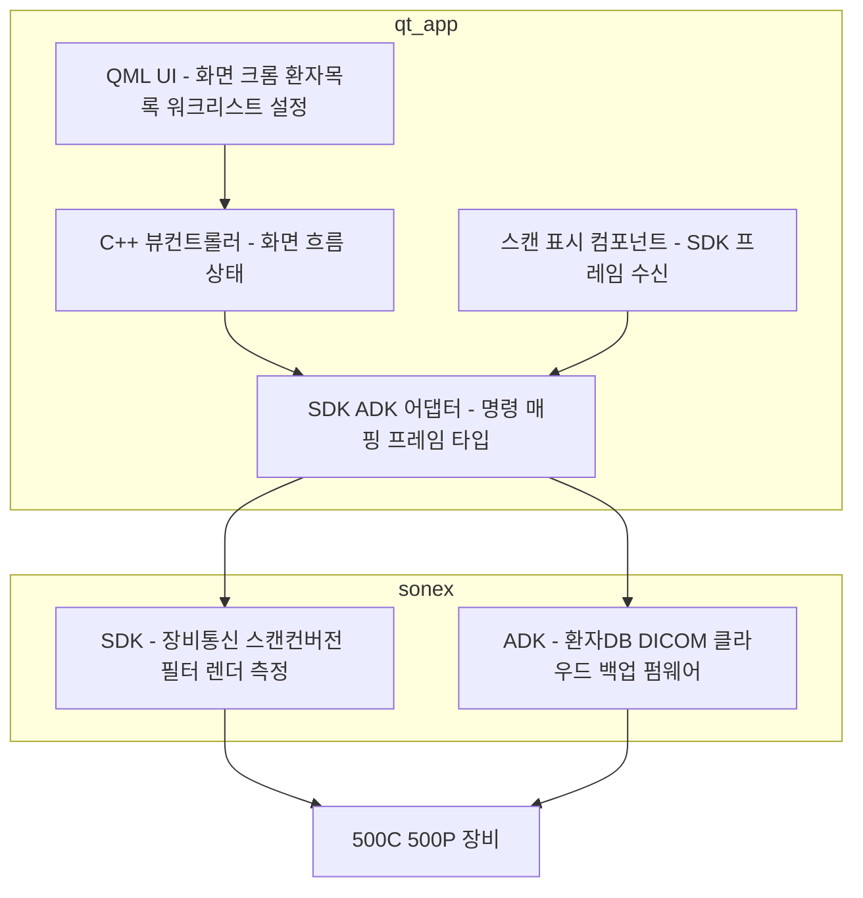
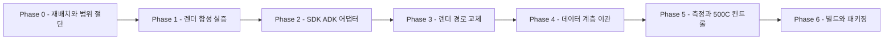

# `moana` UI → SoNex SDK/ADK 이관 (Qt6) — r2 Plan

> **범위**: `moana` 의 **UI 계층(`app/`)** 을 살리고 그 아래 자체 SDK 계층(`framework/`)을 걷어내, **`sonex-framework`(SDK+ADK)** 위에 얹는다. 산출물은 **500C·500P 를 구동하는 Qt6 호스트 앱**이다.
> **대상 제품**: **500C · 500P 뿐이다.** 500L(belle)·300 계열은 출시 범위 밖이며, 그것이 이 문서가 이전 `r2`(belle-fw feature-first)를 대체하는 이유다([../README.md](../README.md)).
> **목표**: `sonex-app`(Flutter) 완성 경로 대신 **이미 완성된 UI 자산을 SDK/ADK 위로 옮겨** 출시 가능한 앱을 만든다.
> **SDK/ADK 자체는 이 문서 범위 밖**이다 — [r1](../r1/plan.md) 이 담당한다. 이 문서는 **소비자 축**이다.
> **현행 구조 SOT**: [../../review/moana-app.md](../../review/moana-app.md) · [../../review/sonex-framework.md](../../review/sonex-framework.md).
> **실측 기준**: `moana` `origin/service_QT693`(HEAD 2026-07-27) · `sonex-framework` `origin/master` `e17280b2`(2026-07-30). **§1 의 수치는 2026-08-01 직접 측정분이다.**

> **이름에 대해**: `r2` 는 장비 트랙이 쓰던 슬롯이었다. `belle-fw` feature-first 재구성 계획은 **500L 출시 제외로 2026-08-01 삭제**됐고([../legacy/README.md](../legacy/README.md)), 이 문서가 그 자리를 쓴다.

> **IMPORTANT — 작업 주체**: **작업은 AI 에이전트가 한다. 사람의 개입은 검증이다.** 이 전제가 Phase 분해 방식을 정한다 — 코드 작성량이 아니라 **실장비 검증 회차**가 일정을 지배하므로, Phase 는 "사람이 한 번에 검증할 수 있는 단위"로 끊는다(§3).

> **IMPORTANT — 일정 제약**: **포팅과 검증을 합쳐 4주 안에 끝나야 한다**(주어진 제약). 이 문서는 관행대로 phase 별 시간을 추정하지 않는다. 대신 **일정을 지배하는 항목을 §5 에 따로 표시**한다 — 그것이 줄지 않으면 총량도 줄지 않는다.

---

## 0. 전제 — 왜 이 안인가

### 0.1 세 저장소의 역할이 갈린다

[../legacy/moana-vs-sonex.md §2.1](../legacy/moana-vs-sonex.md) 이 이미 가른 선을 그대로 쓴다.

| 저장소 | 이 안에서의 위상 |
|---|---|
| **`sonex-framework`**(SDK·ADK) | **존치·완성 대상.** 500C·500P 명령셋을 가진 유일한 스택이다 |
| **`moana`**(Qt) | **UI 공급원.** `app/` 을 살리고 `framework/` 를 버린다 |
| `sonex-app`(Flutter) | **동결.** 이 안이 성립하면 대체된다 |

### 0.2 `moana` 가 500C/500P 를 구동하지 못하는 것은 논점이 아니다

`moana` 출하 계통(`service_QT693`)에 500C·500P capability table 분기가 **0건**이다([../legacy/moana-vs-sonex.md §3.1](../legacy/moana-vs-sonex.md)). 그러나 **구동을 담당하는 계층이 통째로 교체 대상**이므로 이 결손은 이 안에서 자동으로 해소된다 — 500C·500P 를 구동하는 것은 `moana/framework` 가 아니라 `sonex-framework` 다.

> `origin/sonon_500c` 브랜치(71커밋·+14,946줄·2023-09-19 정지)가 `moana` 자체 계층에 500C/P 를 얹으려던 시도다. **이 안은 그 경로를 되살리지 않는다** — 3년치 펌웨어 변경분(`FW_1_1_8_0`, 2026-04, Rev1.7 하드웨어·WiFi SDK 전환)과의 격차가 미지수이고, 같은 일을 `sonex-framework` 가 이미 최신으로 해 뒀다.

### 0.3 Qt5→Qt6 이행이 아니다

`moana` 는 **이미 Qt 6.6.3 으로 빌드된다**([../../review/moana-app.md §2](../../review/moana-app.md)). 이 계획에 Qt 메이저 이행은 포함되지 않는다. `service_QT693` 브랜치가 진행 중인 6.6.3 → 6.9.3 이행은 **이 계획과 독립**이며, 충돌 관리는 §5 에 있다.

---

## 1. 현재 상태 — 실측

### 1.1 이음매가 하나가 아니라 넷이다 `[실측 2026-08-01]`

| 결합점 | 규모 | 성격 |
|---|---:|---|
| `SononFrame`(프레임 자료구조) | **585회 / 40파일** | app 전역 확산. SDK 는 `HC::StreamData` |
| `ScanContext` 필드 직접 read/write | **397회** | **캡슐화 없는 공유 상태 구조체** |
| `SONON_CMD_*` 명령 상수 | **63종 / 505회** | 기계적 매핑 가능 |
| `*Db` · `CDataManager` · `CSettings` | 337 / 256 / 223회 | ADK 대체 대상. 성격은 단순 CRUD |

**`CFrameworkWrapper` 는 이음매가 아니다.** `app/Sources` 전체에서 실사용 **0건**이고(헤더 include 8건은 타입 전달용 transitive), 실제 통로는 `CScanManager` 호출 + 위 공유 상태다. **깨끗한 단일 파사드가 없다는 것이 이 계획의 최대 작업량 근거다.**

### 1.2 장비 통신은 완전히 격리돼 있다 `[실측]`

`app/Sources` 전체에서 `SononClient`·`CtrlChannel`·`DataChannel`·`SononCtrlPacket`·`SononDataPacket`·`BaseSocket` 히트 **0건**. HC 프로토콜은 전부 `scanManager->sendCommand(SONON_CMD_*, QVariant)` 경유다(`app/Sources/DeviceControl/ControlCommand.cpp`).

→ **걷어낼 자리가 명확하다.** 남는 일은 `SONON_CMD_*` 63종을 SDK 명령으로 매핑하는 계층 하나다.

### 1.3 렌더 책임 경계가 `moana` 와 SDK 사이에서 정반대다 `[실측]`

| 단계 | `moana` | `sonex` SDK |
|---|---|---|
| 그레이맵·NLM·frame-average | framework | SDK |
| CF 컬러맵 LUT(RGBA) | framework | SDK (`cf_*.glsl`) |
| **스캔컨버전(폴라→직교)** | **app** (`GLFrameB.cpp:343-600` 정점 메시 + `scanConversion.vert/frag`) | **SDK** (`HCScanBConvex`·`HCScanBLinear`) |
| **GL 텍스처 업로드·합성** | **app** (`GLFrameView` = `QQuickFramebufferObject`) | **SDK** (자체 EGL) |
| PW/M 스펙트로그램 | app (`FrameProcessorPWM`) | SDK (`HCScanSpectrum`) |
| **측정 오버레이** | **app** (`Measure/` 50파일, **QPainter**) | **SDK** (`measure/` **13종 GL 렌더**) |
| 커서·룰러 | app | SDK (`HCScanMCursor`·`HCScanPwCursor`·`HCScanSideRuler`) |
| 텍스트·폰트 | Qt | SDK (`HCFontLoader` + `text_*.glsl`) |
| 터치 입력 인식 | Qt/QML | SDK (`HCTouchRecognizer`) |

**`moana` 는 framework 가 "픽셀 값"까지 만들고 app 이 "화면"을 만든다. SDK 는 화면까지 통째로 만든다.** app 쪽 렌더 코드량은 **약 13,800 LOC** 다.

→ **SDK 를 쓰기로 하면 이 13.8k LOC 는 역할이 사라진다.** 이것이 이 계획에서 가장 큰 삭제 단위다.

### 1.4 500C/500P 는 UI 렌더 부담이 작다 `[근거: ../../review/protocol-device.md §5.1]`

| 모드 | 장비가 주는 것 | 앱이 할 일 |
|---|---|---|
| B mode | **완성된 JPEG** | 표시 |
| M / Color Doppler | 각각 별도 JPEG | 리사이즈 후 오버레이 합성 |
| PW | raw 스펙트럼(64×128) | 스크롤 스펙트로그램 — **SDK 에 구현돼 있다**(`HCScanSpectrum.cpp` 698줄) |

빔포밍·스캔컨버전이 장비(UDL 하드웨어)에 있어 **호스트 앱이 신호처리를 하지 않는다.** §1.3 에서 버리는 13.8k LOC 는 300 계열·500L 의 raw scanline 용이라 **대상 제품에는 애초에 해당이 없다.**

### 1.5 측정 계층은 렌더러에 묶여 있지 않다 `[실측]`

| 항목 | 실측 |
|---|---|
| 오버레이 방식 | `CMeasureView : QQuickPaintedItem`(`MeasureView.h:44`), `::paint(QPainter*)`(`MeasureView.cpp:143`) — GL 영상 위 별도 QtQuick 아이템 |
| 좌표 기준 | `ppcm = contentHeight / (viewDepth/10)`(`MeasureView.cpp:2712`) — **app 자체 계산.** scanline↔mm 변환은 framework 에 없다 |
| framework 의존 | **2가지뿐** — `GlobalContext.h` include + `scanContext->addMeasure*()` 약 30회 |
| **렌더러 의존** | **0** |

**기술적으로는 SDK 가 그린 영상 위에 그대로 얹힌다.** 다만 채택하지 않는다 — §2.2.

### 1.6 500C/P 전용 기능은 "화면"이 아니라 "컨트롤"이다 `[실측]`

| 항목 | `moana` | `sonex` SDK |
|---|---|---|
| Harmonic·Spatial Compound | 명령 함수만 존재(`ControlCommand.cpp:2225`) — **호출처 0건 · QML UI 0건** | 지원. **UI 힌트까지 반환**(`HCLiveController.cpp:762` `harmonicSupported`·`harmonicDefault`) |
| 모델별 파라미터 유효범위 | `CModel::isValid*()` 30여 종 + `isS300C()` 류 하드코딩 판정 | `HCInstructionSet{300C,300L,500C,500L,500P}` · `isSupportedModel()` |

**화면 구성은 모델과 무관하게 같고, 갈리는 것은 컨트롤 유무와 값 범위다.** 그리고 그 정보를 **SDK 가 이미 제공**하므로, `moana` 의 `CModel` capability table 은 이식 대상이 아니라 **SDK 로 흡수될 대상**이다.

---

## 2. 목표 구조

### 2.1 계층

**앱은 얇아진다.** 신호처리·영상형성·측정 렌더링·장비 프로토콜이 전부 SDK/ADK 안에 있고, 앱에 남는 것은 **화면과 흐름**이다.

### 2.2 측정 소유권은 SDK 에 둔다 — 판단

§1.5 대로 `moana` 의 QPainter 오버레이를 얹는 것이 기술적으로 가능하나 **채택하지 않는다.**

| 근거 | |
|---|---|
| **중복** | SDK 가 측정 13종을 이미 갖는다(`ImageRenderer/shared/measure/`) |
| **좌표 소유** | `moana` 측정은 app 이 자기 스캔컨버전 기하를 안다는 전제인데(§1.5), 그 기하가 SDK 로 넘어간다 |
| **설계 의도** | [r1 Phase 4-C2](../r1/phase4-render-boundary.md) 가 측정 기하 반환 API 에 *"그리기용이 아니다"* 를 명시하고 사유를 적었다 — *"고객사가 각자 그려 캘리퍼 표시가 기기마다 갈린다 — 의료기기 품질·인증 문제"* |
| **검증 비용** | 임상 정확도가 걸린 계산을 **한 벌만 검증**하면 된다. 이 계획의 일정 제약에 직접 유리하다 |

**`moana` 에 남는 것은 측정 결과 표시·리포트 UI 이고, 그리기와 조작(캘리퍼 드래그)은 SDK 가 소유한다.**

### 2.3 무엇이 남고 무엇이 사라지는가

| `moana` 계층 | 처리 | 규모 |
|---|---|---|
| `framework/` 전체 | **폐기** → SDK·ADK | — |
| `app/Sources/Scan/` 렌더 코어 | **폐기** → SDK 가 스캔컨버전·합성 | 13.8k LOC |
| `app/Sources/Measure/` | **폐기** → SDK 소유(§2.2). 결과 표시 UI 만 잔존 | 50파일 12.7k LOC |
| `app/Sources/Ambulance/` | **폐기** — 대상 제품과 무관 | 27파일 |
| 300 계열·500L 모델 분기 | **폐기** — 출시 범위 밖 | `Model.cpp` capability table 8종 |
| `GLFrameView`(`QQuickFramebufferObject`) | **자리 유지** — SDK 프레임 표시 컴포넌트로 내용 교체 | — |
| `app/Sources/{PatientList,WorkList,Setting,Main,Cloud,DeviceControl}` | **이식** — ADK/SDK 위로 재배선 | 91파일 |
| QML 174파일 | **이식** — 스캔 뷰만 교체 | 85k LOC |

---

## 3. Phase 구성

**Phase 는 "사람이 한 번에 검증할 수 있는 단위"로 끊는다**(§메타). 각 Phase 끝에 검증 가능한 상태가 서지 않으면 Phase 를 잘못 나눈 것이다.

### Phase 0 — 저장소 재배치 · 범위 절단

| # | 작업 |
|---|---|
| 0-1 | `client/legacy/moana` → **`client/moana`** 쓰기 가능 작업 사본. fork base = `origin/service_QT693`. **`master` 를 쓰지 않는다**(2022-02 정지) |
| 0-2 | 착수 시점 SHA 를 baseline 태그로 기록 |
| 0-3 | **범위 절단을 먼저 한다** — 300 계열·500L 모델 분기, `Ambulance`(27파일), `Test` 를 제거한다. **옮길 대상을 줄이고 시작하는 것이 이후 전 Phase 의 비용을 낮춘다** |
| 0-4 | 벤더 `lib/`(6.56G) 처리 판단 — SDK/ADK 로 대체되는 것(DCMTK·OpenCV·FFmpeg·wxSQLite3)이 대부분이다. 제거 범위를 여기서 정한다 |
| 0-5 | 힐세리온 원본 반영 방식은 **미정이어도 비차단** — 별도 브랜치에서만 작업한다([r1 Phase 0-4](../r1/phase0-build-reproducibility.md) 와 같은 원칙) |

### Phase 1 — 렌더 합성 실증 ★ **이 계획의 첫 관문**

**여기가 서지 않으면 이하 전부가 무의미하다.** 실장비 없이 확인 가능하므로 가장 먼저 친다.

문제는 이것이다 — `moana` 는 QtQuick 씬그래프가 GL 컨텍스트를 소유하고(`QQuickFramebufferObject`), SDK 는 **자체 EGL 컨텍스트와 자체 렌더 스레드**를 소유한다(`HCImageRenderCore.h` `initEGL()`·`std::thread renderThread`). 둘을 한 화면에 합성하는 경로를 확정해야 한다.

| # | 후보 경로 | 전제 |
|---|---|---|
| 1-A | **완성 프레임 수신 → `QSGTexture`** | [r1 Phase 4](../r1/phase4-render-boundary.md) 의 `hc_CreateRenderTarget(w,h)` + 프레임 반환 계약. **본선** |
| 1-B | **`adopted` 컨텍스트** — Qt 가 만든 GL 컨텍스트를 SDK 가 채택 | `initCurrentDisplay()`(현행 코드에 존재, iOS 브리지가 쓰는 경로) |
| 1-C | **네이티브 자식 창** — `QWidget::winId()` 를 `prepareRender` 에 전달 | 현행 SDK 로 즉시 가능하나 **QML 오버레이가 그 위에 못 얹힌다**(Flutter 가 겪는 문제와 동일) |
| 1-D | **오프스크린 FBO → readback → 텍스처 업로드** | 복사 비용. cine 용 offscreen FBO 코드가 이미 있다(`HCImageRenderCore.h:66-69`) |

| # | 작업 |
|---|---|
| 1-1 | 네 경로를 **실측으로 가른다** — 최소 Qt6 앱에서 500C 재생 데이터로 프레임을 띄운다 |
| 1-2 | **프레임레이트·지연을 수치로 남긴다.** 1-D 는 성립하더라도 복사 비용이 실사용에 맞는지가 별건이다 |
| 1-3 | **r1 Phase 4 의존 여부를 확정한다** — 1-A 가 본선이면 이 계획은 r1 Phase 4 완료에 걸린다. 걸리지 않는 폴백(1-B·1-D)이 성립하는지를 같은 시험에서 판정한다 |
| 1-4 | 결과를 **계약으로 문서화** — 픽셀 포맷·원점·스트라이드·버퍼 소유. [r1 4-C7](../r1/phase4-render-boundary.md) 과 같은 항목이다 |

> **1-3 이 이 계획의 일정 리스크를 가른다.** 1-A 만 성립하면 r1 Phase 0~4 가 선행이라 총량이 커진다. 폴백이 성립하면 두 계획을 병행할 수 있다.

### Phase 2 — SDK/ADK 어댑터 계층

**§1.1 의 네 이음매를 어댑터 뒤로 넣는다.** 이 Phase 는 화면을 바꾸지 않는다.

| # | 작업 |
|---|---|
| 2-1 | **명령 매핑** — `SONON_CMD_*` 63종 → SDK 명령. `ControlCommand.cpp` 가 유일 통로이므로 여기 한 곳에서 갈린다 |
| 2-2 | **프레임 타입 어댑터** — `SononFrame`(585회/40파일) ↔ SDK 프레임. **전면 치환 대신 어댑터를 먼저 세운다** — 585개소를 동시에 바꾸면 회귀 원인을 가를 수 없다 |
| 2-3 | **`ScanContext` 소유권 이전** — 397개소가 직접 read/write 하는 공유 상태를 SDK 상태 조회로 바꾼다. **이 계획에서 가장 위험한 항목**이라 필드 단위로 끊어 진행한다 |
| 2-4 | **SDK 공개 헤더 컴파일 문제를 여기서 만난다** — `HCScannerModelSpec.h` 가 `-fsyntax-only` 를 통과하지 못하고, 앱이 부르는 `hc_*` 108개 중 **29개가 정의 0건**이다([r1 Phase 6 §6-B](../r1/phase6-samples-support.md)·[Phase 8 §1.3](../r1/phase8-app-migration.md)). **C++ 소비자는 이걸 첫날 컴파일 에러로 전부 만난다** — Flutter 가 FFI 로 런타임까지 숨긴 것과 다르다. 해소는 r1 Phase 3-F 소관이며, **미해소분은 이 Phase 가 목록으로 낸다** |

### Phase 3 — 렌더 경로 교체

| # | 작업 |
|---|---|
| 3-1 | `GLFrameView` 내부를 Phase 1 에서 확정한 경로로 교체 |
| 3-2 | `app/Sources/Scan/` 렌더 코어 **13.8k LOC 제거** — 스캔컨버전 정점 메시·셰이더·텍스처 업로드·`FrameProcessorPWM` |
| 3-3 | 프리셋 `viewDepth` → SDK 좌표계 연결. `ppcm` 계산이 app 에 있던 근거가 사라지므로 **SDK 가 주는 기하를 쓴다** |
| 3-4 | 모드 전환(B/M/CF/PW/PD)을 SDK 계약으로 재배선 |

### Phase 4 — 데이터 계층 이관 (ADK)

| # | 작업 |
|---|---|
| 4-1 | `*Db`(337회) · `CDataManager`(256회) → ADK. **성격이 CRUD 라 기계적**이다 |
| 4-2 | `CSettings`(223회) → ADK 설정 경로 |
| 4-3 | DICOM·PACS·MWL·클라우드를 ADK 호출로 교체 |
| 4-4 | **기존 출하 DB 호환을 확인한다** — `moana` 와 ADK 의 DDL 대조는 [../../review/client-database.md](../../review/client-database.md) 가 SOT 다 |

### Phase 5 — 측정 이관 · 500C/P 컨트롤

| # | 작업 |
|---|---|
| 5-1 | `app/Sources/Measure/` 를 SDK 측정으로 교체(§2.2). **결과 표시·리포트 UI 는 남긴다** |
| 5-2 | 캘리퍼 조작을 SDK `HCTouchRecognizer` 로 위임. 앱은 렌더 타겟 좌표만 넘긴다([r1 4-B1](../r1/phase4-render-boundary.md)) |
| 5-3 | **Harmonic·Spatial Compound 토글 신설** — SDK 가 주는 `harmonicSupported` 힌트로 조건부 표시(§1.6) |
| 5-4 | 펌웨어 굽기를 ADK `HCFirmwareController` 로 재배선. **화면 형태는 같다**(파일 선택 → 진행률 → 완료) — `moana` 의 500L 전용 `FirmwareUpdater.cpp` 121줄은 폐기 |

### Phase 6 — 빌드·패키징

| # | 작업 |
|---|---|
| 6-1 | **qmake 유지 여부 판단** — `moana` 는 자체 `CMakeLists.txt` **0건**이다. 빌드 시스템 교체와 구조 변경을 동시에 하면 회귀 원인을 가를 수 없으므로 **기본은 qmake 유지**이고, 교체는 이 계획 밖이다 |
| 6-2 | SDK/ADK 바이너리 의존을 버전 고정으로 묶는다([r1 Phase 2](../r1/plan.md)) |
| 6-3 | 출시 타깃 확정 및 패키징. **어느 플랫폼을 내는지가 미결이다** — §6 |

---

## 4. 성공 판정

| # | 항목 | 기대 |
|---|---|---|
| 4.1 | **500C 실장비 연결 → 스캔 → 표시** | 성공 |
| 4.2 | **500P 실장비 동일 시나리오** | 성공 |
| 4.3 | 모드 전환 B·M·CF·PW·PD | 전부 성공 |
| 4.4 | Harmonic·Compound 토글 | SDK 힌트대로 표시되고 동작 |
| 4.5 | 측정 13종 | SDK 렌더로 표시·조작. **값 정확도는 사람이 판정** |
| 4.6 | 환자기록·워크리스트·DICOM·백업 | 기존 동작 보존 |
| 4.7 | 펌웨어 굽기(500C/P) | 성공 |
| 4.8 | `moana` 자체 계층 잔존 | `framework/` 참조 **0건** |
| 4.9 | 렌더 코어 잔존 | `app/Sources/Scan/` 스캔컨버전 **0건** |
| 4.10 | 범위 밖 코드 | 300 계열·500L·Ambulance 분기 **0건** |

> **4.1~4.2 가 진짜 게이트다.** 나머지가 전부 통과해도 실장비에서 영상이 안 뜨면 이 계획은 성립하지 않은 것이다.

---

## 5. 일정을 지배하는 것 — AI 작업과 사람 검증의 분리

**코드 작성량은 이 계획의 병목이 아니다**(§메타). 아래 오른쪽 열이 총량을 정한다.

| AI 가 하는 일(병렬 가능) | 사람이 검증할 일(직렬·실장비 필요) |
|---|---|
| 어댑터 계층(Phase 2) — 명령 63종·프레임 타입·상태 397개소 | **500C·500P 실장비 연결·스캔** |
| 렌더 코어 13.8k LOC 제거(Phase 3) | 모드 전환 5종 육안 확인 |
| 데이터 계층 816개소 재배선(Phase 4) | **측정 정확도** — 임상 영향 |
| 범위 절단(Phase 0) | 영상 품질(CVIE/HNS 경로) |
| 500C/P 컨트롤 신설(Phase 5-3) | **펌웨어 굽기** — 실패 시 장비 손상 |

**따라서 Phase 를 잘게 끊는 이득이 크다** — 사람 검증이 직렬이므로, 한 번의 검증에서 여러 Phase 결과를 함께 확인할 수 있게 묶는 것이 총량을 줄인다.

---

## 6. 위험 · 대응

| 위험 | 영향 | 대응 |
|---|---|---|
| **Phase 1 에서 어느 합성 경로도 성립하지 않는다** | **계획 전체가 무효** | 가장 먼저 친다. 실장비 없이 판정 가능하므로 조기에 드러난다. 네 경로를 병렬로 시험한다 |
| **1-A(본선)가 r1 Phase 4 에 걸린다** | r1 선행분(Phase 0~3)까지 일정에 들어온다 | 1-3 에서 폴백(1-B·1-D) 성립 여부를 같은 시험으로 판정. 성립하면 병행 가능 |
| **`ScanContext` 397개소 이전(2-3)이 회귀를 낸다** | 원인 특정 불가 | 필드 단위로 끊어 진행. 이 계획에서 가장 위험한 항목으로 표시 |
| **SDK 공개 헤더가 컴파일되지 않는다** | Phase 2 착수 즉시 막힘 | r1 Phase 3-F 소관. **다만 C++ 소비자라 첫날 전부 드러나는 것은 이득**이다 — 숨은 부채가 남지 않는다 |
| **회귀 판정 수단이 없다** | 바꿨는지 확인 불가 | `moana` 는 자동 테스트 0·CI 0 이다([../../review/moana-app.md §8](../../review/moana-app.md)). **출하 중인 동작이 oracle** 이나 그것은 사람이 본다 — §5 의 병목이 여기서 나온다. 자동화 훅 4종(`ScanAutoTestController`·`AgingTestController`·`DummyPlayer`·`Record`)의 재사용 가능성을 Phase 1 에서 함께 본다 |
| **Qt 6.9.3 이행과 동시 진행** | 같은 파일을 두 작업이 만진다 | 착수 시점 브랜치를 힐세리온과 합의. Phase 0~2 는 충돌 면이 작다 |
| **500C/P 실장비 확보** | 4.1~4.2 판정 불가 | [r1 plan §6](../r1/plan.md) 과 같은 항목. 물리적 접근 문제라 계획으로 해소되지 않는다 |
| **출시 플랫폼 미확정** | Phase 6 범위 불명 | `moana` 출하 3타깃(Android·iOS·Windows)과 SDK 지원 4종의 교집합에서 정한다. **힐세리온 결정 필요** |
| **기존 출하 DB 비호환** | 환자 데이터 접근 불가 | 4-4 에서 DDL 대조를 먼저 한다 |

---

## 7. 이 문서가 다루지 않는 것

| 항목 | 소관 |
|---|---|
| SDK/ADK 자체 리팩토링 | [r1](../r1/plan.md) — 특히 Phase 4(렌더 경계)가 이 계획의 Phase 1 본선 전제 |
| 500L·300 계열 지원 | **출시 범위 밖** |
| 장비 펌웨어 | `500c-sn-fw` — [../../review/500c-firmware.md](../../review/500c-firmware.md). 펌웨어 축 리팩토링 계획은 없다 |
| 빌드 시스템 qmake → CMake 교체 | 6-1 대로 범위 밖 |
| `sonex-app`(Flutter) 처리 | 이 계획이 성립하면 대체된다. 존폐는 제품 결정 |
| 사이버보안 신규개발 | [../cybersecurity.md](../cybersecurity.md) §3 |

---

## 8. cross-reference

- [../README.md](../README.md) — 상위 논제, r2·r3(belle) 삭제 경위
- [../r1/plan.md](../r1/plan.md) — **SDK/ADK 축.** 이 계획의 공급자
- [../r1/phase4-render-boundary.md](../r1/phase4-render-boundary.md) — Phase 1 본선(1-A)의 전제 계약
- [../rendering-boundary.md](../rendering-boundary.md) — 렌더 경계 사양서
- [../legacy/moana-vs-sonex.md](../legacy/moana-vs-sonex.md) — `moana`/`sonex-app` 대조. §2.1 의 저장소 3분할이 이 계획의 출발점
- [../../review/moana-app.md](../../review/moana-app.md) — `moana` 현행 구조 SOT
- [../../review/sonex-framework.md](../../review/sonex-framework.md) — SDK/ADK 현행 구조 SOT
- [../../review/protocol-device.md](../../review/protocol-device.md) §5.1 — 500C/P 처리 경계(§1.4 근거)
- [../../review/client-database.md](../../review/client-database.md) — Phase 4-4 의 DDL 대조 SOT
