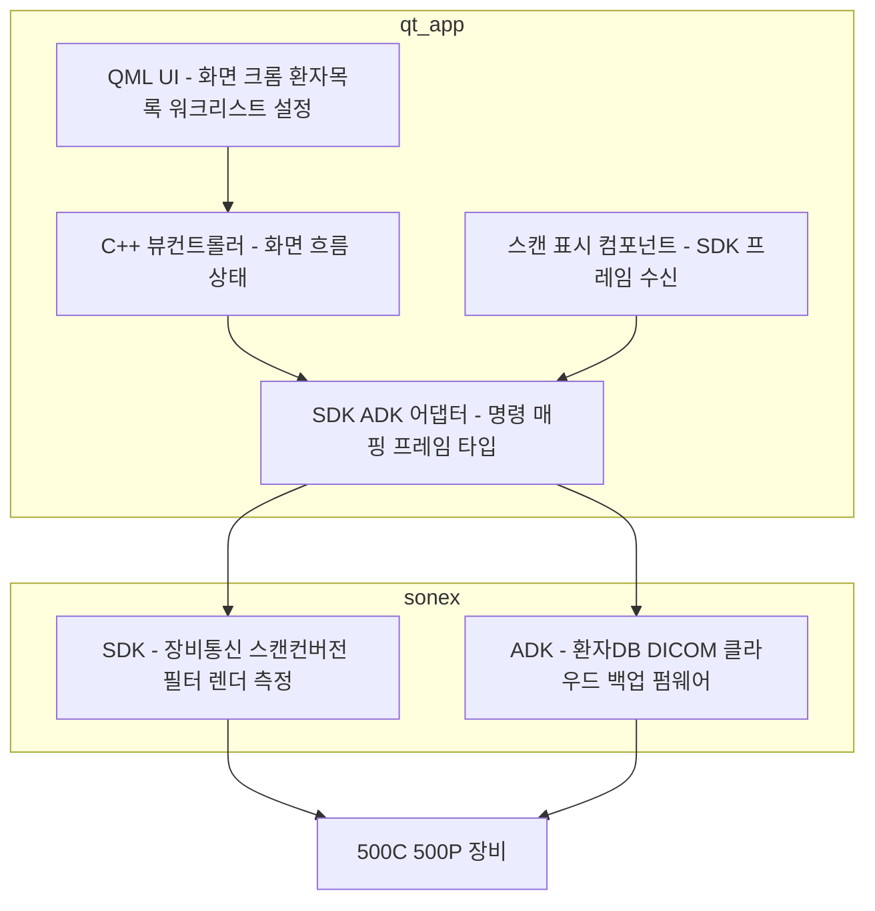
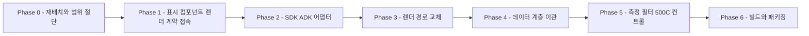

# `moana` UI → SoNex SDK/ADK 이관 (Qt6) — r2 Plan

> **범위**: `moana` 의 **UI 계층(`app/`)** 을 살리고 그 아래 자체 SDK 계층(`framework/`)을 걷어내, **`sonex-framework`(SDK+ADK)** 위에 얹는다. 산출물은 **500C·500P 를 구동하는 Qt6 호스트 앱**이다.
> **대상 제품**: **500C · 500P 뿐이다.** 500L(belle)·300 계열은 출시 범위 밖이며, 그것이 이 문서가 이전 `r2`(belle-fw feature-first)를 대체하는 이유다([../README.md](../README.md)).
> **목표**: `sonex-app`(Flutter) 완성 경로 대신 **이미 완성된 UI 자산을 SDK/ADK 위로 옮겨** 출시 가능한 앱을 만든다.
> **SDK/ADK 자체는 이 문서 범위 밖**이다 — [r1](../r1/plan.md) 이 담당한다. 이 문서는 **소비자 축**이다.
> **현행 구조 SOT**: [../../review/moana-app.md](../../review/moana-app.md) · [../../review/sonex-framework.md](../../review/sonex-framework.md).
> **실측 기준**: `moana` `origin/service_QT693`(HEAD 2026-07-27) · `sonex-framework` `origin/master` `e17280b2`(2026-07-30). **§1 의 수치는 2026-08-01 직접 측정분이다.**

> **이름에 대해**: `r2` 는 장비 트랙이 쓰던 슬롯이었다. `belle-fw` feature-first 재구성 계획은 **500L 출시 제외로 2026-08-01 삭제**됐고([../legacy/README.md](../legacy/README.md)), 이 문서가 그 자리를 쓴다.

> **IMPORTANT — 작업 주체**: **작업은 AI 에이전트가 한다. 사람의 개입은 검증이다.** 이 전제가 Phase 분해 방식을 정한다 — 코드 작성량이 아니라 **실장비 검증 회차**가 일정을 지배하므로, Phase 는 "사람이 한 번에 검증할 수 있는 단위"로 끊는다(§3).

> **IMPORTANT — 일정 제약**: **포팅과 검증을 합쳐 4주 안에 끝나야 한다**(주어진 제약). 이 문서는 관행대로 phase 별 시간을 추정하지 않는다. 대신 **일정을 지배하는 항목을 §5 에 따로 표시**한다 — 그것이 줄지 않으면 총량도 줄지 않는다.

> **IMPORTANT — 라이선스 제약**: **LGPLv3 를 넘어가는 것은 쓰지 않는다.** 신규 채택 금지에 그치지 않고 **현재 쓰고 있는 상용·GPL 의존도 전부 대체 대상**이다. 실측 결과 대체 대상은 **셋**(상용 Qt · CVIE · QCustomPlot)이고, 그중 **CVIE 대체는 화질 재검증을 부르므로 일정에 직접 걸린다.** 상세 = §0.4, CI 게이트 = [Phase 6](./phase6-build-packaging.md).

---

## 0. 전제 — 왜 이 안인가

### 0.1 세 저장소의 역할이 갈린다

[../legacy/moana-vs-sonex.md §2.1](../legacy/moana-vs-sonex.md) 이 이미 가른 선을 그대로 쓴다.

| 저장소 | 이 안에서의 위상 |
|---|---|
| **`sonex-framework`**(SDK·ADK) | **존치·완성 대상.** 500C·500P 명령셋을 가진 유일한 스택이다 |
| **`moana`**(Qt) | **UI 공급원.** `app/` 을 살리고 `framework/` 를 버린다 |
| `sonex-app`(Flutter) | **동결.** 이 안이 성립하면 대체된다 |

### 0.2 `moana` 가 500C/500P 를 구동하지 못하는 것은 논점이 아니다

`moana` 출하 계통(`service_QT693`)에 500C·500P capability table 분기가 **0건**이다([../legacy/moana-vs-sonex.md §3.1](../legacy/moana-vs-sonex.md)). 그러나 **구동을 담당하는 계층이 통째로 교체 대상**이므로 이 결손은 이 안에서 자동으로 해소된다 — 500C·500P 를 구동하는 것은 `moana/framework` 가 아니라 `sonex-framework` 다.

> `origin/sonon_500c` 브랜치(71커밋·+14,946줄·2023-09-19 정지)가 `moana` 자체 계층에 500C/P 를 얹으려던 시도다. **이 안은 그 경로를 되살리지 않는다** — 3년치 펌웨어 변경분(`FW_1_1_8_0`, 2026-04, Rev1.7 하드웨어·WiFi SDK 전환)과의 격차가 미지수이고, 같은 일을 `sonex-framework` 가 이미 최신으로 해 뒀다.

### 0.3 Qt5→Qt6 이행이 아니다

`moana` 는 **이미 Qt 6.6.3 으로 빌드된다**([../../review/moana-app.md §2](../../review/moana-app.md)). 이 계획에 Qt 메이저 이행은 포함되지 않는다. `service_QT693` 브랜치가 진행 중인 6.6.3 → 6.9.3 이행은 **이 계획과 독립**이며, 충돌 관리는 §5 에 있다.

### 0.5 출시 플랫폼 — 확정 `[2026-08-02]`

| 순위 | 플랫폼 | 위상 |
|---|---|---|
| **1** | **Windows** | 제품이 먼저 나간다. **검증이 여기 몰린다** |
| **2** | **Android · iOS** | 출시 대상 |
| — | **Linux** | **개발·CI 전용.** 출시 대상이 아니다 |
| — | ~~macOS~~ | **제외** |

**`moana` 출하 3타깃(Android·iOS·Windows)과 SDK 지원 4종의 교집합에서 macOS 만 빠진 형태**이고, 그 위에 Windows 우선이 얹힌다.

**두 가지가 여기서 정해진다.**

| | |
|---|---|
| **[Phase 6](./phase6-build-packaging.md) 범위** | 패키징·라이선스 이행물을 **Windows 부터** 낸다. **iOS 정적 링크 재링크 아카이브**(LGPLv3 §4(d)(0))는 2순위로 내려간다 |
| **[Phase 1](./phase1-render-composition.md) 시험 순서** | 표시 컴포넌트를 **Windows 에서 먼저** 세운다. 공유 서피스 경로도 Windows D3D11 shared handle 이 1순위다 |

> **Linux 가 빠지는 것이 아니다** — CI·헤드리스 회귀 판정이 Linux 에서 돌고([../r1/plan.md §0.1](../r1/plan.md)), 그것이 이 계획의 자동 판정 수단이다(§2.5·§2.6). **출시하지 않을 뿐 상시 돈다.**

### 0.4 라이선스 — 대체 대상이 셋이다 `[실측 2026-08-02]`

**출시 조건은 LGPLv3 이하이고, 신규 채택 금지에 그치지 않는다** — 현재 쓰는 상용·GPL 도 대체한다.

**통과하는 것**

| 축 | 실측 |
|---|---|
| **Qt 모듈 선언** | `app.pro:1` `quick qml sql network multimedia concurrent positioning quickcontrols2` · `:496,1143` `widgets printsupport` · `:640` `androidextras` · `framework.pro:1` 동류. **전부 LGPLv3 제공 모듈** |
| **GPL 전용 Qt 애드온** | Charts·Data Visualization·Virtual Keyboard·Quick 3D·MQTT·HTTP Server·Lottie·Wayland — **전 `.pro` 전수에서 0건**([../legacy/licensing.md §2](../legacy/licensing.md)) |
| 나머지 서드파티 | OpenCV(BSD-3) · DCMTK · OpenSSL · TFLite(Apache-2.0) 등 |

**대체 대상 셋**

| # | 대상 | 현재 | 대체 | 난이도 |
|---|---|---|---|---|
| **①** | **상용 Qt** | **Android 프로덕션이 `~/QtCommercial/5.15.2/android`**(`build.py:16`) | **오픈소스 Qt6 LGPLv3.** 기술적 차단 없음 — 같은 소스·같은 바이너리이고 기능·API 차이가 없다([../legacy/licensing.md §3](../legacy/licensing.md)) | **낮음.** 단 §아래 두 부작용 |
| **②** | **CVIE**(ContextVision, 상용) | `framework/ContextVision/` + `HC_CVIE_SUPPORT` **85곳/14파일**. `.cov` 라이선스 파일 2개가 저장소에 있고 CVLM(라이선스 매니저) 초기화가 선행된다 | **NextSRI/HNS** — `framework/ImageProc/HCNextSRIFilter`(OpenCV 단독, BSD-3) 또는 SDK 의 `HCSRIv*` 필터군 | **중간 — 코드가 아니라 화질 판정이 비용이다**(아래) |
| **③** | **QCustomPlot**(GPLv3) | 데스크톱 블록에 컴파일. 출하 기능 아님 | **제거** — `app.pro:74` `#DEFINES += ENABLE_IMAGE_ANALYZER` 스위치가 이미 있다 | **낮음.** [Phase 0 B-3](./phase0-repo-scope-cut.md) |

**②가 이 계획의 라이선스 항목 중 유일하게 일정에 걸린다.**

대체 코드는 **이미 출하 코드 안에 있고 런타임 배타 분기까지 배선돼 있다** — `ImageProc.cpp:1229-1235` 가 `cvieActive = (getCvieSetting() >= 0)` 으로 CVIE 와 NextSRI 를 배타 처리한다. 즉 **"만들어야 하는" 것이 아니라 "기본값을 바꾸는" 것**이다.

> **그러나 등가성은 미검증이다.** 커밋 메시지의 *"byte-identical 검증"* 은 **Python 레퍼런스와의 일치**이지 **CVIE 와의 화질 등가가 아니다.** 그리고 **라이선스가 있으면 CVIE 가 기본값**이라는 것은 그들이 더 낫다고 판단하고 있다는 뜻이다([../legacy/moana-vs-sonex.md §1.2](../legacy/moana-vs-sonex.md)).
>
> **따라서 ②는 사람 검증 항목이다**(§5) — 임상 화질 비교가 필요하고, 의료기기 관점에서 영상 처리 경로 변경은 재검증 대상이다.
>
> **다만 "결정 대기" 가 아니다.** CVIE 제거는 라이선스 제약으로 이미 정해졌다 — 남은 것은 **대체 후 화질을 재서 결과를 내는 일**이고 그것은 우리 작업이다([Phase 5-B](./phase5-measure-controls.md)). 수용 여부 판단이 필요하다면 **측정 결과가 나온 뒤**이며, 측정 없이 묻는 것은 상대에게도 답할 근거를 주지 않는다.

**①의 부작용 둘** `[../legacy/licensing.md §3]`

| # | 내용 |
|---|---|
| 1 | **LTS 접근 상실** — `Qt 6.8.5 LTS 는 상용 전용`이다. 오픈소스는 feature release(6.9.x·6.10)만 받는다. **Android 16KB 페이지 대응 해법으로 그들이 지목한 것이 6.8.5 LTS 였다** — 대안 경로를 정해야 한다 |
| 2 | **오프라인 인스톨러 상실** — 빌드 환경 재현성이 나빠진다. 이미 빌드머신 Qt 설치본을 **손으로 9건 개조**(ffmpeg 플러그인·`libav*` `.bak` 처리·dependencies XML 편집)하고 있어 부담이 겹친다 |

**FFmpeg — LGPL 전용 구성으로 고정한다.** Qt Multimedia 백엔드와 벤더 `lib/` 양쪽에 있다. GPL 전용 코덱(x264·x265·xvid) 배제([r1 Phase 0-C-6](../r1/phase0-build-reproducibility.md) 과 같은 판단).

**LGPLv3 이행 의무는 현재 0/4 다** `[../legacy/licensing.md §4]` — 전문 동봉 · 사용 사실 고지 · 소스 취득 경로 · 재링크 수단이 전부 없다. **iOS 는 정적 링크라 §4(d)(0) 에 따라 앱 오브젝트 파일 아카이브를 산출·제공하는 릴리스 단계가 필요하다**(정적 링크는 상용 라이선스라도 동일하다). 전부 [Phase 6](./phase6-build-packaging.md) 소관.

---

## 1. 현재 상태 — 실측

### 1.1 이음매가 하나가 아니라 넷이다 `[실측 2026-08-01]`

| 결합점 | 규모 | 성격 |
|---|---:|---|
| `SononFrame`(프레임 자료구조) | **585회 / 40파일** | app 전역 확산. SDK 는 `HC::StreamData` |
| `ScanContext` 필드 직접 read/write | **397회** | **캡슐화 없는 공유 상태 구조체** |
| `SONON_CMD_*` 명령 상수 | **63종 / 505회** | 기계적 매핑 가능 |
| `*Db` · `CDataManager` · `CSettings` | 337 / 256 / 223회 | ADK 대체 대상. 성격은 단순 CRUD |

**`CFrameworkWrapper` 는 이음매가 아니다.** `app/Sources` 전체에서 실사용 **0건**이고(헤더 include 8건은 타입 전달용 transitive), 실제 통로는 `CScanManager` 호출 + 위 공유 상태다. **깨끗한 단일 파사드가 없다는 것이 이 계획의 최대 작업량 근거다.**

### 1.2 장비 통신은 완전히 격리돼 있다 `[실측]`

`app/Sources` 전체에서 `SononClient`·`CtrlChannel`·`DataChannel`·`SononCtrlPacket`·`SononDataPacket`·`BaseSocket` 히트 **0건**. HC 프로토콜은 전부 `scanManager->sendCommand(SONON_CMD_*, QVariant)` 경유다(`app/Sources/DeviceControl/ControlCommand.cpp`).

→ **걷어낼 자리가 명확하다.** 남는 일은 `SONON_CMD_*` 63종을 SDK 명령으로 매핑하는 계층 하나다.

### 1.3 렌더 책임 경계가 `moana` 와 SDK 사이에서 정반대다 `[실측]`

| 단계 | `moana` | `sonex` SDK |
|---|---|---|
| 그레이맵·NLM·frame-average | framework | SDK |
| CF 컬러맵 LUT(RGBA) | framework | SDK (`cf_*.glsl`) |
| **스캔컨버전(폴라→직교)** | **app** (`GLFrameB.cpp:343-600` 정점 메시 + `scanConversion.vert/frag`) | **SDK** (`HCScanBConvex`·`HCScanBLinear`) |
| **GL 텍스처 업로드·합성** | **app** (`GLFrameView` = `QQuickFramebufferObject`) | **SDK** (자체 EGL) |
| PW/M 스펙트로그램 | app (`FrameProcessorPWM`) | SDK (`HCScanSpectrum`) |
| **측정 오버레이** | **app** (`Measure/` 50파일, **QPainter**) | **SDK** (`measure/` **13종 GL 렌더**) |
| 커서·룰러 | app | SDK (`HCScanMCursor`·`HCScanPwCursor`·`HCScanSideRuler`) |
| 텍스트·폰트 | Qt | SDK (`HCFontLoader` + `text_*.glsl`) |
| 터치 입력 인식 | Qt/QML | SDK (`HCTouchRecognizer`) |

**`moana` 는 framework 가 "픽셀 값"까지 만들고 app 이 "화면"을 만든다. SDK 는 화면까지 통째로 만든다.** app 쪽 렌더 코드량은 **약 13,800 LOC** 다.

→ **SDK 를 쓰기로 하면 이 13.8k LOC 는 역할이 사라진다.** 이것이 이 계획에서 가장 큰 삭제 단위다.

### 1.4 500C/500P 는 UI 렌더 부담이 작다 `[근거: ../../review/protocol-device.md §5.1]`

| 모드 | 장비가 주는 것 | 앱이 할 일 |
|---|---|---|
| B mode | **완성된 JPEG** | 표시 |
| M / Color Doppler | 각각 별도 JPEG | 리사이즈 후 오버레이 합성 |
| PW | raw 스펙트럼(64×128) | 스크롤 스펙트로그램 — **SDK 에 구현돼 있다**(`HCScanSpectrum.cpp` 698줄) |

빔포밍·스캔컨버전이 장비(UDL 하드웨어)에 있어 **호스트 앱이 신호처리를 하지 않는다.** §1.3 에서 버리는 13.8k LOC 는 300 계열·500L 의 raw scanline 용이라 **대상 제품에는 애초에 해당이 없다.**

### 1.5 측정 계층은 렌더러에 묶여 있지 않다 `[실측]`

| 항목 | 실측 |
|---|---|
| 오버레이 방식 | `CMeasureView : QQuickPaintedItem`(`MeasureView.h:44`), `::paint(QPainter*)`(`MeasureView.cpp:143`) — GL 영상 위 별도 QtQuick 아이템 |
| 좌표 기준 | `ppcm = contentHeight / (viewDepth/10)`(`MeasureView.cpp:2712`) — **app 자체 계산.** scanline↔mm 변환은 framework 에 없다 |
| framework 의존 | **2가지뿐** — `GlobalContext.h` include + `scanContext->addMeasure*()` 약 30회 |
| **렌더러 의존** | **0** |

**기술적으로는 SDK 가 그린 영상 위에 그대로 얹힌다.** 다만 채택하지 않는다 — §2.2.

### 1.6 500C/P 전용 기능은 "화면"이 아니라 "컨트롤"이다 `[실측]`

| 항목 | `moana` | `sonex` SDK |
|---|---|---|
| Harmonic·Spatial Compound | 명령 함수만 존재(`ControlCommand.cpp:2225`) — **호출처 0건 · QML UI 0건** | 지원. **UI 힌트까지 반환**(`HCLiveController.cpp:762` `harmonicSupported`·`harmonicDefault`) |
| 모델별 파라미터 유효범위 | `CModel::isValid*()` 30여 종 + `isS300C()` 류 하드코딩 판정 | `HCInstructionSet{300C,300L,500C,500L,500P}` · `isSupportedModel()` |

**화면 구성은 모델과 무관하게 같고, 갈리는 것은 컨트롤 유무와 값 범위다.** 그리고 그 정보를 **SDK 가 이미 제공**하므로, `moana` 의 `CModel` capability table 은 이식 대상이 아니라 **SDK 로 흡수될 대상**이다.

---

## 2. 목표 구조

### 2.1 계층

**앱은 얇아진다.** 신호처리·영상형성·측정 렌더링·장비 프로토콜이 전부 SDK/ADK 안에 있고, 앱에 남는 것은 **화면과 흐름**이다.

### 2.2 측정 소유권은 SDK 에 둔다 — 판단

§1.5 대로 `moana` 의 QPainter 오버레이를 얹는 것이 기술적으로 가능하나 **채택하지 않는다.**

| 근거 | |
|---|---|
| **중복** | SDK 가 측정 13종을 이미 갖는다(`ImageRenderer/shared/measure/`) |
| **좌표 소유** | `moana` 측정은 app 이 자기 스캔컨버전 기하를 안다는 전제인데(§1.5), 그 기하가 SDK 로 넘어간다 |
| **설계 의도** | [r1 Phase 4-C2](../r1/phase4-render-boundary.md) 가 측정 기하 반환 API 에 *"그리기용이 아니다"* 를 명시하고 사유를 적었다 — *"고객사가 각자 그려 캘리퍼 표시가 기기마다 갈린다 — 의료기기 품질·인증 문제"* |
| **검증 비용** | 임상 정확도가 걸린 계산을 **한 벌만 검증**하면 된다. 이 계획의 일정 제약에 직접 유리하다 |

**`moana` 에 남는 것은 측정 결과 표시·리포트 UI 이고, 그리기와 조작(캘리퍼 드래그)은 SDK 가 소유한다.**

### 2.3 무엇이 남고 무엇이 사라지는가

| `moana` 계층 | 처리 | 규모 |
|---|---|---|
| `framework/` 전체 | **폐기** → SDK·ADK | — |
| `app/Sources/Scan/` 렌더 코어 | **폐기** → SDK 가 스캔컨버전·합성 | 13.8k LOC |
| `app/Sources/Measure/` | **폐기** → SDK 소유(§2.2). 결과 표시 UI 만 잔존 | 50파일 12.7k LOC |
| `app/Sources/Ambulance/` | **폐기** — 대상 제품과 무관 | 27파일 |
| 300 계열·500L 모델 분기 | **폐기** — 출시 범위 밖 | `Model.cpp` capability table 8종 |
| `GLFrameView`(`QQuickFramebufferObject`) | **자리 유지** — SDK 프레임 표시 컴포넌트로 내용 교체 | — |
| `app/Sources/{PatientList,WorkList,Setting,Main,Cloud,DeviceControl}` | **이식** — ADK/SDK 위로 재배선 | 91파일 |
| QML 174파일 | **이식** — 스캔 뷰만 교체 | 85k LOC |

### 2.4 아키텍처 — 전면 도입하지 않는다

[r1 §2.0](../r1/plan.md) 은 feature-first clean architecture 를 명시적으로 채택하고 `test-architecture` 로 CI 강제까지 건다. **r2 는 그렇게 하지 않는다.**

> **이유는 "시간이 없어서" 가 아니다.** 작업을 AI 가 하므로 구조 개편 코드를 쓰는 것 자체는 빠르다. 근거는 **판정할 수 없는 변경을 하지 않는다** 하나다.

| 근거 | |
|---|---|
| **이 계획의 원칙과 충돌한다** | [Phase 3 §1.4](./phase3-render-path.md)(`ScanPlayer` 분해는 범위 밖) · [Phase 6 §1.1](./phase6-build-packaging.md)(qmake 유지)이 이미 같은 이유를 적었다 — **구조 개선과 계층 교체를 동시에 하면 회귀 원인을 가를 수 없다** |
| **안전망이 없다** | `moana` 는 자동 테스트 **0** · CI **0**([../../review/moana-app.md §8](../../review/moana-app.md)). r1 은 Phase 1(회귀 기준선)을 세운 뒤 구조를 바꾸지만, 이 계획엔 그럴 구간이 없다 |

#### 그런데 이 계획 자체가 구조 부채를 줄인다 `[실측 2026-08-02]`

`moana` app 계층의 대표 부채는 **`Common` 허브 유입 248건(64%) · 순환 12쌍**이다([../legacy/moana-vs-sonex.md §3](../legacy/moana-vs-sonex.md)).

`app/Sources` → `Common/` include 유입을 다시 재면 **181건**이고, 그중 이 계획이 걷어내는 계층에서 나오는 것이 이렇다.

| 출처 | 유입 | 이 계획의 처리 |
|---|---:|---|
| `Scan/` | **71** | **부분 제거** — 렌더 코어 13.8k LOC 는 사라지나 `ScanPlayer`(7,526줄) 등 UI 로직은 남는다 |
| `Ambulance/` | **22** | **전량 제거**([Phase 0 B-1](./phase0-repo-scope-cut.md)) |
| `Measure/` | 1 | 대부분 제거([Phase 5 A-2](./phase5-measure-controls.md)) |
| 합계 | **94 (52%)** | |

**확실히 줄어드는 것은 23건이고, `Scan/` 잔존분에 따라 최대 94건까지 줄어든다.** 정확한 값은 Phase 3·5 완료 후에야 나오므로 **여기서 단정하지 않는다.** 다만 방향은 분명하다 — **구조 작업을 따로 하지 않아도 허브 유입이 눈에 띄게 줄고, 순환 12쌍 중 일부는 한쪽 끝이 사라져 저절로 풀린다.**

#### 대신 새로 만드는 것에만 규약 넷을 건다

**기존 코드를 재배치하지 않는다. 이 계획이 신설하는 것**(어댑터 계층·표시 컴포넌트)**에만 적용한다.**

| # | 규약 | 이유 |
|---|---|---|
| A-1 | **어댑터를 `Common/` 에 두지 않는다** — 별도 디렉토리에 신설 | 허브 유입 248건을 줄이는 계획에서 새 코드가 그 허브를 다시 키우면 안 된다 |
| A-2 | **의존은 단방향** — QML·뷰컨트롤러 → 어댑터 → SDK/ADK. **역방향 금지** | `moana` 의 역의존 6건이 생긴 방식이 이것이다([../../review/moana-app.md §0](../../review/moana-app.md)) |
| A-3 | **SDK/ADK 타입이 UI 계층으로 새지 않게 한다** — `HC::StreamData` 등은 어댑터 경계에서 멈춘다 | 585개소를 다시 만들지 않기 위해서다. [Phase 2 C-1](./phase2-sdk-adk-adapter.md) 의 어댑터가 그 경계다 |
| A-4 | **`ScanContext` 같은 공유 상태 구조체를 새로 만들지 않는다** | 397개 직접 접근이 그렇게 생겼다 |
| **A-5** | **변환 로직은 순수 함수로 분리한다** — 좌표·단위·명령 매핑·필드 대응 | **테스트가 붙을 자리를 만든다**([§2.6.4](#264-그러려면-어댑터를-테스트-가능하게-설계해야-한다)). 지금 `ppcm` 은 `MeasureView.cpp:2349` 에 인라인이라 붙일 곳이 없다 |

**넷 다 "무엇을 하라"가 아니라 "무엇을 반복하지 마라"다.** 강제 장치를 새로 만들지 않으므로 비용이 없고, 지키지 않으면 이 계획이 없애는 부채를 같은 자리에 다시 쌓는다.

#### 재개 입력은 이미 있다

`moana` 에 feature-first 를 넣는 설계는 **[legacy/r1](../legacy/r1/) 이 Phase 2~9 로 이미 해 뒀다** — 계층 경계(phase2) · `core/`(phase3) · composition root·presentations(phase4) · feature 별 분리(phase5~9, worklist·settings·patient·dicom·cloud·measure·scan·ambulance·ble).

당시 전제(`moana` 단독 리팩토링)는 폐기됐지만 **`app/` 계층 구조 분석과 feature 경계 판정은 그대로 유효하다.** 구조 작업을 재개한다면 그 문서가 입력이고, **이 계획이 트리를 절반으로 줄여 놓은 상태에서 시작하므로 그때 더 싸다.**

### 2.5 회귀 판정 — r1 과 판정 대상이 다르다

**이 계획은 `SononFrame` 585 · `ScanContext` 397 · `SONON_CMD_*` 505 · DB/Settings 816 개소를 바꾼다.** 판정 수단 없이 할 규모가 아니다.

#### 2.5.1 `moana` 의 출발점 — 테스트 0 · CI 0, 그러나 백지는 아니다 `[실측 2026-08-02]`

| 자산 | 규모 | 위치 | 이 계획에서의 운명 |
|---|---:|---|---|
| `DummyPlayer` | **275줄** | `app/Sources/Scan/` | **살아남는다** — 무장비 재생 |
| `ScanAutoTestController` | **267줄** | `app/Sources/Scan/` | **살아남는다** — 스캔 자동 구동 |
| `AgingTestController` | **552줄** | **`app/Sources/Test/`** | **[Phase 0 B-2](./phase0-repo-scope-cut.md) 가 제거 대상으로 잡았다 — 재검토 대상**(§2.5.4) |
| `Record`(녹화·재생 포맷) | — | **`framework/Record/`** | **걷어낸다** — ADK `BackupReadWriter` 가 대체 |
| 재생 진입점(`loadPlayFile`·`getPlayFrames`) | — | **`framework/ScanManager/`** | **걷어낸다** — 재배선 필요 |

**부품은 app 쪽에 절반 남고 절반은 framework 와 함께 사라진다.** 재생 기반 판정을 쓰려면 **재생 경로를 ADK 로 갈아탄 뒤**(=[Phase 4](./phase4-data-layer.md) 이후)에야 완전해진다.

#### 2.5.2 r1 의 방법을 그대로 쓸 수 없다

| | [r1](../r1/plan.md) | **r2(이 계획)** |
|---|---|---|
| 변경 성격 | **mechanical move** — 파일 분할·경계 이동 | **계층 교체** — 렌더러·DB·측정 구현이 통째로 바뀐다 |
| 판정 기준 | **픽셀 동등성**(바이트 일치) | **픽셀은 바뀌는 것이 정상** — 다른 렌더러가 그린다 |
| oracle | 변경 전 산출물 | **출하 중인 `moana` 동작**(사람이 본다) |

**"이관 전후 픽셀 비교"는 이 계획에서 성립하지 않는다.** [Phase 3](./phase3-render-path.md) 이 `moana` 렌더 코어를 SDK 렌더로 바꾸면 픽셀이 달라지는 것이 당연하고, **그 차이가 결함인지 개선인지는 픽셀이 답하지 못한다.**

#### 2.5.3 그래서 판정을 셋으로 가른다

**핵심은 이것이다 — 영상이 맞는지는 r1 이 판정한다.** 이 계획은 SDK 를 **소비**하므로 SDK 내부 회귀는 [r1 Phase 1-C](../r1/phase1-regression-baseline.md)(헤드리스 렌더 골든)가 잡는다. **r2 가 판정할 것은 "배선이 맞는가" 이지 "영상이 맞는가" 가 아니다.**

| 층 | 판정 대상 | 수단 | 자동화 |
|---|---|---|---|
| **① 빌드** | 컴파일·링크 | 빌드 게이트 | **가능** — Phase 0~2 구간의 **유일한** 판정([Phase 0 §3.7](./phase0-repo-scope-cut.md)) |
| **② 배선** | 명령이 전달되는가 · 파라미터가 반영되는가 · 상태가 동기화되는가 | **[r1 Phase 1-B](../r1/phase1-regression-baseline.md) 의 mock 장치 서버 재사용** — 앱이 보낸 명령을 서버가 기록·검증한다 | **가능** |
| ②b | DB·측정값 왕복 | 값 대조([Phase 4 D-1](./phase4-data-layer.md)·[Phase 5](./phase5-measure-controls.md)) | **가능** |
| **③ 화면·임상** | 흐름 · 영상 품질 · 측정 정확도 | 사람 | **불가** — [§5](#5-일정을-지배하는-것--ai-작업과-사람-검증의-분리) 의 병목 |

**②가 이 계획의 실질 안전망이다.** `SONON_CMD_*` 505개소를 SDK 명령으로 바꾸는 작업([Phase 2-A](./phase2-sdk-adk-adapter.md))에서 **어느 파라미터가 조용히 안 넘어갔는지**는 사람이 화면을 봐서는 잡히지 않는다 — mock 서버가 받은 것을 기록해야 잡힌다. **통짜 구조체를 개별 request 로 분해하는 작업이라 특히 그렇다**([Phase 2 §1.2](./phase2-sdk-adk-adapter.md)).

> **mock 서버는 이미 계획에 있고 선행 가능하다** — [r1 Phase 1-B](../r1/phase1-regression-baseline.md) 가 *"재배치 전에도 우리 루트 git 안에서 독립적으로 지금 만들 수 있다"* 로 표시한 항목이다. **r2 가 그 첫 소비처가 된다.**
>
> **실행처**: 확보 = [Phase 1 E-4](./phase1-render-composition.md) · **이관 전 명령열 녹화 = [Phase 1 E-5](./phase1-render-composition.md)** · 판정 = [Phase 2 T-7](./phase2-sdk-adk-adapter.md).
>
> **아키텍처 없이 성립한다** — 이 계획은 §2.4 에서 아키텍처를 도입하지 않기로 했으나 ②는 영향받지 않는다. **치환점이 객체가 아니라 프로세스이기 때문이다.** 장치는 TCP 서버(1234/1235)이고 앱이 클라이언트라(`framework/SononClient/BaseSocket.cpp:55`), mock 은 그 포트를 여는 별도 프로세스다 — 앱 안에 인터페이스·DI·계층이 하나도 없어도 된다. 아키텍처를 요구하는 mock 은 *객체를 런타임에 갈아끼우는* 종류인데 이건 그것이 아니다.
>
> **리팩토링 후 앱은 주소가 이미 인자다** — SDK `connectDevice(String ip, controlPort, dataPort, ...)`(`sdk/sdk/DeviceManager/shared/HCDeviceManager.h:66`). Phase 2 이후 앱을 mock 으로 돌리는 데 **코드 수정이 0**이다.
>
> **⑦ 펌웨어도 같은 mock 하나로 덮인다** — `HCFirmwareController.cpp:148` 이 *"500C/500P/500LS: Socionext 소켓 청크 방식 (FTP 아님)"*. FTP 경로(`:180` 이하)는 500L·L43K·300계 전용이라 **[Phase 0](./phase0-repo-scope-cut.md) 절단 대상이다.** mock 이 FTP 서버를 흉내낼 필요가 없다.
>
> **E-5 의 순서가 이 판정의 성립 조건이다** — ②는 "이관 전후 명령열이 같은가" 이므로 **기준선을 코드 변경 전에 떠야 한다.** Phase 2 가 시작된 뒤에는 뜰 수 없다.

#### 2.5.4 그래서 절단 계획을 하나 고친다

[Phase 0 B-2](./phase0-repo-scope-cut.md) 가 `app/Sources/Test/` 를 제거 대상으로 잡았는데, **그 안이 `AgingTestController` 552줄**이다. 범위 밖 기능으로 보고 지우려던 것이 **자동화 자산**이다.

**판단**: 제거하지 않고 **보류**한다. 에이징 테스트가 500C/P 에도 의미가 있는지, 자동 구동 뼈대로 재사용 가능한지를 [Phase 1](./phase1-render-composition.md) 에서 `DummyPlayer`·`ScanAutoTestController` 와 함께 판정한다. **지우는 것은 언제든 할 수 있지만 되살리는 것은 비싸다.**

### 2.6 테스트 코드 — 무엇을 쓰고 무엇을 안 쓰는가

§2.5 는 **판정 방법**을 정했다. 이 절은 **테스트 코드를 쓸 것인가**를 정한다.

#### 2.6.1 현황 — 인프라 0, 다만 자리는 있다 `[실측 2026-08-02]`

| 항목 | 실측 |
|---|---|
| **Qt Test 사용** | **0건** — `QT += testlib`·`QTest`·`QSignalSpy` 전부 없다 |
| `test/` 내용 | **수동 테스트 앱 3종** — `FrameworkWrapperTest`·`Qt5DatabaseTest`·`ScanView`. 자동 판정이 아니다 |
| **`moana.pro`** | `SUBDIRS += app framework` — **`test` 가 없다.** 그런데 바로 아래 줄에 **`test.depends = framework` 가 이미 있다** |

> **`test.depends` 선언만 있고 `SUBDIRS` 에 안 들어간 상태다.** 누군가 테스트 타깃을 넣으려다 만 흔적이고, **자리를 새로 만들 필요가 없다는 뜻이기도 하다** — `SUBDIRS` 에 `test` 한 단어를 더하면 된다.

#### 2.6.2 제약은 시간이 아니라 테스트 가능성이다

**작업을 AI 가 하므로 "테스트를 쓰는 시간" 은 제약이 아니다**(§메타). 그런데도 전 코드에 단위테스트를 깔 수 없는 이유는 다르다.

| | |
|---|---|
| **기존 코드가 테스트 가능한 형태가 아니다** | `ScanContext` **397개 직접 접근** · `ScanPlayer` **7,526줄** · QML 결합 · `ppcm` 인라인 계산(`MeasureView.cpp:2349`) |
| **테스트 가능하게 만들려면 구조를 바꿔야 한다** | 그것이 [§2.4](#24-아키텍처--전면-도입하지-않는다) 가 범위 밖으로 둔 작업이다 — **회귀 판정 없이 구조를 바꾸는 것이 더 위험하다** |

**따라서 경계는 "얼마나 쓰느냐" 가 아니라 "무엇을 바꾸느냐" 로 그어진다.**

> **이 계획이 바꾸는 것에는 전부 붙인다. 안 바꾸는 것에는 안 붙인다.**
>
> 안 바꾸는 코드에 테스트를 붙이면 **회귀를 막는 것이 아니라 현상을 기록**할 뿐이고, 붙이려면 먼저 구조를 고쳐야 해서 **없던 위험을 만든다.**

#### 2.6.3 붙일 곳 — 이 계획이 신설·변경하는 경계 전부

| # | 대상 | Phase | 판정 형태 |
|---|---|---|---|
| ① | **좌표·단위 변환** — `scanLine`(절대 index) ↔ `linePosition`(0~1 비율)([§1.5 ②](#15-sononframe--hcstreamdata--이름-매핑이-아니라-의미-변경이-섞여-있다)) · `ppcm` 대체분 | 2·3 | 왕복 항등성 · 경계값(0·1·최대 scanline). **틀리면 측정값이 틀린다** |
| ② | **명령 매핑** — `SONON_CMD_*` 63종 → SDK request | 2 | **전수 대조 — 매핑 누락 0건.** 통짜→개별 분해에서 빠진 필드도 여기서 |
| ③ | **프레임 어댑터** — `SononFrame` ↔ `StreamData` | 2 | 필드 왕복 · **사이드카 보존**(`fl2`·`multiFocus*`·`presetName`) |
| ④ | **상태 어댑터** — `ScanContext` 397개소가 넘어간 뒤의 조회·설정 경로 | 2 | 필드 범주별 read/write 왕복 |
| ⑤ | **데이터 계층** — `*Db`·`CDataManager`·`CSettings` → ADK | 4 | **값 왕복.** DDL 이 동일하므로([Phase 4 §1.1](./phase4-data-layer.md)) 대조가 명확하다 |
| ⑥ | **측정 결과 변환** — SDK 측정값 ↔ 표시·리포트 | 5 | 값 정합. **임상 영향이라 자동 판정 가치가 가장 높다** |
| ⑦ | **펌웨어 상태머신** — ADK `HCFirmwareController` SN 3단계 배선 | 5 | mock 으로 단계 순서·실패 경로. **실패 시 장비 손상이라 실장비 전에 잡아야 한다** |

**①~④ 는 순수 변환이라 GL 컨텍스트도 장비도 필요 없다. ⑤~⑦ 은 mock(DB 파일·[r1 Phase 1-B](../r1/phase1-regression-baseline.md) 장치 서버)이 필요하나 역시 실장비는 아니다.** 전부 CI 에서 돈다.

> **⑦은 실장비 전에 잡을 수 있는 것이 있다** — 펌웨어 굽기 실패는 장비 손상이라([../rendering-boundary.md §7.5](../rendering-boundary.md)) 실장비 시도 자체가 비싸다. **단계 순서와 실패 경로는 mock 으로 판정 가능하다** — 그것으로 실장비 회차가 얼마나 줄지는 재보지 않았다.

#### 2.6.3b 안 붙일 곳

| 대상 | 이유 |
|---|---|
| **QML·UI·화면 흐름** | **바꾸지 않는다**([§2.3](#23-무엇이-남고-무엇이-사라지는가)). 붙이려면 구조를 먼저 고쳐야 하고 그것이 §2.4 범위 밖이다 |
| **`ScanPlayer`(7,526줄) 등 잔존 UI 로직** | 같은 이유. [Phase 3 §1.4](./phase3-render-path.md) 가 분해를 범위 밖으로 뒀다 |
| **SDK 내부**(렌더·필터·측정 계산) | **[r1](../r1/plan.md) 소관.** r2 는 소비자다([§2.5.3](#253-그래서-판정을-셋으로-가른다)) |
| 통합·E2E | 배선 판정은 mock 장치 서버가 맡는다. 별도 프레임워크를 들이지 않는다 |

#### 2.6.4 그러려면 어댑터를 테스트 가능하게 설계해야 한다

**지금 `moana` 는 그렇지 않다** — `ppcm` 계산이 `MeasureView.cpp:2349` 에 **인라인**이다(`qreal ppcm = contentHeight / (viewDepth / 10)`). 이런 형태로 어댑터를 짜면 **테스트가 붙을 자리가 없다.**

**그래서 [§2.4](#24-아키텍처--전면-도입하지-않는다) 규약에 하나를 더한다.**

| # | 규약 | 이유 |
|---|---|---|
| **A-5** | **변환 로직은 순수 함수로 분리한다** — 좌표·단위·명령 매핑·필드 대응. Qt 객체나 전역 상태에 의존하지 않게 | 2.6.2 의 셋이 테스트되려면 이것이 선행이다. **설계 시점에 정하지 않으면 나중에 테스트를 붙일 수 없다** |

**이것은 아키텍처 도입이 아니다** — 기존 코드를 재배치하지 않고, **새로 쓰는 변환 함수를 어디에 두느냐**만 정한다. 비용이 없고, 안 하면 §2.6.2 가 성립하지 않는다.

#### 2.6.5 어디에 두고 어떻게 돌리나

| # | |
|---|---|
| **프레임워크** | **Qt Test**(`QT += testlib`). `moana` 가 이미 Qt6 이므로 새 의존이 없다. gtest 를 들이지 않는다 |
| **위치** | `test/` 아래. **기존 수동 앱 3종과 섞지 않고 별도 디렉토리**로 둔다 |
| **빌드** | `moana.pro` 의 `SUBDIRS` 에 `test` 추가 — **`test.depends = framework` 는 이미 있다**(§2.6.1) |
| **CI** | **빌드 게이트 + 단위테스트**가 최소 구성이다. `moana` 는 CI **0건**이므로 이것이 첫 CI 가 된다([Phase 6](./phase6-build-packaging.md) 의 라이선스 게이트와 같은 파이프라인에 얹는다) |

> **착수 시점**: ①②③ 전부 [Phase 2](./phase2-sdk-adk-adapter.md)(어댑터)에서 코드가 생기므로 **테스트도 그때 같이 쓴다.** [r1 4-A1a](../r1/phase4-render-boundary.md) 가 *"포트와 mock 을 같은 커밋에 낸다"* 로 강제한 것과 같은 형태 — **어댑터만 내고 테스트를 안 내면 나중에 안 쓴다.**

---

## 3. Phase 구성

**Phase 는 "사람이 한 번에 검증할 수 있는 단위"로 끊는다**(§메타). 각 Phase 끝에 검증 가능한 상태가 서지 않으면 Phase 를 잘못 나눈 것이다.

### 상세 문서

| Phase | 문서 |
|---|---|
| 0 | [phase0-repo-scope-cut.md](./phase0-repo-scope-cut.md) |
| 1 | [phase1-render-composition.md](./phase1-render-composition.md) |
| 2 | [phase2-sdk-adk-adapter.md](./phase2-sdk-adk-adapter.md) |
| 3 | [phase3-render-path.md](./phase3-render-path.md) |
| 4 | [phase4-data-layer.md](./phase4-data-layer.md) |
| 5 | [phase5-measure-controls.md](./phase5-measure-controls.md) |
| 6 | [phase6-build-packaging.md](./phase6-build-packaging.md) |

### Phase 0 — 저장소 재배치 · 범위 절단

| # | 작업 |
|---|---|
| 0-1 | `client/legacy/moana` → **`client/moana`** 쓰기 가능 작업 사본. fork base = `origin/service_QT693`. **`master` 를 쓰지 않는다**(2022-02 정지) |
| 0-2 | 착수 시점 SHA 를 baseline 태그로 기록 |
| 0-3 | **범위 절단을 먼저 한다** — 300 계열·500L 모델 분기, `Ambulance`(27파일), `Test` 를 제거한다. **옮길 대상을 줄이고 시작하는 것이 이후 전 Phase 의 비용을 낮춘다** |
| 0-4 | 벤더 `lib/`(6.56G) 처리 판단 — SDK/ADK 로 대체되는 것(DCMTK·OpenCV·FFmpeg·wxSQLite3)이 대부분이다. 제거 범위를 여기서 정한다 |
| 0-5 | 힐세리온 원본 반영 방식은 **미정이어도 비차단** — 별도 브랜치에서만 작업한다([r1 Phase 0-4](../r1/phase0-build-reproducibility.md) 와 같은 원칙) |

### Phase 1 — 표시 컴포넌트 · 렌더 계약 접속

**선행 = [r1 Phase 4](../r1/phase4-render-boundary.md) 완료.** 그 phase 가 SDK 의 렌더 계약을 **윈도우 핸들에서 렌더 타겟 크기로, 없음에서 완성 프레임으로** 바꾼다. 이 계획은 그 상태를 전제하므로 **컨텍스트 소유 문제는 여기서 다루지 않는다** — SDK 가 창을 요구하지 않으면 다툴 일이 없다.

**접속 지점이 이미 맞다** — `moana` 의 `GLFrameView` 는 `QQuickFramebufferObject`(`GLFrameView.h:42,524`), 즉 *"GL 로 그린 결과를 QtQuick 씬그래프에 넣는 자리"* 다. r1 Phase 4 §5 가 목표로 적은 *"UI 프레임워크의 표준 이미지 경로"* 의 Qt 대응물이 정확히 이것이다.

| # | 작업 |
|---|---|
| 1-1 | **표시 컴포넌트 구현** — 공유 서피스(제로카피)와 픽셀 버퍼 두 반환 형태를 `QSGTexture` 로 받는다. 폴백을 만드는 게 아니라 **[r1 4-E4](../r1/phase4-render-boundary.md) 의 계약이 그렇다** |
| 1-2 | **모드별 4벌을 1벌로** — SDK 가 모드를 알고 합성하므로 표시 컴포넌트는 모드를 모른다 |
| 1-3 | **계약 세부 확정** — 픽셀 원점·스트라이드·버퍼 소유([r1 4-C7](../r1/phase4-render-boundary.md)) · **프레임 갱신 감지 방식** · 앱 생명주기. 뒤 둘은 r1 이 미확정으로 남긴 항목이라 **이 phase 가 요구를 낸다** |
| 1-4 | **좌표 변환 계약** — 위젯 좌표 → 렌더 타겟 좌표([r1 4-B1](../r1/phase4-render-boundary.md)). `moana` 의 `ppcm` 계산이 여기서 대체된다 |
| 1-5 | **성능 확인** — 반환 형태별 프레임레이트. 저하가 크면 **표시 컴포넌트에서 우회하지 않고 r1 에 되돌린다** |

> **실장비가 필요 없다** — 재생 데이터로 판정한다. 그래서 r1 Phase 4 완료 직후 바로 칠 수 있다.

### Phase 2 — SDK/ADK 어댑터 계층

**§1.1 의 네 이음매를 어댑터 뒤로 넣는다.** 이 Phase 는 화면을 바꾸지 않는다.

| # | 작업 |
|---|---|
| 2-1 | **명령 매핑** — `SONON_CMD_*` 63종 → SDK 명령. `ControlCommand.cpp` 가 유일 통로이므로 여기 한 곳에서 갈린다 |
| 2-2 | **프레임 타입 어댑터** — `SononFrame`(585회/40파일) ↔ SDK 프레임. **전면 치환 대신 어댑터를 먼저 세운다** — 585개소를 동시에 바꾸면 회귀 원인을 가를 수 없다 |
| 2-3 | **`ScanContext` 소유권 이전** — 397개소가 직접 read/write 하는 공유 상태를 SDK 상태 조회로 바꾼다. **이 계획에서 가장 위험한 항목**이라 필드 단위로 끊어 진행한다 |
| 2-4 | **SDK 공개 헤더 컴파일 문제를 여기서 만난다** — `HCScannerModelSpec.h` 가 `-fsyntax-only` 를 통과하지 못하고, 앱이 부르는 `hc_*` 108개 중 **29개가 정의 0건**이다([r1 Phase 6 §6-B](../r1/phase6-samples-support.md)·[Phase 8 §1.3](../r1/phase8-app-migration.md)). **C++ 소비자는 이걸 첫날 컴파일 에러로 전부 만난다** — Flutter 가 FFI 로 런타임까지 숨긴 것과 다르다. 해소는 r1 Phase 3-F 소관이며, **미해소분은 이 Phase 가 목록으로 낸다** |

### Phase 3 — 렌더 경로 교체

| # | 작업 |
|---|---|
| 3-1 | `GLFrameView` 내부를 Phase 1 의 표시 컴포넌트로 교체 |
| 3-2 | `app/Sources/Scan/` 렌더 코어 **13.8k LOC 제거** — 스캔컨버전 정점 메시·셰이더·텍스처 업로드·`FrameProcessorPWM` |
| 3-3 | 프리셋 `viewDepth` → SDK 좌표계 연결. `ppcm` 계산이 app 에 있던 근거가 사라지므로 **SDK 가 주는 기하를 쓴다** |
| 3-4 | 모드 전환(B/M/CF/PW/PD)을 SDK 계약으로 재배선 |

### Phase 4 — 데이터 계층 이관 (ADK)

| # | 작업 |
|---|---|
| 4-1 | `*Db`(337회) · `CDataManager`(256회) → ADK. **성격이 CRUD 라 기계적**이다 |
| 4-2 | `CSettings`(223회) → ADK 설정 경로 |
| 4-3 | DICOM·PACS·MWL·클라우드를 ADK 호출로 교체 |
| 4-4 | **기존 출하 DB 호환을 확인한다** — `moana` 와 ADK 의 DDL 대조는 [../../review/client-database.md](../../review/client-database.md) 가 SOT 다 |

### Phase 5 — 측정 이관 · 필터 대체 · 500C/P 컨트롤

| # | 작업 |
|---|---|
| 5-1 | `app/Sources/Measure/` 를 SDK 측정으로 교체(§2.2). **결과 표시·리포트 UI 는 남긴다** |
| 5-1b | **CVIE(상용) 제거 + 오픈소스 필터로 대체**(§0.4 ②). 코드는 런타임 배타 분기가 이미 있어 작으나, **화질 등가성 판정이 사람 검증 항목**이다 |
| 5-2 | 캘리퍼 조작을 SDK `HCTouchRecognizer` 로 위임. 앱은 렌더 타겟 좌표만 넘긴다([r1 4-B1](../r1/phase4-render-boundary.md)) |
| 5-3 | **Harmonic·Spatial Compound 토글 신설** — SDK 가 주는 `harmonicSupported` 힌트로 조건부 표시(§1.6) |
| 5-4 | 펌웨어 굽기를 ADK `HCFirmwareController` 로 재배선. **화면 형태는 같다**(파일 선택 → 진행률 → 완료) — `moana` 의 500L 전용 `FirmwareUpdater.cpp` 121줄은 폐기 |

### Phase 6 — 빌드·패키징

| # | 작업 |
|---|---|
| 6-1 | **qmake 유지 여부 판단** — `moana` 는 자체 `CMakeLists.txt` **0건**이다. 빌드 시스템 교체와 구조 변경을 동시에 하면 회귀 원인을 가를 수 없으므로 **기본은 qmake 유지**이고, 교체는 이 계획 밖이다 |
| 6-2 | SDK/ADK 바이너리 의존을 버전 고정으로 묶는다([r1 Phase 2](../r1/plan.md)) |
| 6-3 | 출시 타깃 확정 및 패키징. **어느 플랫폼을 내는지가 미결이다** — §6 |

---

## 4. 성공 판정

| # | 항목 | 기대 |
|---|---|---|
| 4.1 | **500C 실장비 연결 → 스캔 → 표시** | 성공 |
| 4.2 | **500P 실장비 동일 시나리오** | 성공 |
| 4.3 | 모드 전환 B·M·CF·PW·PD | 전부 성공 |
| 4.4 | Harmonic·Compound 토글 | SDK 힌트대로 표시되고 동작 |
| 4.5 | 측정 13종 | SDK 렌더로 표시·조작. **값 정확도는 사람이 판정** |
| 4.6 | 환자기록·워크리스트·DICOM·백업 | 기존 동작 보존 |
| 4.7 | 펌웨어 굽기(500C/P) | 성공 |
| 4.8 | `moana` 자체 계층 잔존 | `framework/` 참조 **0건** |
| 4.9 | 렌더 코어 잔존 | `app/Sources/Scan/` 스캔컨버전 **0건** |
| 4.10 | 범위 밖 코드 | 300 계열·500L·Ambulance 분기 **0건** |

> **4.1~4.2 가 진짜 게이트다.** 나머지가 전부 통과해도 실장비에서 영상이 안 뜨면 이 계획은 성립하지 않은 것이다.

---

## 5. 일정을 지배하는 것 — AI 작업과 사람 검증의 분리

**코드 작성량은 이 계획의 병목이 아니다**(§메타). 아래 오른쪽 열이 총량을 정한다.

| AI 가 하는 일(병렬 가능) | 사람이 검증할 일(직렬·실장비 필요) |
|---|---|
| 어댑터 계층(Phase 2) — 명령 63종·프레임 타입·상태 397개소 | **500C·500P 실장비 연결·스캔** |
| 렌더 코어 13.8k LOC 제거(Phase 3) | 모드 전환 5종 육안 확인 |
| 데이터 계층 816개소 재배선(Phase 4) | **측정 정확도** — 임상 영향 |
| 범위 절단(Phase 0) | 영상 품질(CVIE/HNS 경로) |
| 500C/P 컨트롤 신설(Phase 5-3) | **펌웨어 굽기** — 실패 시 장비 손상 |

**따라서 Phase 를 잘게 끊는 이득이 크다** — 사람 검증이 직렬이므로, 한 번의 검증에서 여러 Phase 결과를 함께 확인할 수 있게 묶는 것이 총량을 줄인다.

---

## 6. 위험 · 대응

| 위험 | 영향 | 대응 |
|---|---|---|
| **r1 Phase 4 가 늦어진다** | Phase 1 이 시작되지 않고, 그 뒤 전부가 밀린다 | **이 계획의 최대 일정 의존이다.** r1 Phase 4 의 선행(Phase 0~3)까지 포함해 진척을 함께 본다 — [r1 plan](../r1/plan.md) |
| 렌더 계약 세부(원점·갱신 감지)가 미확정으로 남는다 | 표시 컴포넌트가 추측으로 구현된다 | Phase 1-3 이 **요구를 r1 에 낸다.** 표시 컴포넌트에서 우회하지 않는다 |
| **`ScanContext` 397개소 이전(2-3)이 회귀를 낸다** | 원인 특정 불가 | 필드 단위로 끊어 진행. 이 계획에서 가장 위험한 항목으로 표시 |
| **SDK 공개 헤더가 컴파일되지 않는다** | Phase 2 착수 즉시 막힘 | r1 Phase 3-F 소관. **다만 C++ 소비자라 첫날 전부 드러나는 것은 이득**이다 — 숨은 부채가 남지 않는다 |
| **회귀 판정 수단이 없다** | 바꿨는지 확인 불가 | **§2.5 가 설계다.** 판정을 빌드·배선·화면 셋으로 가르고, **배선 판정을 [r1 Phase 1-B](../r1/phase1-regression-baseline.md) mock 장치 서버로 자동화**한다 — 505개 명령 이관에서 조용히 빠진 파라미터는 사람이 화면을 봐서는 안 잡힌다. 영상 정확성은 r1 골든 소관이다 |
| **Qt 6.9.3 이행과 동시 진행** | 같은 파일을 두 작업이 만진다 | 착수 시점 브랜치를 힐세리온과 합의. Phase 0~2 는 충돌 면이 작다 |
| **500C/P 실장비 확보** | 4.1~4.2 판정 불가 | [r1 plan §6](../r1/plan.md) 과 같은 항목. 물리적 접근 문제라 계획으로 해소되지 않는다 |
| ~~출시 플랫폼 미확정~~ | — | **해소(2026-08-02)** — Windows 최우선 · Android·iOS 그다음 · Linux 개발용 · macOS 제외([§0.5](#05-출시-플랫폼--확정-2026-08-02)) |
| **기존 출하 DB 비호환** | 환자 데이터 접근 불가 | 4-4 에서 DDL 대조를 먼저 한다 |

---

## 7. 이 문서가 다루지 않는 것

| 항목 | 소관 |
|---|---|
| SDK/ADK 자체 리팩토링 | [r1](../r1/plan.md) — 특히 **Phase 4(렌더 경계)는 이 계획 Phase 1 의 선행 조건**이다 |
| 500L·300 계열 지원 | **출시 범위 밖** |
| 장비 펌웨어 | `500c-sn-fw` — [../../review/500c-firmware.md](../../review/500c-firmware.md). 펌웨어 축 리팩토링 계획은 없다 |
| 빌드 시스템 qmake → CMake 교체 | 6-1 대로 범위 밖 |
| **`app/` 구조 개편(feature-first)** | **범위 밖**(§2.4). 설계는 [legacy/r1](../legacy/r1/) Phase 2~9 에 이미 있고, 이 계획이 트리를 줄여 놓은 뒤 재개하면 더 싸다 |
| `sonex-app`(Flutter) 처리 | 이 계획이 성립하면 대체된다. 존폐는 제품 결정 |
| 사이버보안 신규개발 | [../cybersecurity.md](../cybersecurity.md) §3 |

---

## 8. cross-reference

- [../README.md](../README.md) — 상위 논제, r2·r3(belle) 삭제 경위
- [../r1/plan.md](../r1/plan.md) — **SDK/ADK 축.** 이 계획의 공급자
- [../r1/phase4-render-boundary.md](../r1/phase4-render-boundary.md) — **Phase 1 의 선행이자 계약 정의**
- [../rendering-boundary.md](../rendering-boundary.md) — 렌더 경계 사양서
- [../legacy/moana-vs-sonex.md](../legacy/moana-vs-sonex.md) — `moana`/`sonex-app` 대조. §2.1 의 저장소 3분할이 이 계획의 출발점
- [../../review/moana-app.md](../../review/moana-app.md) — `moana` 현행 구조 SOT
- [../../review/sonex-framework.md](../../review/sonex-framework.md) — SDK/ADK 현행 구조 SOT
- [../../review/protocol-device.md](../../review/protocol-device.md) §5.1 — 500C/P 처리 경계(§1.4 근거)
- [../../review/client-database.md](../../review/client-database.md) — Phase 4-4 의 DDL 대조 SOT
