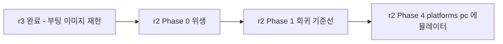

# Phase 5 — 첫 부팅 이미지 · CI · SDK 배포

> **상태**: 미시작
> **범위**: 깨끗한 체크아웃에서 부팅 가능한 이미지를 처음으로 만든다. PetaLinux 산출물과 동작 대조. CI 1건. `make sdk` 크로스 툴체인 배포.
> **선행**: [Phase 4](./phase4-belle-fw-app-package.md)
> **후행**: [r2 Phase 4](../r2/phase4-platform-pc-emulator.md) — 이 phase 의 산출물이 그 전제다.

---

## 1. 배경

### 1.1 이 phase 가 r3 의 목적지다

[plan.md §1.7](./plan.md)의 목적 5번: *"깨끗한 체크아웃 → `make` → 플래시 가능한 이미지"*. Phase 0~4 는 전부 이 순간을 위한 준비였다.

### 1.2 판정은 대조다 — 재작성이 아니다

[principles.md §3](../legacy/principles.md): 동작 보존이 성공 기준이다. **새 빌드 시스템이 "더 낫다" 가 아니라 "같은 것을 낸다" 가 증명돼야 한다.**

| 대조 대상 | 현행(PetaLinux) | 신(Buildroot) |
|---|---|---|
| 부팅 | `BOOT.BIN`(FSBL 경로) + `image.ub` | `BOOT.BIN`(SPL 경로) + Buildroot 커널 이미지 |
| rootfs | `petalinux-image-minimal` | Buildroot rootfs + overlay |
| 앱 오버레이 | `hcproc.img`(수동 `release_elsa.sh`) | `hcproc.img`(`post-image.sh`) |

**바이너리가 바이트 단위로 같을 필요는 없다** — 빌드 시스템이 다르면 당연히 다르다. **동작이 같아야 한다**: 부팅 성공, 4프로세스 기동, HC 프로토콜 응답, 스캔 정상.

### 1.3 SDK — belle-fw 단독 개발의 진입 장벽을 낮춘다

cctv `docs/reference/sdk.md`: `make sdk` 로 크로스 툴체인+sysroot 를 tarball 하나로 뽑아, **전체 Buildroot 트리 없이도 앱만 크로스 컴파일** 가능하게 한다.

지금 belle-fw 개발자는 PetaLinux 전체 설치(수십 GB, 버전 미확정)가 있어야 빌드할 수 있다. **SDK export 가 서면 `belle-fw` 리팩토링([r2](../r2/plan.md)) 작업이 훨씬 가벼워진다** — 매번 전체 이미지를 새로 굽지 않고 SDK 로 앱만 반복 빌드할 수 있다.

### 1.4 목적

1. 첫 부팅 이미지 생성 및 실장비 검증
2. CI 1건(빌드만이라도) — belle-fw 최초
3. `make sdk` 크로스 툴체인 배포 확립

### 1.5 범위 한계

- **[r2 Phase 1](../r2/phase1-regression-baseline.md)의 회귀 테스트 CI 는 별개다.** 이 phase 의 CI 는 "빌드가 되는가" 만 본다
- 여러 모델(300C 등) 지원은 범위 밖 — 500L 단일 보드로 완결

---

## 2. 진행 단계

### Step 5-A. 첫 빌드

```bash
git clone <buildroot> && cd buildroot
git clone <buildroot-healcerion> ../buildroot-healcerion
make BR2_EXTERNAL=../buildroot-healcerion belle_500l_defconfig
make all
```

| # | 작업 |
|---|---|
| A-1 | **완전히 새 머신/컨테이너**에서 실행(개발자 기존 환경의 캐시·전역 설정에 오염되지 않은 상태) |
| A-2 | 빌드 실패 지점을 Phase 0~4 로 역추적해 수정 |
| A-3 | `output/belle-500l/images/` 산출물 확인 — `BOOT.BIN`·커널 이미지·rootfs·`hcproc.img`·`hcproc.ubi.bin` |

### Step 5-B. 실장비 대조

| # | 작업 |
|---|---|
| B-1 | 현행 PetaLinux 이미지로 부팅한 상태를 **기준선으로 먼저 기록**(로그, `dmesg`, 프로세스 목록, HC 프로토콜 응답) |
| B-2 | 신 이미지로 플래시 → 부팅 |
| B-3 | §1.2 표 항목별 대조 |
| B-4 | **[r2 Phase 1](../r2/phase1-regression-baseline.md)의 `lib/test/` 하니스**를 이 신 이미지 위에서 실행 — 이 시점에 그 phase 가 아직 없다면 최소한 `cf_ff_compare.c` 를 호스트에서 돌려 신호처리 경로 자체는 확인 |

### Step 5-C. CI

| # | 작업 |
|---|---|
| C-1 | GitHub Actions(또는 사내 CI) — `make BR2_EXTERNAL=... belle_500l_defconfig && make all` |
| C-2 | 캐시 전략 — `dl/`(다운로드 캐시) 를 CI 캐시로. 전체 빌드 시간이 길면 `ccache` 도입 |
| C-3 | 실패 시 빌드 로그를 아티팩트로 |

> **belle-fw 저장소 CI 가 0건이었다는 사실**([../../review/device-firmware.md §6.5](../../review/device-firmware.md))이 이 phase 에서 처음 깨진다. 다만 이것은 "빌드 CI" 이고, "회귀 판정 CI" 는 [r2 Phase 1](../r2/phase1-regression-baseline.md)의 몫이다 — 두 CI 가 나중에 병합될 수 있다.

### Step 5-D. `make sdk`

| # | 작업 |
|---|---|
| D-1 | 전체 빌드 완료 후 `make sdk` |
| D-2 | 산출물 `output/belle-500l/images/aarch64-buildroot-linux-gnu_sdk-buildroot.tar.gz` |
| D-3 | `relocate-sdk.sh` 동작 확인(cctv 패턴 — 설치 경로 재지정 필수 스크립트) |
| D-4 | belle-fw 자체의 CMake 를 이 SDK sysroot 로 크로스 빌드 가능한지 확인 — [r2 plan.md §0](../r2/plan.md)의 "전제" 가 실사용 가능함을 증명 |

### Step 5-E. 문서화

| # | 작업 |
|---|---|
| E-1 | `board/belle-500l/doc/howto-buildroot.md` — cctv `howto-buildroot.md` 형식으로 착수부터 완료까지 절차 |
| E-2 | `README.md` 에 Buildroot 코어 버전·belle-kernel/belle-u-boot 핀 SHA 명시 |

---

## 3. 검증

| # | 항목 | 명령 | 기대 |
|---|---|---|---|
| 3.1 | **깨끗한 체크아웃 빌드** | 새 컨테이너에서 §2 Step 5-A | exit 0, 전체 이미지 생성 |
| 3.2 | 절대경로 완전 제거 | `grep -rn '/home/jacob' buildroot-healcerion/ belle-fw/` | 0건 |
| 3.3 | **실장비 부팅** | 신 이미지 플래시 | 정상 부팅, 4프로세스 기동 |
| 3.4 | **동작 대조** | §1.2 표 전 항목 | 일치 또는 설명 가능한 차이만 |
| 3.5 | 스캔 정상 | 앱 접속 → 스캔 시작 | 정상 |
| 3.6 | CI | push 시 자동 빌드 | 통과 |
| 3.7 | SDK 배포 | `make sdk` → 별도 머신에서 `belle-fw` 크로스 빌드 | 성공 |
| 3.8 | **A/B 롤백** | 의도적 손상 이미지 업그레이드 시도 | 반대편 뱅크로 정상 복구 |

> **3.3·3.4 가 r3 전체의 최종 게이트다.** 이것이 통과해야 [plan.md §5](./plan.md)의 성공 판정 1번("빌드 재현")이 완성되고, [r2 Phase 4](../r2/phase4-platform-pc-emulator.md)(에뮬레이터)가 착수 가능해진다.

---

## 4. 위험 · 대응

| 위험 | 영향 | 대응 |
|---|---|---|
| **첫 빌드에서 Phase 0~4 의 여러 가정이 동시에 틀린 것으로 드러난다** | 디버깅 범위가 넓다 | 단계별로 격리 확인 — 커널만 먼저 뜨는지([Phase 1](./phase1-kernel-uboot-pin.md) 단독 검증), 그 다음 모듈, 그 다음 앱 순으로 **단계적으로 쌓아 문제 지점을 좁힌다** |
| 실장비가 1대뿐이라 대조 중 손상 위험 | 검증 지연 | [principles.md §6](../legacy/principles.md)의 A/B 이중화를 활용 — **한쪽 뱅크에만 신 이미지를 넣고 문제 시 반대편으로 즉시 복구** |
| CI 환경(x86_64)에서 aarch64 크로스 빌드 시간이 과도 | CI 비용/시간 | `ccache` + 증분 빌드. 최초는 전체, 이후는 변경분만 |
| SDK relocate 가 belle 환경에서 실패 | Step 5-D 무산 | cctv 사내 실적(ubuntu24/en675 SDK 운영 중)을 참고해 동일 메커니즘이므로 실패 시 cctv 케이스와 diff |

---

## 5. 이 phase 가 여는 것



**[r2 plan.md §0](../r2/plan.md)의 전제가 여기서 실제로 충족된다.** r2 는 이제 "가정" 이 아니라 "완료된 사실" 위에서 시작할 수 있다.

---

## 6. cross-reference

- [plan.md §4·§5](./plan.md)
- [principles.md §2·§3·§6](../legacy/principles.md) — 빌드 재현·동작 보존·A/B 이중화
- buildroot-cctv `docs/reference/sdk.md` — SDK export 절차 원본
- [../r2/plan.md §0](../r2/plan.md) — 이 phase 완료가 충족시키는 전제
- [../r2/phase1-regression-baseline.md](../r2/phase1-regression-baseline.md) — 회귀 CI 와의 관계
- [../../review/device-firmware.md §6.5](../../review/device-firmware.md) — CI 0건 실측
