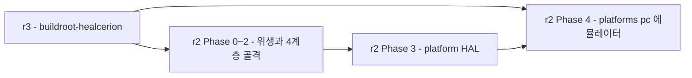
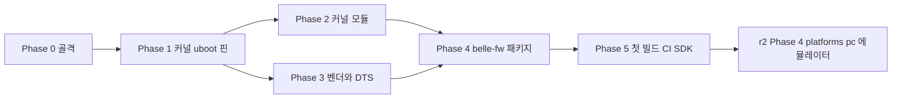

# `buildroot-healcerion` 도입 — r3 Plan

> **범위**: `belle-fw` 빌드 시스템을 PetaLinux/bitbake 3갈래에서 **Buildroot `BR2_EXTERNAL`** 로 이관한다. **[r2](../r2/plan.md)(belle-fw feature-first 리팩토링)의 전제**이며, [r2 plan.md §0](../r2/plan.md)가 "Buildroot 가 있다는 가정" 이라 부른 그 가정을 실제로 만드는 작업이다.
> **목표 구조의 정본**: **cctv-platform `device/buildroot-cctv`** — 같은 임베디드 리눅스 카메라/DVR 라인에서 이미 PetaLinux 계열 없이 Buildroot 만으로 18개 보드를 낸다. 설계안이 아니라 **재현**이다.
> **원칙**: [principles.md §2](../legacy/principles.md)(빌드 재현이 모든 것에 선행) · [assessment.md §1.3](../legacy/assessment.md)(Buildroot 판단 근거).
> **현행 구조 SOT**: [../../review/device-firmware.md](../../review/device-firmware.md) §2·§9 · [../../review/belle-hardware.md](../../review/belle-hardware.md).

**실측 기준**: buildroot-cctv `master`(2026-07-28) · belle-fw `origin/production-fw-ver2.0`(HEAD 2026-07-01) · belle-bsp `master` · belle-kernel `master`(2021-10-06) · belle-u-boot `master`(2022-04-22).

---

## 0. 왜 r2 보다 먼저인가

[assessment.md §3](../legacy/assessment.md) 순서표: **항목 2(Buildroot)는 선행 조건이 없고, 항목 3(`core`/`ports`+`platforms/pc` 에뮬레이터)이 항목 2를 선행 조건으로 요구한다.** [r2 plan.md](../r2/plan.md)는 이미 이 순서를 전제로 적혀 있다 — "이 계획은 빌드 재현이 끝난 상태에서 시작한다."

**r3 은 그 전제를 실제로 만족시키는 별도 트랙이다.** r1(현재 `sonex-framework`, 작성 당시는 `moana`)·r2(belle-fw feature-first) 어느 쪽에도 의존하지 않고 **지금 바로 착수 가능**하다 — belle-fw 의 현재 소스 레이아웃(리팩토링 이전)을 그대로 패키징 대상으로 삼는다. Buildroot 패키지 정의는 내부 디렉토리 구조를 몰라도 되고 빌드 진입점(`cmake` 호출)과 설치 결과물만 알면 된다.



---

## 1. 현 상태 — 실측

### 1.1 빌드가 3갈래로 갈라져 절대경로로 이어져 있다

[device-firmware.md §2](../../review/device-firmware.md) 의 요지를 belle-fw 관점에서 다시 정리한다.

| 갈래 | 내용 | 문제 |
|---|---|---|
| **PetaLinux 계층** | `belle-bsp`(프로젝트) + `belle-kernel`(linux-xlnx 포크) + `belle-u-boot` | `belle-bsp/project-spec/meta-user/conf/petalinuxbsp.conf:15` 의 `EXTERNALSRC_pn-sonon = "/home/jacob/jacob-work-2020/belle_v202002_new/belle-fw"` — **특정 개발자 머신 경로** |
| **ad-hoc 셸** | `belle-bsp/release_elsa.sh` | `petalinux-build` → `petalinux-package` → `sudo mkfs.ubifs` 수동 시퀀스. **belle-fw 와 belle-bsp 양쪽에 사본이 있고 서로 다르다** |
| **저장소 밖** | FSBL·PMU·`.xsa`·커널 모듈 3종 | Vivado 프로젝트 없음, 커널 모듈에 Makefile 없음 |

### 1.2 남는 진짜 블로커는 하나뿐이다 — 그리고 그것은 이 작업의 전제가 아니다

[assessment.md §1.3](../legacy/assessment.md) 실측:

| 확인 | 위치 |
|---|---|
| **`psu_init_gpl.c`**(17,791줄, MIT) — PS 초기화, 보드 고유부 | `belle-bsp/project-spec/hw-description/psu_init_gpl.c` |
| **`CONFIG_SPL=y` + `SPL_LOAD_FIT`** | `belle-u-boot/configs/xilinx_zynqmp_virt_defconfig` |

**ZynqMP 에서 U-Boot SPL 이 FSBL 을 대체할 수 있고, 그 SPL 은 이미 빌드된다.** FSBL 소스 부재가 부팅을 막지 않는다. `.xsa` Vivado 원본 부재는 **PL 재설계 시에만** 필요하다 — 지금 있는 비트스트림을 그대로 패키징하면 빌드는 된다.

| 프리빌트 자산 | 위치 |
|---|---|
| FSBL ELF | `belle-bsp/vivado-hw-xsa/es3-fsbl-v00-01-00.elf` |
| PMU ELF | `belle-bsp/vivado-hw-xsa/es3-pmu-v00-01-00.elf` |
| `.xsa`(하드웨어 기술) | `belle-bsp/vivado-hw-xsa/es3_v00.01.00.xsa` |
| 디바이스 트리 출발점 | `belle-bsp/project-spec/meta-user/recipes-bsp/device-tree/files/system-user.dtsi` |

### 1.3 커널·U-Boot 는 이미 별도 저장소로 갈라져 있다 — cctv 와 같은 형태

| | cctv | belle |
|---|---|---|
| 커널 포크 | `linux-cctv.git`(태그 `v4.19.91-nt98566-ipc`) | **`belle-kernel`**(linux-xlnx 포크, `master` HEAD 2021-10-06) |
| U-Boot 포크 | `u-boot-cctv.git`(태그 `v2019.04-nt98566-ipc`) | **`belle-u-boot`**(`master` HEAD 2022-04-22) |
| Buildroot 자체 포크 | `buildroot.git`(태그 `2021.02.3-cctv`) | **없음 — 이 작업의 산출물** |

**커널·U-Boot 는 이미 cctv 와 같은 배치다.** belle 에 없는 것은 이 셋을 엮는 `BR2_EXTERNAL` 트리 하나뿐이다.

belle-kernel·belle-u-boot 의 defconfig 도 이미 ZynqMP 표준 이름을 쓴다: `arch/arm64/configs/xilinx_zynqmp_defconfig` · `configs/xilinx_zynqmp_virt_defconfig`.

### 1.4 커널 모듈 3종 — Makefile 은 없지만 템플릿과 소스는 있다

`modules/plif/readme.makefile`(belle-fw) 실측:

```make
XILINX_KERNEL_DIR ?= /home/jacob/BELLE_WORK/belle-kernel/linux-xlnx/   ← 절대경로
ARCH ?= arm64
CROSS_COMPILE ?= aarch64-linux-gnu-
plif-driver-objs := plif.o plif_dma.o
obj-m += plif-driver.o
all:
	make ARCH=$(ARCH) CROSS_COMPILE=$(CROSS_COMPILE) M=$(PWD) -C $(XILINX_KERNEL_DIR) modules
```

**이것은 거의 완성된 Kbuild 파일이다.** `XILINX_KERNEL_DIR` 을 Buildroot 의 `$(LINUX_DIR)` 로, `all` 타겟을 Buildroot `kernel-module` 인프라 훅으로 바꾸면 그대로 쓸 수 있다.

| 모듈 | 소스 | 비고 |
|---|---|---|
| `plif`(PL-PS 인터페이스) | `plif.c`+`plif_dma.c`(3,562+1,450) + 헤더 | `readme.makefile` 이미 있음 |
| `zynqdma` | `dmaengine.c`+`zynqmp_dma.c`(1,298+1,286) | `zynqmp_dma.c.org` **사본 존재**([r2 Phase 0](../r2/phase0-hygiene-protocol-sot.md) 류의 위생 이슈] |
| `msp430_drv` | `msp430_driver.c`(호스트 측 I2C 드라이버) | **belle-msp(별도 저장소)의 MSP430 자체 펌웨어와 다른 것** — 이것은 ZynqMP 커널이 MSP430 을 말 거는 드라이버 |

**cctv 에는 이 패턴이 없다** — `directory-structure.md` 의 `*-ko/` 패키지는 **벤더가 준 프리빌트 `.ko` 블롭**을 담는다(소스가 없다). belle 은 반대로 **소스는 있고 빌드 파일이 없다** — Buildroot 코어의 `kernel-module` 인프라(`package/pkg-kernel-module.mk`, `$(eval $(kernel-module))`)를 그대로 쓸 수 있는 더 쉬운 경우다.

### 1.5 `NE10` — 정체 확인 필요

`ne10_lib/` 에 **헤더 8개뿐**([r2 plan.md §1.1](../r2/plan.md)). ARM NE10 은 실제로는 오픈소스 라이브러리(`projectNe10/Ne10`)이므로, cctv 의 "벤더 SDK 블롭" 패턴이 아니라 **일반 오픈소스 Buildroot 패키지**로 다뤄야 할 가능성이 높다. **착수 시 확인**: 지금 링크되는 `.a`/`.so` 가 어디서 오는지(PetaLinux sysroot 추정) 부터 밝힌다.

### 1.6 A/B 뱅크 구조는 Buildroot 강점 구간과 일치한다

[assessment.md §1.3](../legacy/assessment.md): rootfs 가 initramfs(RAM), 플래시 118MiB QSPI, 앱 오버레이 10MiB — **Buildroot 가 잘하는 구간**이다. [device-firmware.md §4](../../review/device-firmware.md) 의 mtd0~7 파티션을 `post-image` 스크립트로 재현할 수 있다.

### 1.7 목적

1. `belle-bsp`+`release_elsa.sh` 의 ad-hoc 3갈래를 **`BR2_EXTERNAL` 트리 하나**로
2. `EXTERNALSRC_pn-sonon` 절대경로 제거 — belle-fw 를 **git-pinned custom package** 로
3. 커널 모듈 3종에 **실제로 동작하는 Buildroot 패키지**를 준다
4. A/B 뱅크를 **재현 가능한 `post-image` 스크립트**로
5. **깨끗한 체크아웃 → `make` → 플래시 가능한 이미지** — [r2 Phase 4](../r2/phase4-platform-pc-emulator.md) 에뮬레이터의 실제 전제

### 1.8 범위 한계

- **PL 비트스트림을 재생성하지 않는다.** `.xsa` Vivado 원본이 없으므로 기존 비트스트림(`configs/500l/top_osc40_cmos_221018.bin`, IDCODE `0x04a42093`)을 그대로 패키징한다
- **FSBL 을 복구하지 않는다.** SPL 이 대체한다
- **belle-msp(MSP430 자체 펌웨어, TI CCS)는 범위 밖** — 별도 툴체인, 별도 저장소
- **belle-fw 내부 구조를 바꾸지 않는다** — [r2](../r2/plan.md)의 몫. 여기서는 "현재 있는 그대로" 를 패키지 하나로 감싼다

---

## 2. 목표 구조 — buildroot-cctv 정본

### 2.1 저장소 배치

```
buildroot-healcerion/            ← 신설. BR2_EXTERNAL 트리
  external.desc                  name: HEALCERION / desc: ultrasound device firmware
  external.mk                    package/*/*.mk 3단계 glob include
  Config.in                      board/Config.in + package/*/Config.in source
  board/
    belle-500l/
      doc/howto-buildroot.md
      belle-500l_linux_defconfig      ← belle-kernel arch/arm64/configs/xilinx_zynqmp_defconfig 이관
      belle-500l_uboot_defconfig      ← belle-u-boot configs/xilinx_zynqmp_virt_defconfig 이관
      dts/                            system-user.dtsi 이관
      overlay/
        etc/  config/modules/
      post-build.sh
      post-image.sh                  ← A/B 뱅크 UBI 오버레이 생성
      pmufw/                          es3-pmu ELF
  package/
    soc/zynqmp/
      xilinx-bitstream/               ★ local, 기존 .bin 패키징
    lib/
      ne10/                           확인 후 배치(§1.5)
    app/
      belle-fw/                       ★ git-pinned cmake-package
      plif-driver/                    kernel-module
      zynqdma-driver/                 kernel-module
      msp430-i2c-driver/              kernel-module
  configs/
    belle_500l_defconfig
  script/
    build-belle-500l.sh
```

### 2.2 명명 규약 (cctv 실측)

| 대상 | 규약 | cctv 실례 |
|---|---|---|
| 보드 디렉토리 | `<soc>-<variant>` | `nt98566-ipc` · `en675-ipc` |
| 패키지 그룹 | `soc/` · `app/` · `lib/` · `thirdparty/` · `web/` — **평탄 배치 금지** | 5그룹, `external.mk` 가 3단계 glob |
| defconfig | `<board>_defconfig` | `nt98566_ipc_defconfig` |
| 커널 모듈 패키지 | `<name>-ko/`(프리빌트) 또는 코어 `kernel-module` 인프라(소스 빌드) | cctv 는 전자, **belle 은 후자**(§1.4) |

**belle 은 보드가 1개(500L)뿐이므로 `board/belle-500l/` 하나로 시작**하되, [architecture.md](../legacy/architecture.md) 가 언급하는 다른 모델(300C 등)이 살아나면 cctv 처럼 보드 디렉토리를 늘리는 구조로 확장 가능하다.

### 2.3 패키지 매핑 — cctv 대응

| belle 현행 | 목표 패키지 | cctv 대응(형식 근거) |
|---|---|---|
| `belle-fw`(CMake 슈퍼프로젝트, sonon+bcd+deviced+watchdogd+lib+image_proc) | `package/app/belle-fw/belle-fw.mk` — **git SHA 하드 핀**, `cmake-package` | `package/app/ipc-app/ipc-app.mk` |
| `belle-bsp/vivado-hw-xsa/*.bin`(비트스트림) | `package/soc/zynqmp/xilinx-bitstream/` — **local, INSTALL_STAGING 없이 이미지에 직접** | `package/soc/nt98566/nt98566-sdk/`(local, `generic-package`) |
| `belle-bsp/vivado-hw-xsa/es3-pmu-*.elf` | `board/belle-500l/pmufw/` — `BR2_TARGET_UBOOT_ZYNQMP_PMUFW` | (cctv 에 대응 없음 — ZynqMP 고유) |
| `modules/plif` · `zynqdma` · `msp430_drv` | `package/app/{plif-driver,zynqdma-driver,msp430-i2c-driver}/` — **Buildroot 코어 `kernel-module` 인프라** | (cctv 는 프리빌트라 대응 없음. Buildroot 코어 기능 직접 사용) |
| `belle-kernel`(linux-xlnx 포크) | Buildroot `BR2_LINUX_KERNEL_CUSTOM_GIT` — **git SHA 핀** | `linux-cctv.git`(태그 핀) |
| `belle-u-boot` | Buildroot `BR2_TARGET_UBOOT_CUSTOM_GIT` | `u-boot-cctv.git`(태그 핀) |
| `belle-bsp` 자체 | **소멸** — 역할이 `board/belle-500l/` + 각 패키지로 분산 | (cctv 에 BSP 프로젝트 자체가 없다 — Buildroot 가 그 역할) |

---

## 3. Phase 구성

| Phase | 내용 | 상태 |
|---|---|---|
| **[Phase 0](./phase0-external-tree-skeleton.md)** | `BR2_EXTERNAL` 골격 — `external.desc/mk`, `Config.in`, `board/`, `package/` 그룹, 최상위 `make` 진입점 | 미시작 |
| **[Phase 1](./phase1-kernel-uboot-pin.md)** | 커널·U-Boot 를 git SHA 핀 custom package 로. **FSBL→SPL 대체 + PMU 임베드** | 미시작 |
| **[Phase 2](./phase2-kernel-module-packages.md)** | 커널 모듈 3종 — `readme.makefile` → 실동작 Buildroot 패키지 | 미시작 |
| **[Phase 3](./phase3-vendor-and-devicetree.md)** | 비트스트림 패키징 · `NE10` 정체 확인·패키지화 · 디바이스 트리 저장소 이관 | 미시작 |
| **[Phase 4](./phase4-belle-fw-app-package.md)** | `belle-fw` 를 git-pinned cmake-package 로. **`post-image` A/B 뱅크 재현** | 미시작 |
| **[Phase 5](./phase5-first-build-ci-sdk.md)** | **첫 부팅 가능 이미지** · CI 1건 · `make sdk` 크로스 툴체인 배포 | 미시작 |

### Phase 의존



- **0 → 1 은 직렬**이다. 골격 없이 패키지를 못 만든다
- **2·3 은 병렬** — 서로 독립(커널 모듈은 커널에 종속, 벤더/DTS 는 보드 설정에 종속)
- **4 는 2·3 뒤** — belle-fw 가 커널 모듈과 디바이스 트리 노드에 의존한다(예: `plif` 를 여는 캐릭터 디바이스)
- **5 가 [r2 Phase 4](../r2/phase4-platform-pc-emulator.md) 로 이어진다** — 실제 이미지가 나와야 그 위에서 platforms/pc 작업이 의미를 갖는다

---

## 4. Phase 요약

### Phase 0 — `BR2_EXTERNAL` 골격

cctv 의 5원칙(`board/`·`package/{soc,app,lib,thirdparty,web}`·`configs/`·`external.mk`·`Config.in`)을 그대로 이식한다. **belle 은 web 패키지가 없으므로 그룹은 `soc/app/lib` 3개로 축소.**

### Phase 1 — 커널·U-Boot 핀 + FSBL→SPL

- **1-A** `belle-kernel`·`belle-u-boot` 를 Buildroot `BR2_..._CUSTOM_GIT` 로 핀(cctv `linux-cctv`/`u-boot-cctv` 패턴)
- **1-B** `xilinx_zynqmp_defconfig`(커널) · `xilinx_zynqmp_virt_defconfig`(U-Boot, `CONFIG_SPL=y` 확인)를 각각 `board/belle-500l/*_defconfig` 로
- **1-C** **FSBL 미사용** 명시 — SPL 이 그 역할. `psu_init_gpl.c` 를 U-Boot SPL 빌드에 연결
- **1-D** PMU — `es3-pmu-v00-01-00.elf` 를 `BR2_TARGET_UBOOT_ZYNQMP_PMUFW` 로 임베드

### Phase 2 — 커널 모듈 3종

- **2-A** `plif`(`readme.makefile` 이 거의 완성돼 있다) → Buildroot `kernel-module` 인프라로 이관
- **2-B** `zynqdma` — **`zynqmp_dma.c.org` 사본 정리**가 선행([r2 Phase 0](../r2/phase0-hygiene-protocol-sot.md) 류의 위생 작업을 여기서 먼저)
- **2-C** `msp430_drv`(호스트 측 I2C 드라이버, belle-msp 와 무관) → 동일 인프라

### Phase 3 — 벤더 패키지 + 디바이스 트리

- **3-A** 비트스트림 `local` 패키지 — `.xsa` 없이 기존 `.bin` 을 그대로
- **3-B** `NE10` 정체 확인 → 실제 오픈소스면 표준 Buildroot 패키지, 벤더 블롭이면 cctv `nt98566-sdk` 패턴
- **3-C** `system-user.dtsi` 를 `board/belle-500l/dts/` 로. `.xsa` 자동생성 의존 제거

### Phase 4 — `belle-fw` 앱 패키지 + A/B 재현

- **4-A** `belle-fw.mk` — **git SHA 하드 핀**, `IPC_APP_GIT_SUBMODULES` 대응 여부 확인(belle-fw 는 서브모듈 없음 — 단순 `cmake-package`)
- **4-B** `EXTERNALSRC_pn-sonon` 절대경로 제거 — 의존이 `DEPENDENCIES` 목록(Phase 2 커널 모듈 포함)으로 명시
- **4-C** `post-image.sh` — `release_elsa.sh` 의 `sudo mkfs.ubifs`+`ubinize` 를 재현. mtd2/3(커널 A/B) · mtd4/5(앱 오버레이 A/B) 생성
- **4-D** `hcproc.sh`(S95 오버레이 복사) 배치 방식 유지 여부 결정 — Buildroot 정규 install 로 바꿀지, 기존 방식(A/B 롤백 가치)을 보존할지는 **r3 자체 판단으로 확정한다**. [r2 Phase 8](../r2/phase8-feature-firmware-process.md)은 이 배포 방식이 이미 정해져 있다는 것을 전제로 시작하므로 결정 주체는 r3 다

### Phase 5 — 첫 빌드 · CI · SDK

- **5-A** 깨끗한 체크아웃 → `make BR2_EXTERNAL=../buildroot-healcerion belle_500l_defconfig && make all` → 이미지
- **5-B** 실장비 부팅 확인 — PetaLinux 산출물과 **동작 대조**([principles.md §3](../legacy/principles.md))
- **5-C** CI 1건 — 빌드만이라도(belle-fw 최초, [r2 Phase 1](../r2/phase1-regression-baseline.md)의 회귀 테스트 CI 와 별개 트랙)
- **5-D** `make sdk` — 크로스 툴체인+sysroot 배포(cctv `docs/reference/sdk.md` 패턴). **belle-fw 단독 개발 시 전체 Buildroot 트리 불필요**

---

## 5. 성공 판정

| # | 항목 | 기준 | 현재 |
|---|---|---|---|
| 1 | **빌드 재현** | 깨끗한 체크아웃 → `make` 1커맨드 → 부팅 이미지 | PetaLinux 3갈래 + 절대경로 |
| 2 | 절대경로 제거 | `grep -rn '/home/jacob'` | 0건 |
| 3 | 커널 모듈 빌드 | `plif`·`zynqdma`·`msp430_drv` 가 Buildroot 로 빌드 | Makefile 없음 |
| 4 | **동작 불변** | 신 이미지 vs 현행 PetaLinux 이미지 부팅·스캔 대조 | — |
| 5 | A/B 재현 | `post-image` 가 mtd4/5 오버레이를 생성 | 수동 셸(`release_elsa.sh`) |
| 6 | 단일 정본 | 커널/U-Boot 버전이 defconfig 하나로 고정 | PetaLinux 버전 미확정 |
| 7 | SDK 배포 | `make sdk` 로 크로스 툴체인 tarball 생성 | 없음 |

---

## 6. 위험 · 대응

| 위험 | 영향 | 대응 |
|---|---|---|
| **belle-kernel·belle-u-boot 가 4~5년 정지 상태**([device-firmware.md §1](../../review/device-firmware.md)) — Buildroot 2021.02 계열과 궁합 확인 필요 | 빌드 실패 | cctv 가 쓰는 Buildroot 버전(`2021.02.3-cctv`)과 belle 커널(2021-10) 시점이 가깝다 — **호환 가능성이 높다.** 착수 시 실제 확인 |
| `.xsa` 없이 만든 이미지가 실제 하드웨어와 불일치 | 부팅 실패 | PS 초기화는 `psu_init_gpl.c` 로 커버된다. [Phase 5-B](./phase5-first-build-ci-sdk.md) 부팅 테스트에서 바로 드러나므로 별도로 미리 검증할 필요 없이 그 단계에서 확인하면 된다 |
| NE10 이 실제로는 링크만 되고 소스가 다른 버전 | 신호처리 결과 회귀 | 3-B 에서 **버전까지 확인**. 다르면 원 버전을 pin |
| `belle-bsp` 소멸에 대한 조직 저항 | 절차 마찰 | **소멸이 아니라 이관** — 정보는 `board/belle-500l/`+패키지로 전부 보존됨을 명시 |
| Buildroot 러닝커브 | 착수 지연 | cctv 사내 실적(18보드 운영 중)이 있으므로 **레퍼런스가 이미 사내에 있다** |

---

## 7. cross-reference

- buildroot-cctv `docs/architecture/directory-structure.md` · `docs/reference/sdk.md` · `package/app/ipc-app/ipc-app.mk` · `package/soc/nt98566/nt98566-sdk/nt98566-sdk.mk` · `external.mk` — `cctv/device/buildroot-cctv/`
- [assessment.md §1.3·§3](../legacy/assessment.md) — Buildroot 판단의 원 근거
- [../r2/plan.md §0](../r2/plan.md) — 이 작업을 전제로 하는 belle-fw 리팩토링
- [../../review/device-firmware.md §2·§4·§9](../../review/device-firmware.md) — 현행 빌드 파편화·A/B 뱅크·재현 불가 지점 실측
- [../../review/belle-hardware.md](../../review/belle-hardware.md)
