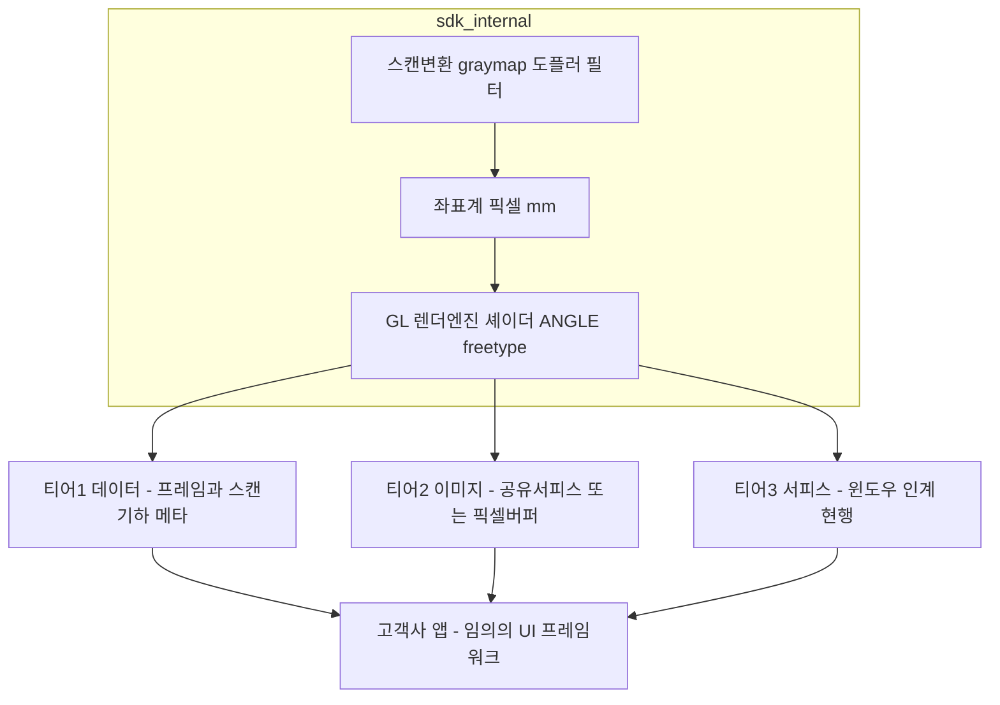
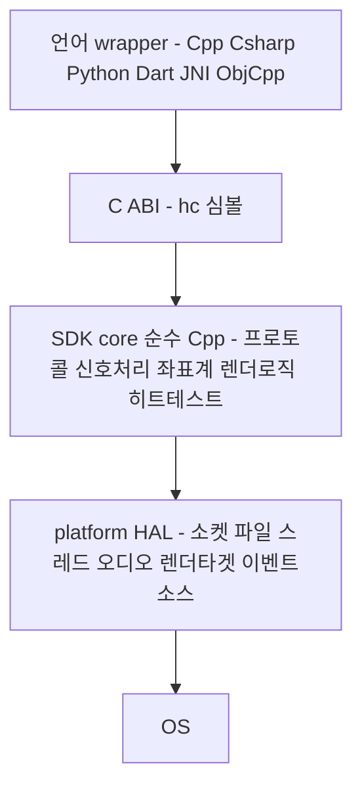

# 렌더링 경계 — 언어별 wrapper 의 최대 기술 장애

> **왜 이 문서가 있는가**: 외부 고객사에 SDK 를 제공하려면 각 언어·프레임워크용 wrapper 가 필요한데, **그 작업이 수렴하지 않는 이유가 렌더링 경계에 있다.** 데이터 API 는 어느 언어에서도 자명하게 감싸지지만, "네이티브 윈도우를 넘겨받아 SDK 가 직접 그린다"는 계약은 **언어가 아니라 UI 프레임워크마다** 새로 짜야 한다.
> **근거**: `sonex-framework` `master` `f336e25b` · `sonex-app` 코드 직접 확인(2026-07-29).
> **표기**: `[실측]` 코드 확인 · `[계획서]` 2023년 힐세리온 문서 · `[제안]` 우리 판단

## 1. 결론 먼저

**렌더링을 SDK 에서 빼자는 것이 아니다.** `ImageRenderer` 38,501 LOC 의 도메인 가치(스캔 변환·graymap·도플러 합성·좌표계)는 그대로 두어야 한다. 고객사가 각자 구현하면 화질과 측정값이 갈라진다.

**바꿔야 하는 것은 경계에서 주고받는 것 한 가지다.**

| | 지금 | 바꾼 뒤 |
|---|---|---|
| SDK 가 **받는 것** | **네이티브 윈도우 핸들** — `hc_PrepareRenderer(void* nativeWindow, bool useAppThread, int streamIndex)` | 렌더 타겟 크기 |
| SDK 가 **주는 것** | 없음 (앱 윈도우에 직접 그림) | **완성된 프레임** — 공유 서피스 핸들 또는 픽셀 버퍼 |
| 화면에 붙이는 주체 | **SDK** | **앱** |

동영상 디코더 라이브러리가 정확한 대응이다. 디코더는 윈도우를 받지 않고 **디코딩된 프레임을 내준다.** 그렇다고 디코딩을 라이브러리에서 뺀 것이 아니다.

## 2. 지금 계약이 만든 결과 — 실측

`[실측]` 앱↔SDK 렌더 결합이 **플랫폼마다 4갈래**로 갈라졌고, Windows 는 `flutter_native_view` + 자체 HWND + 16ms `SetWindowPos` 추종 **901줄**이 필요했다([../review/legacy/sonex-rendering.md](../review/legacy/sonex-rendering.md)).

**이것은 구현이 미숙해서가 아니라 경계가 그렇게 그어져 있으면 필연이다.** wrapper 로 해결되지 않는 이유가 셋이다.

| # | 문제 | 왜 wrapper 밖인가 |
|---|---|---|
| **①** | **합성(composition)** | SDK 가 자기 윈도우를 가지면 그 윈도우는 앱 위젯 트리 **밖**에 뜬다. Z-order·클리핑·스크롤 추종이 깨지고 다이얼로그를 위에 올릴 수 없다. Windows 901줄이 이걸 메우려던 코드다 |
| **②** | **스레드 친화성** | GL 컨텍스트는 스레드에 묶인다. `hc_PrepareRenderer(..., bool useAppThread, ...)` 의 이 플래그 자체가 미해결의 흔적이다. 관리형 런타임(C#·Java·Dart)은 자기 스레드 모델이 있고 UI 스레드 블로킹을 금지하는데, wrapper 가 SDK 의 스레드 계약을 바꿀 수 없다 |
| **③** | **조합 폭발** | "C# wrapper" 가 하나가 아니다 — WinForms(HWND)·WPF(`HwndHost`/`D3DImage`)·MAUI·Unity 가 다르다. Dart 도 Flutter Windows(위젯당 HWND 없음)·Android(SurfaceView)·iOS(Platform View)가 다르다. **wrapper 수 = 언어 × UI프레임워크 × 플랫폼** |

`[계획서]` **2023년 계획서 자신이 이 경계를 비워 뒀다** — "GUI 연결을 위한 Front-end 매개 값" 항목에 Windows(Window handle)·Android(GL surface view)·iOS(GLK view)는 적었으나 **`Flutter: 미상`** 이라고 남겼다. 미해결인 채 착수했고, 위 4갈래가 그 귀결이다.

## 3. 무엇이 SDK 에 남아야 하는가 — 기준은 좌표계다

경계선의 기준은 "규제 항목이냐"가 아니라 **"어느 좌표계에 속하느냐"** 다. 그리고 실측해 보면 힐세리온은 **이 기준을 이미 지키고 있다.**

| 좌표계 | 항목 | 소관 | 이유 |
|---|---|---|---|
| **영상 좌표계** — 픽셀↔mm 변환 필요 | 스캔 이미지 · **깊이 눈금** · **측정 캘리퍼와 수치** · ROI · PW/M 커서 | **SDK** | 영상 기하와 어긋나면 **측정값이 틀린다** |
| **화면 좌표계** — 레이아웃 항목 | HC 로고 · 환자명 · Study UID · 타임스탬프 · **MI/TIB** · Preset · FPS · Freeze | **앱** | 영상과 무관한 고정 위치. 환자·검사 정보는 앱/ADK 도메인 |

### 3.1 텍스트·폰트는 SDK 의 정당한 일부다

`[실측]` SDK 렌더러가 그리는 텍스트는 **전부 영상 종속**이다.

| 대상 | 텍스트 객체 |
|---|---|
| 깊이 눈금 (`HCScanSideRuler`) | `depthText` · `topCmText`(줌 시 첫 cm) · `graduationTexts`(눈금별 deque) |
| 측정 결과 (`measure/` 7종) | `HCMeasureDistance`·`Length`·`Angle`·`Ellipse`·`Time`·`BVF` 의 `resultText`·`angleText`·`volumeText`·`bModeResultText` |

**앱으로 뺄 수 없다.** 앱이 그리려면 픽셀↔mm 변환·눈금 간격 계산·줌/스크롤 시 좌표 재계산을 **다시 구현**해야 하고, 그 순간 **좌표계가 두 곳에 생긴다.** 그것이 화질·측정 정확도가 갈라지는 지점이다.

→ **freetype 은 SDK 에 남는다.** 개선 여지는 아키텍처가 아니라 **패키징**이다. `hc_SetFontRawData(rawData, size)` 경로가 이미 있으므로 **배포 패키지에 기본 폰트를 동봉**하면 고객사가 폰트를 준비할 필요가 없어진다. 현재는 `hc_SetFontFilePath` 로 앱이 경로를 대야 한다.

### 3.2 MI/TI 를 앱이 그리는 것은 정당하다

`[실측]` 음향출력 지수(MI/TIB)는 SDK 렌더러에 **0건**이고 앱이 그린다(`scan_page.dart`·`scan_dual_panel_chrome.dart`·`scan_controller.dart`). 앱 주석이 이유를 드러낸다.

> `/// - HC 로고 / 환자명 / Study UID / 타임스탬프 / MI/TIB 등은 **scan_page.dart 의 기존 …**`

**MI/TIB 는 로고·환자명·Study UID·타임스탬프와 한 정보 패널**이며, 초음파 장비 화면의 전형적인 annotation bar 다(파일명 `chrome` 이 정확한 명명). 근거 셋이 모두 성립한다.

1. MI/TI 만 SDK 로 옮기면 **하나의 패널이 두 렌더러로 쪼개진다**
2. **영상 좌표와 무관**한 화면 모서리 고정 텍스트다
3. `[계획서]` **SDK 는 환자 정보를 몰라야 한다** — 인터페이스 명세가 `PatientInfo` 를 두고 *"SDK 내부에서는 파일 처리 외에는 사용하지 않음"* 이라고 못박았다

**다만 문서화 항목이 하나 남는다.** `ScannerModelSpec` 의 `acusticOutputMi`·`acusticOutputTib` 에는 *"인증 요구 사항"* 주석이 있다. 완제품 인증 책임은 제품을 내는 쪽에 있으므로 분담 자체는 정상이나, **명시되지 않으면 고객사가 빠뜨린다.** → 지원 경계([goal.md](goal.md) B6)에 **"SDK 는 데이터를 제공하고 표시는 통합자 책임"** 을 명시해야 한다.

## 4. 제안 — 출력 계층을 셋으로 나눈다

| 계층 | SDK 가 주는 것 | 플랫폼 결합 | wrapper 난이도 |
|---|---|---|---|
| **① 데이터** | 디코딩된 프레임 + 스캔 기하 메타데이터 | 없음 | 모든 언어에서 자명 |
| **② 이미지** | 스캔변환·graymap·도플러·눈금·측정텍스트까지 끝낸 **완성 프레임** | 없음 | **쉬움. 도메인 가치 전부 보존** |
| **③ 서피스** | 윈도우를 받아 직접 그림 (현행) | **높음** | UI 프레임워크마다 별도 |

**②가 정식 지원 경로가 되어야 한다.** 그러면 wrapper 의 일은 "프레임을 프레임워크의 이미지 경로에 얹기"로 줄고, 모든 UI 프레임워크가 **표준 경로**를 갖고 있다 — Flutter `Texture`+`TextureRegistrar` · WPF `D3DImage` · Android `SurfaceTexture` · iOS/macOS `CVPixelBuffer`/`MTLTexture`. 901줄이 아니라 수십 줄이고, **합성·Z-order·스레드 문제가 전부 사라진다.**

### 4.1 반환 형태가 ANGLE 노출 여부를 가른다

| 반환 형태 | ANGLE 노출 | 성능 |
|---|---|---|
| GL 텍스처 ID | **남음** — 고객사와 GL 컨텍스트 공유 필요 | 최상 |
| **공유 서피스**(IOSurface·AHardwareBuffer·D3D shared handle) | **없음** | 제로카피 |
| CPU 픽셀 버퍼 | **없음** | 복사 2회 (폴백) |

**공유 서피스가 본선, 픽셀 버퍼가 폴백**이다. 이 순서를 뒤집으면 "성능 때문에 안 된다"는 반론이 정당해진다 — 60fps·1024×768 RGBA readback 은 양방향 약 180MB/s 로 모바일에서 전력·대역폭 부담이 실재한다.

**이렇게 하면 ANGLE 은 SDK 안에 남되 고객사 눈에서 사라진다.** 지금은 고객사가 `libEGL`·`libGLESv2` 를 링크하고 순서대로 로드하고 GL 스레드를 맞춰야 한다([gap.md §4](gap.md)). 바꾸면 **내부 구현 상세**가 된다.

### 4.2 ANGLE 은 계속 필요하다 — 역할만 바뀐다

`ImageRenderer` 38,501 LOC 가 **OpenGL ES 로 작성돼 있다**(glad + GLES2/3 셰이더). 텍스처로 내보내든 윈도우에 그리든 **GL 구현체는 여전히 필요하다.**

| 플랫폼 | ANGLE 없이 가능한가 |
|---|---|
| **Windows** | **불가** — 네이티브 GLES 가 없다. ANGLE 이 존재하는 이유가 이것이다 |
| **iOS·macOS** | **불가** — Apple 이 OpenGL ES 를 deprecate 했다. ANGLE Metal 백엔드가 우회로다 |
| Android | 가능하나 ANGLE Vulkan 백엔드가 드라이버 편차에 유리 |

ANGLE 을 빼려면 렌더러를 **D3D11·Metal·Vulkan 으로 세 번 다시 써야** 한다. ANGLE 이 절약해 준 것이 정확히 그 3중 작업이다.

**바뀌는 것은 노출 여부다.**

| | 지금 | 티어 ② 이후 |
|---|---|---|
| 고객사가 `libEGL`·`libGLESv2` 링크 | **필요** | 불필요 |
| 로드 순서 지식 | **필요**(앱 Dart 소스에만 존재) | 불필요 |
| GL 컨텍스트·스레드 정합 | **필요** | 불필요 |
| 재배포물 포함 | 포함 | 포함(변화 없음) |

**지금 ANGLE 은 자산이자 부채다** — 크로스플랫폼 GLES 를 한 벌로 유지하게 해 주는 대신 고객사 빌드·로드·라이선스 부담으로 노출된다. **티어 ②는 부채 쪽만 걷어낸다.** 그리고 §4.1 의 공유 서피스는 ANGLE 이 만들기에 적합한 형태다 — D3D11 백엔드가 shared handle 을, Metal 백엔드가 IOSurface 기반 텍스처를 자연스럽게 낸다.

## 5. Flutter 결합의 현재 모습 — 변경 지향점의 기준선

`[실측]` Dart 쪽 렌더 경계 전부가 `lib/modules/scan/open_gl_view.dart`(265줄) + `native_view_widget.dart`(117줄)에 있다.

### 5.1 `Texture` 위젯을 쓰지 않는다

**Flutter 의 external texture 경로(`Texture` 위젯 · `TextureRegistrar` · `registerTexture`)가 앱 전체에서 0건**이다. 즉 **티어 ②가 아예 없고**, 네 플랫폼 모두 서피스 인계 방식이다.

| 플랫폼 | 결합 방식 |
|---|---|
| **Windows** | `flutter_native_view` + `SonexNativeView` + **HWND** |
| **Android** | `PlatformViewLink` + `AndroidViewSurface` + `initSurfaceAndroidView` |
| **iOS** | `UiKitView` |
| **macOS** | platform view |
| 그 외 | `return const Text('Platform not yet supported by this plugin')` |

### 5.2 앱이 부르는 렌더 심볼 14개 — 픽셀 반출 경로가 이미 셋 있다

| 성격 | 심볼 |
|---|---|
| **서피스 인계** | `hc_PrepareRenderer` · `hc_DestroyRenderer` · `hc_SurfaceChanged` |
| 렌더 구동 | `hc_RequestRender` · `hc_DrawFrame` |
| 입력 | `hc_DispatchTouchEvent` · `hc_DispatchCineTouchEvent` |
| **픽셀 반출 (앱 선언)** | `hc_GrabFrontBufferBgraNow` · `hc_ReadLastFramebufferBgra` · `hc_RequestCaptureNextFrame` — **셋 다 프레임워크에 정의 0건**(아래) |
| 파이프라인 | `hc_PrepareLiveStreamPipeline` · `hc_PreparePlaybackPipeline` · `hc_PrepareStackedReview` |

> **정정(2026-07-30 실측)**: 이전 판에 *"픽셀 반출 API 가 이미 셋이고 앱이 쓰고 있다"* 라고 적었으나 **틀렸다.** 위 셋은 **앱의 Dart FFI 선언에만 존재**하고 `sonex-framework` 에는 `master`·`feature-apply_v1.23.4` 어디에도 정의가 **0건**이다. **앱이 선언했다는 사실을 SDK 가 제공한다는 사실로 읽은 증거 차원 혼동**이었다. 실재하는 픽셀 반출 API 는 **`hc_ReadRenderedImage` 하나뿐**이다(§6).
>
> 이것은 앱 전반의 문제다 — 앱이 참조하는 `hc_*` 심볼 **108개 중 29개**가 프레임워크에 없다([gap.md §7.2](gap.md)).

### 5.3 윈도우 수명주기가 앱 로직으로 샌다

| 실측 | 값 |
|---|---:|
| `scan_controller.dart` 총 줄수 | 8,299 |
| **`hwnd` 언급** | **116줄** |
| renderer 재생성·폴링 | 61줄 |

주석이 증상을 그대로 적는다 — *"HWND 위치/크기가 Flutter 의 painted hole 과 … 어긋난 상태로 고착"* · *"hwnd=0 상태에서 premature startScan 호출"* · *"새 hwnd 폴링(최대 1.5초)"* · *"SDK 가 stale hwnd 의 …"*.

**스캔 컨트롤러가 초음파 로직이 아니라 창 수명주기를 관리하고 있다.** 이것이 서피스 인계 계약의 직접 비용이다.

### 5.4 공급망 — `flutter_native_view: ^0.0.2`

Windows 렌더링 전체가 **0.0.x 버전 서드파티 플러그인**에 걸려 있다. ANGLE 의 커뮤니티 포크 의존([gap.md §3.3](gap.md))과 같은 종류의 리스크다.

### 5.5 목표 형태

| | 지금 | 바꾼 뒤 |
|---|---|---|
| 결합 | 플랫폼 **4갈래**(HWND · AndroidViewSurface · UiKitView · platform view) | **`Texture` 위젯 1갈래** |
| SDK 에 넘기는 것 | 네이티브 윈도우 핸들 | 렌더 타겟 크기 |
| SDK 가 주는 것 | 없음(앱 창에 직접 그림) | 공유 서피스 또는 픽셀 버퍼 |
| `hwnd` 관리 | 앱 컨트롤러 **116줄** | **0** |
| `flutter_native_view` | 필수 | **불필요** |
| 합성·Z-order·스크롤 추종 | 수동 보정(901줄 + 폴링) | Flutter 위젯 트리가 처리 |

**Dart wrapper 의 변경 지향점은 이것 하나로 요약된다** — `open_gl_view.dart` 의 플랫폼 4분기를 **`Texture(textureId: ...)` 한 줄로 대체**하고, `hc_PrepareRenderer(nativeWindow)` 를 **`hc_CreateRenderTarget(width, height) → textureId`** 형태로 바꾼다. 그러면 §5.3 의 116줄과 §5.4 의 의존이 함께 사라진다.

## 6. 이미 있는 자산 — 처음부터 만드는 작업이 아니다

`[실측]` **기계장치가 절반 있다 — 다만 이전 판이 셈한 것보다 적다**(아래 표는 2026-07-30 재실측으로 정정된 것이다).

| 항목 | 상태 | 위치 |
|---|---|---|
| **FBO 오프스크린 렌더** | **이미 구현. 단 헤드리스가 아니다** | `glGenFramebuffers(&g_cineFbo)` + `glFramebufferTexture2D`(cine snapshot 용). **기존 GL 컨텍스트를 전제**하고 `prevFbo` 를 백업·복원한다 — 컨텍스트를 스스로 만들지 않으므로 **창 없이는 여전히 못 돈다** |
| **PBuffer 서피스** | **구현된 적 없다** | EGL config 블록 **전체가 주석**(MSAA 시도분)이고 `EGL_PBUFFER_BIT` 는 그 안의 재주석이다. 활성 config 에는 `EGL_SURFACE_TYPE` 자체가 없다. **SDK 에 `eglCreatePbufferSurface` 호출 0건** — 있는 곳은 iOS 샘플 `AngleProbe.mm:56`(동작 확인용 probe)뿐 |
| 픽셀 반출 API | **존재 — 이것 하나뿐** | `hc_ReadRenderedImage(void* buffer, int bufferSize, int streamIndex)` |
| ~~측정 기하 반출 API~~ | **없다** | `hc_GetMeasureObjectsData` 는 **앱 Dart 선언에만** 있고 프레임워크 0건. `hc_GetRenderObjects` 는 **앱에도 프레임워크에도 없다** |
| **공유 텍스처** | **미구현** | `EGLImage`·`IOSurface`·`AHardwareBuffer` 사용처 **0건** (glad 가 함수 포인터만 로드) |
| 메인 경로 | 윈도우 고정 | `eglCreateWindowSurface(..., (EGLNativeWindowType) nativeWindow, ...)` |

**그리고 개념적 분리가 이미 되어 있다** — 앱이 "영상 영역"과 "화면 크롬"을 나눠 그린다(§3). 새 경계를 발명하는 것이 아니라 **이미 있는 경계를 API 형태로 표현하는 일**이다.

## 7. 목표 경계의 정의

> **한 문장: 그리기까지 SDK, 화면에 붙이기부터 앱.** 단 **"붙이는 배관"은 SDK 의 언어별 wrapper 가 제공한다** — 고객사가 받는 것은 텍스처 ID 가 아니라 **표시 컴포넌트**다(§7.2).
>
> **경계가 실제로 섰는지 판정하는 시험 둘** — ① SDK 단독 샘플이 ADK 없이 빌드된다(계층 분리) ② **Python 에서 SDK 가 동작한다**(렌더 경계). Python 에는 넘겨줄 창이 없으므로 ②가 통과하면 다른 언어 wrapper 도 따라 수렴한다.

**SDK 는 초음파 도메인 전체를 소유한다.**

| 축 | SDK | ADK |
|---|---|---|
| 통신 | **장치** — HC 프로토콜·소켓·모델별 명령셋 | **클라우드** — 계정·로그·PACS |
| 영상 | 신호→영상 변환(스캔변환·graymap·도플러·필터) | — |
| 렌더링 | **영상 좌표계 전부** — 스캔 이미지·깊이 눈금·측정 캘리퍼와 수치·ROI·커서 | — |
| 파일 | 스캔 원본(HCP/HCM) | DICOM · 백업 · 영상 변환 |
| 서비스 | — | 계정·환자·워크리스트·공유 |

**경계에서 오가는 것**

| 방향 | 내용 |
|---|---|
| 앱 → SDK | **렌더 타겟 크기** (윈도우 핸들이 아니다) |
| SDK → 앱 | **완성 프레임** — 공유 서피스 또는 픽셀 버퍼 |
| 앱이 소유 | 화면 좌표계 — 로고·환자명·Study UID·타임스탬프·MI/TIB·Preset·FPS |
| 비노출 | ANGLE · freetype · GL 컨텍스트 · 스레드 — **SDK 내부 구현 상세** |

### 7.1 SDK 내부 구조 — core C++ + platform HAL + language wrapper

**SDK 가 이벤트 입력과 렌더링까지 감당하려면 순수 C++ 만으로는 성립하지 않는다.** 네이티브 창·텍스처·이벤트 소스는 플랫폼 API 이고, Apple 은 ObjC, Android 는 Java/JNI 를 거쳐야 한다.

**HAL 과 wrapper 는 방향이 반대다.**

| | 방향 | 하는 일 |
|---|---|---|
| **HAL** | SDK → OS (아래) | 플랫폼이 **주는 것**을 받아온다 — 렌더 타겟 **생성**, 이벤트 소스 |
| **wrapper** | 앱 → SDK (위) | 프레임워크가 **요구하는 것**에 맞춘다 — 언어 바인딩·타입 변환 |

공유 서피스가 그 구분을 보여준다 — **HAL** 이 `IOSurface`·`AHardwareBuffer`·D3D11 shared texture 를 **생성**하고, **wrapper** 가 그것을 `CVPixelBuffer`·`SurfaceTexture`·Flutter GPU surface descriptor 로 **등록**한다. **이 선이 서야 wrapper 가 얇아진다.**

`[실측]` **HAL 이 절반만 서 있다.**

| 대상 | 상태 |
|---|---|
| 소켓 | ✓ `HCCompSocket{Windows,Android,IOS}` 3벌 |
| 오디오 출력 | ✓ `HCAudioPlayer_{Windows,Android,iOS}` 3벌 |
| AI 필터 | Apple 만 (`HNSFilter{,V2}_{iOS,macOS}.mm`) — 플랫폼 최적화 |
| **렌더 서피스** | **없음** — `HCiOSGLContext.mm` 하나뿐이고 빌드 제외(§2) |
| **이벤트 입력** | **없음** — `hc_DispatchTouchEvent` 로 앱이 좌표를 밀어넣는다 |

**HAL 이 없는 둘이 정확히 렌더링과 이벤트다.** 그래서 `HCImageRenderCore.cpp`(shared)가 `#if OS_*` 로 직접 `eglCreateWindowSurface(nativeWindow)` 를 부르고, **윈도우 핸들이 공개 API 로 새어 나온다.** §5.3 의 `hwnd` 116줄은 그 누수를 앱이 떠안은 결과다.

> **선례와 일치한다** — cctv-platform 의 `platforms/` 계층이 같은 개념이며, [r2/plan.md](r2/plan.md) 가 `belle-fw` 에 제안한 4계층(`app`/`core`/`features`/`platforms`)의 `platforms` 가 여기 대응한다.

### 7.2 wrapper 의 산출물은 표시 컴포넌트다

**텍스처를 내주는 것으로 끝나면 wrapper 가 아니다.** 텍스처 ID 를 받아 위젯에 넣고, 크기 변경을 SDK 에 알리고, 터치를 좌표 변환해 전달하는 것은 **여전히 배관**이며, 그 배관을 감추는 것이 wrapper 의 존재 이유다.

**Flutter 를 예로 든 계층별 산출물**

| 계층 | 만드는 것 | 언어 |
|---|---|---|
| SDK core | 프레임 생성(스캔변환·graymap·도플러·눈금·측정) | 순수 C++ |
| platform HAL | **공유 서피스 생성** — `IOSurface`·`AHardwareBuffer`·D3D11 shared texture | C++ / ObjC++ / JNI |
| C ABI | `hc_CreateRenderTarget` · `hc_ResizeRenderTarget` · `hc_DispatchTouchEvent` | C |
| **Flutter wrapper** | 서피스를 `TextureRegistrar` 에 등록 → **`SonexScanView` 위젯 제공** | Dart + 플랫폼 등록 코드 |
| 앱 | `SonexScanView(streamIndex: 0)` **한 줄** | Dart |

**위젯이 떠안는 책임 다섯** — 텍스처 수명주기 · 크기 변경 감지(`LayoutBuilder`→`hc_ResizeRenderTarget`) · 터치 좌표 변환 · 프레임 갱신 알림 · 앱 생명주기(pause/resume). **지금은 이 다섯을 앱이 한다** — `scan_controller.dart` 의 `hwnd` 116줄과 재생성 폴링 61줄이 그것이다(§5.3).

**고수준과 저수준을 함께 낸다.**

| 계층 | 대상 |
|---|---|
| **표시 컴포넌트**(`SonexScanView` 등) | 대부분의 고객사. 한 줄로 끝 |
| **`textureId` + 제어 API 직접 노출** | 자체 합성·특수 레이아웃이 필요한 고객사 |

위젯만 있으면 커스터마이즈가 막히고, 저수준만 있으면 지금의 배관이 언어마다 반복된다.

**언어별 산출물**

| 언어 | 표시 컴포넌트 | 비고 |
|---|---|---|
| **Flutter** | `SonexScanView` 위젯 | 폐기된 `flutter_sonex_sdk` 가 그 자리다 |
| **C++** | **`SonexScanWidget`(Qt6 우선)** | `QQuickFramebufferObject`·`QRhiWidget`(6.7+)·`QOpenGLWidget` 경로 |
| C# | `SonexScanControl` (WPF UserControl) | |
| JNI/Java | `SonexScanView` (Android View) | |
| ObjC++/Swift | `SonexScanView` (UIView) | |
| **Python** | **코어는 없음** — 프레임을 배열로 반환. GUI 는 **선택 패키지**(PySide6) | §7 판정 시험 ②의 근거 |

**C++ 에 Qt6 를 고르는 이유** — ① `moana` 가 Qt/QML 앱이라 **사내 Qt 경험이 남는다**(앱은 폐기해도 역량은 재사용) ② Qt6 LGPLv3 동적 링크로 **라이선스 비용 0** ③ 데스크톱 3종을 하나로 커버 ④ 텍스처 통합 경로가 이미 있다.

> **Linux 가 1순위다** — 주 개발 PC 로 확정됐고([r1/plan.md §0.1](r1/plan.md)) `OS_LINUX` 분기와 `platforms/linux` 가 [r1 Phase 0-G·0-L](r1/phase0-build-reproducibility.md) 에 들어갔다. 이전 판의 *"SDK core 가 Linux 를 지원하지 않아 Windows·macOS 로 시작"* 은 **범위 변경 전 서술**이다. Windows·macOS 는 포팅 검증 시점에 확인한다.

**Python 은 코어와 GUI 를 나눈다** — `[실측]` 이 코드베이스에서 Python 의 쓰임은 **검증·자동화**다(`verify_v21_byte.py` 가 SDK 출력을 numpy 로 바이트 비교, [gap.md §7.2](gap.md) 계열). 화면이 없으므로 코어에 Qt 를 강제하면 CI·헤드리스에서 부담만 되고 **§7 판정 시험 ②도 무의미해진다.**

| 패키지 | 내용 | 대상 |
|---|---|---|
| **`sonex`** (코어) | Qt 의존 **없음**. 프레임을 배열로 반환 | 검증·자동화·연구·CI |
| **`sonex[qt]`** (선택) | **PySide6** `SonexScanWidget` | GUI 가 필요한 고객사 |

> **PyQt6 가 아니라 PySide6 다.** PySide6 는 Qt Company 공식 **LGPLv3** 라 고객사 상용 제품에 동적 링크로 쓸 수 있으나, PyQt6(Riverbank)는 **GPLv3 또는 상용**이라 고객사 코드까지 영향을 준다. 재배포 라이선스가 이 검토의 축이므로(B4) 이 구분이 중요하다.

**Flutter 위젯은 신규 작성이 아니라 이사다** — 재료가 이미 앱 안에 있다.

| 현재 위치 | LOC | 갈 곳 |
|---|---:|---|
| `open_gl_view.dart` (플랫폼 4분기) | 265 | 위젯 내부, `Texture` 한 갈래로 축약 |
| `native_view_widget.dart` | 117 | 소멸 |
| `scan_controller.dart` 의 `hwnd` 관리 | 116 | 위젯 내부 |
| 재생성·폴링 | 61 | 위젯 내부 |

### 7.3 드로잉과 입력은 SDK 가 소유한다

**측정 오버레이는 SDK 가 완성 프레임에 그리고, 조작 입력도 SDK 가 받는다.**

앱에 그리게 하면 드로잉 코드가 `언어 × UI프레임워크` 마다 필요해진다 — Flutter `CustomPainter` · WPF `DrawingContext` · Android `Canvas` · iOS `CoreGraphics` · Python 은 UI 스택 자체가 제각각이다. **wrapper 를 언어당 한 벌로 수렴시키려는 목적과 정면으로 어긋난다.** 그리고 선 두께·색·폰트·안티에일리어싱이 플랫폼마다 달라져 **캘리퍼와 측정 수치의 표시가 기기마다 다르면** 의료기기 품질·인증에서 곤란하다.

| | 방식 | 용도 |
|---|---|---|
| **기본** | **SDK 가 완성 프레임에 그림** | 화면 표시·저장. **언어별 드로잉 코드 0**, 시각 일관성, 좌표 정확도가 한 곳 |
| **보조** | 기하 반환 — **아직 없다. 신규 구현 대상**(`hc_GetMeasureObjectsData` 는 앱 선언만 존재, §6) | 측정값 리스트·리포트·접근성·앱 자체 주석. **그리기 위한 것이 아니다** |

**입력도 같은 이유로 SDK 소유다** — SDK 가 그리면 조작 대상(캘리퍼 핸들)의 위치도 SDK 만 안다. 나누면 좌표계가 둘로 갈린다. 현행 `HCTouchRecognizer` 가 drag·double-click 판정까지 하는 구조를 유지하고, 티어 ②에서는 앱이 **위젯 좌표를 텍스처 좌표로 변환해** 넘긴다(그 변환은 §7.2 의 표시 컴포넌트가 처리한다).

### 7.4 이 결정이 해소하는 현재 비용 — 영상과 측정이 다른 렌더러로 그려진다

`[실측]` 측정 오버레이가 **세 방식으로 공존**한다.

| 상황 | 영상 | 측정 |
|---|---|---|
| 라이브 스캔 | SDK | **SDK** (프레임에 함께 그림) |
| 리뷰 (SDK 파이프라인) | **Flutter `RawImage`** | **SDK 네이티브 창** — 투명 배경으로 겹침 |
| 리뷰 (앱 주석) | Flutter | **Flutter `CustomPainter`** (`ReviewAnnotationPainter`, `canvas.drawLine`·`drawOval`) |

**원인이 코드에 적혀 있다** — `review_sdk_measurement_coordinator.dart` 주석:

> *"재생 프레임을 ScanBuffer→ImageRenderer 안으로 넣는 **공식 API가 FFI에 없으므로**, 초음파 영상은 기존 `RawImage`로 두고, 그 위에 같은 `FlutterOpenglView`로 SDK가 그리는 측정 레이어를 올린다. **(네이티브 창이 투명 배경이면 영상이 비칠 수 있음)**"*

**티어 ② 부재의 직접 귀결이다.** 프레임을 SDK 렌더 파이프라인에 넣을 경로가 없으니, 영상은 Flutter 가 그리고 측정은 SDK 창이 그린 뒤 **창 투명도로 합성**한다.

| 조율 계층 | LOC |
|---|---:|
| `review_annotation_overlay.dart` | 605 |
| `review_sdk_measurement_coordinator.dart` | 429 |
| `review_measure_import.dart` | 239 |
| **합계** | **1,273** |

**이 1,273 LOC 를 없애는 것은 티어 ②이지 "기하 반환"이 아니다.** 재생 프레임을 SDK 파이프라인에 넣을 경로가 생기면 **리뷰에서도 라이브와 똑같이 SDK 가 영상+측정을 함께 그려 한 장으로 내주면 되고**, 투명창 합성과 조율 계층이 그때 사라진다. **티어 ②와 "SDK 가 그린다"는 충돌하지 않고 서로 잘 맞는다.**

### 7.5 모듈 소속 — 현행 유지, 기준을 명문화한다

**모듈 배치는 현행을 유지한다.** 규칙이 없어서 흐릿했던 것이지 배치가 틀린 것이 아니었으며, 아래 두 규칙이 현행 배치를 그대로 설명한다.

| 규칙 | 내용 |
|---|---|
| **① 데이터 성격** | **스캔 원본은 SDK, 교환·보관 형식은 ADK** |
| **② 책임 성격** | **기전(mechanism)은 SDK, 정책(policy)은 ADK** |

| 모듈 | 소속 | 적용 규칙 |
|---|---|---|
| `FileReadWriter` (HCP/HCM) | **SDK** | ① 스캔 데이터 그 자체 |
| `DicomHandler` · `BackupReadWriter`(HCA/HCB) · `VideoEncoder`(MP4) | **ADK** | ① 외부로 내보내는 교환·보관 형식 |
| `SN_*` 명령 전송 | **SDK** | ② 기전 |
| `FirmwareController` 의 버전 판정·FTP 오케스트레이션·진행률 | **ADK** | ② 정책 |
| **`FirmwareController` 의 청크 크기(768B)·stop-and-wait·B3→MSP 단계 순서** | **ADK** | **② 예외 — 장비 펌웨어가 정한 프로토콜이므로 SDK 가 맞다** |

#### 펌웨어 프로토콜 세부 — 이관 대상 (Phase 3-9)

**마지막 행은 규칙 ②로 설명되지 않는다.** *"언제·어느 파일로 업그레이드할지"* 는 정책이지만 *"몇 바이트씩 어떤 순서로"* 는 장비가 정한 프로토콜이다. 규칙을 엄격히 적용하면 SDK 소관이며, **이관은 [plan.md](plan.md) Phase 3-9 로 계획에 들어가 있다.**

**이관해야 하는 이유** — SDK 만 쓰는 고객사가 **어느 계열도 펌웨어 업그레이드를 할 수 없다.**

> **정정(2026-07-30 실측)**: 이전 판은 *"500L 은 단일 호출로 되는 비대칭"* 이라 적었으나 **틀렸다.** `SocketCommunicator::startFirmwareUpdate` 가 `return SUCCESS; // TODO` **껍데기**여서 500L 도 SDK 만으로는 안 된다([gap.md §4.5](gap.md) · [../review/sonex-framework.md §6.3](../review/sonex-framework.md)). **비대칭이 아니라 전 계열 부재**이고, 게다가 **공개 헤더에 성공 반환 API 로 노출돼 조용히 실패한다.** 이관의 근거는 오히려 강해진다.

**시점을 뒤로 두는 이유 셋**

| | |
|---|---|
| **최근 실장비 검증분** | 최신 커밋이 *"500C/P WiFi(RS9116) 펌웨어 통합 굽기 — 5계층 구현 + **실장비 검증**"*(2026-07-23). 관련 커밋 5연속이다. 지금 옮기면 그 검증이 무효가 된다 |
| **실패 비용이 비대칭** | 펌웨어 굽기 실패는 **장비 손상**이다(`HCFirmwareController` 555줄 중 `sn*` 40군데) |
| **검증 수단 부재** | 빌드가 안 되고 CI 0건이며 실장비가 필요하다 |

**선행 조건** — Phase 1(빌드) · Phase 2(CI) · **2-5(실장비 회귀 시나리오)**. 그때까지는 지원 경계에 *"펌웨어 업그레이드는 모델에 따라 ADK 가 필요하다"* 를 명시한다 → [goal.md](goal.md) B6.

## 8. 순서에 주는 함의

**언어별 wrapper 정본화([plan.md](plan.md) Phase 3.5)보다 이 작업이 선행해야 한다.** 순서를 뒤집으면 지금의 결합 4갈래가 **언어 수만큼 곱해진다.**

1. **렌더 출력 계층화** — FBO 경로를 정식 API 로 승격, 공유 서피스 반환 추가
2. **언어별 wrapper 정본화** — 그제서야 언어당 한 벌로 수렴한다

## 8. 미확인

- **`hc_ReadRenderedImage` 의 실제 동작** — 윈도우 서피스에 그린 뒤 읽는 구조인지, FBO 에서 직접 읽는지 확인하지 않았다. 후자면 ②계층 작업이 더 작다
- **Flutter Impeller 전환**(Skia GL → Metal/Vulkan)과 external texture 경로의 정합성 — 앱 쪽을 이 관점으로 보지 않았다
- **`g_cineFbo` 경로의 범위** — cine snapshot 전용인지, 일반 프레임에도 쓸 수 있는 구조인지
- **Android ANGLE Vulkan 백엔드가 1순위**인데 기기별 드라이버 편차에서 실제 폴백 발생 빈도
- 표시 컴포넌트가 프레임 갱신을 감지하는 방식(SDK 콜백 vs 폴링)과 앱 생명주기(pause/resume) 처리의 구체 설계 — §7.2 가 책임 목록만 정했고 방식은 정하지 않았다
