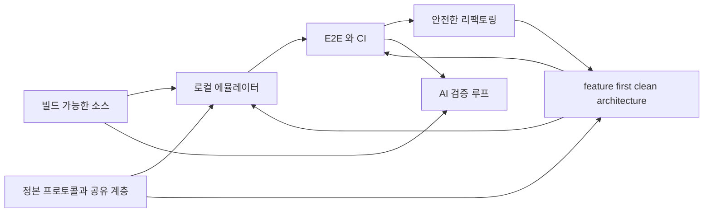

# 왜 리팩토링하는가 — 변경 1건의 비용

> **전제**: 이 시스템을 인수해 **리팩토링하고 이후 유지보수**한다.
> 따라서 답할 것이 둘이다 — **① 힐세리온이 무엇을 얻는가** · **② 유지보수 비용이 어떻게 달라지는가.**
> 근거는 전부 코드 실측이다. 출처는 [../review/](../review/).

## 0. 한 줄

**지금 구조에서는 기능 하나를 바꾸려면 3개 저장소·10개 파일을 건드려야 하고, 고쳤는지 확인할 방법이 없다.**

목표는 **device·client 양쪽에 feature-first clean architecture 를 완성**해서 이 숫자를 한 자리로 만드는 것이다. 목표 구조는 [architecture.md](architecture.md).

---

## 1. 무엇을 만들려는가

**힐세리온 시스템을 cctv-platform 수준의 플랫폼으로 만든다.** 코드 정리가 목적이 아니라 그 결과물이 목적이다.

| 구성 | 내용 | 상세 |
|---|---|---|
| **feature-first clean architecture** | device·client 양쪽. 기능이 디렉토리 하나에 모이고 도메인이 하드웨어를 모른다 | [architecture.md](architecture.md) |
| **빌드 가능한 소스** | 깨끗한 체크아웃 → 1커맨드 → 이미지. 프리빌트 바이너리·절대경로 제거 | [assessment.md §1.3](assessment.md) |
| **로컬 에뮬레이터** | HC 프로토콜 시뮬레이터. 실장비 없이 개발 PC 에서 전 경로 실행 | [emulator-e2e.md](emulator-e2e.md) |
| **E2E 테스트 + CI** | 회귀를 커밋 시점에 잡는다. **클라우드도 로컬 실물로 붙인다** | [emulator-e2e.md §5](emulator-e2e.md) |
| **플랫폼 뼈대** | 정본 프로토콜 · 표준 CLI · 축 사이 공유 계층 | [architecture.md §1](architecture.md) |

이 다섯이 서로를 필요로 한다.



### 1.1 "플랫폼" 이 무엇을 뜻하는가

cctv-platform 과 대조하면 **비어 있는 것이 무엇인지**가 분명해진다.

| 축 | cctv-platform | 힐세리온 현재 |
|---|---|---|
| 저장소 배치 | 축별로 나뉘고 최상위에 산출물이 있다 | 컨테이너 6개가 있으나 **전부 `legacy/` 아래**. 최상위는 비어 있다 |
| 표준 CLI | `make` 하나로 빌드·테스트·배포 | **저장소마다 다르다** — PetaLinux · ad-hoc 셸 · 플랫폼별 빌드 |
| 공유 계층 | `shared/flutter/aivue_client` 를 여러 축이 공유 | **복제.** 프로토콜 7벌 · 프로토콜 클라이언트 3벌 · NextSRI 필터 2벌 |
| CI | 있다 | **31개 저장소 전부 0건** |
| 문서 | `docs/development/` | belle 계열 README **0건** |

**축을 새로 만드는 게 아니다.** 축은 이미 실제 구조에 맞춰 잡혀 있다(루트 `CLAUDE.md` §폴더 구조). 없는 것은 **축의 내용물과 축을 잇는 계약**이다.

## 2. AI 가 다룰 수 있는 코드베이스로 만든다

**이것이 별개 목적이 아니라 위 넷의 직접적 귀결이다.** 그리고 지금 코드베이스는 AI 가 다루기에 구조적으로 불리하다.

### 2.1 지금 무엇이 막는가

| 장애물 | 실측 | AI 작업에 미치는 영향 |
|---|---|---|
| **거대 단일 파일** | `sonon_receive_fpga.cpp` **4,048** · `scan_controller.dart` **8,354** · `sonon.cpp` **3,522** | "PW 도플러 고쳐줘" 에 B·CF·M 코드까지 전부 읽어야 한다. 컨텍스트가 무관한 코드로 찬다 |
| **정본 부재** | 프로토콜 헤더 **7 코드베이스 복제, 선언 3벌** | 어느 정의가 맞는지 코드로 판정되지 않는다. **이번 검토에서 실제로 서브에이전트가 존재하지 않는 구조체를 인용하는 사고가 났다** |
| **빌드 불가** | 절대경로 의존, 커널 모듈 Makefile 부재 | AI 가 고쳐도 **컴파일해 확인할 수 없다.** 제안까지만 가능하고 검증 루프가 안 돈다 |
| **실행 불가** | 실장비 필수. 더미 경로가 있으나 `sonon.cpp:3189` 이 `DEVICE_EBI` 를 **상수로 넘겨** 고를 수 없다 | AI 가 만든 변경의 정오를 판정할 수 없다 |
| **테스트를 아무도 안 돌린다** | **CI 는 31개 저장소 전부 0건.** 테스트 자체는 `sonex-app` 2,518 LOC · `sonon-cloud/functions/test` 에 있고, belle 계열·`moana` 가 0건이다 | 피드백 신호가 도달하지 않는다 |
| **저장소 잡음** | `moana` 9.4GB 중 자체 소스 8MB 미만 | 탐색·인덱싱이 벤더 바이너리에 묻힌다 |
| **암묵 규칙** | 미러가 `.gitignore` 에 있어 루트 재귀 grep 이 **한 건도 안 잡힌다** | **이번 검토에서 "프로토콜 정본이 없다" 는 틀린 결론을 냈다.** 0건이 "없다" 가 아니라 "안 봤다" 였다 |

마지막 두 줄은 가정이 아니라 **이번 검토에서 실제로 발생한 오류**다. 구조가 AI 의 판단을 틀리게 만든다.

### 2.2 리팩토링 후 무엇이 달라지는가

| 항목 | 효과 |
|---|---|
| **feature 디렉토리** | 작업 단위 = 컨텍스트 단위. "PW 도플러" 요청에 `features/doppler_pw/` 만 읽으면 된다 |
| **의존 규칙 명시**(`core` 는 하드웨어를 모른다) | 변경 영향 범위를 **구조에서 읽을 수 있다.** 지금은 전역 상태와 4천 줄 파일이라 추론이 안 된다 |
| **정본 1벌** | 인용할 대상이 하나. 지어낼 여지가 없다 |
| **빌드 1커맨드** | AI 가 **고치고 → 빌드하고 → 결과를 보고 → 다시 고치는** 루프를 스스로 돈다 |
| **로컬 에뮬레이터 + E2E** | 그 루프에 **실행·검증**이 들어온다. 사람이 매번 장비를 붙일 필요가 없다 |
| **저장소 MB 단위** | 탐색이 자체 코드에만 걸린다 |

**핵심은 검증 루프다.** 지금 AI 는 읽고 제안만 할 수 있다. 빌드·실행·테스트가 서면 **작업을 완료하고 스스로 확인**할 수 있다. 이 차이가 유지보수 생산성의 대부분을 결정한다.

### 2.3 이건 사람에게도 같은 이익이다

AI 접근성을 위한 조건 — 작은 응집 단위, 명시적 의존, 단일 정본, 재현 가능한 빌드, 자동 검증 — 은 **사람이 유지보수하기 좋은 조건과 정확히 같다.** 따로 최적화하는 게 아니다.

## 3. 힐세리온이 얻는 것

### 3.1 그들이 못 하는 게 아니라, 비어 있는 축이 있다

**힐세리온은 이미 대규모 리팩토링을 진행 중이다.** `sonex-app`(249) + `sonex-framework`(524)가 Qt→Flutter 재작성이고, `packages/dr_sono` 는 domain/data/infrastructure/presentation 으로 제대로 짜여 있으며, `NextSRI` 는 상용 라이브러리(CVIE) 탈피 작업이다. 자체 문서에 마이그레이션 방법론과 체크리스트까지 있다.

**문제는 역량이 아니라 배치다.**

| 축 | 현재 |
|---|---|
| 클라이언트 | **힐세리온이 진행 중** — 다만 **기능 개발이지 이식이 아니다**(§4.2). 도메인 이식 0건 |
| 장비 | **아무도 안 함** — 커널 2021-10 · BSP 2022-05 동결, 빌드 재현 불가 |
| 빌드·테스트 기반 | **아무도 안 함** — CI 0건, 에뮬레이터 없음. 있는 테스트도 돌리는 장치가 없다 |
| 축 사이 이음매 | **아무도 안 함** — 프로토콜 7벌, 클라우드 스키마가 장비 포트를 들고 있음 |

한 팀이 두 개의 리팩토링을 동시에 돌릴 수 없다. **클라이언트 재작성이 팀을 쓰고 있는 동안 장비·기반·이음매가 비어 있다.**

그리고 실측을 보면 **클라이언트 축조차 구조 작업이 아니다** — 최근 3개월 커밋이 HNS/SRI 필터 세대 교체·펌웨어 굽기·회귀 수정이고 구조 변경은 0건이다. 즉 **네 축이 전부 비어 있다.**

### 3.2 분담이 자연스럽다

| 힐세리온 | 우리 |
|---|---|
| 신호처리·임상 기능 (`belle-fw` 최근 커밋이 전부 T1968 컬러 도플러다) | 장비 구조·빌드 재현 |
| Flutter 앱 기능 구현 | 에뮬레이터·E2E·CI |
| 제품·규제 판단 | 프로토콜 정본화, 축 사이 정리 |

그리고 **Qt 정리가 Flutter 이식을 싸게 만든다**(§7) — 우리 작업이 그들 작업의 입력이 된다. 경쟁이 아니라 선행 공정이다.

### 3.3 남는 이익

| | 실측 근거 |
|---|---|
| **회귀가 출하 전에 잡힌다** | 개발팀 수정 목록과 CS 티켓이 **같은 주제**(T8777 PW RI 고정 · T8807/T8850 PACS · T9153 lag) |
| **출시가 빨라진다** | 모델별 빌드 → 단일 이미지. CE/US 뒤바뀜 출하 사고가 구조적으로 제거 |
| **규제 산출물이 부산물로 생긴다** | 62304 구성관리 = Buildroot defconfig, SOUP = 의존성 매니페스트, 검증기록 = CI 이력 |
| **지식이 저장소에 남는다** | 지금 빌드 절차는 특정 디렉토리 배치에 들어 있고 belle 계열 README 0건 |
| **AI 로 유지보수 가능해진다** | §2 |

## 4. 지금 구조 — 기능이 파일에 흩어져 있다

### 4.1 장비: 기술 역할로 잘려 있다

`belle-fw/sonon/` 은 **수신·송신·파이프** 같은 기술 역할로 나뉘어 있다. 기능(B/CF/PW/M 모드)은 그 안에 흩뿌려져 있다.

| 파일 | LOC | 담고 있는 것 |
|---|---:|---|
| `sonon_receive_fpga.cpp` | **4,048** | **모든 모드의 FPGA 명령 핸들러가 한 파일에** |
| `sonon.cpp` | **3,522** | main + 스레드 5개 + 소켓 + 상태 |
| `sonon_receive_device.cpp` | 1,711 | 모든 모드의 장치 명령 |
| `sonon_pw_filter.cpp` | 1,605 | PW 처리 |
| `sonon_scanconversion.cpp` | 1,278 | 스캔 변환 |
| `sonon_transmit.cpp` | 1,104 | 모든 모드의 송신 |

**PW 모드 하나가 최소 6개 파일에 걸쳐 있다.**

### 4.2 클라이언트: 이식이 시작되지 않았고, 옮길 양은 늘고 있다

`moana` 는 이미 feature 로 나뉘어 있다 — `Scan`·`Measure`·`PatientList`·`WorkList`·`Cloud`·`Ambulance`·`BLE`·`Setting`. **여기가 참고 기준이다.**

`sonex-app` 은 **전환이 멈춘 게 아니라 구 계층이 자라고 있다.**

| 계층 | 내용 |
|---|---|
| `lib/modules/` (구) | `scan`(23,087) · `patient_list`(10,705) · `setting`(7,105) · `home` · `login` · `signup` · `work_list` · `quick_viewer` — GetX 화면 우선 |
| `lib/features/` (신) | `command_window` · `report_window` · `split_window` — **3개뿐이고 전부 창 관리이지 도메인 기능이 아니다** |
| `packages/dr_sono` | domain/data/infrastructure/presentation 완전 분리 — **여기만 목표 구조. 다만 `moana` 이식물이 아니라 음성제어 신규 기능이다** |

시계열이 이 절의 핵심이다([../review/sonex-app.md §10](../review/sonex-app.md)).

| 시점 | `lib/modules/` | clean-arch 계층 | `scan_controller.dart` |
|---|---:|---:|---:|
| 2025-07 | 10,536 | 0 | 761 |
| 2026-04 | 27,388 | 8,381 | 3,369 |
| **2026-07** | **48,206** | **8,440** | **8,354** |

**구 계층이 1년에 4.6배로 늘었고 신 계층은 최근 분기 +59 LOC 다.** 신규 개발이 전부 구 계층으로 들어간다. 측정·환자기록·DICOM·Ambulance 중 신 계층으로 옮겨진 것은 **0건**이다.

**역량 문제가 아니다** — 새로 짜는 것(`dr_sono`)은 clean architecture 로 짜고 테스트도 붙인다(30 → 2,518 LOC). 기존 도메인 이식만 비어 있다.

---

## 5. 변경 1건이 지금 얼마인가

### 시나리오 A — PW 모드에 파라미터 하나 추가

실제로 있었던 작업이다(`500c-sn-fw` 의 Power Doppler 파라미터 추가, `belle-fw` 의 T1968 CFAR).

| | 지금 | feature-first 이후 |
|---|---|---|
| **장비** | `sonon_receive_fpga.cpp`(4,048) opcode 핸들러 · `sonon_pw_filter.cpp`(1,605) · `sonon_pw_m_proc.cpp`(977) · `sonon_transmit.cpp`(1,104) · `lib/fpga_pw.cpp` · `configs/500l/*.dat` | `features/doppler_pw/` **1개 디렉토리** |
| **프로토콜** | 헤더 **3벌**(`belle-fw`·`moana`·`500c-sn-fw`) 각각 수정 | 정의 **1벌** |
| **앱(moana)** | `SononPacket.h` · `DeviceControl/ControlCommand` · `Scan/GLFramePW` | `features/doppler_pw/` 1개 |
| **앱(sonex)** | `NativeMethods.dart` · **`scan_controller.dart`(8,354)** | `features/doppler_pw/` 1개 |
| **합계** | **3개 저장소 · 10개 이상 파일** | **3곳** |

### 시나리오 B — 측정 도구 하나 추가

| | 비용 |
|---|---|
| `moana` | `Measure/` 안에서 끝난다. **이미 feature-first 라 국소적** |
| `sonex` | `modules/scan/scan_controller.dart`(8,354 LOC)에 손대야 한다 |

**같은 작업인데 한쪽만 싸다.** 차이는 구조 하나다.

### 시나리오 C — 새 프로브 모델 지원

| | 지금 | 이후 |
|---|---|---|
| 장비 | 컴파일 플래그 추가 → **모델별 별도 빌드**. `configs/` 트리 복사(현재 **27쌍이 바이트 동일**) | 런타임 설정 1건. **단일 이미지** |
| 앱 | 모델 enum 을 양쪽 앱에 각각 | 설정 데이터 1건 |

이전 세대(`ginny-fw`)는 u-boot 환경변수로 **런타임에 5개 모델을 골랐다.** belle 이 그걸 버렸다.

### 시나리오 D — 고쳤는지 확인

| | 지금 | 이후 |
|---|---|---|
| 방법 | **실장비 연결 → 수동 스캔** | 개발 PC 에서 E2E 자동 실행 |
| 회귀 발견 시점 | **고객** — `moana` 최근 60커밋의 수정 목록과 CS 티켓(T8777 PW RI 고정 · T8824 PRF 변경 시 B모드 정지 · T8807/T8850 PACS)이 **같은 주제**다 | 커밋 시점 |
| 범위 | 6타깃 × 10모델 × 인증 변종을 사람이 다 볼 수 없다 | CI 가 전부 |

---

## 6. 유지보수를 막는 것 — 인수 시점에 실제로 걸리는 것

### 6.1 빌드가 저장소 안에서 완결되지 않는다

```
EXTERNALSRC_pn-sonon = "/home/jacob/jacob-work-2020/belle_v202002_new/belle-fw"
CONFIG_..._U__BOOT_..._EXT_LOCAL_SRC_PATH = ".../belle-u-boot"
source /home/jacob/.../belle-sysroot/environment-setup-aarch64-xilinx-linux
```

빌드 정의가 특정 디렉토리 배치를 전제한다. **깨끗한 체크아웃에서 이미지가 나오지 않는다.**

추가로 막힌 것:
- 커널 모듈 3종(`plif`·`zynqdma`·`msp430_drv`) — 소스는 있는데 **Makefile 이 없다**
- `NE10` — `sonon` 이 링크하는데 `ne10_lib/` 에 **헤더 8개뿐**
- 수동 단계 — FSBL/PMU ELF 배치, `sudo mkfs.ubifs` 로 `hcproc.img` 생성

**리팩토링 이전에 빌드가 되어야 한다.** 안 그러면 바꾼 결과를 확인할 수 없다.

### 6.2 저장소가 실제 코드의 1000배다

| 저장소 | 크기 | 자체 소스 |
|---|---|---|
| `moana` | **9.4 GB** | 8 MB 미만 |
| `sonex-framework` | 2.0 GB | 7 MB |

`moana/lib` 6.1GB + `sonex-framework/sdk/adk/library` 1.1GB 가 **플랫폼 7종별 프리빌트 바이너리**다. Qt5 시절 산출물도 남아 있다.

체크아웃·브랜치 전환·CI 실행마다 이 비용을 낸다.

### 6.3 하드웨어를 바꿀 수 없다

`.xsa` 를 만든 **Vivado 프로젝트가 없다.** PL 설계 변경이 불가하다.

다만 **부팅은 가능하다** — `psu_init_gpl.c`(17,791줄)가 소스로 있고 U-Boot SPL 이 이미 빌드된다. 하드웨어를 안 바꾸는 한 `.xsa` 원본은 빌드 재현의 전제가 아니다.

### 6.4 앱 2벌을 동시에 유지해야 한다

Qt→Flutter 전환이 끝날 때까지 다음이 이중이다.

| 대상 | 상태 |
|---|---|
| 프로토콜 클라이언트 | `moana/framework/SononClient` · `sonex-framework/DeviceManager` |
| NextSRI 영상 필터 | **그들 문서가 "1:1 포팅, 바이트 동일 검증" 이라고 적었다** |
| 클라우드 연동 | 각각 구현 |

`sonex-app` 첫 커밋이 2024-04 이고 **2년 3개월간 도메인 이식은 0건**이다. **전환 완료 조건이 코드·저장소 문서 어디에도 없다**(실측). 정하지 않으면 이 이중 비용이 영구화된다.

---

## 7. 기대 효과 — 측정 가능한 것만

| 항목 | 현재 | 목표 | 측정 |
|---|---:|---:|---|
| PW 파라미터 1건 추가 시 수정 파일 | 10+ | **3** | 실제 커밋 diff |
| 프로토콜 정의 사본 | **7 코드베이스** | **1** | 동일 선언 검색 |
| 스캔 로직 최대 단일 파일(sonex) | **8,354 LOC** | 500 이하 | `wc -l` |
| 모델 추가 시 릴리스 아티팩트 | 모델당 1개 | **1개(전 모델)** | 빌드 산출물 수 |
| 회귀 발견 시점 | 출하 후(CS) | 커밋 시점 | CI 통과율 |
| 실장비 없이 검증 가능 범위 | **0** | 스캔·측정·DICOM·클라우드 | E2E 커버리지 |
| 체크아웃 크기 | 9.4 GB | MB 단위 | `du -sh` |
| 빌드 재현 | 불가 | 1커맨드 | 새 머신에서 이미지 생성 |
| **AI 검증 루프** | 읽기·제안까지 | **고침→빌드→실행→판정 자동** | 사람 개입 없이 닫힌 작업 비율 |
| **CI** | **31건 전부 0** | 전 축 | 저장소당 파이프라인 유무 |

---

## 8. 지금이 싼 이유

**1. sonex 전환이 진행 중이고, 늦출수록 비싸진다.** 새로 쓰는 코드에 목표 구조를 **처음부터** 넣을 수 있다. 완성 후에 고치면 두 번 일한다.

> **초기 판단(`features/` 가 3개뿐이라 되돌릴 비용이 작다)은 뒤집혔다.** 되돌릴 비용을 재는 대상은 신 계층 크기가 아니라 **옮겨야 할 구 계층 크기**다. 그것이 **48,206 LOC 이고 분기당 +76% 로 늘고 있다**(§4.2). 지금이 싼 이유는 "아직 작아서" 가 아니라 **"앞으로 더 커지기 때문"** 이다.

**2. 막힌 게 생각보다 적다.** `psu_init_gpl.c` + U-Boot SPL 로 부팅 체인이 서고, Buildroot custom package 를 만드는 과정이 **없는 Makefile 을 강제로 쓰게 한다.** 필요한 것 대부분이 저장소 안에 있다.

**3. 가장 싼 항목이 선행 조건 없이 가능하다.** 프로토콜 정본 단일화는 빌드 재현을 기다리지 않는다 — 바이트 배치가 같다는 게 이미 검증돼 있어 동작이 바뀌지 않는다.

---

## 9. 반론

| 반론 | 답 |
|---|---|
| "동작하는 걸 왜 건드리나" | 동작 여부가 아니라 **변경 비용**이 문제다. §5 가 그 비용이다 |
| "구조만 바꾸면 기능은 안 는다" | 목표가 기능이 아니라 **변경 가능성**이다. 지금은 커널 하나 못 올린다 |
| "sonex 로 갈아타면 해결된다" | 앱만 바뀐다. **장비·프로토콜·클라우드는 그대로**고, sonex 자체는 **도메인 이식이 0건**이다(§4.2) |
| "그들이 하고 있으니 두면 된다" | 2년 3개월간 이식 0건이고 구 계층은 4.6배가 됐다. **완료 조건조차 정해져 있지 않다** |
| "한꺼번에 다 바꾸자" | 기준선이 없으면 회귀를 판정할 수 없다. 빌드 재현 → E2E → 그 다음이 순서다 |

---

## 10. 요약

- **기능이 파일에 흩어져 있다** — PW 모드 하나가 장비에서만 6개 파일, 전체로는 3개 저장소 10개 파일
- **sonex 의 clean architecture 전환은 시작되지 않았고, 옮길 양이 늘고 있다** — 도메인 이식 0건, 구 계층 1년에 4.6배(48,206 LOC), `scan_controller.dart` 혼자 8,354 LOC
- **빌드가 저장소 안에서 완결되지 않는다** — 절대경로 의존, 커널 모듈 Makefile 부재
- **고쳤는지 확인할 방법이 없다** — 실장비 필수, 회귀를 CS 가 발견
- **앱 2벌을 무기한 이중 유지 중이다** — 전환 완료 조건 미정
- **축을 잇는 계약과 실행 장치가 없다** — 프로토콜 7벌, CI 31건 전부 0건. 플랫폼이라기보다 저장소 모음이다

목표 구조는 [architecture.md](architecture.md), 에뮬레이터·E2E 는 [emulator-e2e.md](emulator-e2e.md), 착수 순서는 [assessment.md](assessment.md).
