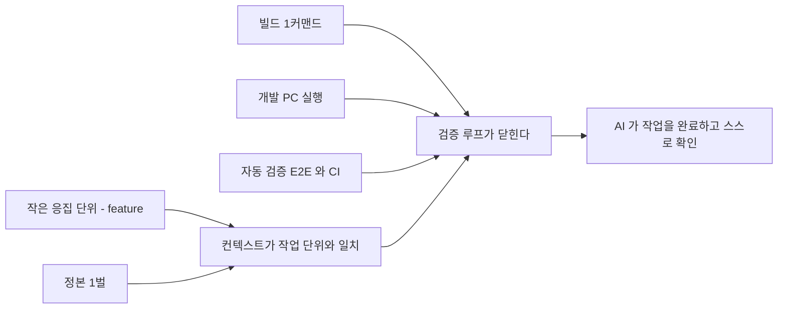
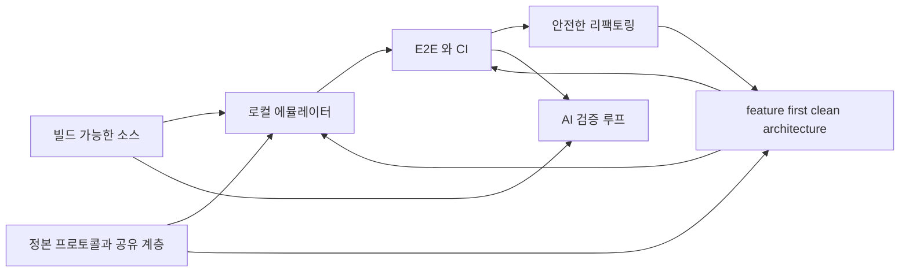

# 왜 리팩토링하는가

> **전제 셋**
> ① 이 시스템을 **위탁 리팩토링하고 이후 유지보수를 함께 맡는다.** 소유권은 힐세리온에 남는다.
> ② **작업자는 AI 에이전트다.** 사람이 코드를 직접 쓰는 것을 전제로 한 계획은 성립하지 않는다(§1).
> ③ **이미 한 번 한 일이다.** 같은 팀이 동종 시스템에서 같은 방법으로 끝냈고 결과가 남아 있다(§2).
>
> 근거는 전부 코드 실측이다. 힐세리온 쪽 출처는 [../review/](../review/), cctv 쪽 출처는 [precedent-cctv.md](precedent-cctv.md).

## 0. 한 줄

**지금 구조에서는 기능 하나를 바꾸려면 3개 저장소·10개 이상 파일을 건드려야 하고, 고쳤는지 확인할 방법이 없다.**

그리고 **그 상태에서는 AI 에이전트가 일을 끝낼 수 없다** — 읽고 제안하는 데서 멈춘다. 목표는 이 둘을 동시에 푸는 것이고, 방법은 하나다.

---

## 1. 전제 — 작업자가 바뀌었다

### 1.1 사람이 직접 코딩하지 않는다

cctv-platform 의 2026년 커밋 **3,341건 중 3,063건(91%)** 이 AI 에이전트가 만든 것이다([precedent-cctv.md §1](precedent-cctv.md)). 장비 펌웨어 94% · Qt 데스크톱 앱 85% · 서버 95% — 특정 계층에 몰린 것이 아니다.

**이것은 선호가 아니라 현재 조건이다.** 계획·문서·비용 판단이 전부 여기서 다시 계산된다.

### 1.2 그래서 비용 구조가 바뀐다

| | 사람이 짜던 시절의 가정 | 지금 |
|---|---|---|
| **작업량의 상한** | 인원 × 시간 | **AI 가 안전하게 만질 수 있는 코드 표면** |
| **리팩토링의 비용** | 비싸다 — 기능 대신 사람을 쓴다 | **기능 개발과 경쟁하지 않는다.** 병렬로 돈다 |
| **"큰 파일"의 비용** | 읽기 불편 | **컨텍스트를 무관한 코드로 채워 작업 자체를 실패시킨다** |
| **테스트 없음의 비용** | 사람이 수동으로 확인 | **AI 가 완료를 판정할 수 없다.** 루프가 안 닫힌다 |
| **문서·규약 없음** | 신입 온보딩 지연 | **매 세션 처음부터.** AI 는 지난주 맥락을 기억하지 않는다 |
| **기간 추정** | 의미 있음 | **의미 없음.** Phase·순서만 쓴다 |

세 번째와 네 번째 줄이 핵심이다. 사람에게 불편했던 것이 **AI 에게는 차단**이다. 4,048줄 파일은 사람에겐 "읽기 힘든 파일"이지만, AI 에겐 **PW 도플러 하나를 고치려고 B·CF·M 모드 코드를 전부 컨텍스트에 넣어야 하는** 구조적 낭비다.

### 1.3 AI 가 일을 끝내려면 코드베이스가 만족해야 하는 조건

작업이 **읽기·제안**에서 멈추지 않고 **고침 → 빌드 → 실행 → 판정**까지 닫히려면 다섯이 필요하다.



**그리고 이 다섯은 사람이 유지보수하기 좋은 조건과 정확히 같다.** 따로 최적화하는 것이 아니다 — AI 를 위해 만든 조건이 곧 사람을 위한 조건이고, 반대도 같다. 이 문서가 "AI 를 위해" 와 "유지보수를 위해" 를 구분하지 않는 이유다.

---

## 2. 선례 — 예측이 아니라 재현이다

**같은 팀이 동종 시스템에서 이미 끝냈다.** cctv-platform 도 벤더 원본 펌웨어를 read-only 미러(`device/fw-orig/`)로 두고 시작했다 — healcerion 의 `<컨테이너>/legacy/` 와 같은 위상이다.

| 만든 것 | cctv 실측 결과 |
|---|---|
| **feature-first clean architecture** | 원본 저장소 **5개**(장비 앱 3 + 공통 2)가 앱 **2개**(`ipc-app`·`xvr-app`)로. 각각 feature **27개**. 소스의 **92% 가 500줄 미만**(원본 79%), 1,000줄 초과 9% → **2%**. **총 LOC 는 줄지 않았다** — 바뀐 것은 분포다 |
| **개발 PC 실행** | 별도 시뮬레이터가 아니라 **`platforms/ubuntu24` 어댑터 하나**. 실장비 0대로 전 경로 실행 |
| **Buildroot 단일 트리** | SoC 10종·**제품 23종**이 defconfig 한 줄로 갈린다. 에뮬레이터(`x86_64_emul`)도 같은 목록 안 |
| **E2E + CI** | 크로스 컴포넌트 시나리오 **40개**, 루트에서 `make e2e` |
| **표준 CLI** | 저장소마다 `make build/test/test-e2e/test-architecture/image` 동일 |
| **그 위에서** | **2026년 커밋의 91% 를 AI 에이전트가 처리** |

**전이되지 않는 조건도 있다** — 의료기기 규제, 소유권(우리는 read-only 미러), 진행 중인 sonex 전환, FPGA 설계, 신호처리. 전부 [precedent-cctv.md §6](precedent-cctv.md) 에 적었다. 그것을 빼고 인용하면 근거가 아니라 광고다.

핵심은 **"우리가 만들려는 것이 무엇인지 그림으로만 존재하지 않는다"** 는 점이다. 돌아가는 실물이 있다.

---

## 3. 지금 힐세리온 코드베이스가 AI 를 막는 것

§1.3 의 조건 다섯과 하나씩 대조한다.

| 조건 | 현재 상태(실측) | 결과 |
|---|---|---|
| **작은 응집 단위** | `sonon_receive_fpga.cpp` **4,048** · `scan_controller.dart` **8,354** · `sonon.cpp` **3,522** | PW 모드 하나가 6개 파일에 걸쳐 있다. 컨텍스트가 무관한 코드로 찬다 |
| **정본 1벌** | HC 프로토콜 식별자가 **저장소 9곳**에 있고(`belle-fw` `500c-sn-fw` `belle-kernel` `elsa-fw` `ginny-fw` `moana` `sonex-app` `sonex-framework` `cuattro-sdk`), 구조체 선언이 **3벌** | 어느 정의가 맞는지 코드로 판정되지 않는다. **이번 검토에서 실제로 서브에이전트가 존재하지 않는 구조체를 인용하는 사고가 났다** |
| **빌드 1커맨드** | `petalinuxbsp.conf:15` 가 `EXTERNALSRC_pn-sonon = "/home/jacob/jacob-work-2020/..."`. 커널 모듈 3종 빌드 파일 부재 | 고쳐도 **컴파일해 확인할 수 없다.** 제안까지만 가능하다 |
| **개발 PC 실행** | 실장비 필수. 더미 경로가 있으나 `sonon.cpp:3428` 이 `fpga_init(g_handle, DEVICE_EBI, ...)` 로 **장치 종류를 상수로 넘겨** 고를 수 없다 | 변경의 정오를 판정할 수 없다 |
| **자동 검증** | **CI 31개 저장소 전부 0건**(재실측 확인). 테스트 자체는 `sonex-app`·`sonon-cloud` 에 있으나 돌리는 장치가 없다 | 피드백 신호가 도달하지 않는다 |

추가로 두 가지가 더 있다.

| | 실측 | 영향 |
|---|---|---|
| **저장소 잡음** | `moana` **9.4GB** 중 자체 소스는 `app/Sources` 5.1MB + `framework` 1.9MB = **7MB** | 탐색·인덱싱이 벤더 프리빌트 바이너리에 묻힌다 |
| **암묵 규칙** | 미러가 `.gitignore` 에 있어 루트 재귀 grep 이 **한 건도 안 잡힌다** | **이번 검토에서 "프로토콜 정본이 없다" 는 틀린 결론을 냈다.** 0건이 "없다" 가 아니라 "안 봤다" 였다 |

**마지막 두 줄은 가정이 아니라 이번 검토에서 실제로 발생한 오류다.** 구조가 AI 의 판단을 틀리게 만든다.

> **측정 기준**: LOC 은 **작업 브랜치 기준**이다(`belle-fw` = `production-fw-ver2.0`, `sonex-app` = `feature-apply_v1.23.4`). 이 조직은 master 에서 작업하지 않아 master 로 재면 `sonon_receive_fpga.cpp` 3,812 · `scan_controller.dart` 8,299 로 다르게 나온다.

---

## 4. 힐세리온이 얻는 것

### 4.1 지금 그들이 실제로 겪고 있는 것

우리 관점의 "구조가 나쁘다" 가 아니라, **저장소에 남아 있는 그들의 비용**이다.

| 겪고 있는 것 | 실측 근거 |
|---|---|
| **회귀 판정이 사람 손에 있다** | 발견 경로가 둘이다 — **사내 QA**(출하 브랜치에 `[SQA]` 표기 **150건**)와 **고객 신고**(`moana` 커밋 `d7cab02d3` "T8807 fix BVF when screenshot and PACS" · `9e43ca740` "T8850 fix PW invert"). **QA 가 없는 것이 아니라 자동 판정이 없다.** "회귀를 고객이 발견한다"는 이전 서술은 과장이라 정정한다 |
| **출하 사고가 실제로 났다** | `moana` 에 `HC_RELEASE_TARGET` 미설정 시 qmake 가 **hard-error** 를 내도록 강제한 커밋이 있고, 사유는 **M2.03.24 에서 CE/US 빌드가 뒤바뀌어 출하된 사고**다 |
| **전환이 2년째 절반이다** | `sonex-app` 첫 커밋 2024-04. 이후 **도메인 이식 0건**, `features/` 3개는 전부 창 관리다. 구 계층은 **분기당 +76%** 로 늘어 이식 대상이 계속 커진다 |
| **장비 밑단이 동결됐다** | 커널 2021-10 · BSP 2022-05 이후 정지. 빌드가 특정 개발자 디렉토리 배치에 묶여 있어 손대기 어렵다 |
| **지식이 사람에게 있다** | 힐세리온이 작성한 belle 저장소(`belle-fw`·`belle-bsp`·`belle-msp`)에 README **0건**(`belle-kernel`·`belle-u-boot` 의 README 는 upstream Linux·U-Boot 것 그대로다). 빌드 절차가 `/home/jacob/...` 배치 안에 들어 있다 |
| **완료 조건이 없다** | sonex 전환 완료 조건이 **코드·저장소 문서 어디에도 없다**. 정하지 않으면 앱 2벌 유지 비용이 영구화된다 |

> **증거 차원 표기 — 위 표는 세 종류가 섞여 있다.**
>
> | 차원 | 해당 항목 | 확정 방법 |
> |---|---|---|
> | **식별자 매칭** | CS 티켓 T8807·T8850 ↔ 커밋 | 커밋 메시지에 티켓 번호가 있다. 가장 강한 증거 |
> | **코드 관찰** | 이식 0건 · 구 계층 증가 · 커널/BSP 동결 · 자체 작성 README 0건 · 완료 조건 부재 | 트리와 로그에서 직접 확인 |
> | **그들의 진술** | CE/US 출하 사고 · Maniphest CS 티켓 주제(T8777 PW RI 고정 · T8824 PRF · T9153 lag) | 커밋 메시지·이슈 트래커 텍스트. **사건이 있었다는 것은 이 진술에 근거하며 코드 관찰이 아니다** |
>
> 세 번째 줄의 CS 티켓 번호는 **Maniphest 조회 결과**이고 커밋에는 나타나지 않는다. 다만 같은 시기 `moana` 커밋 제목("PACS 업로드 이미지가 사선으로 밀리던 문제 수정" 2026-07-22 · "스캔 중 FPS 가 10~25 로 널뛰던 문제 수정" 2026-07-21)이 **주제상 겹친다** — 겹침이지 매칭이 아니다.

### 4.2 무엇이 달라지는가

| | 지금 | 이후 | 판정 방법 |
|---|---|---|---|
| **회귀 발견 시점** | 출하 후, CS 티켓 | 커밋 시점 | CI 통과율 |
| **모델 추가** | 컴파일 플래그 + 모델별 별도 빌드 | **런타임 설정 1건, 단일 이미지** | 릴리스 아티팩트 수 |
| **CE/US 같은 사고** | 브랜치·빌드 플래그로 갈림 | 구조적으로 발생 불가 | 미병합 장수 브랜치 수 |
| **전환 진척** | 셀 수 없음 | feature 단위로 셈 | 이식 완료 feature 수 |
| **규제 산출물** | 없음 | **부산물로 생김** — 62304 구성관리 = defconfig, SOUP = 의존성 매니페스트, 검증기록 = CI 이력 | 저장소에서 추출 가능 여부 |
| **작업 처리량** | 인원에 비례 | **AI 에이전트로 확장** — cctv 에서 91% | AI 가 닫은 작업 비율 |

마지막 줄이 힐세리온에게 가장 큰 항목이다. **인원을 늘리지 않고 처리량을 올리는 유일한 경로**이고, 그 조건이 §1.3 의 다섯이다.

### 4.3 역량 문제가 아니라 배치 문제다

**힐세리온은 이미 대규모 리팩토링을 하고 있다.** `sonex-app`(249커밋) + `sonex-framework`(524)가 Qt→Flutter 재작성이고, `packages/dr_sono` 는 domain/data/infrastructure/presentation 으로 제대로 짜여 있으며, `NextSRI` 는 상용 라이브러리(CVIE) 탈피 작업이다. 자체 문서에 마이그레이션 방법론과 체크리스트까지 있다.

| 축 | 현재 |
|---|---|
| 클라이언트 | **힐세리온이 진행 중** — Qt→Flutter 재작성 |
| 장비 | **아무도 안 함** — 커널 2021-10 · BSP 2022-05 동결, 빌드 재현 불가 |
| 빌드·테스트 기반 | **아무도 안 함** — CI 0건, 에뮬레이터 없음 |
| 축 사이 이음매 | **아무도 안 함** — 프로토콜 복제, 클라우드 스키마가 장비 포트를 들고 있음 |

한 팀이 두 개의 리팩토링을 동시에 돌릴 수 없다. **클라이언트 재작성이 팀을 쓰고 있는 동안 장비·기반·이음매가 비어 있다.**

| 힐세리온 | 우리 |
|---|---|
| 신호처리·임상 기능 (`belle-fw` 최근 커밋이 전부 T1968 컬러 도플러다) | 장비 구조·빌드 재현 |
| Flutter 앱 기능 구현 | 에뮬레이터·E2E·CI |
| 제품·규제 판단 | 프로토콜 정본화, 축 사이 정리 |

그리고 **Qt 정리가 Flutter 이식을 싸게 만든다**(§8) — 우리 작업이 그들 작업의 입력이 된다. 경쟁이 아니라 선행 공정이다.

---

## 5. 무엇을 만드는가

**힐세리온 시스템을 cctv-platform 수준의 플랫폼으로 만든다.** 코드 정리가 목적이 아니라 그 결과물이 목적이다.

| 구성 | 내용 | cctv 실물 | 상세 |
|---|---|---|---|
| **feature-first clean architecture** | device·client 양쪽. 기능이 디렉토리 하나에 모이고 도메인이 하드웨어를 모른다 | feature 27개 | [architecture.md](architecture.md) |
| **빌드 가능한 소스** | 깨끗한 체크아웃 → 1커맨드 → 이미지 | 제품 23종 단일 트리 | [assessment.md §1.3](assessment.md) |
| **로컬 에뮬레이터** | 실장비 없이 개발 PC 에서 전 경로 실행 | `platforms/ubuntu24` | [emulator-e2e.md](emulator-e2e.md) |
| **E2E + CI** | **데이터 경로** 회귀를 커밋 시점에 잡는다 — 효과 상한은 [../review/change-cost.md §7](../review/change-cost.md) 에 재어 두었다(최근 표본의 25%) | 시나리오 40개 | [emulator-e2e.md §7](emulator-e2e.md) |
| **플랫폼 뼈대** | 정본 프로토콜 · 표준 CLI · 축 사이 공유 계층 | `make` 인터페이스 통일 | [architecture.md §1](architecture.md) |

이 다섯이 서로를 필요로 한다.



### 5.1 "플랫폼" 이 무엇을 뜻하는가

| 축 | cctv-platform | 힐세리온 현재 |
|---|---|---|
| 저장소 배치 | 축별로 나뉘고 최상위에 산출물이 있다 | 컨테이너 6개가 있으나 **전부 `legacy/` 아래**. 최상위는 비어 있다 |
| 표준 CLI | `make` 하나로 빌드·테스트·이미지 | **저장소마다 다르다** — PetaLinux · ad-hoc 셸 · 플랫폼별 빌드 |
| 공유 계층 | `shared/flutter` 를 여러 축이 공유 | **복제.** 프로토콜 · 프로토콜 클라이언트 3벌 · NextSRI 필터 2벌 |
| CI | 저장소 6곳 | **31개 저장소 전부 0건** |
| 문서 | `docs/development/` 규약 일습 | belle 계열 README **0건** |

**축을 새로 만드는 게 아니다.** 축은 이미 실제 구조에 맞춰 잡혀 있다(루트 `CLAUDE.md` §폴더 구조). 없는 것은 **축의 내용물과 축을 잇는 계약**이다.

---

## 6. 지금 구조 — 기능이 파일에 흩어져 있다

### 6.1 장비: 기술 역할로 잘려 있다

`belle-fw/sonon/` 은 **수신·송신·파이프** 같은 기술 역할로 나뉘어 있다. 기능(B/CF/PW/M 모드)은 그 안에 흩뿌려져 있다.

| 파일 | LOC | 담고 있는 것 |
|---|---:|---|
| `sonon_receive_fpga.cpp` | **4,048** | **모든 모드의 FPGA 명령 핸들러가 한 파일에** |
| `sonon.cpp` | **3,522** | main + 스레드 5개 + 소켓 + 상태 |
| `sonon_receive_device.cpp` | 1,711 | 모든 모드의 장치 명령 |
| `sonon_pw_filter.cpp` | 1,605 | PW 처리 |
| `sonon_transmit.cpp` | 1,104 | 모든 모드의 송신 |

**PW 모드 하나가 최소 6개 파일에 걸쳐 있다.** cctv 리팩토링본은 같은 성격의 코드에서 소스의 **92% 가 500줄 미만**이다(원본 79%).

### 6.2 클라이언트: 절반만 옮겨져 있다

`moana` 는 이미 feature 로 나뉘어 있다 — `Scan`·`Measure`·`PatientList`·`WorkList`·`Cloud`·`Ambulance`·`BLE`·`Setting`. **여기가 참고 기준이다.**

`sonex-app` 은 **전환이 중간에 멈춰 있다.**

| 계층 | 내용 |
|---|---|
| `lib/modules/` (구) | `scan` · `patient_list` · `work_list` · `setting` · `home` · `login` · `signup` · `quick_viewer` — GetX 화면 우선 |
| `lib/features/` (신) | `command_window` · `report_window` · `split_window` — **3개뿐이고 전부 창 관리이지 도메인 기능이 아니다** |
| `packages/dr_sono` | domain/data/infrastructure/presentation 완전 분리 — **여기만 목표 구조** |

핵심 도메인이 아직 `modules/` 에 있고, **`scan_controller.dart` 하나가 8,354 LOC** 다.

---

## 7. 변경 1건이 지금 얼마인가

> **§7.0 은 실측이고, 시나리오 A~D 는 투영이다.** 둘을 섞어 읽으면 안 된다. 전체 실측 = [../review/change-cost.md](../review/change-cost.md).

### 7.0 실측 — Power Doppler 기능 1건이 출하되기까지

기능 하나를 티켓 번호로 끝까지 추적한 것이다.

| | 실측 |
|---|---|
| 장비(`belle-fw` T7741) | 2023-03-29 ~ 04-24, 3커밋, **18파일** |
| 앱 개발(`moana` `PowerDoppler` 브랜치) | 2023-03-29 ~ 09-20, 7커밋. **어디에도 병합되지 않았고 지금도 15커밋이 갇혀 있다** |
| 출하 계통 도달 | **2023-10-06, 세 브랜치 계열에 각각 따로.** patch-id 가 셋 다 다르다 |
| 재적용의 갈림 | 같은 `ImageProc.cpp` 조차 `+57 −18` / `+57 −13` / `+57 −13` |
| **장비 완료 → 앱 출하 도달** | **5개월 12일** |

**핵심은 파일 수가 아니라 "같은 일을 세 번 했고, 세 번이 서로 달라졌다"** 는 점이다. 변종이 브랜치로 갈려 있고 재적용을 사람이 하기 때문이다.

### 시나리오 A — PW 모드에 파라미터 하나 추가 (**투영**)

아래 A~D 는 실측이 아니라 구조에서 도출한 추정이다. 근거가 되는 작업은 실재한다(`500c-sn-fw` 의 Power Doppler 파라미터 추가, `belle-fw` 의 T1968 CFAR).

| | 지금 | feature-first 이후 |
|---|---|---|
| **장비** | `sonon_receive_fpga.cpp`(4,048) opcode 핸들러 · `sonon_pw_filter.cpp`(1,605) · `sonon_pw_m_proc.cpp`(977) · `sonon_transmit.cpp`(1,104) · `lib/fpga_pw.cpp` · `configs/500l/*.dat` | `features/doppler_pw/` **1개 디렉토리** |
| **프로토콜** | 헤더 **3벌** 각각 수정 | 정의 **1벌** |
| **앱(moana)** | `SononPacket.h` · `DeviceControl/ControlCommand` · `Scan/GLFramePW` | `features/doppler_pw/` 1개 |
| **앱(sonex)** | `NativeMethods.dart` · **`scan_controller.dart`(8,354)** | `features/doppler_pw/` 1개 |
| **합계** | **3개 저장소 · 10개 이상 파일** | **3곳** |

### 시나리오 B — 측정 도구 하나 추가

| | 비용 |
|---|---|
| `moana` | `Measure/` 안에서 끝난다. **이미 feature-first 라 국소적** |
| `sonex` | `modules/scan/scan_controller.dart`(8,354 LOC)에 손대야 한다 |

**같은 작업인데 한쪽만 싸다.** 차이는 구조 하나다.

### 시나리오 C — 새 프로브 모델 지원

| | 지금 | 이후 |
|---|---|---|
| 장비 | 컴파일 플래그 추가 → **모델별 별도 빌드**. `configs/` 트리 복사 | 런타임 설정 1건. **단일 이미지** |
| 앱 | 모델 enum 을 양쪽 앱에 각각 | 설정 데이터 1건 |

이전 세대(`ginny-fw`)는 u-boot 환경변수로 **런타임에 5개 모델을 골랐다.** belle 이 그걸 버렸다. 그리고 cctv 는 같은 문제를 defconfig 23종으로 풀어 두었다 — **사내 선례와 외부 실물이 둘 다 있다.**

### 시나리오 D — 고쳤는지 확인

| | 지금 | 이후 |
|---|---|---|
| 방법 | **실장비 연결 → 수동 스캔** | 개발 PC 에서 E2E 자동 실행 |
| 회귀 발견 시점 | **고객**(§4.1) | 커밋 시점 |
| 범위 | 타깃 × 모델 × 인증 변종을 사람이 다 볼 수 없다 | CI 가 전부 |

---

## 8. 유지보수를 막는 것 — 착수 시점에 실제로 걸리는 것

### 8.1 빌드가 저장소 안에서 완결되지 않는다

```
belle-bsp/project-spec/meta-user/conf/petalinuxbsp.conf:15
  EXTERNALSRC_pn-sonon = "/home/jacob/jacob-work-2020/belle_v202002_new/belle-fw"
belle-fw/scripts/release_elsa.sh:8
  FW=/home/jacob/jacob-work-2020/belle_v202002/elsa-fw
```

빌드 정의가 특정 디렉토리 배치를 전제한다. **깨끗한 체크아웃에서 이미지가 나오지 않는다.**

추가로 막힌 것:

- **커널 모듈 3종의 빌드 파일이 없다** — `plif` 는 `readme.makefile` 이라는 이름의 템플릿만 있고 그 안의 커널 경로가 `/home/jacob/BELLE_WORK/...` 이다. `zynqdma`·`msp430_drv` 는 빌드 파일 자체가 없다
- `NE10` — `sonon` 이 링크하는데 `ne10_lib/` 에 **헤더 8개뿐**
- 수동 단계 — FSBL/PMU ELF 배치, `sudo mkfs.ubifs` 로 `hcproc.img` 생성

**리팩토링 이전에 빌드가 되어야 한다.** 안 그러면 바꾼 결과를 확인할 수 없다 — 사람이든 AI 든 같다.

### 8.2 저장소가 실제 코드의 1000배다

| 저장소 | 크기 | 자체 소스 |
|---|---|---|
| `moana` | **9.4 GB** | **7 MB** (`app/Sources` 5.1M + `framework` 1.9M) |
| `sonex-framework` | 2.0 GB | 7 MB |

`moana/lib` 6.1GB + `sonex-framework/sdk/adk/library` 1.1GB 가 **플랫폼 7종별 프리빌트 바이너리**다. Qt5 시절 산출물도 남아 있다. 체크아웃·브랜치 전환·CI 실행마다 이 비용을 낸다.

### 8.3 하드웨어를 바꿀 수 없다

`.xsa` 를 만든 **Vivado 프로젝트가 없다.** PL 설계 변경이 불가하다.

다만 **부팅은 가능하다** — `psu_init_gpl.c`(17,791줄)가 소스로 있고 U-Boot SPL 이 이미 빌드된다. 하드웨어를 안 바꾸는 한 `.xsa` 원본은 빌드 재현의 전제가 아니다.

### 8.4 앱 2벌을 동시에 유지해야 한다

전환이 끝날 때까지 프로토콜 클라이언트·NextSRI 영상 필터·클라우드 연동이 이중이다. **전환 완료 조건이 코드·저장소 문서 어디에도 없다**(실측). 정하지 않으면 이 이중 비용이 영구화된다.

---

## 9. 기대 효과

### 9.1 현재 비용 — 실측 (SOT = [../review/change-cost.md](../review/change-cost.md))

| 항목 | 실측 |
|---|---|
| 기능 1건(Power Doppler)의 출하 경로 | 출하 계통 **3곳에 각각 재적용**, patch-id 전부 상이, 장비 완료 후 **5.5개월** |
| `moana` 출하본 미도달 커밋 | **712 / 5,705 (12%)** — 국가·고객사·인증 329 · 기술·기능 207 · 단종라인 142 |
| 아직 진행형인 분기 | `oem_sphera` 2025-05-28 · `QT6_WORK` 2025-07-29 |
| 이음매 | 장비·앱이 같은 값을 다른 이름으로 부르는 것 **41건** (같은 이름·다른 값은 0건) |
| 이음매가 만든 결함 | `recv_id` target 검사가 **도달 불가 코드** ([../review/protocol-device.md](../review/protocol-device.md) §2.3.1) |

### 9.2 그중 구조로 풀리지 않는 것 — **먼저 뺀다**

| | 왜 안 풀리나 |
|---|---|
| **인증 브랜치** `500L_Cetification` 68 · `310C_China_Certification` 22 | 인증본 동결이 규제 요구일 수 있다. **판단 주체가 힐세리온이다** |
| **단종 라인** `sonon_500c` 71 · `300_Series_Renewal` 71 | 범위 밖. 손대면 회귀 위험만 는다 |
| **대규모 이행** `QT6_WORK` 112 · `qt6_upgrade` 6 | Qt5→Qt6 는 구조와 무관하게 브랜치가 길다 |
| **`belle-fw` 미도달 22건(33%)** | 별도 제품라인(`500_integrated` `fuji`)과 **진행 중 R&D 실험**(`T1968`, 롤백으로 끝남)이다. 구조 문제가 아니다 |
| **릴리스 규율** | 재출시 태그가 **2022-05 이후 소멸**했다. 그들이 이미 고쳤다 |
| **QA 부재라는 서술** | 출하 브랜치에 `[SQA]` 표기 **150건**. 없는 것은 QA 가 아니라 **자동 회귀 판정**이다 |

**그래서 구조 효과가 확실한 구간은 좁다** — `moana` 의 OEM·국가 분기(329 중), 장수 기능 브랜치(207 중), 그리고 장비↔앱 이음매다.

### 9.3 목표값 — 달성 여부를 셀 수 있는 것만

| 항목 | 현재 | 목표 | 측정 |
|---|---:|---:|---|
| **기능 1건의 출하 계통 재적용 횟수** | **3** (Power Doppler 실측) | **1** | patch-id 중복 |
| **OEM·국가 분기에 갇힌 커밋** | **329** | 런타임 설정으로 대체 | 브랜치 도달성 |
| **장비 완료 → 앱 출하 도달** | **5.5개월** (실측 1건) | 단축 | 커밋 날짜 차 |
| **장비·앱 명명 불일치** | **41건** | **0** | `make report` |
| PW 파라미터 1건 추가 시 수정 파일 | 10+ (투영) | **3** | 실제 커밋 diff |
| 프로토콜 정의 사본 | **저장소 9곳 · 선언 3벌** | **1** — [산출물 완성](proof/protocol-sot/) | 동일 선언 검색 |
| 스캔 로직 최대 단일 파일(sonex) | **8,354 LOC** | 500 이하 | `wc -l` |
| 500줄 미만 소스 비율(장비) | 미측정 | **90%+** | cctv 실측 92% (원본 79%) |
| 모델 추가 시 릴리스 아티팩트 | 모델당 1개 | **1개(전 모델)** | 빌드 산출물 수 |
| 회귀 발견 시점 | **사내 QA(`[SQA]` 150건) 또는 출하 후(CS)** — 자동 판정은 0 | 커밋 시점 | CI 통과율 |
| 실장비 없이 검증 가능 범위 | **0** | 스캔·측정·DICOM·클라우드 | E2E 커버리지 |
| 체크아웃 크기 | 9.4 GB | MB 단위 | `du -sh` |
| 빌드 재현 | 불가 | 1커맨드 | 새 머신에서 이미지 생성 |
| **CI** | **31건 전부 0** | 전 축 | 저장소당 파이프라인 유무 |
| **AI 가 닫은 작업 비율** | 읽기·제안까지 | **cctv 수준(91%)** | 커밋 트레일러 |

---

## 10. 지금이 싼 이유

**1. sonex 전환이 진행 중이고, 늦출수록 비싸진다.** 새로 쓰는 코드에 목표 구조를 **처음부터** 넣을 수 있다. 되돌릴 비용을 재는 대상은 신 계층 크기가 아니라 **옮겨야 할 구 계층 크기**이고, 그것이 **48,206 LOC 이며 분기당 +76% 로 늘고 있다**. 지금이 싼 이유는 "아직 작아서" 가 아니라 **"앞으로 더 커지기 때문"** 이다.

**2. 막힌 게 생각보다 적다.** `psu_init_gpl.c` + U-Boot SPL 로 부팅 체인이 서고, Buildroot custom package 를 만드는 과정이 **없는 빌드 파일을 강제로 쓰게 한다.** 필요한 것 대부분이 저장소 안에 있다.

**3. 가장 싼 항목이 선행 조건 없이 가능하다.** 프로토콜 정본 단일화는 빌드 재현을 기다리지 않는다 — 바이트 배치가 같다는 게 이미 검증돼 있어 동작이 바뀌지 않는다.

**4. 방법이 이미 검증돼 있다.** §2 의 다섯 항목은 설계안이 아니라 cctv 에서 돌고 있는 실물이다. 미지의 위험은 도메인(초음파·규제)에 있지 구조 작업에 있지 않다.

---

## 11. 반론

### 11.1 "의료기기 SW다. 동작하는 걸 건드리면 재검증·인증 유지 비용이 든다"

**가장 강한 반론이고, 답이 셋이다.**

| | |
|---|---|
| **지금도 변경하고 있다** | `belle-fw` 는 2026-07 까지 커밋되고 `moana` 는 회귀 수정 중이다. 변경이 없는 게 아니라 **검증 없는 변경**이 일어나고 있다. 리팩토링은 변경을 만드는 게 아니라 **이미 일어나는 변경에 게이트를 다는 것**이다 |
| **62304 가 요구하는 것이 지금 없다** | 구성관리·SOUP 목록·검증 기록·추적성 — CI 0건, 자체 작성 README 0건, 빌드 재현 불가, 프리빌트 서드파티 7.2GB 의 출처·버전 미기록. **현 상태가 규제 적합하다는 근거가 저장소에 없다** |
| **순서가 그 답이다** | 기준선(빌드 재현 → E2E → CI) 이 먼저고 구조 변경은 그 다음이다([assessment.md §3](assessment.md)). **회귀를 판정할 수 없는 상태에서의 변경이 진짜 규제 리스크다** |

리팩토링의 산출물이 곧 규제 산출물이다 — defconfig = 구성관리, 의존성 매니페스트 = SOUP, CI 이력 = 검증 기록.

### 11.2 "AI 가 의료기기 코드를 고치는 게 안전한가"

**안전성을 가르는 것은 작업 주체가 아니라 검증 게이트다.**

지금은 **사람이 고쳐도** 회귀 판정이 사람 손에 있다 — 사내 QA(`[SQA]` 150건)와 고객 신고다(§4.1). E2E + CI 가 서면 누가 고치든 같은 게이트를 통과해야 하고, 통과 기록이 남는다. cctv 에서 91% 를 AI 가 처리할 수 있었던 이유가 정확히 그 게이트다 — 게이트 없이 AI 를 넣는 것이 위험한 것이지, 게이트를 만드는 작업 자체가 위험한 것이 아니다.

그리고 순서표 0~4번은 **제품 코드의 동작을 바꾸지 않는다** — 비밀정보 교체·DDL 추출·프로토콜 헤더 단일화(바이트 배치 동일 검증됨)·빌드 시스템·테스트 추가다.

### 11.3 "우리가 하면 된다. 이미 sonex 를 하고 있다"

역량이 아니라 **동시성** 문제다(§4.3). 2년 3개월간 도메인 이식 0건이고 구 계층은 분기당 +76% 다. 그동안 장비·기반·이음매는 아무도 하지 않는다. 그리고 우리 작업(Qt feature 정리·프로토콜 정본·E2E)은 **그들 작업의 입력**이 된다.

### 11.4 "리팩토링은 기능을 만들지 않는다. 그 시간에 기능을 만들어라"

**전제가 성립하지 않는다** — 작업자가 AI 에이전트라 "리팩토링 대신 기능" 이라는 시간 배분 문제가 아니다(§1.2). 그리고 기능 추가 속도 자체가 구조에 묶여 있다: 측정 도구 하나 추가가 `moana` 에선 국소적이고 `sonex` 에선 8,354줄 파일 수정이다(§7-B).

### 11.5 "실패하면 어떻게 되나"

각 단계가 **독립적으로 남는 산출물**을 만든다.

| 순서 | 중간에 멈춰도 힐세리온에 남는 것 |
|---|---|
| 0 | 교체된 비밀정보 · 복구된 DB 스키마 |
| 1 | 프로토콜 정본 1벌 |
| 2 | **깨끗한 체크아웃에서 빌드되는 펌웨어** |
| 3·4 | 실장비 없는 회귀 검증 · CI |

**구조 변경(8~11번)은 이 뒤에 온다.** 기반 단계에서 중단해도 손실이 아니라 자산이 남는다.

### 11.6 "동작하는 걸 왜 건드리나" / "한꺼번에 다 바꾸자"

| 반론 | 답 |
|---|---|
| "동작하는 걸 왜 건드리나" | 동작 여부가 아니라 **변경 비용**이 문제다. §7 이 그 비용이다 |
| "구조만 바꾸면 기능은 안 는다" | 목표가 기능이 아니라 **변경 가능성**이다. 지금은 커널 하나 못 올린다 |
| "sonex 로 갈아타면 해결된다" | 앱만 바뀐다. **장비·프로토콜·클라우드는 그대로**고, sonex 자체는 도메인 이식이 0건이다 |
| "한꺼번에 다 바꾸자" | 기준선이 없으면 회귀를 판정할 수 없다. 빌드 재현 → E2E → 그 다음이 순서다 |

### 11.7 남는 항목 — 우리가 답할 수 없는 것

기술 판단이 아니라 **합의 사항**이다. 여기에 답을 지어내지 않는다.

- 코드 반입 승인 범위와 IP 경계
- 인증 유지 책임 주체(변경 이력·검증 기록의 소유)
- sonex 전환 완료 조건 — **힐세리온이 정해야 하고, 이것이 정해지지 않으면 앱 2벌 비용이 영구화된다**
