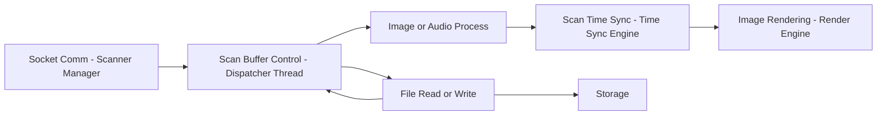

# SoNex 요구사항 문서 분석 — 개발 목표와 설계

> **근거**: 이 폴더의 원본 문서 4건을 직접 열람(pandoc·openpyxl·python-pptx 로 텍스트 변환, 2026-07-29). 원본은 전부 **2023년 작성된 계획 시점 문서**다. 계획이 실제 구현과 어긋나는 지점은 `client/legacy/sonex-framework` 코드를 직접 대조해 표시했고, [sonex-app.md](../sonex-app.md)·[sonex-architecture.md](../sonex-architecture.md)(코드 실측 문서)와 교차 인용한다.
> **표기**: 원본 문서의 서술은 "계획"이라 표시하고, 코드로 확인한 것만 "실측"이라 표시한다.

## 1. 원본 문서 4건

| 파일 | 작성일 | 형식 | 내용 |
|---|---|---|---|
| `SoNex_APP_개발계획서_230821.docx` | 2023-08-18(v0.0.1) | 개발 계획서 | 배경·목적·범위·환경·일정 |
| `SoNex_SDK_개발설계서_230721.docx` | 2023-07-20(v0.0.1) | 개발 설계서 | 위와 거의 동일 + 프로젝트 폴더 구조(§2.4) |
| `SoNex_block_diag_230405.pptx` | 2023-03(version 07), 45슬라이드 | 블록 다이어그램 | SDK·Framework 모듈 구성·데이터 흐름·시퀀스 |
| `SoNex_sdk_interface_230403.xlsx` | 2023-04-03, 12시트 | 인터페이스 명세 | 데이터 타입 21종·SDK 함수 시그니처·에러코드 |

작성 순서는 블록 다이어그램(2023-03/04, v07) → 인터페이스 명세(2023-04-03) → SDK 설계서(2023-07-20) → APP 개발계획서(2023-08-18) 순이다. 개발계획서와 설계서는 배경·목적·범위·환경·기술(ANGLE)·기능·일정 절이 문장 단위로 거의 동일하고, 설계서에만 프로젝트 폴더 구조(§2.4)가 추가돼 있다.

## 2. 배경 — 왜 새 프로젝트가 필요했는가 (계획)

기존 `Moana`(Qt) 앱의 유지보수 한계:

- Qt 5 업데이트 종료로 신규 버전 개발 환경 미지원
- 코드 복잡도 증가로 유지보수 어려움, Framework/App 경계가 실제 동작에서는 모호함
- Framework 가 QtQML 로 짜여 있어 외부(고객사) SDK/ADK 제공 요청에 대응 불가
- Qt 라이선스 비용(개발자 계정 + 판매 시 러닝 로열티)

목적: **라이선스 비용 없는 개발 환경으로 전환** + **SDK/ADK 계층 분리** + **Application 의 기술 독립적 개발 환경(GUI 경량화)**.

## 3. 적용 범위 — SDK / ADK / APP 3계층 (계획)

| 계층 | 범위 | 언어 |
|---|---|---|
| **SDK** | 스캐너 접속·조작, 영상/음원 수집·가공, 화면 출력·측정·조작, 데이터 저장/불러오기 | 표준 C/C++ 라이브러리 |
| **ADK** | 계정(가입/로그인), 통신(네트워크 상태·서버 API), 이력 관리(로그), DICOM(PACS/worklist), 백업/복원, 영상 변환 | 표준 C/C++ 라이브러리 |
| **APP** | UI·OS 의존 기능(권한 요청, Wi-Fi 연결 등) | Flutter |

## 4. 개발 환경 계획 (2023-08-21 기준)

| 구분 | Windows | Android | iOS |
|---|---|---|---|
| SDK/ADK IDE | VS 2022 | VS 2022 | Xcode 14.3.1 |
| SDK/ADK 언어 | C++17/C11 | C++17 | C++17 |
| SDK/ADK 컴파일러 | LLVM(clang-cl) | LLVM(clang-cl) | LLVM(clang-cl) |
| SDK/ADK 산출물 | `.dll` | `.so` | Framework |
| Sample app | C# 11 / .NET 7.0 | Java 8 | Swift 5 / Obj-C |
| APP | Flutter (**"상세 미정, 기술 검토 및 확보 필요"**) | 〃 | 〃 |

**실측과의 차이**: 컴파일러 계획은 clang-cl(LLVM) 이었으나 [sonex-app.md §3.1](../sonex-app.md)의 실측은 Windows 가 MSBuild(`.vcxproj` 29개, 구성 Debug/Release × Win32·x64·ARM·ARM64) 이고 Android 는 CMake 아닌 `ndk-build`(`Android.mk` 셸 인라인 생성)다 — clang-cl 단일화 계획은 실현되지 않았고 **플랫폼마다 다른 빌드 도구가 남았다**([sonex-app.md §3.1](../sonex-app.md)).

## 5. 프로젝트 폴더 구조 — 계획 대 실측

설계서(§2.4)의 계획 트리:

```
sdk/          (SDK·Framework 소스)
  sdk/          - SDK 소스, {module}/{android,ios,windows,shared}
  adk/          - Framework 소스, {module}/{android,ios,windows,shared}
  third_party/  - 외부 라이브러리
app/          (서비스 앱)
  {app}/        - 각 앱 프로젝트
```

**실측 대조**(`client/legacy/sonex-framework`, 2026-07-29): `sdk/sdk/`·`sdk/adk/`·`sdk/third_party/` 최상위 3분할이 **그대로 실현됐다.** 모듈별 `android/ios/windows/shared` 4분할 패턴도 [sonex-app.md §2](../sonex-app.md)가 "일관되게 따른다"고 확인했다. 계획에 없던 것은 `sdk/common/`(SDK·ADK 공유), `sdk/include/`(공개 헤더), `sdk/ai_models/`([sonex-architecture.md §7](../sonex-architecture.md)) — 후행 추가다.

모듈명은 설계 문서와 실제 폴더에서 이름이 바뀌었다(개념은 유지):

| 설계 문서 모듈명 | 실제 폴더(`sdk/sdk/`) | 비고 |
|---|---|---|
| Scanner Manager | `DeviceManager` | |
| Scan Buffer Controller | `ScanBuffer` | |
| Scan Time Sync | `ScanTimeSync` | |
| Image Renderer | `ImageRenderer` | 이름 동일 |
| Image Process | `ImageFilter` | |
| Audio Process | *(별도 폴더 없음)* | `ImageFilter/HCAudioOutputFilter.h` 로 흡수 — 계획 문서도 "특별한 작업 없음"이라 적었던 모듈(pptx 슬라이드14) |
| File Read, Write | `FileReadWriter` | |
| SDK Interface | `Main` | `HCSonexSDK.h`·`HCSonexSDKInterface.h` |

## 6. 렌더링 기술 검토 — ANGLE (계획)

목적: Android/iOS/Windows 공통 렌더링 라이브러리. Google 개발, DirectX 9/11·Vulkan·Metal·OpenGL\|ES 지원, OpenSource. 동작 방식: OpenGL\|ES 코드 → ANGLE 내부 변환 → 대상 그래픽 라이브러리 호출 → 실제 렌더링.

**실측**: [legacy/sonex-rendering.md](../legacy/sonex-rendering.md) 가 실제 GLES2/ANGLE 스택과 플랫폼별 GL 경계 4종을 확인했다 — ANGLE 채택 계획은 실현됐으나, 앱↔렌더러 결합 방식은 플랫폼마다 갈라졌다(Windows `flutter_native_view` + HWND 추종 901줄 등).

## 7. SDK 설계 — 모듈 구성과 데이터 흐름 (계획)

블록 다이어그램(슬라이드 4)의 SDK 파이프라인을 옮기면:



각 모듈은 in-link 버퍼 → thread 처리 → out-link 버퍼 패턴을 공유한다(설계서 공통 서술, 슬라이드 5~8).

### 7.1 데이터 흐름 3모드 (슬라이드 6~8)

| 모드 | 소스 데이터 | 특징 |
|---|---|---|
| **Live** | 장비에서 실시간 수신 | encoded buffer → decode → decoded buffer. 최초 프레임 timestamp 로 기준점 생성, 이후 frame 은 기준점 대비 wait/pass, 처리 지연 시 skip |
| **Freeze** | 이미 저장된 decoded buffer | 재생 위치/방향만 조정, 디코딩 재수행 없음 |
| **Playback(review)** | 파일에서 로딩 | raw data 형식이라 디코딩 과정 없음. 지연 시 skip 아닌 **기준점 갱신**(delay) — Live 와 반대 정책(슬라이드 16) |

### 7.2 데이터 모델 — 21종 (xlsx `Data Sheet`)

| 소유 모듈 | 데이터 |
|---|---|
| Scanner Mgr | `ScannerCommand`·`ScannerResponse`·`ScanBModeParam`·`ScanCfModeParam`·`ScanPwModeParam`·`ScanMModeParam`·`ScannerModelSpec`·`ScannerInfo`·`BatteryInfo`·`Preset` |
| Scan Buffer | `ScanBModeParam`~`ScanMModeParam`·`ScannerModelSpec`·`ImageData`·`AudioData`·`StreamData`·`ImageProcessSetting`·`ImageFilterSetting` |
| File RW | `ScanBModeParam`~`ScanMModeParam`·`Preset`·`ImageData`·`AudioData`·`StreamData`·`PatientInfo`·`StudyInfo`·`SeriesInfo`·`SavedFileInfo` |
| Syncer | `StreamData` (단독) |
| Render | `ScanBModeParam`~`ScanMModeParam`·`ScannerModelSpec`·`ScannerInfo`·`ScanAnalyticsInfo`·`ImageData`·`AudioData`·`StreamData`·`DisplaySetting`·`RenderObject`·`Measurements` |

`ScanCfModeParam` 은 필드 30개로 가장 크고, `cModeEnsembleNum`·`bModePrf` 등 다수가 "fixed param"(고정값) 으로 주석돼 있다 — 모델 튜닝 파라미터가 이미 이 시점에 다수 확정돼 있었다.

**실측 대조**: `HCScannerModelSpec.h`·`HCScannerInfo.h`·`HCStreamData.h` 가 `client/legacy/sonex-framework/sdk/include/`·`sdk/common/shared/` 에 **그대로 존재**한다(2026-07-29 grep 확인) — 데이터 모델 설계는 이름 그대로 실현됐다.

## 8. 인터페이스 설계 — 계획 대 실제 구현 (심층 대조)

> 이 절은 xlsx 의 인터페이스 명세를 실제 헤더(`sdk/sdk/DeviceManager/shared/HCDeviceManager.h`·`sdk/common/shared/HCModulePipeInterface.h`·`sdk/sdk/Main/shared/HCSonexSDK.h`·`sdk/sdk/ScanBuffer/`·`sdk/sdk/ScanTimeSync/`·`sdk/adk/NetworkProcess/shared/HCNetworkProcess.h`)와 **줄 단위로 대조**한 결과다(2026-07-29).

### 8.1 Module Pipe Interface — 유일하게 거의 완전히 보존된 설계

xlsx `Module Pipe Interface` 시트가 설계한 모듈간 연결 API 는 실제 `HCModulePipeInterface.h` 의 `ModulePipeInterface` 클래스에 **함수명까지 거의 그대로** 남아 있다.

| 계획 | 실측 | 상태 |
|---|---|---|
| `connect(front, rear, option)` (static) | `connect(front, rear, option)` (static) | 동일 |
| `disconnect(front, rear)` (static) | `disconnect(front, rear)` (static) | 동일 |
| `connectToFrontOf`·`connectToRearOf` | `connectToFrontOf`·`connectToRearOf` | 동일 |
| `disconnectFrom`·`disconnectAll` | `disconnectFrom`·`disconnectAll` | 동일 |
| `sendStreamData`·`onStreamDataReceived`(virtual) | `sendStreamData`·`onStreamDataReceived`(virtual) | 동일 |
| `getConnectedFrontModules`·`getConnectedRearModules`("제거 검토"라 계획에 메모됨) | *(없음)* | **계획대로 제거됨** |
| *(계획에 없음)* | `getModuleName`·`getVersion`(로깅용)·`onStreamRequested`·`requestStreamData`(pull 방식 요청) | 신규 추가 |

이 인터페이스는 `DeviceManager`·`ScanBuffer`·`ScanTimeSync`·`ImageFilter`·`ImageRenderer`·`FileReadWriter` 6개 모듈이 전부 상속한다 — **설계서의 파이프라인 연결 개념(§7)이 코드에서 그대로 골격을 이룬다.**

### 8.2 내부 모듈 API(DeviceManager) — 이름까지 보존

xlsx `Scanner Manager` 시트의 함수 목록과 실제 `HCDeviceManager` 클래스(설계상 "Scanner Manager"에 대응)를 대조하면:

| 계획 | 실측(`HCDeviceManager.h`) | 상태 |
|---|---|---|
| `connectDevice(ip, controlPort, dataPort, retryCount, retryInterval)` | `connectDevice(String ip, uint16_t controlPort, uint16_t dataPort, uint8_t retryCount, uint16_t retryIntervalMs)` | **시그니처 거의 동일** |
| `disconnectDevice()` | `disconnectDevice()` | 동일 |
| `sendCommand(command, parameter)` | `sendCommand(int command, VariantMap* parameter)` | 동일 개념 + `sendCommandDelayed` 신규 |
| `isConnected()` | `isConnected() const` | 동일 |
| `getScannerInfo()` | `getScannerInfo() const` | 동일 |
| `setScanParameter`(3종 오버로드) | `setScanParameters(...)`·`setScanParameter(key, param)` | 유지(오버로드 수만 축소) |
| `setKeepAliveInterval` | `setKeepAliveInterval(interval, failCount, timeout)` | 동일 |
| `startFirmwareUpdate`·`cancelFirmwareUpdate` | `startFirmwareUpdate(filePath)`·`cancelFirmwareUpdate()` | 동일 |
| `addScanDeviceResultCallback`·`removeScanDeviceResultCallback` | `addScanDeviceResultCallback`·`removeScanDeviceResultCallback` | **함수명 완전 동일** |
| *(계획에 없음)* | `registerInstructionSet`(모델별 명령셋 외부 등록)·`requestSocketRestart`(2026-05-21 추가, 펌웨어 세션 정리용) | 후행 추가 |

**즉 모듈 내부 C++ API 는 2023년 설계를 거의 그대로 구현했다.** §8.3 에서 보듯 바뀐 것은 이 계층이 아니라 그 바깥의 앱 대면 파사드다.

### 8.3 "제네릭 커맨드 코드 + 파라미터" 패턴이 파사드 전역으로 확산

계획의 `sendCommand(command, VariantMap parameter)` 는 원래 **스캐너 장치 명령 한 가지**에만 쓰도록 설계됐다(xlsx `Scanner Manager` 시트). 실측 결과 이 패턴이 SDK 전체 공개 API 와 ADK 네트워크 계층까지 확산됐다.

| 계층 | 실제 함수 | 확인 |
|---|---|---|
| SDK 파사드(앱이 호출하는 최외곽 FFI 경계) | `hc_SendRequest(int requestCode, const wchar_t* jsonParam)` → 내부적으로 `SonexSDK::unifiedRequest(requestCode, jsonParam)` 호출 | `HCSonexSDKInterface.cpp:77`·`HCSonexSDK.cpp:275` |
| `unifiedRequest` 내부 | `REQUEST_GET_SDK_STATUS`·`REQUEST_SET_STREAM_PIPELINE`·`REQUEST_CVIE_INITIALIZE`·`REQUEST_DEBUG_DUMP_START`·`REQUEST_EXPORT_MEASUREMENTS` 등 `REQUEST_*` 매크로 기준 `switch`-`case` 로 각 모듈 메서드에 위임 | `HCSonexSDK.cpp:313`~ |
| ADK NetworkProcess | `NetworkProcess::sendRequest(int commandCode, const std::map<std::string,std::string>& paramMap)` | `HCNetworkProcess.h:29` |

**세 계층에서 동일한 "코드+파라미터" 패턴이 독립적으로 나타난다** — 계획에서 스캐너 명령 하나에 쓰려던 설계가 프로젝트 전역 컨벤션으로 굳어진 것으로 보인다. 이 실제 형태가 [sonex-app.md §5](../sonex-app.md)의 "`NativeMethods.dart` 가 약 30개 `hc_*` 심볼을 이름으로 lookup" 관측과 맞물린다 — FFI 경계를 넘는 함수 개수를 줄이려는 의도로 읽힌다.

`unifiedRequest` 의 `REQUEST_CVIE_*`(3개)·`REQUEST_DEBUG_DUMP_*`(2개)·`REQUEST_EXPORT_MEASUREMENTS`·`REQUEST_RENDER_REVIEW_FRAME` 는 2023년 설계 문서에 대응 항목이 없다 — CVIE 상용 라이브러리 연동([sonex-architecture.md §7](../sonex-architecture.md))·디버그 덤프·측정값 내보내기가 전부 후행 추가다.

### 8.4 콜백 — 파사드만 통합, 모듈 내부는 유지

계획은 `addScanDeviceResultCallback`·`addRendererResultCallback`·`addFileHandlerResultCallback` **3종 분리 등록**이었다. 실측: `DeviceManager` 내부는 여전히 `addScanDeviceResultCallback`(§8.2, 이름까지 동일)을 쓰지만, **SDK 파사드**(`hc_AddResultCallback(UnifiedResultCallback)`)는 단일 콜백으로 통합했다 — §8.3 과 같은 패턴이다: **내부 모듈 API 는 설계 유지, 앱 대면 파사드만 단순화.**

### 8.5 신설된 Controller 계층 (계획에 없음)

`sdk/sdk/Main/shared/` 에 `HCLiveController`·`HCPlaybackController`·`HCRendererController` 가 있다 — 2023년 xlsx/pptx 설계에는 없는 클래스다. `sonex-framework/CLAUDE.md`(힐세리온 자체 문서, 참고자료)도 이 셋을 "파이프라인 아키텍처의 컨트롤러"로 명시한다. `HCLiveController.cpp`·`HCRendererController.cpp` 가 `DeviceManager::sendCommand`를 직접 호출하는 것을 확인했다 — §13 이 확인한 "Freeze/Playback 전환 요구가 파이프라인을 분할시켰다"는 관측이, **모드별 전담 컨트롤러 신설**로 한 번 더 진화했다는 뜻이다.

### 8.6 ScanBuffer / ScanTimeSync 공개 인터페이스 — 이름이 대부분 바뀜

DeviceManager 와 달리 이 두 모듈은 계획과 실측의 이름 대응이 낮다.

| 계획(xlsx `Scan Buffer`) | 실측(`HCScanBuffer.h`) |
|---|---|
| `startDispatch`·`stopDispatch` | *(대응 없음 — `setStreamMode`/`resumeStreamMode`로 흡수 추정)* |
| `moveTo(frameNo)` | `seekByBufferIndex(index)`·`seekByFrameNo(frameNo)` (2종으로 분화) |
| `clearBuffer` | *(공개 메서드 없음)* |
| `getBufferedSize`·`getIndexOf` | *(공개 메서드 없음)* |
| *(계획에 없음)* | `setMaxBufferSize`·`setScanMode`·`setScanModeWithoutClear`·`setSpectrumWidth`·`setMInterpLines`·`addRawFrameCallback` |

계획(xlsx `Scan Sync`)의 `setFrameSkip`·`setDelayedSync`·`setPlayrate`·`clearBuffer`·`getWaitingTime` 6개 함수는 실측 `HCScanTimeSync.h` 공개 헤더에 **`setStreamMode` 하나만 남아 있다.** 나머지가 삭제됐는지, private 구현으로 옮겨졌는지는 헤더만으로 판별 불가 — §14 미확인.

### 8.7 에러 코드가 17종에서 약 50종으로 늘었다

계획(xlsx `Rule` 시트)의 결과 코드 17개(`SUCCESS`·`UNKNOWN_ERROR`·`INVALID_VALUE`·`NOT_ENOUGH_BUFFER`·`SCANNER_DISCONNECTED`·`TIMEOUT` 등)는 **실측**(`sdk/include/HCCommon.h` `ResultCode` enum) 에서 그대로 있거나 이름이 다듬어진 채(`INVALID_VALUE`→`INVALID_PARAMETER` 등) 남아 있고, 계획에 없던 범주가 대거 추가됐다 — `SOCKET_*`(9개, 소켓 계층 세분화) · `PACKET_*`(5개, 파싱 상태 세분화) · `CVIE_ERROR`·`EGL_ERROR`·`GLES_ERROR`·`FT_ERROR`(렌더링·서드파티 라이브러리 오류, §6 ANGLE·§8.3 CVIE 채택의 결과). 설계 시점엔 렌더링·소켓 내부 오류를 이 정도로 세분화할 계획이 없었다는 뜻이다.

## 9. 렌더 오브젝트·측정 항목 — 계획보다 훨씬 세분화됨

계획(xlsx `Image Renderer` 시트)의 `RenderObject` 하위 클래스는 7종(범용) — `RenderScanImage`·`RenderRuler`·`RenderColorDoppler`·`RenderSampleVolume`·`RenderPulseWaveSpectrum`·`RenderMotionCursor`·`RenderMotionSpectrum` — 이었다.

**실측**(`sdk/include/objects/`): 스캔 이미지 오브젝트가 **probe 종류별로 갈라졌다** — `HCScanBConvex`/`HCScanBLinear`(B모드), `HCScanCFConvex`/`HCScanCFLinear`(CF모드 도플러). `HCScanMCursor`(M모드 커서)·`HCScanPwCursor`(PW 커서)·`HCScanSideRuler`(눈금자)는 계획과 1:1 대응하지만, PW·M 두 스펙트럼은 `HCScanSpectrum` **하나로 합쳐졌다.** 계획에 없던 저수준 도형 primitive 계층(`HCRenderShapeBorder`·`Dash`·`Ellipse`·`Image`·`Line`·`Text`·`HCRenderTouchPoint`)과 셰이더 계층(`shader/` 7종 — `HCColorDopplerShader`·`HCGrayscaleShader`·`HCPowerDopplerShader` 등)이 새로 생겼다 — 계획 문서는 "Graphic Library"를 블랙박스로만 취급했다.

측정 오브젝트는 계획 5종(`RenderMeasureLength`·`Circle`·`Angle`·`Point`·`Label`) 대비 실측(`sdk/include/measure/`) **12종**으로 늘었다 — `MeasureAngle`·`MeasureDepth`·`MeasureDistance`·`MeasureEllipse`·`MeasureLength`·`MeasureTag`·`MeasureTime`·`MeasureVelocity`·`MeasureVelocityDiff`·`MeasureVolume` 외에 계획에 전혀 없던 **`MeasureFetalBiometry`(태아 계측)·`MeasureHeartrate`(심박)** 가 추가됐다 — 산부인과·순환기 진단 기능이 2023년 설계 이후 확장됐다는 신호다.

## 10. Framework(ADK) 기능 명세 — 계획 대 실제 모듈

블록 다이어그램(슬라이드 20~41)의 Framework 모듈: User Management·Log·Patient/Exam·Work List·Share·Backup·Web API·Network Process·Database·DICOM Handler·Video Encoder·Platform Dependencies.

**실측**(`sdk/adk/Main/` 헤더): `HCUserManagement`·`HCNetworkController`/`HCNetworkBusinessLogic`·`HCDataBaseController`·`HCDicomController`·`HCVideoEncoderController`·`HCBackupRWController`·`HCFrameworkBusinessLogic` — 계획된 기능 범주가 거의 1:1 로 대응한다. 계획에 없던 것: `HCFirmwareController`·`HCFirmwareVersionChecker` — 설계 문서는 펌웨어 업데이트를 **SDK Interface** 쪽 함수(`startFirmwareUpdate`)로 뒀으나, 실제로는 ADK 계층에 별도 컨트롤러가 생겼다(SDK/ADK 경계가 계획과 다르게 그어진 지점).

### 10.1 Database — 암호화·세부 스키마는 계획에 없었다

계획(슬라이드37)은 "사용자 별 DB 파일 생성"·"공통 데이터는 별도 DB"라고만 적었다. 실측(`sdk/adk/DatabaseHelper/shared/`): 사용자별 DB 파일 설계는 그대로이나, **`HCDatabaseCrypto.h`(wxSQLite3/`sqlite3secure` 기반 암호화, 주석 "Moana 호환 암호화 적용")가 계획에 없던 요소로 추가됐다** — Moana 와의 파일 호환성 유지가 목적으로 보인다. 스키마도 계획엔 "사용자 데이터·설정·환자 정보"로만 뭉뚱그려 있었으나 실측은 `PatientInfoDb`·`StudyInfoDb`·`SnapshotInfoDb`·`WorkItemInfoDb`·`DcmFileInfoDb`·`DeviceDataDb`·`AppLogDb`·`AppSettingsDb` **8개 구체 테이블**로 세분화됐다.

### 10.2 Web API / Network — 같은 제네릭 패턴 재확인

계획(슬라이드35)은 Web API 를 `Sign Up`·`Withdrawal`·`Log In`·`Log Out`·`Upload Log` **개별 함수**로 설계했다. 실측(`sdk/adk/NetworkProcess/shared/HCNetworkProcess.h`)에는 이런 이름의 함수가 없고, §8.3 에서 확인한 `NetworkProcess::sendRequest(int commandCode, paramMap)` 제네릭 함수만 있다 — SDK 파사드와 동일한 수렴이 ADK 에서도 일어났다.

### 10.3 DICOM Handler — 여기도 "Unified" 네이밍

계획(슬라이드38)의 `DICOM Handler`(Request Queue·Worker Thread·Server Communication·DCM File Reader/Writer)는 실측 `sdk/adk/DicomHandler/`에서 `HCDicomHandler.h` 외에 **`HCUnifiedDicomAdapter.h`** 로 나타난다 — §8.3·§10.2 의 "Unified" 수렴 패턴이 세 번째로 확인된 지점이다.

## 11. APP 기능 계획 — Sign-on/Worklist/Patient list/US screen/Setup/Popup

개발계획서 §4.3.2 의 추가 기능 목록과 [sonex-app.md §10.3](../sonex-app.md)의 실제 `lib/modules/` 구성을 나란히 두면:

| 계획 항목 | 실제 모듈(`lib/modules/`) | 비고 |
|---|---|---|
| Sign-on(로그인/로그아웃/자동로그인) | `login`(1,907 LOC)·`signup`(1,177 LOC) | 2개로 분리 |
| Worklist | `work_list`(955 LOC) | |
| Patient list | `patient_list`(10,705 LOC) | |
| US screen | `scan`(23,087 LOC) | 최대 모듈, `scan_controller.dart` 단일 파일 8,354줄([sonex-app.md §9](../sonex-app.md)) |
| Setup | `setting`(7,105 LOC) | |
| Popup | *(대응 모듈 없음)* | 공통 위젯으로 흡수된 것으로 추정 — **미확인** |

계획 문서는 "기본 기능은 기존 Moana 와 동일 수준 유지"라 적었는데, 실제로는 `scan` 모듈 하나가 나머지 6개 모듈 합계(약 22,000 LOC)와 맞먹는 규모로 자랐다 — "동일 수준 유지"가 실현되지 않았다는 뜻은 아니지만, 계획 문서가 예견한 범위를 실제 규모가 크게 넘어섰다.

## 12. 일정 계획 대 실측 — 3년 넘게 진행 중

개발계획서(2023-08-21 기준) 일정:

| 계층 | 계획 완료일 |
|---|---|
| SDK | 2023-11-30 |
| ADK | 2024-02-28 |
| APP | 미정 |

**실측**([sonex-app.md §11](../sonex-app.md)): `sonex-framework`(SDK+ADK 동일 저장소) 는 2023-05-22 시작, **2026-07-23 까지도 활발**(524커밋, `--all` 기준). `sonex-app` 은 2024-04-12 시작, **2026-07-15 까지 249커밋**. SDK 완료 계획(2023-11-30) 대비 **2년 8개월** 지난 시점에도 SDK 저장소가 활발하다.

[sonex-app.md §10.6](../sonex-app.md)의 "전환 완료 조건이 없다"(2024-04 착수 후 2년 3개월, SDK 기준 3년 2개월) 판정과 이 문서의 계획 일정을 겹치면, **최초 계획 대비 지연 규모가 구체적으로 드러난다** — SDK 는 계획의 약 8배(4개월 계획 → 38개월+ 실제, 현재도 미완).

## 13. 설계 초안 폐기 이력 — v1 → v3 → v07(최종)

블록 다이어그램 pptx 마지막 4슬라이드(42~45)는 표지에 **"폐기안"** 이라 표시돼 있다 — 슬라이드 42~43 "Block Diagram v1", 슬라이드 44 "Scan Manager Module", 슬라이드 45 "Block Diagram v3". 표지 슬라이드(1)의 "version 07" 이 최종 채택안(슬라이드 2~41)이다.

폐기된 v1(슬라이드44 "Scan Manager Module")과 최종안을 비교하면: v1 은 `Scanner Manager → Stream Buffer → Image Process Queue` 로 바로 이어지는 **단순 파이프라인**이었고, 최종안(슬라이드4)은 그 사이에 `Scan Buffer Controller`(디코딩·재생위치 탐색) 와 `Scan Time Sync`(재생 속도·프레임 동기) 를 **별도 모듈로 분리**했다. 즉 설계가 반복되며 재생 제어(Freeze/Playback seek, 배속) 요구가 파이프라인 분할을 유도했다 — 이 분리가 §7.1 의 3모드(Live/Freeze/Playback) 데이터 흐름 설계로 이어지고, §8.5 에서 확인한 `LiveController`/`PlaybackController` 신설로 한 번 더 진화했다.

## 14. 종합 평가 — 설계 의도 대비 실현 정도

**계층별로 실현 정도가 갈린다** — 저수준(모듈간 파이프·모듈 내부 API·데이터 모델)은 설계를 그대로 따랐고, 고수준(앱 대면 파사드·렌더 오브젝트 세분화·AI 필터)은 계획을 넘어서거나 다른 형태로 수렴했다.

| 항목 | 판정 |
|---|---|
| SDK/ADK/APP 3계층 분리 | **실현** — 폴더·저장소 경계가 계획대로 유지된다(§5). [sonex-app.md §2](../sonex-app.md)가 "ADK→SDK 단방향 의존, 역방향 없음"을 확인 |
| Module Pipe Interface(모듈간 연결) | **거의 완전히 실현**(§8.1) — 함수명까지 동일. 4개 문서 중 가장 잘 보존된 설계 |
| DeviceManager(Scanner Manager) 내부 API | **거의 그대로 실현**(§8.2) — `connectDevice`·`sendCommand`·`addScanDeviceResultCallback` 등 이름 동일 |
| 데이터 모델(21종) | **거의 그대로 실현**(§7.2) — 이름·구조가 코드에 그대로 존재 |
| 라이선스 비용 없는 개발 환경 전환 | **부분 실현** — Qt 이탈은 됐으나 컴파일러·빌드체계 통일(clang-cl 단일화)은 안 됨(§4), CVIE 는 여전히 상용 라이선스([sonex-architecture.md §7](../sonex-architecture.md)) |
| ANGLE 렌더링 채택 | **실현**(§6), 단 앱↔렌더러 결합은 플랫폼마다 4가지로 갈라짐([legacy/sonex-rendering.md](../legacy/sonex-rendering.md)) |
| 앱 대면 SDK 파사드(명령별 개별 함수) | **다른 형태로 수렴** — 제네릭 `hc_SendRequest`/`unifiedRequest` 디스패처(§8.3). 같은 패턴이 ADK `NetworkProcess::sendRequest`·`HCUnifiedDicomAdapter` 에도 나타나 **프로젝트 전역 컨벤션**이다(§8.3, §10.2, §10.3) |
| 콜백 3종 분리 | **파사드만 통합** — SDK 파사드는 `UnifiedResultCallback` 하나, 모듈 내부(`DeviceManager`)는 원래 이름 유지(§8.4) |
| ScanBuffer/ScanTimeSync 공개 API | **이름 대부분 교체**(§8.6) — DeviceManager 와 달리 재설계 성격이 강함 |
| Controller 계층(Live/Playback/Renderer) | **계획에 없었음** — 후행 신설(§8.5), 힐세리온 자체 `CLAUDE.md` 도 문서화 |
| 렌더 오브젝트·측정 항목 | **계획보다 세분화** — 7종→probe별 분화+shader 계층(§9), 측정 5종→12종(태아 계측·심박 추가, §9) |
| Database 암호화·스키마 | **계획에 없었음** — wxSQLite3 암호화(Moana 호환 목적)·8개 테이블 세분화(§10.1) |
| 일정(SDK 4개월, ADK 3개월) | **크게 초과** — 3년 넘게 진행 중(§12) |
| AI 필터(CVIE 대체) | **계획에 없었음** — 후행 추가, `unifiedRequest` 의 `REQUEST_CVIE_*` 로 구현(§8.3, [sonex-architecture.md §7](../sonex-architecture.md)) |

## 15. 미확인

- ScanTimeSync 의 계획 함수(`setFrameSkip`·`setDelayedSync`·`setPlayrate`·`getWaitingTime`) 가 삭제됐는지 private 로 옮겨졌는지 — 공개 헤더만 확인했다(§8.6)
- ADK 각 함수의 실제 시그니처 전수 대조 — `NetworkProcess::sendRequest` 의 `commandCode` 전체 목록·`HCUnifiedDicomAdapter` 상세는 대조하지 않았다(모듈 수준까지만 확인)
- `Popup` 계획 항목이 실제로 어느 코드에 흡수됐는지
- 설계서·계획서 v0.0.1 이후 개정 이력(개정이력 표는 두 문서 모두 1행뿐) — 후속 버전이 다른 경로에 존재하는지
- xlsx `Image Process` 시트의 SRI 필터 "번호 1개"(index) 설계가, 실제 `HCSRIv20_5Filter`~`HCSRIv22_5Filter` **7개 버전 파일**로 왜 늘었는지 — AI 필터 흐름(§8.3 `REQUEST_CVIE_*`)과의 관계 여부는 조사하지 않음
- `sonex-framework/CLAUDE.md`(참고자료로만 인용) 가 언급한 `dev/adk_v0.51.0` 브랜치 등 feature 브랜치의 실제 diff는 대조하지 않았다 — `master` 기준 헤더만 읽었다
