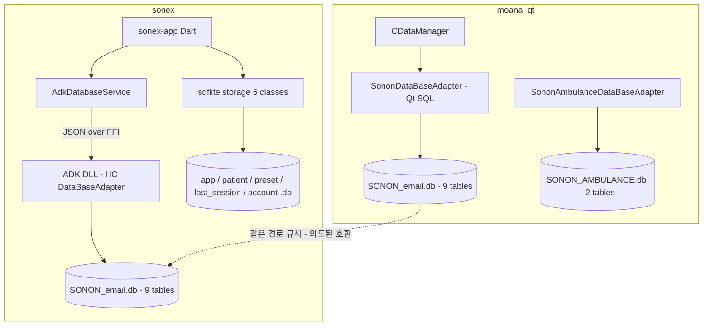
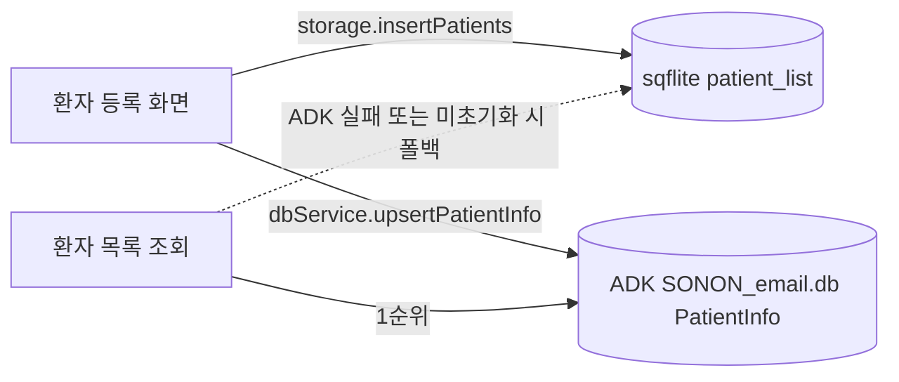

# 클라이언트 로컬 DB — 저장 데이터·스키마·처리 방식

`moana`(Qt)와 `sonex`(Flutter)가 **단말에 실제로 무엇을 어떤 테이블로 저장하고, 어떻게 읽고 쓰는가**를 코드로 실측한 문서다. 두 앱 모두 SQLite 로컬 DB를 쓰고, 환자·검사·스냅샷 같은 **PHI 가 전부 여기 들어간다.**

측정 기준 ref — `moana` = `origin/service_QT693`(2026-07-27) · `sonex-app`·`sonex-framework` = `origin/master`(2026-07-30). sonex 두 저장소는 `feature-apply_v1.23.4` 와 DB 계층 diff **0바이트**라 브랜치 선택이 결과를 바꾸지 않는다(`git diff --stat` 실측).

> DB **암호화 엔진**(wxSQLite3/sqlite3secure, 플랫폼별 링크 차이, fail-open, legacy 재시도 결함)은 [sonex-framework.md §8.1b](sonex-framework.md) 가 SOT다. 여기서는 **저장되는 데이터와 그 처리 방식**을 다루고, 암호화는 경계 조건으로만 인용한다.

---

## 1. 결론

| # | 실측 | 근거 |
|---|---|---|
| 1 | **스키마 정본은 1벌인데 구현이 3벌이다** — `moana`(Qt SQL) · `sonex-framework` ADK(raw sqlite3 C API) · `sonex-app`(Dart sqflite) | §2 |
| 2 | **moana ↔ ADK 의 DDL 은 9테이블 93컬럼이 전부 동일하다** — 컬럼명·타입·NOT NULL·PK 까지 전수 대조에서 **차이 0** | §3.1 |
| 3 | **sonex 는 같은 데이터를 두 곳에 쓴다** — 환자·앱설정이 ADK DB(C++)와 sqflite DB(Dart) **양쪽에 각각 저장**되고, 읽기는 ADK 우선·sqflite 폴백이다. 두 저장소를 맞추는 코드는 없다 | §6 |
| 4 | **세 구현 모두 트랜잭션이 없다** — `BEGIN`/`COMMIT` 호출 0건(sqflite `batch()` 는 예외). 환자 삭제처럼 4테이블+파일시스템을 함께 건드리는 연산이 원자적이지 않다 | §5.3 |
| 5 | **질의를 문자열로 조립한다** — moana 는 준비된 문(prepared statement) 사용 **0건**, ADK 는 바인딩 3건 대 문자열 조립 25건. 이스케이프는 손으로 하고, 빠뜨린 경로가 남아 있다 | §5.1 |
| 6 | **스키마 버전 개념이 없다** — `user_version` 미사용. `CREATE TABLE IF NOT EXISTS` + `ALTER TABLE` 하드코딩 나열이 마이그레이션의 전부다 | §5.4 |
| 7 | **sonex-app 이 평문 비밀번호를 저장한다** — `passwordHash` 컬럼에 해시가 아니라 **입력한 비밀번호 원문**이 들어가고, 공개된 예제 키로 AES 암호화된다. moana·ADK 는 SHA-256 해시를 넣는다 | §7.4 |

---

## 2. 저장 스택 지형도



| 스택 | 언어·API | DB 파일 | 테이블 | 컬럼 |
|---|---|---|---:|---:|
| **A. moana** | C++ / `QSqlDatabase`·`QSqlQuery` | `SONON_<email>.db` | 9 | 93 |
| **A′. moana Ambulance** | C++ / `QSqlDatabase` | `SONON_AMBULANCE.db` | 2 | 18 |
| **B. sonex-framework ADK** | C++ / `sqlite3_*` C API | `SONON_<email>.db` | 9 | 93 |
| **C. sonex-app** | Dart / `sqflite` | 5개 파일 | 5 | 73 |

**B 는 A 와 같은 파일을 겨냥한다.** `HCDatabaseHelper.cpp:72` 주석이 명시한다 — *"SononX(Moana) DB 호환을 위해 AppNamePrefix(\"SONEX\") 서브폴더 제거. 최종 구조: `<appDataRoot>/<userid>/SONON_<userid>.db` (참고: Moana 와 동일한 구조 — 4 플랫폼 모두 통일)"*. 암호화 키까지 moana 상수를 그대로 재사용한다(`HCDatabaseCrypto.cpp:30-31`). 즉 **moana 사용자의 기존 DB를 sonex 가 그대로 열도록 설계**돼 있다.

**C 는 그 호환 계통 밖에 있다.** `getDatabasesPath()` 아래에 별도 파일 5개를 만든다(데스크톱은 `<appSupport>/databases/`, `main.dart:339-351`).

---

## 3. 스키마 전수

### 3.1 A·B 공통 — 9테이블 93컬럼 (DDL 동일)

`SononDataBaseAdapter.cpp:31-154` 와 `HCDataBaseAdapter.cpp:24-121` 의 DDL을 컬럼명·타입·`NOT NULL`·`PRIMARY KEY` 단위로 전수 파싱해 대조했다 — **9테이블 전부 동일, 차이 0건**.

| 테이블 | 컬럼 | PK | 저장 내용 |
|---|---:|---|---|
| `PatientInfo` | 10 | `idx` (AUTOINCREMENT) | **환자 식별정보** — PatientID·PatientName·Sex·BirthDate·RegDate·Note·ProfilePath·LMP·EDD |
| `StudyInfo` | 9 | `StudyInstanceUID` | 검사 — PatientID·StudyDate·StudyTime·StudyDcmPath·LastInstanceUID·StudyName·LMP·EDD |
| `SnapshotInfo` | 10 | `SnapshotID` | 영상 스냅샷 — StudyInstanceUID·RawPath·JpgPath·Mp4Path·Mp4Type·SnapType·Playtime·ScanMode |
| `DcmFileInfo` | 4 | `SnapshotID`+`DcmPath` | DICOM 파일 — CompressType·PACSSent |
| `WorkItemInfo` | 16 (+1) | `StudyInstanceUID` | DICOM Worklist — PatientID·PatientName·BirthDate·Sex·PregnancyStatus·PerformingPhysician·StationName 등. `AccessionNumber` 는 DDL 에 없고 `ALTER` 로만 추가된다 |
| `AppSetting` | 13 | **없음** | 계정 — Email·Uid·PasswordHash·Token·DisplayName·Country·Organization·PhoneNumber·EncryptKey·GroupId·Occupation·SerialNumber·AccountState |
| `AppLog` | 2 | `Timestamp` | 구 로그. 코드 주석이 `will deprecate` 로 표기 |
| `LogList` | 9 | `Timestamp` | 감사 로그 — DateTime·IsUploaded·IsForServer·IsForUser·DeviceSerial·EventCode·EventParams·LocalParams |
| `DeviceData` | 20 | `Serial` | 장비·배터리 — Model·ODM·IsStolen·Ssid·**Password**·MacAddress·FwVersion·ProbeId·CvieKey·TotalScanTime/Count·Cycle·**Longitude·Latitude** |

데이터 계층은 **Patient → Study → Snapshot → DCM File** 이다(ADK 문서 `02_DATABASE_SCENARIOS.md` 및 `adk_database_service.dart:18` 명시). 다만 **외래키 제약이 하나도 선언돼 있지 않다** — 계층은 코드 관례이지 스키마가 보장하는 것이 아니다.

주목할 컬럼 3개:

- `DeviceData.Password` — 장비 Wi-Fi AP 비밀번호가 로컬 DB에 평문 컬럼으로 남는다
- `DeviceData.Longitude`·`Latitude` — 장비 사용 **위치 좌표**를 저장한다
- `AppSetting` 에 **PK가 없다.** 단일 행 테이블로 쓰되 `DELETE` 후 `INSERT` 로 흉내낸다(`SononDataBaseAdapter.cpp:1123-1125`, `HCDataBaseAdapter.cpp:1104`)

### 3.2 A′ — moana 전용 Ambulance DB (2테이블)

`SononAmbulanceDataBaseAdapter.cpp:19-44`. **sonex 에는 대응물이 없다.**

| 테이블 | 컬럼 | PK | 내용 |
|---|---:|---|---|
| `DataInfo` | 6 | `AmbulanceID` | Protocol·SenderID·DateTime·ProfilePath·DataSent |
| `SpotInfo` | 12 | `SpotInfoID`+`SpotNumber` | 러시아 구급차 프로젝트용 스팟별 영상 — RawPath·JpgPath·Mp4Path·SnapType·Playtime·ScanMode·Sent |

### 3.3 C — sonex-app sqflite (5파일 5테이블 73컬럼)

| DB 파일 | 테이블 | 컬럼 | `version` | `onUpgrade` | 소스 |
|---|---|---:|---:|---|---|
| `app_<email>.db` | `app_settings` | 14 | 2 | **있음** (`rememberMe` 추가) | `app_settings_storage.dart:22-59` |
| `patient_<email>.db` | `patient_list` | 11 | 1 | 없음 | `patient_list_storage.dart:31-58` |
| `preset_<email>.db` | `preset_list` | 30 | 1 | 없음 | `preset_data_storage.dart:31-77` |
| `last_session_<email>.db` | `last_session` | 2 | 1 | 없음 | `last_session_storage.dart:42-59` |
| `account_<email>.db` | `accounts` | 16 | 1 | 없음 | `profile_storage.dart:18-48` |

- `patient_list` = `PatientInfo` 10컬럼 + `state`. **`PatientID` 에 `UNIQUE` 를 걸었다** — A·B 에는 없는 제약이다(§7.1)
- `preset_list` 30컬럼은 스캔 파라미터 전체를 **컬럼 하나씩** 펼친 것이다(gain·dr·tgc1~4·sri_e·pdi·prf·pwGain·sample_volume…). 파라미터가 늘 때마다 스키마가 바뀐다
- `last_session` 은 그 반대 설계다 — `data TEXT` 한 컬럼에 JSON 통째로 넣는다. 주석이 이유를 밝힌다: *"컨트롤 집합이 늘어도 스키마 마이그레이션이 없도록 단일 행에 JSON 으로 저장"*(`last_session_storage.dart:15`). **같은 저장소 안에서 정반대 전략 둘이 공존**한다
- `accounts` 테이블에는 **읽기·쓰기 메서드가 하나도 없다.** `ProfileStorage` 는 `_onCreate` 만 있고 CRUD 가 없으며, 클래스 자체가 자기 파일 밖에서 참조되지 않는다(`git grep ProfileStorage` = 정의부 4줄뿐). **테이블만 만들고 끝난 죽은 코드**다

### 3.4 죽은 저장 계층 2건

| 위치 | 정체 | 상태 |
|---|---|---|
| `sonex-app` `lib/data/local_db/patient_info.dart` | `libpatient_info.so` 를 dart:ffi 로 부르는 별도 환자 DB 래퍼(120줄) | ADK 도입 이전 시도로 보인다. 참조처 없음 |
| `moana` `app/main.cpp:161-566` | `TestNewCipherDB` · `TestWithoutEncryption` 등 DB 진단 함수 4개(약 300줄) | 호출부가 `740-743` 에 **주석 처리**돼 출하 소스에 남아 있다 |

---

## 4. 파일 배치와 계정 전환

### 경로

| 스택 | 경로 |
|---|---|
| A | `<appDataLocation>/<userID>/<dbNamePrefix>_<userID>.db` (`DataManager.cpp:106-109`) |
| A′ | `<userDataRoot>/<dbNamePrefix>_AMBULANCE.db` (`AmbulanceDataManger.cpp:76`) |
| B | `<appDataRoot>/<userid>/SONON_<userid>.db` (`HCDatabaseHelper.cpp:106`) |
| C | `<getDatabasesPath()>/<용도>_<email>.db` |

**`userID` 는 이메일 주소다.** 즉 계정 이메일이 디렉터리명이자 DB 파일명이 된다.

**`dbNamePrefix` 가 A 에서는 컴파일 타임 분기다** — `DataManager.h:136,138` 이 `SONON_FUJI_L43K` 와 `SONON` 으로 갈린다. B 는 `L"SONON"` 고정이다(`HCDatabaseHelper.h:54`). **FUJI OEM 빌드의 moana DB 는 파일명부터 달라 ADK 가 찾지 못한다** — §2 의 호환 설계가 OEM 변종에서는 성립하지 않는다.

### 로그인 전 상태와 이름 바꾸기

A 는 로그인 전에 `SONON_DEFAULT.db` 로 시작하고, 로그인하면 **디렉터리와 DB 파일을 rename** 해서 계정 DB로 승격시킨다(`DataManager.cpp:145-160`). 실패해도 반환값을 보지 않는다 — `QFile::rename()` 결과가 버려진다.

C 는 `setEmail()` 로 `_database = null` 을 놓고 다음 접근에서 새 파일을 연다(`patient_list_storage.dart:15-18`). **이전 핸들을 닫지 않는다** — 계정을 전환할 때마다 열린 SQLite 커넥션이 남는다.

### 상대·절대 경로 판정이 문자열 검색이다

A·B 모두 DB에 저장할 때 경로를 상대화하고 읽을 때 절대화한다. 그 판정이 이렇다:

```cpp
// moana DataManager.cpp:267-272 / ADK HCDatabaseHelper.cpp:119-124 — 동일 로직
bool isAbsoluteDbPath(const QString &path) {
    QString userID = GlobalContext::getInstance()->getUserID();
    return path.indexOf(userID) >= 0;
}
```

**경로가 절대경로인지를 "문자열 안에 사용자 이메일이 들어 있는가"로 판정한다.** 파일시스템 경로 판정이 아니다. 환자 ID·검사 이름·파일명에 이메일 문자열이 우연히 포함되면 상대경로가 절대경로로 오인된다. 이 로직이 A 에서 B 로 그대로 이식됐다.

---

## 5. 처리 방식

### 5.1 질의 생성 — 문자열 조립

| 스택 | 준비된 문 | 문자열 조립 | 이스케이프 |
|---|---|---|---|
| **A** | **0건** (`framework/` 전체에서 `prepare`·`bindValue` 0) | 전부 | `replace("'","''")` 를 손으로, 일부 경로만 |
| **B** | `sqlite3_prepare_v2` 20건 / `sqlite3_bind_*` **3건** | `sqlite3_exec` 25건 | `escapeQuotes()` 93회 호출, 일부 경로 누락 |
| **C** | `where`/`whereArgs` 파라미터 바인딩 | 없음 | 불필요 |

A 의 전형적 형태:

```cpp
// SononDataBaseAdapter.cpp:375-385
ptInfo->PatientID.replace("'", "''");     // 호출자의 객체를 직접 변형한다
QString queryString = "INSERT OR REPLACE INTO '" + strPatientInfo + "' (...)"
    + QString(" VALUES ('%1', '%2', ...) ").arg(ptInfo->PatientID)...;
query.exec(queryString);
```

두 가지가 문제다.

1. **이스케이프가 호출자의 객체를 파괴한다.** `ptInfo` 는 비-const 포인터이고 `replace()` 는 제자리 치환이라, 삽입 후 메모리상의 환자명에 `''` 가 영구히 남는다
2. **적용 범위가 들쭉날쭉하다.** 삽입·수정 경로만 이스케이프하고 **삭제·조회 경로는 하지 않는다** — `DeletePatientInfo`(`:411`)·`getPatientInfo`(`:447`)·`getAllStudyInfoByPID`(`:585`)·`getSnapshotInfoBySnapshotID`(`:888`) 모두 원문을 그대로 붙인다. 이름에 아포스트로피가 든 환자(O'Brien 등)는 등록은 되고 **조회·삭제에서 구문 오류로 실패**한다

B 는 A 보다 이스케이프를 넓게 적용했지만(93회) `UpsertSnapshotInfo`(`:397-400`)·`UpdateSnapshotInfo`(`:422-427`) 에서 `SnapshotID`·`SnapshotName`·`StudyInstanceUID`·`Mp4Type`·`Playtime` 은 여전히 원문이다. **경로 3개만 이스케이프하고 나머지 5개를 빠뜨린 형태**다.

C 만 이 문제에서 자유롭다 — sqflite 의 `where`/`whereArgs`·맵 기반 `insert`/`update` 를 쓰므로 값이 SQL 문법에 섞이지 않는다.

### 5.2 조회 결과 매핑 — 위치 기반 하드코딩

A·B 모두 `query.value(N)` / `sqlite3_column_*(stmt, N)` 의 **정수 인덱스**로 컬럼을 읽는다. 이름 기반 접근이 없다.

가장 취약한 곳은 3테이블 조인이다:

```
SELECT PatientInfo.*, StudyInfo.*, SnapshotInfo.* FROM SnapshotInfo
  INNER JOIN StudyInfo ...  INNER JOIN PatientInfo ...
```

결과 추출기가 **오프셋을 상수로 박아 둔다** — `startColum = 0` / `10` / `19`(moana `:1359,1380,1400`, ADK `:678,712,742`). PatientInfo 10컬럼 → StudyInfo 가 10부터, StudyInfo 9컬럼 → SnapshotInfo 가 19부터라는 계산이다.

**앞쪽 테이블에 컬럼이 하나라도 추가되면 뒤쪽 전부가 밀린다.** 그런데 이 코드베이스의 마이그레이션 수단이 바로 `ALTER TABLE ... ADD COLUMN`(§5.4)이고, 추가된 컬럼은 테이블 끝에 붙는다. `PatientInfo` 나 `StudyInfo` 에 컬럼을 하나 더하는 순간 이 조인 조회가 조용히 잘못된 값을 읽는다. 이 오프셋 3개가 A 에서 B 로 값까지 그대로 이식됐다.

같은 클래스 안에서 **컬럼 순서가 두 벌 공존**하기도 한다. `getAllStudyInfo()`(`:538-548`)는 `SELECT` 목록을 `... LastInstanceUID, LMP, EDD, StudyName` 순으로 명시해 읽지만, 조인 추출기는 `SELECT *` 의 물리 순서(`StudyName, LMP, EDD`)를 가정한다. 각각은 자기 문맥에서 맞지만 **두 순서가 한 클래스에 섞여 있다.**

### 5.3 트랜잭션 — 없음

`BEGIN`/`COMMIT`/`ROLLBACK` 호출이 A·B 양쪽 DB 계층에서 **0건**이다. moana 에 유일하게 존재하는 `db.transaction()` 은 `app/main.cpp:396-407` 의 진단 함수 안이고, 그 함수는 호출되지 않는다(§3.4).

영향이 실제로 드러나는 지점:

- **환자 삭제**는 `PatientInfo` + `StudyInfo` + `SnapshotInfo` + `DcmFileInfo` 4테이블과 **디스크의 DICOM/JPG/MP4 파일**을 함께 지운다. 중간에 실패하면 DB 행 없는 고아 파일, 혹은 파일 없는 DB 행이 남는다
- 삭제 구현이 **N+1 루프**다 — `DeleteStudyInfoByPID` 는 해당 환자의 study 를 전부 읽어 한 건씩 `DELETE` 를 날린다(`:522-533`). `DeleteWorkItemInfoByPID`(`:696-708`)는 한술 더 떠 **전체 workitem 을 메모리로 읽어 애플리케이션에서 필터링**한다
- `UpsertAppSettings` 는 `DELETE FROM AppSetting` 후 `INSERT` 다(`:1123-1125`). 두 문 사이에서 실패하면 **계정 정보가 통째로 사라진다**

C 는 대량 삽입에 `batch()` 를 쓴다(`patient_list_storage.dart:63-77`, `preset_data_storage.dart:82-122`) — sqflite 의 batch 는 내부적으로 트랜잭션이므로 이 경로만 원자적이다.

### 5.4 마이그레이션 — 버전 번호가 없다

A·B 의 스키마 진화 수단은 두 줄짜리 관용구다.

```cpp
if (!IsTableExist(strXxx)) CreateTable(sqlXxx);           // 테이블 신규 생성
AddColumnIfNotExist(strSnapshotInfo, "ScanMode", "INTEGER"); // 컬럼 추가
```

- `PRAGMA user_version` 을 **읽지도 쓰지도 않는다**(전 저장소 grep 0건). 현재 DB가 어느 스키마 세대인지 알 방법이 없다
- `IsTableExist()` 는 `PRAGMA table_info` 가 행을 하나라도 내면 참이다 — **테이블이 구버전 컬럼 구성이어도 "있다"고 판정**하고 `CREATE TABLE` 을 건너뛴다
- 그래서 컬럼 추가는 전적으로 `AddColumnIfNotExist` 호출 나열에 의존하는데, 그 목록이 **6줄에서 멈춰 있고 그중 1줄은 중복**이다(`ScanMode` 가 연달아 두 번, moana `:316-317` / ADK `:208-209`)
- `PatientInfo.LMP`·`EDD`, `StudyInfo.StudyName`·`LMP`·`EDD`, `SnapshotInfo.Playtime` 에 대한 `AddColumnIfNotExist` 는 **주석 처리돼 있다**(moana `:310-315`). 이 컬럼들은 현재 `CREATE TABLE` 에 들어 있으므로 신규 설치는 문제없지만, **그 이전에 만들어진 DB는 컬럼을 영원히 얻지 못한다.** 그런 DB에서 `query.value(8)`(LMP)은 무효값을 반환한다
- 롤백 경로가 없다. `SononDBReset()` 은 **DB 파일을 삭제**하는 것이다(`:177-181`)

C 는 sqflite 의 `version`/`onCreate`/`onUpgrade` 를 쓰므로 프레임워크 수준의 버전 관리가 있다. 다만 **5개 중 `app_settings` 하나만 `onUpgrade` 를 구현**했고 나머지 4개는 `version: 1` 에 업그레이드 훅이 없다(§3.3) — 이 4개는 다음 스키마 변경 때 같은 문제에 부딪힌다.

### 5.5 동시성

| 스택 | 보호 |
|---|---|
| A | `CDataManager` 의 `QMutexLocker` — 일부 메서드만 |
| B | `HCDatabaseHelper` 의 `std::lock_guard` — **메서드 정의 42개 중 5개**(`:350,377,395,483,503`) |
| C | Dart 단일 isolate + sqflite 내부 직렬화 |

B 에서 잠긴 5개는 `getPatientInfoByPatientID`·`UpsertSnapshotInfo`·`UpsertStudyInfo`·`UpsertDcmFileInfo`·`UpsertPatientInfo` 다. `DeletePatientInfo`·`getAllSnapshotInfoByDateRange`·`UpsertAppSettings` 등 나머지 37개는 잠금 없이 같은 `sqlite3*` 핸들을 공유한다.

A 에는 별도의 함정이 있다. `SononDataBaseAdapter` 는 `QSqlDatabase::addDatabase("...")` 를 **연결 이름 없이** 호출해 기본 연결(`qt_sql_default_connection`)을 쓴다. `SononAmbulanceDataBaseAdapter` 는 iOS·macOS·WinRT 경로에서만 `addDatabase("SQLITECIPHER", "AMBULANCE")` 로 이름을 주고(`:108`), **Android(`:80,97`)와 Windows/Linux(`:124`)에서는 이름 없이 호출한다.** 그 플랫폼에서 Ambulance DB를 열면 **기본 연결이 교체되어 환자 DB 핸들이 Ambulance 파일을 가리키게 된다.**

---

## 6. sonex 의 이중 저장

`sonex-app` 은 환자와 앱설정을 **두 저장소에 각각 쓴다.**



| 데이터 | Dart sqflite | ADK C++ DB | 근거 |
|---|---|---|---|
| 환자 | `patient_list` | `PatientInfo` | `patient_list_controller.dart:292` + `:297` (등록) · `:486` + `:489` (수정) |
| 앱설정 | `app_settings` | `AppSetting` | `app_settings_storage.dart:62` · `HCFrameworkBusinessLogic.cpp:349,1199` (ADK 가 로그인 중 자체 기록) |
| 프리셋·마지막세션 | 있음 | 없음 | — |
| 검사·스냅샷·DICOM·Worklist·장비·로그 | 없음 | 있음 | — |

읽기는 ADK 우선이고, ADK 가 실패하거나 미초기화면 sqflite 로 떨어진다(`patient_list_controller.dart:188-210`). 코드 주석이 이중 쓰기의 이유를 직접 밝힌다 — *"ADK DB가 쓰이는 경우: 목록은 getAllPatientList 기준이므로 SDK에 upsert하지 않으면 직후 fetchAllPatients()에서 방금 등록한 환자가 사라짐"*(`:293-294`). **sqflite 가 정본이 아니라는 것을 알면서도 sqflite 쓰기를 남겨 둔 상태**다.

따라서:

- **두 저장소를 동기화·조정하는 코드가 없다.** ADK upsert 가 실패하면 로그만 찍고 넘어가므로(`:299-303`) sqflite 에만 존재하는 환자가 생긴다
- 그 상태에서 폴백이 걸리면 **환자 목록이 조회 시점마다 달라진다**
- **삭제 경로는 확인이 필요하다** — 이중 쓰기가 등록·수정 경로에서만 확인됐다(§9)

`AppSetting` 은 더 갈라져 있다. 같은 계정 정보를 두 곳에 저장하면서 **비밀번호 필드의 의미가 서로 다르다**(§7.4).

---

## 7. 실측된 결함

### 7.1 `PatientInfo` 의 `INSERT OR REPLACE` 는 아무것도 대체하지 않는다

`PatientInfo` 의 PK 는 `idx INTEGER PRIMARY KEY AUTOINCREMENT` 뿐이고, **`PatientID` 에는 `UNIQUE` 도 PK도 없다.** 삽입문은 `idx` 를 지정하지 않는다:

```sql
INSERT OR REPLACE INTO 'PatientInfo' (PatientID, PatientName, Sex, ...) VALUES (...)
```

`idx` 가 매번 새로 발급되므로 **충돌이 발생하지 않고, `OR REPLACE` 는 한 번도 동작하지 않는다.** 같은 `PatientID` 로 두 번 등록하면 행이 두 개 생긴다.

유일한 방어는 `upsertPatientInfo` 의 `if (patientInfo.PatientID.compare(beforePID)==0) return;`(`DataManager.cpp:521-524`)인데, 이것은 **편집 직전 ID 와 같은지**를 볼 뿐 테이블 조회가 아니다. A·B 양쪽 동일하다.

`sonex-app` 의 sqflite `patient_list` 는 `PatientID TEXT NOT NULL UNIQUE` 로 이 문제를 고쳤다 — **세 구현 중 하나만 제약을 갖는다.**

### 7.2 ADK 의 `EncryptKey` 복구가 없는 테이블을 조회한다

```cpp
// HCDataBaseAdapter.cpp:1091
const std::string queryEncryptKey = "SELECT EncryptKey FROM AppSettings LIMIT 1;";
```

**테이블 이름은 `AppSetting`(단수)이다** — `strAppSetting = "AppSetting"`(`:11`)이고 `CREATE TABLE` 도 그 이름을 쓴다. `AppSettings` 라는 테이블은 존재하지 않는다.

`sqlite3_prepare_v2` 가 실패하지만 반환값이 `== SQLITE_OK` 로만 걸러져 **조용히 건너뛴다**(`:1093`). 결과적으로 이 블록의 목적 — *"Restore EncryptKey from DB if empty"* — 이 항상 무효다. moana 원본(`SononDataBaseAdapter.cpp:1115`)은 `strAppSetting` 변수를 써서 올바르다. **이식 과정에서 생긴 회귀**다.

`EncryptKey` 는 클라우드 데이터 암호화 키 컬럼이므로, 빈 값으로 `UpsertAppSettings` 가 호출될 때마다 기존 키가 복구되지 않고 빈 문자열로 덮인다.

### 7.3 로그 보존 정책이 코드에 박혀 있다

- 사용자 조회용 로그는 **최근 100건 고정** — `... ORDER BY Timestamp DESC LIMIT 100`(moana `:1166`, ADK `:1396`)
- 삭제 기준은 **1년 상수** — `... - 31536000000`(moana `:1233`, ADK `:1457`). 설정으로 바꿀 수 없고, 윤년을 고려하지 않는다

`LogList` 는 [cybersecurity.md](cybersecurity.md) 가 UC-04(감사기록 생성) 근거로 삼는 테이블이다. 위 두 상수가 그 감사기록의 실질 보존 범위를 규정한다.

### 7.4 `sonex-app` 이 비밀번호 원문을 저장한다

| 스택 | `PasswordHash`/`passwordHash` 에 들어가는 값 | 근거 |
|---|---|---|
| **A** moana | `SononCloudApi::encryptSha256Hex(password)` — **SHA-256 hex** | `SononCloud.cpp:220` → `:1116` |
| **B** ADK | `np->encryptSha256Hex(password)` — **SHA-256 hex** | `HCFrameworkBusinessLogic.cpp:1187,1199` |
| **C** sonex-app | `pwText.value` — **입력한 비밀번호 원문** | `login_controller.dart:644` |

C 의 값은 `EncryptionHelper` 로 AES-256-CBC 암호화해 저장하지만(`app_settings_storage.dart:66`), 그 구현이 이렇다:

```dart
// encryption_helper.dart:7,12
final Key _key = Key.fromUtf8('my32lengthsupersecretnooneknows!');  // AES 키 (32 bytes)
final iv = IV.fromLength(16);  // 16바이트 IV (AES에서 사용)
```

- **키가 `encrypt` 패키지 문서의 예제 문자열 그대로다.** 소스에 하드코딩돼 있고 모든 설치본이 같은 키를 쓴다
- **IV 가 매번 같다.** `IV.fromLength(16)` 은 길이만 지정해 만드는 생성자이므로 값이 고정되고, 그 IV 를 암호문과 함께 저장한다. *"IV는 암호화할 때마다 새로 생성"* 이라는 바로 위 주석(`:11`)과 어긋난다

복호화된 원문은 자동 로그인에서 비밀번호 입력란에 복원되고(`login_controller.dart:1144,1177`) 서버로 그대로 전송된다(`:1186`). 즉 **되돌릴 수 있는 난독화이며, 되돌리는 것이 설계 의도다.**

여기에 §3.3 의 조건이 겹친다 — `app_<email>.db` 는 sqflite 평문 DB이고 ADK 의 암호화 계통 밖에 있다. **Android·iOS 에서도 이 파일은 암호화되지 않는다.**

### 7.5 플랫폼별 암호화 경계가 스택마다 다르다

| 플랫폼 | A moana | B ADK | C sqflite |
|---|---|---|---|
| Android (SDK > 27) | SQLITECIPHER | sqlite3secure | **평문** |
| Android (SDK ≤ 27) | **평문 QSQLITE** | sqlite3secure | **평문** |
| iOS | QWXSQLITE3 (없으면 SQLITECIPHER) | sqlite3secure | **평문** |
| macOS | QWXSQLITE3 (없으면 SQLITECIPHER) | **평문** | **평문** |
| Windows | **평문 QSQLITE** | **평문** | **평문** |

근거 — moana `SononDataBaseAdapter.cpp:192-289`, ADK `HCDataBaseAdapter.h:10-14`(빌드가 링크하는 SQLite 자체가 다르다) 및 `:170`.

이 표에서 새로 드러나는 것 두 가지:

1. **Android SDK ≤ 27 에서 moana 는 암호화하지 않는다** — `androidinfo->deviceSDKVersion() > 27` 분기의 else 가 평문 `QSQLITE` 다(`:212-221`). Android 8.1 이하 단말의 출하 DB 는 평문이다
2. **macOS 에서 A 와 B 가 어긋난다** — moana 는 암호화하고 ADK 는 하지 않는다. §2 의 "같은 DB 파일 공유" 설계가 macOS 에서는 성립할 수 없다

---

## 8. 리팩토링 관점

| 관측 | 함의 |
|---|---|
| DDL 이 A·B 에서 **완전 동일**(93컬럼 차이 0) | 스키마는 이미 정본이 하나다. 통합 대상은 **스키마가 아니라 접근 계층**이다 |
| A → B 이식이 **결함까지 함께 옮겼다** — 오프셋 0/10/19, `isAbsoluteDbPath` 문자열 검색, PK 없는 `INSERT OR REPLACE`, 중복 `AddColumnIfNotExist`, 트랜잭션 부재 | 재작성이 아니라 **기계적 번역**이었다. 정본 1벌을 만들 때 원본의 결함을 그대로 승계하지 않도록 별도 판정이 필요하다 |
| B 가 이식 중 **새 결함을 만들었다** — `AppSettings` 오타(§7.2), 스냅샷 이스케이프 누락(§5.1) | 동작 보존이 검증되지 않았다. HC 프로토콜 정본화([protocol-sot](../refactoring/proof/protocol-sot/))에서 쓴 *"컴파일러가 판정한다"* 방식이 여기에도 필요하다 |
| C 가 **A·B 의 부분집합을 중복 구현**했다(환자·앱설정) | SOT 분열은 리팩토링의 결과가 아니라 **현재 상태**다. 어느 쪽을 정본으로 삼을지가 선결 판단이다 |
| C 만 파라미터 바인딩·`UNIQUE`·버전 관리를 갖췄다 | 뒤에 쓴 계층이 더 낫다. 정본을 A·B 쪽으로 잡으면 이 개선이 되돌아간다 |

---

## 9. 미확인

- **환자 삭제 시 이중 쓰기 처리** — `sonex-app` 의 삭제 경로가 sqflite·ADK 양쪽을 지우는지 확인하지 않았다. 등록·수정만 실측했다
- **실제 DB 파일 검증** — 실단말의 `.db` 파일을 열어 스키마·행을 확인하지 않았다. 이 문서는 전부 정적 코드 분석이며, `AddColumnIfNotExist` 주석 처리(§5.4)가 출하 DB에서 실제로 결손을 만들었는지는 파일로만 확정된다
- **`IV.fromLength(16)` 의 구체적 바이트값** — `encrypt` 5.0.3 패키지 소스가 이 워크스페이스에 없어 생성 규칙을 코드로 확인하지 못했다. 확정된 것은 **길이만 지정하는 생성자를 쓰므로 호출마다 같은 값이 나온다**는 점이다
- **`AppLog` 테이블의 현 사용 여부** — DDL 과 `will deprecate` 주석은 있으나 실제 쓰기 경로가 `LogList` 로 완전히 넘어갔는지 추적하지 않았다
- **moana Ambulance DB 의 현행성** — 러시아 구급차 프로젝트(`russia-server`, 2023-03 최종)와 연관돼 보이나 코드 활성 여부를 확인하지 않았다
