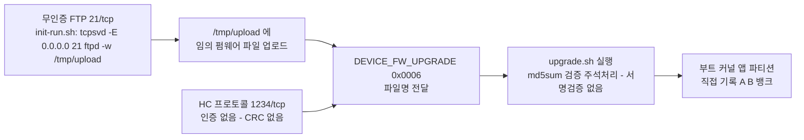
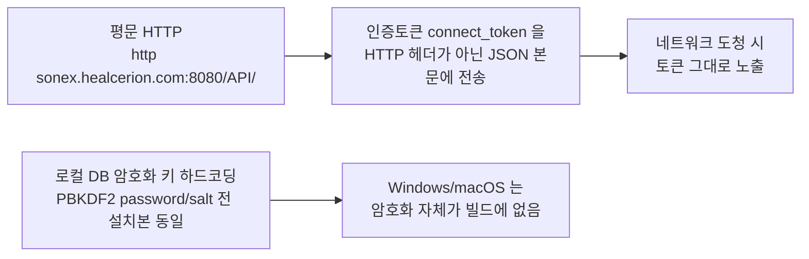

# 사이버보안 요구사항 대비 실측 — belle · sonex

> **기준 문서**: [../reference/mfds-cybersecurity-guideline.md](../reference/mfds-cybersecurity-guideline.md)(식약처 안내서-0995-05, 2025-01-10) — IA/UC/SI/DC/TRE/RA 6개 항목군 35개 요구사항.
> **범위**: `belle` = 장비 펌웨어(`device/legacy/belle-fw` `origin/production-fw-ver2.0` · `belle-bsp` `origin/production-fw` · `belle-kernel`·`belle-u-boot`·`belle-msp`). `sonex` = 호스트 앱·SDK(`client/legacy/sonex-app` `origin/feature-apply_v1.23.4` · `client/legacy/sonex-framework` `origin/master`).
> **근거**: 코드 직접 조사(2026-07-30). 판정 표기는 [../README.md](../../README.md) 규약(§검증은 adversarial)을 따른다 — **확인됨(충족)** / **확인됨(미충족·결함)** / **미확인** / **해당없음** 넷으로만 판정하고, 문서·PPT·저장소 설명에서 추론한 것은 없다.
> **법적 성격**: 이 문서가 인용하는 가이드라인 자체가 "민원인 안내서"로 법적 구속력이 없다([../reference/mfds-cybersecurity-guideline.md](../reference/mfds-cybersecurity-guideline.md) 머리말). 아래 판정은 **허가·심사 합격/불합격 결론이 아니라 코드 실측**이다.

## 0. 요약

두 축 모두 **개별 요구사항의 산발적 미비가 아니라, 인증·암호화·서명검증이 시스템 경계 전체에서 동시에 빠져 있는 구조**다. 세 가지가 belle·sonex 양쪽에 공통으로 확인된다.

1. **인증이 없다** — HC 프로토콜(장비↔앱, TCP 1234/1235)에 사용자·기기 인증 자체가 없고, belle의 FTP(21)는 인증이 아예 없으며, sonex의 클라우드 계정 인증은 있으나 단일요소(PIN·생체 없음)다.
2. **전송 구간이 전부 평문이다** — HC 프로토콜, belle의 FTP·진단 웹서버(80), sonex의 클라우드 API(`http://sonex.healcerion.com:8080`) 모두 암호화 없음. `moana`(구 앱)의 설계를 sonex가 그대로 물려받았음을 코드로 확인했다.
3. **업데이트에 서명·무결성 검증이 없다** — belle의 펌웨어 업그레이드(`upgrade.sh`)는 MD5 검증조차 주석처리돼 있고, sonex가 다운로드해 장비에 전달하는 펌웨어 이미지에도 서명 검증이 없다. 유일한 무결성 장치는 전송오류 탐지용 단순 바이트합산 체크섬뿐이다.

이 세 가지가 겹치면 **인증 없는 FTP로 임의 파일 업로드 → 서명검증 없는 HC 프로토콜 업그레이드 명령으로 그 파일을 장비 부트/커널/앱 파티션에 직접 기록**하는 단일 공격 경로가 성립한다(§3).

## 1. 항목군별 상세 — belle × sonex

범례: **충족** = 확인됨(충족 근거 있음) · **미충족** = 확인됨(미충족/결함, file:line 근거 있음) · **미확인** = 코드에서 못 찾음 · **N/A** = 해당없음(사유 명시)

### 식별 및 인증 (IA)

| ID | belle | sonex |
|---|---|---|
| IA-01 사용자 식별·인증 | **미충족** — 인터페이스별 편차. SSH(dropbear)는 계정+비밀번호 요구하나, FTP(21, `init-run.sh`)는 인증 자체 없음(전체 인터페이스 바인딩+쓰기 허용). HC 프로토콜은 식별자 매직만 확인(`sonon_receive.cpp:872-874`), 사용자·기기 인증 없음 | **충족(단일요소)** — 이메일+비밀번호 로그인 게이트(`login_page.dart`, `login_controller.dart:994`). PIN·생체인증 패키지는 `pubspec.yaml`에 없음(0건) |
| IA-02 계정 관리 | **미충족** — busybox `ADDUSER`/`DELUSER` 등 계정 도구가 빌드에서 제거(`rootfs_config`). `belle_flask`는 계정 3개(`user`/`admin`/`ncc`)가 소스에 하드코딩, CRUD 없음 | **충족** — SignUp/ChangeProfile/Withdrawal/ChangePassword 커맨드 구현(`HCNetworkProcess.cpp:99-338`) |
| IA-03 식별정보 관리 | **미충족** — 모든 장치가 동일 계정명(`root`/`user`/`admin`/`ncc`) 공유, 개별 식별자 없음 | **충족** — 이메일이 `PRIMARY KEY`(`app_settings_storage.dart:34`) |
| IA-04 인증정보 관리 | **미충족(핵심)** — root 비밀번호 평문 하드코딩(`rootfs_config:4265` `CONFIG_ROOTFS_ROOT_PASSWD="Q!12@W"`), `belle_flask`도 3계정 평문 하드코딩(admin=root와 동일 비밀번호 재사용), 강제 변경 로직 0건, `imagefeature-debug-tweaks=y`와 상충 | **미충족** — 로컬 캐시 비밀번호가 하드코딩 키(`encryption_helper.dart:7` `my32lengthsupersecretnooneknows!`)의 가역 AES로 "암호화"돼 있어 사실상 평문과 동등. 서버 전송은 salt 없는 SHA-256(`http_manager.dart:35`) |
| IA-05 비밀번호 강도 | **미충족** — PAM cracklib/pwquality 없음, `user/12345`는 5자리 숫자 | **충족** — 대문자·소문자·숫자·8자 이상 정규식 강제(`login_controller.dart:57-60`) |
| IA-06 인증정보 피드백 | **충족(제한)** — Linux 로그인·`belle_flask` 모두 마스킹 적용, 실패 메시지 일반화 | **부분 결함** — 필드 마스킹은 되나(`login_widget.dart:177`), 로그인 실패 시 "아이디 무효"/"비밀번호 불일치"를 구분 노출(`login_controller.dart:574-586`) |
| IA-07 로그인 실패 제한 | **미충족** — `belle_flask.py` `login()`에 시도횟수 카운트 없음, PAM tally 미탑재 | **미충족** — 클라이언트에 잠금 로직 없음(검색 0건). 서버측 정책은 범위 밖·미확인 |
| IA-08 시스템 사용 알림 | **미충족** — `/etc/issue`·`/etc/motd` 없음, `belle_flask` 로그인 화면에 경고 배너 없음 | **미충족** — 소유권/모니터링 경고 배너 검색 0건 |

### 사용 통제 (UC)

| ID | belle | sonex |
|---|---|---|
| UC-01 권한 부여 | **미충족** — OS 계층 root 단일권한(`sudo` 미포함), `belle_flask`의 3단계 분기는 정책 없는 하드코드 수준 | **미충족** — `accountRole` 필드는 있으나(`profile_model.dart:6`) 조건 분기에 쓰이는 곳 0건 |
| UC-02 모바일코드 통제 | **N/A** — 장비가 외부 실행코드를 수신·실행하는 경로 없음 | **충족(위험 낮음)** — WebView는 로컬 loopback 서버가 제공하는 번들 HTML만 로드(`local_server.dart:11,24`), 외부 URL 로딩 경로 없음 |
| UC-03 세션 잠금 | **미충족** — `PERMANENT_SESSION_LIFETIME` 등 타임아웃 설정 0건, 쉘 `TMOUT` 0건 | **미충족** — idle timeout·자동잠금 검색 0건. 오히려 토큰 만료 시 자동 재로그인(`login_controller.dart:1304`)으로 세션을 계속 유지 |
| UC-04 감사기록 생성 | **미충족(핵심)** — syslog가 빌드에서 제외(`rootfs_config:65`), 프로덕션 실행옵션(`-d`)이 `sonon`의 모든 로그를 강제 비활성화(`sonon.cpp:3333-3335`) | **충족(UI 미연동)** — `EVENT_CODE_*` 30여개·저장 스키마 존재(`AppLogDb.h`, `HCDataBaseAdapter.cpp:114`), 로그인·로그아웃·설정변경 시 실제 기록(`HCFrameworkBusinessLogic.cpp:1030,358,1043,1049`). 단 앱 UI에 조회 화면 없음(`setting_widget.dart:1392-1404` "No activity logged yet") |
| UC-05 감사 처리 실패 대응 | **미충족** — UC-04 부재의 직접 결과, 논할 대상 자체가 없음 | **미흡** — 로그 기록 예외를 디버그 로그만 남기고 catch(`HCFrameworkBusinessLogic.cpp:821-846`), 저장공간 초과 등 대응 로직 없음 |
| UC-06 타임스탬프 | **충족(제한)** — `DEVICE_TIME_SYNC`(0x2002) 존재하나 UC-04 부재로 감사기록용 실사용 근거 없음 | **충족** — epoch ms + 포맷 문자열 동시 생성(`AppLogDb.cpp:14-22`) |
| UC-07 부인 방지 | **미충족** — 감사기록 부재+계정 공유로 행위자 특정 불가 | **미충족** — 로그 스키마(`HCDataBaseAdapter.cpp:114`)에 행위자(이메일/계정ID) 컬럼 없음, `DeviceSerial`만 존재 |

### 시스템 무결성 (SI)

| ID | belle | sonex |
|---|---|---|
| SI-01 통신 무결성 | **미충족** — HC 프로토콜 CRC 검사 코드 없음(`sonon_receive.cpp:870-901` 주석만), `belle_flask`는 평문 HTTP(`app.run(...port=80)`, TLS 설정 0건), FTP도 평문 | **미충족(핵심)** — 클라우드 API 전체가 평문 HTTP(`http_manager.dart:34`, `HCNetworkProcess.cpp:17`) — **moana의 평문 설계를 그대로 물려받음을 코드로 확인**. HC 프로토콜도 암호화 없음. 500L/300 계열 펌웨어 업로드는 FTP(하드코딩 계정 `Q!12@W`/`12345`, `HCFirmwareController.cpp:28-29`) |
| SI-02 악성코드 보호 | **부분충족** — 커널 `STACKPROTECTOR_STRONG`·`STRICT_KERNEL_RWX`는 켜짐, 그러나 `MODULE_SIG`(커널모듈 서명검증)·`RANDOMIZE_BASE`(KASLR)·`SECURITY`(LSM) 전부 꺼짐 | **N/A(모바일)/미충족(데스크톱)** — Android·iOS는 OS 샌드박스 의존 타당. jailbreak/root 탐지 등 자체 방어는 검색 0건 — Windows/macOS(스토어 배포 아닌 경우)엔 미충족 |
| SI-03 보안 기능 검증 | **미충족** — `DEVICE_EMERGENCY_SELF_TEST`(0x1001) 핸들러가 헤더만 반사하는 빈 스텁(`sonon_receive_device.cpp:1509-1534`) | **미확인** — 자체 검증 절차 코드 검색 0건(OpenSSL 벤더 라이브러리 내부 상수만 검출) |
| SI-04 SW·정보 무결성 점검 | **충족(제한)** — `bcd/flash.c`가 설정데이터에 CRC32 적용(`:171,139-141`), 펌웨어 이미지 자체는 대상 아님 | **미확인** — 저장 설정값 체크섬 검증 코드 검색 0건. ADK 콜백 버퍼 손상 감지(`adk_callback_handler.dart:67,100,152`)는 IPC 파싱 방어이지 무결성 점검이 아님 |
| SI-05 입력값 검증 | **미충족(핵심)** — `packet_body_size`(클라이언트 통제 U32)를 상한 검증 없이 고정할당 버퍼(`PACKET_DATA_U`)로 읽어들임(`sonon.cpp:507-508,441-442`). 펌웨어 파일명도 무검증 `strcpy`(`sonon_receive_device.cpp:470`). 헤더 확인도 `&&`이어야 할 자리에 결함 있음(`sonon.cpp:3115`) | **부분충족** — HC 파싱에 길이·필드 검증 있으나(`HCInstructionSetDefault.cpp:86-90,120-124`) `// FIXME: Check header validation` 주석 존재. DICOM IP/포트는 명시적 검증기 있음(`setting_controller.dart:1115-1130`) |
| SI-06 오류 시 사전결정 상태 | **충족(제한)** — 배터리·온도 이상 시 사전정의 상태 전이(`sonon_receive_device.cpp:455-467`), watchdogd 존재 | **미확인** — 재연결 로직은 있으나 "사전 결정된 안전 상태" 개념과 정확히 부합하는 상태전이 특정 못함 |
| SI-07 오류 처리 | **충족(제한)** — 상태코드만 반환, 상세원인은 로컬 로그(그마저 프로덕션에서 비활성)로만 — 의도적 설계보다 로깅 부재의 부수효과 | **부분 결함** — IA-06과 동일 근거로 로그인 실패 사유 구분 노출 |
| SI-08 업데이트 기능 | **충족** — `DEVICE_FW_UPGRADE`(0x0006) + A/B 비활성뱅크 기록(`upgrade.sh`, `fw_setenv`) | **충족** — 앱 자체 버전체크(`http_manager.dart:9-30`, 비강제) + 장비 펌웨어 업그레이드 트리거(`HCFirmwareController.cpp`) |
| SI-09 업데이트 진본성·무결성 | **미충족(핵심)** — 유일한 체크섬 검증(`upgrade.sh:32` `md5sum -c`)이 주석처리, 서명 검증 코드 전무(전체 검색 0건). 업로드 경로 자체가 무인증 FTP | **미충족(핵심)** — 다운로드 펌웨어에 서명·해시 검증 없음. 유일한 무결성 장치는 단순 바이트합산 체크섬(`HCFirmwareController.cpp:206-215`, 전송오류 탐지용이지 변조 검증 아님) |
| SI-10 물리적 변조 방지 | **미확인** — 소스 수준에서 확인 가능한 봉인·잠금 로직 없음(회로도·BOM 미확보로 판단 제한) | **N/A** — 자체 하드웨어 인클로저 없음, 호스트 단말 제조사 책임 영역 |
| SI-11 부트 프로세스 무결성 | **미충족(핵심)** — U-Boot·FSBL 빌드 설정에 `CONFIG_FIT_SIGNATURE`·`CONFIG_RSA` 등 서명검증 옵션 없음, `BOOT.BIN` 생성 스크립트에 PPK/SPK 키 참조 0건. FSBL ELF에 Xilinx 보안부트 라이브러리 코드는 링크돼 있으나 활성화 인자가 없어 비활성으로 판단 | **N/A** — 앱 부트는 OS(iOS/Android/Windows/macOS) 책임, 자체 부트로더 없음 |

> **교차 확인** — 이 표는 belle·sonex 축이지만, `500c-sn-fw`(Socionext 별도 라인) 장비측 코드를 직접 읽어도 SI-09 와 같은 패턴이 나온다: `USSFUP_Custom.c` 의 유일한 무결성 장치가 **바이트 덧셈 체크섬**이고 서명 검증은 0건이다. 클라이언트(`HCFirmwareController.cpp`)·장비(`USSFUP_Custom.c`) 양쪽이 **같은 약한 체크섬으로 서로 왕복 대조할 뿐**이라는 뜻이다 — 상세 = [500c-firmware.md §3.2.2](500c-firmware.md).

### 데이터 기밀성 (DC)

| ID | belle | sonex |
|---|---|---|
| DC-01 정보 기밀성 | **미충족** — `belle_flask`가 환자식별정보를 평문 HTTP로 서비스, HC 데이터채널(1235)도 평문 | **미충족(플랫폼별 격차)** — Android/iOS는 DB 암호화(`HCDataBaseAdapter.cpp:163-168`) 적용되나 **Windows/macOS는 완전히 별도의 무코덱 SQLite를 링크해 암호화 자체가 빌드에 없음**([sonex-framework.md §8.1b](sonex-framework.md) 상세). 클라우드 전송도 평문(SI-01) |
| DC-02 보건의료정보 비식별화 | **미충족** — 환자 식별정보를 덤프 파일명에 그대로 사용(`belle_flask.py:1095`) | **미충족** — 환자 실명·ID·생년월일 그대로 저장(`patient_info.dart`), 비식별화 코드 검색 0건 |
| DC-03 안전한 암호화 사용 | **미충족(알고리즘은 적정)** — WiFi 키에 AES-256-CBC+PBKDF2-SHA256 사용하나(`aes256_cbc.c:39,54`) 패스워드·솔트가 소스 하드코딩(`sslenc.c:15-16`)이라 전 기기 공통 — 키 관리 부재로 무력화 | **미충족(핵심)** — 암호 패키지(AES-256·SHA-256)는 적정하나, DB 암호화 키 유도용 PBKDF2 password·salt가 소스 하드코딩(`HCDatabaseCrypto.cpp:29-30`)이라 전 설치본 동일 키. 게다가 그 암호화 자체가 §DC-01 결함으로 일부 플랫폼에서 작동하지 않음([sonex-framework.md §8.1b](sonex-framework.md)) |

### 이벤트 적시 대응 (TRE)

| ID | belle | sonex |
|---|---|---|
| TRE-01 감사로그 접근 제한 | **미충족** — UC-04 부재로 접근을 제한할 로그 자체가 없음 | **미흡** — UI 조회 화면 자체가 없어(읽기 접근 기능 부재) "인가된 사용자의 읽기 접근" 요건 충족으로 보기 어려움 |

### 자원 가용성 (RA)

| ID | belle | sonex |
|---|---|---|
| RA-01 DoS 방지 | **부분충족** — 세션 카운트 제어로 중복접속 시 기존 세션 강제종료(`sonon.cpp:105-130,2542-2545`), SYN flood 등 저수준 방어는 없음 | **N/A** — 클라이언트이며 유일한 리스닝 소켓이 loopback 전용(`local_server.dart:11`) |
| RA-02 백업 | **미충족** — 사용자데이터·설정 백업 기능 검색 0건 | **충족** — Export/Import 백업(`adk_backup_service.dart:96-135`), 비밀번호 기반 AES 암호화 |
| RA-03 복구·재구성 | **충족(제한)** — A/B 이중뱅크로 업그레이드 롤백 가능(`upgrade.sh`+`fw_setenv`), 장애 후 자동 폴백 로직은 미확인 | **부분충족** — 백업 Import 충돌해결·재개 옵션 있으나 "시스템 매개변수 안전값 재설정" 등 포괄적 재구성은 별도 없음 |
| RA-04 네트워크·보안 구성설정 | **충족(제한)** — `wlan`·`bcc` 도구로 네트워크 구성 가능하나 변경 감사(UC-04 부재)는 없음 | **충족(DICOM 한정)** — DICOM PACS 설정에 TLS 토글·인증서 경로 있음(`setting_controller.dart:1063-1149`), 클라우드 API 서버 주소는 소스 고정 |
| RA-05 불필요기능 비활성화 | **미충족(핵심)** — 무인증 FTP·SSH 부팅시 재기동·진단 웹서버 자동기동·`imagefeature-debug-tweaks=y`·`openssh-sftp-server=y`가 전부 활성 상태로 확인됨 | **부분 결함** — QA용 `TestModeService`는 CLI 인자 없이는 비활성(위험 낮음)이나, FTP(평문·하드코딩 계정) 활성 경로가 남아있고 디버그용 스크래치 앱(`backup.dart`, 하드코딩 비밀번호 `1234`)이 저장소에 포함 |

## 2. 하드코딩된 비밀정보 전수

| 값 | 위치 | 대상 |
|---|---|---|
| root 비밀번호 `Q!12@W` | `belle-bsp` `project-spec/configs/rootfs_config:4265` | belle |
| `belle_flask` 계정 3종 — `user/12345`·`admin/Q!12@W`(root와 동일 재사용)·`ncc/ncc_hc*135` | `belle-fw` `modules/webserver/belle_flask.py:2088,2091,2093-2094,2096-2097` | belle |
| WiFi 암호화 PBKDF2 password/salt `healcerion_wifi` / `Healcerion_2012_&u@75t-2}s4fxlN4` | `belle-bsp` `sslenc/files/sslenc.c:15-16` | belle |
| AES 로컬캐시 암호화 키 `my32lengthsupersecretnooneknows!` | `sonex-app` `lib/services/encryption_helper.dart:7` | sonex |
| Gemini API 키 | `sonex-app` `lib/core/config/api_config.dart:4` | sonex |
| Google Cloud API 키 | `sonex-app` `lib/core/constants/app_constants.dart:14-15` | sonex |
| DB 암호화 PBKDF2 password/salt | `sonex-framework` `sdk/adk/DatabaseHelper/shared/HCDatabaseCrypto.cpp:29-30` | sonex |
| FTP 비밀번호 `Q!12@W`(500L/L43K)·`12345`(그 외) | `sonex-framework` `sdk/adk/Main/shared/HCFirmwareController.cpp:28-29` | sonex(장비 업로드 경로) |
| 백업 복호화 테스트 비밀번호 `1234` | `sonex-app` `lib/services/backup.dart:45` | sonex |

> 클라우드(`sonex-cloud-backend`·`sonon-cloud`)의 커밋된 비밀정보(MariaDB root 비밀번호, GCP 서비스계정 키)는 [cloud-server.md §8](cloud-server.md)에 이미 기록돼 있어 여기서 반복하지 않는다.

## 3. 결합 공격 경로 — belle

개별 항목으로는 "미비"이지만 세 개가 동시에 성립하면 하나의 공격 표면이 된다(belle 조사 원본이 지적).

같은 root 비밀번호(`Q!12@W`)가 SSH 로그인과 `belle_flask` admin 계정에 재사용되므로, 한 자격증명 유출이 두 인터페이스를 동시에 노출시킨다.

## 4. 결합 공격 경로 — sonex 클라우드 구간

두 경로는 독립적이지만 같은 결론으로 수렴한다 — **전송 중(§SI-01)과 저장 시(§DC-01·DC-03) 양쪽 모두 sonex가 moana의 취약한 설계를 개선 없이 물려받았거나, 자체 구현에서 새로 결함을 만들었다.**

## 5. HLAB-2487 함의

| 관측 | 함의 |
|---|---|
| 인증·암호화·서명검증이 IA/SI/DC 세 항목군에 걸쳐 동시에 빠짐 | 개별 요구사항을 하나씩 패치하는 접근으로는 부족하다 — 리팩토링 시 **경계마다 인증·TLS·서명검증을 계층으로 강제하는 설계**가 필요(예: `platform/` HAL에 인증 훅을 두는 것과 별개로) |
| belle의 결함 다수가 `production-fw`의 `rootfs_config`(빌드 설정) 수준 | 코드 리팩토링이 아니라 **BSP 빌드 설정 변경만으로 상당수(IA-04·IA-07·RA-05) 개선 가능** — `belle-gaps.md` 우선순위와 무관하게 저비용·고효과 |
| sonex의 SI-09(펌웨어 서명)·DC-03(키 하드코딩) 결함이 `sonex-framework`(SDK) 층에 있음 | [refactoring/r1/plan.md](../refactoring/r1/plan.md) Phase 3(SDK/ADK 경계 정리)·0-C-W(wxsqlite3) 범위와 겹친다 — 이미 실행계획에 등록됨 |
| belle의 SI-11(부트 무결성)은 FSBL·Vivado 원본 부재([belle-gaps.md §1](belle-gaps.md))와 같은 근본 원인 | 부트 서명을 켜려면 먼저 FSBL·U-Boot를 재현 가능하게 빌드할 수 있어야 한다 — 우선순위가 이미 belle-gaps.md §9 1순위와 일치 |
| 두 축 모두 CI 0건([belle-gaps.md §6](belle-gaps.md), [sonex-framework.md §9](sonex-framework.md)) | 사이버보안 요구사항(특히 SI-03 보안기능 검증)을 자동으로 판정할 장치가 없다 — 회귀 하니스 부재가 기능 문제만이 아니라 규제 대응의 공백이기도 하다 |

## 6. 미확인

- SI-10(belle 물리적 변조 방지) — 회로도·BOM 미확보로 소스만으로 판단 제한([belle-gaps.md §3](belle-gaps.md)와 동일 한계)
- SI-03·SI-04·SI-06(sonex) — 보안기능 자체검증·저장데이터 무결성점검·fail-safe 상태전이에 정확히 부합하는 코드 특정 못함
- belle RA-03의 "장애 후 자동 이전뱅크 폴백" — U-Boot `bootcmd`에서 부팅실패 카운트 기반 자동전환 로직 확인 못함
- sonex TRE-01 — 로그 삭제(`DELETE FROM LogList ...`, `HCDataBaseAdapter.cpp:1458`) 호출부의 권한검사 여부(임의 사용자가 트리거 가능한지)
- belle SI-01 결함이 실제로 "평문 폴백"으로 이어지는지 "DB/장비 접속 자체 실패"로 이어지는지는 SQLite 커넥션·소켓 상태에 달려 있어 정적 분석만으로 단정 불가 — 실행 재현 필요(sonex DC-03 관련, [sonex-framework.md §8.1b](sonex-framework.md) 각주 참조)
- 두 백그라운드 조사 모두 각 저장소의 단일 활성 브랜치(belle: `production-fw-ver2.0`/`production-fw`, sonex: `master`/`feature-apply_v1.23.4`) 기준이다 — 다른 출하 브랜치(예: OEM 분기)의 설정값은 대조하지 않았다
