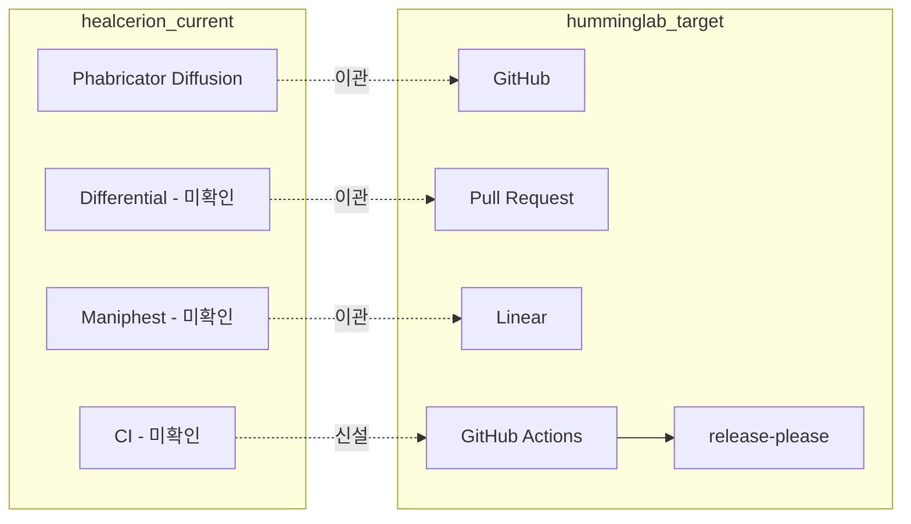

# 힐세리온 개발 환경 현황

> **근거**: Linear [HLAB-2487](https://linear.app/humminglab/issue/HLAB-2487) 원문 · Phabricator conduit `diffusion.repository.search` 31건 (2026-07-27 조회) · 미러 4건 클론
> **표기 규칙**: 직접 실행·조회로 확인한 것만 **검증됨**. 저장소 설명·PPT·이메일은 **주장**이며 그렇게 표기한다.

## 1. 검토 프레임 (Linear 원문)

HLAB-2487 의 목적 전문은 두 줄이다.

> - 기존의 전체 SW (FW, 앱 등등)를 기존 cctv-platform 과 유사한 형태의 리팩토링 검토
> - 기존 vs 리팩토링 장단점 검토

제보 경로는 힐세리온 이수열(Peter Lee) CTO / Advanced Medical R&D Center 의 이메일이며, 본문은 저장소 위치 안내(`git 위치.pptx` 첨부)가 전부다. **범위·기준·제약에 대한 언급은 없다.** 따라서 아래 "판단 대기" 항목들은 이슈에 적힌 것이 아니라 우리가 도출한 것이다.

이 문서가 답하는 부분: "cctv-platform 과 유사한 형태"를 릴리스·CI 규약 수준까지 평가하려면 **힐세리온의 현행 개발 환경을 먼저 확정**해야 한다. 코드 구조만으로는 이 축을 볼 수 없다.

메타: HummingLab 팀 / CCTV 프로젝트 / Backlog / 담당·작성 Beomsik Park / 생성 2026-07-27 / 우선순위 미지정 / 라벨·연관이슈 없음.

## 2. 현행 스택 — Phabricator 단일 (검증됨)

### 2.1 접근 경로

```bash
# 클론 — SSH user=git, port 2222(vcs/22 아님). /diffusion/<repo-id>/ 는 callsign 없는 repo 에도 동작
git clone ssh://git@phab.healcerion.com:2222/diffusion/<repo-id>/

# Conduit API — SSH 경유라 웹 토큰 불필요
echo '{"queryKey":"all","limit":100}' | ssh -p 2222 git@phab.healcerion.com conduit diffusion.repository.search
```

- 웹 UI(`https://phab.healcerion.com/`)는 로그인 필수 — 익명 접근 차단
- **`inactive` 저장소는 SSH 클론이 거부된다** (`This repository is not available over SSH`)

### 2.2 저장소 메타 현황 (conduit 31건 전수)

| 항목 | 값 | 함의 |
|---|---|---|
| 총계 | 31건 (`active` 24 / `inactive` 7) | |
| VCS | **git 31/31** | SVN·Mercurial 혼재 없음 — 마이그레이션 시 VCS 변환 불필요 |
| 기본 브랜치 | **`master` 31/31** | 브랜치 전략이 단일. `main` 전환·trunk 외 장기 브랜치 흔적 없음 |
| 열람 정책 | **31건 전부 동일** — `view: users` · `edit: admin` · `diffusion.push: users` | 로그인 사용자면 전부 열람·push 가능. 저장소별 권한 분리 없음 |
| Space | 31건 전부 `spacePHID: null` | §2.3 참조 — **Space 미사용의 증거가 아니다** |
| callsign | 22건 있음 / 9건 없음 | 혼재하므로 클론은 `/diffusion/<id>/` 형태로 통일 |

### 2.3 읽히지 않는 것 — 직접 시험으로 확정

추측을 남기지 않기 위해 **callsign 으로 직접 클론을 시도**했다. 결과가 두 종류로 갈린다.

```
$ git clone ssh://git@phab.healcerion.com:2222/diffusion/M/          # Moana
phabricator-ssh-exec: [You Shall Not Pass: Restricted Repository] (Can View)
You do not have permission to view this object.
// Members of a particular project can take this action.
(You can not see this object, so the name of this project is restricted.)

$ git clone ssh://git@phab.healcerion.com:2222/diffusion/ZZQXNOTAREPO/   # 대조군
phabricator-ssh-exec: No repository "ZZQXNOTAREPO" exists!
```

**대조군이 다른 메시지를 낸다** → 앞의 응답은 "존재 여부를 숨기는 일반 응답"이 아니라 **"존재하지만 제한됨"** 이다.

| callsign | 저장소 | 결과 |
|---|---|---|
| `M` | Moana | **존재 · 제한됨** |
| `CL` | sonon-cloud | **존재 · 제한됨** |
| `BF` | belle-fw | **존재 · 제한됨** |
| `HFW` | rHFW | **존재 · 제한됨** |
| `ZZQXNOTAREPO` | (대조군) | 존재하지 않음 |

**확정된 것 셋.**

1. **차단 원인은 프로젝트 멤버십 기반 view 정책이다.** Space 도 아니고 계정 배제도 아니다. 앞서 `spacePHID: null` 31/31 로 Space 를 의심했던 것은 빗나갔다
2. **`rHFW` 가 실재한다.** `cf-doppler-neon` 설명에만 등장하던 "존재 추정" 이 **존재 확정**으로 바뀐다
3. **`belle-fw` 는 두 개다.** 우리에게 보이는 `R66`(callsign 없음, `inactive`)과, CTO 화면의 `rBF`(callsign `BF`, active, 66 commits, 제한됨)는 **서로 다른 저장소**다. `R66` 은 껍데기이고 실물은 `rBF` 다 → "R66 을 활성화해 달라"는 요청은 과녁이 틀렸다

### 2.4 우리 계정

| 항목 | 값 |
|---|---|
| userName | `develop` |
| realName | `temporary` |
| email | `dev@healcerion.com` |
| roles | `verified` · `approved` · `activated` |

개인 계정이 아니라 **공용 임시 계정**이다. 어느 프로젝트에도 속하지 않은 것으로 보이며, 이것이 §2.3 제한의 직접 원인이다.

프로젝트 목록 자체는 전부 열람된다 — `[LAB] Moana`(236) · `[LAB] SONON Cloud`(408) · `[LAB] belle`(273) · `[LAB] members`(410) 등. 다만 **어느 프로젝트가 각 저장소를 잠그는지는 Phabricator 가 의도적으로 숨긴다**("the name of this project is restricted"). 이것만은 힐세리온 확인이 필요하다.

### 2.5 `[GMP]` 프로젝트 체계가 실재한다

`project.search` 결과에 제품 수명주기가 **GMP**(의료기기 제조품질관리기준) 체계로 조직돼 있다.

`[GMP] 1. 500 시리즈` → `1.1.1 500L 기획` · `1.1.2 500L 개발` · `1.1.3 500L 생산` · `1.1.4 500L 서비스` · `[GMP] 2. 300시리즈` · **`[GMP] 3. Sonon X`** → `3.1 기획` · `3.2 개발`

두 가지 함의가 있다.

- **판단 대기 3번(의료기기 규제)은 가정이 아니다.** 기획-개발-생산-서비스가 GMP 단계로 관리되고 있으며, Phriction 의 `소프트웨어_밸리데이션_작성/`·`ra/`·`qm/` 문서와 맞물린다. 리팩토링은 **설계이력·밸리데이션 재수행 비용**을 동반한다
- **`Sonon X` 가 제품 라인명으로 확인된다.** `sonex` 저장소와의 대응은 여전히 **추정**이지만(코드 대조 미완), 제품 쪽에 `[GMP] 3. Sonon X` 라는 독립 트랙이 존재한다는 사실은 확정이다

### 2.6 conduit over SSH 의 제약 — 파라미터가 무시된다

SSH 경유 conduit 은 **stdin 의 JSON 파라미터를 전혀 적용하지 않는다.** 검증:

| 시험 | 기대 | 실제 |
|---|---|---|
| `{"limit":1}` | 1건 | **100건** |
| `{"constraints":{"THIS_KEY_IS_BOGUS":[...]}}` | 오류 | **오류 없이 100건** |

존재하지 않는 constraint 키에도 오류가 없다 → 파라미터가 파싱되지 않고 버려진다.

**따라서 어떤 조회든 항상 "기본 정렬 첫 100건"만 얻는다.** 이 문서와 [repo-activity.md](repo-activity.md) 의 Maniphest·Phriction 수치는 전부 **첫 100건 표본**이다. 페이지 이동(`after` 커서)도 파라미터이므로 불가능하다.

- `diffusion.repository.search` 31건은 **영향 없음** — 100건 미만이라 한 페이지에 다 들어왔고 `after: null` 이다
- `harbormaster.build.search` 0건도 **영향 없음**
- Maniphest(다음 커서 8777)·Phriction(1284)은 **표본만 본 것**이다. 전수 조사하려면 웹 UI 로그인 또는 API 토큰 방식이 필요하다

### 2.4 `dateModified` 를 활동성 지표로 쓰지 말 것

conduit 의 `dateModified` 는 **Phabricator 저장소 설정의 수정 시각**이지 커밋 시각이 아니다. 실측으로 어긋남을 확인했다.

| 저장소 | conduit `dateModified` | 실제 HEAD 커밋 (클론 확인) |
|---|---|---|
| `sonex-framework` | 2026-06-06 | **2026-07-23** |
| `sonex-APP` | 2026-06-06 | 2026-06-18 |

활동성 판단은 반드시 클론 후 `git log` 로 한다.

생성일은 별개로 의미가 있다 — `sonex-framework` 2023-05-22, `sonex-APP` 2024-04-11 로 **SDK 가 앱보다 약 1년 앞선다**(주장이 아니라 conduit 메타 값).

## 3. HummingLab 기준(Linear + GitHub) 대비

리팩토링이 "cctv-platform 과 유사한 형태"를 목표로 하면 코드 구조뿐 아니라 아래 축도 함께 이동한다. 오른쪽 열이 이 검토의 기준선이다.

| 축 | 힐세리온 현행 | HummingLab (cctv-platform) |
|---|---|---|
| VCS 호스팅 | Phabricator Diffusion (**검증됨**) | GitHub |
| 코드 리뷰 | Differential — **우리 계정 접근 차단**(§3.1) | GitHub PR |
| 이슈 추적 | Maniphest — **활발히 사용 중**(§3.1) | **Linear** (본 이슈 HLAB-2487) |
| 문서 | Phriction — **활발히 사용 중**(§3.1) | repo 내 `docs/` (SSOT 규약) |
| CI | Harbormaster — **빌드 기록 0건**(§3.1) | GitHub Actions (`ci.yml`, 7개 repo 의무) |
| 릴리스 | **미확인** | release-please + conventional commits |
| 빌드 인터페이스 | **미확인** | 표준 `Makefile` (Tier 1/2/3) |
| 브랜치 | `master` 단일 (**검증됨**) | trunk + PR 브랜치 |

### 3.1 conduit 실측 (2026-07-27)

| API | 결과 | 판정 |
|---|---|---|
| `differential.revision.search` | `ERROR: You do not have access to the application which provides this API method` | **우리가 못 본다.** 앱 비활성인지 권한 문제인지는 구분 불가 — 사용 여부 자체는 여전히 미확인 |
| `maniphest.search` | 100건 반환, 다음 커서 `8777`. 최신 **T9224 (2026-07-20)** | **활발히 사용 중.** 태스크 ID 가 9천대이고 조회 시점 일주일 전까지 신규 등록 |
| `phriction.document.search` | 100건 반환, 다음 커서 `1284` | **활발히 사용 중.** 기술·규제·경영 문서가 섞여 있다 |
| `harbormaster.build.search` | **0건** (에러 없음) | 접근은 되는데 데이터가 없다 → **CI 빌드 기록이 없다** |

> 커서 값(`8777`·`1284`)은 다음 페이지 시작점이지 총계가 아니다. 규모의 하한으로만 읽는다.

**Phriction 상위 경로 (100건 표본)** — 코드로 못 보는 것을 문서로 볼 수 있는 경로다.

| 경로 | 건수 | 의미 |
|---|---:|---|
| `charm/` | 13 | 500C CHARM |
| `moana/` | **6** | **저장소는 B1 으로 막혀 있으나 문서는 접근된다** |
| `소프트웨어_밸리데이션_작성/` | **6** | **의료기기 SW 밸리데이션** — 판단 대기 3번의 직접 증거 |
| `fjus_odm/` | 5 | FUJI OEM |
| `mechanical_release_note/`·`개발일반/`·`pl/` | 각 4 | 릴리스 노트·개발 일반·기획 |
| `elsa/`·`meetings/` | 각 3 | |
| `ra/`·`qm/`·`sonex/`·`3rd_ra`·`4st_ra` 등 | 각 1 | RA(인허가)·QM(품질) 체계 존재 |
| `ge_v-scan_air/`·`vscan_air_app/`·`lumify-phillips/` | 각 1 | 경쟁 제품(GE Vscan Air·Philips Lumify) 분석 |

**함의 두 가지.**

1. **CI 가 없다**(Harbormaster 0건). cctv 는 7개 repo 에 GitHub Actions 가 의무다. 리팩토링이 "cctv 유사 형태"를 목표로 하면 **CI 는 이관이 아니라 신설**이며, 이는 비용 항목이 아니라 **이득 항목**이다.
2. **규제 문서 체계가 실재한다**(`소프트웨어_밸리데이션_작성`·`ra`·`qm`). 판단 대기 3번(IEC 62304 / ISO 14971)은 가정이 아니라 확인된 제약일 가능성이 높다 — 다만 아직 문서를 열지 않았으므로 **문서의 존재**만 확인된 상태다.



**미확인이 4칸이다.** 이 상태로는 "기존 vs 리팩토링 장단점"의 절반(개발 프로세스 측 비용·이득)을 산정할 수 없다. 해소 방법은 §5.

> 외부 지식(코드 근거 아님): Phabricator 는 upstream(Phacility)이 2021년 활발한 개발을 종료했고 커뮤니티 포크 Phorge 로 이어졌다. 사실이라면 도구 자체가 장기 유지보수 리스크이며, 이는 리팩토링과 무관하게 별도 판단 사안이다.

## 4. 사내 인프라 저장소 3건 — 범위 밖

| id | 저장소 | 설명(**주장**) | 상태 |
|---|---|---|---|
| 63 | DevOps | network·system 운영 관리 script | active |
| 64 | phabricator | phab.healcerion.com | active |
| 32 | phabricator-to-slack | Slack 알림 | **inactive** |

셋 다 제품 SW 가 아니라 힐세리온 사내 개발 인프라이며, **HLAB-2487 의 "전체 SW (FW, 앱 등등)" 에 해당하지 않는다** → 미러 컨테이너로 클론하지 않는다.

다만 `phabricator`(R64)는 §3 의 미확인 4칸을 메울 수 있는 자료다. 클론 여부는 미결 — 저장소 크기가 upstream 포크(수 GB)인지 배포 설정(수 MB)인지 확인되지 않았다.

## 5. 미확인 항목과 확인 방법

| # | 항목 | 상태 |
|---|---|---|
| 1 | Maniphest·Phriction 실사용 | **해소** — §3.1 (둘 다 활발) |
| 2 | CI 존재 여부 | **해소** — §3.1 (Harbormaster 0건 → 없음) |
| 3 | Differential(코드리뷰) 사용 여부 | **미해소** — 우리 계정이 앱 접근 차단. 힐세리온 측 확인 필요 |
| 4 | 릴리스·태그 규약 | 미조사 — 클론된 미러에서 `git tag` 목록·명명 규칙으로 확인 가능 |
| 5 | `Moana`·`sonon-cloud` 미가시 원인 | 미해소 — §2.3. 힐세리온 측 확인 필요 |
| 6 | 규제 체계의 실제 내용 | 미조사 — Phriction `소프트웨어_밸리데이션_작성/`·`ra/`·`qm/` 열람으로 확인 가능 |
| 7 | R64 `phabricator` 저장소 규모·성격 | 미해소 — 클론 전 conduit 로는 확인 불가 |

4·6 은 **우리 쪽 조회만으로 해소 가능**하다. 3·5·7 은 힐세리온 협조가 필요하다.

저장소별 활동성 실측과 그 함의는 [repo-activity.md](repo-activity.md) 를 참조한다.
