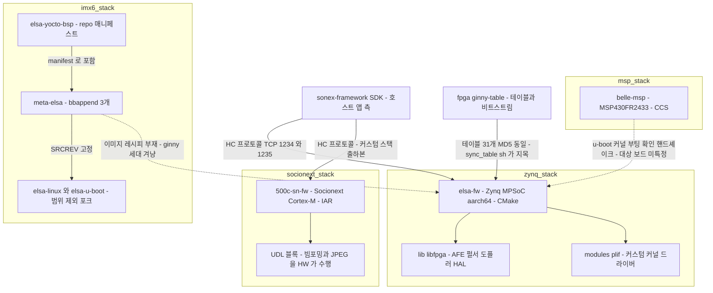

# device 그룹 — 장비 펌웨어 코드 구조

> **근거**: 미러 5건의 **코드 직접 읽기**(2026-07-27). 저장소 설명·PPT 는 근거로 쓰지 않았다.
> **표기**: 인용한 파일·심볼·수치는 전부 코드에서 확인한 것이다. 코드로 확인되지 않는 것은 "추정" 으로 표시하고, 확인 실패는 "증거 없음" 으로 남긴다.
> **범위**: 활동성·커밋 이력 해석은 [repo-activity.md](repo-activity.md) 가 SOT 다. 여기서는 **코드 구조**만 다룬다.

## 1. 한눈에

| 저장소 | 실체 | 타깃 | 빌드 | 자체 코드 LOC | HAL | 테스트/CI/문서 |
|---|---|---|---|---:|---|---|
| `elsa-fw` | Linux 멀티프로세스 스캔 엔진 (**ginny·belle 2세대 혼재**) | **Xilinx Zynq UltraScale+ MPSoC** (Cortex-A53, aarch64, 커널 4.14) | CMake + kbuild (**rootfs 는 만들지 않음** §7) | ~77k (C/C++) | 부분 — `lib/`(libfpga) 있으나 우회 다수 | 전부 없음 |
| `500c-sn-fw` | 베어메탈 단일 루프 펌웨어 | **Socionext ARM SoC** (Cortex-M) | **IAR EWARM** (7개 프로젝트) | ~73k (C) | **3층 분리, 일관됨** | 전부 없음 |
| `belle-msp` | 전원·배터리 감시 MCU | **TI MSP430FR2433** | **TI CCS 10.0.0** | 3.8k (C) | 없음(단일 프로젝트) | 전부 없음 |
| `elsa-yocto-bsp` | **BSP 아님** — `repo` 매니페스트 | (i.MX6) | — | ~90 lines | — | README·ChangeLog |
| `meta-elsa` | Yocto 오버레이 레이어 | **NXP i.MX6Q** (Cortex-A9) | bitbake | 273 lines | — | README 1줄 |

**세 개의 완전히 다른 스택이며 코드를 공유하지 않는다.** 파일명 교집합은 `.gitignore` 하나뿐이다(대소문자 무시 basename 대조).

## 2. 스택 관계



실선만 코드로 확인한 것이다. **`elsa-fw` 와 `500c-sn-fw` 는 서로 코드를 공유하지 않지만 호스트와는 같은 프로토콜로 만난다**(§8) — 이 그룹의 유일한 실질 통합 지점이다.

## 3. `elsa-fw` — Zynq MPSoC Linux 스캔 엔진

**타깃 확정 근거**: `modules/zynqdma/zynqmp_dma.c`(Xilinx ZynqMP DMA), `tools/fpgautil.c`("using Xilinx zynqMP fpga manager"), `tools/psu_init.h`(Xilinx PS/PSU init 테이블 32,749줄), `lib/hw/pl_ctrl.cpp:25` 의 `#define PL_CTRL_REG_BASE_ADDR 0xb0000000`("PL" = Programmable Logic), `scripts/btn_chk.sh` 의 `devmem 0xff5e00c0`(ZynqMP CRL_APB 영역), `scripts/belle-post.sh` 의 `insmod /lib/modules/4.14.0/...`(**타깃 커널 4.14.0**).

### 3.1 한 저장소에 두 세대가 들어 있다 — `ginny`(300) 와 `belle`(500)

저장소 이름은 `elsa-fw` 지만 코드 안의 코드네임은 둘이다. **빌드 플래그로 세대를 고른다.**

| 코드네임 | 제품 | 설치 경로 | 근거 |
|---|---|---|---|
| **ginny** | 300 시리즈 | `/usr/share/ginny/300l/` | `scripts/onda.sh` 의 `BASE="/usr/share/ginny/300l/"`, `run.sh.org` 의 `/etc/ginny_version`·`ginny-post.sh` |
| **belle** | 500 시리즈 | `/usr/share/belle/500l/` | `scripts/belle-post.sh`, `bcd/const.h:39` 의 `#define CONFIG_PATH "/usr/share/belle"` |

`lib/fpga_define.h:44-48` 이 `_USING_500L_DEV_` 매크로로 두 경로를 가른다. 루트 `CMakeLists.txt` 는 `-D_USING_500L_DEV_` 를 정의하므로 **현행 빌드 타깃은 belle(500 시리즈)** 다.

세대별로 아키텍처가 다르다는 증거가 소스 주석에 남아 있다 — `lib/cf-doppler.c:9` 의 빌드 명령이 **32비트** `arm-poky-linux-gnueabi-gcc --sysroot=/home/yslee/project/poky/build/tmp/sysroots/ginny` 이고, 이 `yslee` 는 `meta-elsa` 의 유일 저자와 동일인이다.

> **§6.3 의 "SoC 불일치" 가 이것으로 풀린다** — `meta-elsa`(i.MX6Q, 32비트)는 **ginny 세대**를 겨냥한 것이고, `elsa-fw` 의 현행 빌드(ZynqMP, aarch64)는 **belle 세대**다. 서로 다른 제품이 아니라 **같은 저장소 안의 다른 세대**다.

또한 `scripts/sync_table.sh` 는 `fpga/legacy/ginny-table` 을 **이름으로 지목한다**(§9.2).

### 3.2 프로세스 구성 — 단일 앱이 아니라 데몬 4종

| 실행물 | 역할 | IPC |
|---|---|---|
| `sonon` | 실시간 스캔 엔진. `sonon/sonon.cpp:2552 main()` 에서 pthread 5개(`ctrl/data/mgmt/btn/pipe`) 기동 | **TCP 소켓 2개**(control·data), 커스텀 바이너리 패킷 `PACKET_HEADER_S` |
| `bcd` | Board Config Daemon — 설정 get/set/commit | **SysV 메시지 큐** |
| `deviced` | I2C 온도·배터리 폴링 | SysV 메시지 큐 |
| `watchdogd` | `E_SONON`·`E_DEVICED`·`E_MONITORD` 생존 감시 + HW 워치독 kick | **Unix 도메인 소켓** |

IPC 방식이 **셋 다 다르다**(메시지 큐·TCP·Unix 소켓). 호스트 앱과의 인터페이스는 TCP 커스텀 바이너리 프로토콜이다.

### 3.3 신호 처리는 소프트웨어에 있다

`lib/`(정적 라이브러리 `fpga`) 와 `sonon/`·`image_proc/` 에 초음파 체인이 그대로 들어 있다.

- `lib/afe.cpp`(아날로그 프론트엔드) · `lib/pulser.cpp`(TX 펄서) · `lib/fpga_ebi_max2082.cpp`(MAX2082 아날로그 빔포머 mux)
- `lib/cf-doppler.c` · `lib/fpga_doppler.cpp`(컬러 도플러) · `lib/fpga_pw.cpp`(PW) · `lib/fpga_m.cpp`(M-mode)
- `sonon/sonon_transmit.cpp` · `sonon_receive*.cpp` · `sonon_b_sa.cpp` · `sonon_pw_filter.cpp`
- `image_proc/lut_header/` — `Rx_apo_LUT.h`(수신 apodization) · `Tx_dly_LUT_delta.h`(송신 지연) · `Rx_delay_init.h`

빌드 플래그도 이에 맞춰져 있다 — `add_definitions(-D__NEON_ASSEM__)`, `lib/CMakeLists.txt` 의 `-ffast-math -ftree-vectorize`, 그리고 벤더링된 `ne10_lib/`(ARM NE10 SIMD 헤더).

> **이 지점이 `500c-sn-fw` 와 정반대다** — 500C 는 같은 일을 UDL 하드웨어 블록이 한다(§4.2).

### 3.4 HAL 은 있지만 우회가 많다

`lib/` 가 중앙 HAL 로 존재하고 `tools/` 의 일부가 `target_link_libraries(... fpga)` 로 링크한다. 그러나:

| 우회 사례 | 위치 |
|---|---|
| `/dev/i2c-*` 직접 open + `ioctl(fd, I2C_SLAVE_FORCE, ...)` | `deviced/deviced.cpp:195,242` |
| `open("/dev/mem")` 독자 mmap (`lib/hw/spi_dev.cpp` 와 별개) | `tools/spidev.cpp:134` |
| MAX1720x 퓨얼게이지 I2C 접근 전면 재구현 | `tools/max17205.cpp` |

`tools/` 아래 **23개 파일이 독자적으로 `ioctl()`/`open("/dev...")` 를 호출**한다. 즉 HAL 은 규약이 아니라 선택지다.

### 3.5 저장소 안에 섞여 있는 것들

- `modules/wifi/mrvl/` — Marvell WiFi **커널 모듈 `.ko` 바이너리** + `uaputl`·`mlanutl` 벤더 바이너리
- `modules/plif/` — 자체 작성 커널 드라이버. kbuild Makefile 이 개발자 로컬 경로를 그대로 담고 있다: `XILINX_KERNEL_DIR ?= /home/jacob/BELLE_WORK/belle-kernel/linux-xlnx/`
- `modules/python/belle_flask/` — **Flask 웹 진단 UI** (Bootstrap·jQuery·Chart.js 벤더링). 저장소 이름은 elsa 인데 디렉토리 이름은 **belle** 이다
- `configs/300l`·`configs/500l` — 프로브 모델별 캘리브레이션 `.dat` + FPGA 비트스트림 심볼릭 링크
- `system_header/strtk.hpp` 와 `tools/strtk.hpp` — **동일 파일 24,293줄 중복 벤더링**

**DICOM 없음** — 저장소 전체 `grep -i dicom` 결과 0건.

## 4. `500c-sn-fw` — Socionext 베어메탈

### 4.1 하나의 저장소, 7개 펌웨어 이미지

IAR 워크스페이스 `US3_ARM.eww` 가 **독립 링크되는 7개 프로젝트**를 묶는다 — `FlashBoot`(본체) · `BootLoader` · `FlashLoader` · `RamBoot` · `PrmBin` · `RawBin` · `Updater`. 각각 자체 `main.c`(`src_BootLoader/`, `src_Updater/` …)를 갖고 `src/Driver`·`src/Wrapper` 를 공유한다.

메모리 배치(`Linker/US3_ARM_FlashBoot.icf`): ROM `0x60080000`–`0x600FFFFF`(512KB), I-code SRAM `0x01000000`(512KB), D-code SRAM `0x01100000`(1MB), work SRAM `0x20000000`(64KB).

**OS 없음이 코드로 확정된다** — `src/Wrapper/SRC/MCU_OS.c` 의 mutex 는 스핀 대기이고 주석이 `/* Create dummy mutxe pointer because OS not present */` 다. 런타임은 `src/App/statemachine/StateMachine.c:85-105` 의 단일 슈퍼루프 + 이벤트 테이블 디스패치다.

### 4.2 신호 처리는 하드웨어(UDL)에 있다

`src/App/US_Control/USC_Scan.c` 는 `USCg_SNR_RegisterWrite` → `MCUg_Udl_RegWrite/RegRead` 로 **UDL 블록에 레지스터 테이블을 밀어 넣는 시퀀서**다. MCU 는 `IRQ_JPEG_READY`·`IRQ_AUDIO_READY` 인터럽트로 버퍼를 회수할 뿐이고, **빔포밍·스캔 변환·JPEG 압축은 UDL 하드웨어가 수행**한다.

→ 같은 SONON 제품군인데 **`elsa-fw` 와 신호처리의 물리적 위치가 정반대**다. 리팩토링 시 두 라인을 하나의 소프트웨어 아키텍처로 묶으려면 이 경계부터 결정해야 한다.

### 4.3 HAL — 이 그룹에서 유일하게 일관된 계층 분리

3층이 규약으로 지켜진다: `src/App` → `src/Wrapper/API_include/MCU_*_api.h` → `src/Driver/*/*_lld.c`(레지스터 직접 접근).

검증: **`src/App` 전체에서 `reg_*.h` include 가 0건**이다. 레지스터 포인터 접근은 `src/Driver/*/*_lld.c` 안에만 있다(예: `src/Driver/exgpio/exiu_lld.c:33-40`).

### 4.4 벤더링

`src/Middleware/WiFiHost/` = Silicon Labs/Redpine **RSI WiFi 호스트 SDK 89파일 52,847 LOC** — 저장소 C 코드의 **42%**가 벤더 SDK다. 미사용 `platforms/stm32` 레퍼런스 트리까지 통째로 들어 있다. 그 외 `lib/libUSSWiFi.a`·`lib/libudl.a` 는 **소스 없는 프리빌트 정적 아카이브**다.

프로브 형상별 파라미터는 `PrmBin/`(Linear·HFlinear·Convex·Sector) 바이너리이고, **생성 도구가 Excel(`.xls`)** 이다.

## 5. `belle-msp` — 감시 MCU

MSP430FR2433(확정: `.ccsproject` `deviceVariant`, `targetConfigs/MSP430FR2433.ccxml`, `lnk_msp430fr2433.cmd`). 툴체인 TI CCS 10.0.0 / codegen 20.2.0.LTS.

**역할은 초음파가 아니라 전원·부팅 감독이다.**

1. 전원 버튼 디바운스(짧게=on/off, 길게≈5초=팩토리 리셋)
2. 레일·리셋 시퀀싱 — `IO_ENABLE`·`FPD_ENABLE`·`LPD_ENABLE`·`PS_POR_B`
3. **호스트 SoC 부팅 감독** — `common.h` 의 상태 enum 이 `CUR_BRINGUP_1_OK = u-boot boot ok`, `CUR_BRINGUP_2_OK = kernel boot ok` 로 문서화돼 있고, 타임아웃 시 `power_reset()` 로 강제 전원 재투입
4. 소프트웨어 워치독 — HW WDT 는 `WDTCTL = WDTPW | WDTHOLD` 로 **끄고**, I2C 레지스터 `DEVICE_WATCHDOG_REG` 를 호스트가 4ms 주기로 갱신하는지 감시
5. MAX1720x 퓨얼게이지 판독 → I2C 레지스터로 호스트에 보고 + RGB LED 표시
6. 딥슬립 타임아웃 자동 종료

인터페이스는 **I2C 이중 역할**이다 — USCI_B0 하드웨어 I2C **슬레이브**(주소 `0x48`)로 호스트에 레지스터 파일을 노출하고, 별도로 **비트뱅잉 I2C 마스터**(`swi2c_master.c`)로 퓨얼게이지(`0x36`)·LED 드라이버(`0x14`)를 제어한다.

> **저장소 위생 문제**: 추적 파일 294개 중 실제 소스는 **10개(3,820 LOC)** 뿐이다. 나머지는 CCS Eclipse 워크스페이스 메타(`.metadata/`), **CCS 내장 브라우저 캐시(`.jxbrowser-data/` — dev.ti.com 쿠키·LocalStorage 포함)**, 그리고 커밋된 빌드 산출물(`Debug/`·`Release/` 의 `.obj`·`.map`·`.out`·`.hex`)이다. 12MB 중 소스 비중은 무시할 수준이다.

## 6. BSP 2건 — 이름이 내용과 다르다

### 6.1 `elsa-yocto-bsp` 는 BSP 가 아니다

파일 3개(`default.xml`·`README`·`ChangeLog`)뿐이고, `default.xml` 은 Google `repo` 도구 매니페스트다. bitbake 레시피·machine conf·이미지 레시피가 **하나도 없다**.

커밋 60개 중 **58개가 Freescale/NXP 엔지니어의 upstream 이력**(2013–2016, `fsl-arm-yocto-bsp` 포크)이고, 힐세리온 기여는 **마지막 2개**뿐이다(`meta-elsa` 추가, setup 스크립트 수정).

핵심 라인:
```
revision="jethro_4.1.15-1.0.0_ga"   → NXP i.MX BSP 4.1.15-1.0.0 GA (커널 4.1.15, Yocto Jethro)
name="ME/meta-elsa" revision="master"
```

### 6.2 `meta-elsa` 는 3개 bbappend 오버레이

파일 8개 273줄. 이미지 레시피 없음. 애플리케이션 레시피 없음.

| bbappend | 하는 일 |
|---|---|
| `linux-imx_4.1.15.bbappend` | 커널 소스를 사내 `elsa-linux.git` 으로 교체, `SRCREV = 306947a...` 고정, `imx_v7_elsa_defconfig` 설치 |
| `u-boot-imx_2015.04.bbappend` | u-boot 을 사내 `elsa-u-boot.git` 으로 교체, `SRCREV = dc64e8c...` |
| `u-boot-imx-mfgtool_2015.04.bbappend` | mfgtool(공장 플래시)용, 별도 `SRCREV = 0fa2a52...` |

머신 정의(`conf/machine/imx6elsa.conf`): `SOC_FAMILY = "mx6:mx6q"`, `KERNEL_DEVICETREE = "imx6q-elsa.dtb"`, Cortex-A9, `MACHINE_FEATURES += " pci wifi bluetooth"`.

> **범위 제외 판단이 코드로 뒷받침된다** — `elsa-linux`·`elsa-u-boot` 는 CLAUDE.md 에서 upstream 포크로 제외했는데, `meta-elsa` 가 정확히 그 두 저장소를 SRCREV 고정으로 참조한다. 즉 커널·부트로더 버전은 **이 bbappend 3개만 읽으면 확정**되고 수 GB 클론이 불필요하다는 판단이 맞았다.

### 6.3 BSP 가 `elsa-fw` 를 빌드한다는 증거는 없다

두 BSP 저장소 전체에서 `elsa-fw`·`elsafw`·`ELSA_FW` 문자열 검색 결과 **0건**. 애플리케이션 레시피가 존재하지 않는다.

**타깃 SoC 도 다르다** — `meta-elsa` 는 **i.MX6Q(Cortex-A9, 32비트)**, `elsa-fw` 현행 빌드는 **Zynq UltraScale+(Cortex-A53, aarch64)** 다.

→ 그러나 이것은 "무관한 두 프로젝트"라는 뜻이 아니다. §3.1 이 밝힌 대로 **`meta-elsa` 는 ginny(300 시리즈) 세대**를 겨냥한 것이고, `elsa-fw` 안에 그 세대 코드가 아직 남아 있다(`/usr/share/ginny`, 32비트 poky sysroot `ginny`, 동일 저자 `yslee`). 즉 **BSP 는 맞는 세대를 겨냥하되 그 세대의 이미지 레시피 자체가 없다.**

→ CLAUDE.md 제품 라인도의 `yocto -.->|빌드 제공 주장| efw` 점선은 **세대를 특정하지 않으면 참도 거짓도 아니다**. ginny 세대에 한해 "겨냥은 맞으나 레시피 부재", belle 세대에 대해서는 "무관"이 정확한 서술이다.

## 7. rootfs 는 무엇이 빌드하는가 — **미러 어디에도 없다**

### 7.1 결론

`elsa-fw` 는 **rootfs 를 만들지 않는다.** 이미 존재하는 rootfs 트리 위에 파일을 얹는 **오버레이 페이로드 + 설치 매니페스트**일 뿐이다.

전수 검색 결과 `elsa-fw` 에 PetaLinux 프로젝트(`project-spec/`·`petalinux-config`) · Buildroot · bitbake 레시피 · debootstrap · Docker · `.wic` 이 **하나도 없다**. 유일한 관련 흔적은 소비 측이다 — `scripts/upgrade.sh` 가 `BOOT='BOOT.BIN'`·`IMAGE='image.ub'` 를 **받아서 쓰기만** 한다. `modules/plif/plif.c:19` 의 "generated by petalinux-create -t modules" 는 스켈레톤 생성 흔적이지 프로젝트가 아니다.

### 7.2 실제 배포 방식 — CMake `install()` 이 절대경로로 스테이징한다

루트 `CMakeLists.txt` 가 사실상의 패키징이다. `DESTDIR`·`CMAKE_INSTALL_PREFIX` 설정이 트리 전체에 **없고**, 타깃 절대경로에 직접 설치한다.

```cmake
install(FILES     configs/network.conf   DESTINATION /usr/share/belle RENAME network.conf)
install(DIRECTORY configs/500l           DESTINATION /usr/share/belle)
install(DIRECTORY modules/wifi/mrvl      DESTINATION /lib/firmware)
install(DIRECTORY modules/wifi/config    DESTINATION /opt/emmy-w1/sd8887-sdiosdio)
install(DIRECTORY modules/python/belle_flask DESTINATION /root)
install(FILES     modules/python/zipfile.py  DESTINATION /usr/lib/python2.7)
install(FILES     scripts/upgrade.sh     DESTINATION /sbin RENAME upgrade.sh)
```

여기서 드러나는 타깃 rootfs 의 성격:

| 사실 | 근거 |
|---|---|
| **SysVinit + BusyBox** (systemd 아님) | `scripts/init-config.sh` 의 `rm /etc/rc${rc}.d/*dropbear` 루프. `.service` 파일 0건 |
| **Python 2.7** | `install(... DESTINATION /usr/lib/python2.7)` |
| **Yocto/Poky 관례** | `/home/root` 사용(`tools/adc_dump.cpp:206`) |
| 서비스 기동 | `scripts/init-run.sh` 의 `start-stop-daemon -S -n bcd -a /usr/bin/bcd -- -d`, `... -a /usr/bin/sonon`, `tcpsvd ... ftpd -w /tmp/upload`, `python /root/belle_flask/belle_flask.py &` |

**`/etc/inittab`·`/etc/init.d/rcS`·`/etc/init.d/wlan` 은 저장소가 제공하지 않는다.** 베이스 rootfs 쪽에서 와야 한다.

### 7.3 플래시·파티션 구조 (스크립트에서 역산)

| 파티션 | 용도 | 근거 |
|---|---|---|
| `/dev/mtd0` | `BOOT.BIN` (부트로더) | `upgrade.sh`: `flashcp_rev -v $BASE/BOOT.BIN /dev/mtd0` |
| `/dev/mtd1` | U-Boot 환경변수 | `scripts/fw_env.config`: `/dev/mtd1 0x0000 0x40000 0x10000` |
| `/dev/mtd2` | `image.ub` (커널 FIT, 상한 80MB) | `upgrade.sh`: `flashcp_rev ... /dev/mtd2`, `83886080` |
| `/dev/mtd3` | 팩토리 리셋 대상 | `upgrade.sh`: `flash_eraseall /dev/mtd3` |
| `mtd5` → `ubi0:userdata` | **쓰기 가능 영구 파티션** | `scripts/userdata.sh`: `ubiattach ... -m 5 && mount -t ubifs ubi0:userdata /userdata` |

> mtd3(리셋)과 mtd5(userdata)가 어긋난다 — 스크립트 간 불일치이거나 하드웨어 리비전 차이다(미확정).
> `userdata.sh` 는 `/proc/cmdline` 에 `nfsroot` 가 있으면 건너뛴다 — **NFS 루트 개발 부팅을 지원**한다.

### 7.4 설정 파일의 2단 배치 — 공장본 → 쓰기본

1. 빌드 시 `configs/500l/` 이 `/usr/share/belle/500l/` 로 설치된다.
2. 첫 부팅에서 쓰기 가능 파티션으로 복사된다 — `scripts/btn_chk.sh`: `ls /userdata/config/500l || (mkdir -p /userdata/config/; cp -rf /usr/share/belle/500l/ /userdata/config/; sync)`
3. 런타임 코드는 **쓰기본**을 읽는다 — `lib/pulser.h:28`·`lib/afe.h:49`·`tools/sa_table_load.h:28` 이 `#define CONFIG_PATH "/userdata/config/500l/"`
4. `bcd` 는 공장본을 읽는다 — `bcd/bcd.c:575` 가 `CONFIG_PATH "/usr/share/belle"` + U-Boot 환경변수 `device` 로 `/usr/share/belle/<model>/system.conf` 를 조립

**`configs/300l` 은 현재 설치되지 않는다** — 루트 `CMakeLists.txt` 가 `configs/500l` 만 install 한다. 300L 패키징은 현행 빌드에 배선돼 있지 않다.

### 7.5 없는 것의 목록 (belle / ZynqMP 현행 타깃)

코드가 **이름으로 지목하는데 미러에 없는** 것들이다.

| 없는 것 | 코드가 지목하는 위치 |
|---|---|
| **`belle-kernel`** (linux-xlnx 포크) | `modules/plif/readme.makefile`: `XILINX_KERNEL_DIR ?= /home/jacob/BELLE_WORK/belle-kernel/linux-xlnx/` |
| ZynqMP 머신용 Yocto/PetaLinux BSP | 같은 파일의 주석 처리된 경로가 `.../bsp_zcu104/xilinx-zcu104-2018.1/build/tmp/work/zcu104_zynqmp-xilinx-linux/linux-xlnx/4.14-xilinx-v2018.1.../` — **MACHINE=`zcu104_zynqmp`** |
| `aarch64-xilinx-linux` SDK / sysroot | `modules/python/module/CMakeLists.txt:5`: `SET(COMPILER_INDEX aarch64-xilinx-linux-)`. `environment-setup-*` 파일 없음 |
| 이미지 레시피 | 어디에도 없음 |
| U-Boot 소스 | 환경변수 *도구*(`fw_env.config`)만 있음 |
| 프리빌트 OpenCV | `CMakeLists.txt:24-25`(주석): `/home/jacob/work/belle/utils/opencv_lib/opencv/` |

ginny / i.MX6 세대 쪽에서 없는 것은 §6.2 의 `elsa-linux`·`elsa-u-boot` 와, `default.xml` 이 `repo sync` 로 가져오는 upstream 레이어 전부(`poky`·`meta-fsl-*`·`meta-qt5` 등), 그리고 이미지 레시피(`fsl-image-gui`·`fsl-image-qt5` — `meta-fsl-demos`/`meta-fsl-bsp-release` 소재)다.

### 7.6 `500c-sn-fw` 는 rootfs 가 없다

베어메탈이다(§4.1). OS 자체가 없으므로 해당 없음.

## 8. 외부 통신 프로토콜 — 하나의 "HC" 프로토콜로 수렴한다

### 8.1 프레임 포맷 — 그리고 **정본 정의가 어디에도 없다**

> **주의**: 이 절의 초판에는 `sonon/sonon_receive.h:1882` 출처로 구조체 선언을 인용했으나 **그 선언은 실재하지 않는다.** 직접 확인 결과를 아래에 다시 적는다.

확정된 것:

| 사실 | 근거 |
|---|---|
| 헤더 크기 **14바이트** | `cuattro-sdk/SononClient/SononPacket.h:18` `#define COMMON_PACKET_HEADER_SIZE 14` · `sonex-framework/.../HCPacketData.h:10` `constexpr size_t HC_PACKET_HEADER_SIZE = 14;` |
| 선두 2바이트가 `'H'`·`'C'` | `elsa-fw/sonon/sonon_receive.cpp:75` `header->identifier[0]='H'` · 같은 파일 `:743` 수신 검증 `if (header->identifier[0] != 'H' \|\| header->identifier[1] != 'C')` · `SononPacket.h:4-5` `HC_HEADER_PREFIX0 'H'` |
| 필드 6개 | `elsa-fw/sonon/*.cpp` 에서 이름으로 접근되는 것 전수 — `packet_body_size`(104회) · `version`(20) · `identifier`(12) · `session_id`(7) · `recv_id`(7) · `packet_type`(7) |
| 포트 1234·1235 | `cuattro-sdk/SononClientCSharpDemo/NativeMethods.cs:167` `SCAN_CTRL_PORT = 1234` |

**확정되지 않은 것 — 그리고 이것이 핵심이다**: `PACKET_HEADER_S` 타입은 `elsa-fw` 에서 **212회 사용되지만 선언이 그 저장소에 없다.** 워크스페이스 전 저장소의 `.h` 파일에서 `session_id` 선언은 **0건**이다. 즉 **필드 순서·타입·바이트 오프셋을 코드로 확인할 수 없다.**

→ 4개 코드베이스가 같은 프로토콜을 말하는데(§8.5) **정본 정의 파일이 어느 저장소에도 없다.** 각 구현이 각자의 사본을 갖고 있고, 그 사본들의 조상이 되는 헤더는 미러 밖에 있다. 이것은 §8.5 의 "정의가 복제돼 있다" 보다 한 단계 나쁜 상태다.

**CRC 는 구현돼 있지 않다** — 검증 함수 이름이 `verify_packet_header_and_crc` 이지만 `//check CRC` 주석만 있고 실제 검사가 없다.

전송은 **TCP 2채널**이다 — `CTRL_PORT 1234` · `DATA_PORT 1235`, `TCP_NODELAY`. **장비가 서버**이고 호스트 앱이 접속한다. 장비는 자체 AP 로 뜬다(`192.168.10.1`).

### 8.2 커맨드 공간

`packet_type` 으로 계열을 가르고(`DEVICE_COMM 0x0001`·`DEVICE_RESP 0x0002`·`FPGA_COMM 0x0003`·`FPGA_RESP 0x0004`·`B 0x0100`·`B_C 0x0102`·`PW 0x0104`·`M 0x0106`), 그 안에서 16비트 opcode 를 쓴다.

| opcode | 값 |
|---|---|
| `DEVICE_SCAN_READY` / `DEVICE_SCAN` / `DEVICE_KEEP_ALIVE` | 0x0001 / 0x0002 / 0x0003 |
| `DEVICE_POWER_OFF` / `DEVICE_FW_UPGRADE` | 0x0004 / 0x0006 |
| `DEVICE_SPEC_INFO` / `DEVICE_TIME_SYNC` | 0x2001 / 0x2002 |
| `FPGA_RESET` / `FPGA_READ_DEPTH` / `FPGA_WRITE_DEPTH` | 0x0001 / 0x0100 / 0x0101 |
| `FPGA_PW_*_PARAM` / `FPGA_M_*_PARAM` | 0x4000·0x4001 / 0x5000·0x5001 |

### 8.3 버전 필드가 모델 선택자다

`verify_packet_header_and_crc` 가 `version[2]` 로 모델을 가른다(`lib/common.h:65-68`).

| `version[0].version[1]` | 모델 |
|---|---|
| `0x00 0x01` | `MODEL_S300C` |
| `0x00 0x02` | `MODEL_S300L` |
| `0x00 0x03` | `MODEL_S300MC` |
| `0x01 0x00` | 500 시리즈 |

이것이 유일한 협상 장치다. **기능 플래그 핸드셰이크나 세만틱 버저닝은 양쪽 어디에도 없다.**

### 8.4 `500c-sn-fw` 는 이중 언어 펌웨어다 — 그리고 HC 쪽이 출하본이다

이 저장소에는 **서로 다른 프로토콜 스택 2개가 공존**하고 컴파일 타임에 선택된다.

| | 네이티브 (`USSCommand.c`) | 커스텀 (`USSCustomCommand*.c`) |
|---|---|---|
| 프레이밍 | STX(`0x02`)/ETX(`0x03`) 봉투 + 체크섬 푸터, 프래그먼트 필드 | **`'H','C'` 14바이트 헤더** |
| opcode | `DEF_CMDID_REQ_*` 0x00~, `ANS_*` 0x80~, `NOTIFY_*` 0x20~ | `DEVICE_*`/`FPGA_*` (elsa-fw 와 동일 값) |
| 포트 | 5000 | **1234 / 1235** |
| IP | `192.168.3.1`, SSID `VP-US3-` | **`192.168.10.1`/29**, SSID `SONON500C-SN-001` |
| 게이트 | 기본 | `#ifdef USE_CUSTOM_INTERFACE` |

**출하 빌드는 커스텀(HC) 쪽이다** — `US3_ARM_FlashBoot.ewp` 가 `USE_CUSTOM_INTERFACE`·`USE_CUSTOM_WIFI_CONF` 를 정의하고 세 파일(`USSWiFi.c`·`USSCommand.c`·`USSCustomCommand_Wrapper.c`)을 모두 멤버로 포함한다.

커스텀 스택은 **elsa-fw 프로토콜의 소스 수준 복제**다. 함수 이름까지 같다 — `USSCustomCommand_Wrapper.c:118`:

```c
RET change_header_rx_to_tx(PACKET_HEADER_S * rx_header, PACKET_HEADER_S * tx_header) {
    tx_header->identifier[0] = 'H';  tx_header->identifier[1] = 'C';
    tx_header->version[0] = HER_PROTOCOL_VER_MAJOR;
    ...
```

여기에 elsa-fw 스냅샷에는 없는 opcode 가 **추가**돼 있다 — `FPGA_WRITE_{B,CF,PW,M}_MODE_PARAM` 0x0010~0x0013, `FPGA_WRITE_B_FUNC` 0x1005, 그리고 청크 방식 펌웨어 업그레이드 `DEVICE_FW_UPGRADE_START` 0x00F7 ~ `_COMPLE` 0x00FA.

### 8.5 호스트 SDK 와의 대조 — 값 수준에서 일치한다

`sonex-framework/sdk/sdk/DeviceManager/shared/HCPacketData.h:10-26` 가 같은 상수를 그대로 갖는다.

```cpp
constexpr size_t   HC_PACKET_HEADER_SIZE = 14;
constexpr uint8_t  HC_PACKET_HEADER_0 = 0x48;  // H
constexpr uint8_t  HC_PACKET_HEADER_1 = 0x43;  // C
constexpr uint16_t HC_PACKET_TYPE_DEVICE_COMMAND = 0x0001;
constexpr uint16_t HC_PACKET_TYPE_B_MODE = 0x0100;
```

`HCInstructionSet.h:70-134` 의 opcode 값도 동일하고, **500C 전용으로 추가된 opcode 까지 따라온다** — `DEVICE_FW_UPGRADE_SN_START=0xF7`… 주석이 "Socionext 소켓 청크 펌웨어 업그레이드" 다.

### 8.6 모델 ↔ 펌웨어 대응, 그리고 빈칸

| SDK 클래스 | 펌웨어 | 상태 |
|---|---|---|
| `InstructionSet300C` (300C·310C) | `elsa-fw` (`MODEL_S300C`, ver 0.1) | 대응됨 |
| `InstructionSet300L` (300L) | `elsa-fw` (`MODEL_S300L`, ver 0.2) | 대응됨 |
| — (SDK 클래스 없음) | `elsa-fw` (`MODEL_S300MC`, ver 0.3) | **펌웨어에만 있는 모델** |
| `InstructionSet500C` (500C) | `500c-sn-fw` 커스텀 스택 (ver 1.0, `device_name="500C"`) | 대응됨 |
| `InstructionSet500L` (500L) | **없음** | 미러에 펌웨어 부재 |
| `InstructionSet500P` (500P) | **없음** | 미러에 펌웨어 부재. `500c-sn-fw` 전체에 `"500P"` 문자열 0건 |

**확인된 불일치 2건**:
1. `500c-sn-fw` 의 (주석 처리된) 모델 검사는 버전 `0x01/0x00` 을 `MODEL_500L` 로 라벨하는데, 펌웨어가 실제 회선에 보고하는 이름은 `"500C"` 다(`USSCustomCommand_Wrapper.c:1351`).
2. `InstructionSet500C` 와 `InstructionSet500L` 이 **같은 버전 튜플(1.0)** 을 쓴다. 즉 **헤더 버전만으로 500C 와 500L 을 구분할 수 없다.** 구분은 device-info 패킷의 모델 이름 문자열에 의존한다.

## 9. 교차 사실

### 9.1 코드 공유는 없고, 지식 이식만 있다

`elsa-fw` 와 `500c-sn-fw` 는 파일·모듈·빌드 시스템·WiFi 스택(Marvell vs Redpine)까지 전부 다르다. 단 **하나의 구체적 중복**이 있다 — MAX1720x/MAX17205 퓨얼게이지 레지스터 맵이다.

동일한 비일반적 상수명이 양쪽에 그대로 있다: `MODELGAUGE_DATA_I2C_ADDR`(`0x36`) · `NONVOLATILE_DATA_I2C_ADDR`(`0x0B`) · `MAX1720X_STATUS_*` 계열 **비트필드 매크로 13개 동일**.
- `elsa-fw/tools/max17205.cpp:51,52` (2020)
- `500c-sn-fw/src/App/UssDevice/USSDEV_STAT_Custom.h:17,41` 및 `USSDEV_STAT_Battery_Custom.c` (2023-07-03 커밋 "Add fuel gauge interface")

주변 코드는 완전히 다르다(Linux ioctl vs 베어메탈 `MCUg_I2C_Composite_Read_16`). **파일 복사가 아니라 레지스터 맵 지식의 재타이핑**이고, 시간 순서상 elsa-fw → 500c-sn-fw 방향이다.

같은 IC 를 `belle-msp` 도 다룬다(`MODELGAUGE_DATA_I2C_ADDR 0x36`, 비트뱅잉 I2C). 즉 **동일 퓨얼게이지 드라이버가 3개 저장소에 3번 독립 구현돼 있다.**

### 9.2 `fpga/` 저장소와 파일 단위로 물려 있다

`elsa-fw` 는 FPGA 그룹과 **바이트 수준으로 연결**된다.

| 증거 | 내용 |
|---|---|
| 명시적 참조 | `scripts/sync_table.sh` 가 `TABLE=~/__WORK/S300L/ginny-table/` 와 `FW=~/__WORK/S300L/ginny-fw/configs/` 를 `git pull` 후 `meld` 로 대조한다. **`fpga/legacy/ginny-table` 을 이름으로 지목**하고, `elsa-fw` 의 내부 옛 이름이 `ginny-fw` 임도 드러난다 |
| 해시 | `configs/300l` 의 동명 파일 35개 중 **31개가 `fpga/legacy/ginny-table/300l` 과 MD5 동일** |
| 비트스트림 IDCODE | `configs/500l/top_steer_1211.bin`·`configs/300l/ginny_0308_apd_bit.bin` 의 IDCODE 가 **`0x03631093`(Artix-7 XC7A100T)** — `ginny-table`·`ginny-renewal` 의 비트스트림과 동일 |
| 버스·AFE | `lib/fpga_ebi*.cpp`(EBI 버스) ↔ `ginny-renewal/rtl/cpu_if/cpu_if.v`(EBI2), `lib/fpga_ebi_max2082.cpp` ↔ `max2082_reg.dat` |

상세 = [web-server-fpga.md §5](web-server-fpga.md).

> **주의(미해결)**: 호스트 SoC 는 ZynqMP 인데 실려 있는 비트스트림은 Artix-7 다. `scripts/fpga_dnw.sh` 는 `/userdata/fpga.bin` 을 **ZynqMP FPGA manager**(`/sys/class/fpga_manager/fpga0/firmware`)로 로드하는데, 이 경로는 `/userdata/config/500l/` 과 **다른 경로**다. FPGA 가 둘(ZynqMP PL + 외부 Artix-7)인지, Artix 비트스트림이 이전 세대 잔존물인지 미러만으로는 확정할 수 없다.

### 9.3 브랜드는 하나, 아키텍처는 셋

`elsa-fw` 의 메인 실행물 이름이 `sonon` 이고, `500c-sn-fw` 의 WiFi SSID 가 `"SONON500CSN-V01-FUP"`·`sprintf(temp_ssid, "SONON%s-%s", ...)`(`src/App/Communication/USSWiFi.c:59,1040`) 다. 같은 SONON 제품 라인이 맞다.

### 9.4 저자가 1인이다

`elsa-fw`(2커밋)·`500c-sn-fw`(3커밋)·`belle-msp`(6커밋) **세 저장소의 유일한 커밋 저자가 전부 `jacob`** 이다. `elsa-fw/lib/afe.cpp:1` 헤더 주석도 `//jacob@healcerion.com` 이다.

device 그룹 전체(자체 코드 ~154k LOC)가 사실상 1인의 산출물이고, 그 개발 이력은 저장소 안에 없다(커밋 총 11개).

### 9.5 셋 다 테스트·CI·문서가 없다

5개 저장소 전체에서 단위 테스트 프레임워크 0건, CI 설정 0건(`.github`·`.gitlab-ci.yml`·`Jenkinsfile` 부재), README/`docs/` 0건. `scripts/rf_test.sh`·`wlan_test.sh` 는 수동 브링업 스크립트이고, `modules/dmatest/` 는 커널 DMA 샘플이다.

## 10. HLAB-2487 함의

| 관측 | 리팩토링 함의 |
|---|---|
| device 그룹이 3개 무관 스택(Zynq Linux · Socionext 베어메탈 · MSP430) | cctv 의 `device/ipc-app`·`xvr-app` 처럼 **공통 앱 계층을 얹을 대상이 아니다.** 공유 가능한 것은 퓨얼게이지·전원 같은 주변 드라이버 수준이고, 스캔 엔진은 신호처리 위치(SW vs UDL HW)가 달라 통합 비용이 크다 |
| 개발 이력이 저장소에 없다(11커밋 / 1인) | 리팩토링의 **회귀 안전망이 전무**하다. 테스트도 CI 도 없어 "동작 동일성"을 확인할 기준선이 없다. 의료기기 규제(판단 대기 5번) 관점에서도 취약 |
| `500c-sn-fw` 의 3층 HAL 은 일관되게 지켜진다 | 이 그룹에서 **유일하게 이식 가능한 구조**다. 공통 HAL 규약을 새로 만들 필요 없이 이 패턴을 기준으로 삼을 수 있다 |
| `elsa-fw` 는 HAL 이 있으나 23개 파일이 우회 | 리팩토링 1순위 후보이자, 착수 시 표면적이 가장 넓은 대상 |
| BSP 2건은 실질 내용이 273줄 + 매니페스트 | 별도 컨테이너 축으로 유지할 가치가 낮다. cctv 의 `device/bsp` 와 대응시키면 **빈 껍데기가 매핑된다** |
| 벤더 SDK·빌드 산출물·IDE 캐시가 인트리 | `500c-sn-fw` C 코드의 42%가 벤더 SDK, `belle-msp` 는 소스 10파일 대 추적파일 294개. 리팩토링 전 **저장소 위생 정리가 선행 작업**이다 |
| **rootfs 를 만드는 것이 미러에 없다**(§7) | 지금 상태로는 **부팅 가능한 이미지를 만들 수 없다.** `belle-kernel`·ZynqMP BSP·크로스 SDK 반입이 리팩토링보다 **먼저** 필요하다. 이것은 범위 판단이 아니라 착수 가능 여부의 문제다 |
| 배포가 `install()` 절대경로 + 첫 부팅 복사 스크립트(§7.2·7.4) | 패키징 산출물이 없다(`.deb`·`.ipk`·이미지 레시피 부재). 롤백·버전 확인 수단이 없고 업그레이드는 `flashcp` 로 파티션을 직접 덮는다 |
| **HC 프로토콜이 3개 코드베이스에 복제돼 있다**(§8) | 헤더 구조·opcode 값이 `elsa-fw`·`500c-sn-fw`·`sonex-framework` 에 각각 하드코딩된 사본으로 존재한다. **공유 프로토콜 정의(IDL·헤더 단일 출처)가 가장 명확하고 위험 낮은 첫 리팩토링 대상**이다 |
| 프로토콜에 CRC 가 없고 협상 장치가 2바이트 버전뿐(§8.1·8.3) | 500C 와 500L 이 같은 버전 튜플을 써서 헤더만으로 구분되지 않는다. 모델 추가 시 확장 여지가 없다 |
| SDK 에 `500L`·`500P` 클래스가 있으나 펌웨어가 없고, 펌웨어에 `300MC` 가 있으나 SDK 클래스가 없다(§8.6) | 인벤토리에 **양방향 빈칸**이 있다. 미확보 저장소(B1/B2) 목록에 반영돼야 한다 |

## 11. 미확인

- **`/userdata/fpga.bin` 의 정체** — ZynqMP FPGA manager 로 로드되는데 `configs/` 의 비트스트림은 Artix-7(IDCODE `0x03631093`)이다. FPGA 가 둘인지 잔존물인지 확정 불가(§9.2)
- `belle-kernel`·ZynqMP BSP·`aarch64-xilinx-linux` SDK 의 소재 — 코드가 이름으로 지목하나 미러에 없다(§7.5)
- `mtd3`(팩토리 리셋)와 `mtd5`(userdata)의 불일치 — 스크립트 오류인지 하드웨어 리비전 차이인지
- `500L`·`500P` 펌웨어 저장소 — SDK 는 지원하나 미러에 없다. `belle-fw`(B2 미확보)가 후보이나 **증거 없음**
- `300MC` 를 호스트에서 무엇이 다루는가 — 펌웨어에 모델이 있으나 SDK 에 전용 클래스가 없다
- `belle-msp` 가 감시하는 호스트 보드 — 부팅 핸드셰이크가 u-boot/커널을 전제하나 **보드를 특정하는 식별자가 코드에 없다**
- `lib/libudl.a`·`lib/libUSSWiFi.a` 의 소스 위치 — 저장소에 없다
