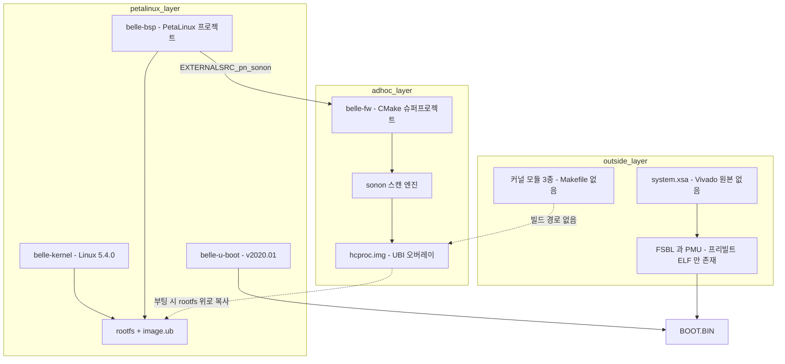
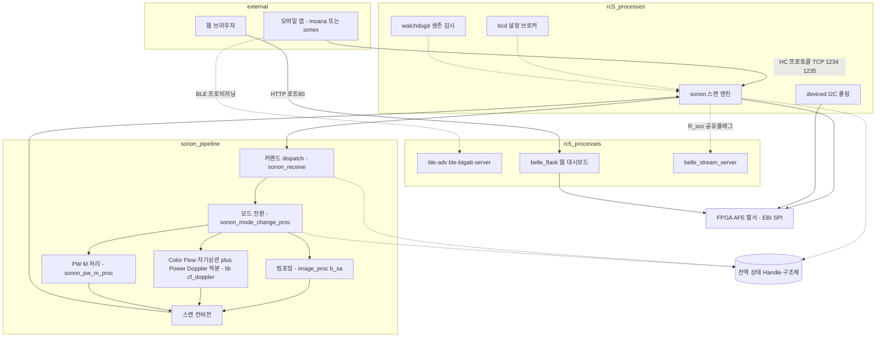
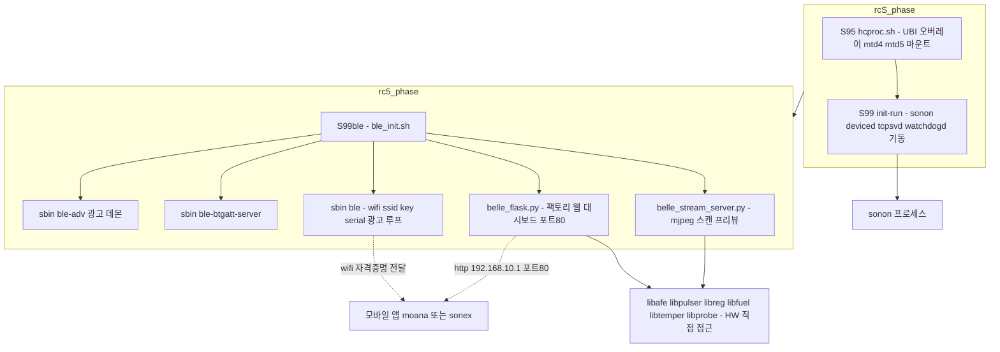

# device 그룹 — belle 펌웨어 구조

> **범위**: HLAB-2487 검토 대상은 **belle 계열**이다. 300 시리즈(ginny·elsa 세대)는 단종 모델이므로 범위 밖이며 참조 기록은 [legacy/ginny-elsa-firmware.md](legacy/ginny-elsa-firmware.md) 에 있다.
> **근거**: `belle-fw` **`origin/production-fw-ver2.0`**(HEAD 2026-07-01) · `belle-bsp` `master`+`origin/production-fw` 코드 직접 읽기(2026-07-27). **§6.1·§6.3·§6.6~§6.8 은 2026-08-01 에 같은 브랜치·`belle-bsp`에서 추가 실측**(스레드 전수·커맨드 파이프라인·Web/BLE 서비스 계통).
> **⚠ master 를 보면 안 된다** — `belle-fw` master 는 2021-09 에 멈춰 있고 실제 개발은 `production-fw-ver2.0` 에서 이어진다.

## 1. 한눈에

| 저장소 | 내용 | commits | 최종 | 상태 |
|---|---|---:|---|---|
| **`belle-fw`** | 애플리케이션·드라이버 (CMake 슈퍼프로젝트) | 66 | **2026-07-01** | **현행 생산 라인** |
| `belle-bsp` | **PetaLinux 프로젝트** — 머신·rootfs·레시피 | 18 | 2022-05-27 | 정지 |
| `belle-kernel` | Linux **5.4.0** (linux-xlnx 포크) | 5 | 2021-10-06 | 정지 |
| `belle-u-boot` | U-Boot **v2020.01** | 9 | 2022-04-22 | 정지 |
| `belle-msp` | MSP430FR2433 전원·감시 MCU | 6 | 2022-05-09 | 정지 |
| `belle-fsbl` · `belle-pmu` | — | — | — | **빈 저장소** |

**앱 계층만 살아 있고 밑단은 4~5년째 동결**이다. 이것은 우연이 아니라 빌드 구조의 결과다(§4).

플랫폼: **Xilinx Zynq UltraScale+ MPSoC**(Cortex-A53 aarch64), 보드 `HIT REV1.0`. **FPGA 는 SoC 내장 PL 하나뿐**이고 외부 FPGA 는 없다 — 500l 비트스트림 IDCODE 가 `0x04a42093` 로 Artix-7(`0x03631093`)이 아니고, PL 저장소 `elsa-fpga` 가 `xczu3cg` 를 타깃한다([belle-hardware.md §3.1](belle-hardware.md)). 정확한 ZU 부품번호는 미확인이다. 하드웨어 상세 = [belle-hardware.md](belle-hardware.md).

## 2. 빌드가 3개로 갈라져 있다



세 갈래를 잇는 것은 **절대경로와 사람의 기억**이다. 버전 관리되는 스크립트가 아니다.

### 2.1 BSP 가 애플리케이션을 빌드하도록 배선돼 있다

```
belle-bsp/project-spec/meta-user/conf/petalinuxbsp.conf:
EXTERNALSRC_pn-sonon = "/home/jacob/jacob-work-2020/belle_v202002_new/belle-fw"
```

`recipes-apps/sonon/sonon.bb` 가 `inherit cmake` 이므로 이 레시피 하나가 **belle-fw 의 CMake 슈퍼프로젝트 전체**를 빌드한다. 커널·u-boot 도 같은 방식이다.

```
project-spec/configs/config:
CONFIG_SUBSYSTEM_COMPONENT_U__BOOT_NAME_EXT_LOCAL_SRC_PATH=".../belle-u-boot"
CONFIG_SUBSYSTEM_COMPONENT_LINUX__KERNEL_NAME_EXT_LOCAL_SRC_PATH=".../belle-kernel"
```

즉 **git submodule 도 SRC_URI 도 아니고, 특정 개발자 머신의 디렉토리 배치에 의존한다.**

### 2.2 전체 순서는 `release_elsa.sh` 에만 있다

```sh
petalinux-build
petalinux-package --boot --fsbl $FSBL --pmufw $PMU --u-boot
sudo mkfs.ubifs ... hcproc.img ; sudo ubinize ... hcproc.ubi.bin
```

이 스크립트가 **belle-fw 와 belle-bsp 양쪽에 사본으로 존재하고, 둘이 서로 다르다** — FSBL/PMU 파일명과 소스 경로가 어긋나며 belle-fw 쪽 사본은 실행하면 실패한다.

## 3. 메인 바이너리가 rootfs 에 없다

**`sonon`(메인 스캔 엔진)은 PetaLinux rootfs 에 설치되지 않는다.** `install(TARGETS sonon)` 이 `USING_HCPROC_DIR` 의 비활성 분기에 있다.

대신 부팅할 때마다 `scripts/hcproc.sh`(`S95hcproc`, init 우선순위 95)가 UBI 오버레이를 마운트해 **live rootfs 위로 복사**한다.

```sh
cp -rf /hcproc/belle/       /usr/share/
cp -rf /hcproc/bin/*        /usr/bin/
cp -rf /hcproc/module/*     /lib/modules/extra/
cp -rf /hcproc/elsa_version /etc/
```

→ **제품의 핵심이 bitbake 가 관리하지 않는 손수 만든 이미지에만 존재한다.** 동시에 이것이 밑단 동결을 설명한다 — **앱만 바꿔 내보내는 것이 가능**하므로 커널·BSP 를 건드릴 이유가 없었다.

## 4. 플래시 구조 — A/B 이중 뱅크

| 파티션 | 용도 | 생성 주체 |
|---|---|---|
| mtd0 | `BOOT.BIN` | `petalinux-package --boot`. FSBL·PMU 는 **프리빌트 ELF 수동 배치**(복사 스크립트 없음) |
| mtd1 | bootenv | **`tools/bootenv.bin` 커밋된 정적 blob** — 어떤 빌드도 생성하지 않음 |
| **mtd2 / mtd3** | kernel **A/B** | `petalinux-build` → `image.ub` |
| **mtd4 / mtd5** | **hcproc 앱 오버레이 A/B** | `release_elsa.sh` 의 `sudo mkfs.ubifs` + `ubinize` |
| mtd6 | userdata | 없음(팩토리 리셋 시 erase) |
| mtd7 | auth (production-fw 추가) | ContextVision 키 저장소 |

`upgrade.sh` 가 `fw_printenv kernel_imagepart` 로 현재 뱅크를 읽어 **반대편에 기록**한다. 롤백 가능한 이중화가 실재한다 — 300 시리즈의 통짜 재플래시 방식보다 개선된 부분이다.

## 5. 변종이 컴파일 타임으로 갈린다

```cmake
add_definitions(-D_USING_500L_DEV_)   # 500L 프로브
add_definitions(-D_USING_SA_DEV_)     # SA(합성개구) 수신 경로
add_definitions(-D_ES3_DEV_)          # ES3 보드
add_definitions(-D_CF_SAMPLE_40M_)    # CF 40MHz 샘플링
add_definitions(-D_MSPLIB_)           # MSP430 micom 연동
#add_definitions(-D_USING_B_CONVEN_DEV_)   # 비활성 — b_conventional.cpp 컴파일 제외
```

`configs/300l/` 이 트리에 남아 있지만 현재 플래그 조합으로는 **도달 불가능한 죽은 데이터**다.

> **이전 세대는 런타임 선택이었다.** `ginny-fw` 는 u-boot 환경변수 한 줄로 5개 모델을 고르는 단일 유니버설 이미지였고, 시리얼 번호로 보드 리비전까지 자동 판별했다. belle 이 그 구조를 버렸다 — 상세 = [legacy/ginny-elsa-firmware.md §3](legacy/ginny-elsa-firmware.md). **리팩토링에서 런타임 변종 선택을 제안할 근거가 사내에 있다.**

## 6. 애플리케이션 구조

### 6.0 전체 구조 `[신규 실측 2026-08-01]`



**중심에 캡슐화 없는 전역 상태 하나가 있다.** `Handle`(`lib/common.h:430`, **166줄, 필드 150개 이상**)이 `g_handle` 전역 포인터 하나로 `sonon` 전체·`sonon_receive`·`sonon_mode_change_proc`·`lib/fpga*` 가 공유하는 유일한 상태 저장소다. 내용은 크게 셋으로 갈린다.

| 범주 | 예 |
|---|---|
| 장치 상태 | `device_type`·`power_fpga`·`power_scan`·`ebi_fd`·`reg_base`(FPGA mmap 주소) |
| **동기화 프리미티브 5개** | `transmit_mutex`·`neon_mutex`·`fpga_write_mutex`·`fpga_read_mutex`·`power_onoff_mutex` |
| **교정/설정 테이블 30여 종** | MAX2082 레지스터 테이블(tx/rx 별도)·depth 테이블(512/1024)·frequency/nco 테이블(3계열)·TGC·DTGC 테이블·pulser delay 테이블(B/B-SA/B-LD 별도)·시퀀스 테이블(`seq_b`·`seq_b_sa`·`seq_b_ld`·`seq_c`)·PRF interleave·doppler preset(`std::map`) |

이 테이블들이 사실상 **장비의 초음파 교정 데이터베이스**다 — 별도 설정 파일이나 DB 가 아니라 C++ 구조체 리터럴/벡터로 소스에 박혀 있다.

**모드 전환은 별도 상태기계다** — `sonon_mode_change_proc.cpp`(879줄)가 모드별 파라미터 setter 4개(`lib_b_mode_param_set`·`lib_cf_mode_param_set`·`lib_pw_mode_param_set`·`lib_m_mode_param_set`)와 공용 진입/종료(`lib_current_mode_stop`/`lib_current_mode_start`)를 갖는다. §6.1.1 의 PW/M 전용 스레드가 생성·해제되는 시점이 바로 여기다.

**모듈 결합도는 예상보다 깨끗하다** — 직접 확인 전엔 `image_proc`이 `lib`/`Handle`에 결합돼 있을 것으로 예상했으나, **`image_proc/b_sa.{h,cpp}`는 `Handle`을 전혀 참조하지 않는다.** 자체 I/Q 샘플 타입(`t_complex_data`)과 LUT(`Rx_apo_LUT.h`·`Tx_dly_LUT_delta.h` 등)만으로 동작하고, `sonon`이 원시 샘플 배열을 넘겨주고 처리 결과를 받아가는 구조다. 계층은 `sonon`(오케스트레이션+프로토콜, `Handle` 유일 소유자) → `image_proc`(정적 라이브러리, 순수 신호처리, **`b_sa.cpp` 단 하나만 컴파일**·`b_conventional.cpp`는 `add_library` 호출에서 아예 빠짐 — §5 결정과 정확히 일치) → `lib`(정적 라이브러리, HAL: fpga/afe/pulser/cf-doppler) → 하드웨어(EBI/mmap) 순이다.

**죽은 병렬 경로 하나 발견** — `b_sa.cpp`는 빔포밍을 스레드 2개(`MAX_DDF_THREAD_NUM`)로 병렬화하는 `DDF_THREAD` 코드 경로를 갖고 있으나, 활성화 매크로가 `//#define DDF_THREAD`로 **주석 처리돼 비활성**이다(`:40`) — 현재는 단일 스레드로 처리된다.

### 6.1 프로세스

| 실행물 | 역할 | IPC |
|---|---|---|
| `sonon` | 실시간 스캔 엔진. **pthread 최소 8개 상시 + 모드별 최대 5개 동적**(§6.1.1) | **TCP 2채널**(1234/1235), 커스텀 바이너리 |
| `bcd` | Board Config Daemon — 설정 브로커 | **SysV 메시지 큐** |
| `deviced` | I2C 온도·배터리 폴링 | SysV 메시지 큐 |
| `watchdogd` | 프로세스 생존 감시 + HW 워치독 | **Unix 도메인 소켓** |

IPC 방식이 셋 다 다르다.

#### 6.1.1 `sonon` 스레드 전수 — `[신규 실측 2026-08-01]` "5개 고정"이 아니다

`sonon/sonon.cpp`(3,522줄) `main()`을 직접 읽으면 상시 스레드가 5개가 아니라 **8개**이고, 그중 2개(`t_ctrl_message_from_client`·`t_data_message_to_client`)는 접속·모드에 따라 **추가로 스레드를 더 만든다.**

| 스레드 | 생성 시점 | 역할(코드 확인) |
|---|---|---|
| `t_ctrl_message_from_client` | 상시 | `CTRL_PORT`(1234) accept 루프. 접속마다 `t_ctrl_process` 신규 생성. **동일 IP 재접속이 아니면 세션 1개로 강제**(`sonon.cpp:2141-2236`) |
| `t_ctrl_process` | 클라이언트 접속마다 | DATA 세션 연결을 500ms 대기 후 커맨드 패킷 루프 진입 |
| `t_data_message_to_client` | 상시 | `DATA_PORT`(1235) accept 루프. 접속 시 `t_data_process` 생성, **그 시점 모드가 PW/M이면 추가 스레드까지 함께 생성** |
| `t_data_process` | 클라이언트 접속마다 | 실제 프레임 생산 루프 — freeze/live 상태·multifocus·도플러 파라미터·프레임 번호 관리, `R_scv` 플래그 처리(§6.8) 포함 |
| `t_pwtransmit_process`·`t_pwdata_process`·`t_pwpostdata_process`·`t_pwsnddata_process` | **PW 모드 진입 시에만** | PW 4단계 파이프라인(송신→수집→후처리→전송)을 스레드로 분리 |
| `t_mdata_process` | **M 모드 진입 시에만** | M-mode 전용 데이터 처리 |
| `t_management` | 상시 | 온도 2단계·배터리 2단계·팬고장 감시, deep-sleep 타임아웃, "alive" 카운터 — 주기적 헬스체크 |
| `t_button` | 상시, **단 `_USING_500L_DEV_` 빌드에서 `#if` 로 컴파일 자체가 제외**(`sonon.cpp:3492`) | 물리 버튼(freeze 등) 이벤트 처리. **500L 은 이 스레드가 존재하지 않는다** |
| `t_upgrade_process` | 상시, 평소 대기 | `pthread_cond_wait` 로 대기하다 업그레이드 명령 시 깨어나 `/sbin/upgrade.sh` 실행 후 재부팅 |
| `t_pipe_process` | 상시 | 이름과 달리 영상 파이프가 아니라 **named pipe 기반 텍스트 커맨드 콘솔**(`sonon_pipe.cpp`, `command_scan_fn`·`command_dump_fn`) — 엔지니어링 디버그 인터페이스로 보임 |

→ 접속·모드 조합에 따라 **동시 스레드 수가 8~13개 사이에서 변한다.** 리소스·경합 분석을 "고정 5스레드" 전제로 하면 틀린다.

### 6.2 CMake 그래프

루트가 `add_subdirectory` 하는 것은 8개 — `bcd`·`gpio`·`lib`·`sonon`·`deviced`·`watchdogd`·`image_proc`·`tools`. `modules/`(커널 드라이버·Flask 웹서버)는 **CMake 그래프에 없고** `install()` 로만 참조된다.

`sonon` 이 링크하는 것: `gpio fpga NE10 pthread message rt image_proc`.

### 6.3 신호처리는 소프트웨어에 있다

`lib/`(정적 라이브러리 `fpga`)와 `sonon/`·`image_proc/` 에 초음파 체인이 들어 있다 — AFE·펄서·컬러 도플러·PW·M-mode. 빌드 플래그도 이에 맞춰져 있다(`-D__NEON_ASSEM__`, `-ffast-math -ftree-vectorize`, ARM NE10 SIMD).

**`image_proc` 는 belle 세대에 추가된 것**이다(ginny 에는 없었다) — 영상 형성의 일부가 장비 쪽으로 옮겨왔다.

`[신규 실측 2026-08-01]` 파일 줄수로 무게중심을 보면 **FPGA 커맨드 wrapper 가 메인 오케스트레이션보다 크다.**

| 파일 | 줄수 | 역할 |
|---|---:|---|
| `sonon/sonon_receive_fpga.cpp` | **4,048** | FPGA 커맨드 wrapper 전체 |
| `sonon/sonon.cpp` | 3,522 | 메인 오케스트레이션(스레드·소켓·세션) |
| `lib/cf-doppler.c` | 1,585 | **Color Flow(CF)** 자기상관 본체 + **Power Doppler**(`pd_en` 분기·`cf_power_integrate()`) 적분 경로(ARM NEON). "CF"는 `lib/fpga_ebi.cpp:469` 주석 `//color flow` 로 확정 — Power Doppler 는 CF 와 별개 기능이나 같은 파일에 곁다리로 구현돼 있다 |
| `image_proc/b_sa.cpp` | 1,376 | SA(합성개구) 빔포밍·B-mode 영상 형성 — 현재 컴파일되는 유일한 B-mode 경로(§5) |
| `sonon/sonon_scanconversion.cpp` | 1,278 | 극좌표→직교좌표 스캔 컨버전 |
| `sonon/sonon_pw_m_proc.cpp` | 977 | PW/M-mode 처리 |
| `sonon/sonon_receive.cpp` | 950 | 프로토콜 dispatch(§6.6) |
| `sonon/sonon_b_sa.cpp` / `sonon_b_conventional.cpp` | 358 / 183 | SA/재래식 빔포밍 시퀀스 제어(후자는 빌드 제외 상태) |

### 6.4 HAL 은 규약이 아니라 선택지다

`lib/` 가 중앙 HAL 로 존재하지만 우회가 많다.

| 우회 | 위치 |
|---|---|
| `/dev/i2c-*` 직접 open + `ioctl` | `deviced/deviced.cpp` |
| `open("/dev/mem")` 독자 mmap | `tools/spidev.cpp` |
| MAX1720x 퓨얼게이지 재구현 | `tools/max17205.cpp` |

`tools/` 아래 23개 파일이 독자적으로 `ioctl()`/`open("/dev...")` 를 호출한다.

### 6.5 호스트 검증 하니스가 있다 — `lib/test/`

`origin/production-fw-ver2.0:lib/test/`, 커밋 `b8b12a7`(**2026-06-17**). 실험 브랜치가 아니라 **출하 브랜치 위**다.

| 파일 | 내용 |
|---|---|
| `cf_ff_compare.c` (218 LOC) | 실제 펌웨어 `lib/cf-doppler.c` 를 호스트에서 컴파일해 `cf_process()` 를 IQ 덤프(`scanlineNNN.dat`+`param.txt`)에 구동 |
| `build.sh` | `-D_CF_SAMPLE_40M_`, `__NEON_ASSEM__` 미정의(순수 C 폴백)로 링크 |
| `README.md` | "**골든 모델(파이썬) 재구현이 아니라 펌웨어 코드 자체를 검증한다(목업 없음)**" |

정량 합격 기준이 문서에 있다 — `recall=1.0(device 보존)` · `scatter=0` · `v21 far ≥ v20 far` · **골든 검출마스크 일치 ≥0.95**. 드라이버(`run_fw_v21_compare.py`)와 골든 데이터는 **`nextdoppler` 저장소**에 있고, 그것은 루트 `CLAUDE.md` 가 범위에서 뺀 78 NextDoppler 다 — **범위 제외 판단이 in-scope 출하 펌웨어의 검증 의존물을 잘랐다.**

→ belle 장비 축을 "회귀 판정 수단이 구조적으로 없는 곳"으로 인용하면 사실과 다르다. 없는 것은 **CI**(0건)이고, 하니스는 사람이 손으로 돌린다. 상세 = [change-cost.md §3.2](change-cost.md).

### 6.6 커맨드 처리 파이프라인 — `[신규 실측 2026-08-01]`

`sonon_receive.cpp`(950줄)가 진입점이다.

```
클라이언트 패킷 → wrapper_packet_process()
                     → verify_packet_header_and_crc()   ※ 이름과 달리 실제 CRC 검사 없음(§7)
                     → packet_type 분기:
                         FPGA_* → wrapper_rx_fpga_command()    (272줄 — AFE/FPGA 레지스터급 명령)
                         DEVICE_* → wrapper_rx_device_command() (701줄 — 모드 전환·스캔 파라미터 설정)
```

### 6.7 Web·BLE 서비스 계통 — `sonon` 과 별개 부팅 계통이다 `[신규 실측 2026-08-01]`

§6.2 가 "`modules/`(Flask 웹서버)는 CMake 그래프에 없다"고 이미 밝혔는데, **부팅 순서까지 완전히 분리돼 있다.** §2 다이어그램의 `hcproc`→`sonon` 흐름은 **SysV `rcS.d`**(시스템 초기화) 계통이고, Web·BLE 는 **`rc5.d`**(런레벨 5, 초기화 이후 일반 런레벨) 계통이다 — `sonon` 이 죽어도 이쪽은 계속 살아 있을 수 있다.



**설치 규칙**(`CMakeLists.txt`, `origin/production-fw-ver2.0`):

| 소스 | 설치 위치 | 비고 |
|---|---|---|
| `scripts/ble_init.sh` | `/etc/rc5.d/S99ble` | 부팅 시 BLE + Web 을 함께 기동 |
| `modules/ble/ad` | `/sbin/ble-adv` | **prebuilt 바이너리, 소스 없음** |
| `modules/ble/btgatt-server` | `/sbin/ble-btgatt-server` | **prebuilt 바이너리, 소스 없음** |
| `scripts/ble.sh` | `/sbin/ble` | WiFi SSID·키·기기명 광고 루프(쉘 스크립트, 소스 있음) |
| `modules/webserver/belle_flask/` | `/root/belle_flask`(hcproc 오버레이 경유 재복사) | Flask 팩토리 대시보드 |

**Web**: `belle_flask.py` 끝의 `app.run(host='192.168.10.1', port=80)` — 장비 자체 WiFi AP IP·포트80. 라우트는 `/device_monitoring`·`/device_control`·`/device_status`·`/aging_config`·`/aging_result`·`/probe`·`/login`·`/logout`(구버전 `modules/python/belle_flask/` 경로엔 `/afe/read`·`/pulser/write`·`/fpga/write`·`/uploadfpga`·`/upload_upgrade` 같은 **레지스터 직접 read/write·펌웨어 업로드** 라우트도 있었다). `libreg.so`·`libafe.so`·`libpulser.so`·`libtemper.so`·`libfuel.so`·`libprobe.so`를 Python `ctypes`로 직접 로드한다 — **`sonon`의 C++ HAL(`lib/`)을 거치지 않는, 완전히 독립된 두 번째 하드웨어 접근 스택**이다.

**BLE**: `ble.sh`의 `get_config()`가 `bcc`(설정 저장소)에서 `wlan_ssid`·`wlan_key`·`device_name`·`dev_serial`을 읽는다 — **기기명·WiFi 자격증명을 BLE로 광고해 앱이 기기를 찾고 WiFi 설정을 넘겨받는 프로비저닝 용도**로 보인다(추론, GATT 서비스/캐릭터리스틱 자체는 미확인 — §12). 실제 스캔 영상은 여전히 WiFi 위 HC 프로토콜(TCP 1234/1235)이다.

**발견된 불일치**: `ble_init.sh stop`은 `killall ble-ad`를 호출하는데 실제 설치 바이너리명은 `ble-adv`(`RENAME ble-adv`) — 이름이 어긋나 stop 이 이 프로세스를 못 잡을 가능성이 있다(코드상 확인, 실제 동작은 미검증).

### 6.8 `sonon` ↔ Web 의 유일한 접점 — `R_scv` 플래그 `[신규 실측 2026-08-01]`

§6.7 은 두 계통이 "완전히 독립"이라고 했지만, **영상 프리뷰 기능 하나는 파일시스템을 매개로 실제로 연결돼 있다.**

`sonon.cpp:1951-1964`(`t_data_process` 안):
```
if (config_get_uint8("R_scv") == 1) {
    // 현재 스캔 버퍼를 raw dump
    fopen("/tmp/upload/scv.dat", "wb")
    system("rawtopgm /tmp/upload/scv.dat /tmp/upload/scv.dat.pgm -x 512 -y 512")
    system("cjpeg-static /tmp/upload/scv.dat.pgm > /tmp/upload/scv.jpeg")
    config_set_uint("R_scv", 0)   // 완료 신호
}
```

`belle_stream_server.py`의 `gen_frames()`가 `libmessage.so`(SysV 메시지큐 래퍼)로 같은 `R_scv` 플래그를 1로 세팅하고 `sonon`이 0으로 내릴 때까지 폴링한 뒤 `/tmp/upload/scv.jpeg`를 읽어 MJPEG(`multipart/x-mixed-replace`)로 스트리밍한다.

**정식 IPC가 아니라 공유 설정플래그(`libmessage.so`) + 임시파일 + 외부 셸 파이프라인(`rawtopgm`·`cjpeg-static`)을 조합한 구조**다 — `sonon`이 C++ 코드에서 직접 JPEG 인코딩을 하지 않고, 매 프레임마다 프로세스 2개(`rawtopgm`, `cjpeg-static`)를 `system()`으로 fork/exec 한다.

## 7. 외부 통신 — HC 프로토콜

전송은 **TCP 2채널**이다 — `CTRL_PORT 1234` · `DATA_PORT 1235`, `TCP_NODELAY`. **장비가 서버**이고 호스트 앱이 접속한다. 장비는 자체 AP 로 뜬다(`192.168.10.1`).

상세는 [protocol.md](protocol-device.md) 가 SOT 다. 여기서는 belle 측 요점만 적는다.

- `belle-fw` 는 `sonon/sonon_receive.h:2210` 에 **자체 `PACKET_HEADER_S` 선언**을 갖는다. 같은 구조체가 앱(`moana`)·`500c-sn-fw` 에도 각각 선언돼 있어 **정본이 3벌**이다
- 프로토콜 버전이 `HER_PROTOCOL_VER_MAJOR 0x01`·`MINOR 0x00` 으로 **컴파일 타임 고정**이다(500 계열 태그)
- opcode 를 `DEVICE_READ_*`/`DEVICE_WRITE_*` 쌍으로 정의하는데 **앱은 쌍 중 하나만 이름 붙인다**
- 장비에만 있는 명령이 많다 — 디버그·공장시험·AFE 레지스터 직접 로드(`FPGA_LOAD_MAX2082_REG_FILE`)
- **CRC 가 없다** — `verify_packet_header_and_crc` 함수명과 달리 검사 코드가 없다

### 7.1 커맨드 공간

`packet_type` 으로 계열을 가르고(`DEVICE_COMM 0x0001`·`DEVICE_RESP 0x0002`·`FPGA_COMM 0x0003`·`FPGA_RESP 0x0004`·`B 0x0100`·`B_C 0x0102`·`PW 0x0104`·`M 0x0106`) 그 안에서 16비트 opcode 를 쓴다.

| opcode | 값 |
|---|---|
| `DEVICE_SCAN_READY` / `DEVICE_SCAN` / `DEVICE_KEEP_ALIVE` | 0x0001 / 0x0002 / 0x0003 |
| `DEVICE_SPEC_INFO` / `DEVICE_TIME_SYNC` | 0x2001 / 0x2002 |
| `FPGA_RESET` / `FPGA_READ_DEPTH` / `FPGA_WRITE_DEPTH` | 0x0001 / 0x0100 / 0x0101 |

`version[2]` 필드가 모델 선택자를 겸한다 — `0x00 0x01`=S300C · `0x00 0x02`=S300L · `0x00 0x03`=S300MC · `0x01 0x00`=500 시리즈. **기능 플래그 협상이나 세만틱 버저닝은 없다.**

### 7.2 같은 프로토콜이 7개 코드베이스에 복제돼 있다

장비 측 `ginny-fw`·`elsa-fw`·`belle-fw`·`500c-sn-fw`, 호스트 측 `moana`·`sonex-framework`·`cuattro-sdk`. **통합 효과가 가장 큰 표면**이며, `cuattro-sdk` 는 `moana` 의 포크임이 확인됐다(파일 17개 중 15개 동명).

## 8. `belle-msp` — 감시 MCU

TI **MSP430FR2433**, TI CCS 10.0.0. 초음파가 아니라 **전원·부팅 감독**이 역할이다.

1. 전원 버튼 디바운스(길게≈5초 = 팩토리 리셋)
2. 레일·리셋 시퀀싱 — `IO_ENABLE`·`FPD_ENABLE`·`LPD_ENABLE`·`PS_POR_B`
3. **호스트 SoC 부팅 감독** — `common.h` 의 `CUR_BRINGUP_1_OK = u-boot boot ok`·`CUR_BRINGUP_2_OK = kernel boot ok`. 타임아웃 시 `power_reset()`
4. 소프트웨어 워치독 — HW WDT 는 끄고 I2C 레지스터 `DEVICE_WATCHDOG_REG` 를 호스트가 4ms 주기로 갱신하는지 감시
5. MAX1720x 퓨얼게이지 판독 → I2C 레지스터로 호스트 보고

인터페이스는 **I2C 이중 역할**이다 — USCI_B0 하드웨어 I2C 슬레이브(주소 `0x48`)로 호스트에 레지스터 파일을 노출하고, 비트뱅잉 I2C 마스터로 퓨얼게이지(`0x36`)·LED 드라이버(`0x14`)를 제어한다.

> **저장소 위생**: 추적 파일 294개 중 실제 소스는 **10개(3,820 LOC)** 뿐이다. 나머지는 CCS Eclipse 워크스페이스 메타·**내장 브라우저 캐시(`.jxbrowser-data/`)**·커밋된 빌드 산출물이다.

## 9. 재현 불가 지점

현재 저장소 + PetaLinux 설치만으로는 **부팅 가능한 이미지를 만들 수 없다.**

| 항목 | 내용 |
|---|---|
| **FSBL·PMU 소스** | 저장소가 비어 있고 실물은 `belle-bsp/vivado-hw-xsa/es3-fsbl-v00-01-00.elf`·`es3-pmu-v00-01-00.elf` **프리빌트 ELF 뿐**. 하드웨어 리비전 변경 시 재생성 경로 없음 |
| **Vivado 하드웨어 프로젝트** | `es3_v00.01.00.xsa` 의 **원본 프로젝트 없음**. 내보낸 아티팩트만 있다 |
| **커널 모듈 3종** | `plif`·`zynqdma`·`msp430_drv` 에 **Makefile 이 아예 없다.** `readme.makefile` 템플릿 하나뿐이고 BSP 에도 레시피가 0건. 그런데 install 규칙과 `release_elsa.sh` 가 이 `.ko` 를 참조한다 |
| **`NE10`** | `sonon` 이 링크하는데 `ne10_lib/` 에 **헤더 8개뿐** |
| **PetaLinux 툴체인** | `petalinux-build`·`meta-xilinx`·poky "zeus"·`bootgen` 전부 외부. 릴리스 버전 미확정 |
| **`belle-sysroot`** | `release_elsa.sh` 가 참조하나 실물 없음 |
| **절대경로** | `/home/jacob/jacob-work-2020/belle_v202002_new/{belle-fw,belle-u-boot,belle-kernel,belle-sysroot}` + 낡은 변종 + 타 엔지니어 경로 |

**함정 하나** — 2021-08 빌드 `hcproc.img`(9.5MB)가 git 에 그대로 있다. 산출물로 오인하면 5년 전 앱이 배포된다.

## 10. 최근 개발

`production-fw-ver2.0` 의 2026-06~07 커밋은 전부 **T1968 — 컬러 도플러 저SNR 검출**이다(far-field 민감도, 깊이적응 CFAR, 도플러 위상 성장). 그 이전은 PW 모드 "for BVF"·환자정보 "for NCC" 같은 **OEM 코드명**이 붙어 있다.

즉 **개발 동력이 고객사별 요구와 신호처리 알고리즘**이고, 플랫폼·빌드 쪽은 손대지 않는다.

부수 사항 — `production-fw` 의 `rootfs_config` 가 root 비밀번호를 강화하면서 동시에 `imagefeature-debug-tweaks=y` 를 켰다. 상충하는 설정이다.

## 11. HLAB-2487 함의

| 관측 | 함의 |
|---|---|
| 빌드가 3갈래로 갈라져 절대경로로 이어짐(§2) | **재현 가능한 빌드 확보가 리팩토링의 선행 조건**이다. 이것 없이는 변경의 동작 동일성을 확인할 수 없다 |
| 메인 바이너리가 rootfs 밖 오버레이(§3) | 앱만 교체하는 운영이 가능해 **밑단이 5년째 동결**됐다. 커널·BSP 현대화는 별도 결심이 필요하다 |
| 변종이 컴파일 타임(§5) | 이전 세대의 런타임 방식으로 되돌리는 것이 명확한 개선 방향. **사내 선례가 근거** |
| 프로토콜 정본이 셋, 구현이 7벌(§7) | 위험 낮고 효과 큰 첫 리팩토링 대상 |
| FSBL·PMU·Vivado 프로젝트 부재(§9) | 하드웨어 변경 대응 불가. **저장소가 아니라 개발자 머신에 있을 가능성** |
| 개발이 알고리즘·OEM 대응에만 집중(§10) | 플랫폼 개선 여력이 조직에 배정돼 있지 않다 |
| **CI 0건 · 검증 하니스 1건**(§6.5) | 판정 수단이 없는 게 아니라 **자동으로 돌리는 계통이 없다.** 규제 검토의 공백은 후자다 |
| `sonon` 스레드가 8~13개로 가변, "5개 고정" 아님(§6.1.1) | 회귀·부하 분석을 스레드 수 고정 전제로 하면 틀린다. **모드 전환 시점의 스레드 생성/해제 경합**이 검토 필요 지점 |
| **하드웨어 접근 경로가 이중**(§6.7) — `sonon`(C++ `lib/` HAL) vs `belle_flask`(Python ctypes `.so` 직접 로드) | 동시 접근 시 레이스 가능성이 **구조적으로 존재**. Web 이 켜져 있는 동안 `sonon`과 레지스터를 동시에 건드릴 수 있다 |
| `sonon`(rcS.d)과 Web·BLE(rc5.d)가 별개 부팅 계통(§6.7) | `sonon` 장애가 Web·BLE 가용성에 영향 없음 — **진단 목적엔 유리하나 상태 불일치 위험**(예: `sonon` 이 죽었는데 웹 대시보드는 "정상"으로 보일 수 있음) |
| BLE 바이너리 3종 중 2종(`ble-adv`·`ble-btgatt-server`) 소스 없음(§6.7) | `belle-msp`(§8)와 같은 **SOUP-무출처 패턴**이 반복. 리비전·펌웨어 출처 불명은 규제 관점에서도 공백 |
| `sonon`↔Web 연결이 공유플래그+임시파일+외부프로세스(§6.8) | 정식 IPC 로 교체하면 **프레임당 fork/exec 2회**(`rawtopgm`·`cjpeg-static`) 오버헤드를 없앨 수 있음 — 성능·신뢰성 개선 여지 |

## 12. 미확인

- `belle-fw` `production-fw-ver2.0`(2026-07)과 `production-fw`(2026-06)의 관계 — 실제 출하 브랜치
- PetaLinux 릴리스 버전 — `layer.conf` 의 `zeus` 가 단서
- `image_proc` 도입으로 영상 형성 경계가 어디까지 옮겨왔는지
- **BLE GATT 서비스/캐릭터리스틱 UUID·페이로드 포맷**(§6.7) — `ble-adv`·`ble-btgatt-server` 가 prebuilt 라 소스로 확인 불가. 앱(`moana`/`sonex`) 쪽에서 이 GATT 를 실제로 소비하는 코드가 있는지도 미확인
- **`belle_flask` 로그인(`/login`) 인증 강도**(§6.7) — 코드 미확인. 하드코딩 자격증명 여부는 `cybersecurity.md` 관점의 별도 확인 필요
- `ble_init.sh stop`의 `killall ble-ad` vs 실제 설치명 `ble-adv` 불일치(§6.7)가 **실제로 프로세스 정리 실패로 이어지는지** — 코드는 확인, 실기 동작은 미검증
