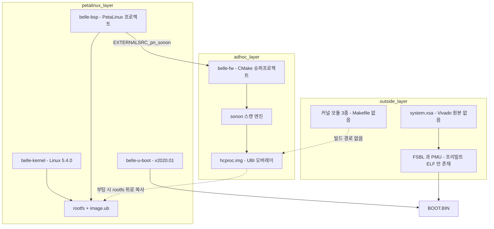

# device 그룹 — belle 펌웨어 구조

> **범위**: HLAB-2487 검토 대상은 **belle 계열**이다. 300 시리즈(ginny·elsa 세대)는 단종 모델이므로 범위 밖이며 참조 기록은 [legacy/ginny-elsa-firmware.md](legacy/ginny-elsa-firmware.md) 에 있다.
> **근거**: `belle-fw` **`origin/production-fw-ver2.0`**(HEAD 2026-07-01) · `belle-bsp` `master`+`origin/production-fw` 코드 직접 읽기(2026-07-27).
> **⚠ master 를 보면 안 된다** — `belle-fw` master 는 2021-09 에 멈춰 있고 실제 개발은 `production-fw-ver2.0` 에서 이어진다.

## 1. 한눈에

| 저장소 | 내용 | commits | 최종 | 상태 |
|---|---|---:|---|---|
| **`belle-fw`** | 애플리케이션·드라이버 (CMake 슈퍼프로젝트) | 66 | **2026-07-01** | **현행 생산 라인** |
| `belle-bsp` | **PetaLinux 프로젝트** — 머신·rootfs·레시피 | 18 | 2022-05-27 | 정지 |
| `belle-kernel` | Linux **5.4.0** (linux-xlnx 포크) | 5 | 2021-10-06 | 정지 |
| `belle-u-boot` | U-Boot **v2020.01** | 9 | 2022-04-22 | 정지 |
| `belle-msp` | MSP430FR2433 전원·감시 MCU | 6 | 2022-05-09 | 정지 |
| `belle-fsbl` · `belle-pmu` | — | — | — | **빈 저장소** |

**앱 계층만 살아 있고 밑단은 4~5년째 동결**이다. 이것은 우연이 아니라 빌드 구조의 결과다(§4).

플랫폼: **Xilinx Zynq UltraScale+ MPSoC**(Cortex-A53 aarch64), 보드 `HIT REV1.0`. **FPGA 는 SoC 내장 PL 하나뿐**이고 외부 FPGA 는 없다(비트스트림 IDCODE `0x04a42093` = ZU3). 하드웨어 상세 = [belle-hardware.md](belle-hardware.md).

## 2. 빌드가 3개로 갈라져 있다



세 갈래를 잇는 것은 **절대경로와 사람의 기억**이다. 버전 관리되는 스크립트가 아니다.

### 2.1 BSP 가 애플리케이션을 빌드하도록 배선돼 있다

```
belle-bsp/project-spec/meta-user/conf/petalinuxbsp.conf:
EXTERNALSRC_pn-sonon = "/home/jacob/jacob-work-2020/belle_v202002_new/belle-fw"
```

`recipes-apps/sonon/sonon.bb` 가 `inherit cmake` 이므로 이 레시피 하나가 **belle-fw 의 CMake 슈퍼프로젝트 전체**를 빌드한다. 커널·u-boot 도 같은 방식이다.

```
project-spec/configs/config:
CONFIG_SUBSYSTEM_COMPONENT_U__BOOT_NAME_EXT_LOCAL_SRC_PATH=".../belle-u-boot"
CONFIG_SUBSYSTEM_COMPONENT_LINUX__KERNEL_NAME_EXT_LOCAL_SRC_PATH=".../belle-kernel"
```

즉 **git submodule 도 SRC_URI 도 아니고, 특정 개발자 머신의 디렉토리 배치에 의존한다.**

### 2.2 전체 순서는 `release_elsa.sh` 에만 있다

```sh
petalinux-build
petalinux-package --boot --fsbl $FSBL --pmufw $PMU --u-boot
sudo mkfs.ubifs ... hcproc.img ; sudo ubinize ... hcproc.ubi.bin
```

이 스크립트가 **belle-fw 와 belle-bsp 양쪽에 사본으로 존재하고, 둘이 서로 다르다** — FSBL/PMU 파일명과 소스 경로가 어긋나며 belle-fw 쪽 사본은 실행하면 실패한다.

## 3. 메인 바이너리가 rootfs 에 없다

**`sonon`(메인 스캔 엔진)은 PetaLinux rootfs 에 설치되지 않는다.** `install(TARGETS sonon)` 이 `USING_HCPROC_DIR` 의 비활성 분기에 있다.

대신 부팅할 때마다 `scripts/hcproc.sh`(`S95hcproc`, init 우선순위 95)가 UBI 오버레이를 마운트해 **live rootfs 위로 복사**한다.

```sh
cp -rf /hcproc/belle/   /usr/share/belle
cp -rf /hcproc/bin/*    /usr/bin/
cp -rf /hcproc/module/* /lib/modules/extra/
```

→ **제품의 핵심이 bitbake 가 관리하지 않는 손수 만든 이미지에만 존재한다.** 동시에 이것이 밑단 동결을 설명한다 — **앱만 바꿔 내보내는 것이 가능**하므로 커널·BSP 를 건드릴 이유가 없었다.

## 4. 플래시 구조 — A/B 이중 뱅크

| 파티션 | 용도 | 생성 주체 |
|---|---|---|
| mtd0 | `BOOT.BIN` | `petalinux-package --boot`. FSBL·PMU 는 **프리빌트 ELF 수동 배치**(복사 스크립트 없음) |
| mtd1 | bootenv | **`tools/bootenv.bin` 커밋된 정적 blob** — 어떤 빌드도 생성하지 않음 |
| **mtd2 / mtd3** | kernel **A/B** | `petalinux-build` → `image.ub` |
| **mtd4 / mtd5** | **hcproc 앱 오버레이 A/B** | `release_elsa.sh` 의 `sudo mkfs.ubifs` + `ubinize` |
| mtd6 | userdata | 없음(팩토리 리셋 시 erase) |
| mtd7 | auth (production-fw 추가) | ContextVision 키 저장소 |

`upgrade.sh` 가 `fw_printenv kernel_imagepart` 로 현재 뱅크를 읽어 **반대편에 기록**한다. 롤백 가능한 이중화가 실재한다 — 300 시리즈의 통짜 재플래시 방식보다 개선된 부분이다.

## 5. 변종이 컴파일 타임으로 갈린다

```cmake
add_definitions(-D_USING_500L_DEV_)   # 500L 프로브
add_definitions(-D_USING_SA_DEV_)     # SA(합성개구) 수신 경로
add_definitions(-D_ES3_DEV_)          # ES3 보드
add_definitions(-D_CF_SAMPLE_40M_)    # CF 40MHz 샘플링
add_definitions(-D_MSPLIB_)           # MSP430 micom 연동
#add_definitions(-D_USING_B_CONVEN_DEV_)   # 비활성 — b_conventional.cpp 컴파일 제외
```

`configs/300l/` 이 트리에 남아 있지만 현재 플래그 조합으로는 **도달 불가능한 죽은 데이터**다.

> **이전 세대는 런타임 선택이었다.** `ginny-fw` 는 u-boot 환경변수 한 줄로 5개 모델을 고르는 단일 유니버설 이미지였고, 시리얼 번호로 보드 리비전까지 자동 판별했다. belle 이 그 구조를 버렸다 — 상세 = [legacy/ginny-elsa-firmware.md §3](legacy/ginny-elsa-firmware.md). **리팩토링에서 런타임 변종 선택을 제안할 근거가 사내에 있다.**

## 6. 애플리케이션 구조

### 6.1 프로세스

| 실행물 | 역할 | IPC |
|---|---|---|
| `sonon` | 실시간 스캔 엔진. pthread 5개(`ctrl`·`data`·`mgmt`·`btn`·`pipe`) | **TCP 2채널**(1234/1235), 커스텀 바이너리 |
| `bcd` | Board Config Daemon — 설정 브로커 | **SysV 메시지 큐** |
| `deviced` | I2C 온도·배터리 폴링 | SysV 메시지 큐 |
| `watchdogd` | 프로세스 생존 감시 + HW 워치독 | **Unix 도메인 소켓** |

IPC 방식이 셋 다 다르다.

### 6.2 CMake 그래프

루트가 `add_subdirectory` 하는 것은 8개 — `bcd`·`gpio`·`lib`·`sonon`·`deviced`·`watchdogd`·`image_proc`·`tools`. `modules/`(커널 드라이버·Flask 웹서버)는 **CMake 그래프에 없고** `install()` 로만 참조된다.

`sonon` 이 링크하는 것: `gpio fpga NE10 pthread message rt image_proc`.

### 6.3 신호처리는 소프트웨어에 있다

`lib/`(정적 라이브러리 `fpga`)와 `sonon/`·`image_proc/` 에 초음파 체인이 들어 있다 — AFE·펄서·컬러 도플러·PW·M-mode. 빌드 플래그도 이에 맞춰져 있다(`-D__NEON_ASSEM__`, `-ffast-math -ftree-vectorize`, ARM NE10 SIMD).

**`image_proc` 는 belle 세대에 추가된 것**이다(ginny 에는 없었다) — 영상 형성의 일부가 장비 쪽으로 옮겨왔다.

### 6.4 HAL 은 규약이 아니라 선택지다

`lib/` 가 중앙 HAL 로 존재하지만 우회가 많다.

| 우회 | 위치 |
|---|---|
| `/dev/i2c-*` 직접 open + `ioctl` | `deviced/deviced.cpp` |
| `open("/dev/mem")` 독자 mmap | `tools/spidev.cpp` |
| MAX1720x 퓨얼게이지 재구현 | `tools/max17205.cpp` |

`tools/` 아래 23개 파일이 독자적으로 `ioctl()`/`open("/dev...")` 를 호출한다.

## 7. 외부 통신 — HC 프로토콜

전송은 **TCP 2채널**이다 — `CTRL_PORT 1234` · `DATA_PORT 1235`, `TCP_NODELAY`. **장비가 서버**이고 호스트 앱이 접속한다. 장비는 자체 AP 로 뜬다(`192.168.10.1`).

상세는 [protocol.md](protocol-device.md) 가 SOT 다. 여기서는 belle 측 요점만 적는다.

- `belle-fw` 는 `sonon/sonon_receive.h:2210` 에 **자체 `PACKET_HEADER_S` 선언**을 갖는다. 같은 구조체가 앱(`moana`)·`500c-sn-fw` 에도 각각 선언돼 있어 **정본이 3벌**이다
- 프로토콜 버전이 `HER_PROTOCOL_VER_MAJOR 0x01`·`MINOR 0x00` 으로 **컴파일 타임 고정**이다(500 계열 태그)
- opcode 를 `DEVICE_READ_*`/`DEVICE_WRITE_*` 쌍으로 정의하는데 **앱은 쌍 중 하나만 이름 붙인다**
- 장비에만 있는 명령이 많다 — 디버그·공장시험·AFE 레지스터 직접 로드(`FPGA_LOAD_MAX2082_REG_FILE`)
- **CRC 가 없다** — `verify_packet_header_and_crc` 함수명과 달리 검사 코드가 없다

### 7.1 커맨드 공간

`packet_type` 으로 계열을 가르고(`DEVICE_COMM 0x0001`·`DEVICE_RESP 0x0002`·`FPGA_COMM 0x0003`·`FPGA_RESP 0x0004`·`B 0x0100`·`B_C 0x0102`·`PW 0x0104`·`M 0x0106`) 그 안에서 16비트 opcode 를 쓴다.

| opcode | 값 |
|---|---|
| `DEVICE_SCAN_READY` / `DEVICE_SCAN` / `DEVICE_KEEP_ALIVE` | 0x0001 / 0x0002 / 0x0003 |
| `DEVICE_SPEC_INFO` / `DEVICE_TIME_SYNC` | 0x2001 / 0x2002 |
| `FPGA_RESET` / `FPGA_READ_DEPTH` / `FPGA_WRITE_DEPTH` | 0x0001 / 0x0100 / 0x0101 |

`version[2]` 필드가 모델 선택자를 겸한다 — `0x00 0x01`=S300C · `0x00 0x02`=S300L · `0x00 0x03`=S300MC · `0x01 0x00`=500 시리즈. **기능 플래그 협상이나 세만틱 버저닝은 없다.**

### 7.2 같은 프로토콜이 7개 코드베이스에 복제돼 있다

장비 측 `ginny-fw`·`elsa-fw`·`belle-fw`·`500c-sn-fw`, 호스트 측 `moana`·`sonex-framework`·`cuattro-sdk`. **통합 효과가 가장 큰 표면**이며, `cuattro-sdk` 는 `moana` 의 포크임이 확인됐다(파일 17개 중 15개 동명).

## 8. `belle-msp` — 감시 MCU

TI **MSP430FR2433**, TI CCS 10.0.0. 초음파가 아니라 **전원·부팅 감독**이 역할이다.

1. 전원 버튼 디바운스(길게≈5초 = 팩토리 리셋)
2. 레일·리셋 시퀀싱 — `IO_ENABLE`·`FPD_ENABLE`·`LPD_ENABLE`·`PS_POR_B`
3. **호스트 SoC 부팅 감독** — `common.h` 의 `CUR_BRINGUP_1_OK = u-boot boot ok`·`CUR_BRINGUP_2_OK = kernel boot ok`. 타임아웃 시 `power_reset()`
4. 소프트웨어 워치독 — HW WDT 는 끄고 I2C 레지스터 `DEVICE_WATCHDOG_REG` 를 호스트가 4ms 주기로 갱신하는지 감시
5. MAX1720x 퓨얼게이지 판독 → I2C 레지스터로 호스트 보고

인터페이스는 **I2C 이중 역할**이다 — USCI_B0 하드웨어 I2C 슬레이브(주소 `0x48`)로 호스트에 레지스터 파일을 노출하고, 비트뱅잉 I2C 마스터로 퓨얼게이지(`0x36`)·LED 드라이버(`0x14`)를 제어한다.

> **저장소 위생**: 추적 파일 294개 중 실제 소스는 **10개(3,820 LOC)** 뿐이다. 나머지는 CCS Eclipse 워크스페이스 메타·**내장 브라우저 캐시(`.jxbrowser-data/`)**·커밋된 빌드 산출물이다.

## 9. 재현 불가 지점

현재 저장소 + PetaLinux 설치만으로는 **부팅 가능한 이미지를 만들 수 없다.**

| 항목 | 내용 |
|---|---|
| **FSBL·PMU 소스** | 저장소가 비어 있고 실물은 `belle-bsp/vivado-hw-xsa/es3-fsbl-v00-01-00.elf`·`es3-pmu-v00-01-00.elf` **프리빌트 ELF 뿐**. 하드웨어 리비전 변경 시 재생성 경로 없음 |
| **Vivado 하드웨어 프로젝트** | `es3_v00.01.00.xsa` 의 **원본 프로젝트 없음**. 내보낸 아티팩트만 있다 |
| **커널 모듈 3종** | `plif`·`zynqdma`·`msp430_drv` 에 **Makefile 이 아예 없다.** `readme.makefile` 템플릿 하나뿐이고 BSP 에도 레시피가 0건. 그런데 install 규칙과 `release_elsa.sh` 가 이 `.ko` 를 참조한다 |
| **`NE10`** | `sonon` 이 링크하는데 `ne10_lib/` 에 **헤더 8개뿐** |
| **PetaLinux 툴체인** | `petalinux-build`·`meta-xilinx`·poky "zeus"·`bootgen` 전부 외부. 릴리스 버전 미확정 |
| **`belle-sysroot`** | `release_elsa.sh` 가 참조하나 실물 없음 |
| **절대경로** | `/home/jacob/jacob-work-2020/belle_v202002_new/{belle-fw,belle-u-boot,belle-kernel,belle-sysroot}` + 낡은 변종 + 타 엔지니어 경로 |

**함정 하나** — 2021-08 빌드 `hcproc.img`(9.5MB)가 git 에 그대로 있다. 산출물로 오인하면 5년 전 앱이 배포된다.

## 10. 최근 개발

`production-fw-ver2.0` 의 2026-06~07 커밋은 전부 **T1968 — 컬러 도플러 저SNR 검출**이다(far-field 민감도, 깊이적응 CFAR, 도플러 위상 성장). 그 이전은 PW 모드 "for BVF"·환자정보 "for NCC" 같은 **OEM 코드명**이 붙어 있다.

즉 **개발 동력이 고객사별 요구와 신호처리 알고리즘**이고, 플랫폼·빌드 쪽은 손대지 않는다.

부수 사항 — `production-fw` 의 `rootfs_config` 가 root 비밀번호를 강화하면서 동시에 `imagefeature-debug-tweaks=y` 를 켰다. 상충하는 설정이다.

## 11. HLAB-2487 함의

| 관측 | 함의 |
|---|---|
| 빌드가 3갈래로 갈라져 절대경로로 이어짐(§2) | **재현 가능한 빌드 확보가 리팩토링의 선행 조건**이다. 이것 없이는 변경의 동작 동일성을 확인할 수 없다 |
| 메인 바이너리가 rootfs 밖 오버레이(§3) | 앱만 교체하는 운영이 가능해 **밑단이 5년째 동결**됐다. 커널·BSP 현대화는 별도 결심이 필요하다 |
| 변종이 컴파일 타임(§5) | 이전 세대의 런타임 방식으로 되돌리는 것이 명확한 개선 방향. **사내 선례가 근거** |
| 프로토콜 정본이 둘, 구현이 7벌(§7) | 위험 낮고 효과 큰 첫 리팩토링 대상 |
| FSBL·PMU·Vivado 프로젝트 부재(§9) | 하드웨어 변경 대응 불가. **저장소가 아니라 개발자 머신에 있을 가능성** |
| 개발이 알고리즘·OEM 대응에만 집중(§10) | 플랫폼 개선 여력이 조직에 배정돼 있지 않다 |
| 테스트·CI 0건 | 회귀 안전망 없음. 의료기기 규제 검토의 핵심 공백 |

## 12. 미확인

- `belle-fw` `production-fw-ver2.0`(2026-07)과 `production-fw`(2026-06)의 관계 — 실제 출하 브랜치
- PetaLinux 릴리스 버전 — `layer.conf` 의 `zeus` 가 단서
- `image_proc` 도입으로 영상 형성 경계가 어디까지 옮겨왔는지
