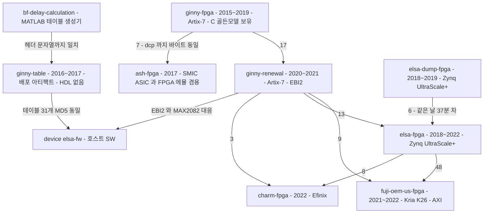

# [범위 밖] ginny·ash·fuji·charm FPGA 계보

> **범위 판단**: 300 시리즈·OEM·CHARM 계열 FPGA 는 **belle 과 호환되지 않으므로 검토 범위 밖**이다. belle 의 PL 은 `fpga/legacy/elsa-fpga`(xczu3cg)이며 [../belle-hardware.md §3](../belle-hardware.md) 에서 다룬다.
> **belle 과 다른 점**: 이 계보는 전부 **외부 Artix-7 XC7A100T**(비트스트림 3,825,788 B · IDCODE `0x03631093`)를 쓴다. belle 은 **ZynqMP PL 단독**(5,568,668 B · IDCODE `0x04a42093`)이다.
> **근거**: 코드 직접 읽기 + MD5·IDCODE 대조(2026-07-27).

## 1. 계보

간선 위 숫자는 **바이트 동일한 `.v` 파일 개수**다.



**계보를 확정하는 세 가지 시간 증거**

| 주장(커밋 메시지) | 대조 사실 |
|---|---|
| `elsa-fpga` 최초 커밋: "ELSA DUMP project 코드(2018.12.10)를 기본으로" | `elsa-dump-fpga` 에 **2018-12-10 13:45:48** 커밋 존재 — `elsa-fpga` 최초 커밋(14:22:25)보다 **37분 앞선다** |
| `ginny-renewal` 최초 커밋: "fpga_ginny **2019/7/30** 버전에서 git init" | `ginny-fpga` 의 **최종 커밋이 2019-07-30** |
| `fuji` 2번째 커밋: "ELSA FPGA **21/8/10**일 버전을 초기 버전으로" | `elsa-fpga` 에 **2021-08-10 15:33:52** 커밋 존재 |

**`ash-fpga` 는 FPGA 프로젝트가 아니다** — SMIC 0.13µm **ASIC 프로젝트 + FPGA 에뮬레이션** 겸용이다. `syn/dc_syn`(Synopsys Design Compiler)·`syn/pt_syn`(PrimeTime)·`rtl/SMIC/*.v`(표준셀 모델)·`rtl/memory/*.lib`(메모리 컴파일러 산출물)을 갖고, 탑 모듈이 `ash_asic_top.v` 와 `ash_fpga_top.v` 둘이다. 그리고 **Ginny RTL 에서 파생**됐다 — `ginny-fpga` 의 브랜치 `pw_doppler`·`300L_310C` 에 **`ash_top.v`·`ash_pin.xdc` 가 실수로 커밋돼 있다**(2017-09-13).

**`charm-fpga` 만 Xilinx 가 아니다** — `syn/efx/charm.peri.xml`·`rtl/efinix/*.v`(`Copyright (C) 2013-2018 Efinix Inc.`)로 **Efinix** 를 타깃한다. 이 계열에서 유일한 벤더 이탈이다.

### 1.1 `fuji-oem-us-fpga` 는 `ginny-renewal` 의 포크다 — 식별자급 증거

두 저장소에 **이름이 같은 `.v` 파일 33개** 중 **9개가 MD5 완전 동일**하다: `dcr_adder.v` · `dpbrom720x16.v` · `env_d.v` · `gain.v` · `gain_ctrl.v` · `rf32x12D.v` · `sprom2048x14.v` · `sprom_256x14_gain.v` · `square.v`.

결정적인 것은 fuji 안의 Xilinx 자동생성 IP 헤더가 **ginny-renewal 의 작업 디렉토리 경로를 그대로 담고 있다**는 점이다.

```
// fpga/legacy/fuji-oem-us-fpga/rtl/xilinx_core/sprom2048x14.v
// Command : write_verilog -force -mode funcsim
//           /home/peter/work/project/ginny/fpga_ginny_rn/syn/ip/sprom2048x14/sprom2048x14_sim_netlist.v
// Device      : xc7a100tcsg324-1
```

`fpga_ginny_rn` 은 ginny-renewal 의 작업 디렉토리명이고(`gny_rn.xpr` 의 `Path="/home/dave/work/project/ginny/fpga_ginny_rn/..."`), `xc7a100tcsg324-1` 은 ginny-renewal 의 부품번호다. **ginny 프로젝트 트리 안에서 생성된 파일이 fuji 로 복사됐다.**

나머지 24개는 수십~수백 줄 차이이고, 차이가 큰 것은 정확히 **인터페이스 계층**(`adc_if_top.v`·`interp_bf_top.v`·`regfile.v`·`top.v`·`irq_ctrl.v`)이다 — 하드웨어 생태계가 바뀐 부분이다.

| | `ginny-renewal` | `fuji-oem-us-fpga` |
|---|---|---|
| 부품 | **Artix-7** `xc7a100tcsg324-1` | **Zynq UltraScale+** `xck26-sfvc784-2LV-c` (Kria K26 SOM) |
| 툴 | Vivado **2020.1.1** | Vivado **2021.1** |
| 호스트 I/F | **EBI2 병렬 버스** (`rtl/cpu_if/cpu_if.v`, 14비트 주소 / 16비트 데이터) | **AXI-Lite** (`rtl/zynq_if/axi_lite.v` — Red Pitaya 유래) |
| AFE·펄서 | MAX2082 AFE / MAX4968 펄서 | TI AFE5816/5832 ADC / **TI TX7332** 펄서 |

RX 신호 체인의 모듈 taxonomy 는 양쪽이 동일하다 — DC 제거(`dcr64T.v`) → 직교 복조(`dqd`/`mix`) → 데시메이션 FIR(`ds`/`pdf`/`pmac`) → 디지털 TGC(`dtgc`) → 게인 → **RX 빔포머**(`interp_bf`, 지연 테이블 메모리) → 포락선 검출(`env_d`/`sqrt`/`square`) → B/M/CF/PW 스캔 버퍼.

### 1.2 `ginny-table` 은 FPGA 프로젝트가 아니다

전 이력(`git log --all --name-only`)을 통틀어 커밋된 확장자가 **`.dat`·`.bin`·`.conf` 셋뿐**이다. HDL·TCL·제약파일·생성 스크립트가 **한 번도 존재한 적이 없다.**

내용은 제품 모델별(`300c`·`300c_hermione`·`300l`·`300mc`·`310c`) 배포 번들이다 — 비트스트림 + `system.conf` + 룩업 테이블(`tx_delay*.dat`·`rx_delay*.dat`·`atgc*.dat`·`sequence_b/c.dat`·`prf_depth.dat`·`max2082_reg.dat` …). 형식은 **ASCII 텍스트**이고, RTL 내부용 `.coe`/`.mif` 와는 별개인 **호스트 배포 형식**이다.

**생성기는 이 저장소에 없지만, 별도 저장소로 실재한다.** — `fpga/legacy/bf-delay-calculation`(§4.5). 커밋 `7bf5b91 "[Linear] Tx Focus 변경에 따른 Tx delay table generation"` 의 diff 가 `.dat` 뿐이고 스크립트가 동반되지 않는 것은, 생성기가 다른 저장소에 있기 때문이다.

121MB 의 정체는 **비트스트림 27개**다(각 3,825,788 바이트).

### 1.3 검증 체계는 이 워크스페이스에서 가장 낫다

`ginny-renewal`·`fuji` 는 동일한 방법론을 쓴다 — Cadence Xcelium(`xrun`) + `gd_*.v` 골든 모델 비교 모듈 + `.f` 파일리스트. `ginny-renewal` 은 여기에 더해 **비트정확 C 골든 모델**(`model/src/rx_bf.c`·`rx_dcr.c`·`rx_dqd.c`·`rx_ds_linear.c`·`rx_log.c`, 1,265 LOC)과 `run_linear`·`run_tp` 스크립트로 스테이지별 기대 벡터(`bench/vector/`)를 생성·대조한다. `tb_tbl_init.v` 는 실제 `.dat` 테이블을 버스 BFM 으로 써 넣어 검증한다.

> **device·mobile 그룹에는 이런 장치가 없다.** 리팩토링 시 참고할 사내 선례가 FPGA 팀에 있다.

### 1.4 저장소 위생

`ginny-renewal` 119MB 는 **커밋된 비트스트림 8개(각 3,825,788B) + `.zip` 7개 + 폐기 IP 산출물 57파일(`rtl/xilinx_core/old/`)** 때문이다. 반면 `fuji` 는 5.6MB 로 **바이너리 산출물이 하나도 없다** — `.gitignore` 가 Vivado 산출물을 제외한다. **같은 팀이 나중 프로젝트에서 위생을 개선했다.**

### 1.5 `bf-delay-calculation` — 테이블 생성기

MATLAB `.m` 9개(3,368 LOC). 커밋 2개(2017-04-20 james · 2018-03-08 peter "james 마지막 작업 폴더 동기화 를 위해 올림").

**출력이 `ginny-table` 의 실제 파일과 헤더 문자열까지 일치한다.**

생성기 코드(`Ginny_Universal_Tx_Delay_Table_Linear_Convex_Final.m:264-296`):
```matlab
fprintf(fid, '## TX delay table : %s \n', model_name);
fprintf(fid, '## Author : Daniel \n');
fprintf(fid, '## Date : 2016-12-15 New Tx focus delay center Align \n');
... fprintf(fid,'%03d ', delay_index_cnt); fprintf(fid,'%03d ', depth_cnt);
```
실제 산출물(`ginny-table/300l/tx_delay_c00.dat`):
```
## TX delay table : c00 
## Author : Daniel 
## Date : 2016-12-15 New Tx focus delay center Align 
001 005 100 119 137 154 169 183 195 205 213 219 223 225 225 223 219 213 205 195 183 169 154 137 119 100 
```

헤더·저자명·날짜 문자열·`%03d` 배치가 전부 같다. 유사가 아니라 **동일**이다.

모델별 변종도 대응한다 — `Tx_Delay_Convex_300c_Final.m` 은 헤더 없이 `%03d %03d` 만 쓰는데, `ginny-table/300c/tx_delay.dat`·`300c_hermione/tx_delay.dat` 가 정확히 그 형식(헤더 0줄)이고 `310c/tx_delay.dat` 는 헤더 있는 형식이다.

Xilinx `.coe` BRAM init 도 생성한다(`ash_total_Rx_delay_table_James_20170615.m:581-630` — `memory_initialization_radix = 10;` 헤더). 다만 이쪽 산출물(`pa_sin_theta.coe`·`vc_ele_rad.coe` 등)은 **Ash 의 phased-array·virtual-convex 용**이고 Ginny 의 BRAM 초기화와는 다른 계통이다.

지원 형상: Linear(pitch 0.3mm) · Convex(0.48mm, RoC 60mm) · Micro-convex(300MC) · **Phased-array**(RoC 70mm) · **Virtual-convex**(RoC 15mm) · "Mirae" 16Rx/32Tx 변종.

## 5. `fpga/` 와 `device/` 는 물려 있다

CLAUDE.md 는 `fpga/` 를 "cctv 대응 없는 healcerion 고유 축" 으로 두었다. **코드상으로는 device 그룹과 강하게 결합돼 있다.**

### 5.1 명시적 참조 + 해시 증거

가장 직접적인 증거는 `elsa-fw` 의 개발자 스크립트다 — `device/legacy/elsa-fw/scripts/sync_table.sh` 가 **`ginny-table` 저장소를 이름으로 지목**하고 두 트리를 `meld` 로 대조한다.

```sh
FW=~/__WORK/S300L/ginny-fw/configs/
TABLE=~/__WORK/S300L/ginny-table/
```

(`elsa-fw` 의 내부 옛 이름이 `ginny-fw` 임도 여기서 드러난다.)

`device/legacy/elsa-fw/configs/300l` 과 `fpga/legacy/ginny-table/300l` 의 동명 파일 35개 중 **31개가 MD5 완전 동일**하다. 다른 4개는 `fpga.bin`(심볼릭 링크 대상이 다름) · `fpga_reg.dat` · `sequence_c.dat` · `system.conf` 뿐이다.

동일한 것에는 **비트스트림 `ginny_0308_apd_bit.bin`(3,825,788B)** 과 `max2082_reg.dat`·`rx_delay_*.dat`·`tx_delay_*.dat`·`atgc_*.dat` 가 포함된다. 즉 **elsa-fw 가 ginny 세대의 FPGA 비트스트림과 빔포밍 테이블을 그대로 싣고 있다.**

### 5.2 비트스트림이 전부 같은 부품이다

세 저장소의 비트스트림 **43개 전량이 정확히 3,825,788 바이트**이고(ginny-table 27 · ginny-renewal 8 · elsa-fw 8), 오프셋 `0x30` 의 Xilinx sync word 가 `aa99 5566` 이다.

크기·해시는 정황이므로 **비트스트림의 IDCODE 를 직접 파싱**했다(sync word 이후 IDCODE 레지스터 write 패킷 `0x30018001` 의 다음 워드).

| 파일 | IDCODE |
|---|---|
| `device/legacy/elsa-fw/configs/500l/top_steer_1211.bin` | **`0x03631093`** |
| `device/legacy/elsa-fw/configs/300l/ginny_0308_apd_bit.bin` | **`0x03631093`** |
| `fpga/legacy/ginny-table/300c/fpga.bin` | **`0x03631093`** |
| `fpga/legacy/ginny-renewal/syn/bit_file/300L_200623_img_st.bin` | **`0x03631093`** |

`0x03631093` = **XC7A100T**. `ginny-renewal` 의 `.xpr` 이 선언한 `xc7a100tcsg324-1` 과 일치하고, **`elsa-fw` 가 싣는 비트스트림도 동일 부품**임이 확정된다(추정이 아니라 식별자 일치).

### 5.2.1 남는 모순 — 호스트는 ZynqMP 인데 비트스트림은 Artix-7

`elsa-fw` 의 호스트 SoC 는 ZynqMP 다(§[device-firmware.md §3](../device-firmware.md)). 그런데 `scripts/fpga_dnw.sh` 는 `/userdata/fpga.bin` 을 **ZynqMP FPGA manager**(`/sys/class/fpga_manager/fpga0/firmware`)로 로드하고, `scripts/belle-post.sh` 는 `fpgautil -b /userdata/fpga.bin` 을 쓴다.

주목할 점은 **경로가 다르다**는 것이다 — FPGA manager 가 읽는 것은 `/userdata/fpga.bin` 이고, 테이블·Artix 비트스트림이 놓이는 곳은 `/userdata/config/500l/` 이다. FPGA 가 둘(ZynqMP PL + 외부 Artix-7)인지, `configs/` 의 Artix 비트스트림이 ginny 세대 잔존물인지 **미러만으로는 확정할 수 없다.**

### 5.3 버스와 AFE 도 일치한다

| `device/legacy/elsa-fw` | `fpga/legacy/ginny-renewal` |
|---|---|
| `lib/fpga_ebi.cpp` · `fpga_ebi_*.cpp`, `EBI_BASE_PHY` | `rtl/cpu_if/cpu_if.v` — **EBI2 병렬 버스**, `bench/ebi2_fpga_io.v` BFM |
| `lib/fpga_ebi_max2082.cpp` (MAX2082 아날로그 빔포머 mux) | **MAX2082 AFE** 전제 설계, `max2082_reg.dat` |

호스트 SW 쪽 버스 드라이버와 RTL 쪽 버스 인터페이스가 대응한다.

### 5.4 읽는 방식 (추정)

`elsa-fw` 는 **Zynq UltraScale+ MPSoC 에서 Linux 로 도는 호스트 SW** 이고, **초음파 프론트엔드는 별도의 Artix-7(ginny 계보) FPGA** 이며 EBI 버스로 연결된다. `configs/300l` 은 ginny 세대에서 이어받은 자산이고, 현행 타깃은 `configs/500l` 이다 — 이쪽에만 `SA_*`(Synthetic Aperture) 테이블 세트가 있고 루트 CMake 의 빌드 플래그가 `-D_USING_500L_DEV_`·`-D_USING_SA_DEV_` 다.

`configs/300l` 이 ginny 세대 자산이라는 것은 코드가 뒷받침한다 — `elsa-fw` 안에서 300 시리즈 경로는 `/usr/share/ginny/300l/`, 500 시리즈는 `/usr/share/belle/500l/` 이고 `lib/fpga_define.h` 가 `_USING_500L_DEV_` 매크로로 가른다. 루트 CMake 가 그 매크로를 정의하므로 현행은 belle 이다. 상세 = [device-firmware.md §3.1·§7](../device-firmware.md).

**남은 미확정은 §5.2.1** — 두 FPGA 인지 잔존물인지다.
