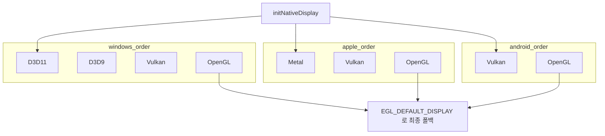
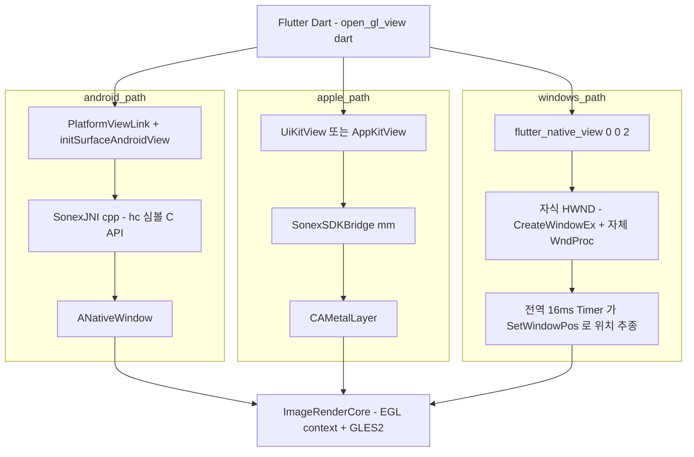

# sonex 렌더링 계층 실측 — OpenGL ES / ANGLE

> **근거**: `client/legacy/sonex-framework/sdk/sdk/ImageRenderer/` · `client/legacy/sonex-app/` · `client/legacy/moana`(`origin/service_QT693`) **코드 직접 읽기**(2026-07-28).
> **[sonex-app.md §2](../sonex-app.md) 를 여는 문서다** — 거기서 `ImageRenderer (OpenGL/EGL) 38,501` 한 줄로 적은 것의 내부다.
> **표기**: 경로·심볼·수치·MD5 는 전부 코드 확인. 확인 못 한 것은 §12 에 모았다.

## 1. 결론

**"sonex SDK 가 OpenGL 을 쓴다"는 사실이다. 다만 정확히는 — 전 플랫폼에서 ANGLE 을 통해 OpenGL ES 2.0 을 쓴다.** iOS·macOS 도 Metal 을 직접 쓰지 않고 ANGLE Metal 백엔드를 거치며, Android 도 네이티브 GLES 우선·ANGLE 폴백이다. 즉 **GL 은 이 SDK 의 이식성 전략 그 자체**다.

| 관측 | 판정 |
|---|---|
| 렌더러가 SDK 안에 있고 앱은 창 핸들만 넘긴다 | **살릴 자산.** 앱 4종 어디서나 같은 픽셀이 나온다 |
| GL 표면은 하나인데 **Flutter 와 붙는 방식이 플랫폼마다 4가지** (§4) | 리팩토링 표면 1순위 |
| 렌더 스레드 계약(`useAppThread`)이 호출처마다 다르고 `startRender()` 는 빈 stub (§5) | **계약이 코드로 표현되지 않는다** |
| `moana` 와 `sonex` 의 스캔변환이 **서로 다른 수학**이다 (§6) | 병행 2계열이 화질까지 갈라져 있다 |
| 렌더러 공개 헤더가 **4벌**이고 이미 표류했다 (§7.1) | HC 프로토콜 7벌([protocol-device.md](../protocol-device.md))과 같은 패턴 |
| macOS 빌드가 `measure/` 7,099 LOC 를 **통째로 빠뜨린다** (§10.1) | 타깃별 빌드 정의가 손으로 유지된다 |
| 셰이더 소스가 C++ 문자열 리터럴이고 `.glsl` 12개는 죽은 사본 (§7.2) | |
| SDK 렌더러가 매 터치마다 `c:\Users\Rio\work\...\press.log` 를 연다 (§10.2) | **출하 코드의 하드코딩 절대경로** |

## 2. 38,501 LOC 의 구성

| 구획 | LOC | 내용 |
|---|---:|---|
| `shared/HCImageRenderCore.cpp` | **7,679** | 렌더 코어. EGL·GL·스레드·터치·측정·듀얼·cine 전부 한 파일 |
| `shared/HCImageRenderCore.h` | 842 | |
| `shared/objects/` | **8,141** | 렌더 객체 **16종** — `ScanBConvex`·`ScanCFLinear`·`ScanSpectrum`·`ScanSideRuler`·`ScanPwCursor`·`RenderShapeText` 등 |
| `shared/measure/` | **7,099** | 측정 **13종** — Angle·Depth·Distance·Ellipse·FetalBiometry·Heartrate·Length·Tag·Time·Velocity·VelocityDiff·Volume·BVF |
| `shared/HCImageRenderer.cpp`+`.h` | 1,324 | 외부 공개 래퍼(dllexport) |
| `shared/HCFontLoader` + `HCTouchRecognizer` | 823 | FreeType 글리프 · 터치 상태머신 |
| `shared/shader/` | 527 | `GlslShader` + 셰이더 클래스 **7종**(+ 죽은 `.glsl` 12파일 126줄, §7.2) |
| `ios/HCiOSGLContext.mm`+`.h` | 586 | **빌드에서 제외된 죽은 코드**(§7.3) |
| `windows/` + `android/` | 101 | DLL 진입점·pch 뿐 |
| **자체 소스 소계** | **27,122** | |
| `shared/glad/` | **11,379** | GLAD 생성 로더(GL ES 2.0 + EGL). 손으로 쓴 코드 아님 |
| **합계** | **38,501** | [sonex-app.md §2](../sonex-app.md) 의 수치와 일치 |

**`HCImageRenderCore.cpp` 는 god object 다.** EGL 초기화, GL 컨텍스트 관리, 렌더 스레드, 텍스처 업로드, 좌표 변환, 터치 히트테스트, 측정 객체 수명, 듀얼 스캔, cine 스냅샷, 성능 계측, 심지어 휴지통 아이콘 드래그까지 한 클래스에 있다. 그 중 **1,046줄(13.6%)이 `cine`/`dual` 을 언급**한다(§9).

## 3. GL 스택 — ANGLE 로 전 플랫폼 통일, ES 2.0 고정

`prepareRenderResources()` 의 주석이 전략을 그대로 말한다.

```
// ⚠️ CRITICAL FIX: iOS도 ANGLE을 사용해야 함!
// 과거 성공 사례 분석 결과: iOS에서도 ANGLE Metal Renderer 사용
// Native EAGL 방식은 프레임워크와 앱 사이의 context 분리 문제 발생
```

### 3.1 백엔드 선택 — 플랫폼별 우선순위 목록을 순회한다

`initNativeDisplay()` 가 `EGL_PLATFORM_ANGLE_TYPE_ANGLE` 로 백엔드를 차례로 시도하고 첫 성공을 쓴다.



라이브러리 로딩도 갈린다 — Windows 는 `LoadLibrary("libEGL.dll")`, Android 는 `dlopen("libEGL.so")` 실패 시 `libEGL_angle.so` 폴백, iOS·macOS 는 **ANGLE 이 `-force_load` 로 정적 링크**돼 있어 `hinstEgl = (void*)0x1` 더미 핸들을 넣고 `dlsym(RTLD_DEFAULT, ...)` 로 찾는다.

> **코드 주석과 빌드 설정이 어긋난다.** `initEGL()` 은 "Android 는 native EGL 사용. ANGLE 은 Windows 전용" 이라 적었으나, `sonex-app/android/app/CMakeLists.txt` 는 `libEGL_angle.so`·`libGLESv2_angle.so` 를 시스템 `EGL`·`GLESv2` 와 **함께** 링크한다. 실제로 어느 쪽이 잡히는지는 런타임 `dlopen` 순서가 정하며 코드만으로 확정할 수 없다.

### 3.2 ES 2.0 에 고정돼 있다

`EGL_CONTEXT_CLIENT_VERSION=2` · `EGL_RENDERABLE_TYPE=EGL_OPENGL_ES2_BIT` 이고, 셰이더는 전부 GLSL ES 1.00(`attribute`/`varying`/`gl_FragColor`)이다. 그래서 NPOT 텍스처 미지원 환경을 위한 **2의 거듭제곱 패딩 경로**(`getPotSize`·`convertToNpotTexture`)가 지금도 살아 있다.

사용 API 는 GL 함수 **51종** · EGL 함수 **22종**이다. VAO·인스턴싱·FBO MRT 같은 ES3 기능은 쓰지 않는다.

### 3.3 EGL config 선택 — 우연히 동작하는 코드

`initEGL()` 의 config 필터에 세 가지가 겹쳐 있다.

| 코드 | 문제 |
|---|---|
| `configAttr` 에 depth·stencil 을 **요청하지 않는데** 필터는 `if (d < 16 \|\| s < 8) continue;` 로 **요구**한다 | 요청과 검증이 어긋난다 |
| `if ((st & EGL_OPENGL_ES2_BIT) == 0) continue;` — `st` 는 `EGL_SURFACE_TYPE` 인데 **렌더러블 타입 상수**와 비트 AND | 상수 오용 |
| MSAA 4x 를 최선으로 고르지만 `configAttr` 에 `EGL_SAMPLE_BUFFERS`/`EGL_SAMPLES` 가 없다(주석 처리됨) | 요청하지 않은 것을 고른다 |

두 번째는 **`EGL_WINDOW_BIT == EGL_OPENGL_ES2_BIT == 0x0004`** 라서 결과적으로 의도(`window bit` 검사)와 같은 동작을 한다. 즉 **주석이 말하는 동작을 하고 있으나, 그것은 상수값이 우연히 같기 때문**이다. 두 상수 중 하나라도 다른 EGL 헤더를 쓰면 조용히 깨진다.

## 4. Flutter ↔ GL 경계가 플랫폼마다 4가지다

렌더러는 `hc_PrepareRenderer(nativeWindow, useAppThread, streamIndex)` 하나만 요구한다. 그런데 그 `nativeWindow` 를 만들어 넘기는 방식이 타깃마다 전부 다르다.



**Windows 가 이질적이다.** `lib/modules/scan/native_view_controller.dart` **901줄**이 하는 일:

- `CreateWindowEx` 로 컨테이너 HWND + 자식 렌더 HWND 를 직접 만들고 **자체 `WndProc` 2개**를 등록한다
- **미문서화 API `SetWindowCompositionAttribute`** 로 합성 속성을 건드린다
- `DwmSetWindowAttribute(DWMWA_TRANSITIONS_FORCEDISABLED)` 로 DWM 전환 애니메이션을 끈다
- `WS_EX_TOOLWINDOW` 로 작업표시줄에서 숨긴다
- **static 16ms `Timer.periodic` 하나**가 등록된 모든 컨테이너에 `SetWindowPos` 를 걸어 Flutter 위젯 위치를 따라다닌다

이 구조가 실제로 낸 비용이 주석에 남아 있다 — z-order race, DWM 깜박거림, `0x0` 크기 HWND 생성 시 크래시, 듀얼 진입 시 컨트롤러 재등록 누락으로 인한 **우측 검은 화면**. 주석은 "controller 마다 자체 16ms Timer 를 두었더니 두 프레임에 걸쳐 redraw 되어 깜박였다 → 전역 단일 Timer 로 합쳤다" 는 수정 이력까지 담고 있다.

> 즉 **Flutter 의 airspace 문제를 Win32 로 직접 푸는 코드**이며, 이 경로 전체가 GL 렌더러 자체와는 무관한 부수 복잡도다.

## 5. 렌더 루프 — 계약이 코드로 표현되지 않는다

`ImageRenderCore::initialize(nativeWindow, useAppThread)` 의 분기:

| `useAppThread` | 동작 | 그리기 주체 |
|---|---|---|
| `false` | `worker()` 스레드 생성. 스레드가 `drawFrame()` 루프 + `renderCv.wait_for(16ms)` | **SDK** |
| `true` | `prepareRenderResources()` 만 호출. **스레드 없음** | **호출자가 `hc_DrawFrame` 을 펌프해야 함** |

여기서 세 가지가 동시에 관측된다.

1. **같은 앱이 같은 렌더러에 서로 다른 값을 넘긴다.**
   - `native_view_controller.dart:362` → `imageRendererPrepare(hwnd, **true**, 0)` (스캔 화면)
   - `review_sdk_measurement_coordinator.dart:88` · `scan_right_panels.dart:2082` → `(hwnd, **false**, streamIndex)` (리뷰·secondary)
2. **Dart 어디에도 `drawFrame` 을 펌프하는 코드가 없다.** `NativeMethods.drawFrame` 은 선언만 있고 호출처가 0건이다.
3. **`startRender()`·`stopRender()` 는 빈 stub 이다** — `ImageRenderCore::start()` 본문이 `// TODO: start render` 뿐이고 `SUCCESS` 를 반환한다. 공개 API 가 아무것도 하지 않는다.

그리고 `ImageRenderer::prepareRender()` 는 `renderCore != nullptr` 이면 인자를 **무시하고** `ALREADY_INITIALIZED` 를 돌려준다. 따라서 **실제 스레딩 모델은 "어느 호출이 먼저 도달했는가"가 정한다.** 정적 분석으로 확정할 수 없다.

iOS 도 같은 문제가 있다. `iOS_RENDERING_SETUP.md` 는 "**CADisplayLink**: 20fps 렌더링 루프" 라고 적고 기대 로그까지 제시하지만, **`ios/`·`macos/` 전체에 `CADisplayLink` 심볼이 0건**이다. 실제로는 `SonexSDKBridge.mm:365` 의 **스캔 스트림 콜백**이 `hc_DrawFrame(0)` 을 부른다 — 디스플레이 구동이 아니라 데이터 구동이다. 문서가 코드를 따라오지 못했다.

> 렌더 스레드 자체는 잘 다듬어져 있다. `renderCv` 이벤트 기반 wakeup(polling sleep 의 위상 spike 제거), Windows `eglSwapInterval(0)`(vsync 대기가 파이프라인 적체를 초 단위로 키운 실측 기록), `glFinish` 금지 주석 등 **실측 기반 튜닝의 흔적이 뚜렷하다**. 문제는 루프가 아니라 **누가 루프를 소유하는지가 정의돼 있지 않다**는 것이다.

## 6. 스캔 변환 — moana 와 sonex 가 서로 다른 수학이다

초음파 렌더링의 본체는 극좌표(scanline × sample)를 화면 직교좌표로 펴는 **스캔 변환**이다. 두 앱이 이것을 다르게 한다.

| | `moana` (Qt) | `sonex` (SDK) |
|---|---|---|
| 셰이더 언어 | `#version 300 es` (ES 3.0) + Desktop GLSL 별도 벌 | GLSL ES 1.00 (ES 2.0) |
| 셰이더 전달 | Qt 리소스 `.frag`/`.vert` **파일** 12개 | **C++ 문자열 리터럴**(§7.2) |
| 텍스처 좌표 | `in vec3 v_texCoord` → `v_texCoord.x / v_texCoord.z` — **투영 텍스처링** | `attribute vec2 a_texCoord` — **어파인 보간** |
| 부채꼴 근사 | 프래그먼트마다 정확 | **128 세그먼트 메시**로 근사 |
| 렌더 대상 | `QQuickFramebufferObject` (Qt Scene Graph 합성) | EGL window surface 직접 |
| 코드량 | `GLFrameView.cpp` 2,046 + `GLFrameViewPWM.cpp` 2,246 (+헤더) ≈ **5,275** | **38,501** |

`sonex` 쪽 근사의 대가가 코드에 그대로 적혀 있다.

```cpp
// HCScanBConvex.cpp
// Moana 기준 arc 세그먼트 수 (128 scanline = 128 세그먼트)
// 기존 1°간격(90개)에서 scanline 간격(128개)으로 증가 → 텍스처 왜곡 감소
static const int ARC_SEGMENT_COUNT = 128;
```

즉 **어파인 보간에서 생기는 왜곡을 세그먼트 수를 늘려 상쇄하고 있다.** `moana` 는 투영 텍스처링이라 세그먼트 수와 무관하게 정확하다. 두 계열이 병행 유지되는 한 **같은 장비의 같은 프레임이 앱에 따라 다른 픽셀로 나온다.** 의료 영상에서 이것은 기능 차이가 아니라 **판독 대상의 차이**다.

> **주의**: 이 절은 두 구현의 **수학적 성질**을 코드로 대조한 것이다. 실제 화면 차이의 크기(육안 식별 가능 여부)는 측정하지 않았다 — §12.

## 7. 중복과 표류

### 7.1 렌더러 공개 헤더가 4벌이고 이미 어긋났다

| 사본 | 파일 수 | 용도 |
|---|---:|---|
| `sonex-framework/sdk/sdk/ImageRenderer/shared/` | — | **구현과 같은 자리. 사실상 SOT** |
| `sonex-framework/sdk/include/` | 120 | "공개 API". SDK `Main` 모듈이 이것을 본다 |
| `sonex-app/android/app/include/` | 180 | 앱 저장소 안 사본 |
| `sonex-framework/.../sample/SDK_Sample_Android/app/include/` | 222 | 샘플 안 사본 |

MD5 대조 결과 **이미 표류했다.**

| 헤더 | `shared` vs `include` | `shared` vs 앱 사본 |
|---|---:|---:|
| `HCImageRenderer.h` | 동일 | **128줄 차이** |
| `HCImageRenderCore.h` | **50줄 차이** | **599줄 차이** |
| `HCFontLoader.h` | 동일 | 차이 있음 |
| `objects/HCRenderObject.h` | **14줄 차이** | (없음) |

내용이 문제다.

- **`include/HCImageRenderCore.h` 에는 멤버가 빠져 있다** — `renderCv`·`renderWakeMutex`·`renderWakeup`(이벤트 wakeup), `cfRoiRollingBuffer` 일습, `pendingPwCursorRecenter`, 성능 계측 멤버 10개, `exportMeasurements`/`importMeasurements`. 즉 **같은 클래스의 `sizeof` 가 두 벌 다르다.**
- **`include/objects/HCRenderObject.h` 는 레이아웃과 vtable 이 다르다** — `needsReset`·`linkedObject`·`measureTypeTag` 3개 멤버 누락, `virtual onLinkedObjectChanged()` 누락, `std::recursive_mutex` 가 `std::mutex` 로 되어 있다.

그리고 **빌드가 이 사본을 먼저 본다.** macOS `CMakeLists.txt` 와 Windows `Main` 프로젝트 모두 include 경로 순서가 `include/` → `ImageRenderer/shared/` 이고, `Main/shared/HCSonexSDKInterface.cpp` 는 `#include "HCImageRenderCore.h"` 를 한다. macOS 는 `Main` 과 `ImageRenderer` 가 **한 바이너리(SonexSDK.framework)** 로 링크되므로, **한 링크 단위 안에 레이아웃이 다른 같은 클래스 정의가 둘 존재**한다(ODR 위반).

> **적대적 검증 결과 — 오늘 당장 깨지지는 않는다.** `Main` 은 `ImageRenderCore` 의 멤버를 직접 만지지 않고 dllexport 된 `ImageRenderer` 래퍼를 통해서만 접근한다(코드 주석도 "ImageRenderCore 는 dllexport 안 되어 있어 외부에서 직접 호출 불가" 라고 명시). 따라서 현재는 **잠재 결함**이다. 다만 `ImageRenderCore` 에는 `holdBFrameUpdate`·`getReverse`·`getCoordinates` 등 **헤더에 인라인 정의된 멤버 접근자**가 있어, `Main` 쪽에서 하나만 호출하면 그 순간 잘못된 오프셋에 읽고 쓴다. 지금 이것을 막는 것은 **컴파일러가 아니라 관행**이다.

### 7.2 셰이더가 두 군데 있고, 실제로 쓰이는 쪽은 파일이 아니다

- **실제 사용**: `shader/HC*Shader.h` **7개** 클래스가 GLSL 을 **C++ 문자열 리터럴**로 들고 `loadShader()` 에서 컴파일한다. 백슬래시 줄이음(`\`)으로 이어붙인 형태라 **컴파일 오류 줄번호가 무의미**하다.
- **죽은 사본 1**: `shader/*.glsl` **12파일 126줄**. 코드 전체에서 `.glsl` 문자열 참조가 **0건**이다.
- **죽은 사본 2**: `sonex-app/shader/` **12파일**. SDK 사본과 MD5 대조 시 **10개 완전 동일, 2개(`cf_fs`·`pd_fs`)는 후행 공백만 차이**. `pubspec.yaml` 의 `assets:` 에 없고 Dart 참조도 0건이다. 이력상 2025-05-23 "Add new source files more from Macbook" 으로 복사되고, 이후 손댄 것은 줄바꿈 정규화 커밋 하나뿐이다.

셰이더 클래스 7개 중 **`ColorDopplerShader`·`PowerDopplerShader` 는 어디에서도 인스턴스화되지 않는다.** `prepareShader()` 가 만드는 것은 `Grayscale`·`ColoredImage`·`Tint`·`Shape` **4개**뿐이고, `SHADER_TYPE_*` enum 도 그 4개만 정의한다. 컬러 도플러는 CPU 쪽에서 색을 입힌 뒤 `COLORED_IMAGE` 로 그린다.

### 7.3 iOS 네이티브 컨텍스트 528줄이 빌드에서 제외돼 있다

`ios/HCiOSGLContext.mm`(528줄, EAGL 기반)은 `Main/ios/CMakeLists.txt` 에서 **주석 처리**돼 있다.

```cmake
# iOS 특화 ImageRenderer - HCiOSGLContext는 ANGLE 사용 시 불필요 (2024.03 성공 버전)
# if(EXISTS ${SDK_ROOT}/ImageRenderer/ios/HCiOSGLContext.mm)
#     target_sources(SonexSDK PRIVATE ${SDK_ROOT}/ImageRenderer/ios/HCiOSGLContext.mm)
```

같은 CMake 가 존재하지 않는 파일(`shared/HCRenderTestHelper.cpp`)을 `list(REMOVE_ITEM ...)` 으로 빼기도 한다 — 소스 목록이 실제 트리와 동기화돼 있지 않다.

## 8. 프레임 경로의 비용

### 8.1 매 프레임 텍스처를 재할당한다

`RenderObject::updateTexture()` 는 프레임마다 `glTexImage2D` 를 부른다 — `glTexSubImage2D` 가 아니라 **스토리지 재할당**이다. 앞뒤로 `glTexParameteri` 4회와 `glGetError()` 가 붙는다. 렌더러 전체에서 `glTexImage2D` **10곳**, `glGetError()` **47곳**이다.

`glGetError()` 는 파이프라인을 동기화시킬 수 있는 호출이라 실시간 경로에 프레임당 수십 번 들어가는 것은 정상 설계가 아니다. 다만 ANGLE 백엔드에서의 실제 비용은 측정하지 않았다(§12).

### 8.2 듀얼/cine 을 위해 프레임을 여러 벌 복사한다

CF 프레임 하나가 도착할 때 일어나는 일:

| 복사 | 대상 | 보관량 |
|---|---|---|
| `renderScanCF->updateTexture()` | GPU 텍스처 | 1 |
| `memcpy(cachedCfData, raw, ...)` | 최신 1프레임 캐시 | 1 |
| `cfRollingBuffer.push_back(mf)`(`vector::assign`) | 롤링 버퍼 | **최대 150** |
| `cfRoiRollingBuffer.push_back` | ROI 좌표 | 최대 150 |
| `cursorRollingBuffer.push_back` | 커서 좌표 | 최대 150 |

Spectrum 도 같은 구조(`specRollingBuffer`)를 갖고, 듀얼 진입 시엔 여기에 **`cineSnapshot`(B+CF+Spectrum raw 전량 복사)** 와 **`cfFrozenBuffer`(롤링 버퍼 전체 deep copy)** 가 더해진다. 좌·우 독립 cine 을 위해 `cineSnapshotRight` 까지 별도로 둔다.

`kMaxRollingFrames = 150` 이므로 프레임 크기에 따라 **수백 MB 급 상주 메모리**가 될 수 있다. 실측하지 않았다(§12).

## 9. 최근 6주에 증식한 부분이 곧 듀얼/cine 이다

`HCImageRenderCore.cpp` 의 크기 이력이다.

| 시점 | LOC |
|---|---:|
| 2023-07-21 | 595 |
| 2024-07-08 | 1,169 |
| 2025-12-24 | 2,612 |
| 2026-04-29 | 4,573 |
| **2026-06-15 (HEAD)** | **7,679** |

**2026-04-29 → 06-15, 6주 반에 +68%(3,106줄)** 다. 그 구간의 주제는 전부 듀얼 스캔과 cine freeze 이고, 파일 안에서 `cine`/`dual` 을 언급하는 줄이 **1,046줄**이다.

이 코드는 **날짜가 박힌 지시 주석**으로 층층이 쌓여 있다. `ImageRenderer/` 안에 `전하 분부` 표기가 **213건**, 날짜는 `2026-05-13`부터 `2026-06-15`까지 **11개**다. 전형적인 형태:

```cpp
// 전하 분부 (2026-05-28 진단 우회) — 듀얼 진입 시점에 cfRollingBuffer 전체 deep copy.
//   drawFrame 좌측 CF 분기가 cineSnapshot.rawCf 대신 이걸 사용 → 매칭 흐름 우회.
```

`진단 우회`·`정통 v4`·`본질 (A)`·`v5 본질 fix` 같은 표기가 반복되는데, 이는 **같은 증상을 여러 차례 다른 방식으로 덮은 흔적**이다. 그 결과 좌/우 cine 상태가 `cineSnapshot`·`cineSnapshotRight`·`cfRollingBuffer`·`cfFrozenBuffer`·`pendingCine*`(6쌍) 등 **서로 다른 뮤텍스로 보호되는 12개 이상의 컨테이너**로 흩어져 있다.

> 두 저장소의 `CLAUDE.md` 는 응답에 "전하" 호칭을 요구하는 AI 코딩 에이전트 설정이다. 즉 이 증식 구간은 **AI 보조로 빠르게 기능을 붙인 구간**이며, 속도는 얻었으나 **구조를 정리하는 단계가 빠져 있다**. 이것은 리팩토링 논의의 직접 근거다 — 대상이 정지한 코드가 아니라 **지금 가장 빠르게 자라는 코드**다.

## 10. 빌드 정의가 타깃마다 손으로 유지된다

### 10.1 macOS 빌드가 `measure/` 7,099 LOC 를 통째로 빠뜨린다

| 빌드 | `ImageRenderer/shared/measure/*.cpp` |
|---|---|
| iOS `Main/ios/CMakeLists.txt` | `RENDER_MEASURE_SOURCES` 로 **포함** |
| macOS `Main/macos/CMakeLists.txt` | **없음** |

그런데 `HCImageRenderCore.cpp` 는 measure 헤더 **13개를 include** 하고 `new MeasurementAngle(...)`·`new MeasurementLength(...)` 등으로 **직접 생성**한다. 인라인이 아닌 심볼이므로 링크가 성립하지 않는다.

**커밋된 macOS 빌드 캐시가 이를 뒷받침한다** — `Main/macos/build/CMakeFiles/SonexSDK.dir/build.make` 의 오브젝트 목록에 `objects/` 285건, `glad/` 38건, `shader/` 19건이 있으나 **`measure/` 는 0건**이다.

### 10.2 출하 렌더러에 개발자 머신 절대경로가 박혀 있다

`HCImageRenderCore.cpp` 의 `onPressed`·`onReleased` 안(`#ifdef _WIN32`, 주석 아님):

```cpp
FILE* _diagF = nullptr;
fopen_s(&_diagF, "c:\\Users\\Rio\\work\\sonex-app\\log\\press.log", "a");
```

**모든 사용자의 모든 터치마다** 존재하지 않는 경로에 append 를 시도한다. `native_view_controller.dart` 도 로그 경로를 `C:\work\flutter\sonex-app\log` 로 하드코딩한다. Android 빌드는 한 술 더 떠 `CMakeLists.txt` 가 SDK 바이너리를 `/Users/rio/work/sonex-framework/sdk/_out/android/${ANDROID_ABI}` 에서 링크한다 — **한 대의 맥에서만 빌드된다.** ([sonex-app.md §6](../sonex-app.md) 의 "재현 불가능" 판정이 렌더 경로에서도 동일하게 확인된다.)

### 10.3 iOS 는 Xcode GUI 수작업 7단계가 필요하다

`iOS_RENDERING_SETUP.md` 가 요구하는 것 — 파일 4개를 Xcode 프로젝트에 수동 추가, 프레임워크 4개를 "Embed & Sign" 으로 설정, Framework/Header Search Paths 추가, C++ Dialect 지정, Bitcode 끄기, `-ObjC -lc++` 링커 플래그 추가. **빌드 스크립트가 아니라 체크리스트**다.

## 11. HLAB-2487 함의

| 관측 | 리팩토링 함의 |
|---|---|
| 렌더러가 SDK 안에 있고 앱 4종이 공유 (§1) | **경계 위치 자체는 옳다.** 픽셀 로직을 앱으로 끌어내는 방향은 오히려 후퇴다 |
| **경계 단위가 "OS 창" 이다** — 그래서 GL 경계가 플랫폼마다 4가지 (§4) | **가장 효과 큰 단일 변경.** 참조 구조가 있다 — `flutter-webrtc` 는 같은 문제(네이티브 C++ SDK 가 실시간 프레임 생산 → Flutter UI)를 **텍스처 핸드오프**로 푼다. 목표 형태 = [../../refactoring/architecture.md §4.5](../../refactoring/architecture.md) |
| **듀얼 스캔이 C++ 안에 있고, 그것도 2중 구현이다** (§9) | 창을 넘기니 Flutter 가 위젯 두 개를 못 놓는다. 텍스처면 `Row([Texture(0), Texture(1)])` 다. `imageRendererSecondary`(별도 렌더러+별도 HWND)와 `setDualMode`(내부 viewport 분할)가 **공존하고 앱이 둘 다 호출**한다 |
| **같은 앱이 MP4 는 이미 텍스처로 그린다** | `video_player`·`video_player_win`(`scan_right_panels.dart:722` `WinVideoPlayer`)은 Texture 위젯 기반이다. 스캔 영상만 네이티브 창이며, 스캔 쪽 텍스처 경로는 전 플랫폼 코드에서 **0건**(`Texture(`·`TextureRegistrar`·`registerTexture`·`SurfaceTexture`·`CVPixelBuffer`·`GpuSurface`). **되살릴 시도도 있었다** — `pubspec.yaml` 의 주석 처리된 `flutter_sonex_sdk` |
| `useAppThread` 계약이 호출처마다 다르고 `startRender()` 는 stub (§5) | 소유권을 API 로 강제해야 한다. 지금은 **호출 순서가 동작을 정한다** |
| 헤더 4벌이 이미 표류, ODR 위반이 잠재 (§7.1) | HC 프로토콜 정본화([protocol-device.md](../protocol-device.md))와 **완전히 같은 문제**다. 정본 1벌 + 생성/설치 규칙으로 풀린다. 프로토콜에서 이미 실증한 방법이 그대로 적용된다 |
| macOS 빌드가 소스 7,099 LOC 누락 (§10.1) | **타깃별 빌드 정의를 손으로 유지하는 구조가 이미 실패했다.** 단일 빌드 정의(CMake 일원화)가 필요조건 |
| 렌더러 6주 +68%, 지시 주석 213건 (§9) | 착수 시점 판단의 근거. [sonex-app.md §10](../sonex-app.md) 의 "구 계층이 자란다" 가 **SDK 쪽에서도 동일**하게 관측된다 |
| moana 와 sonex 의 스캔변환 수학이 다름 (§6) | 판단 대기 1번(병행 유지 여부)에 **화질 동등성**이라는 축이 추가된다. 병행 유지를 택하면 두 벌의 화질을 각각 검증해야 한다 |
| 출하 코드의 하드코딩 절대경로·GUI 수작업 빌드 (§10.2·10.3) | 의료기기 규제(판단 대기 5번) 관점의 즉시 지적 사항 |
| 죽은 코드 — `.glsl` 24파일 · `HCiOSGLContext` 528줄 · 도플러 셰이더 2종 (§7) | 저비용·저위험 착수 지점. 삭제만으로 표면이 줄어든다 |

## 12. 미확인

- **`useAppThread` 의 런타임 실제 값** — 호출 순서 의존이라 코드만으로 확정 불가. 실행 로그가 필요하다(§5)
- **§6 의 화질 차이 크기** — 어파인 128세그먼트 대 투영 텍스처링의 성질 차이는 확정했으나, 실제 화면에서 육안 식별 가능한 수준인지는 렌더링 비교를 하지 않았다
- **`glGetError()` 47회·매 프레임 `glTexImage2D` 의 실제 비용** — ANGLE 백엔드별 프로파일을 뜨지 않았다
- **`kMaxRollingFrames=150` × 버퍼 5종의 실제 상주 메모리** — 프레임 크기(모델·depth 의존)를 대입하지 않았다
- **macOS 빌드가 현재 실제로 링크되는지** — 커밋된 빌드 캐시는 `measure/` 없는 상태의 스냅샷이다. HEAD 의 CMakeLists 로 빌드를 시도하지 않았다(빌드 환경 없음)
- **Android 의 EGL 이 시스템 드라이버인지 ANGLE 인지** — 코드는 폴백, CMake 는 양쪽 링크. 런타임 `glGetString(GL_VENDOR)` 로그가 필요하다(§3.1)
- **`include/` 사본의 생성 절차** — 손복사인지 스크립트인지 확인하지 못했다. 스크립트가 있다면 표류의 원인이 다르다
