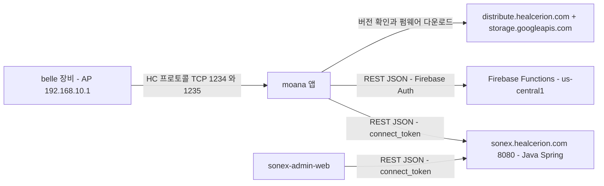

# 클라이언트 ↔ 클라우드 프로토콜

> **근거**: `moana` `origin/service_QT693:framework/Network/*` · `sonex-cloud-backend` 컨트롤러 · `sonon-cloud` `firebase.json` · `sonex-admin-web` `web-api.js` 직접 읽기(2026-07-28).
> **장비↔앱** 프로토콜은 [protocol-device.md](protocol-device.md) 를 본다.
> **인프라 구성**(모듈·DB·배포)은 [cloud-server.md](cloud-server.md) 를 본다.

## 0. 장비는 클라우드와 직접 통신하지 않는다

`belle-fw` 에 HTTP 클라이언트(`curl`·`libcurl`)가 없다. `modules/webserver/belle_flask` 는 **로컬 진단용 서버**이지 클라우드 클라이언트가 아니다.

**모든 클라우드 통신은 앱을 경유**한다. 장비 정보·펌웨어도 앱이 받아 장비에 넣는다.

## 1. 엔드포인트가 셋이다

| # | 베이스 URL | 백엔드 | 용도 |
|---|---|---|---|
| 1 | `http://sonex.healcerion.com:8080/API/` | `sonex-cloud-backend` (Java/Spring/MariaDB) | 계정·디바이스·배터리·이벤트 로그 |
| 2 | `https://us-central1-sharp-imprint-234606.cloudfunctions.net` | `sonon-cloud` (Firebase Functions) | Firebase 인증·사용자 프로필·로그 업로드 |
| 3 | `https://distribute.healcerion.com/sononx/{beta,release}` + `https://storage.googleapis.com/sonon-public-share/firmware-image/` | 정적 배포 | 앱 버전 확인 · **펌웨어 이미지 다운로드** |

출처 — `moana/framework/Network/SononCloudApi.cpp:28` · `SononCloud.cpp:9,10,1320` · `NetworkMonitoringThread.cpp:27`.

**전부 평문 HTTP 다** — 1번은 `http://`, 3번만 `https://`. `sonex-admin-web` 도 같은 `http://sonex.healcerion.com:8080/Admin/` 을 쓴다.

> 관리자 웹은 `/Admin/`, 모바일 앱은 `/API/` 로 **경로 접두어만 다르고 같은 서버**다.

## 2. 앱이 클라우드를 이중으로 쓴다

`moana/framework/Network/SononCloud.h` 의 `CmdType` — **같은 기능에 대해 서버별 커맨드가 따로 있다.**

| 기능 | Java 백엔드 | Firebase |
|---|---|---|
| 로그인 | `SIGN_IN_ONLINE` | **`SIGN_IN_FIREBASE`** |
| 프로필 조회 | `GET_USER_PROFILE` | **`GET_FIREBASE_USER_PROFILE`** |
| 인증메일 재발송 | `RESEND_VERIFY_EMAIL` | **`RESEND_VERIFY_EMAIL_FIREBASE`** |
| 비밀번호 재설정 | `SEND_PASSWORD_RESET_EMAIL` | **`SEND_PASSWORD_RESET_EMAIL_FIREBASE`** |

**계정 도메인이 두 시스템에 동시에 존재한다.** 어느 쪽이 정본인지는 코드로 판정되지 않는다(미확인).

## 3. `moana` 의 클라우드 커맨드 전수

`CSononCloud::CmdType` — 24개.

| 분류 | 커맨드 |
|---|---|
| 계정 | `SIGN_UP` · `SIGN_IN_ONLINE` · `SIGN_IN_FIREBASE` · `GET_USER_PROFILE` · `GET_FIREBASE_USER_PROFILE` · `UPDATE_USER` · `CHECK_ID_DUPLICATION` · `WITHDRAWAL` |
| 인증메일·비밀번호 | `RESEND_VERIFY_EMAIL` · `RESEND_VERIFY_EMAIL_FIREBASE` · `SEND_PASSWORD_RESET_EMAIL` · `SEND_PASSWORD_RESET_EMAIL_FIREBASE` |
| 디바이스 | `GET_DEVICE_MODEL` · `GET_DEVICE_LIST` · `REGISTER_DEVICE` · `UPDATE_DEVICE` |
| 배터리 | `GET_BATTERY_LIST` · `REGISTER_BATTERY` · `UPDATE_BATTERY` |
| 로그 | `UPLOAD_LOG` |
| 업데이트 | `CHECK_UPDATE_VERSION` · `UPDATE_SOFTWARE` · **`DOWNLOAD_FIRMWARE`** |

디바이스·배터리 계열이 `sonex-cloud-backend` 의 **모바일용 SDI 엔드포인트**(`GetDeviceModelList`·`RegistDevice`·`UpdateDevice`·`GetDeviceList`·`RegistBattery`·`UpdateBattery`·`GetBatteryList`)와 1:1 로 대응한다.

## 4. 파라미터 규약 (`SononCloudApi.h`)

JSON 본문의 키 이름이 상수로 고정돼 있다.

| 분류 | 키 |
|---|---|
| 인증 | `account_id` · `account_pw` · `cur_pw` · `new_pw` · **`connect_token`** · `oem_code`(기본값 `"HEAL"`) |
| 계정 | `name` · `email` · `contact` · `occupation` · `country` · `sign_up_key` · `verification` · `encrypt_key` · `account_state` |
| **디바이스** | `serial_no` · `device_ix` · `model_ix` · `model_name` · `wifi_ssid` · `wifi_pw` · `mac` · `ip` · **`ctrl_port`** · **`data_port`** · `firmware_version` · **`cv_license`** · `probe_id` |

**디바이스 파라미터가 장비 프로토콜과 직접 맞물린다** — `ctrl_port`·`data_port` 는 HC 프로토콜 포트(1234/1235)이고, `cv_license` 는 ContextVision 라이선스 키다. 서버 DB 컬럼과도 같은 이름이다([cloud-server.md §2.2](cloud-server.md)).

→ **HC 프로토콜의 포트를 바꾸면 앱 파라미터·서버 스키마·DB 가 함께 바뀐다.**

## 5. 인증

| 시스템 | 방식 |
|---|---|
| Java 백엔드 | **`connect_token`(16자)**. 로그인 응답으로 받아 이후 모든 요청 JSON 본문에 넣는다. 서버는 `sso.connect_info` 테이블(PK = `connect_token`)에서 조회 — [cloud-server.md §3](cloud-server.md) |
| Firebase | Firebase Authentication + custom claims |
| 비밀번호 | 웹은 `CryptoJS.SHA256` 로 클라이언트 해싱 후 전송. 앱 쪽 처리는 미확인 |

**토큰이 헤더가 아니라 본문 파라미터**다. 표준 `Authorization` 헤더를 쓰지 않는다.

## 6. 서버 API 인벤토리

### 6.1 Java 백엔드 — 핸들러 124개

관리자용(`/Admin/`)과 모바일용(`/API/`)이 컨트롤러 단위로 분리돼 있다.

| 모듈 | 관리자 | 모바일 |
|---|---:|---:|
| SSO (인증·계정·통계) | 35 | 18 |
| SDI (디바이스·배터리) | 32 | 12 |
| ELA (이벤트 로그) | 21 | 2 |
| Core | 4 | — |

전수 목록은 [cloud-server.md §2](cloud-server.md) 에 있다.

**모바일용 SDI**: `CheckServerModuleSDI` · `GetDeviceModelList` · `RegistDevice` · `UpdateDevice` · `DeleteDevice` · `GetDeviceCount` · `GetDeviceList` · `RegistBattery` · `UpdateBattery` · `DeleteBattery` · `GetBatteryCount` · `GetBatteryList`

**모바일용 SSO**: `CheckServerModuleSSO` · `InstantSignUp` · **`MigrationUser`** · `RemoveAccount` · `CheckDuplicateID` · `SignUp` · `Withdrawal` · `RetransmitAuthMail` · `ResendAuthMail` · `VerifyCloudSignUp` · `VerifySignUp` · `ForgotPassword` · `VerifyChangePassword` · `LogIn` · `LogOut` · `GetProfile` · `ChangeProfile` · `ChangePassword`

**모바일용 ELA**: `CheckServerModuleELA` · `AddEventLog`

각 모듈에 `CheckServerModule*` 헬스체크가 있다.

### 6.2 Firebase Functions — 17개

`getDate` · `signUp` · `signIn` · `verifyEmail` · `setSampleUser` · `rmUser` · `mkAdmin` · `uploadLog` · **`stolenDevices`** · `registerDevice` · `resendVerifyEmail` · `updateDevice` · `users` · `sendPasswordResetEmail` · `resetPassword` · `updateUser` · `refreshStatisticsCurrent`

**`stolenDevices`(도난 장비 조회)는 Firebase 에만 있다** — Java 백엔드에 대응 기능이 없다.

## 7. 로그 스키마

`SononCloud.h` 가 업로드 로그 종류를 상수로 정의한다 — `L_LOG_LOG_IN_LOCAL`·`L_LOG_LOG_IN_SERVER`·`L_LOG_DB_INFO`·`L_LOG_SETTINGS`·`L_LOG_DEVICE_DISCONNECT`·`L_LOG_DEVICE_STATUS`·`L_LOG_DEVICE_USAGE`·`L_LOG_DEVICE_PRESET`·`L_LOG_SNAPSHOT_SHARE`·**`L_LOG_PACS_UPLOAD`**(`numSnapshots`, `result`)·`L_LOG_WORKLIST_DOWNLOAD`·`L_LOG_BACKUP`·`L_LOG_IMPORT`.

헤더 주석에 수집 시점이 명시돼 있다 — 로그인 시 · 장비 연결 해제 시 · 사용자 액션 시.

**장비 사용량·프리셋·PACS 업로드 결과가 클라우드로 올라간다.** 개인정보·의료정보 관점에서 무엇이 수집되는지 확인이 필요하다.

## 8. 보안

| 항목 | 상태 |
|---|---|
| 전송 | Java 백엔드·관리자 웹 **평문 HTTP**. Firebase·배포 서버만 HTTPS |
| 인증 토큰 | 본문 파라미터로 전달(헤더 아님). 평문 HTTP 라 **네트워크에서 그대로 노출** |
| 비밀번호 | 클라이언트측 SHA256(웹). 솔트·스트레칭 확인 안 됨 |
| 펌웨어 배포 | `storage.googleapis.com` 에서 다운로드. **서명 검증 여부 미확인** |
| 커밋된 비밀정보 | MariaDB root 비밀번호 5개 파일 · GCP 서비스 계정 개인키 — [belle-gaps.md §8](belle-gaps.md) |

**평문 HTTP + 본문 토큰** 조합은 세션 탈취에 그대로 노출된다. 의료 데이터·환자 정보가 오가는 경로이므로 규제 검토 항목이다.

## 9. HLAB-2487 함의

| 관측 | 함의 |
|---|---|
| 엔드포인트 3개, 앱이 전부에 붙음(§1) | 클라이언트가 3개 백엔드를 동시에 상대한다. 통합 시 어느 쪽으로 모을지가 핵심 결정 |
| 계정 도메인 이중화(§2) | `SIGN_IN_ONLINE` / `SIGN_IN_FIREBASE` 가 공존한다. **정본 확정이 선행돼야 한다** |
| 디바이스 파라미터가 프로토콜과 결합(§4) | HC 프로토콜 변경이 앱·서버·DB 로 파급된다 |
| 평문 HTTP + 본문 토큰(§8) | 표준 방식(HTTPS + `Authorization` 헤더)으로 옮기는 것이 명확한 개선 |
| Java 백엔드가 사실상 정지 | 커밋 16개(2022-09·2025-05). **belle 의 클라우드 연동을 어디에 둘지 결정 필요** |
| `stolenDevices` 가 Firebase 에만 | 기능이 백엔드별로 갈라져 있어 단순 이전이 불가능하다 |

## 10. 미확인

- 계정 정본이 Java 인지 Firebase 인지 — 두 시스템이 어떻게 동기화되는지
- 앱이 어느 조건에서 어느 백엔드를 고르는지 (런타임 분기인지 빌드 분기인지)
- 펌웨어 이미지 서명 검증 여부
- `sonex-app`(Flutter)의 클라우드 경로 — `HCNetworkProcess` 가 같은 3개 엔드포인트를 쓰는지 미대조
- 업로드 로그에 환자 식별 정보가 포함되는지
