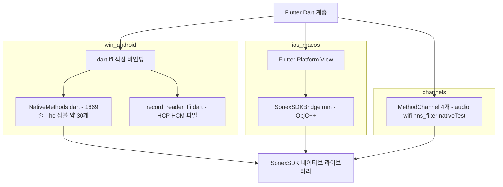

# mobile 그룹 — sonex 코드베이스 실측

> **근거**: `client/legacy/sonex-app`·`client/legacy/sonex-framework` **코드 직접 읽기**(2026-07-27).
> **[sonex-architecture.md](sonex-architecture.md) 와의 관계**: 그 문서는 **힐세리온이 쓴 문서(`CLAUDE.md`·`docs/`)가 주장하는 것**을 정리한다. 이 문서는 **코드가 실제로 어떤지**를 다룬다. 둘이 어긋나는 지점은 §3.3·§8 에 표시했다.
> **표기**: 인용한 경로·심볼·수치는 코드 확인. 확인 안 된 것은 "추정"·"증거 없음".

## 1. 2.0GB 의 정체 — 자체 소스는 0.3%

`sonex-framework` 2.0GB 의 구성이다.

| 버킷 | 크기 | 비중 | 내용 |
|---|---:|---:|---|
| 벤더 프리빌트 바이너리 `sdk/adk/library/` | **1,128MB** | 55% | OpenCV 3.4.5/3.4.6 · DCMTK 3.6.5 · FFmpeg 4.0.2/4.1.4 · cpr · curl · openssl · minizip · wxsqlite3 |
| `.git` 오브젝트 DB | 525MB | 26% | 위 바이너리들의 521커밋치 전 버전 |
| 샘플 앱 안에 중복된 바이너리 | ~144MB | 7% | Android `jniLibs` 99MB + iOS `Frameworks` 15MB + SDK 샘플 30MB |
| 상용 라이브러리 `third_party/context_vision/` | 82MB | 4% | ContextVision CVIE (android `.so`·iOS `.framework`·windows `.dll`) |
| **커밋된 빌드 캐시** `sdk/sdk/Main/macos/build/` | 27MB | 1.3% | `.o`·`CMakeCache.txt` **194파일 추적 중** |
| AI 모델 가중치 | 14MB | 0.7% | §8 |
| **자체 소스 전체** | **~7MB** | **0.3%** | ~240,900 LOC |

**`.gitignore` 가 무효다** — `/sdk/adk/library/` 규칙이 있으나 파일이 이미 추적된 뒤에 추가돼 소급되지 않는다. 실측: `git ls-files sdk/adk/library` = 2,600 파일 = 디스크 파일 전량.

최대 단일 파일은 `opencv_world345d.dll` 118.5MB, 다음이 `libopencv_dnn.a` 89.0MB, `libavcodec.a` 80.8MB 다.

`sonex-app` 510MB 도 같은 성격이다 — `android/app/src/main/jniLibs/arm64-v8a/` 에 **`.so` 39개 103MB** 가 커밋돼 있다(`libopencv_java4.so` 20.2MB, `libcvie64.so` 12.0MB 포함).

**테스트 데이터·샘플 이미지는 0바이트다** — 벤더 디렉토리 밖에서 `*.png/.jpg/.dcm/.bmp/.raw` 검색 결과 없음. 즉 용량은 전부 **의존성과 빌드 산출물**이다.

## 2. 계층의 디스크상 실제 배치

`sdk/` 아래에 `adk/`·`sdk/`(중첩)·`ai_models/`·`common/`·`include/`·`third_party/` 가 있다. SDK 계층 경로가 **`sdk/sdk/`** 다.

| 계층 | 모듈 | LOC |
|---|---|---:|
| **SDK** (`sdk/sdk/`, 347파일, **86,853**) | `ImageRenderer` (OpenGL/EGL) | **38,501** |
| | `DeviceManager` (하드웨어 프로토콜) | 17,022 |
| | `ImageFilter` | 14,821 |
| | `Main`(`HCSonexSDK`) | 9,274 |
| | `FileReadWriter` | 4,870 |
| | `ScanBuffer` / `ScanTimeSync` | 1,575 / 790 |
| **ADK** (`sdk/adk/`, 219파일, **32,192**) | `Main`(`HCSonexADK`·`HCSonexFramework`) | 16,655 |
| | `BackupReadWriter` | 5,054 |
| | `DatabaseHelper` | 4,151 |
| | `DicomHandler` | 2,732 |
| | `VideoEncoder` | 2,279 |
| | `NetworkProcess` | 1,321 |
| 공유 | `common/` (69파일) / `include/` (공개 API 120파일) | 8,364 / 14,470 |

각 모듈은 `shared/`(이식 가능 C++) + `windows/` + `android/` + `ios/`(+ 신규 `macos/`) 패턴을 일관되게 따른다. **ADK → SDK 단방향 의존이고 역방향은 없다**(관측). 계층 분리 주장은 코드로 뒷받침된다.

**Dart 파일 0개** — 이 저장소는 순수 네이티브 SDK/ADK 다.

## 3. 빌드 — CMake 프로젝트가 아니다

### 3.1 빌드 시스템이 플랫폼마다 다르다

트리 전체에 `CMakeLists.txt` 가 **4개뿐**이고(신규 macOS/iOS SDK + Android 샘플 2개), 나머지는 전부 MSBuild·Xcode·`ndk-build` 다.

| 타깃 | 빌드 | 산출물 |
|---|---|---|
| Windows | `sdk.sln`·`framework.sln`, **`.vcxproj` 29개**. 구성 `Debug/Release × Win32·x64·ARM·ARM64` | `.dll` + 모듈별 `.lib` |
| Android | `build_all_android.sh` → `ndk-build`, `Android.mk` 를 셸이 인라인 생성. `APP_ABI=arm64-v8a`, `APP_PLATFORM=android-24`, `APP_STL=c++_shared` | `.so` |
| macOS/iOS | CMake. `add_library(SonexSDK SHARED)` + `FRAMEWORK TRUE` | `.framework` |

### 3.2 외부 의존이 개발자 머신에 고정돼 있다

macOS CMake 는 Homebrew 절대경로를 링크한다 — `/opt/homebrew/Cellar/opencv/4.12.0_11/...`. ANGLE·freetype2·OpenCV 4.9 는 `third_party/readme.txt` 가 "git 제외"로 선언했고 **디스크에도 없다**. 커밋된 빌드 캐시 안에는 `/Users/rio/work/sonex-framework/...` 경로가 박혀 있다.

### 3.3 문서 주장과 어긋나는 지점

Android ABI 가 **`arm64-v8a` 단일**이다(`abiFilters 'arm64-v8a'`, `APP_ABI=arm64-v8a`). 다중 ABI 지원이라는 서술과 실측이 다르다. 앱 쪽도 동일하게 arm64 전용이다.

## 4. 앱 — 6개 타깃 중 실제는 4개

| 타깃 | 판정 | 근거 |
|---|---|---|
| **windows** | 실제 (가장 손이 많이 감) | `BINARY_NAME "SONONX_V3"`, WebView2 SDK 연동, Inno Setup 인스톨러 |
| **android** | 실제 | 커스텀 JNI(`SonexJNI.cpp`)·`MainActivity.kt`·`compileSdk 36`·NDK 27, `.so` 39개 |
| **ios** | 실제 | `DEVELOPMENT_TEAM = 3MUZQ62XBP`, `SonexSDKBridge.mm`, CoreML `.mlmodelc` 커밋 |
| **macos** | 실제 | 전용 entitlements(**샌드박스 해제**, network client+server, wifi-info), `WiFiHelper.swift` |
| **linux** | **stock stub** | `linux/my_application.cc` 가 `flutter create` 템플릿 그대로. 네이티브 SDK 코드 없음 |
| **web** | **stock stub** | `manifest.json` 의 description 이 `"A new Flutter project."`, 테마색이 Flutter 기본 `#0175C2` |

> 디렉토리는 6개지만 **코드 기준으로는 4개**다. `linux`·`web` 은 `flutter create` 가 만든 빈 껍데기이므로, cctv 축 매핑 논의(`web/` 대응 여부)는 4개 기준으로 해야 한다.

## 5. 앱 ↔ SDK 경계가 플랫폼마다 다르다



- **Windows·Android**: `dart:ffi` 로 `DynamicLibrary.open("libSonexSDK.so")` 후 `hc_CreateSonexSDKInstance`·`hc_SendRequest`·`hc_PrepareRenderer`·`hc_AddScanStreamCallback` 등 **약 30개 C 심볼을 이름으로 lookup**한다(`lib/services/sdk/NativeMethods.dart`, 1,869줄).
- **iOS·macOS**: Dart 가 `hc_*` 를 **직접 호출하지 않는다.** Swift/ObjC++(`SonexSDKBridge.mm`)가 호출하고 화면은 Platform View 로 올린다.
- **MethodChannel 4개**는 좁은 보조 채널이다 — `audio`(Android PW 도플러 오디오 포커스) · `wifi`(macOS 전용) · `hns_filter` · `nativeTest`(더미).
- **Flutter 플러그인 방식은 폐기됐다** — `pubspec.yaml` 에 주석으로 남아 있고 경로가 개발자 절대경로다:
  ```yaml
  # flutter_sonex_sdk:
  #   path: /Users/rio/work/sonex-framework/flutter_sonex_sdk/
  ```

→ **같은 SDK 에 대해 결합 방식이 3가지**다. 리팩토링 시 이 경계가 가장 넓은 표면이다.

## 6. 네이티브 바이너리 전달 경로가 플랫폼마다 다르고, 재현 불가능하다

| 플랫폼 | SDK 바이너리 전달 | 재현성 |
|---|---|---|
| Android | `.so` 39개를 앱 저장소에 **커밋** | 버전 추적 불가(누가 언제 빌드했는지 없음) |
| Windows | **미커밋**. `scripts/copy_sdk_dlls.ps1` 이 `C:\work\flutter\sonex-framework\sdk\_out\x64\bin\Release` 에서 복사 | **개발자 머신 경로 의존** |
| iOS/macOS | **미커밋**. 루트 `.rb` 스크립트들이 `/Users/rio/work/sonex-app/ios/Frameworks/SonexSDK.framework` 를 xcodeproj 에 주입 | **개발자 머신 경로 의존** |

두 저장소 사이에 **버전 고정 장치가 없다**. 앱이 어느 SDK 빌드와 짝인지 저장소에서 확인할 방법이 없다.

## 7. 디바이스와의 통신

전송은 **WiFi TCP 뿐이다** — USB·BLE 코드 없음(검색 결과 전부 `CMD_SCANABLE`·`*_ENABLE` 부분 문자열 오탐).

- 장비가 자체 AP 가 되고 고정 IP 를 쓴다. `HCSocketCommunicator.cpp` 주석: "SONON 500L and 500C share the same connection IP (192.168.10.1)"
- 논리 채널 2개 — `SOCKET_CONNECTION_TYPE_CONTROL` / `_DATA`, `SOCKET_BUFFER_SIZE = 1MB`
- 플랫폼별 구현: `HCCompSocketWindows.cpp`(Winsock) · `HCCompSocketAndroid.cpp`(POSIX) · `HCCompSocketIOS.cpp`(macOS 도 재사용)
- 모델별 패킷 빌더가 클래스로 분리돼 있다 — `HCInstructionSet{300C,300L,500C,500L,500P}`. 예: `InstructionSet300C::isSupportedModel` 은 `"300C"`·`"310C"` 에 true

## 8. AI 필터 — 계획과 구현 상태의 차이

[sonex-architecture.md §7](sonex-architecture.md) 이 "AI 필터가 SDK 안에 있다"를 확립했다. **실제 동작 범위는 여기가 더 좁다.**

| 플랫폼 | 상태 | 근거 |
|---|---|---|
| macOS·iOS | **실동작** | `HNSFilterV2_macOS.mm` 이 `#import <CoreML/CoreML.h>` + `[MLModel modelWithContentsOfURL:]` 로 실제 추론 |
| Windows | **미구현** | `.onnx` 파일은 있으나 소스 전체에 `Ort::`·`onnxruntime` 심볼 **0건** |
| Android | **미구현** | `.tflite` 파일 없음, `Interpreter`/`tflite` 심볼 0건 |

모델 파일(`sdk/ai_models/speckle_noise_reduction/`, 14MB): `HNS_Denoiser_Embedded.onnx` 2.30MB · `HNS_Denoiser_DirectML.onnx` · `HNS_Denoiser_OpenCV.onnx` · `Sobel_Attention_Gate_full_single.onnx` 1.11MB(FP16, 1×256×256) · `model_Sobel_Attention_Gate_full2.pth` 2.14MB · CoreML `UltrasoundDenoiser.mlpackage`.

**학습 코드는 없다** — Python 6파일 전부 변환 스크립트(`convert_pytorch_to_onnx_opencv.py`·`convert_pytorch_to_coreml.py`)이고 학습 루프가 없다. 가중치는 외부에서 들어온다.

`docs/cvie_replacement_plan.md`(803줄, 2025-12-15): CVIE 상용 라이브러리를 자체 `HCAIDenoiserFilter` 로 대체 — Phase 1(macOS 네이티브 필터) done, **Phase 2(ImageFilter 등록·통합)·4(UI)·5(성능·품질 검증) 미완**. 계획서가 주장하는 테스트("UltrasoundDenoiserTests 5/5 통과")에 해당하는 XCTest 소스는 **이 저장소에 없다**.

## 9. 품질 장치

| 항목 | `sonex-framework` | `sonex-app` |
|---|---|---|
| 단위 테스트 | **실질 1파일** — `test_firmware_version_checker.cpp`, 프레임워크 없이 손으로 만든 pass/fail 카운터. gtest·Catch2·XCTest 심볼 0건 | `test/` 9파일 + `integration_test/` 3파일, **2,518 LOC**, 실제 `expect` 사용 |
| CI | **없음** | **없음** (`.github`·`.gitlab-ci.yml`·`codemagic.yaml`·fastlane 전부 부재) |
| 코드 생성 | — | `.g.dart`·`.freezed.dart` **0개**. `injectable` 의존성이 있으나 codegen 산출물이 없다 |

앱 쪽 아키텍처는 **혼재**다 — `lib/modules/*` 는 GetX 컨트롤러+위젯 화면 우선(구), `lib/features/*`·`packages/dr_sono/*` 는 계층 우선 클린 아키텍처 + `get_it` DI(신). 최대 파일은 `lib/modules/scan/scan_controller.dart` **8,299줄**이고, 상위 3개가 8,299·4,242·4,002줄이다(`lib/` 총 131파일 69,016 LOC).

i18n 은 설정만 있고 내용이 없다 — `easy_localization` 이 배선돼 있으나 `assets/translations/en-US.json`·`ko-KR.json` 이 **각각 키 1개**(`{"hello": "hello"}`)뿐이고, 실제 문자열은 Dart 소스에 하드코딩돼 있다.

## 10. 전환 진척 — 시계열 실측

> **근거**: `sonex-app` `origin/feature-apply_v1.23.4`(최신 2026-07-15) · `sonex-framework` `origin/master`(최신 2026-07-23) 이력에서 시점별 스냅샷을 계산(2026-07-28).
> **주의**: §9 의 `scan_controller.dart` **8,299** 는 `master` 기준이고, 아래는 **최신 작업 브랜치 기준**이라 값이 다르다(8,354). 이 조직은 master 에서 작업하지 않는다.

### 10.1 구 계층이 자라고, 신 계층은 정지했다

| 시점 | `lib/modules/` (구 GetX) | clean-arch 계층 | `scan_controller.dart` | 테스트 |
|---|---:|---:|---:|---:|
| 2025-07 | 10,536 | 0 | 761 | 30 |
| 2026-01 | 16,658 | 8,381 | 2,342 | 30 |
| 2026-04 | 27,388 | 8,381 | 3,369 | 2,318 |
| **2026-07** | **48,206** | **8,440** | **8,354** | 2,518 |

(단위 LOC. clean-arch 계층 = `lib/features/` + `packages/`)

- **구 계층이 1년에 4.6배**(10,536 → 48,206)
- **신 계층은 최근 분기 +59 LOC** — 사실상 정지
- `scan_controller.dart` 단일 파일이 761 → **8,354**

**신규 개발이 전부 구 계층으로 들어가고 있다.**

> **반증 확인**: `lib/features/` 만 보면 8,381 → 2,302 로 급감해 "역행" 으로 보인다. **아니다** — `features/dr_sono` 28파일이 `packages/dr_sono` 33파일(6,138 LOC)로 **이동**한 것이다. 합산하면 위 표대로 거의 평평하다.

### 10.2 clean architecture 사례가 이식이 아니라 신규 기능이다

`packages/dr_sono` 의 내용은 `voice_command`·`voice_recognition_data_source`·`voice_control_repository_impl` — **음성 제어 신규 기능**이다.

즉 목표 구조를 갖춘 유일한 부분이 **`moana` 도메인의 이식물이 아니다.** 측정·환자기록·DICOM·Ambulance 중 신 계층으로 옮겨진 것은 **0건**이다.

바꿔 말하면 **역량 문제가 아니다** — 새로 짜는 것은 clean architecture 로 짠다. 기존 도메인 이식에 손이 가지 않는 것이다.

### 10.3 현재 `lib/modules/` 구성

| 모듈 | 파일 | LOC |
|---|---:|---:|
| `scan` | 18 | **23,087** |
| `patient_list` | 10 | 10,705 |
| `setting` | 6 | 7,105 |
| `home` | 3 | 2,091 |
| `login` | 3 | 1,907 |
| `signup` | 4 | 1,177 |
| `work_list` | 3 | 955 |
| `quick_viewer` | 1 | 392 |

최대 파일 상위 5개가 전부 구 계층이다 — `scan_controller.dart` 8,354 · `setting_widget.dart` 4,242 · `review_page.dart` 4,005 · `scan_right_panels.dart` 3,101 · `test_mode_service.dart` 3,017.

### 10.4 SDK 쪽도 구조 변화가 없다

| 시점 | `CMakeLists.txt` | `.vcxproj` | 테스트 파일 |
|---|---:|---:|---:|
| 2024-07 | 1 | 26 | 0 |
| 2026-01 | 4 | 29 | 1 |
| **2026-07** | **4** | **29** | **3** |

빌드 계통이 **2026-01 이후 그대로**다(§3.1 의 플랫폼별 3분기 구조 유지). 최근 커밋은 500C/P·300C/L **펌웨어 굽기**, SRI 필터 canonical 포팅, 실시간 스캔 latency, 캡처·측정 — 전부 기능 작업이다.

### 10.5 좋아진 것

| 항목 | 변화 |
|---|---|
| 앱 테스트 | **30 → 2,518 LOC**(2026 Q1). `widget_test.dart` 1파일에서 13파일로 |
| `dr_sono` | `features/` → `packages/` 이동으로 **버전 경계가 생겼다** |

다만 **CI 가 0건이라 이 테스트는 실행되지 않는다**(§9).

### 10.6 평가

| | |
|---|---|
| **"절반에서 멈춤" 이 아니다** | 멈춘 상태가 아니라 **구 계층이 자라는 상태**다. 이식해야 할 양이 분기마다 늘어난다 |
| **이식 진척 0건** | 신 계층의 유일한 실체가 신규 기능(§10.2). `moana` 도메인은 하나도 옮겨지지 않았다 |
| **전환 완료 조건이 없다** | 2024-04 착수 후 2년 3개월. 완료 판정 기준이 코드·문서 어디에도 없다 |
| **활동량이 꺾이는 중** | `sonex-app` 2026-05 17 → 06 9 → 07 2커밋, `sonex-framework` 05 **97** → 06 24 → 07 4. (7월은 각각 07-15·07-23 까지의 부분 집계) |
| **역량이 아니라 배치 문제** | 신규는 clean architecture 로 짜고 테스트도 붙인다. 기존 도메인 이식만 비어 있다 |

## 11. 활동 실태

| | `sonex-framework` | `sonex-app` |
|---|---|---|
| 커밋 | 521 (2023-05-22 ~ **2026-07-23**) | 247 (2024-04-12 ~ 2026-06-18) |
| 저자 | claud 236 · jacob 170 · ben 110 · rio 4 | ben 227 · rio 22 |
| 최근 | 2026-05 에 **97커밋** 피크 | 2025-08 56 · 2026-01 44 |

`sonex-framework` 는 2025-01~07 공백 후 급증했고, 원격 브랜치에 `dev/adk_v0.51.0`·`adk_work` 가 있다. **미러 13건 중 유일하게 현재 활발한 축이다.**

## 12. HLAB-2487 함의

| 관측 | 리팩토링 함의 |
|---|---|
| **구 계층이 분기당 +76%, 신 계층 정지**(§10.1) | 착수 시점 판단이 뒤집힌다 — **"아직 싸다" 가 아니라 "매 분기 비싸진다"**. 이식 대상이 계속 늘어난다 |
| **이식 진척 0건**(§10.2) | 판단 대기 1번(sonex 전환과의 중복 관계)의 답 — **중복이 아직 생기지 않았다.** 우리가 이식 파이프라인을 세우면 겹치지 않는다 |
| 자체 소스 240,900 LOC 에 저장소는 2.0GB | 클론·CI·브랜치 비용이 전부 부풀어 있다. **의존성 관리 도입(vcpkg·Conan·prebuilt 아티팩트 저장소)이 착수 1순위**이며 효과가 즉시 측정된다 |
| ADK→SDK 단방향 의존이 지켜진다 | 계층 구조는 **살릴 자산**이다. 문제는 계층이 아니라 배포·빌드다 |
| 앱↔SDK 결합이 플랫폼마다 3가지 | 단일 경계(플러그인 또는 FFI 하나)로 수렴시키는 것이 가장 효과 큰 구조 변경. 폐기된 `flutter_sonex_sdk` 가 그 시도의 흔적이다 |
| SDK 바이너리가 개발자 머신 경로로 전달 | **재현 가능한 빌드가 없다.** cctv 형태로 가기 전에 CI 와 아티팩트 파이프라인이 선행돼야 한다 |
| `linux`·`web` 타깃이 stub | cctv 의 `web/web-app` 축에 대응시킬 실체가 **없다**. 축 매핑은 4개 타깃 기준으로 다시 그려야 한다 |
| CI 0건, framework 테스트 실질 1파일 | 의료기기 규제(판단 대기 5번) 관점에서 가장 큰 공백 |

## 13. 미확인

- **`lib/modules/` 증가분 48,206 LOC 중 신규 기능 대 기존 코드 이동의 비율** — 시점 스냅샷만 계산했고 커밋 단위로 분해하지 않았다. 순증이 전부 신규라는 뜻은 아니다
- **전환 완료 조건의 존재 여부** — 코드·저장소 문서에서 찾지 못했다. 사내 다른 경로(Maniphest·Phriction)에 있을 수 있다
- `sonex-app` 이 어느 `sonex-framework` 빌드와 짝인지 — 저장소에 버전 고정이 없다
- `flutter_sonex_sdk` 플러그인 디렉토리의 실재 여부 — `sonex-framework` 안에 없다(주석의 경로는 개발자 로컬)
- AI 모델 학습 코드·데이터셋 위치 — 변환 스크립트만 있다. `NextSRI`(범위 제외 재검토 대상) 가 후보이나 **증거 없음**
- `cvie_replacement_plan.md` 가 언급한 XCTest 스위트 위치
